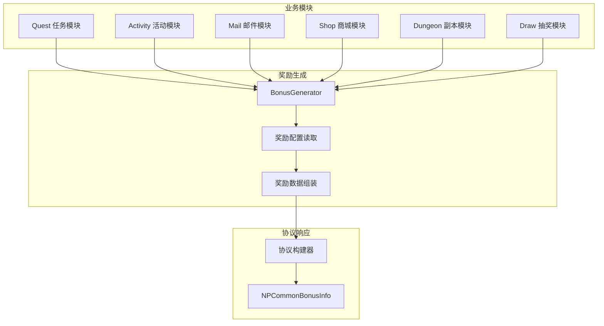
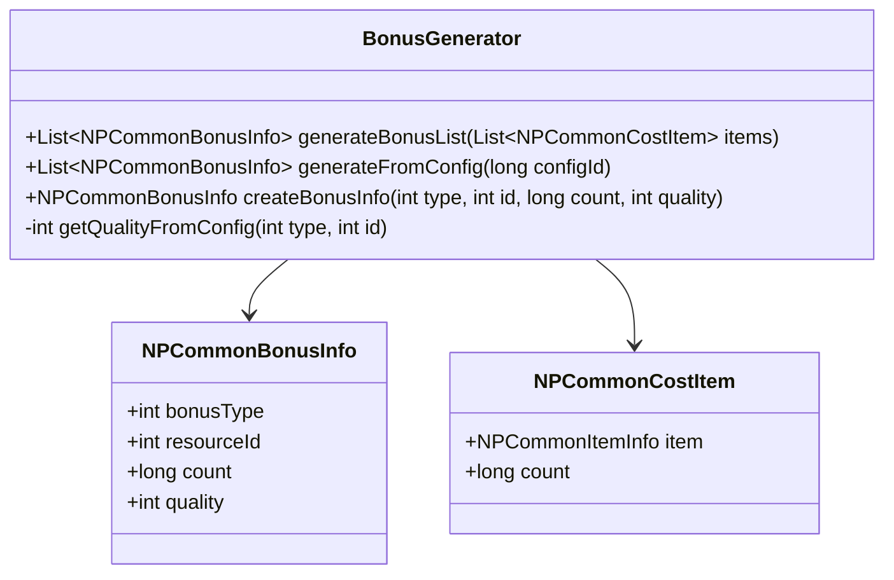
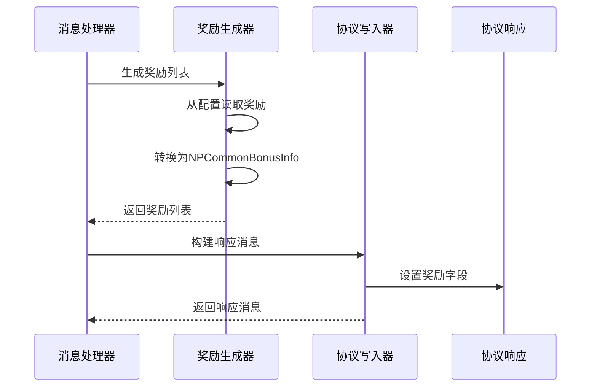

# Bonus 奖励系统模块 - 服务端开发文档

## 概述

**模块类型**: 客户端独立组件

本模块为客户端独立组件，服务端无对应独立模块。奖励数据由各业务模块在响应协议中携带，客户端统一解析展示。

---

## 一、服务端支持架构

### 1.1 架构图



### 1.2 模块关系

| 业务模块 | 奖励生成时机 | 奖励来源 |
|----------|--------------|----------|
| Quest | 任务完成 | 任务配置奖励 |
| Activity | 领取活动奖励 | 活动配置奖励 |
| Mail | 邮件附件 | 邮件配置附件 |
| Shop | 购买商品 | 商品配置奖励 |
| Dungeon | 副本结算 | 副本配置奖励 |
| Draw | 抽卡结果 | 抽卡配置奖励 |

---

## 二、奖励数据生成

### 2.1 奖励生成器



### 2.2 奖励生成代码

```java
/// <summary>
/// 奖励生成器
/// </summary>
public class BonusGenerator
{
    /// <summary>
    /// 从物品列表生成奖励信息
    /// </summary>
    public List<NPCommonBonusInfo> generateBonusList(List<NPCommonCostItem> items)
    {
        List<NPCommonBonusInfo> result = new ArrayList<>();

        if (items == null || items.isEmpty())
        {
            return result;
        }

        for (NPCommonCostItem item : items)
        {
            NPCommonBonusInfo bonus = createBonusInfo(
                convertItemTypeToBonusType(item.item.itemType),
                item.item.itemId,
                item.count
            );
            result.add(bonus);
        }

        return result;
    }

    /// <summary>
    /// 从配置ID生成奖励信息
    /// </summary>
    public List<NPCommonBonusInfo> generateFromConfig(long configId)
    {
        BonusConfig config = BonusConfig.Ref().getRef(configId);
        if (config == null || config.rewardList == null)
        {
            return new ArrayList<>();
        }

        return generateBonusList(config.rewardList);
    }

    /// <summary>
    /// 创建奖励信息
    /// </summary>
    public NPCommonBonusInfo createBonusInfo(int bonusType, int resourceId, long count)
    {
        NPCommonBonusInfo bonus = new NPCommonBonusInfo();
        bonus.bonusType = bonusType;
        bonus.resourceId = resourceId;
        bonus.count = count;
        bonus.quality = getQualityFromConfig(bonusType, resourceId);
        return bonus;
    }

    /// <summary>
    /// 转换物品类型到奖励类型
    /// </summary>
    private int convertItemTypeToBonusType(int itemType)
    {
        switch (itemType)
        {
            case 1: return 2;  // 道具 -> ITEM
            case 2: return 3;  // 英雄 -> HERO
            case 3: return 1;  // 货币 -> RESOURCE
            case 4: return 4;  // 皮肤 -> SKIN
            case 5: return 5;  // 称号 -> TITLE
            default: return 2;
        }
    }

    /// <summary>
    /// 从配置获取品质
    /// </summary>
    private int getQualityFromConfig(int bonusType, int resourceId)
    {
        switch (bonusType)
        {
            case 1: // RESOURCE
                return 1; // 资源默认普通品质

            case 2: // ITEM
                ItemConfig itemConfig = ItemConfig.Ref().getRef(resourceId);
                return itemConfig != null ? itemConfig.quality : 1;

            case 3: // HERO
                HeroConfig heroConfig = HeroConfig.Ref().getRef(resourceId);
                return heroConfig != null ? heroConfig.quality : 1;

            case 4: // SKIN
                SkinConfig skinConfig = SkinConfig.Ref().getRef(resourceId);
                return skinConfig != null ? skinConfig.quality : 1;

            case 5: // TITLE
                TitleConfig titleConfig = TitleConfig.Ref().getRef(resourceId);
                return titleConfig != null ? titleConfig.quality : 1;

            default:
                return 1;
        }
    }
}
```

---

## 三、协议写入器

### 3.1 协议写入流程



### 3.2 协议写入器代码

```java
/// <summary>
/// 奖励协议写入器
/// </summary>
public class US2GCWriter_Bonus
{
    /// <summary>
    /// 构建奖励信息列表
    /// </summary>
    public static List<NPCommonBonusInfo> makeBonusInfoList(List<NPCommonCostItem> items)
    {
        return BonusGenerator.getInstance().generateBonusList(items);
    }

    /// <summary>
    /// 构建单个奖励信息
    /// </summary>
    public static NPCommonBonusInfo makeBonusInfo(int bonusType, int resourceId, long count, int quality)
    {
        NPCommonBonusInfo bonus = new NPCommonBonusInfo();
        bonus.bonusType = bonusType;
        bonus.resourceId = resourceId;
        bonus.count = count;
        bonus.quality = quality;
        return bonus;
    }

    /// <summary>
    /// 从配置构建奖励列表
    /// </summary>
    public static List<NPCommonBonusInfo> makeBonusInfoFromConfig(long configId)
    {
        return BonusGenerator.getInstance().generateFromConfig(configId);
    }
}
```

---

## 四、业务模块集成示例

### 4.1 任务模块集成

```java
/// <summary>
/// 任务完成处理器
/// </summary>
public class MsgDealer_GC2GS_XXX_CompleteQuest extends NPUserMsgDealer<GC2GS_XXX_CompleteQuest>
{
    @Override
    protected void _dealMessage(_ANPUSUserBasicMsgItem _commiter, GC2GS_XXX_CompleteQuest _msg)
    {
        NPUSUserData userData = _commiter.getUserData();
        if (userData == null) return;

        // 获取任务配置
        long questId = _msg.getQuestId();
        QuestConfig questConfig = QuestConfig.Ref().getRef(questId);
        if (questConfig == null)
        {
            _commiter.commitFailRes(CommErr.REF_NOT_FOUND);
            return;
        }

        // 执行任务完成逻辑
        NPPlayerContext context = NPPlayerContext.createNew(ENPGameEvent.QUEST_COMPLETE);
        Result result = userData.getQuestComponent().completeQuest(questId, context);

        if (!result.isSucc())
        {
            _commiter.commitFailRes(result.getCode());
            return;
        }

        // 生成奖励列表
        List<NPCommonBonusInfo> rewardList = US2GCWriter_Bonus.makeBonusInfoList(
            questConfig.rewardList
        );

        // 发放奖励
        userData.gainItemList(questConfig.rewardList, context);

        // 构建响应
        GS2GC_XXX_RetCompleteQuest response = new GS2GC_XXX_RetCompleteQuest();
        response.setRewardList(rewardList);

        _commiter.commitSucRes(response);
    }
}
```

### 4.2 邮件模块集成

```java
/// <summary>
/// 邮件读取处理器
/// </summary>
public class MsgDealer_GC2GS_XXX_ReadMail extends NPUserMsgDealer<GC2GS_XXX_ReadMail>
{
    @Override
    protected void _dealMessage(_ANPUSUserBasicMsgItem _commiter, GC2GS_XXX_ReadMail _msg)
    {
        NPUSUserData userData = _commiter.getUserData();
        if (userData == null) return;

        long mailId = _msg.getMailId();
        PlayerMail mail = userData.getMailComponent().getMail(mailId);

        if (mail == null)
        {
            _commiter.commitFailRes(MailErr.MAIL_NOT_FOUND);
            return;
        }

        // 标记已读
        mail.setRead(true);

        // 生成附件列表
        List<NPCommonBonusInfo> attachmentList = null;
        if (mail.getAttachmentList() != null && !mail.getAttachmentList().isEmpty())
        {
            attachmentList = US2GCWriter_Bonus.makeBonusInfoList(mail.getAttachmentList());
        }

        // 构建响应
        GS2GC_XXX_RetReadMail response = new GS2GC_XXX_RetReadMail();
        response.setMailId(mailId);
        response.setAttachmentList(attachmentList);

        _commiter.commitSucRes(response);
    }
}
```

### 4.3 副本模块集成

```java
/// <summary>
/// 副本结算处理器
/// </summary>
public class MsgDealer_GC2GS_XXX_FinishDungeon extends NPUserMsgDealer<GC2GS_XXX_FinishDungeon>
{
    @Override
    protected void _dealMessage(_ANPUSUserBasicMsgItem _commiter, GC2GS_XXX_FinishDungeon _msg)
    {
        NPUSUserData userData = _commiter.getUserData();
        if (userData == null) return;

        long dungeonId = _msg.getDungeonId();
        int star = _msg.getStar();

        // 获取副本配置
        DungeonConfig dungeonConfig = DungeonConfig.Ref().getRef(dungeonId);
        if (dungeonConfig == null)
        {
            _commiter.commitFailRes(CommErr.REF_NOT_FOUND);
            return;
        }

        // 执行结算逻辑
        NPPlayerContext context = NPPlayerContext.createNew(ENPGameEvent.DUNGEON_FINISH);

        // 计算奖励
        List<NPCommonCostItem> rewards = calculateRewards(dungeonConfig, star);

        // 发放奖励
        userData.gainItemList(rewards, context);

        // 生成奖励列表
        List<NPCommonBonusInfo> rewardList = US2GCWriter_Bonus.makeBonusInfoList(rewards);

        // 构建响应
        GS2GC_XXX_RetFinishDungeon response = new GS2GC_XXX_RetFinishDungeon();
        response.setDungeonId(dungeonId);
        response.setStar(star);
        response.setRewardList(rewardList);

        _commiter.commitSucRes(response);
    }

    /// <summary>
    /// 计算副本奖励
    /// </summary>
    private List<NPCommonCostItem> calculateRewards(DungeonConfig config, int star)
    {
        List<NPCommonCostItem> rewards = new ArrayList<>();

        // 基础奖励
        if (config.baseRewards != null)
        {
            rewards.addAll(config.baseRewards);
        }

        // 星级奖励
        if (star >= 3 && config.threeStarRewards != null)
        {
            rewards.addAll(config.threeStarRewards);
        }

        return rewards;
    }
}
```

### 4.4 抽卡模块集成

```java
/// <summary>
/// 抽卡处理器
/// </summary>
public class MsgDealer_GC2GS_XXX_DrawCard extends NPUserMsgDealer<GC2GS_XXX_DrawCard>
{
    @Override
    protected void _dealMessage(_ANPUSUserBasicMsgItem _commiter, GC2GS_XXX_DrawCard _msg)
    {
        NPUSUserData userData = _commiter.getUserData();
        if (userData == null) return;

        int drawCount = _msg.getDrawCount();

        // 执行抽卡逻辑
        List<NPCommonCostItem> drawResults = new ArrayList<>();
        for (int i = 0; i < drawCount; i++)
        {
            NPCommonCostItem result = performDraw(userData);
            if (result != null)
            {
                drawResults.add(result);
            }
        }

        // 发放奖励
        NPPlayerContext context = NPPlayerContext.createNew(ENPGameEvent.DRAW_CARD);
        userData.gainItemList(drawResults, context);

        // 生成结果列表
        List<NPCommonBonusInfo> resultList = US2GCWriter_Bonus.makeBonusInfoList(drawResults);

        // 构建响应
        GS2GC_XXX_RetDrawCard response = new GS2GC_XXX_RetDrawCard();
        response.setResultList(resultList);

        _commiter.commitSucRes(response);
    }

    /// <summary>
    /// 执行单次抽卡
    /// </summary>
    private NPCommonCostItem performDraw(NPUSUserData userData)
    {
        // 抽卡概率计算
        // ...
        return null;
    }
}
```

---

## 五、配置文件路径

| 类型 | 路径 |
|------|------|
| 奖励配置 | `game_server/GameRes/src/NPGameRes/Refs/Bonus/` |
| 物品配置 | `game_server/GameRes/src/NPGameRes/Refs/Item/` |
| 英雄配置 | `game_server/GameRes/src/NPGameRes/Refs/Hero/` |
| 协议定义 | `game_server/ServerProtocol/src/GS2GC/` |
| 消息处理器 | `game_server/UserServer/src/NPUSServer/NPUserMsgDispather/` |

---

## 六、错误码定义

| 错误码 | 常量名 | 说明 | 处理建议 |
|--------|--------|------|----------|
| 100001 | BONUS_TYPE_INVALID | 奖励类型无效 | 使用默认类型 |
| 100002 | BONUS_CONFIG_MISSING | 奖励配置缺失 | 跳过该奖励 |
| 100003 | BONUS_RESOURCE_INVALID | 资源配置无效 | 跳过该奖励 |

---

## 七、数据校验

### 7.1 奖励数据校验

```java
/// <summary>
/// 校验奖励数据
/// </summary>
public boolean validateBonusInfo(NPCommonBonusInfo bonus)
{
    if (bonus == null) return false;

    // 校验类型
    if (bonus.getBonusType() < 1 || bonus.getBonusType() > 5)
    {
        log.warn("无效的奖励类型: {}", bonus.getBonusType());
        return false;
    }

    // 校验资源ID
    if (bonus.getResourceId() <= 0)
    {
        log.warn("无效的资源ID: {}", bonus.getResourceId());
        return false;
    }

    // 校验数量
    if (bonus.getCount() <= 0)
    {
        log.warn("无效的数量: {}", bonus.getCount());
        return false;
    }

    // 校验品质
    if (bonus.getQuality() < 1 || bonus.getQuality() > 6)
    {
        log.warn("无效的品质: {}", bonus.getQuality());
        return false;
    }

    return true;
}
```

---

## 八、测试用例

### 8.1 单元测试

```java
@Test
public void testGenerateBonusList()
{
    List<NPCommonCostItem> items = new ArrayList<>();
    items.add(new NPCommonCostItem(new NPCommonItemInfo(1, 50001), 100));
    items.add(new NPCommonCostItem(new NPCommonItemInfo(3, 1), 1000));

    List<NPCommonBonusInfo> bonusList = BonusGenerator.getInstance().generateBonusList(items);

    assertEquals(2, bonusList.size());
    assertEquals(2, bonusList.get(0).getBonusType()); // ITEM
    assertEquals(1, bonusList.get(1).getBonusType()); // RESOURCE
}

@Test
public void testCreateBonusInfo()
{
    NPCommonBonusInfo bonus = BonusGenerator.getInstance().createBonusInfo(1, 100, 50);

    assertEquals(1, bonus.getBonusType());
    assertEquals(100, bonus.getResourceId());
    assertEquals(50, bonus.getCount());
    assertTrue(bonus.getQuality() >= 1 && bonus.getQuality() <= 6);
}
```

---

*文档生成时间: 2026-04-12*
*文档版本: v2.0.0*
