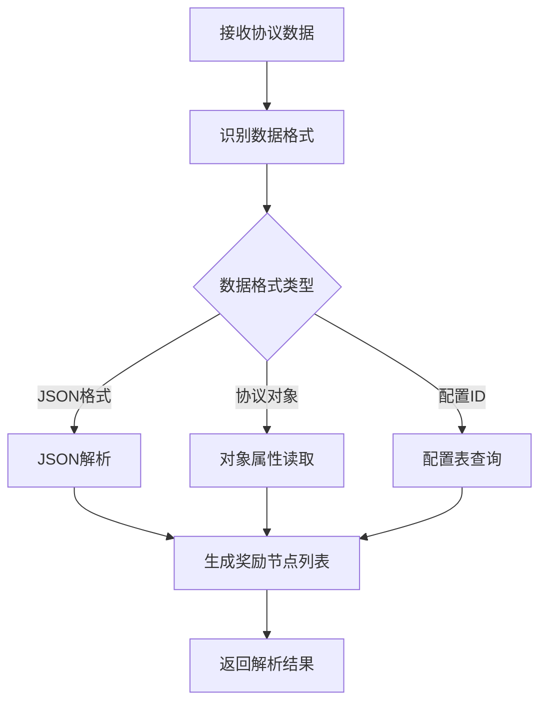
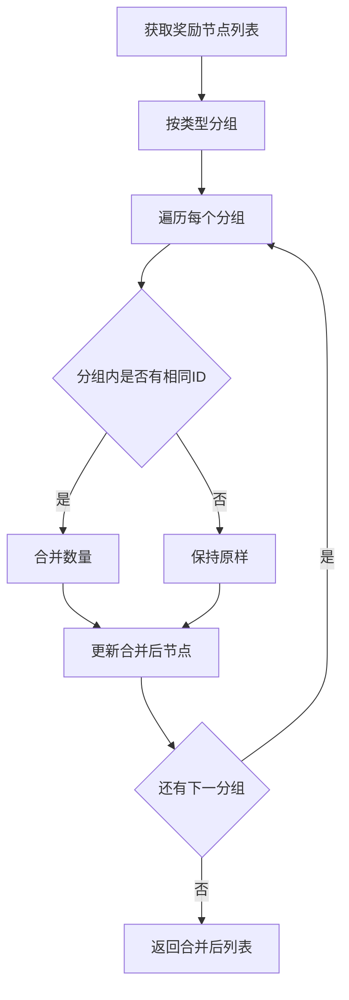
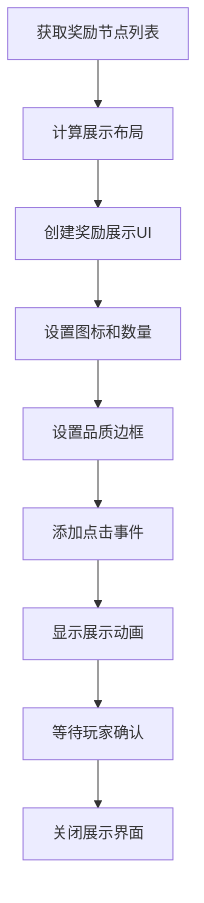

# 奖励模块完整说明

## 一、模块概述

### 1.1 业务背景

奖励模块是客户端独立的通用组件，提供奖励数据解析、合并、展示等功能。游戏内各种奖励（任务奖励、活动奖励、邮件附件等）都通过本模块统一处理，确保奖励展示的一致性和用户体验。

### 1.2 目标用户

- **所有游戏玩家**：每个获得奖励的玩家都会使用
- **UI开发人员**：使用奖励展示组件的开发者

### 1.3 核心价值

1. **统一展示**：提供一致的奖励展示体验
2. **数据解析**：解析各种格式的奖励数据
3. **智能合并**：合并相同类型的奖励减少显示
4. **复用性强**：客户端通用组件，各模块复用

---

## 二、功能清单

### 2.1 奖励解析功能

| 功能名称 | 功能描述 | 用户价值 |
|---------|---------|---------|
| 协议解析 | 从协议数据中解析奖励列表 | 获取奖励信息 |
| 配置解析 | 从配置表中解析奖励配置 | 读取奖励定义 |
| 格式转换 | 转换不同格式的奖励数据 | 兼容多种数据源 |

### 2.2 奖励合并功能

| 功能名称 | 功能描述 | 用户价值 |
|---------|---------|---------|
| 类型合并 | 合并相同类型的奖励 | 简化展示 |
| 品质分组 | 按品质分组展示 | 突出重点 |
| 数量汇总 | 汇总相同奖励的数量 | 准确显示总量 |

### 2.3 奖励展示功能

| 功能名称 | 功能描述 | 用户价值 |
|---------|---------|---------|
| 图标展示 | 显示奖励物品图标 | 直观识别 |
| 数量显示 | 显示奖励数量 | 了解获得量 |
| 品质边框 | 根据品质显示边框 | 突出品质 |
| 名称提示 | 显示奖励名称和描述 | 了解奖励详情 |

### 2.4 奖励类型功能

| 功能名称 | 功能描述 | 用户价值 |
|---------|---------|---------|
| 资源类奖励 | 货币、体力等资源 | 基础奖励展示 |
| 物品类奖励 | 道具、材料等物品 | 物品奖励展示 |
| 英雄类奖励 | 英雄、英雄碎片等 | 英雄奖励展示 |
| 皮肤类奖励 | 英雄皮肤等 | 皮肤奖励展示 |
| 称号类奖励 | 玩家称号等 | 称号奖励展示 |

---

## 三、业务流程详解

### 3.1 奖励解析流程



**详细步骤说明**：

1. **数据接收**
   - 从协议回调中获取奖励数据
   - 识别数据格式类型

2. **格式处理**
   - JSON格式：直接解析
   - 协议对象：读取属性
   - 配置ID：查询配置表

3. **节点生成**
   - 创建奖励信息节点
   - 填充奖励属性
   - 返回节点列表

### 3.2 奖励合并流程



### 3.3 奖励展示流程



---

## 四、关键规则

### 4.1 奖励类型规则

1. **资源类**
   - 类型ID: 1
   - 包含：银两、钻石、体力等
   - 显示：资源图标 + 数量

2. **物品类**
   - 类型ID: 2
   - 包含：道具、材料、碎片等
   - 显示：物品图标 + 数量 + 品质边框

3. **英雄类**
   - 类型ID: 3
   - 包含：英雄、英雄碎片
   - 显示：英雄头像 + 名称

4. **皮肤类**
   - 类型ID: 4
   - 包含：英雄皮肤
   - 显示：皮肤预览图

5. **称号类**
   - 类型ID: 5
   - 包含：玩家称号
   - 显示：称号名称 + 特效

### 4.2 合并规则

1. **可合并条件**
   - 相同类型
   - 相同配置ID
   - 都可堆叠

2. **合并结果**
   - 数量相加
   - 其他属性保持不变

### 4.3 展示规则

1. **排序规则**
   - 按品质降序排列
   - 同品质按类型排序
   - 同类型按ID排序

2. **布局规则**
   - 每行最多显示N个奖励
   - 超出换行显示
   - 自动居中对齐

### 4.4 交互规则

1. **点击响应**
   - 单击显示详细信息
   - 长按无特殊响应

2. **关闭条件**
   - 点击确认按钮关闭
   - 点击空白区域关闭（可配置）

---

## 五、用户故事

### 5.1 普通玩家故事

> 作为一名普通玩家，我完成了一个任务后获得了奖励。弹窗显示了所有奖励，图标清晰，数量明确。我点击了一个不熟悉的道具图标，看到了详细说明，了解了这个道具的用途。

### 5.2 收集玩家故事

> 作为一名收集型玩家，我开启了多个礼包。奖励展示界面把相同的材料合并显示了，我一眼就能看出总共获得了多少材料，不用担心重复显示造成困扰。

### 5.3 新手玩家故事

> 作为一名新手玩家，我对很多奖励都不熟悉。奖励展示界面清晰地展示了每个奖励的图标和名称，我可以点击查看详情，快速了解获得的内容。

---

## 六、示例

### 6.1 奖励节点示例

**奖励数据**：
```
奖励类型: 物品类 (2)
资源ID: 10001 (初级体力药水)
数量: 5
品质: 普通 (1)
```

**BonusInfoNode数据**：
```csharp
BonusInfoNode node = new BonusInfoNode {
    bonusId = 10001,
    bonusType = 2,
    resourceId = 10001,
    count = 5,
    quality = 1
};
```

### 6.2 奖励解析示例

**协议数据**：
```json
{
    "rewards": [
        { "type": 1, "id": 1, "count": 1000 },  // 银两×1000
        { "type": 1, "id": 2, "count": 100 },   // 钻石×100
        { "type": 2, "id": 10001, "count": 5 }, // 体力药水×5
        { "type": 2, "id": 10001, "count": 3 }  // 体力药水×3
    ]
}
```

**解析并合并后**：
```csharp
List<BonusInfoNode> nodes = new List<BonusInfoNode> {
    new BonusInfoNode { bonusType = 1, resourceId = 1, count = 1000 },
    new BonusInfoNode { bonusType = 1, resourceId = 2, count = 100 },
    new BonusInfoNode { bonusType = 2, resourceId = 10001, count = 8 }  // 合并后
};
```

### 6.3 奖励展示示例

**展示数据**：
```
奖励列表:
  - 银两 × 1000 (资源类，普通品质)
  - 钻石 × 100 (资源类，高级品质)
  - 精良装备箱 × 1 (物品类，蓝色品质)
  - 史诗英雄碎片 × 10 (物品类，紫色品质)
```

**展示效果**：
```
┌─────────────────────────────────────┐
│            获得奖励                 │
├─────────────────────────────────────┤
│  ┌───┐  ┌───┐  ┌───┐  ┌───┐        │
│  │💎 │  │💰 │  │📦 │  │⭐ │        │
│  │×100│  │×1000│ │×1 │  │×10│        │
│  └───┘  └───┘  └───┘  └───┘        │
│                                      │
│           [ 确定 ]                   │
└─────────────────────────────────────┘
```

---

*文档生成时间: 2026-04-07*
