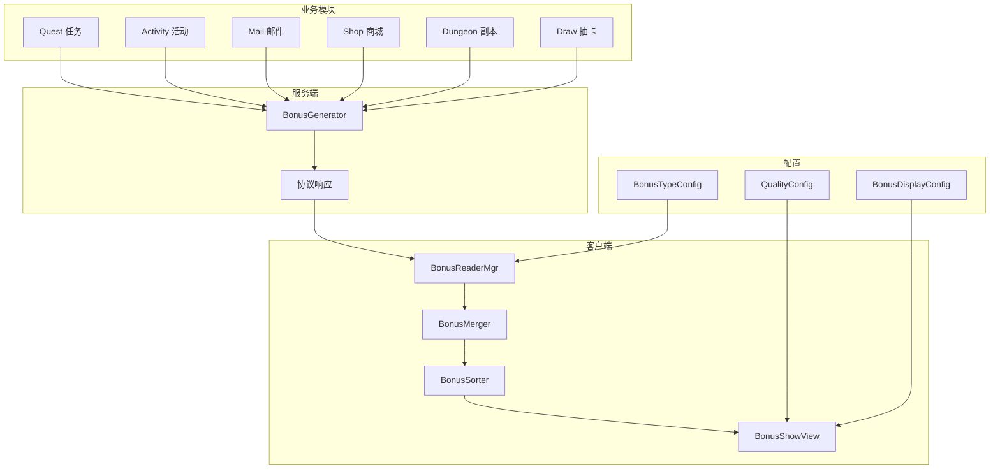
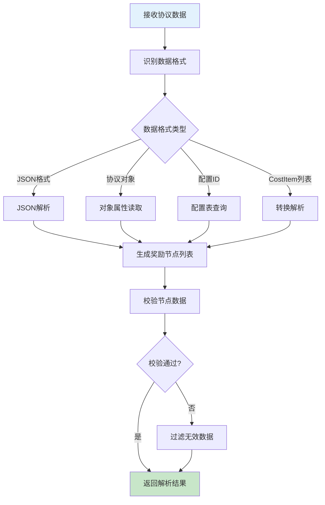
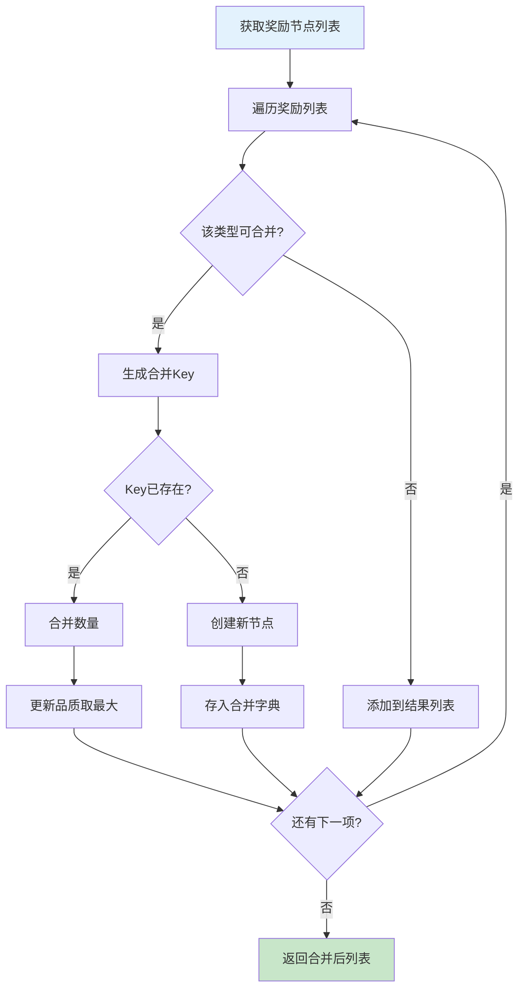
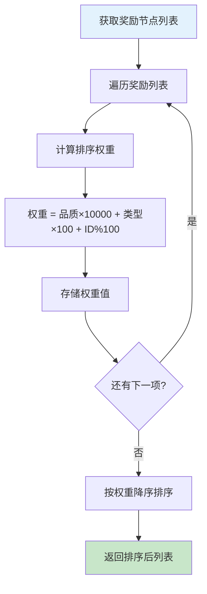
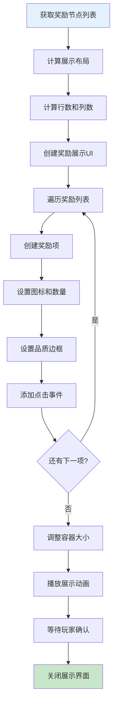
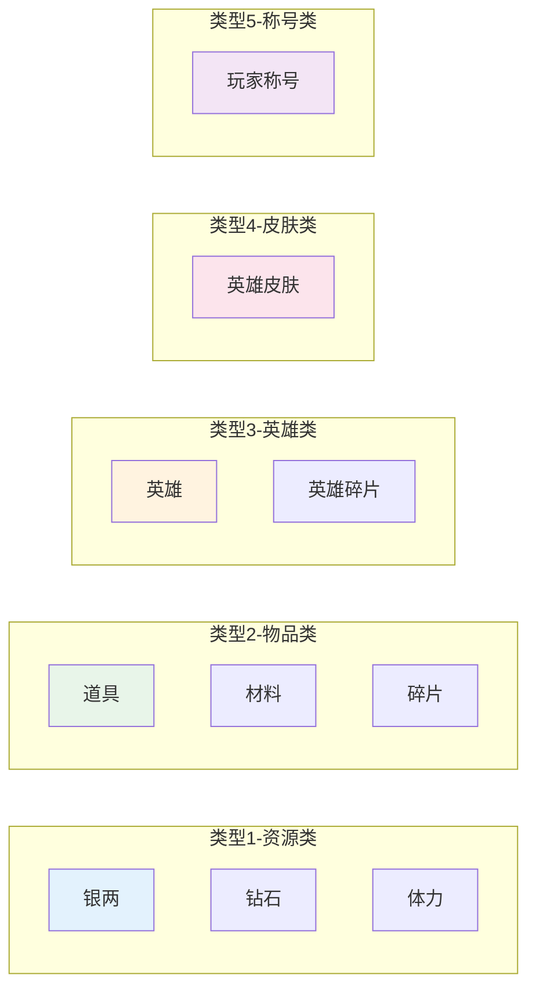
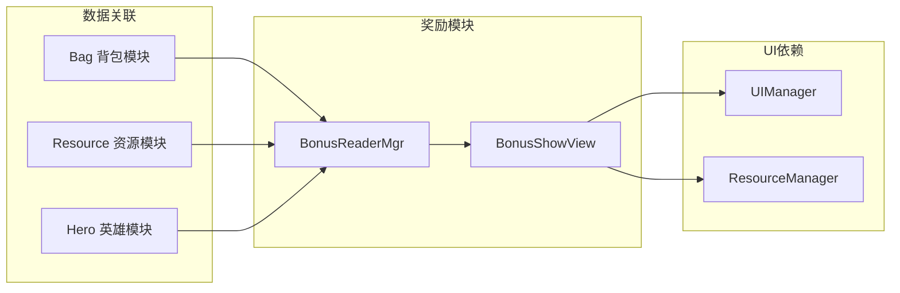
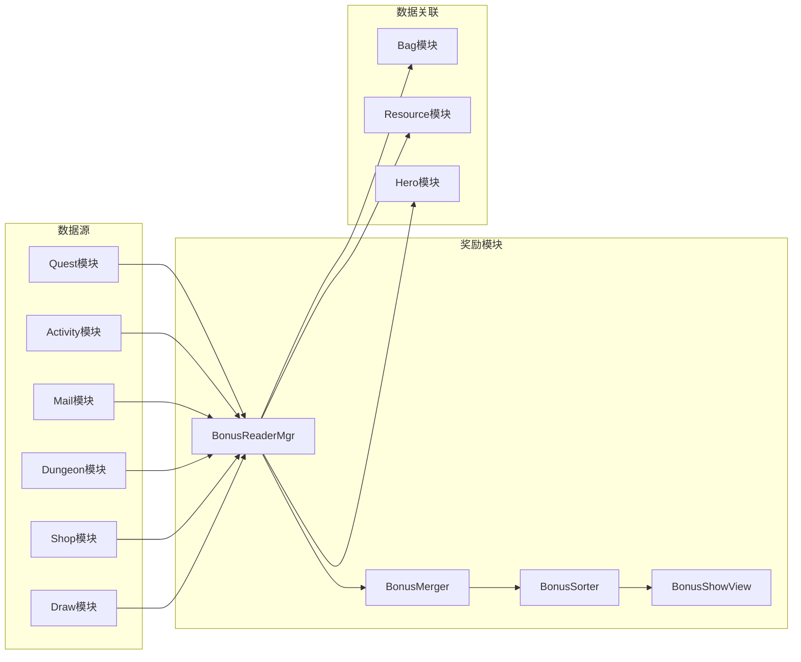

# 奖励模块完整说明

## 一、模块概述

### 1.1 业务背景

奖励模块是客户端独立的通用组件，提供奖励数据解析、合并、展示等功能。游戏内各种奖励（任务奖励、活动奖励、邮件附件等）都通过本模块统一处理，确保奖励展示的一致性和用户体验。

### 1.2 目标用户

- **所有游戏玩家**：每个获得奖励的玩家都会使用
- **UI开发人员**：使用奖励展示组件的开发者
- **服务端开发人员**：生成奖励数据并在协议中携带

### 1.3 核心价值

1. **统一展示**：提供一致的奖励展示体验
2. **数据解析**：解析各种格式的奖励数据
3. **智能合并**：合并相同类型的奖励减少显示
4. **复用性强**：客户端通用组件，各模块复用

### 1.4 模块架构图



---

## 二、功能清单

### 2.1 奖励解析功能

| 功能名称 | 功能描述 | 用户价值 |
|---------|---------|---------|
| 协议解析 | 从协议数据中解析奖励列表 | 获取奖励信息 |
| 配置解析 | 从配置表中解析奖励配置 | 读取奖励定义 |
| 格式转换 | 转换不同格式的奖励数据 | 兼容多种数据源 |
| JSON解析 | 解析JSON格式的奖励数据 | 支持动态配置 |

### 2.2 奖励合并功能

| 功能名称 | 功能描述 | 用户价值 |
|---------|---------|---------|
| 类型合并 | 合并相同类型的奖励 | 简化展示 |
| 品质分组 | 按品质分组展示 | 突出重点 |
| 数量汇总 | 汇总相同奖励的数量 | 准确显示总量 |
| 智能过滤 | 过滤无效或空奖励 | 提升体验 |

### 2.3 奖励展示功能

| 功能名称 | 功能描述 | 用户价值 |
|---------|---------|---------|
| 图标展示 | 显示奖励物品图标 | 直观识别 |
| 数量显示 | 显示奖励数量 | 了解获得量 |
| 品质边框 | 根据品质显示边框 | 突出品质 |
| 名称提示 | 显示奖励名称和描述 | 了解奖励详情 |
| 动画效果 | 展示获得奖励的动画 | 增强体验 |

### 2.4 奖励类型功能

| 功能名称 | 功能描述 | 用户价值 |
|---------|---------|---------|
| 资源类奖励 | 货币、体力等资源 | 基础奖励展示 |
| 物品类奖励 | 道具、材料等物品 | 物品奖励展示 |
| 英雄类奖励 | 英雄、英雄碎片等 | 英雄奖励展示 |
| 皮肤类奖励 | 英雄皮肤等 | 皮肤奖励展示 |
| 称号类奖励 | 玩家称号等 | 称号奖励展示 |

---

## 三、业务流程详解

### 3.1 奖励解析流程



**详细步骤说明**：

1. **数据接收**
   - 从协议回调中获取奖励数据
   - 识别数据格式类型

2. **格式处理**
   - JSON格式：直接解析
   - 协议对象：读取属性
   - 配置ID：查询配置表
   - CostItem列表：转换解析

3. **节点生成**
   - 创建奖励信息节点
   - 填充奖励属性
   - 返回节点列表

### 3.2 奖励合并流程



**合并规则说明**：

1. **可合并条件**
   - 相同类型 (bonusType)
   - 相同资源ID (resourceId)
   - 配置允许合并 (canMerge = true)

2. **合并结果**
   - 数量相加
   - 品质取最大值
   - 其他属性保持不变

### 3.3 奖励排序流程



**排序规则说明**：

1. **排序权重计算**
   - 品质权重：品质 × 10000
   - 类型权重：类型 × 100
   - ID权重：resourceId % 100

2. **排序结果**
   - 高品质奖励在前
   - 同品质按类型排序
   - 同类型按ID排序

### 3.4 奖励展示流程



---

## 四、关键规则

### 4.1 奖励类型规则



### 4.2 品质规则

| 品质 | 名称 | 颜色 | 排序权重 | 说明 |
|------|------|------|----------|------|
| 1 | 普通 | 白色 #FFFFFF | 10000 | 最常见品质 |
| 2 | 精良 | 绿色 #1EFF00 | 20000 | 较好品质 |
| 3 | 优秀 | 蓝色 #0070DD | 30000 | 优秀品质 |
| 4 | 史诗 | 紫色 #A335EE | 40000 | 稀有品质 |
| 5 | 传说 | 橙色 #FF8000 | 50000 | 极稀有品质 |
| 6 | 神话 | 金色 #E6CC80 | 60000 | 最高品质 |

### 4.3 合并规则

| 类型 | 可合并 | 说明 |
|------|--------|------|
| 1-资源类 | 是 | 相同资源ID合并 |
| 2-物品类 | 是 | 相同物品ID合并 |
| 3-英雄类 | 否 | 不合并，单独展示 |
| 4-皮肤类 | 否 | 不合并，单独展示 |
| 5-称号类 | 否 | 不合并，单独展示 |

### 4.4 展示规则

1. **排序规则**
   - 按品质降序排列
   - 同品质按类型排序
   - 同类型按ID排序

2. **布局规则**
   - 每行最多显示N个奖励（可配置）
   - 超出换行显示
   - 自动居中对齐

3. **交互规则**
   - 单击显示详细信息
   - 长按无特殊响应

---

## 五、数据结构

### 5.1 BonusInfoNode 完整字段列表

| 字段名 | 类型 | 必填 | 默认值 | 说明 | 约束条件 |
|--------|------|------|--------|------|----------|
| bonusId | int | 是 | - | 奖励ID | 唯一，> 0 |
| bonusType | int | 是 | - | 奖励类型 | 1-5 |
| resourceId | int | 是 | - | 资源ID | > 0 |
| count | long | 是 | 1 | 数量 | >= 1 |
| quality | int | 是 | 1 | 品质 | 1-6 |

### 5.2 NPCommonBonusInfo 完整字段列表

| 字段名 | 类型 | 必填 | 默认值 | 说明 | 约束条件 |
|--------|------|------|--------|------|----------|
| bonusType | int | 是 | - | 奖励类型 | 1-5 |
| resourceId | int | 是 | - | 资源ID | > 0 |
| count | long | 是 | - | 数量 | >= 1 |
| quality | int | 是 | - | 品质 | 1-6 |

---

## 六、用户故事

### 6.1 普通玩家故事

> 作为一名普通玩家，我完成了一个任务后获得了奖励。弹窗显示了所有奖励，图标清晰，数量明确。我点击了一个不熟悉的道具图标，看到了详细说明，了解了这个道具的用途。

### 6.2 收集玩家故事

> 作为一名收集型玩家，我开启了多个礼包。奖励展示界面把相同的材料合并显示了，我一眼就能看出总共获得了多少材料，不用担心重复显示造成困扰。

### 6.3 新手玩家故事

> 作为一名新手玩家，我对很多奖励都不熟悉。奖励展示界面清晰地展示了每个奖励的图标和名称，我可以点击查看详情，快速了解获得的内容。

### 6.4 氪金玩家故事

> 作为一名氪金玩家，我进行了十连抽。奖励展示界面用动画逐个展示了抽到的物品，高品质物品有华丽的边框和特效，让我获得了满足感。

---

## 七、示例

### 7.1 奖励节点示例

**奖励数据**：
```
奖励类型: 物品类 (2)
资源ID: 10001 (初级体力药水)
数量: 5
品质: 普通 (1)
```

**BonusInfoNode数据**：
```csharp
BonusInfoNode node = new BonusInfoNode {
    bonusId = 10001,
    bonusType = 2,
    resourceId = 10001,
    count = 5,
    quality = 1
};
```

### 7.2 奖励解析示例

**协议数据**：
```json
{
    "rewards": [
        { "type": 1, "id": 1, "count": 1000 },
        { "type": 1, "id": 2, "count": 100 },
        { "type": 2, "id": 10001, "count": 5 },
        { "type": 2, "id": 10001, "count": 3 }
    ]
}
```

**解析并合并后**：
```csharp
List<BonusInfoNode> nodes = new List<BonusInfoNode> {
    new BonusInfoNode { bonusType = 1, resourceId = 1, count = 1000 },
    new BonusInfoNode { bonusType = 1, resourceId = 2, count = 100 },
    new BonusInfoNode { bonusType = 2, resourceId = 10001, count = 8 }  // 合并后
};
```

### 7.3 奖励展示示例

**展示数据**：
```
奖励列表:
  - 银两 × 1000 (资源类，普通品质)
  - 钻石 × 100 (资源类，史诗品质)
  - 精良装备箱 × 1 (物品类，优秀品质)
  - 史诗英雄碎片 × 10 (物品类，史诗品质)
```

**展示效果**：
```
┌─────────────────────────────────────┐
│            获得奖励                 │
├─────────────────────────────────────┤
│  ┌───┐  ┌───┐  ┌───┐  ┌───┐        │
│  │💎 │  │💰 │  │📦 │  │⭐ │        │
│  │×100│  │×1000│ │×1 │  │×10│        │
│  └───┘  └───┘  └───┘  └───┘        │
│                                      │
│           [ 确定 ]                   │
└─────────────────────────────────────┘
```

---

## 八、跨模块依赖

### 8.1 依赖模块



### 8.2 被依赖情况

| 模块名称 | 依赖方式 | 依赖说明 |
|----------|----------|----------|
| Quest | 功能调用 | 任务奖励展示 |
| Activity | 功能调用 | 活动奖励展示 |
| Mail | 功能调用 | 邮件附件展示 |
| Dungeon | 功能调用 | 副本奖励展示 |
| Shop | 功能调用 | 购买结果展示 |
| Draw | 功能调用 | 抽卡结果展示 |
| Sign | 功能调用 | 签到奖励展示 |

### 8.3 接口依赖图



---

## 九、配置文件位置

| 类型 | 路径 |
|------|------|
| 组件类 | `game_client/Assets/Scripts/LogicScripts/GameComponent/Bonus/` |
| 管理器 | `game_client/Assets/Scripts/ResScripts/NPResCommon/UnionBonus/` |
| UI界面 | `game_client/Assets/Scripts/LogicScripts/GameWndGui/GGui/Bonus/` |
| 预制体 | `game_client/Assets/Resources/Prefabs/UI/Bonus/` |
| 服务端配置 | `game_server/GameRes/src/NPGameRes/Refs/Bonus/` |

---

*文档生成时间: 2026-04-12*
*文档版本: v2.0.0*
