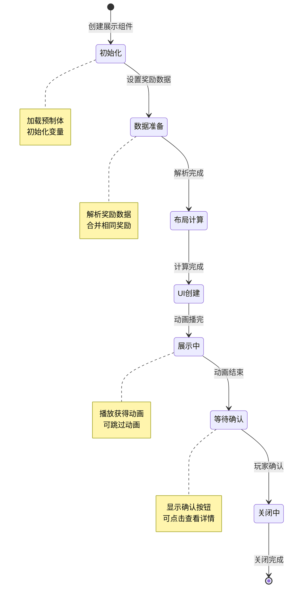
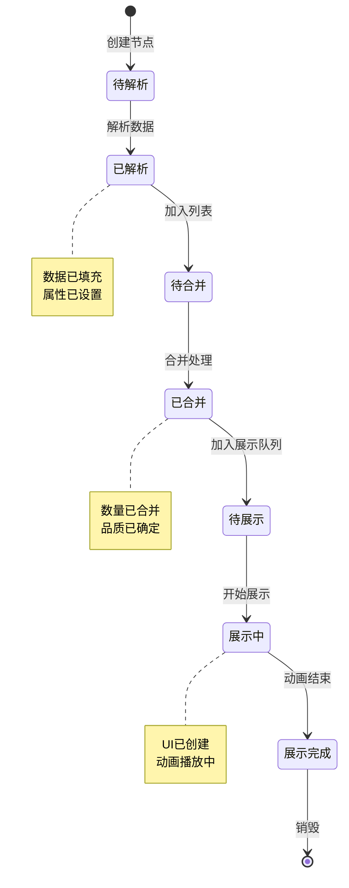
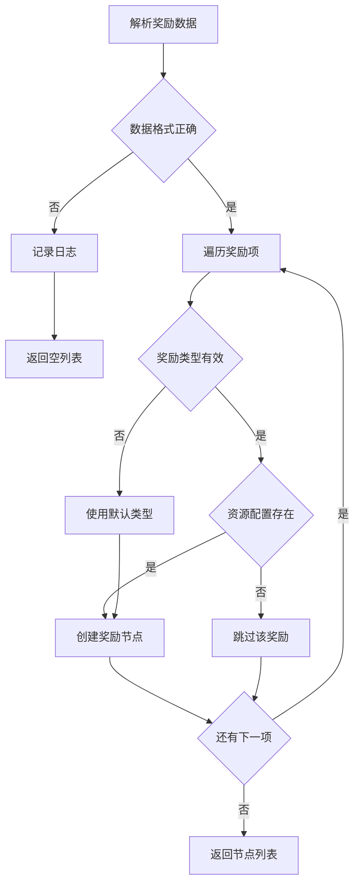
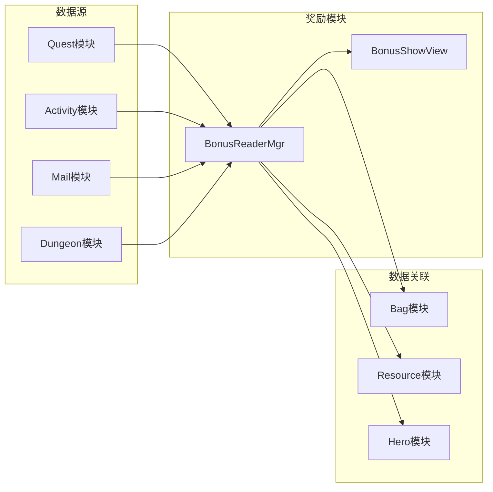

# 奖励模块实现细节

## 一、计算公式

### 1.1 奖励合并计算

```
合并后数量 = Σ(相同ID奖励的数量)
合并后品质 = max(相同ID奖励的品质)
```

**示例计算**：
```
原始列表:
  - ID:10001, 数量:5, 品质:1
  - ID:10001, 数量:3, 品质:2
  - ID:10001, 数量:2, 品质:1

合并后:
  - ID:10001, 数量:10, 品质:2
```

### 1.2 展示布局计算

```
每行数量 = min(奖励总数, 每行最大数量)
行数 = ceil(奖励总数 / 每行数量)
每个格子宽度 = (容器宽度 - 间距×(每行数量+1)) / 每行数量
```

**示例计算**：
```
奖励总数: 8
每行最大数量: 5
容器宽度: 500px
间距: 10px

每行数量 = min(8, 5) = 5
行数 = ceil(8 / 5) = 2
第一行: 5个
第二行: 3个
格子宽度 = (500 - 10×6) / 5 = 88px
```

### 1.3 品质排序权重

```
排序权重 = 品质 × 10000 + 类型 × 100 + ID
排序顺序: 按权重降序
```

**示例计算**：
```
奖励A: 品质5, 类型2, ID100 → 权重 = 50200
奖励B: 品质4, 类型3, ID50  → 权重 = 40300
奖励C: 品质5, 类型1, ID200 → 权重 = 50100

排序结果: A > C > B
```

---

## 二、状态机定义

### 2.1 奖励展示状态机



### 2.2 奖励节点状态机



---

## 三、数据约束

### 3.1 奖励信息节点约束

| 字段名 | 数据类型 | 取值范围 | 必填 | 说明 |
|--------|----------|----------|------|------|
| bonusId | int | > 0 | 是 | 奖励ID |
| bonusType | int | 1-5 | 是 | 奖励类型 |
| resourceId | int | > 0 | 是 | 资源ID |
| count | long | >= 1 | 是 | 数量 |
| quality | int | 1-6 | 是 | 品质 |

### 3.2 奖励类型配置约束

| 字段名 | 数据类型 | 取值范围 | 必填 | 说明 |
|--------|----------|----------|------|------|
| typeId | int | 1-5 | 是 | 类型ID |
| typeName | string | 非空 | 是 | 类型名称 |
| iconPrefix | string | 非空 | 是 | 图标前缀 |
| canMerge | bool | - | 是 | 是否可合并 |

### 3.3 奖励展示配置约束

| 字段名 | 数据类型 | 取值范围 | 必填 | 说明 |
|--------|----------|----------|------|------|
| maxPerRow | int | 3-8 | 是 | 每行最大数量 |
| itemSize | int | 50-150 | 是 | 格子大小 |
| spacing | int | 5-20 | 是 | 间距 |
| showAnimation | bool | - | 是 | 是否显示动画 |

---

## 四、错误处理策略

### 4.1 奖励模块错误码

| 错误码 | 错误信息 | 处理策略 | 用户提示 |
|--------|----------|----------|----------|
| 100001 | 奖励类型无效 | 使用默认类型 | 显示默认图标 |
| 100002 | 奖励配置缺失 | 跳过该奖励 | 不显示该奖励 |
| 100003 | 图标资源缺失 | 使用占位图 | 显示默认图标 |
| 100004 | 数据解析失败 | 记录日志 | 显示错误提示 |

### 4.2 解析错误处理流程



### 4.3 展示错误处理

| 错误场景 | 处理策略 | 后续操作 |
|----------|----------|----------|
| 图标加载失败 | 使用默认图标 | 异步加载正确图标 |
| 奖励列表为空 | 显示空状态 | 提示无奖励 |
| 容器空间不足 | 自动换行 | 调整布局 |

---

## 五、关键代码示例

### 5.1 奖励解析伪代码

```csharp
public class BonusReaderMgr : MonoBehaviour
{
    public List<BonusInfoNode> ParseBonus(object bonusData)
    {
        List<BonusInfoNode> result = new List<BonusInfoNode>();

        if (bonusData == null)
        {
            return result;
        }

        // 根据数据类型解析
        if (bonusData is JsonData jsonData)
        {
            result = ParseFromJson(jsonData);
        }
        else if (bonusData is ProtocolObject protocolObj)
        {
            result = ParseFromProtocol(protocolObj);
        }
        else if (bonusData is long configId)
        {
            result = ParseFromConfig(configId);
        }

        return result;
    }

    private List<BonusInfoNode> ParseFromJson(JsonData jsonData)
    {
        List<BonusInfoNode> result = new List<BonusInfoNode>();

        if (jsonData.ContainsKey("rewards"))
        {
            foreach (JsonData reward in jsonData["rewards"])
            {
                BonusInfoNode node = new BonusInfoNode
                {
                    bonusType = (int)reward["type"],
                    resourceId = (int)reward["id"],
                    count = (long)reward["count"],
                    quality = GetQualityFromConfig((int)reward["id"])
                };
                result.Add(node);
            }
        }

        return result;
    }

    private List<BonusInfoNode> ParseFromProtocol(ProtocolObject protocolObj)
    {
        List<BonusInfoNode> result = new List<BonusInfoNode>();

        // 从协议对象读取奖励列表
        var rewardList = protocolObj.GetRewardList();
        foreach (var reward in rewardList)
        {
            BonusInfoNode node = new BonusInfoNode
            {
                bonusId = reward.GetId(),
                bonusType = reward.GetType(),
                resourceId = reward.GetResourceId(),
                count = reward.GetCount(),
                quality = reward.GetQuality()
            };
            result.Add(node);
        }

        return result;
    }
}
```

### 5.2 奖励合并伪代码

```csharp
public List<BonusInfoNode> MergeBonus(List<BonusInfoNode> bonusList)
{
    if (bonusList == null || bonusList.Count == 0)
    {
        return new List<BonusInfoNode>();
    }

    // 按类型和ID分组
    Dictionary<string, BonusInfoNode> mergedDict = new Dictionary<string, BonusInfoNode>();

    foreach (var node in bonusList)
    {
        string key = $"{node.bonusType}_{node.resourceId}";

        if (mergedDict.ContainsKey(key))
        {
            // 合并数量
            mergedDict[key].count += node.count;
            // 取最高品质
            mergedDict[key].quality = Math.Max(mergedDict[key].quality, node.quality);
        }
        else
        {
            // 创建新节点
            mergedDict[key] = new BonusInfoNode
            {
                bonusId = node.bonusId,
                bonusType = node.bonusType,
                resourceId = node.resourceId,
                count = node.count,
                quality = node.quality
            };
        }
    }

    return mergedDict.Values.ToList();
}
```

### 5.3 奖励排序伪代码

```csharp
public List<BonusInfoNode> SortBonus(List<BonusInfoNode> bonusList)
{
    return bonusList.OrderByDescending(node => CalculateSortWeight(node)).ToList();
}

private int CalculateSortWeight(BonusInfoNode node)
{
    // 品质权重最高，然后是类型，最后是ID
    return node.quality * 10000 + node.bonusType * 100 + (int)(node.resourceId % 100);
}
```

### 5.4 奖励展示伪代码

```csharp
public class BonusShowView : MonoBehaviour
{
    [SerializeField] private Transform contentContainer;
    [SerializeField] private GameObject bonusItemPrefab;
    [SerializeField] private int maxPerRow = 5;
    [SerializeField] private int itemSize = 80;
    [SerializeField] private int spacing = 10;

    public void ShowBonus(List<BonusInfoNode> bonusList)
    {
        // 清空容器
        foreach (Transform child in contentContainer)
        {
            Destroy(child.gameObject);
        }

        // 排序
        var sortedList = BonusReaderMgr.Instance.SortBonus(bonusList);

        // 计算布局
        int totalCount = sortedList.Count;
        int rowCount = Mathf.CeilToInt((float)totalCount / maxPerRow);

        // 创建奖励项
        for (int i = 0; i < totalCount; i++)
        {
            BonusInfoNode node = sortedList[i];
            GameObject itemObj = Instantiate(bonusItemPrefab, contentContainer);

            // 设置位置
            int row = i / maxPerRow;
            int col = i % maxPerRow;
            RectTransform rect = itemObj.GetComponent<RectTransform>();
            rect.anchoredPosition = new Vector2(
                col * (itemSize + spacing),
                -row * (itemSize + spacing)
            );

            // 设置内容
            BonusItemView itemView = itemObj.GetComponent<BonusItemView>();
            itemView.SetData(node);
        }

        // 调整容器大小
        AdjustContainerSize(rowCount);

        // 播放动画
        PlayShowAnimation();
    }

    private void AdjustContainerSize(int rowCount)
    {
        float height = rowCount * (itemSize + spacing) + spacing;
        contentContainer.GetComponent<RectTransform>().sizeDelta = new Vector2(0, height);
    }

    private void PlayShowAnimation()
    {
        // 逐个播放获得动画
        StartCoroutine(PlayItemAnimations());
    }

    private IEnumerator PlayItemAnimations()
    {
        foreach (Transform child in contentContainer)
        {
            child.localScale = Vector3.zero;
        }

        foreach (Transform child in contentContainer)
        {
            // 缩放动画
            child.DOScale(1f, 0.2f).SetEase(Ease.OutBack);
            yield return new WaitForSeconds(0.05f);
        }
    }
}
```

### 5.5 奖励项视图伪代码

```csharp
public class BonusItemView : MonoBehaviour
{
    [SerializeField] private Image iconImage;
    [SerializeField] private Image qualityFrame;
    [SerializeField] private Text countText;
    [SerializeField] private Button itemButton;

    private BonusInfoNode nodeData;

    public void SetData(BonusInfoNode node)
    {
        nodeData = node;

        // 设置图标
        Sprite icon = LoadIcon(node.bonusType, node.resourceId);
        if (icon != null)
        {
            iconImage.sprite = icon;
        }
        else
        {
            // 使用默认图标
            iconImage.sprite = GetDefaultIcon(node.bonusType);
        }

        // 设置品质边框
        Sprite frame = GetQualityFrame(node.quality);
        if (frame != null)
        {
            qualityFrame.sprite = frame;
        }

        // 设置数量
        if (node.count > 1)
        {
            countText.text = FormatCount(node.count);
            countText.gameObject.SetActive(true);
        }
        else
        {
            countText.gameObject.SetActive(false);
        }

        // 添加点击事件
        itemButton.onClick.RemoveAllListeners();
        itemButton.onClick.AddListener(OnItemClick);
    }

    private Sprite LoadIcon(int bonusType, int resourceId)
    {
        string iconPath = GetIconPath(bonusType, resourceId);
        return Resources.Load<Sprite>(iconPath);
    }

    private void OnItemClick()
    {
        // 显示详细信息
        string name = GetBonusName(nodeData);
        string desc = GetBonusDesc(nodeData);
        UIManager.Instance.ShowTooltip(name, desc);
    }

    private string FormatCount(long count)
    {
        if (count >= 1000000)
        {
            return $"{count / 1000000f:F1}M";
        }
        else if (count >= 1000)
        {
            return $"{count / 1000f:F1}K";
        }
        return count.ToString();
    }
}
```

---

## 六、跨模块依赖

### 6.1 依赖模块

| 模块名称 | 依赖方式 | 依赖说明 |
|----------|----------|----------|
| Bag | 数据关联 | 物品类奖励信息 |
| Resource | 数据关联 | 资源类奖励信息 |
| Hero | 数据关联 | 英雄类奖励信息 |
| UI | 功能调用 | 显示奖励弹窗 |

### 6.2 被依赖情况

| 模块名称 | 依赖方式 | 依赖说明 |
|----------|----------|----------|
| Quest | 功能调用 | 任务奖励展示 |
| Activity | 功能调用 | 活动奖励展示 |
| Mail | 功能调用 | 邮件附件展示 |
| Dungeon | 功能调用 | 副本奖励展示 |

### 6.3 接口依赖图



---

*文档生成时间: 2026-04-07*
