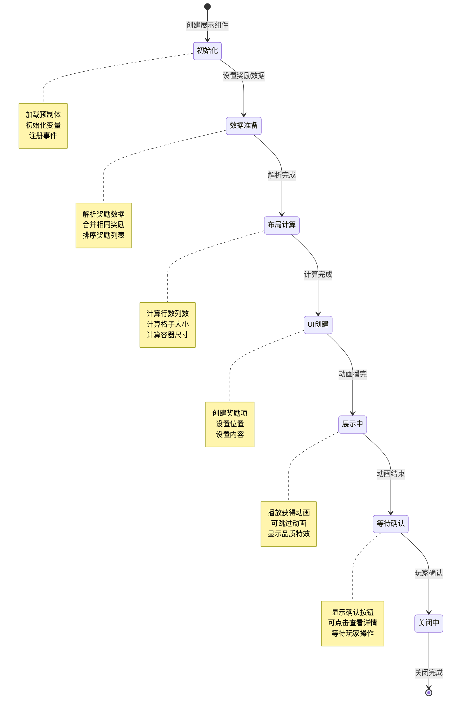
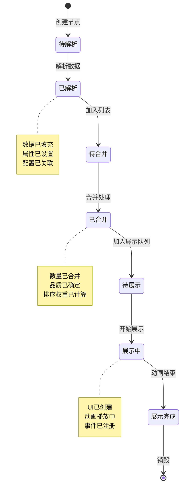
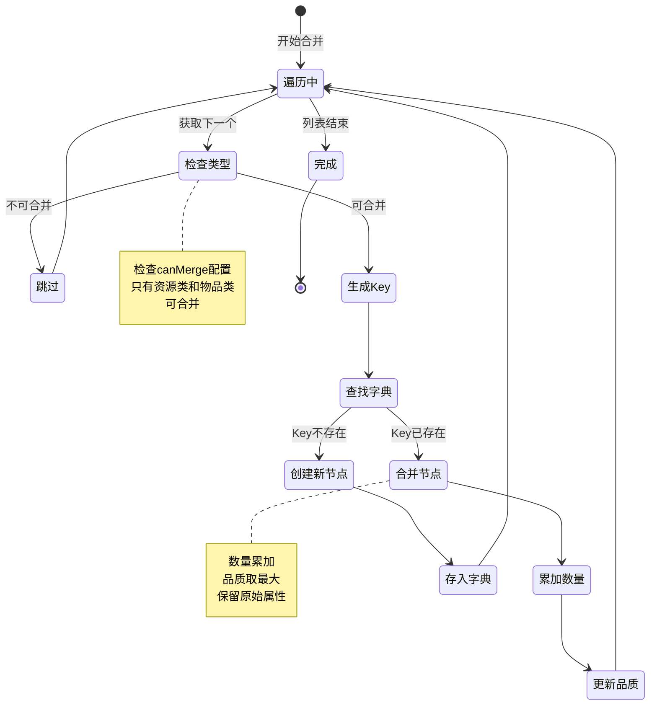
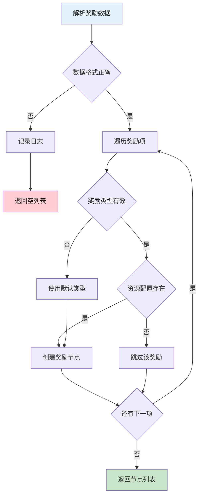
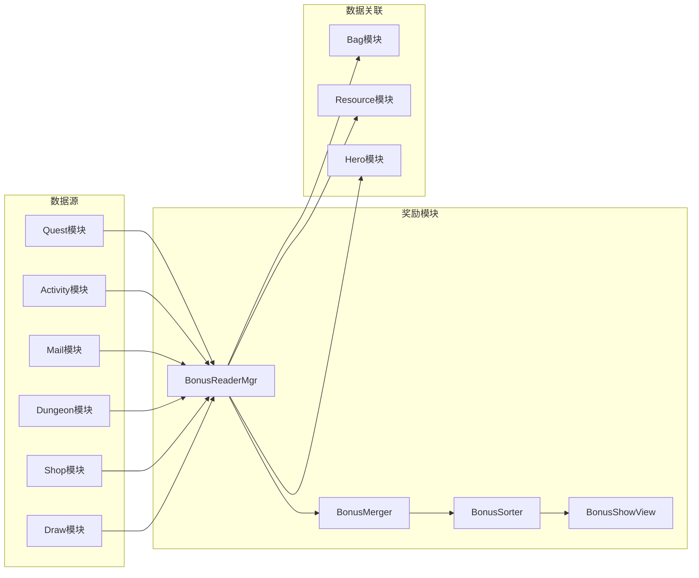

# 奖励模块实现细节

## 一、计算公式

### 1.1 奖励合并计算

```
合并后数量 = Σ(相同ID奖励的数量)
合并后品质 = max(相同ID奖励的品质)
```

**示例计算**：
```
原始列表:
  - ID:10001, 数量:5, 品质:1
  - ID:10001, 数量:3, 品质:2
  - ID:10001, 数量:2, 品质:1

合并后:
  - ID:10001, 数量:10, 品质:2
```

### 1.2 展示布局计算

```
每行数量 = min(奖励总数, 每行最大数量)
行数 = ceil(奖励总数 / 每行数量)
每个格子宽度 = (容器宽度 - 间距×(每行数量+1)) / 每行数量
```

**示例计算**：
```
奖励总数: 8
每行最大数量: 5
容器宽度: 500px
间距: 10px

每行数量 = min(8, 5) = 5
行数 = ceil(8 / 5) = 2
第一行: 5个
第二行: 3个
格子宽度 = (500 - 10×6) / 5 = 88px
```

### 1.3 品质排序权重

```
排序权重 = 品质 × 10000 + 类型 × 100 + ID
排序顺序: 按权重降序
```

**示例计算**：
```
奖励A: 品质5, 类型2, ID100 → 权重 = 50200
奖励B: 品质4, 类型3, ID50  → 权重 = 40300
奖励C: 品质5, 类型1, ID200 → 权重 = 50100

排序结果: A > C > B
```

### 1.4 数量格式化

```
数量 >= 1,000,000: 显示为 X.XM
数量 >= 1,000: 显示为 X.XK
数量 < 1,000: 显示原数字
```

**示例**：
```
1,234,567 → 1.2M
12,345 → 12.3K
999 → 999
```

---

## 二、状态机定义

### 2.1 奖励展示状态机



### 2.2 奖励节点状态机



### 2.3 奖励合并状态机



---

## 三、数据约束

### 3.1 奖励信息节点约束

| 字段名 | 数据类型 | 取值范围 | 必填 | 说明 |
|--------|----------|----------|------|------|
| bonusId | int | > 0 | 是 | 奖励ID，唯一标识 |
| bonusType | int | 1-5 | 是 | 奖励类型 |
| resourceId | int | > 0 | 是 | 资源ID |
| count | long | >= 1 | 是 | 数量 |
| quality | int | 1-6 | 是 | 品质 |

### 3.2 奖励类型配置约束

| 字段名 | 数据类型 | 取值范围 | 必填 | 说明 |
|--------|----------|----------|------|------|
| typeId | int | 1-5 | 是 | 类型ID |
| typeName | string | 非空, 最大50字符 | 是 | 类型名称 |
| iconPrefix | string | 非空 | 是 | 图标前缀 |
| canMerge | bool | - | 是 | 是否可合并 |
| sortWeight | int | 0-1000 | 是 | 排序权重 |

### 3.3 奖励展示配置约束

| 字段名 | 数据类型 | 取值范围 | 必填 | 说明 |
|--------|----------|----------|------|------|
| maxPerRow | int | 3-8 | 是 | 每行最大数量 |
| itemSize | int | 50-150 | 是 | 格子大小 |
| spacing | int | 5-20 | 是 | 间距 |
| showAnimation | bool | - | 是 | 是否显示动画 |
| animDuration | float | 0.1-1.0 | 是 | 动画时长 |
| animDelay | float | 0.01-0.2 | 是 | 动画间隔 |

### 3.4 品质配置约束

| 字段名 | 数据类型 | 取值范围 | 必填 | 说明 |
|--------|----------|----------|------|------|
| qualityId | int | 1-6 | 是 | 品质ID |
| qualityName | string | 非空, 最大20字符 | 是 | 品质名称 |
| colorHex | string | #RRGGBB格式 | 是 | 颜色代码 |
| frameSprite | string | 非空 | 是 | 边框精灵名称 |
| sortWeight | int | 0-1000 | 是 | 排序权重 |

---

## 四、错误处理策略

### 4.1 奖励模块错误码

| 错误码 | 错误信息 | 处理策略 | 用户提示 |
|--------|----------|----------|----------|
| 100001 | 奖励类型无效 | 使用默认类型 | 显示默认图标 |
| 100002 | 奖励配置缺失 | 跳过该奖励 | 不显示该奖励 |
| 100003 | 图标资源缺失 | 使用占位图 | 显示默认图标 |
| 100004 | 数据解析失败 | 记录日志 | 显示错误提示 |

### 4.2 解析错误处理流程



### 4.3 展示错误处理

| 错误场景 | 处理策略 | 后续操作 |
|----------|----------|----------|
| 图标加载失败 | 使用默认图标 | 异步加载正确图标 |
| 奖励列表为空 | 显示空状态 | 提示无奖励 |
| 容器空间不足 | 自动换行 | 调整布局 |
| 配置读取失败 | 使用默认配置 | 记录错误日志 |
| 动画播放失败 | 直接显示 | 跳过动画 |

### 4.4 错误处理代码

```csharp
/// <summary>
/// 处理解析错误
/// </summary>
private void HandleParseError(int errorCode, string detail)
{
    switch (errorCode)
    {
        case 100001:
            Debug.LogWarning($"奖励类型无效: {detail}, 使用默认类型");
            break;

        case 100002:
            Debug.LogWarning($"奖励配置缺失: {detail}, 跳过该奖励");
            break;

        case 100003:
            Debug.LogWarning($"图标资源缺失: {detail}, 使用占位图");
            break;

        case 100004:
            Debug.LogError($"数据解析失败: {detail}");
            break;
    }
}

/// <summary>
/// 安全获取图标
/// </summary>
private Sprite SafeGetIcon(int bonusType, int resourceId)
{
    try
    {
        Sprite icon = LoadIcon(bonusType, resourceId);
        if (icon == null)
        {
            HandleParseError(100003, $"type={bonusType}, id={resourceId}");
            return GetDefaultIcon();
        }
        return icon;
    }
    catch (Exception e)
    {
        Debug.LogError($"加载图标失败: {e.Message}");
        return GetDefaultIcon();
    }
}
```

---

## 五、关键代码示例

### 5.1 奖励解析完整代码

```csharp
/// <summary>
/// 奖励读取管理器
/// </summary>
public class BonusReaderMgr : MonoBehaviour
{
    private static BonusReaderMgr _instance;
    public static BonusReaderMgr Instance
    {
        get
        {
            if (_instance == null)
            {
                GameObject go = new GameObject("BonusReaderMgr");
                _instance = go.AddComponent<BonusReaderMgr>();
                DontDestroyOnLoad(go);
            }
            return _instance;
        }
    }

    /// <summary>
    /// 解析奖励数据（多格式支持）
    /// </summary>
    public List<BonusInfoNode> ParseBonus(object bonusData)
    {
        List<BonusInfoNode> result = new List<BonusInfoNode>();

        if (bonusData == null)
        {
            Debug.LogWarning("奖励数据为空");
            return result;
        }

        try
        {
            // 根据数据类型解析
            if (bonusData is JsonData jsonData)
            {
                result = ParseFromJson(jsonData);
            }
            else if (bonusData is List<NPCommonBonusInfo> protocolList)
            {
                result = ParseFromProtocol(protocolList);
            }
            else if (bonusData is List<NPCommonCostItem> costList)
            {
                result = ParseFromCostItems(costList);
            }
            else if (bonusData is long configId)
            {
                result = ParseFromConfig(configId);
            }
            else
            {
                Debug.LogWarning($"不支持的奖励数据类型: {bonusData.GetType()}");
            }
        }
        catch (Exception e)
        {
            HandleParseError(100004, e.Message);
        }

        return result;
    }

    /// <summary>
    /// 从协议解析奖励列表
    /// </summary>
    private List<BonusInfoNode> ParseFromProtocol(List<NPCommonBonusInfo> bonusList)
    {
        List<BonusInfoNode> result = new List<BonusInfoNode>();

        if (bonusList == null || bonusList.Count == 0)
            return result;

        foreach (var bonus in bonusList)
        {
            try
            {
                BonusInfoNode node = new BonusInfoNode
                {
                    bonusType = bonus.getBonusType(),
                    resourceId = bonus.getResourceId(),
                    count = bonus.getCount(),
                    quality = bonus.getQuality()
                };

                if (ValidateBonusNode(node))
                {
                    result.Add(node);
                }
            }
            catch (Exception e)
            {
                Debug.LogWarning($"解析奖励项失败: {e.Message}");
            }
        }

        return result;
    }

    /// <summary>
    /// 从JSON解析奖励列表
    /// </summary>
    private List<BonusInfoNode> ParseFromJson(JsonData jsonData)
    {
        List<BonusInfoNode> result = new List<BonusInfoNode>();

        if (jsonData == null || !jsonData.ContainsKey("rewards"))
            return result;

        foreach (JsonData reward in jsonData["rewards"])
        {
            try
            {
                BonusInfoNode node = new BonusInfoNode
                {
                    bonusType = (int)reward["type"],
                    resourceId = (int)reward["id"],
                    count = (long)reward["count"],
                    quality = reward.ContainsKey("quality") ? (int)reward["quality"] : 1
                };

                if (ValidateBonusNode(node))
                {
                    result.Add(node);
                }
            }
            catch (Exception e)
            {
                Debug.LogWarning($"解析JSON奖励项失败: {e.Message}");
            }
        }

        return result;
    }

    /// <summary>
    /// 从CostItem列表解析
    /// </summary>
    private List<BonusInfoNode> ParseFromCostItems(List<NPCommonCostItem> costList)
    {
        List<BonusInfoNode> result = new List<BonusInfoNode>();

        if (costList == null || costList.Count == 0)
            return result;

        foreach (var item in costList)
        {
            BonusInfoNode node = ConvertToBonusNode(item);
            if (node != null)
            {
                result.Add(node);
            }
        }

        return result;
    }

    /// <summary>
    /// 校验奖励节点
    /// </summary>
    private bool ValidateBonusNode(BonusInfoNode node)
    {
        if (node.bonusType < 1 || node.bonusType > 5)
        {
            HandleParseError(100001, $"type={node.bonusType}");
            node.bonusType = 1; // 使用默认类型
        }

        if (node.resourceId <= 0)
        {
            HandleParseError(100002, $"id={node.resourceId}");
            return false;
        }

        if (node.count < 1)
        {
            node.count = 1;
        }

        if (node.quality < 1 || node.quality > 6)
        {
            node.quality = 1;
        }

        return true;
    }
}
```

### 5.2 奖励合并完整代码

```csharp
/// <summary>
/// 合并相同类型的奖励
/// </summary>
public List<BonusInfoNode> MergeBonus(List<BonusInfoNode> bonusList)
{
    if (bonusList == null || bonusList.Count == 0)
    {
        return new List<BonusInfoNode>();
    }

    // 按类型和ID分组
    Dictionary<string, BonusInfoNode> mergedDict = new Dictionary<string, BonusInfoNode>();
    List<BonusInfoNode> unmergeableList = new List<BonusInfoNode>();

    foreach (var node in bonusList)
    {
        // 检查该类型是否可合并
        if (!CanMerge(node.bonusType))
        {
            // 不可合并的奖励单独存放
            unmergeableList.Add(node);
            continue;
        }

        string key = $"{node.bonusType}_{node.resourceId}";

        if (mergedDict.ContainsKey(key))
        {
            // 合并数量
            mergedDict[key].count += node.count;
            // 取最高品质
            mergedDict[key].quality = Math.Max(mergedDict[key].quality, node.quality);
        }
        else
        {
            // 创建新节点
            mergedDict[key] = new BonusInfoNode
            {
                bonusId = node.bonusId,
                bonusType = node.bonusType,
                resourceId = node.resourceId,
                count = node.count,
                quality = node.quality
            };
        }
    }

    // 合并结果
    List<BonusInfoNode> result = new List<BonusInfoNode>();
    result.AddRange(mergedDict.Values);
    result.AddRange(unmergeableList);

    return result;
}

/// <summary>
/// 判断是否可合并
/// </summary>
private bool CanMerge(int bonusType)
{
    // 只有资源类(1)和物品类(2)可合并
    return bonusType == 1 || bonusType == 2;
}
```

### 5.3 奖励排序完整代码

```csharp
/// <summary>
/// 排序奖励列表
/// </summary>
public List<BonusInfoNode> SortBonus(List<BonusInfoNode> bonusList)
{
    if (bonusList == null || bonusList.Count == 0)
    {
        return new List<BonusInfoNode>();
    }

    return bonusList
        .OrderByDescending(node => CalculateSortWeight(node))
        .ToList();
}

/// <summary>
/// 计算排序权重
/// </summary>
private int CalculateSortWeight(BonusInfoNode node)
{
    // 品质权重最高，然后是类型，最后是ID
    return node.quality * 10000 + node.bonusType * 100 + (int)(node.resourceId % 100);
}
```

### 5.4 奖励展示完整代码

```csharp
/// <summary>
/// 奖励展示视图
/// </summary>
public class BonusShowView : MonoBehaviour
{
    [Header("UI组件")]
    [SerializeField] private Transform contentContainer;
    [SerializeField] private GameObject bonusItemPrefab;
    [SerializeField] private Button confirmButton;
    [SerializeField] private Text titleText;

    [Header("布局配置")]
    [SerializeField] private int maxPerRow = 5;
    [SerializeField] private int itemSize = 80;
    [SerializeField] private int spacing = 10;

    [Header("动画配置")]
    [SerializeField] private float animDuration = 0.2f;
    [SerializeField] private float animDelay = 0.05f;

    private List<BonusInfoNode> _bonusList;

    private void Awake()
    {
        confirmButton.onClick.AddListener(OnConfirmClick);
    }

    /// <summary>
    /// 显示奖励
    /// </summary>
    public void ShowBonus(List<BonusInfoNode> bonusList)
    {
        _bonusList = bonusList;

        // 清空容器
        ClearBonus();

        if (bonusList == null || bonusList.Count == 0)
        {
            Debug.LogWarning("奖励列表为空");
            gameObject.SetActive(false);
            return;
        }

        // 合并并排序
        var mergedList = BonusReaderMgr.Instance.MergeBonus(bonusList);
        var sortedList = BonusReaderMgr.Instance.SortBonus(mergedList);

        // 创建奖励项
        CreateBonusItems(sortedList);

        // 播放动画
        StartCoroutine(PlayShowAnimation());

        // 显示窗口
        gameObject.SetActive(true);
    }

    /// <summary>
    /// 清空奖励
    /// </summary>
    public void ClearBonus()
    {
        foreach (Transform child in contentContainer)
        {
            Destroy(child.gameObject);
        }
    }

    /// <summary>
    /// 创建奖励项
    /// </summary>
    private void CreateBonusItems(List<BonusInfoNode> bonusList)
    {
        int totalCount = bonusList.Count;
        int rowCount = Mathf.CeilToInt((float)totalCount / maxPerRow);

        for (int i = 0; i < totalCount; i++)
        {
            BonusInfoNode node = bonusList[i];
            GameObject itemObj = Instantiate(bonusItemPrefab, contentContainer);

            // 设置位置
            int row = i / maxPerRow;
            int col = i % maxPerRow;
            RectTransform rect = itemObj.GetComponent<RectTransform>();
            rect.anchoredPosition = new Vector2(
                col * (itemSize + spacing),
                -row * (itemSize + spacing)
            );

            // 设置内容
            BonusItemView itemView = itemObj.GetComponent<BonusItemView>();
            itemView.SetData(node);
        }

        // 调整容器大小
        AdjustContainerSize(rowCount);
    }

    /// <summary>
    /// 调整容器大小
    /// </summary>
    private void AdjustContainerSize(int rowCount)
    {
        float height = rowCount * (itemSize + spacing) + spacing;
        contentContainer.GetComponent<RectTransform>().sizeDelta = new Vector2(0, height);
    }

    /// <summary>
    /// 播放展示动画
    /// </summary>
    private IEnumerator PlayShowAnimation()
    {
        // 先隐藏所有项
        foreach (Transform child in contentContainer)
        {
            child.localScale = Vector3.zero;
        }

        yield return null;

        // 逐个显示
        foreach (Transform child in contentContainer)
        {
            child.DOScale(1f, animDuration).SetEase(Ease.OutBack);
            yield return new WaitForSeconds(animDelay);
        }
    }

    /// <summary>
    /// 确认按钮点击
    /// </summary>
    private void OnConfirmClick()
    {
        // 播放关闭动画
        transform.DOScale(0f, 0.2f).SetEase(Ease.InBack).OnComplete(() =>
        {
            gameObject.SetActive(false);
        });
    }
}
```

### 5.5 奖励项视图完整代码

```csharp
/// <summary>
/// 奖励项视图
/// </summary>
public class BonusItemView : MonoBehaviour
{
    [Header("UI组件")]
    [SerializeField] private Image iconImage;
    [SerializeField] private Image qualityFrame;
    [SerializeField] private Text nameText;
    [SerializeField] private Text countText;
    [SerializeField] private Button itemButton;

    private BonusInfoNode _nodeData;

    private void Awake()
    {
        itemButton.onClick.AddListener(OnItemClick);
    }

    /// <summary>
    /// 设置数据
    /// </summary>
    public void SetData(BonusInfoNode node)
    {
        _nodeData = node;

        // 设置图标
        SetIcon(node.GetIcon());

        // 设置品质边框
        SetQuality(node.quality);

        // 设置名称
        if (nameText != null)
        {
            nameText.text = node.GetName();
            nameText.color = node.GetQualityColor();
        }

        // 设置数量
        SetCount(node.count);
    }

    /// <summary>
    /// 设置图标
    /// </summary>
    public void SetIcon(Sprite icon)
    {
        if (iconImage != null)
        {
            iconImage.sprite = icon ?? GetDefaultIcon();
        }
    }

    /// <summary>
    /// 设置品质
    /// </summary>
    public void SetQuality(int quality)
    {
        if (qualityFrame != null)
        {
            Sprite frame = GetQualityFrame(quality);
            qualityFrame.sprite = frame;
        }
    }

    /// <summary>
    /// 设置数量
    /// </summary>
    public void SetCount(long count)
    {
        if (countText != null)
        {
            if (count > 1)
            {
                countText.text = FormatCount(count);
                countText.gameObject.SetActive(true);
            }
            else
            {
                countText.gameObject.SetActive(false);
            }
        }
    }

    /// <summary>
    /// 格式化数量显示
    /// </summary>
    private string FormatCount(long count)
    {
        if (count >= 1000000)
        {
            return $"{count / 1000000f:F1}M";
        }
        else if (count >= 1000)
        {
            return $"{count / 1000f:F1}K";
        }
        return count.ToString();
    }

    /// <summary>
    /// 获取品质边框
    /// </summary>
    private Sprite GetQualityFrame(int quality)
    {
        string frameName = $"UI/Quality/frame_{GetQualityName(quality)}";
        return Resources.Load<Sprite>(frameName);
    }

    /// <summary>
    /// 获取品质名称
    /// </summary>
    private string GetQualityName(int quality)
    {
        switch (quality)
        {
            case 1: return "white";
            case 2: return "green";
            case 3: return "blue";
            case 4: return "purple";
            case 5: return "orange";
            case 6: return "gold";
            default: return "white";
        }
    }

    /// <summary>
    /// 获取默认图标
    /// </summary>
    private Sprite GetDefaultIcon()
    {
        return Resources.Load<Sprite>("UI/Icons/default_icon");
    }

    /// <summary>
    /// 点击事件
    /// </summary>
    private void OnItemClick()
    {
        if (_nodeData != null)
        {
            // 显示详细信息弹窗
            UIManager.Instance.ShowBonusDetail(_nodeData);
        }
    }
}
```

---

## 六、跨模块依赖

### 6.1 依赖模块

| 模块名称 | 依赖方式 | 依赖说明 |
|----------|----------|----------|
| Bag | 数据关联 | 物品类奖励信息 |
| Resource | 数据关联 | 资源类奖励信息 |
| Hero | 数据关联 | 英雄类奖励信息 |
| UI | 功能调用 | 显示奖励弹窗 |

### 6.2 被依赖情况

| 模块名称 | 依赖方式 | 依赖说明 |
|----------|----------|----------|
| Quest | 功能调用 | 任务奖励展示 |
| Activity | 功能调用 | 活动奖励展示 |
| Mail | 功能调用 | 邮件附件展示 |
| Dungeon | 功能调用 | 副本奖励展示 |
| Shop | 功能调用 | 购买结果展示 |
| Draw | 功能调用 | 抽卡结果展示 |

### 6.3 接口依赖图



---

## 七、性能优化

### 7.1 对象池优化

```csharp
/// <summary>
/// 奖励项对象池
/// </summary>
public class BonusItemPool
{
    private Queue<GameObject> _pool = new Queue<GameObject>();
    private GameObject _prefab;
    private Transform _parent;
    private int _maxSize;

    public BonusItemPool(GameObject prefab, Transform parent, int initialSize = 10, int maxSize = 50)
    {
        _prefab = prefab;
        _parent = parent;
        _maxSize = maxSize;

        for (int i = 0; i < initialSize; i++)
        {
            GameObject obj = Instantiate(prefab, parent);
            obj.SetActive(false);
            _pool.Enqueue(obj);
        }
    }

    public GameObject Get()
    {
        if (_pool.Count > 0)
        {
            GameObject obj = _pool.Dequeue();
            obj.SetActive(true);
            return obj;
        }
        return Instantiate(_prefab, _parent);
    }

    public void Return(GameObject obj)
    {
        if (_pool.Count < _maxSize)
        {
            obj.SetActive(false);
            obj.transform.SetParent(_parent);
            _pool.Enqueue(obj);
        }
        else
        {
            Destroy(obj);
        }
    }

    public void Clear()
    {
        while (_pool.Count > 0)
        {
            GameObject obj = _pool.Dequeue();
            if (obj != null)
            {
                Destroy(obj);
            }
        }
    }
}
```

### 7.2 图标缓存优化

```csharp
/// <summary>
/// 图标缓存管理器
/// </summary>
public class IconCacheManager
{
    private static IconCacheManager _instance;
    public static IconCacheManager Instance
    {
        get
        {
            if (_instance == null)
            {
                _instance = new IconCacheManager();
            }
            return _instance;
        }
    }

    private Dictionary<string, Sprite> _cache = new Dictionary<string, Sprite>();
    private int _maxCacheSize = 100;

    /// <summary>
    /// 获取图标（带缓存）
    /// </summary>
    public Sprite GetIcon(int bonusType, int resourceId)
    {
        string key = $"{bonusType}_{resourceId}";

        if (_cache.TryGetValue(key, out Sprite cached))
        {
            return cached;
        }

        Sprite icon = LoadIcon(bonusType, resourceId);
        if (icon != null)
        {
            if (_cache.Count >= _maxCacheSize)
            {
                // 清理一半缓存
                var keysToRemove = _cache.Keys.Take(_maxCacheSize / 2).ToList();
                foreach (var k in keysToRemove)
                {
                    _cache.Remove(k);
                }
            }
            _cache[key] = icon;
        }

        return icon;
    }

    /// <summary>
    /// 清理缓存
    /// </summary>
    public void ClearCache()
    {
        _cache.Clear();
    }

    /// <summary>
    /// 加载图标
    /// </summary>
    private Sprite LoadIcon(int bonusType, int resourceId)
    {
        string prefix = GetIconPrefix(bonusType);
        string path = $"UI/Icons/{prefix}{resourceId}";
        return Resources.Load<Sprite>(path);
    }
}
```

### 7.3 异步加载优化

```csharp
/// <summary>
/// 异步加载图标
/// </summary>
public async Task<Sprite> LoadIconAsync(int bonusType, int resourceId)
{
    string key = $"{bonusType}_{resourceId}";

    // 检查缓存
    if (IconCacheManager.Instance.TryGetIcon(key, out Sprite cached))
    {
        return cached;
    }

    string prefix = GetIconPrefix(bonusType);
    string path = $"UI/Icons/{prefix}{resourceId}";

    // 异步加载
    ResourceRequest request = Resources.LoadAsync<Sprite>(path);

    while (!request.isDone)
    {
        await Task.Yield();
    }

    Sprite icon = request.asset as Sprite;

    // 缓存结果
    if (icon != null)
    {
        IconCacheManager.Instance.CacheIcon(key, icon);
    }

    return icon;
}
```

---

## 八、测试用例

### 8.1 单元测试列表

| 用例编号 | 测试场景 | 输入数据 | 预期结果 |
|----------|----------|----------|----------|
| TC_001 | 正常解析奖励列表 | 有效的bonusList | 返回正确的节点列表 |
| TC_002 | 空奖励列表 | null或空列表 | 返回空列表 |
| TC_003 | 类型无效 | bonusType=99 | 使用默认类型1 |
| TC_004 | 资源ID无效 | resourceId=-1 | 跳过该奖励 |
| TC_005 | 数量为0 | count=0 | 设置为1 |
| TC_006 | 品质无效 | quality=99 | 设置为1 |
| TC_007 | 合并相同奖励 | 两个相同ID的奖励 | 数量合并，品质取最大 |
| TC_008 | 不合并英雄奖励 | 两个相同英雄 | 不合并 |
| TC_009 | 排序奖励 | 乱序奖励列表 | 按品质降序排列 |

### 8.2 单元测试代码

```csharp
[Test]
public void TestParseBonusList()
{
    List<NPCommonBonusInfo> bonusList = new List<NPCommonBonusInfo>
    {
        new NPCommonBonusInfo { bonusType = 1, resourceId = 1, count = 100, quality = 1 },
        new NPCommonBonusInfo { bonusType = 2, resourceId = 50001, count = 5, quality = 3 }
    };

    List<BonusInfoNode> nodes = BonusReaderMgr.Instance.ParseFromProtocol(bonusList);

    Assert.AreEqual(2, nodes.Count);
    Assert.AreEqual(1, nodes[0].bonusType);
    Assert.AreEqual(100, nodes[0].count);
}

[Test]
public void TestMergeBonus()
{
    List<BonusInfoNode> bonusList = new List<BonusInfoNode>
    {
        new BonusInfoNode { bonusType = 2, resourceId = 10001, count = 5, quality = 2 },
        new BonusInfoNode { bonusType = 2, resourceId = 10001, count = 3, quality = 3 }
    };

    List<BonusInfoNode> merged = BonusReaderMgr.Instance.MergeBonus(bonusList);

    Assert.AreEqual(1, merged.Count);
    Assert.AreEqual(8, merged[0].count);
    Assert.AreEqual(3, merged[0].quality);
}

[Test]
public void TestSortBonus()
{
    List<BonusInfoNode> bonusList = new List<BonusInfoNode>
    {
        new BonusInfoNode { bonusType = 1, resourceId = 1, count = 100, quality = 1 },
        new BonusInfoNode { bonusType = 2, resourceId = 50001, count = 5, quality = 3 },
        new BonusInfoNode { bonusType = 1, resourceId = 2, count = 50, quality = 5 }
    };

    List<BonusInfoNode> sorted = BonusReaderMgr.Instance.SortBonus(bonusList);

    Assert.AreEqual(5, sorted[0].quality);
    Assert.AreEqual(3, sorted[1].quality);
    Assert.AreEqual(1, sorted[2].quality);
}

[Test]
public void TestEmptyBonusList()
{
    List<BonusInfoNode> result = BonusReaderMgr.Instance.ParseFromProtocol(null);
    Assert.AreEqual(0, result.Count);

    result = BonusReaderMgr.Instance.ParseFromProtocol(new List<NPCommonBonusInfo>());
    Assert.AreEqual(0, result.Count);
}

[Test]
public void TestInvalidBonusType()
{
    List<NPCommonBonusInfo> bonusList = new List<NPCommonBonusInfo>
    {
        new NPCommonBonusInfo { bonusType = 99, resourceId = 1, count = 100, quality = 1 }
    };

    List<BonusInfoNode> nodes = BonusReaderMgr.Instance.ParseFromProtocol(bonusList);

    Assert.AreEqual(1, nodes.Count);
    Assert.AreEqual(1, nodes[0].bonusType); // 使用默认类型
}
```

---

*文档生成时间: 2026-04-12*
*文档版本: v2.0.0*
