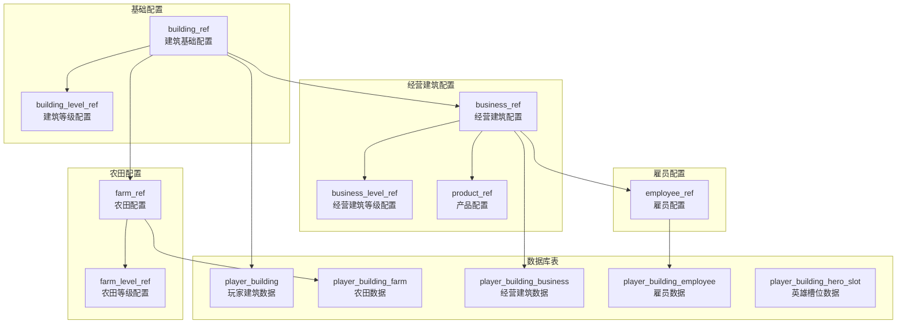
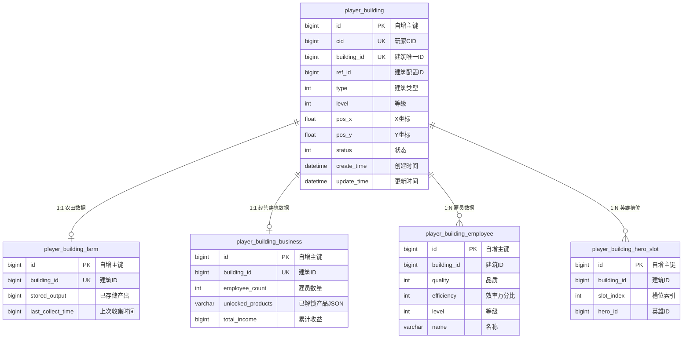
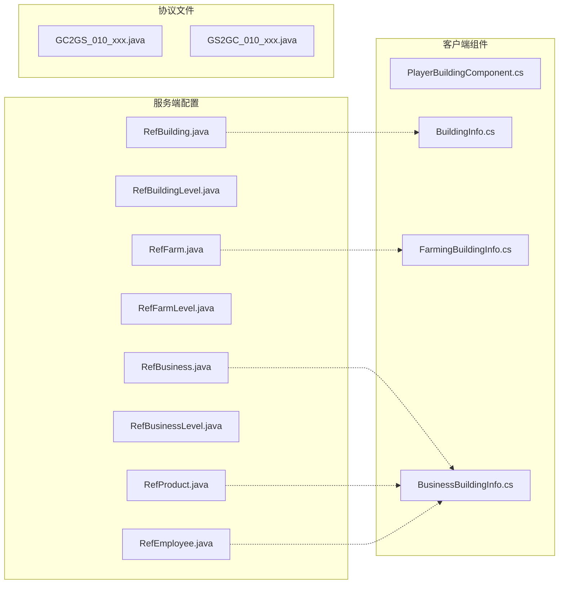

# 建筑模块 - 数据配表

## 概述

建筑模块 (BuildingOp, p010) 是游戏中的核心经营玩法，玩家可以建造、升级各种建筑，通过建筑产出获取资源收益。本模块涉及10张配表和5张数据库表。

---

## 配表总览



---

## 配表文件列表

| 配表名称 | 表名 | 文件位置 | 用途 |
|---------|------|----------|------|
| 建筑基础配置 | building_ref | RefBuilding.java | 定义建筑基础属性 |
| 建筑等级配置 | building_level_ref | RefBuildingLevel.java | 定义建筑各等级属性 |
| 农田配置 | farm_ref | RefFarm.java | 定义农田建筑属性 |
| 农田等级配置 | farm_level_ref | RefFarmLevel.java | 定义农田各等级属性 |
| 经营建筑配置 | business_ref | RefBusiness.java | 定义经营建筑属性 |
| 经营建筑等级配置 | business_level_ref | RefBusinessLevel.java | 定义经营建筑各等级属性 |
| 产品配置 | product_ref | RefProduct.java | 定义可生产产品 |
| 雇员配置 | employee_ref | RefEmployee.java | 定义雇员属性 |

---

## 1. 建筑基础配置 (building_ref)

**文件位置**: `game_server/GameRes/src/NPGameRes/Refs/Building/RefBuilding.java`

### 完整字段列表

| 字段名 | 类型 | 必填 | 默认值 | 取值范围 | 说明 |
|-------|------|------|--------|----------|------|
| id | long | 是 | - | > 0 | 建筑配置ID (主键) |
| name | string | 是 | - | 非空 | 建筑名称 |
| type | EBuildingType | 是 | NONE | 枚举值 | 建筑类型枚举 |
| max_level | int | 是 | 1 | 1-100 | 最大等级 |
| build_cost | NPCommonCostItem | 是 | null | - | 建造消耗配置 |
| unlock_condition | NPUnlockCondition | 否 | null | - | 解锁条件 |
| hero_slot | int | 是 | 0 | 0-5 | 英雄槽位数量 |
| description | string | 否 | "" | - | 建筑描述 |
| icon | string | 是 | - | 资源路径 | 建筑图标 |

### 建筑类型枚举 (EBuildingType)

```java
public enum EBuildingType
{
    NONE(0),           // 无类型
    FARM(1),           // 农田 - 产出基础资源
    BUSINESS(2),       // 经营建筑 - 产出金币
    RESIDENTIAL(3),    // 住宅 - 提供人口上限
    DECORATION(4);     // 装饰建筑 - 纯装饰用途

    private final int value;
    EBuildingType(int value) { this.value = value; }
    public int getValue() { return value; }

    public static EBuildingType valueOf(int value) {
        for (EBuildingType type : values()) {
            if (type.value == value) return type;
        }
        return NONE;
    }
}
```

### 配置示例

```json
[
    {
        "id": 1001,
        "name": "初级农田",
        "type": "FARM",
        "max_level": 10,
        "build_cost": {"type": "CURRENCY", "id": "GOLD", "count": 1000},
        "unlock_condition": {"type": "PLAYER_LEVEL", "value": 5},
        "hero_slot": 1,
        "description": "生产粮食的基础建筑",
        "icon": "building_farm_01"
    },
    {
        "id": 2001,
        "name": "杂货铺",
        "type": "BUSINESS",
        "max_level": 15,
        "build_cost": {"type": "CURRENCY", "id": "GOLD", "count": 5000},
        "unlock_condition": {"type": "PLAYER_LEVEL", "value": 10},
        "hero_slot": 2,
        "description": "售卖日用品的经营建筑",
        "icon": "building_shop_01"
    },
    {
        "id": 3001,
        "name": "民居",
        "type": "RESIDENTIAL",
        "max_level": 20,
        "build_cost": {"type": "CURRENCY", "id": "GOLD", "count": 3000},
        "unlock_condition": null,
        "hero_slot": 0,
        "description": "提供人口上限",
        "icon": "building_house_01"
    }
]
```

### 使用示例

```java
// 获取建筑配置
RefBuilding refBuilding = RefBuilding.getMgr().get(buildingRefId);
if (refBuilding == null) {
    return Result.fail("建筑配置不存在");
}

// 检查建筑类型
if (refBuilding.type != EBuildingType.FARM) {
    return Result.fail("该建筑不是农田类型");
}

// 检查等级上限
if (currentLevel >= refBuilding.max_level) {
    return Result.fail("已达最高等级");
}

// 检查解锁条件
if (refBuilding.unlock_condition != null) {
    if (!checkUnlockCondition(playerData, refBuilding.unlock_condition)) {
        return Result.fail("未满足解锁条件");
    }
}
```

---

## 2. 建筑等级配置 (building_level_ref)

**文件位置**: `game_server/GameRes/src/NPGameRes/Refs/Building/RefBuildingLevel.java`

### 完整字段列表

| 字段名 | 类型 | 必填 | 默认值 | 取值范围 | 说明 |
|-------|------|------|--------|----------|------|
| building_id | long | 是 | - | > 0 | 建筑配置ID (联合主键) |
| level | int | 是 | - | 1-100 | 等级 (联合主键) |
| upgrade_cost | NPCommonCostItem | 是 | null | - | 升级消耗 |
| upgrade_time | long | 是 | 0 | >= 0 | 升级时间（秒） |
| hero_slot_add | int | 是 | 0 | 0-5 | 新增英雄槽位 |
| unlock_products | List&lt;Long&gt; | 否 | 空列表 | - | 解锁的产品ID列表 |

### 配置示例

| building_id | level | upgrade_cost | upgrade_time | hero_slot_add | unlock_products | 说明 |
|-------------|-------|--------------|--------------|---------------|-----------------|------|
| 1001 | 1 | - | 0 | 0 | [] | 1级初始状态 |
| 1001 | 2 | 金币x2000 | 60 | 0 | [] | 升级需要1分钟 |
| 1001 | 3 | 金币x4000 | 120 | 0 | [] | 升级需要2分钟 |
| 1001 | 5 | 金币x10000 | 300 | 1 | [] | 新增1个英雄槽位 |
| 2001 | 1 | - | 0 | 0 | [1001] | 解锁产品：水果 |
| 2001 | 3 | 金币x8000 | 180 | 0 | [1002] | 解锁产品：蔬菜 |
| 2001 | 5 | 金币x15000 | 300 | 1 | [1003] | 解锁产品：日用品 |

### 使用示例

```java
// 获取建筑等级配置
RefBuildingLevel levelRef = RefBuildingLevel.getMgr().get(buildingId, level);
if (levelRef == null) {
    return Result.fail("等级配置不存在");
}

// 计算升级时间
long upgradeEndTime = System.currentTimeMillis() + levelRef.upgrade_time * 1000;

// 检查新增槽位
if (levelRef.hero_slot_add > 0) {
    building.setHeroSlot(building.getHeroSlot() + levelRef.hero_slot_add);
}

// 解锁新产品
if (!levelRef.unlock_products.isEmpty()) {
    businessData.unlockProducts(levelRef.unlock_products);
}
```

---

## 3. 农田配置 (farm_ref)

**文件位置**: `game_server/GameRes/src/NPGameRes/Refs/Building/RefFarm.java`

### 完整字段列表

| 字段名 | 类型 | 必填 | 默认值 | 取值范围 | 说明 |
|-------|------|------|--------|----------|------|
| id | long | 是 | - | > 0 | 农田配置ID (主键) |
| name | string | 是 | - | 非空 | 农田名称 |
| max_level | int | 是 | 1 | 1-100 | 最大等级 |
| output_type | EResourceType | 是 | NONE | 枚举值 | 产出资源类型 |
| base_output | long | 是 | 0 | > 0 | 基础产出（每分钟） |
| output_interval | long | 是 | 60 | > 0 | 产出间隔（秒） |
| click_output | long | 是 | 0 | >= 0 | 点击产出 |
| crit_rate | int | 是 | 0 | 0-10000 | 暴击概率(万分比) |
| crit_multiple | int | 是 | 20000 | >= 10000 | 暴击倍数(万分比) |

### 资源类型枚举 (EResourceType)

```java
public enum EResourceType
{
    NONE(0),
    GOLD(1),        // 金币
    FOOD(2),        // 粮食
    WOOD(3),        // 木材
    STONE(4),       // 石材
    IRON(5);        // 铁矿

    private final int value;
    EResourceType(int value) { this.value = value; }
    public int getValue() { return value; }
}
```

### 配置示例

```json
[
    {
        "id": 1001,
        "name": "初级农田",
        "max_level": 10,
        "output_type": "FOOD",
        "base_output": 10,
        "output_interval": 60,
        "click_output": 5,
        "crit_rate": 1000,
        "crit_multiple": 20000
    },
    {
        "id": 1002,
        "name": "伐木场",
        "max_level": 10,
        "output_type": "WOOD",
        "base_output": 8,
        "output_interval": 60,
        "click_output": 4,
        "crit_rate": 800,
        "crit_multiple": 25000
    },
    {
        "id": 1003,
        "name": "采石场",
        "max_level": 10,
        "output_type": "STONE",
        "base_output": 6,
        "output_interval": 60,
        "click_output": 3,
        "crit_rate": 600,
        "crit_multiple": 30000
    }
]
```

---

## 4. 农田等级配置 (farm_level_ref)

**文件位置**: `game_server/GameRes/src/NPGameRes/Refs/Building/RefFarmLevel.java`

### 完整字段列表

| 字段名 | 类型 | 必填 | 默认值 | 取值范围 | 说明 |
|-------|------|------|--------|----------|------|
| farm_id | long | 是 | - | > 0 | 农田配置ID (联合主键) |
| level | int | 是 | - | 1-100 | 等级 (联合主键) |
| output_multiplier | int | 是 | 10000 | > 0 | 产出系数(万分比) |
| upgrade_cost | NPCommonCostItem | 是 | null | - | 升级消耗 |
| storage_limit | long | 是 | 100 | > 0 | 存储上限 |
| crit_rate_add | int | 是 | 0 | >= 0 | 额外暴击概率(万分比) |

### 配置示例

| farm_id | level | output_multiplier | upgrade_cost | storage_limit | crit_rate_add | 说明 |
|---------|-------|-------------------|--------------|---------------|---------------|------|
| 1001 | 1 | 10000 | - | 500 | 0 | 基础等级 |
| 1001 | 2 | 11000 | 金币x2000 | 600 | 100 | 产出+10%，暴击+1% |
| 1001 | 3 | 12500 | 金币x4000 | 800 | 200 | 产出+25%，暴击+2% |
| 1001 | 5 | 16000 | 金币x10000 | 1200 | 500 | 产出+60%，暴击+5% |
| 1001 | 10 | 30000 | 金币x50000 | 3000 | 1500 | 产出+200%，暴击+15% |

### 产出计算示例

```java
/**
 * 计算农田产出
 */
public long calculateFarmOutput(PlayerFarm farm, RefFarm farmRef, RefFarmLevel levelRef)
{
    // 基础产出
    long baseOutput = farmRef.base_output;

    // 等级系数
    double levelMultiplier = levelRef.output_multiplier / 10000.0;

    // 英雄加成
    double heroBonus = getHeroBonus(farm.getBuildingId());

    // VIP加成
    double vipBonus = getVipBonus(player.getVipLevel());

    // 最终产出
    long output = (long) Math.ceil(baseOutput * levelMultiplier * (1 + heroBonus) * (1 + vipBonus));

    return output;
}

/**
 * 计算暴击产出
 */
public long calculateCritOutput(long normalOutput, RefFarm farmRef, RefFarmLevel levelRef)
{
    int totalCritRate = farmRef.crit_rate + levelRef.crit_rate_add;

    if (RandomUtil.randomW(totalCritRate)) {
        return normalOutput * farmRef.crit_multiple / 10000;
    }
    return normalOutput;
}
```

---

## 5. 经营建筑配置 (business_ref)

**文件位置**: `game_server/GameRes/src/NPGameRes/Refs/Building/RefBusiness.java`

### 完整字段列表

| 字段名 | 类型 | 必填 | 默认值 | 取值范围 | 说明 |
|-------|------|------|--------|----------|------|
| id | long | 是 | - | > 0 | 经营建筑配置ID (主键) |
| name | string | 是 | - | 非空 | 建筑名称 |
| max_level | int | 是 | 1 | 1-100 | 最大等级 |
| employee_limit | int | 是 | 1 | 1-10 | 雇员上限 |
| product_list | List&lt;Long&gt; | 是 | 空列表 | - | 可生产产品列表 |
| base_income | long | 是 | 0 | >= 0 | 基础收益（每小时） |

### 配置示例

```json
[
    {
        "id": 2001,
        "name": "杂货铺",
        "max_level": 15,
        "employee_limit": 5,
        "product_list": [1001, 1002, 1003],
        "base_income": 100
    },
    {
        "id": 2002,
        "name": "酒楼",
        "max_level": 15,
        "employee_limit": 8,
        "product_list": [2001, 2002, 2003],
        "base_income": 200
    },
    {
        "id": 2003,
        "name": "客栈",
        "max_level": 20,
        "employee_limit": 10,
        "product_list": [3001, 3002],
        "base_income": 300
    }
]
```

---

## 6. 经营建筑等级配置 (business_level_ref)

**文件位置**: `game_server/GameRes/src/NPGameRes/Refs/Building/RefBusinessLevel.java`

### 完整字段列表

| 字段名 | 类型 | 必填 | 默认值 | 取值范围 | 说明 |
|-------|------|------|--------|----------|------|
| business_id | long | 是 | - | > 0 | 经营建筑配置ID (联合主键) |
| level | int | 是 | - | 1-100 | 等级 (联合主键) |
| employee_limit | int | 是 | 1 | 1-20 | 雇员上限 |
| upgrade_cost | NPCommonCostItem | 是 | null | - | 升级消耗 |
| income_multiplier | int | 是 | 10000 | > 0 | 收益系数(万分比) |
| unlock_product | long | 否 | 0 | > 0 | 解锁产品ID |

### 配置示例

| business_id | level | employee_limit | upgrade_cost | income_multiplier | unlock_product | 说明 |
|-------------|-------|----------------|--------------|-------------------|----------------|------|
| 2001 | 1 | 2 | - | 10000 | 1001 | 初始解锁水果 |
| 2001 | 2 | 2 | 金币x5000 | 11000 | 0 | 收益+10% |
| 2001 | 3 | 3 | 金币x8000 | 12500 | 1002 | 解锁蔬菜 |
| 2001 | 5 | 4 | 金币x15000 | 15000 | 1003 | 解锁日用品 |
| 2001 | 10 | 6 | 金币x50000 | 25000 | 0 | 收益+150% |

---

## 7. 产品配置 (product_ref)

**文件位置**: `game_server/GameRes/src/NPGameRes/Refs/Building/RefProduct.java`

### 完整字段列表

| 字段名 | 类型 | 必填 | 默认值 | 取值范围 | 说明 |
|-------|------|------|--------|----------|------|
| id | long | 是 | - | > 0 | 产品ID (主键) |
| name | string | 是 | - | 非空 | 产品名称 |
| unlock_level | int | 是 | 1 | 1-100 | 解锁等级 |
| produce_time | long | 是 | 60 | > 0 | 生产时间（秒） |
| income | long | 是 | 0 | > 0 | 收益 |
| cost | NPCommonCostItem | 是 | null | - | 生产消耗 |
| quality | int | 是 | 1 | 1-5 | 产品品质 |

### 配置示例

```json
[
    {
        "id": 1001,
        "name": "水果",
        "unlock_level": 1,
        "produce_time": 300,
        "income": 50,
        "cost": {"type": "CURRENCY", "id": "GOLD", "count": 10},
        "quality": 1
    },
    {
        "id": 1002,
        "name": "蔬菜",
        "unlock_level": 3,
        "produce_time": 600,
        "income": 100,
        "cost": {"type": "CURRENCY", "id": "GOLD", "count": 20},
        "quality": 2
    },
    {
        "id": 1003,
        "name": "日用品",
        "unlock_level": 5,
        "produce_time": 900,
        "income": 200,
        "cost": {"type": "CURRENCY", "id": "GOLD", "count": 50},
        "quality": 3
    },
    {
        "id": 2001,
        "name": "酒菜",
        "unlock_level": 1,
        "produce_time": 600,
        "income": 150,
        "cost": {"type": "RESOURCE", "id": "FOOD", "count": 10},
        "quality": 2
    }
]
```

---

## 8. 雇员配置 (employee_ref)

**文件位置**: `game_server/GameRes/src/NPGameRes/Refs/Building/RefEmployee.java`

### 完整字段列表

| 字段名 | 类型 | 必填 | 默认值 | 取值范围 | 说明 |
|-------|------|------|--------|----------|------|
| id | long | 是 | - | > 0 | 雇员配置ID (主键) |
| name | string | 是 | - | 非空 | 雇员名称模板 |
| quality | int | 是 | 1 | 1-5 | 品质 |
| work_efficiency | int | 是 | 10000 | > 0 | 工作效率(万分比) |
| hire_cost | NPCommonCostItem | 是 | null | - | 雇佣消耗 |
| quality_weights | WeightIntList | 是 | 空列表 | - | 随机品质权重 |

### 配置示例

| id | name | quality | work_efficiency | hire_cost | quality_weights | 说明 |
|----|------|---------|-----------------|-----------|-----------------|------|
| 1 | 普通员工 | 1 | 10000 | 金币x1000 | [1:700, 2:250, 3:45, 4:5] | 普通雇佣 |
| 2 | 高级员工 | 2 | 12000 | 金币x5000 | [2:500, 3:400, 4:90, 5:10] | 高级雇佣 |
| 3 | 金牌员工 | 3 | 15000 | 钻石x50 | [3:600, 4:350, 5:50] | 钻石雇佣 |

### 雇员生成代码

```java
public class RefEmployee extends _ARefBase
{
    public long id;
    public String name;
    public int quality;
    public int work_efficiency;      // 万分比
    public NPCommonCostItem hire_cost;
    public WeightIntList quality_weights;

    /**
     * 随机生成员工
     */
    public Employee generateEmployee(long buildingId)
    {
        Employee employee = new Employee();
        employee.setId(idGenerator.nextId());
        employee.setBuildingId(buildingId);

        // 随机品质
        int randomQuality = quality_weights.randomValue();
        employee.setQuality(randomQuality);

        // 根据品质计算效率
        int baseEfficiency = work_efficiency;
        int qualityBonus = (randomQuality - 1) * 2000;  // 每品质+20%
        int randomBonus = RandomUtil.range(0, 1000);    // 0-10%随机加成
        employee.setEfficiency(baseEfficiency + qualityBonus + randomBonus);

        employee.setLevel(1);
        employee.setName(generateName(randomQuality));

        return employee;
    }

    private String generateName(int quality)
    {
        String[] prefixes = {"小", "老", "阿"};
        String[] names = {"明", "华", "强", "伟", "芳", "娟"};
        return prefixes[RandomUtil.range(0, prefixes.length)] +
               names[RandomUtil.range(0, names.length)];
    }
}
```

---

## 数据库表结构

### ER关系图



### player_building (玩家建筑数据)

| 字段名 | 类型 | 是否主键 | 是否索引 | 默认值 | 说明 |
|-------|------|----------|----------|--------|------|
| id | bigint(20) | 是 | 是 | 自增 | 主键 |
| cid | bigint(20) | 否 | 是(唯一) | - | 玩家CID |
| building_id | bigint(20) | 否 | 是(唯一) | - | 建筑唯一ID |
| ref_id | bigint(20) | 否 | 是 | - | 建筑配置ID |
| type | int(11) | 否 | 是 | 0 | 建筑类型 |
| level | int(11) | 否 | 否 | 1 | 等级 |
| pos_x | float | 否 | 否 | 0 | X坐标 |
| pos_y | float | 否 | 否 | 0 | Y坐标 |
| status | int(11) | 否 | 否 | 0 | 状态(0正常 1建造中 2升级中) |
| create_time | datetime | 否 | 否 | NOW | 创建时间 |
| update_time | datetime | 否 | 否 | NOW | 更新时间 |

### player_building_farm (农田数据)

| 字段名 | 类型 | 是否主键 | 是否索引 | 默认值 | 说明 |
|-------|------|----------|----------|--------|------|
| id | bigint(20) | 是 | 是 | 自增 | 主键 |
| building_id | bigint(20) | 否 | 是(唯一) | - | 建筑ID |
| stored_output | bigint(20) | 否 | 否 | 0 | 已存储产出 |
| last_collect_time | bigint(20) | 否 | 否 | 0 | 上次收集时间戳(ms) |

### player_building_business (经营建筑数据)

| 字段名 | 类型 | 是否主键 | 是否索引 | 默认值 | 说明 |
|-------|------|----------|----------|--------|------|
| id | bigint(20) | 是 | 是 | 自增 | 主键 |
| building_id | bigint(20) | 否 | 是(唯一) | - | 建筑ID |
| employee_count | int(11) | 否 | 否 | 0 | 雇员数量 |
| unlocked_products | varchar(1024) | 否 | 否 | "[]" | 已解锁产品ID列表(JSON) |
| total_income | bigint(20) | 否 | 否 | 0 | 累计收益 |

### player_building_employee (雇员数据)

| 字段名 | 类型 | 是否主键 | 是否索引 | 默认值 | 说明 |
|-------|------|----------|----------|--------|------|
| id | bigint(20) | 是 | 是 | 自增 | 主键 |
| building_id | bigint(20) | 否 | 是 | - | 所属建筑ID |
| quality | int(11) | 否 | 否 | 1 | 品质(1-5) |
| efficiency | int(11) | 否 | 否 | 10000 | 效率(万分比) |
| level | int(11) | 否 | 否 | 1 | 员工等级 |
| name | varchar(64) | 否 | 否 | "" | 员工名称 |

### player_building_hero_slot (英雄槽位数据)

| 字段名 | 类型 | 是否主键 | 是否索引 | 默认值 | 说明 |
|-------|------|----------|----------|--------|------|
| id | bigint(20) | 是 | 是 | 自增 | 主键 |
| building_id | bigint(20) | 否 | 是 | - | 建筑ID |
| slot_index | int(11) | 否 | 否 | 0 | 槽位索引(0开始) |
| hero_id | bigint(20) | 否 | 是 | - | 驻扎英雄ID |

---

## 枚举定义

### EBuildingType (建筑类型)

```java
public enum EBuildingType
{
    NONE(0),           // 无类型
    FARM(1),           // 农田
    BUSINESS(2),       // 经营建筑
    RESIDENTIAL(3),    // 住宅
    DECORATION(4);     // 装饰建筑

    private final int value;
    EBuildingType(int value) { this.value = value; }
    public int getValue() { return value; }

    public static EBuildingType valueOf(int value) {
        for (EBuildingType type : values()) {
            if (type.value == value) return type;
        }
        return NONE;
    }
}
```

### EBuildingStatus (建筑状态)

```csharp
public enum EBuildingStatus
{
    NORMAL = 0,        // 正常 - 可正常使用
    BUILDING = 1,      // 建造中 - 等待建造完成
    UPGRADING = 2,     // 升级中 - 等待升级完成
    DEMOLISHED = 3     // 已拆除 - 等待清理
}
```

### EBuildingFuncEnum (建筑功能)

```csharp
public enum EBuildingFuncEnum
{
    None = 0,          // 无功能
    Farm = 1,          // 农田 - 产出资源
    Business = 2,      // 经营建筑 - 产出金币
    Residential = 3,   // 住宅 - 提供人口
    Decoration = 4     // 装饰建筑 - 纯装饰
}
```

---

## 配表路径汇总



---

## 常用查询方法

### 配表查询工具类

```java
public class BuildingRefHelper
{
    /**
     * 获取建筑产出速率
     */
    public static long getFarmOutputRate(PlayerFarm farm, NPUSUserData userData)
    {
        RefFarm farmRef = RefFarm.getMgr().get(farm.getRefId());
        RefFarmLevel levelRef = RefFarmLevel.getMgr().get(farm.getRefId(), farm.getLevel());

        if (farmRef == null || levelRef == null) return 0;

        // 基础产出
        long baseOutput = farmRef.base_output;

        // 等级系数
        double levelMultiplier = levelRef.output_multiplier / 10000.0;

        // 英雄加成
        double heroBonus = getHeroBonus(farm.getBuildingId(), userData);

        // VIP加成
        double vipBonus = getVipBonus(userData.getPlayerComponent().getVipLevel());

        return (long) Math.ceil(baseOutput * levelMultiplier * (1 + heroBonus) * (1 + vipBonus));
    }

    /**
     * 获取建筑存储上限
     */
    public static long getStorageLimit(long farmId, int level)
    {
        RefFarmLevel levelRef = RefFarmLevel.getMgr().get(farmId, level);
        return levelRef != null ? levelRef.storage_limit : 0;
    }

    /**
     * 获取经营建筑收益
     */
    public static long getBusinessIncome(PlayerBusiness business, NPUSUserData userData)
    {
        RefBusiness businessRef = RefBusiness.getMgr().get(business.getRefId());
        RefBusinessLevel levelRef = RefBusinessLevel.getMgr().get(business.getRefId(), business.getLevel());

        if (businessRef == null || levelRef == null) return 0;

        // 基础收益
        long baseIncome = businessRef.base_income;

        // 等级系数
        double levelMultiplier = levelRef.income_multiplier / 10000.0;

        // 员工效率
        double employeeEfficiency = getEmployeeEfficiency(business.getBuildingId());

        // 英雄加成
        double heroBonus = getHeroBonus(business.getBuildingId(), userData);

        return (long) Math.ceil(baseIncome * levelMultiplier * (1 + employeeEfficiency) * (1 + heroBonus));
    }

    /**
     * 检查建筑是否可升级
     */
    public static boolean canUpgrade(long buildingId, int currentLevel, NPUSUserData userData)
    {
        RefBuilding buildingRef = RefBuilding.getMgr().get(buildingId);
        if (buildingRef == null) return false;

        // 检查等级上限
        if (currentLevel >= buildingRef.max_level) return false;

        // 检查升级消耗
        RefBuildingLevel levelRef = RefBuildingLevel.getMgr().get(buildingId, currentLevel + 1);
        if (levelRef == null || levelRef.upgrade_cost == null) return true;

        return userData.hasEnoughItem(levelRef.upgrade_cost);
    }
}
```

---

## 配表加载方式

```csharp
// 客户端获取建筑静态配置
BuildingRefObj buildingRef = GRefdataCoreMgr.instance.buildingRefCore.getRef(buildingId);

// 获取建筑等级配置
BuildingLevelRefObj levelRef = GRefdataCoreMgr.instance.buildingLevelRefCore.getRef(buildingId, level);

// 获取农田配置
FarmRefObj farmRef = GRefdataCoreMgr.instance.farmRefCore.getRef(farmId);

// 获取农田等级配置
FarmLevelRefObj farmLevelRef = GRefdataCoreMgr.instance.farmLevelRefCore.getRef(farmId, level);

// 获取经营建筑配置
BusinessRefObj businessRef = GRefdataCoreMgr.instance.businessRefCore.getRef(businessId);

// 获取产品配置
ProductRefObj productRef = GRefdataCoreMgr.instance.productRefCore.getRef(productId);

// 获取雇员配置
EmployeeRefObj employeeRef = GRefdataCoreMgr.instance.employeeRefCore.getRef(employeeId);
```

---

*文档生成时间: 2026-04-11*
