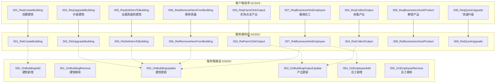
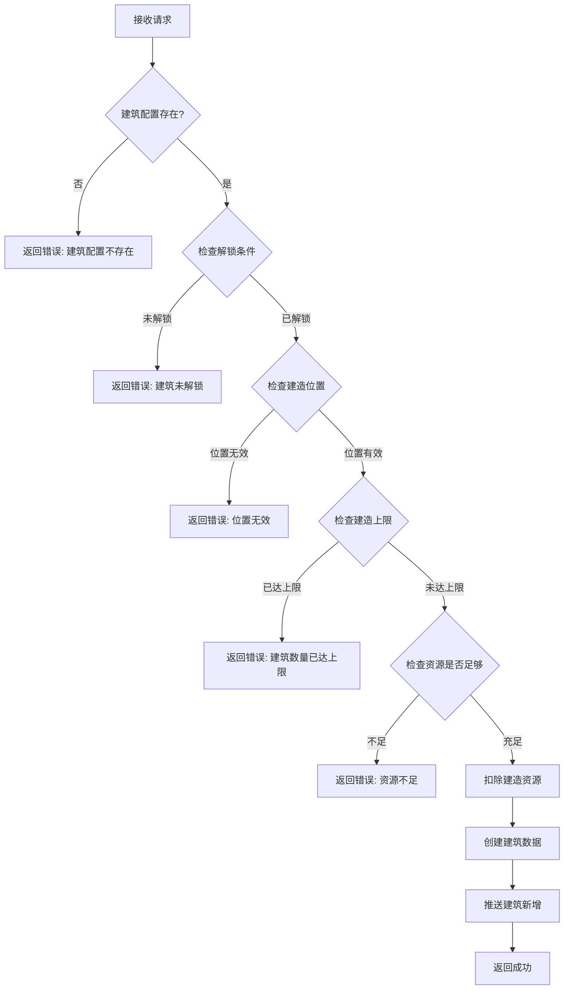
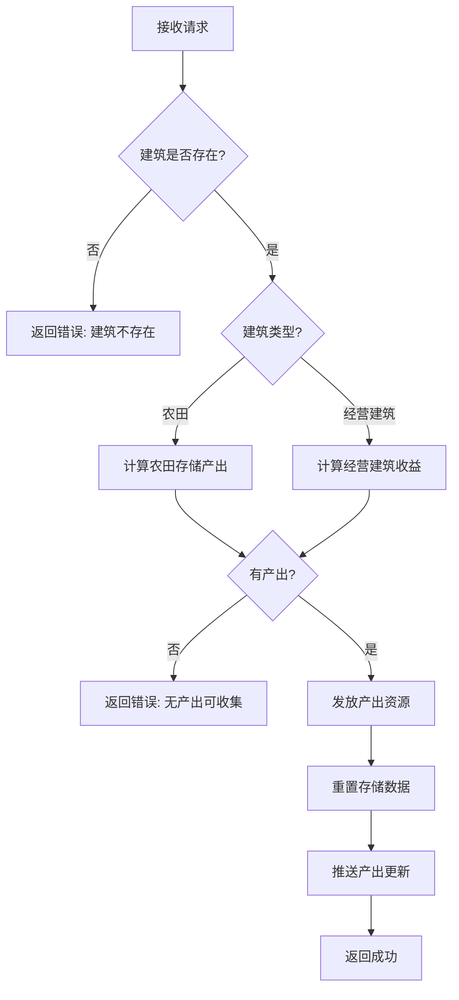
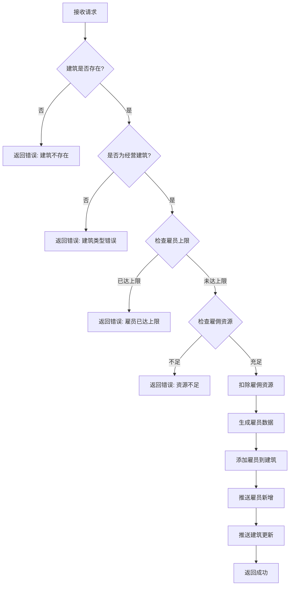
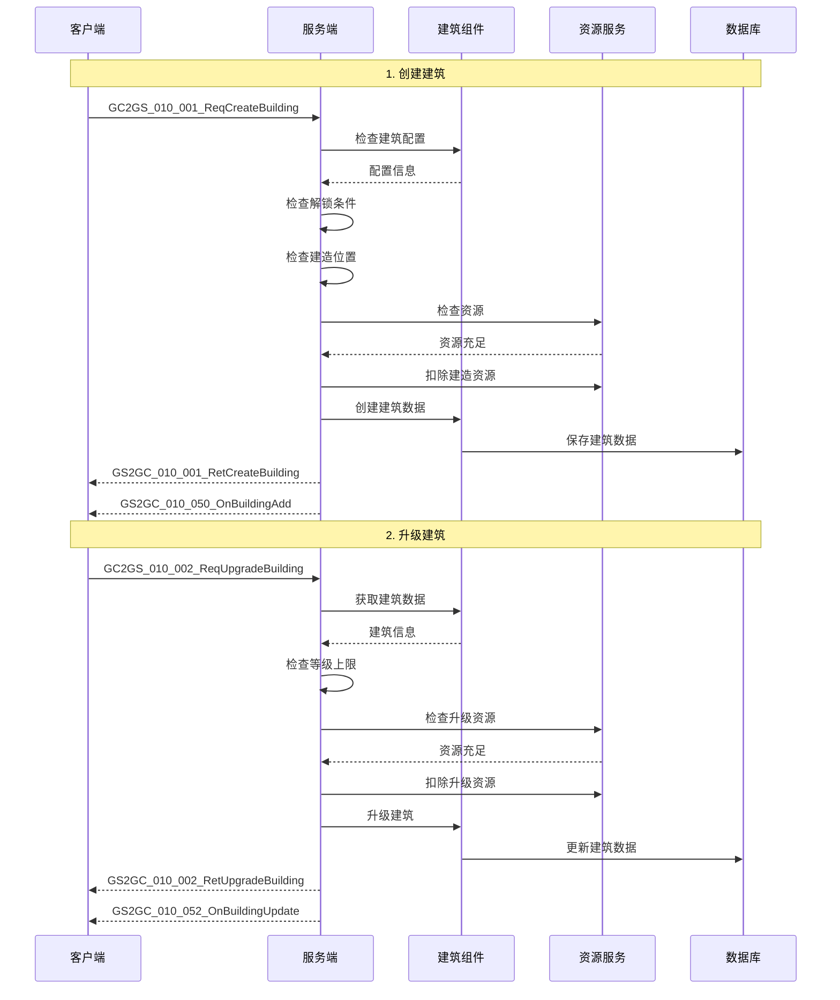
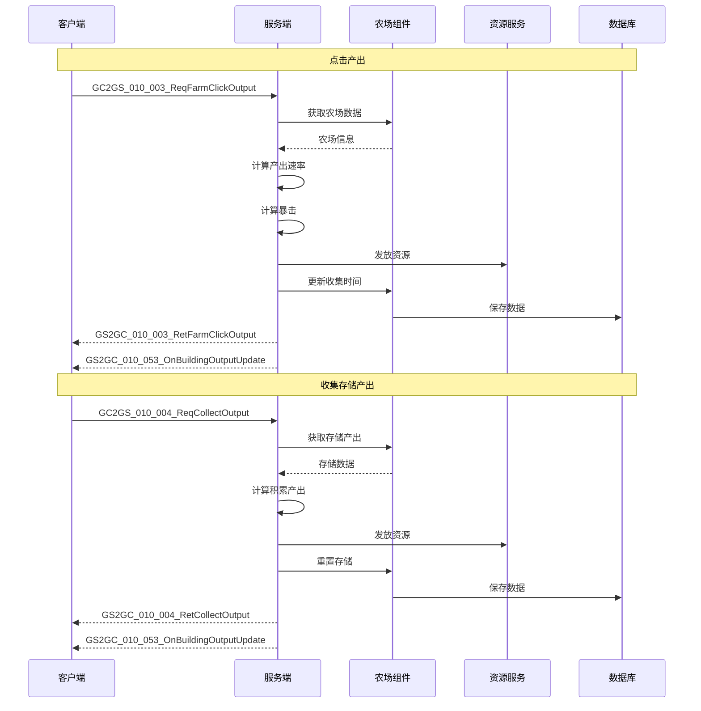
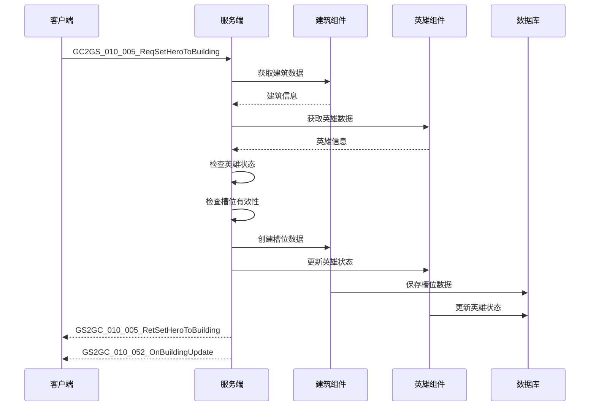
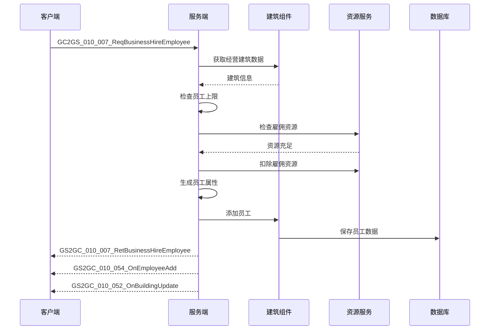
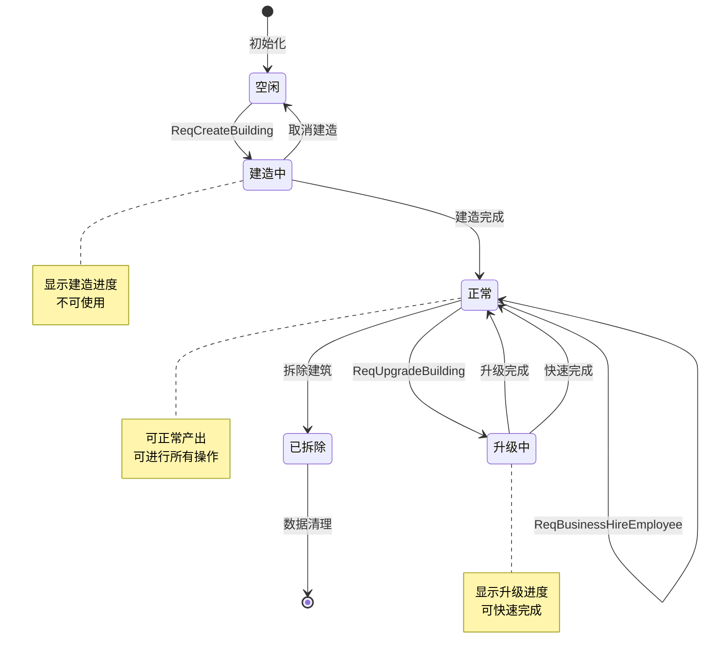

# 建筑模块 - 协议文档

## 协议编号

模块编号：p010 (BuildingOp)

---

## 协议总览



---

## 客户端请求协议 (GC2GS)

### GC2GS_010_001_ReqCreateBuilding

**说明**：请求创建建筑

**触发场景**：玩家在建筑界面选择建筑并确认建造

**请求参数**：

| 字段名 | 类型 | 必填 | 说明 | 示例 |
|-------|------|------|------|------|
| buildingRefId | long | 是 | 建筑配置ID | 1001 |
| posX | float | 是 | X坐标 | 10.5 |
| posY | float | 是 | Y坐标 | 20.3 |

```protobuf
message GC2GS_010_001_ReqCreateBuilding
{
    required int64 buildingRefId = 1;  // 建筑配置ID
    required float posX = 2;           // X坐标
    required float posY = 3;           // Y坐标
}
```

**响应**：GS2GC_010_001_RetCreateBuilding

**服务端处理流程**：



**服务端代码实现**：

```java
public void onCreateBuilding(GC2GS_010_001_ReqCreateBuilding req, NPPlayerContext context)
{
    NPUSUserData userData = context.getUserData();
    PlayerBuildingComponent buildingComp = userData.getBuildingComponent();

    // 1. 获取建筑配置
    RefBuilding buildingRef = RefBuilding.getMgr().get(req.getBuildingRefId());
    if (buildingRef == null) {
        context.sendError(BuildingErr.BUILDING_REF_NOT_FOUND);
        return;
    }

    // 2. 检查解锁条件
    if (buildingRef.unlock_condition != null) {
        if (!checkUnlockCondition(userData, buildingRef.unlock_condition)) {
            context.sendError(BuildingErr.BUILDING_NOT_UNLOCKED);
            return;
        }
    }

    // 3. 检查建造位置
    if (!isValidPosition(userData, req.getPosX(), req.getPosY())) {
        context.sendError(BuildingErr.INVALID_POSITION);
        return;
    }

    // 4. 检查建造上限
    int currentCount = buildingComp.getBuildingCount(buildingRef.type);
    int maxCount = getMaxBuildingCount(userData, buildingRef.type);
    if (currentCount >= maxCount) {
        context.sendError(BuildingErr.BUILDING_COUNT_OVER_LIMIT);
        return;
    }

    // 5. 检查并扣除资源
    if (buildingRef.build_cost != null) {
        if (!userData.spendItem(buildingRef.build_cost, context)) {
            context.sendError(CommErr.ITEM_NOT_ENOUGH);
            return;
        }
    }

    // 6. 创建建筑
    PlayerBuilding building = buildingComp.createBuilding(
        buildingRef,
        req.getPosX(),
        req.getPosY()
    );

    // 7. 推送建筑新增
    context.sendPush(new GS2GC_010_050_OnBuildingAdd(building.makeProto()));

    // 8. 返回成功
    context.sendResult(new GS2GC_010_001_RetCreateBuilding(building.makeProto()));
}
```

---

### GC2GS_010_002_ReqUpgradeBuilding

**说明**：请求升级建筑

**触发场景**：玩家在建筑详情界面点击升级按钮

**请求参数**：

| 字段名 | 类型 | 必填 | 说明 | 示例 |
|-------|------|------|------|------|
| buildingId | long | 是 | 建筑唯一ID | 200001 |

```protobuf
message GC2GS_010_002_ReqUpgradeBuilding
{
    required int64 buildingId = 1;  // 建筑唯一ID
}
```

**响应**：GS2GC_010_002_RetUpgradeBuilding

**服务端处理**：

```java
public Result upgradeBuilding(long buildingId, NPPlayerContext context)
{
    NPUSUserData userData = context.getUserData();
    PlayerBuildingComponent buildingComp = userData.getBuildingComponent();

    // 1. 获取建筑数据
    PlayerBuilding building = buildingComp.getBuilding(buildingId);
    if (building == null) {
        return Result.fail(BuildingErr.BUILDING_NOT_FOUND);
    }

    // 2. 获取建筑配置
    RefBuilding buildingRef = RefBuilding.getMgr().get(building.getRefId());
    if (buildingRef == null) {
        return Result.fail(BuildingErr.BUILDING_REF_NOT_FOUND);
    }

    // 3. 检查等级上限
    if (building.getLevel() >= buildingRef.max_level) {
        return Result.fail(BuildingErr.BUILDING_LEVEL_MAX);
    }

    // 4. 获取升级配置
    RefBuildingLevel levelRef = RefBuildingLevel.getMgr().get(
        building.getRefId(), building.getLevel() + 1);
    if (levelRef == null) {
        return Result.fail(BuildingErr.LEVEL_REF_NOT_FOUND);
    }

    // 5. 检查并扣除资源
    if (levelRef.upgrade_cost != null) {
        if (!userData.spendItem(levelRef.upgrade_cost, context)) {
            return Result.fail(CommErr.ITEM_NOT_ENOUGH);
        }
    }

    // 6. 升级建筑
    building.setLevel(building.getLevel() + 1);

    // 7. 处理新增槽位
    if (levelRef.hero_slot_add > 0) {
        building.setHeroSlot(building.getHeroSlot() + levelRef.hero_slot_add);
    }

    // 8. 处理解锁产品
    if (!levelRef.unlock_products.isEmpty()) {
        if (building.getType() == EBuildingType.BUSINESS.getValue()) {
            PlayerBusiness business = buildingComp.getBusiness(buildingId);
            if (business != null) {
                business.unlockProducts(levelRef.unlock_products);
            }
        }
    }

    return Result.succ();
}
```

---

### GC2GS_010_003_ReqFarmClickOutput

**说明**：请求农场点击产出

**触发场景**：玩家点击农场收集产出

**请求参数**：

| 字段名 | 类型 | 必填 | 说明 | 示例 |
|-------|------|------|------|------|
| buildingId | long | 是 | 建筑ID | 200001 |
| clickCount | int | 是 | 点击次数 | 5 |

```protobuf
message GC2GS_010_003_ReqFarmClickOutput
{
    required int64 buildingId = 1;  // 建筑ID
    required int32 clickCount = 2;  // 点击次数
}
```

**响应**：GS2GC_010_003_RetFarmClickOutput

**响应数据结构**：

| 字段名 | 类型 | 说明 |
|-------|------|------|
| output | Building_OutputInfo | 产出信息 |
| isCrit | bool | 是否暴击 |
| critMultiple | int | 暴击倍数 |

---

### GC2GS_010_004_ReqCollectOutput

**说明**：请求收集建筑产出

**触发场景**：玩家点击收集按钮收取存储的产出

**请求参数**：

| 字段名 | 类型 | 必填 | 说明 | 示例 |
|-------|------|------|------|------|
| buildingId | long | 是 | 建筑ID | 200001 |

```protobuf
message GC2GS_010_004_ReqCollectOutput
{
    required int64 buildingId = 1;  // 建筑ID
}
```

**响应**：GS2GC_010_004_RetCollectOutput

**服务端处理流程**：



---

### GC2GS_010_005_ReqSetHeroToBuilding

**说明**：请求设置英雄到建筑

**触发场景**：玩家选择英雄驻扎到建筑

**请求参数**：

| 字段名 | 类型 | 必填 | 说明 | 示例 |
|-------|------|------|------|------|
| buildingId | long | 是 | 建筑ID | 200001 |
| heroId | long | 是 | 英雄ID | 10001 |
| slotIndex | int | 是 | 槽位索引 | 0 |

```protobuf
message GC2GS_010_005_ReqSetHeroToBuilding
{
    required int64 buildingId = 1;  // 建筑ID
    required int64 heroId = 2;      // 英雄ID
    required int32 slotIndex = 3;   // 槽位索引
}
```

**响应**：GS2GC_010_005_RetSetHeroToBuilding

**服务端处理**：

```java
public Result setHeroToBuilding(long buildingId, long heroId, int slotIndex, NPPlayerContext context)
{
    NPUSUserData userData = context.getUserData();
    PlayerBuildingComponent buildingComp = userData.getBuildingComponent();
    HeroComponent heroComp = userData.getHeroComponent();

    // 1. 获取建筑数据
    PlayerBuilding building = buildingComp.getBuilding(buildingId);
    if (building == null) {
        return Result.fail(BuildingErr.BUILDING_NOT_FOUND);
    }

    // 2. 获取英雄数据
    HeroInfo hero = heroComp.getHeroInfo(heroId);
    if (hero == null) {
        return Result.fail(HeroErr.HERO_NOT_FOUND);
    }

    // 3. 检查英雄状态
    if (hero.getStatus() != EHeroStatus.IDLE.getValue()) {
        return Result.fail(BuildingErr.HERO_BUSY);
    }

    // 4. 检查槽位有效性
    if (slotIndex < 0 || slotIndex >= building.getHeroSlot()) {
        return Result.fail(BuildingErr.INVALID_SLOT_INDEX);
    }

    // 5. 检查槽位是否已占用
    HeroSlot existingSlot = buildingComp.getHeroSlot(buildingId, slotIndex);
    if (existingSlot != null) {
        return Result.fail(BuildingErr.SLOT_OCCUPIED);
    }

    // 6. 创建槽位数据
    HeroSlot slot = new HeroSlot();
    slot.setBuildingId(buildingId);
    slot.setSlotIndex(slotIndex);
    slot.setHeroId(heroId);
    buildingComp.addHeroSlot(slot);

    // 7. 更新英雄状态
    hero.setStatus(EHeroStatus.IN_BUILDING.getValue());
    hero.setBuildingId(buildingId);

    // 8. 推送更新
    context.sendPush(new GS2GC_010_052_OnBuildingUpdate(building.makeProto()));

    return Result.succ();
}
```

---

### GC2GS_010_006_ReqRemoveHeroFromBuilding

**说明**：请求从建筑移除英雄

**触发场景**：玩家将英雄从建筑槽位移除

**请求参数**：

| 字段名 | 类型 | 必填 | 说明 | 示例 |
|-------|------|------|------|------|
| buildingId | long | 是 | 建筑ID | 200001 |
| slotIndex | int | 是 | 槽位索引 | 0 |

```protobuf
message GC2GS_010_006_ReqRemoveHeroFromBuilding
{
    required int64 buildingId = 1;  // 建筑ID
    required int32 slotIndex = 2;   // 槽位索引
}
```

**响应**：GS2GC_010_006_RetRemoveHeroFromBuilding

---

### GC2GS_010_007_ReqBusinessHireEmployee

**说明**：请求雇佣员工

**触发场景**：玩家在经营建筑界面点击雇佣按钮

**请求参数**：

| 字段名 | 类型 | 必填 | 说明 | 示例 |
|-------|------|------|------|------|
| buildingId | long | 是 | 建筑ID | 200001 |
| employeeRefId | long | 是 | 雇员配置ID | 1 |
| count | int | 是 | 雇佣数量 | 1 |

```protobuf
message GC2GS_010_007_ReqBusinessHireEmployee
{
    required int64 buildingId = 1;       // 建筑ID
    required int64 employeeRefId = 2;    // 雇员配置ID
    required int32 count = 3;            // 雇佣数量
}
```

**响应**：GS2GC_010_007_RetBusinessHireEmployee

**服务端处理流程**：



---

### GC2GS_010_008_ReqBusinessUnlockProduct

**说明**：请求解锁产品

**触发场景**：玩家在经营建筑界面解锁新产品

**请求参数**：

| 字段名 | 类型 | 必填 | 说明 | 示例 |
|-------|------|------|------|------|
| buildingId | long | 是 | 建筑ID | 200001 |
| productId | long | 是 | 产品ID | 1001 |

```protobuf
message GC2GS_010_008_ReqBusinessUnlockProduct
{
    required int64 buildingId = 1;  // 建筑ID
    required int64 productId = 2;   // 产品ID
}
```

**响应**：GS2GC_010_008_RetBusinessUnlockProduct

---

### GC2GS_010_009_ReqQuickUpgrade

**说明**：请求快速升级（使用钻石立即完成）

**触发场景**：玩家点击快速完成按钮

**请求参数**：

| 字段名 | 类型 | 必填 | 说明 | 示例 |
|-------|------|------|------|------|
| buildingId | long | 是 | 建筑ID | 200001 |

```protobuf
message GC2GS_010_009_ReqQuickUpgrade
{
    required int64 buildingId = 1;  // 建筑ID
}
```

**响应**：GS2GC_010_009_RetQuickUpgrade

---

## 服务端响应/推送协议 (GS2GC)

### GS2GC_010_050_OnBuildingAdd

**说明**：通知建筑新增

**触发时机**：
- 建造建筑成功
- 系统赠送建筑

**推送数据**：

| 字段名 | 类型 | 必填 | 说明 |
|-------|------|------|------|
| buildingInfo | Building_Info | 是 | 建筑信息 |

```protobuf
message GS2GC_010_050_OnBuildingAdd
{
    required Building_Info buildingInfo = 1;
}
```

**服务端构造**：

```java
public Building_Info makeProto()
{
    Building_Info proto = new Building_Info();
    proto.setBuildingId(_m_bo.getBuildingId());
    proto.setRefId(_m_bo.getRefId());
    proto.setType(_m_bo.getType());
    proto.setLevel(_m_bo.getLevel());
    proto.setPosX(_m_bo.getPosX());
    proto.setPosY(_m_bo.getPosY());
    proto.setStatus(_m_bo.getStatus());
    proto.setHeroSlot(_m_bo.getHeroSlot());

    // 英雄槽位列表
    for (HeroSlot slot : _m_heroSlotList) {
        proto.addHeroSlotList(slot.makeProto());
    }

    return proto;
}
```

---

### GS2GC_010_051_OnBuildingRemove

**说明**：通知建筑移除

**触发时机**：
- 拆除建筑成功
- 建筑过期消失

**推送数据**：

| 字段名 | 类型 | 必填 | 说明 |
|-------|------|------|------|
| buildingId | int64 | 是 | 建筑ID |

```protobuf
message GS2GC_010_051_OnBuildingRemove
{
    required int64 buildingId = 1;
}
```

---

### GS2GC_010_052_OnBuildingUpdate

**说明**：通知建筑更新

**触发时机**：
- 建筑升级成功
- 英雄驻扎/移除
- 员工数量变化

**推送数据**：

| 字段名 | 类型 | 必填 | 说明 |
|-------|------|------|------|
| buildingInfo | Building_Info | 是 | 建筑信息 |

```protobuf
message GS2GC_010_052_OnBuildingUpdate
{
    required Building_Info buildingInfo = 1;
}
```

---

### GS2GC_010_053_OnBuildingOutputUpdate

**说明**：通知建筑产出更新

**触发时机**：
- 农场点击产出
- 收集产出
- 产出状态变化

**推送数据**：

| 字段名 | 类型 | 必填 | 说明 |
|-------|------|------|------|
| buildingId | int64 | 是 | 建筑ID |
| outputInfo | Building_OutputInfo | 是 | 产出信息 |

```protobuf
message GS2GC_010_053_OnBuildingOutputUpdate
{
    required int64 buildingId = 1;
    required Building_OutputInfo outputInfo = 2;
}
```

---

### GS2GC_010_054_OnEmployeeAdd

**说明**：通知员工新增

**触发时机**：
- 雇佣员工成功

**推送数据**：

| 字段名 | 类型 | 必填 | 说明 |
|-------|------|------|------|
| buildingId | int64 | 是 | 建筑ID |
| employeeInfo | Building_EmployeeInfo | 是 | 员工信息 |

```protobuf
message GS2GC_010_054_OnEmployeeAdd
{
    required int64 buildingId = 1;
    required Building_EmployeeInfo employeeInfo = 2;
}
```

---

### GS2GC_010_055_OnEmployeeRemove

**说明**：通知员工移除

**触发时机**：
- 解雇员工成功

**推送数据**：

| 字段名 | 类型 | 必填 | 说明 |
|-------|------|------|------|
| employeeId | int64 | 是 | 员工ID |

```protobuf
message GS2GC_010_055_OnEmployeeRemove
{
    required int64 employeeId = 1;
}
```

---

## 数据结构定义

### Building_Info (建筑信息)

```protobuf
message Building_Info
{
    required int64 buildingId = 1;               // 建筑唯一ID
    required int64 refId = 2;                   // 建筑配置ID
    required int32 type = 3;                    // 建筑类型
    required int32 level = 4;                   // 等级
    required float posX = 5;                    // X坐标
    required float posY = 6;                    // Y坐标
    required int32 status = 7;                  // 状态
    required int32 heroSlot = 8;                // 英雄槽位数
    repeated Building_HeroSlot heroSlotList = 9; // 英雄槽位列表
    optional Building_FarmInfo farmInfo = 10;   // 农田信息
    optional Building_BusinessInfo businessInfo = 11; // 经营建筑信息
}
```

| 字段名 | 类型 | 说明 |
|-------|------|------|
| buildingId | int64 | 建筑唯一ID |
| refId | int64 | 建筑配置ID |
| type | int32 | 建筑类型枚举值 |
| level | int32 | 当前等级 |
| posX | float | 建筑位置X坐标 |
| posY | float | 建筑位置Y坐标 |
| status | int32 | 建筑状态(0正常 1建造中 2升级中) |
| heroSlot | int32 | 英雄槽位总数 |
| heroSlotList | repeated Building_HeroSlot | 已驻扎英雄列表 |
| farmInfo | Building_FarmInfo | 农田专属数据(农田类型时有效) |
| businessInfo | Building_BusinessInfo | 经营建筑专属数据 |

---

### Building_FarmInfo (农田信息)

```protobuf
message Building_FarmInfo
{
    required int32 outputType = 1;              // 产出资源类型
    required int64 storedOutput = 2;            // 已存储产出
    required int64 storageLimit = 3;            // 存储上限
    required int64 outputRate = 4;              // 产出速率(每分钟)
    required int64 lastCollectTime = 5;         // 上次收集时间
    optional int64 nextCritTime = 6;            // 下次暴击时间
}
```

| 字段名 | 类型 | 说明 |
|-------|------|------|
| outputType | int32 | 产出资源类型(EResourceType) |
| storedOutput | int64 | 当前已存储的产出数量 |
| storageLimit | int64 | 存储上限 |
| outputRate | int64 | 每分钟产出速率 |
| lastCollectTime | int64 | 上次收集时间戳(ms) |

---

### Building_BusinessInfo (经营建筑信息)

```protobuf
message Building_BusinessInfo
{
    required int32 employeeCount = 1;           // 员工数量
    required int32 employeeLimit = 2;           // 员工上限
    required int64 incomePerHour = 3;           // 每小时收益
    repeated int64 unlockedProducts = 4;        // 已解锁产品ID列表
    repeated Building_EmployeeInfo employeeList = 5; // 员工列表
}
```

| 字段名 | 类型 | 说明 |
|-------|------|------|
| employeeCount | int32 | 当前员工数量 |
| employeeLimit | int32 | 员工上限 |
| incomePerHour | int64 | 每小时收益 |
| unlockedProducts | repeated int64 | 已解锁产品ID列表 |
| employeeList | repeated Building_EmployeeInfo | 员工详细信息列表 |

---

### Building_EmployeeInfo (员工信息)

```protobuf
message Building_EmployeeInfo
{
    required int64 employeeId = 1;              // 员工ID
    required int32 quality = 2;                 // 品质
    required int32 efficiency = 3;              // 效率(万分比)
    required int32 level = 4;                   // 等级
    required string name = 5;                   // 名称
}
```

| 字段名 | 类型 | 说明 |
|-------|------|------|
| employeeId | int64 | 员工唯一ID |
| quality | int32 | 品质(1-5) |
| efficiency | int32 | 工作效率(万分比)，15000表示150% |
| level | int32 | 员工等级 |
| name | string | 员工名称 |

---

### Building_HeroSlot (英雄槽位信息)

```protobuf
message Building_HeroSlot
{
    required int32 slotIndex = 1;               // 槽位索引
    required int64 heroId = 2;                  // 英雄ID
    optional int32 heroBonus = 3;               // 英雄加成(万分比)
}
```

| 字段名 | 类型 | 说明 |
|-------|------|------|
| slotIndex | int32 | 槽位索引(从0开始) |
| heroId | int64 | 驻扎英雄ID |
| heroBonus | int32 | 英雄提供的产出加成(万分比) |

---

### Building_OutputInfo (产出信息)

```protobuf
message Building_OutputInfo
{
    required int32 outputType = 1;              // 产出类型
    required int64 outputCount = 2;             // 产出数量
    required bool isCrit = 3;                   // 是否暴击
    optional int32 critMultiple = 4;            // 暴击倍数
}
```

| 字段名 | 类型 | 说明 |
|-------|------|------|
| outputType | int32 | 资源类型 |
| outputCount | int64 | 实际产出数量 |
| isCrit | bool | 是否触发暴击 |
| critMultiple | int32 | 暴击倍数(20000表示2倍) |

---

## 协议流程图

### 完整建造流程



### 农场产出收集流程



### 英雄驻扎流程



### 雇佣员工流程



---

## 协议状态转换图



---

## 错误码定义

| 错误码 | 错误名称 | 协议 | 说明 |
|-------|---------|------|------|
| 10001 | BUILDING_NOT_FOUND | 全部 | 建筑不存在 |
| 10002 | BUILDING_REF_NOT_FOUND | 001 | 建筑配置不存在 |
| 10003 | BUILDING_NOT_UNLOCKED | 001 | 建筑未解锁 |
| 10004 | INVALID_POSITION | 001 | 建造位置无效 |
| 10005 | BUILDING_COUNT_OVER_LIMIT | 001 | 建筑数量已达上限 |
| 10006 | BUILDING_LEVEL_MAX | 002 | 建筑已达最高等级 |
| 10007 | LEVEL_REF_NOT_FOUND | 002 | 等级配置不存在 |
| 10008 | NO_OUTPUT_TO_COLLECT | 004 | 无产出可收集 |
| 10009 | HERO_BUSY | 005 | 英雄忙碌中 |
| 10010 | INVALID_SLOT_INDEX | 005 | 槽位索引无效 |
| 10011 | SLOT_OCCUPIED | 005 | 槽位已被占用 |
| 10012 | SLOT_EMPTY | 006 | 槽位为空 |
| 10013 | EMPLOYEE_LIMIT_REACHED | 007 | 员工已达上限 |
| 10014 | EMPLOYEE_REF_NOT_FOUND | 007 | 雇员配置不存在 |
| 10015 | PRODUCT_NOT_UNLOCKABLE | 008 | 产品不可解锁 |
| 10016 | PRODUCT_ALREADY_UNLOCKED | 008 | 产品已解锁 |
| 10017 | BUILDING_TYPE_MISMATCH | 007 | 建筑类型不匹配 |
| 10018 | QUICK_UPGRADE_NO_PROGRESS | 009 | 无进行中的升级 |

---

## 协议版本历史

| 版本 | 日期 | 变更内容 |
|-----|------|---------|
| 1.0.0 | 2024-01-01 | 初始版本 |
| 1.1.0 | 2024-03-01 | 新增快速升级协议(009) |
| 1.2.0 | 2024-06-01 | 新增员工推送协议(054/055) |
| 1.3.0 | 2024-09-01 | 优化产出收集协议，支持批量操作 |

---

*文档生成时间: 2026-04-11*
