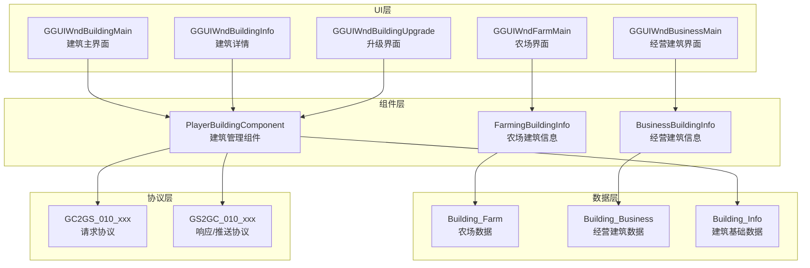
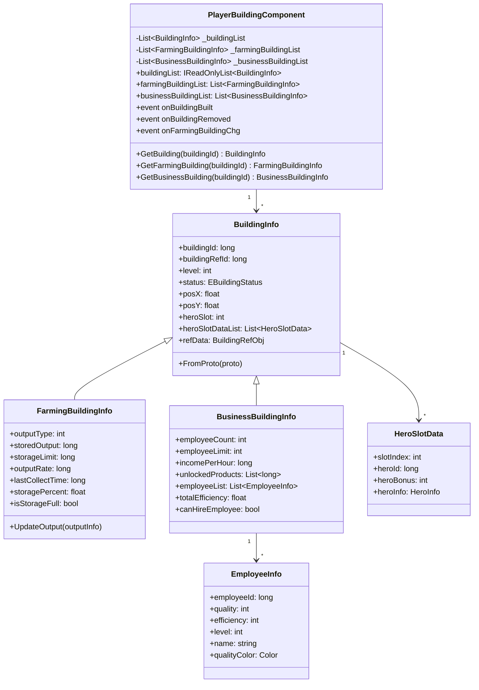

# 建筑模块 - 客户端开发文档

## 概述

建筑模块客户端负责展示玩家建筑列表、处理建造/升级操作、显示产出信息、管理英雄驻扎等功能。

---

## 架构总览



---

## 一、组件数据层

### 1.1 核心组件类

#### PlayerBuildingComponent

**路径**: `GameComponent/Building/PlayerBuildingComponent.cs`

**功能**: 建筑管理器，管理玩家所有建筑数据

**继承关系**:
```
PlayerBuildingComponent : _ANPBasicPlayerComponent
```

**协议模块**: p010_BuildingOp

**依赖组件**:
- `ENPPlayerCompType.HERO` - 英雄组件（用于驻扎功能）

**完整属性列表**:

| 属性名 | 类型 | 访问级别 | 说明 |
|--------|------|----------|------|
| buildingList | IReadOnlyList&lt;BuildingInfo&gt; | public | 所有建筑列表（只读） |
| farmingBuildingList | List&lt;FarmingBuildingInfo&gt; | public | 农场建筑列表 |
| businessBuildingList | List&lt;BusinessBuildingInfo&gt; | public | 商业建筑列表 |
| residentialBuildingList | List&lt;BuildingInfo&gt; | public | 住宅建筑列表 |
| nextOrderedBuilding | BuildingInfo | public | 下一个要建造的建筑 |
| farmingMultipleInfo | FarmingMultipleInfo | public | 农场建筑暴击倍数信息 |
| haveBuildingUnderConstruction | bool | public | 是否有建筑正在建造 |
| totalBuildingCount | int | public | 建筑总数 |
| totalFarmCount | int | public | 农场总数 |
| totalBusinessCount | int | public | 经营建筑总数 |

**主要事件**:

| 事件名 | 委托类型 | 说明 |
|--------|----------|------|
| onBuildingBuilt | Action&lt;BuildingInfo&gt; | 建筑建造完成 |
| onBuildingRemoved | Action&lt;long&gt; | 建筑移除 |
| onFarmingBuildingChg | Action&lt;FarmingBuildingInfo&gt; | 农场建筑变化 |
| onBusinessBuildingChg | Action&lt;BusinessBuildingInfo&gt; | 商业建筑变化 |
| onNextOrderedBuildingChg | Action&lt;BuildingInfo&gt; | 下一个建筑变化 |
| onOutputUpdate | Action&lt;long, Building_OutputInfo&gt; | 产出更新 |

**类定义**:

```csharp
public class PlayerBuildingComponent : _ANPBasicPlayerComponent
{
    // 数据存储
    private List<BuildingInfo> _buildingList = new List<BuildingInfo>();
    private List<FarmingBuildingInfo> _farmingBuildingList = new List<FarmingBuildingInfo>();
    private List<BusinessBuildingInfo> _businessBuildingList = new List<BusinessBuildingInfo>();

    // 公开属性
    public IReadOnlyList<BuildingInfo> buildingList => _buildingList;
    public List<FarmingBuildingInfo> farmingBuildingList => _farmingBuildingList;
    public List<BusinessBuildingInfo> businessBuildingList => _businessBuildingList;

    // 事件
    public event Action<BuildingInfo> onBuildingBuilt;
    public event Action<long> onBuildingRemoved;
    public event Action<FarmingBuildingInfo> onFarmingBuildingChg;
    public event Action<BusinessBuildingInfo> onBusinessBuildingChg;
    public event Action<long, Building_OutputInfo> onOutputUpdate;

    // 协议模块
    public override int GetProtocolModule() => (int)ENPProtocolModule.p010_BuildingOp;

    // 初始化
    protected override void OnInit()
    {
        base.OnInit();
        RegisterProtocolHandlers();
    }

    // 获取建筑
    public BuildingInfo GetBuilding(long buildingId)
    {
        return _buildingList.FirstOrDefault(b => b.buildingId == buildingId);
    }

    // 获取农场建筑
    public FarmingBuildingInfo GetFarmingBuilding(long buildingId)
    {
        return _farmingBuildingList.FirstOrDefault(b => b.buildingId == buildingId);
    }

    // 获取经营建筑
    public BusinessBuildingInfo GetBusinessBuilding(long buildingId)
    {
        return _businessBuildingList.FirstOrDefault(b => b.buildingId == buildingId);
    }
}
```

---

### 1.2 建筑信息类

#### BuildingInfo

**路径**: `GameComponent/Building/BuildingInfo.cs`

**完整属性列表**:

| 属性名 | 类型 | 说明 |
|--------|------|------|
| buildingId | long | 建筑唯一ID |
| buildingRefId | long | 建筑配置ID |
| level | int | 建筑等级 |
| status | EBuildingStatus | 建筑状态 |
| posX | float | 建筑位置X坐标 |
| posY | float | 建筑位置Y坐标 |
| heroSlot | int | 英雄槽位数量 |
| heroSlotDataList | List&lt;HeroSlotData&gt; | 英雄槽位数据 |
| createTime | long | 创建时间戳 |
| refData | BuildingRefObj | 静态配置引用 |

**类定义**:

```csharp
public class BuildingInfo
{
    public long buildingId { get; private set; }
    public long buildingRefId { get; private set; }
    public int level { get; private set; }
    public EBuildingStatus status { get; private set; }
    public float posX { get; private set; }
    public float posY { get; private set; }
    public int heroSlot { get; private set; }
    public List<HeroSlotData> heroSlotDataList { get; private set; }

    // 静态配置缓存
    private BuildingRefObj _refData;
    public BuildingRefObj refData
    {
        get
        {
            if (_refData == null)
                _refData = GRefdataCoreMgr.instance.buildingRefCore.getRef(buildingRefId);
            return _refData;
        }
    }

    // 是否有英雄驻扎
    public bool hasHeroSlot => heroSlotDataList != null && heroSlotDataList.Count > 0;

    // 建筑名称
    public string buildingName => refData?.name ?? "未知建筑";

    // 建筑类型
    public EBuildingFuncEnum buildingType => (EBuildingFuncEnum)(refData?.type ?? 0);

    // 从协议数据初始化
    public void FromProto(Building_Info proto)
    {
        buildingId = proto.buildingId;
        buildingRefId = proto.refId;
        level = proto.level;
        status = (EBuildingStatus)proto.status;
        posX = proto.posX;
        posY = proto.posY;
        heroSlot = proto.heroSlot;

        heroSlotDataList = new List<HeroSlotData>();
        foreach (var slotProto in proto.heroSlotList)
        {
            heroSlotDataList.Add(new HeroSlotData(slotProto));
        }
    }
}
```

---

#### FarmingBuildingInfo

**路径**: `GameComponent/Building/FarmingBuildingInfo.cs`

**完整属性列表**:

| 属性名 | 类型 | 说明 |
|--------|------|------|
| buildingId | long | 建筑ID |
| outputType | int | 产出类型 |
| storedOutput | long | 已存储产出 |
| storageLimit | long | 存储上限 |
| outputRate | long | 产出速率（每分钟） |
| lastCollectTime | long | 上次收集时间 |
| multiple | int | 暴击倍数 |

**类定义**:

```csharp
public class FarmingBuildingInfo : BuildingInfo
{
    public int outputType { get; private set; }
    public long storedOutput { get; private set; }
    public long storageLimit { get; private set; }
    public long outputRate { get; private set; }
    public long lastCollectTime { get; private set; }
    public int multiple { get; private set; }

    // 存储百分比
    public float storagePercent => storageLimit > 0 ? (float)storedOutput / storageLimit : 0f;

    // 是否已满
    public bool isStorageFull => storedOutput >= storageLimit;

    // 是否有空产出
    public bool hasOutput => storedOutput > 0;

    // 预计存满时间（秒）
    public long estimatedFullTime => outputRate > 0 ?
        (storageLimit - storedOutput) * 60 / outputRate : long.MaxValue;

    // 从协议数据初始化
    public new void FromProto(Building_Info proto)
    {
        base.FromProto(proto);
        if (proto.farmInfo != null)
        {
            outputType = proto.farmInfo.outputType;
            storedOutput = proto.farmInfo.storedOutput;
            storageLimit = proto.farmInfo.storageLimit;
            outputRate = proto.farmInfo.outputRate;
            lastCollectTime = proto.farmInfo.lastCollectTime;
        }
    }

    // 更新产出
    public void UpdateOutput(Building_OutputInfo outputInfo)
    {
        storedOutput = outputInfo.outputCount;
        multiple = outputInfo.critMultiple;
    }
}
```

---

#### BusinessBuildingInfo

**路径**: `GameComponent/Building/BusinessBuildingInfo.cs`

**完整属性列表**:

| 属性名 | 类型 | 说明 |
|--------|------|------|
| buildingId | long | 建筑ID |
| employeeCount | int | 员工数量 |
| employeeLimit | int | 员工上限 |
| incomePerHour | long | 每小时收益 |
| unlockedProducts | List&lt;long&gt; | 已解锁产品列表 |
| employeeList | List&lt;EmployeeInfo&gt; | 员工列表 |
| totalEfficiency | float | 总效率 |

**类定义**:

```csharp
public class BusinessBuildingInfo : BuildingInfo
{
    public int employeeCount { get; private set; }
    public int employeeLimit { get; private set; }
    public long incomePerHour { get; private set; }
    public List<long> unlockedProducts { get; private set; }
    public List<EmployeeInfo> employeeList { get; private set; }

    // 总效率
    public float totalEfficiency
    {
        get
        {
            if (employeeList == null || employeeList.Count == 0) return 1f;
            return employeeList.Sum(e => e.efficiency / 10000f) / employeeLimit;
        }
    }

    // 是否可雇佣员工
    public bool canHireEmployee => employeeCount < employeeLimit;

    // 从协议数据初始化
    public new void FromProto(Building_Info proto)
    {
        base.FromProto(proto);
        if (proto.businessInfo != null)
        {
            employeeCount = proto.businessInfo.employeeCount;
            employeeLimit = proto.businessInfo.employeeLimit;
            incomePerHour = proto.businessInfo.incomePerHour;
            unlockedProducts = proto.businessInfo.unlockedProducts.ToList();

            employeeList = new List<EmployeeInfo>();
            foreach (var empProto in proto.businessInfo.employeeList)
            {
                employeeList.Add(new EmployeeInfo(empProto));
            }
        }
    }
}
```

---

### 1.3 辅助数据类

#### HeroSlotData

**路径**: `GameComponent/Building/HeroSlotData.cs`

```csharp
public class HeroSlotData
{
    public int slotIndex { get; private set; }
    public long heroId { get; private set; }
    public int heroBonus { get; private set; }

    // 英雄信息（从英雄组件获取）
    private HeroInfo _heroInfo;
    public HeroInfo heroInfo
    {
        get
        {
            if (_heroInfo == null && heroId > 0)
                _heroInfo = NPPlayer.instance.heroComp.GetHeroInfo(heroId);
            return _heroInfo;
        }
    }

    public HeroSlotData(Building_HeroSlot proto)
    {
        slotIndex = proto.slotIndex;
        heroId = proto.heroId;
        heroBonus = proto.heroBonus;
    }
}
```

#### EmployeeInfo

**路径**: `GameComponent/Building/EmployeeInfo.cs`

```csharp
public class EmployeeInfo
{
    public long employeeId { get; private set; }
    public int quality { get; private set; }
    public int efficiency { get; private set; }
    public int level { get; private set; }
    public string name { get; private set; }

    // 效率百分比显示
    public string efficiencyPercent => $"{efficiency / 100f:F1}%";

    // 品质颜色
    public Color qualityColor => GetQualityColor(quality);

    public EmployeeInfo(Building_EmployeeInfo proto)
    {
        employeeId = proto.employeeId;
        quality = proto.quality;
        efficiency = proto.efficiency;
        level = proto.level;
        name = proto.name;
    }

    private Color GetQualityColor(int quality)
    {
        switch (quality)
        {
            case 1: return Color.white;      // 普通
            case 2: return Color.green;      // 优秀
            case 3: return Color.blue;       // 精良
            case 4: return Color.magenta;    // 史诗
            case 5: return Color.yellow;     // 传说
            default: return Color.white;
        }
    }
}
```

---

## 二、协议接口

### 2.1 请求协议

```csharp
public static class BuildingProtocol
{
    /// <summary>
    /// 请求创建建筑
    /// </summary>
    public static void ReqCreateBuilding(long buildingRefId, float posX, float posY,
        Action<GS2GC_010_001_RetCreateBuilding> callback = null)
    {
        var req = new GC2GS_010_001_ReqCreateBuilding();
        req.buildingRefId = buildingRefId;
        req.posX = posX;
        req.posY = posY;

        NPPlayer.instance.SendProtocol(req, (proto) => {
            callback?.Invoke(proto as GS2GC_010_001_RetCreateBuilding);
        });
    }

    /// <summary>
    /// 请求升级建筑
    /// </summary>
    public static void ReqUpgradeBuilding(long buildingId,
        Action<GS2GC_010_002_RetUpgradeBuilding> callback = null)
    {
        var req = new GC2GS_010_002_ReqUpgradeBuilding();
        req.buildingId = buildingId;

        NPPlayer.instance.SendProtocol(req, (proto) => {
            callback?.Invoke(proto as GS2GC_010_002_RetUpgradeBuilding);
        });
    }

    /// <summary>
    /// 请求农场点击产出
    /// </summary>
    public static void ReqFarmClickOutput(long buildingId, int clickCount,
        Action<GS2GC_010_003_RetFarmClickOutput> callback = null)
    {
        var req = new GC2GS_010_003_ReqFarmClickOutput();
        req.buildingId = buildingId;
        req.clickCount = clickCount;

        NPPlayer.instance.SendProtocol(req, (proto) => {
            callback?.Invoke(proto as GS2GC_010_003_RetFarmClickOutput);
        });
    }

    /// <summary>
    /// 请求收集产出
    /// </summary>
    public static void ReqCollectOutput(long buildingId,
        Action<GS2GC_010_004_RetCollectOutput> callback = null)
    {
        var req = new GC2GS_010_004_ReqCollectOutput();
        req.buildingId = buildingId;

        NPPlayer.instance.SendProtocol(req, (proto) => {
            callback?.Invoke(proto as GS2GC_010_004_RetCollectOutput);
        });
    }

    /// <summary>
    /// 请求设置英雄到建筑
    /// </summary>
    public static void ReqSetHeroToBuilding(long buildingId, long heroId, int slotIndex,
        Action<GS2GC_010_005_RetSetHeroToBuilding> callback = null)
    {
        var req = new GC2GS_010_005_ReqSetHeroToBuilding();
        req.buildingId = buildingId;
        req.heroId = heroId;
        req.slotIndex = slotIndex;

        NPPlayer.instance.SendProtocol(req, (proto) => {
            callback?.Invoke(proto as GS2GC_010_005_RetSetHeroToBuilding);
        });
    }

    /// <summary>
    /// 请求移除英雄
    /// </summary>
    public static void ReqRemoveHeroFromBuilding(long buildingId, int slotIndex,
        Action<GS2GC_010_006_RetRemoveHeroFromBuilding> callback = null)
    {
        var req = new GC2GS_010_006_ReqRemoveHeroFromBuilding();
        req.buildingId = buildingId;
        req.slotIndex = slotIndex;

        NPPlayer.instance.SendProtocol(req, (proto) => {
            callback?.Invoke(proto as GS2GC_010_006_RetRemoveHeroFromBuilding);
        });
    }

    /// <summary>
    /// 请求雇佣员工
    /// </summary>
    public static void ReqBusinessHireEmployee(long buildingId, long employeeRefId, int count,
        Action<GS2GC_010_007_RetBusinessHireEmployee> callback = null)
    {
        var req = new GC2GS_010_007_ReqBusinessHireEmployee();
        req.buildingId = buildingId;
        req.employeeRefId = employeeRefId;
        req.count = count;

        NPPlayer.instance.SendProtocol(req, (proto) => {
            callback?.Invoke(proto as GS2GC_010_007_RetBusinessHireEmployee);
        });
    }
}
```

### 2.2 协议处理

```csharp
public partial class PlayerBuildingComponent
{
    // 注册协议处理器
    private void RegisterProtocolHandlers()
    {
        NPPlayer.instance.RegisterHandler<GS2GC_010_050_OnBuildingAdd>(OnBuildingAdd);
        NPPlayer.instance.RegisterHandler<GS2GC_010_051_OnBuildingRemove>(OnBuildingRemove);
        NPPlayer.instance.RegisterHandler<GS2GC_010_052_OnBuildingUpdate>(OnBuildingUpdate);
        NPPlayer.instance.RegisterHandler<GS2GC_010_053_OnBuildingOutputUpdate>(OnBuildingOutputUpdate);
        NPPlayer.instance.RegisterHandler<GS2GC_010_054_OnEmployeeAdd>(OnEmployeeAdd);
        NPPlayer.instance.RegisterHandler<GS2GC_010_055_OnEmployeeRemove>(OnEmployeeRemove);
    }

    // 建筑新增
    private void OnBuildingAdd(GS2GC_010_050_OnBuildingAdd proto)
    {
        var buildingInfo = CreateBuildingInfo(proto.buildingInfo);
        _buildingList.Add(buildingInfo);

        // 分类添加
        switch (buildingInfo.buildingType)
        {
            case EBuildingFuncEnum.Farm:
                _farmingBuildingList.Add(buildingInfo as FarmingBuildingInfo);
                break;
            case EBuildingFuncEnum.Business:
                _businessBuildingList.Add(buildingInfo as BusinessBuildingInfo);
                break;
        }

        onBuildingBuilt?.Invoke(buildingInfo);
    }

    // 建筑移除
    private void OnBuildingRemove(GS2GC_010_051_OnBuildingRemove proto)
    {
        var buildingId = proto.buildingId;
        var building = _buildingList.FirstOrDefault(b => b.buildingId == buildingId);

        if (building != null)
        {
            _buildingList.Remove(building);

            // 从分类列表移除
            if (building is FarmingBuildingInfo farmBuilding)
                _farmingBuildingList.Remove(farmBuilding);
            else if (building is BusinessBuildingInfo businessBuilding)
                _businessBuildingList.Remove(businessBuilding);
        }

        onBuildingRemoved?.Invoke(buildingId);
    }

    // 建筑更新
    private void OnBuildingUpdate(GS2GC_010_052_OnBuildingUpdate proto)
    {
        var buildingId = proto.buildingInfo.buildingId;
        var building = _buildingList.FirstOrDefault(b => b.buildingId == buildingId);

        if (building != null)
        {
            building.FromProto(proto.buildingInfo);

            if (building is FarmingBuildingInfo farmBuilding)
                onFarmingBuildingChg?.Invoke(farmBuilding);
            else if (building is BusinessBuildingInfo businessBuilding)
                onBusinessBuildingChg?.Invoke(businessBuilding);
        }
    }

    // 产出更新
    private void OnBuildingOutputUpdate(GS2GC_010_053_OnBuildingOutputUpdate proto)
    {
        var farmBuilding = _farmingBuildingList.FirstOrDefault(b => b.buildingId == proto.buildingId);
        if (farmBuilding != null)
        {
            farmBuilding.UpdateOutput(proto.outputInfo);
            onOutputUpdate?.Invoke(proto.buildingId, proto.outputInfo);
        }
    }

    // 创建建筑信息
    private BuildingInfo CreateBuildingInfo(Building_Info proto)
    {
        BuildingInfo buildingInfo;

        var type = (EBuildingFuncEnum)proto.type;
        switch (type)
        {
            case EBuildingFuncEnum.Farm:
                buildingInfo = new FarmingBuildingInfo();
                break;
            case EBuildingFuncEnum.Business:
                buildingInfo = new BusinessBuildingInfo();
                break;
            default:
                buildingInfo = new BuildingInfo();
                break;
        }

        buildingInfo.FromProto(proto);
        return buildingInfo;
    }
}
```

---

## 三、UI窗口

**窗口目录**: `GameWndGui/GGui/Building/`

### 3.1 窗口列表

| 类名 | 说明 | 主要功能 |
|------|------|----------|
| GGUIWndBuildingMain | 建筑主界面 | 显示所有建筑列表，建造入口 |
| GGUIWndBuildingInfo | 建筑详情 | 单个建筑详情，升级操作 |
| GGUIWndBuildingUpgrade | 建筑升级 | 升级确认，资源展示 |
| GGUIWndBuildingList | 建筑列表 | 建筑选择，筛选功能 |
| GGUIWndFarmMain | 农场主界面 | 农场产出，点击收集 |
| GGUIWndBusinessMain | 商业建筑主界面 | 员工管理，产品解锁 |
| GGUIWndHeroSlotSelect | 英雄选择 | 选择驻扎英雄 |
| GGUIWndEmployeeHire | 雇佣员工 | 雇佣员工界面 |

### 3.2 窗口实现示例

#### GGUIWndBuildingMain

```csharp
public class GGUIWndBuildingMain : GGUIWndBase
{
    // UI控件
    private GGUIList _buildingList;           // 建筑列表
    private GGUIButton _btnCreate;            // 建造按钮
    private GGUIButton _btnFarmTab;           // 农场标签
    private GGUIButton _btnBusinessTab;       // 经营建筑标签

    // 当前标签
    private EBuildingFuncEnum _currentTab = EBuildingFuncEnum.Farm;

    // 建筑组件
    private PlayerBuildingComponent _buildingComp;

    protected override void OnInit()
    {
        base.OnInit();

        // 获取组件
        _buildingComp = NPPlayer.instance.buildingComp;

        // 注册事件
        _buildingComp.onBuildingBuilt += OnBuildingBuilt;
        _buildingComp.onBuildingRemoved += OnBuildingRemoved;
        _buildingComp.onFarmingBuildingChg += OnFarmingBuildingChg;
        _buildingComp.onBusinessBuildingChg += OnBusinessBuildingChg;

        // 初始化列表
        _buildingList = GetControl<GGUIList>("BuildingList");
        _buildingList.onItemRender += OnBuildingItemRender;
        _buildingList.onClickItem += OnBuildingItemClick;

        // 按钮事件
        _btnCreate = GetControl<GGUIButton>("BtnCreate");
        _btnCreate.onClick += OnCreateButtonClick;

        _btnFarmTab = GetControl<GGUIButton>("BtnFarmTab");
        _btnFarmTab.onClick += () => SwitchTab(EBuildingFuncEnum.Farm);

        _btnBusinessTab = GetControl<GGUIButton>("BtnBusinessTab");
        _btnBusinessTab.onClick += () => SwitchTab(EBuildingFuncEnum.Business);
    }

    protected override void OnShow()
    {
        base.OnShow();
        RefreshBuildingList();
    }

    // 切换标签
    private void SwitchTab(EBuildingFuncEnum tab)
    {
        _currentTab = tab;
        RefreshBuildingList();
        UpdateTabButtons();
    }

    // 刷新建筑列表
    private void RefreshBuildingList()
    {
        IEnumerable<BuildingInfo> buildings;

        switch (_currentTab)
        {
            case EBuildingFuncEnum.Farm:
                buildings = _buildingComp.farmingBuildingList;
                break;
            case EBuildingFuncEnum.Business:
                buildings = _buildingComp.businessBuildingList;
                break;
            default:
                buildings = _buildingComp.buildingList;
                break;
        }

        _buildingList.SetData(buildings.ToList());
    }

    // 渲染列表项
    private void OnBuildingItemRender(GGUIListItem item, object data)
    {
        var building = data as BuildingInfo;
        if (building == null) return;

        // 建筑名称
        var txtName = item.GetControl<GGUILabel>("TxtName");
        txtName.text = building.buildingName;

        // 等级
        var txtLevel = item.GetControl<GGUILabel>("TxtLevel");
        txtLevel.text = $"Lv.{building.level}";

        // 图标
        var imgIcon = item.GetControl<GUIImage>("ImgIcon");
        imgIcon.SetSprite(building.refData?.icon);

        // 状态
        var imgStatus = item.GetControl<GUIImage>("ImgStatus");
        imgStatus.SetActive(building.status == EBuildingStatus.Upgrading);

        // 农场特有：显示存储
        if (building is FarmingBuildingInfo farmBuilding)
        {
            var progressStorage = item.GetControl<GGUIProgress>("ProgressStorage");
            progressStorage.value = farmBuilding.storagePercent;
        }

        // 经营建筑特有：显示收益
        if (building is BusinessBuildingInfo businessBuilding)
        {
            var txtIncome = item.GetControl<GGUILabel>("TxtIncome");
            txtIncome.text = $"+{businessBuilding.incomePerHour}/h";
        }
    }

    // 点击建筑项
    private void OnBuildingItemClick(GGUIListItem item, object data)
    {
        var building = data as BuildingInfo;
        if (building == null) return;

        // 打开建筑详情
        GGUIWndMgr.instance.OpenWnd<GGUIWndBuildingInfo>(new { buildingId = building.buildingId });
    }

    // 点击建造按钮
    private void OnCreateButtonClick()
    {
        GGUIWndMgr.instance.OpenWnd<GGUIWndBuildingList>();
    }

    // 建筑新增回调
    private void OnBuildingBuilt(BuildingInfo building)
    {
        RefreshBuildingList();
    }

    // 建筑移除回调
    private void OnBuildingRemoved(long buildingId)
    {
        RefreshBuildingList();
    }

    // 农场变化回调
    private void OnFarmingBuildingChg(FarmingBuildingInfo building)
    {
        if (_currentTab == EBuildingFuncEnum.Farm)
            RefreshBuildingList();
    }

    // 经营建筑变化回调
    private void OnBusinessBuildingChg(BusinessBuildingInfo building)
    {
        if (_currentTab == EBuildingFuncEnum.Business)
            RefreshBuildingList();
    }

    protected override void OnDestroy()
    {
        // 注销事件
        _buildingComp.onBuildingBuilt -= OnBuildingBuilt;
        _buildingComp.onBuildingRemoved -= OnBuildingRemoved;
        _buildingComp.onFarmingBuildingChg -= OnFarmingBuildingChg;
        _buildingComp.onBusinessBuildingChg -= OnBusinessBuildingChg;

        base.OnDestroy();
    }
}
```

#### GGUIWndFarmMain

```csharp
public class GGUIWndFarmMain : GGUIWndBase
{
    // 当前农场建筑
    private FarmingBuildingInfo _farmBuilding;

    // UI控件
    private GGUIProgress _progressStorage;    // 存储进度
    private GGUIButton _btnCollect;           // 收集按钮
    private GUILabel _txtOutput;              // 产出文本
    private GUILabel _txtRate;                // 产出速率
    private GUILabel _txtCrit;                // 暴击提示

    // 动画
    private Coroutine _collectCoroutine;

    protected override void OnInit()
    {
        base.OnInit();

        _progressStorage = GetControl<GGUIProgress>("ProgressStorage");
        _btnCollect = GetControl<GGUIButton>("BtnCollect");
        _txtOutput = GetControl<GUILabel>("TxtOutput");
        _txtRate = GetControl<GUILabel>("TxtRate");
        _txtCrit = GetControl<GUILabel>("TxtCrit");

        _btnCollect.onClick += OnCollectClick;

        // 注册产出更新事件
        NPPlayer.instance.buildingComp.onOutputUpdate += OnOutputUpdate;
    }

    protected override void OnShow(object param)
    {
        base.OnShow(param);

        var buildingId = (long)param;
        _farmBuilding = NPPlayer.instance.buildingComp.GetFarmingBuilding(buildingId);

        RefreshUI();
        StartOutputTimer();
    }

    // 刷新UI
    private void RefreshUI()
    {
        if (_farmBuilding == null) return;

        _progressStorage.value = _farmBuilding.storagePercent;
        _txtOutput.text = $"{_farmBuilding.storedOutput}/{_farmBuilding.storageLimit}";
        _txtRate.text = $"+{_farmBuilding.outputRate}/分钟";

        // 更新收集按钮状态
        _btnCollect.interactable = _farmBuilding.hasOutput;
    }

    // 点击收集
    private void OnCollectClick()
    {
        if (_farmBuilding == null) return;

        // 发送收集请求
        BuildingProtocol.ReqFarmClickOutput(_farmBuilding.buildingId, 1, (res) => {
            if (res.result == 0)
            {
                // 显示收集动画
                PlayCollectAnimation(res.outputInfo);

                // 显示暴击提示
                if (res.isCrit)
                {
                    _txtCrit.text = $"暴击! x{res.critMultiple / 10000f:F1}";
                    _txtCrit.SetActive(true);
                    StartCoroutine(HideCritText());
                }
            }
        });
    }

    // 播放收集动画
    private void PlayCollectAnimation(Building_OutputInfo outputInfo)
    {
        // TODO: 播放粒子效果和飞行动画
        // 资源飞向顶部资源栏
    }

    // 隐藏暴击文本
    private IEnumerator HideCritText()
    {
        yield return new WaitForSeconds(2f);
        _txtCrit.SetActive(false);
    }

    // 产出更新回调
    private void OnOutputUpdate(long buildingId, Building_OutputInfo outputInfo)
    {
        if (_farmBuilding != null && buildingId == _farmBuilding.buildingId)
        {
            RefreshUI();
        }
    }

    // 定时刷新产出
    private void StartOutputTimer()
    {
        StartCoroutine(RefreshOutputCoroutine());
    }

    private IEnumerator RefreshOutputCoroutine()
    {
        while (IsOpen && _farmBuilding != null)
        {
            yield return new WaitForSeconds(1f);

            // 如果没有存满，模拟产出增长
            if (!_farmBuilding.isStorageFull)
            {
                RefreshUI();
            }
        }
    }

    protected override void OnDestroy()
    {
        NPPlayer.instance.buildingComp.onOutputUpdate -= OnOutputUpdate;
        base.OnDestroy();
    }
}
```

---

## 四、消息事件

| 消息类型 | 说明 | 参数 |
|----------|------|------|
| WinMsgType.ON_BUILDING_ADD | 建筑新增 | buildingId: long |
| WinMsgType.ON_BUILDING_REMOVE | 建筑移除 | buildingId: long |
| WinMsgType.ON_BUILDING_UPDATE | 建筑更新 | buildingId: long |
| WinMsgType.ON_BUILDING_LEVEL_CHG | 建筑等级变化 | buildingId: long, newLevel: int |
| WinMsgType.ON_HERO_PLACE_BUILDING_CHG | 英雄驻扎变化 | buildingId: long, heroId: long |
| WinMsgType.ON_FARM_OUTPUT_CHG | 农场产出变化 | buildingId: long, outputCount: long |
| WinMsgType.ON_EMPLOYEE_ADD | 员工新增 | buildingId: long, employeeId: long |
| WinMsgType.ON_EMPLOYEE_REMOVE | 员工移除 | employeeId: long |

---

## 五、访问方式

### 5.1 获取建筑组件

```csharp
// 获取建筑组件
PlayerBuildingComponent buildingComp = NPPlayer.instance.buildingComp;

// 获取所有建筑
var buildings = buildingComp.buildingList;

// 获取指定建筑
BuildingInfo building = buildingComp.GetBuilding(buildingId);

// 获取农场建筑列表
var farmingBuildings = buildingComp.farmingBuildingList;

// 获取商业建筑列表
var businessBuildings = buildingComp.businessBuildingList;
```

### 5.2 获取建筑配置

```csharp
// 获取建筑静态配置
BuildingRefObj buildingRef = GRefdataCoreMgr.instance.buildingRefCore.getRef(buildingRefId);

// 获取建筑等级配置
BuildingLevelRefObj levelRef = GRefdataCoreMgr.instance.buildingLevelRefCore.getRef(buildingRefId, level);

// 获取农田配置
FarmRefObj farmRef = GRefdataCoreMgr.instance.farmRefCore.getRef(farmId);

// 获取农田等级配置
FarmLevelRefObj farmLevelRef = GRefdataCoreMgr.instance.farmLevelRefCore.getRef(farmId, level);

// 获取经营建筑配置
BusinessRefObj businessRef = GRefdataCoreMgr.instance.businessRefCore.getRef(businessId);

// 获取产品配置
ProductRefObj productRef = GRefdataCoreMgr.instance.productRefCore.getRef(productId);

// 获取雇员配置
EmployeeRefObj employeeRef = GRefdataCoreMgr.instance.employeeRefCore.getRef(employeeId);
```

### 5.3 常用计算

```csharp
// 计算产出速率
public static long CalculateOutputRate(FarmingBuildingInfo farm)
{
    var farmRef = GRefdataCoreMgr.instance.farmRefCore.getRef(farm.buildingRefId);
    var levelRef = GRefdataCoreMgr.instance.farmLevelRefCore.getRef(farm.buildingRefId, farm.level);

    if (farmRef == null || levelRef == null) return 0;

    // 基础产出 * 等级系数
    long baseOutput = farmRef.base_output;
    double levelMultiplier = levelRef.output_multiplier / 10000.0;

    // 英雄加成
    double heroBonus = CalculateHeroBonus(farm);

    return (long)(baseOutput * levelMultiplier * (1 + heroBonus));
}

// 计算英雄加成
public static double CalculateHeroBonus(FarmingBuildingInfo farm)
{
    if (farm.heroSlotDataList == null || farm.heroSlotDataList.Count == 0)
        return 0;

    double totalBonus = 0;
    foreach (var slot in farm.heroSlotDataList)
    {
        totalBonus += slot.heroBonus / 10000.0;
    }
    return totalBonus;
}

// 计算存储产出
public static long CalculateStoredOutput(FarmingBuildingInfo farm)
{
    if (farm.lastCollectTime <= 0) return 0;

    long currentTime = DateTimeOffset.UtcNow.ToUnixTimeMilliseconds();
    long elapsedSeconds = (currentTime - farm.lastCollectTime) / 1000;

    long outputRate = CalculateOutputRate(farm);
    long accumulated = outputRate * elapsedSeconds / 60;

    return Math.Min(accumulated, farm.storageLimit);
}
```

---

## 六、类图



---

*文档生成时间: 2026-04-11*
