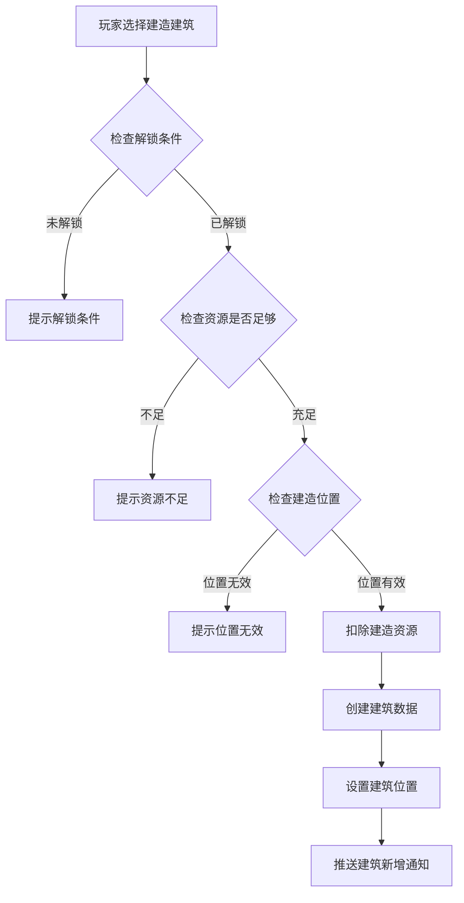
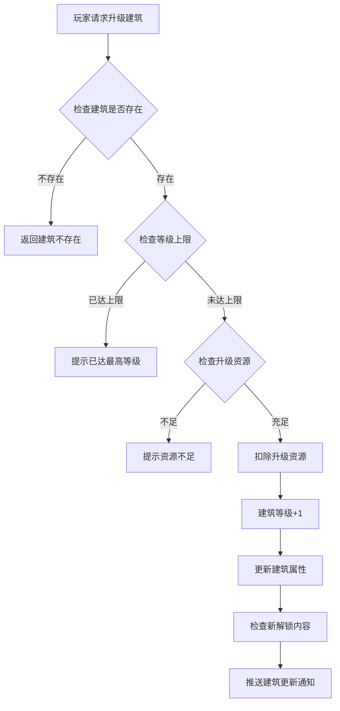
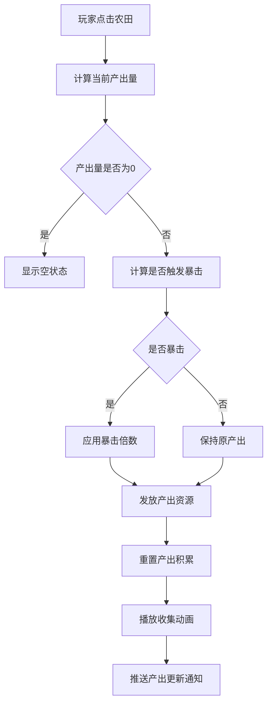
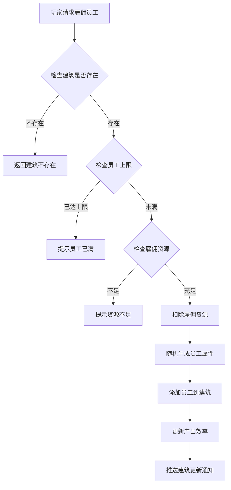
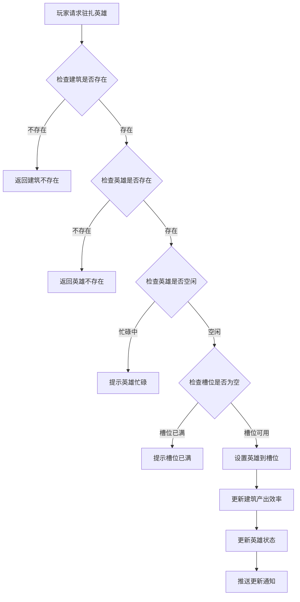

# 建筑模块完整说明

## 一、模块概述

### 1.1 业务背景

建筑模块是游戏中的核心经营玩法，玩家可以建造、升级各种建筑，通过建筑产出获取资源收益。建筑分为农田、经营建筑等类型，玩家需要合理规划建筑布局，雇佣员工，管理产出，实现资源增长。

### 1.2 目标用户

- **经营型玩家**：喜欢经营建造玩法
- **休闲玩家**：享受挂机收益
- **策略玩家**：规划建筑和员工配置

### 1.3 核心价值

1. **资源产出**：建筑持续产出游戏资源
2. **经营策略**：合理配置提高产出效率
3. **长期成长**：建筑升级提供持续追求
4. **英雄驻扎**：英雄管理建筑增强产出

---

## 二、功能清单

### 2.1 建筑建造功能

| 功能名称 | 功能描述 | 用户价值 |
|---------|---------|---------|
| 创建建筑 | 在指定位置建造新建筑 | 扩展经营规模 |
| 解锁建筑 | 满足条件解锁新建筑类型 | 获得新功能 |
| 建筑预览 | 预览建筑效果和收益 | 了解建筑价值 |

### 2.2 建筑升级功能

| 功能名称 | 功能描述 | 用户价值 |
|---------|---------|---------|
| 升级建筑 | 消耗资源提升建筑等级 | 提高产出效率 |
| 升级预览 | 预览升级后的属性变化 | 了解升级收益 |
| 快速完成 | 消耗钻石立即完成升级 | 节省等待时间 |

### 2.3 农田建筑功能

| 功能名称 | 功能描述 | 用户价值 |
|---------|---------|---------|
| 资源产出 | 农田自动产出资源 | 持续获得资源 |
| 点击收集 | 点击农田收集产出 | 主动获取收益 |
| 产出暴击 | 点击有概率触发暴击 | 获得额外收益 |
| 产出存储 | 产出资源存储上限 | 累计产出数量 |

### 2.4 经营建筑功能

| 功能名称 | 功能描述 | 用户价值 |
|---------|---------|---------|
| 雇佣员工 | 雇佣员工提高产出效率 | 增加收益 |
| 员工升级 | 提升员工等级和能力 | 提高效率 |
| 产品解锁 | 解锁新产品线 | 扩展产出种类 |
| 自动经营 | 自动生产和销售产品 | 挂机收益 |

### 2.5 英雄驻扎功能

| 功能名称 | 功能描述 | 用户价值 |
|---------|---------|---------|
| 英雄驻扎 | 派遣英雄管理建筑 | 英雄发挥作用 |
| 驻扎加成 | 英雄提供产出加成 | 提高效率 |
| 多槽位 | 高等级建筑多槽位 | 派遣更多英雄 |
| 移除驻扎 | 将英雄从建筑移除 | 重新分配 |

---

## 三、业务流程详解

### 3.1 建筑建造流程



**详细步骤说明**：

1. **条件检查**
   - 检查建筑是否已解锁
   - 检查是否达到建造上限
   - 检查建造位置是否有效

2. **资源扣除**
   - 扣除建造所需货币
   - 扣除建造所需材料

3. **建筑创建**
   - 创建建筑数据实例
   - 设置初始等级和属性
   - 推送创建通知

### 3.2 建筑升级流程



### 3.3 农田产出收集流程



**详细步骤说明**：

1. **产出计算**
   - 根据时间计算积累产出
   - 根据等级计算产出效率
   - 根据驻扎英雄计算加成

2. **暴击判定**
   - 根据配置概率判定暴击
   - 应用暴击倍数计算最终产出

3. **资源发放**
   - 发放产出资源到玩家
   - 重置产出积累数据
   - 推送变化通知

### 3.4 经营建筑雇佣流程



### 3.5 英雄驻扎流程



---

## 四、关键规则

### 4.1 建筑类型规则

1. **农田类型**
   - 产出类型：粮食、木材等基础资源
   - 产出方式：自动积累，点击收集
   - 存储上限：根据等级提升

2. **经营建筑类型**
   - 产出类型：金币、产品收益
   - 产出方式：员工自动经营
   - 员工上限：根据等级提升

3. **住宅类型**
   - 功能：提供人口上限
   - 解锁更多建筑槽位

### 4.2 建筑升级规则

1. **等级限制**
   - 每种建筑有最大等级
   - 玩家等级限制建筑等级上限

2. **资源消耗**
   - 消耗货币和材料
   - 等级越高消耗越大

3. **解锁内容**
   - 新增员工槽位
   - 新增产品线
   - 提高存储上限

### 4.3 产出规则

1. **产出积累**
   - 按时间自动积累
   - 有存储上限限制

2. **产出加成**
   - 英雄驻扎加成
   - 员工效率加成
   - VIP加成

3. **暴击规则**
   - 点击收集有概率暴击
   - 暴击倍数根据配置
   - VIP增加暴击概率

### 4.4 英雄驻扎规则

1. **驻扎条件**
   - 英雄必须空闲
   - 建筑槽位可用
   - 英雄等级满足要求

2. **驻扎效果**
   - 提高产出效率
   - 可能提供特殊效果
   - 多英雄效果叠加

3. **驻扎限制**
   - 同一英雄只能驻扎一个建筑
   - 英雄驻扎期间不能出战

---

## 五、用户故事

### 5.1 经营玩家故事

> 作为一名经营型玩家，我建造了多个农田和经营建筑。每天上线我都会收集产出，雇佣新员工提高效率。我还派遣英雄驻扎在重要的建筑中，收益越来越高，看着资源不断增长很有成就感。

### 5.2 休闲玩家故事

> 作为一名休闲玩家，我主要依靠建筑产出来获取资源。农田自动产出资源，我上线时点击收集就能获得收益。虽然不是很勤奋，但也能稳定获得收入。

### 5.3 策略玩家故事

> 作为一名策略玩家，我仔细研究了建筑配置。我优先升级高收益的建筑，合理分配英雄驻扎位置，雇佣高效率员工。通过优化配置，我的产出效率比同等级玩家高很多。

---

## 六、示例

### 6.1 农田建筑示例

**建筑配置**：
```
建筑ID: 1001
建筑名称: 初级农田
类型: 农田
最大等级: 10
基础产出: 10粮食/分钟
存储上限: 500粮食
暴击概率: 10%
暴击倍数: 2倍
```

**玩家数据**：
```
建筑唯一ID: 200001
等级: 5
存储粮食: 350/800
驻扎英雄: 英雄A (加成20%)
实际产出: 12粮食/分钟
```

### 6.2 经营建筑示例

**建筑配置**：
```
建筑ID: 2001
建筑名称: 杂货铺
类型: 经营建筑
最大等级: 15
员工上限: 5人
产品列表: [水果, 蔬菜, 日用品]
```

**玩家数据**：
```
建筑唯一ID: 300001
等级: 8
员工数量: 4人
员工总效率: 180%
每小时收益: 360金币
已解锁产品: [水果, 蔬菜]
```

### 6.3 建筑升级示例

**升级前**：
```
建筑: 初级农田
等级: 4
产出效率: 12/分钟
存储上限: 600
```

**升级消耗**：
```
银两: 5000
木材: 200
```

**升级后**：
```
等级: 5
产出效率: 15/分钟 (+25%)
存储上限: 800 (+33%)
新增槽位: 英雄槽位+1
```

---

*文档生成时间: 2026-04-07*
