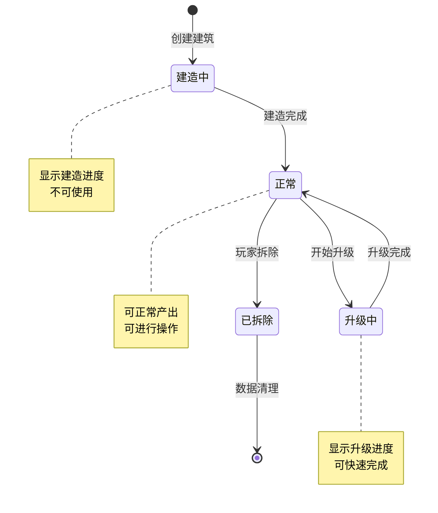
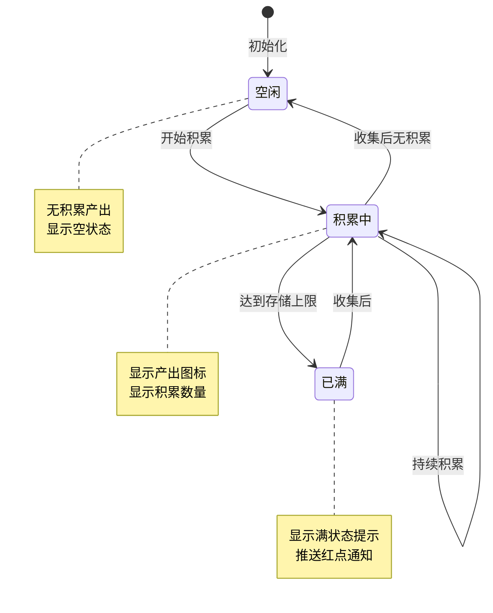
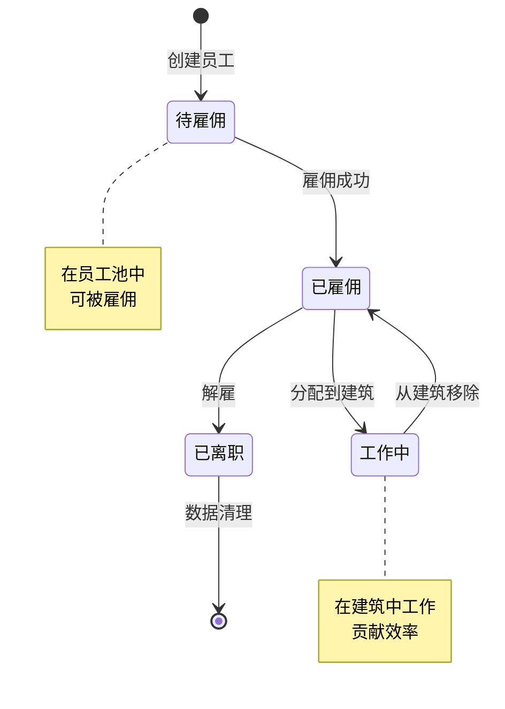
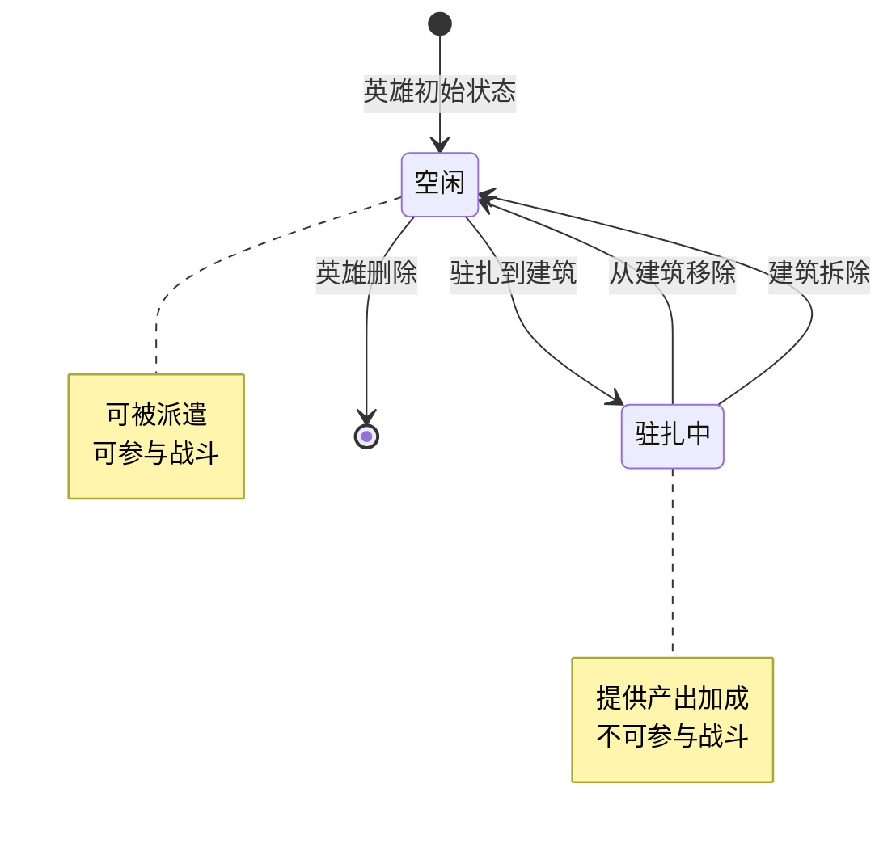
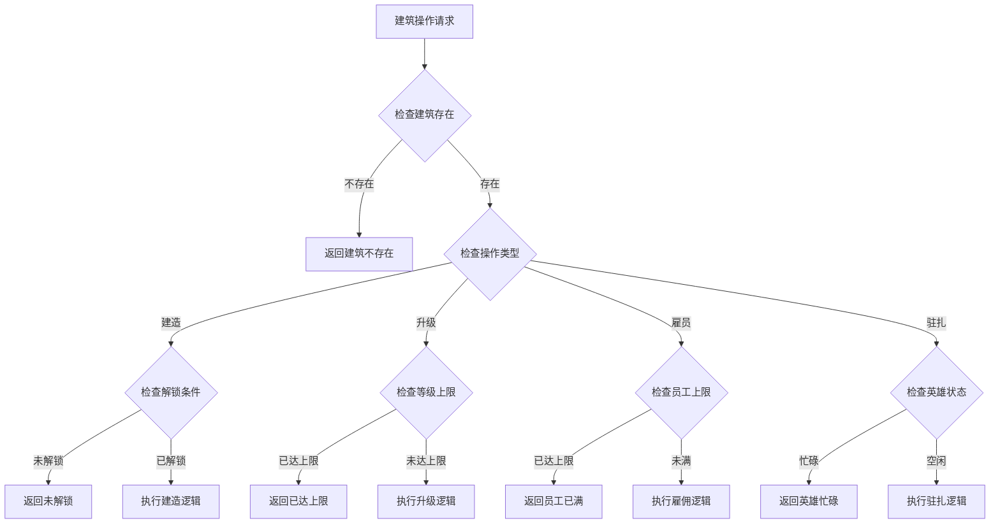
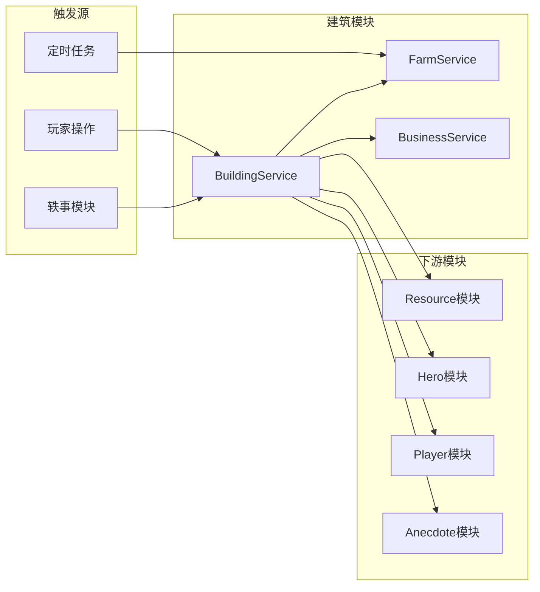

# 建筑模块实现细节

## 一、计算公式

### 1.1 农田产出计算公式

```
基础产出速率 = 配置基础产出 × 等级系数 × (1 + 英雄加成) × (1 + VIP加成)
等级系数 = 1 + (等级 - 1) × 每级提升比例
实际产出速率 = 基础产出速率 × (1 + 员工效率)
```

**示例计算**：
```
配置基础产出: 10/分钟
等级: 5
每级提升比例: 10%
英雄加成: 20%
VIP加成: 5%

等级系数 = 1 + (5-1) × 0.1 = 1.4
基础产出速率 = 10 × 1.4 × (1+0.2) × (1+0.05) = 17.64/分钟
```

### 1.2 存储产出计算公式

```
积累产出 = 产出速率 × 积累时间（秒） / 60
实际可收产出 = min(积累产出, 存储上限 - 已存储)
```

**示例计算**：
```
产出速率: 17.64/分钟
积累时间: 2小时 = 7200秒
存储上限: 800
已存储: 100

积累产出 = 17.64 × 7200 / 60 = 2116.8
实际可收产出 = min(2116.8, 800-100) = 700
```

### 1.3 暴击产出计算公式

```
暴击概率 = 基础暴击概率 + VIP暴击加成
暴击产出 = 正常产出 × 暴击倍数
```

**示例计算**：
```
基础暴击概率: 10%
VIP暴击加成: 5%
暴击倍数: 2倍
正常产出: 700

暴击概率 = 10% + 5% = 15%
如果触发暴击，产出 = 700 × 2 = 1400
```

### 1.4 经营建筑收益计算公式

```
基础收益 = 产品基础收益 × 产品数量
员工效率 = Σ(每个员工的效率值) / 员工上限
实际收益 = 基础收益 × (1 + 员工效率) × (1 + 英雄加成) × (1 + 等级加成)
```

**示例计算**：
```
产品基础收益: 100/小时
产品数量: 3
员工效率: 180%
英雄加成: 15%
等级加成: 40%

基础收益 = 100 × 3 = 300/小时
实际收益 = 300 × (1+1.8) × (1+0.15) × (1+0.4) = 1178.1/小时
```

### 1.5 建筑升级费用计算公式

```
升级费用 = 基础费用 × 等级系数
等级系数 = 等级 ^ 费用增长指数
```

**示例计算**：
```
基础费用: 1000银两
当前等级: 5
费用增长指数: 1.5

升级费用 = 1000 × 5^1.5 = 1000 × 11.18 ≈ 11180银两
```

---

## 二、状态机定义

### 2.1 建筑状态机



### 2.2 农田产出状态机



### 2.3 员工状态机



### 2.4 英雄驻扎状态机



---

## 三、数据约束

### 3.1 建筑数据约束

| 字段名 | 数据类型 | 取值范围 | 必填 | 说明 |
|--------|----------|----------|------|------|
| id | BIGINT | > 0 | 是 | 主键 |
| player_id | BIGINT | > 0 | 是 | 玩家ID |
| building_id | BIGINT | > 0 | 是 | 建筑唯一ID |
| ref_id | BIGINT | > 0 | 是 | 建筑配置ID |
| type | INT | 1-4 | 是 | 建筑类型 |
| level | INT | 1-100 | 是 | 等级 |
| pos_x | FLOAT | - | 是 | X坐标 |
| pos_y | FLOAT | - | 是 | Y坐标 |
| create_time | DATETIME | - | 是 | 创建时间 |

### 3.2 农田数据约束

| 字段名 | 数据类型 | 取值范围 | 必填 | 说明 |
|--------|----------|----------|------|------|
| building_id | BIGINT | > 0 | 是 | 建筑ID |
| stored_output | BIGINT | >= 0 | 是 | 已存储产出 |
| last_collect_time | DATETIME | - | 是 | 上次收集时间 |

### 3.3 经营建筑数据约束

| 字段名 | 数据类型 | 取值范围 | 必填 | 说明 |
|--------|----------|----------|------|------|
| building_id | BIGINT | > 0 | 是 | 建筑ID |
| employee_count | INT | >= 0 | 是 | 员工数量 |
| employee_list | JSON | - | 是 | 员工列表 |
| unlocked_products | JSON | - | 是 | 已解锁产品 |

### 3.4 员工数据约束

| 字段名 | 数据类型 | 取值范围 | 必填 | 说明 |
|--------|----------|----------|------|------|
| employee_id | BIGINT | > 0 | 是 | 员工ID |
| building_id | BIGINT | >= 0 | 是 | 所属建筑ID |
| quality | INT | 1-5 | 是 | 品质 |
| efficiency | FLOAT | 0.5-2.0 | 是 | 效率值 |
| level | INT | 1-10 | 是 | 员工等级 |

---

## 四、错误处理策略

### 4.1 建筑模块错误码

| 错误码 | 错误信息 | 处理策略 | 用户提示 |
|--------|----------|----------|----------|
| 110001 | 建筑不存在 | 检查建筑ID有效性 | "建筑不存在" |
| 110002 | 建筑未解锁 | 检查解锁条件 | "该建筑尚未解锁" |
| 110003 | 建筑已达最高等级 | 检查等级上限 | "建筑已达最高等级" |
| 110004 | 建造位置无效 | 检查位置是否可用 | "该位置无法建造" |
| 110005 | 资源不足 | 检查资源余额 | "资源不足" |
| 110006 | 员工已达上限 | 检查员工数量 | "员工数量已达上限" |
| 110007 | 英雄忙碌中 | 检查英雄状态 | "该英雄正在其他建筑工作" |
| 110008 | 槽位已满 | 检查槽位状态 | "没有空闲的槽位" |
| 110009 | 无产出可收集 | 检查存储状态 | "暂无产出可收集" |

### 4.2 建筑操作错误处理流程



### 4.3 产出收集错误处理

| 错误场景 | 处理策略 | 后续操作 |
|----------|----------|----------|
| 无产出 | 返回空状态 | 显示空提示 |
| 背包已满 | 部分发放 | 提示背包已满 |
| 网络错误 | 重试机制 | 重新请求 |

---

## 五、关键代码示例

### 5.1 创建建筑伪代码

```csharp
public Result CreateBuilding(long playerId, long buildingRefId, float posX, float posY)
{
    // 获取建筑配置
    BuildingRefObj buildingRef = buildingRefDao.getById(buildingRefId);
    if (buildingRef == null)
    {
        return Result.Error(110001, "建筑配置不存在");
    }

    // 检查解锁条件
    if (!CheckUnlockCondition(playerId, buildingRef))
    {
        return Result.Error(110002, "建筑未解锁");
    }

    // 检查建造位置
    if (!IsValidPosition(playerId, posX, posY))
    {
        return Result.Error(110004, "建造位置无效");
    }

    // 检查资源
    if (!CheckResource(playerId, buildingRef.build_cost))
    {
        return Result.Error(110005, "资源不足");
    }

    // 扣除资源
    CostResource(playerId, buildingRef.build_cost);

    // 创建建筑
    PlayerBuilding building = new PlayerBuilding {
        id = idGenerator.NextId(),
        player_id = playerId,
        building_id = idGenerator.NextId(),
        ref_id = buildingRefId,
        type = buildingRef.type,
        level = 1,
        pos_x = posX,
        pos_y = posY,
        create_time = DateTime.Now
    };

    buildingDao.insert(building);

    // 初始化建筑特有数据
    InitBuildingData(building);

    // 推送通知
    PushBuildingAdd(playerId, building);

    return Result.Success(building);
}
```

### 5.2 农田产出收集伪代码

```csharp
public Result CollectFarmOutput(long playerId, long buildingId)
{
    // 获取建筑数据
    PlayerBuilding building = buildingDao.getById(buildingId);
    if (building == null)
    {
        return Result.Error(110001, "建筑不存在");
    }

    // 获取农田数据
    FarmData farmData = farmDao.getByBuildingId(buildingId);
    if (farmData == null)
    {
        return Result.Error(110001, "农田数据不存在");
    }

    // 计算积累产出
    long accumulatedOutput = CalculateAccumulatedOutput(building, farmData);
    if (accumulatedOutput <= 0)
    {
        return Result.Error(110009, "无产出可收集");
    }

    // 计算暴击
    long finalOutput = CalculateCriticalOutput(playerId, accumulatedOutput, building);

    // 重置存储
    farmData.stored_output = 0;
    farmData.last_collect_time = DateTime.Now;
    farmDao.update(farmData);

    // 发放资源
    BuildingRefObj buildingRef = buildingRefDao.getById(building.ref_id);
    resourceService.AddResource(playerId, buildingRef.output_type, finalOutput, "农田产出");

    // 推送更新
    PushFarmUpdate(playerId, buildingId);

    return Result.Success(new { output = finalOutput, isCritical = finalOutput > accumulatedOutput });
}

private long CalculateAccumulatedOutput(PlayerBuilding building, FarmData farmData)
{
    BuildingRefObj buildingRef = buildingRefDao.getById(building.ref_id);
    BuildingLevelRefObj levelRef = buildingLevelRefDao.getById(building.ref_id, building.level);

    // 计算产出速率
    float outputRate = buildingRef.base_output * levelRef.output_multiplier;

    // 加入英雄加成
    float heroBonus = GetHeroBonus(buildingId);
    outputRate *= (1 + heroBonus);

    // 计算积累时间
    TimeSpan elapsed = DateTime.Now - farmData.last_collect_time;
    long accumulated = (long)(outputRate * elapsed.TotalMinutes);

    // 取存储上限和已存储中的较小值
    long maxStorage = levelRef.storage_limit;
    long actualOutput = Math.Min(accumulated + farmData.stored_output, maxStorage);
    actualOutput = Math.Max(0, actualOutput - farmData.stored_output);

    return actualOutput;
}
```

### 5.3 雇佣员工伪代码

```csharp
public Result HireEmployee(long playerId, long buildingId)
{
    // 获取建筑数据
    PlayerBuilding building = buildingDao.getById(buildingId);
    if (building == null)
    {
        return Result.Error(110001, "建筑不存在");
    }

    // 获取经营建筑数据
    BusinessData businessData = businessDao.getByBuildingId(buildingId);
    if (businessData == null)
    {
        return Result.Error(110001, "经营建筑数据不存在");
    }

    // 检查员工上限
    BuildingLevelRefObj levelRef = buildingLevelRefDao.getById(building.ref_id, building.level);
    if (businessData.employee_count >= levelRef.employee_limit)
    {
        return Result.Error(110006, "员工已达上限");
    }

    // 获取雇佣费用配置
    EmployeeRefObj employeeRef = employeeRefDao.getDefault();
    if (!resourceService.CheckResource(playerId, employeeRef.hire_cost))
    {
        return Result.Error(110005, "资源不足");
    }

    // 扣除费用
    resourceService.CostResource(playerId, employeeRef.hire_cost, "雇佣员工");

    // 生成员工属性
    Employee newEmployee = GenerateEmployee(employeeRef);
    newEmployee.building_id = buildingId;

    // 添加员工
    businessData.employees.Add(newEmployee);
    businessData.employee_count++;
    businessDao.update(businessData);

    // 推送更新
    PushBusinessUpdate(playerId, buildingId);

    return Result.Success(newEmployee);
}

private Employee GenerateEmployee(EmployeeRefObj refData)
{
    // 随机品质
    int quality = RandomQuality(refData.quality_weights);

    // 根据品质生成效率
    float baseEfficiency = refData.base_efficiency;
    float qualityBonus = quality * 0.1f;
    float randomBonus = Random.Range(0, 0.1f);
    float efficiency = baseEfficiency + qualityBonus + randomBonus;

    return new Employee {
        employee_id = idGenerator.NextId(),
        quality = quality,
        efficiency = efficiency,
        level = 1
    };
}
```

### 5.4 英雄驻扎伪代码

```csharp
public Result SetHeroToBuilding(long playerId, long buildingId, long heroId, int slotIndex)
{
    // 获取建筑数据
    PlayerBuilding building = buildingDao.getById(buildingId);
    if (building == null)
    {
        return Result.Error(110001, "建筑不存在");
    }

    // 获取英雄数据
    Hero hero = heroService.GetHero(playerId, heroId);
    if (hero == null)
    {
        return Result.Error(110007, "英雄不存在");
    }

    // 检查英雄状态
    if (hero.status != HeroStatus.IDLE)
    {
        return Result.Error(110007, "英雄忙碌中");
    }

    // 检查槽位
    BuildingLevelRefObj levelRef = buildingLevelRefDao.getById(building.ref_id, building.level);
    int maxSlots = levelRef.hero_slots;
    if (slotIndex >= maxSlots)
    {
        return Result.Error(110008, "槽位不存在");
    }

    // 检查槽位是否为空
    if (heroSlotDao.IsSlotOccupied(buildingId, slotIndex))
    {
        return Result.Error(110008, "槽位已占用");
    }

    // 设置英雄驻扎
    HeroSlot slot = new HeroSlot {
        building_id = buildingId,
        slot_index = slotIndex,
        hero_id = heroId
    };
    heroSlotDao.insert(slot);

    // 更新英雄状态
    hero.status = HeroStatus.IN_BUILDING;
    heroService.UpdateHero(hero);

    // 推送更新
    PushBuildingUpdate(playerId, buildingId);
    PushHeroUpdate(playerId, heroId);

    return Result.Success();
}

public Result RemoveHeroFromBuilding(long playerId, long buildingId, int slotIndex)
{
    // 获取槽位数据
    HeroSlot slot = heroSlotDao.getByBuildingAndSlot(buildingId, slotIndex);
    if (slot == null)
    {
        return Result.Error(110001, "槽位数据不存在");
    }

    // 更新英雄状态
    Hero hero = heroService.GetHero(playerId, slot.hero_id);
    if (hero != null)
    {
        hero.status = HeroStatus.IDLE;
        heroService.UpdateHero(hero);
    }

    // 删除槽位
    heroSlotDao.delete(slot.id);

    // 推送更新
    PushBuildingUpdate(playerId, buildingId);
    if (hero != null)
    {
        PushHeroUpdate(playerId, hero.id);
    }

    return Result.Success();
}
```

### 5.5 建筑升级伪代码

```csharp
public Result UpgradeBuilding(long playerId, long buildingId)
{
    // 获取建筑数据
    PlayerBuilding building = buildingDao.getById(buildingId);
    if (building == null)
    {
        return Result.Error(110001, "建筑不存在");
    }

    // 获取配置
    BuildingRefObj buildingRef = buildingRefDao.getById(building.ref_id);
    if (building.level >= buildingRef.max_level)
    {
        return Result.Error(110003, "已达最高等级");
    }

    // 获取升级配置
    BuildingLevelRefObj upgradeCost = buildingLevelRefDao.getById(building.ref_id, building.level + 1);
    if (!resourceService.CheckResource(playerId, upgradeCost.upgrade_cost))
    {
        return Result.Error(110005, "资源不足");
    }

    // 扣除资源
    resourceService.CostResource(playerId, upgradeCost.upgrade_cost, "建筑升级");

    // 升级
    building.level++;
    buildingDao.update(building);

    // 检查新解锁内容
    CheckNewUnlocks(building);

    // 推送更新
    PushBuildingUpdate(playerId, buildingId);

    return Result.Success(new { newLevel = building.level });
}
```

---

## 六、跨模块依赖

### 6.1 依赖模块

| 模块名称 | 依赖方式 | 依赖说明 |
|----------|----------|----------|
| Player | 数据读取 | 获取玩家等级、VIP等 |
| Resource | 功能调用 | 扣除/发放资源 |
| Hero | 功能调用 | 英雄驻扎功能 |
| Anecdote | 数据关联 | 建筑轶事事件 |

### 6.2 被依赖情况

| 模块名称 | 依赖方式 | 依赖说明 |
|----------|----------|----------|
| Quest | 数据关联 | 建筑相关任务 |
| Activity | 数据关联 | 建筑相关活动 |

### 6.3 接口依赖图



---

*文档生成时间: 2026-04-07*
