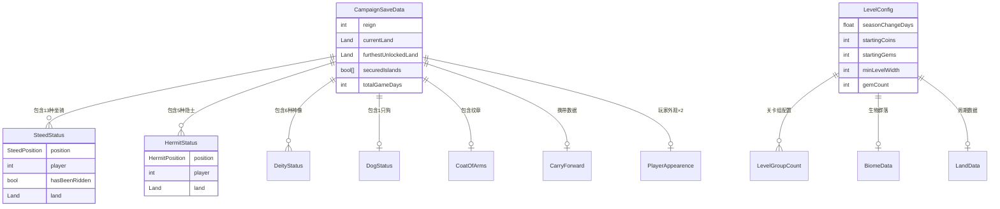

# Module_Chapter - 章节模块数据配表文档

**模块名称**: Chapter（章节/岛屿系统）
**文档版本**: 2.0
**创建日期**: 2026-04-11
**所属系统**: 关卡进度与战役管理

---

## 一、章节（岛屿）配置表

### 1.1 Land 枚举定义

**源码路径**: `BuildingWorld/Land.cs`

```csharp
public enum Land
{
    One = 0,      // 第一岛屿
    Two = 1,      // 第二岛屿
    Three = 2,    // 第三岛屿
    Four = 3,     // 第四岛屿
    Five = 4,     // 第五岛屿
    Invalid = 6   // 无效值
}
```

### 1.2 Land 配置说明

| Land 值 | 岛屿名称 | 解锁条件 | 主要特性 |
|---------|----------|----------|----------|
| One | 第一岛屿 | 默认解锁 | 新手教学、基础建筑 |
| Two | 第二岛屿 | 完成第一岛屿 | 高级建筑、新NPC |
| Three | 第三岛屿 | 完成第二岛屿 | 复杂地形、新敌人 |
| Four | 第四岛屿 | 完成第三岛屿 | 高难度挑战 |
| Five | 第五岛屿 | 完成第四岛屿 | 最终挑战、结局 |

---

## 二、关卡配置表

### 2.1 LevelConfig 配置结构

**源码路径**: `BuildingWorld/LevelConfig.cs`

**配置文件类型**: Unity ScriptableObject

| 字段名 | 类型 | 默认值 | 说明 |
|--------|------|--------|------|
| seasonChangeDays | float | 3.0 | 季节变化天数 |
| daysBeforeGameOver | int | -1 | 游戏结束前天数（-1忽略） |
| islandMonumentID | int | -1 | 岛屿纪念碑ID（-1不生成） |
| startingCoins | int | 0 | 初始金币 |
| startingCoinsContinueOverride | int | -1 | 继续游戏金币覆盖 |
| startingGems | int | 0 | 初始宝石 |
| waveTimedMultiplier | float | 0 | 波次时间乘数 |
| waveMultiplierTimeframe | IntRange | - | 波次乘数时间范围 |
| incomeMultiplier | float | 0 | 收入乘数 |
| freeBoatParts | int | 0 | 免费船部件 |
| waveBoatMultiplier | float | 0 | 波次船乘数 |
| caveEscapeTimer | float | 10.0 | 洞穴逃脱计时器 |
| minLevelWidth | int | 400 | 最小关卡宽度 |
| forceAllUnlocks | bool | false | 强制解锁所有 |
| groupCounts | List\<LevelGroupCount\> | - | 关卡组数量配置 |
| levelBiomeOverrides | BiomeData | null | 生物群落覆盖 |
| landCycleData | LandData | null | 岛屿周期数据 |
| gemCount | int | 0 | 宝石数量 |

### 2.2 IntRange 结构

```csharp
[Serializable]
public struct IntRange
{
    public int min;
    public int max;
}
```

---

## 三、周期数据配置表

### 3.1 LandData 结构

**源码路径**: `CycleData/LandData.cs`

| 字段名 | 类型 | 说明 |
|--------|------|------|
| yearData | List\<YearData\> | 年度数据列表 |

### 3.2 YearData 结构

| 字段名 | 类型 | 说明 |
|--------|------|------|
| seasons | List\<SeasonData\> | 季节数据列表 |
| TotalNumDays | int | 总天数（计算属性） |

### 3.3 SeasonData 结构

| 字段名 | 类型 | 说明 |
|--------|------|------|
| waveProfile | WaveProfile | 波次配置 |
| numDays | int | 季节天数 |
| name | string | 季节名称 |

---

## 四、战役存档配置

### 4.1 CampaignSaveData 结构

**源码路径**: `Common/CampaignSaveData.cs`

| 字段名 | 类型 | 默认值 | 说明 |
|--------|------|--------|------|
| reign | int | 0 | 统治次数 |
| deityStatuses | Statue.DeityStatus[6] | - | 神像状态数组 |
| hermitStatuses | Hermit.HermitStatus[5] | - | 隐士状态数组 |
| steedStatuses | Steed.SteedStatus[13] | - | 坐骑状态数组 |
| dogStatus | Dog.DogStatus | - | 狗状态 |
| steedsUsed | bool[13] | false | 已使用坐骑 |
| securedIslands | bool[5] | false | 已安全岛屿 |
| furthestUnlockedTech | Kingdom.TechnologyAge | - | 最远解锁科技 |
| currentLand | Land | One | 当前岛屿 |
| furthestUnlockedLand | Land | One | 最远解锁岛屿 |
| playTimeDays | double | 0.0 | 游戏时间（天） |
| _coatOfArms | CoatOfArms | new() | 纹章 |
| player1Appearance | PlayerAppearence | - | 玩家1外观 |
| player2Appearance | PlayerAppearence | - | 玩家2外观 |
| realStartDateTime | int | DateTime.Now.DayOfYear | 真实开始日期 |
| carryForward | CarryForward | - | 携带数据 |
| overrideDecayProps | bool | false | 覆盖衰减属性 |
| totalGameDays | int | 0 | 总游戏天数 |
| totalGameDaysOnIsland | int | 0 | 岛屿上总天数 |
| biomeIndex | int | 0 | 生物群落索引 |
| decayProps | DecayConfiguration.Properties | - | 衰减配置 |
| persistentStats | string[9] | - | 持久化统计 |

### 4.2 玩家外观结构 (PlayerAppearence)

| 字段名 | 类型 | 说明 |
|--------|------|------|
| model | Player.Model | 角色模型 |
| hat | Player.Hat | 帽子类型 |
| skinColor | SerializableColor | 皮肤颜色 |
| primaryColor | SerializableColor | 主色调 |
| secondaryColor | SerializableColor | 次色调 |

### 4.3 携带数据结构 (CarryForward)

| 字段名 | 类型 | 说明 |
|--------|------|------|
| present | bool | 是否存在携带数据 |
| coins1 | int | 玩家1金币 |
| coins2 | int | 玩家2金币 |
| gems1 | int | 玩家1宝石 |
| gems2 | int | 玩家2宝石 |
| numArchers | int | 弓箭手数量 |
| numWorkers | int | 工人数量 |
| knightCoinCounts | int[] | 骑士金币数组 |
| squireCoinCounts | int[] | 随从金币数组 |

---

## 五、坐骑状态配置

### 5.1 SteedStatus 结构

| 字段名 | 类型 | 说明 |
|--------|------|------|
| position | SteedPosition | 坐骑位置状态 |
| player | int | 玩家索引 |
| hasBeenRidden | bool | 是否被骑乘过 |
| land | Land | 所在岛屿 |

### 5.2 SteedPosition 枚举

```csharp
public enum SteedPosition
{
    Ridden,       // 被骑乘中
    Roaming,      // 漫游中
    GemLocked,    // 宝石锁定
    CoinLocked    // 金币锁定
}
```

### 5.3 SteedType 枚举（13种坐骑）

| 索引 | 坐骑类型 | 说明 |
|------|----------|------|
| 0-7 | 默认坐骑 | 基础坐骑 |
| 8 | P1Default | 玩家1默认坐骑 |
| 9 | P2Default | 玩家2默认坐骑 |
| 10-12 | 特殊坐骑 | 特殊坐骑 |

---

## 六、隐士状态配置

### 6.1 HermitStatus 结构

| 字段名 | 类型 | 说明 |
|--------|------|------|
| position | HermitPosition | 隐士位置状态 |
| player | int | 玩家索引 |
| land | Land | 所在岛屿 |

### 6.2 HermitPosition 枚举

```csharp
public enum HermitPosition
{
    Roaming,      // 漫游中
    PickedUp,     // 被拾取
    Passenger,    // 乘客状态
    CoinLocked,   // 金币锁定
    GemLocked     // 宝石锁定
}
```

### 6.3 HermitType 枚举（5种隐士）

| 枚举值 | 隐士类型 | 功能 |
|--------|----------|------|
| Horse | 马匹隐士 | 解锁特殊坐骑 |
| Horn | 号角隐士 | 解锁号角建筑 |
| Ballista | 弩炮隐士 | 解锁弩炮防御 |
| Baker | 面包师隐士 | 解锁面包房 |
| Knight | 骑士隐士 | 解锁高级骑士 |

---

## 七、狗状态配置

### 7.1 DogStatus 结构

| 字段名 | 类型 | 说明 |
|--------|------|------|
| position | DogPosition | 狗位置状态 |
| land | Land | 所在岛屿 |
| color | Color | 狗的颜色 |

### 7.2 DogPosition 枚举

```csharp
public enum DogPosition
{
    Roaming,      // 漫游中
    Locked        // 锁定
}
```

---

## 八、神像状态配置

### 8.1 DeityStatus 枚举

```csharp
public enum DeityStatus
{
    Locked,       // 锁定
    Unlocked,     // 已解锁
    Activated     // 已激活
}
```

### 8.2 Deity 枚举（6种神像）

| 索引 | 神像类型 | 效果 |
|------|----------|------|
| 0 | 神像A | 特定加成 |
| 1 | 神像B | 特定加成 |
| 2 | 神像C | 特定加成 |
| 3 | 神像D | 特定加成 |
| 4 | 神像E | 特定加成 |
| 5 | 神像F | 特定加成 |

---

## 九、配表加载方式

### 9.1 获取当前战役数据

```csharp
// 获取当前战役存档
CampaignSaveData campaign = CampaignSaveData.current;

// 获取当前岛屿
Land currentLand = campaign.currentLand;

// 获取最远解锁岛屿
Land furthestLand = campaign.furthestUnlockedLand;

// 获取已安全岛屿数量
int unlockedCount = campaign.unlockedIslandCount;

// 检查岛屿是否安全
bool isSecure = campaign.securedIslands[(int)Land.Three];
```

### 9.2 获取关卡配置

```csharp
// 获取当前关卡配置
LevelConfig config = SingletonMonoBehaviour<Managers>.Inst.game.currentLevelConfig;

// 获取关卡宽度
int width = config.minLevelWidth;

// 获取初始金币
int coins = config.startingCoins;

// 获取宝石数量
int gems = config.gemCount;
```

### 9.3 设置岛屿状态

```csharp
// 设置坐骑状态
campaign.SetSteedStatus(SteedType.Bear, SteedPosition.Ridden, 0, currentLand);

// 设置隐士状态
campaign.SetHermitStatus(HermitType.Baker, HermitPosition.Passenger, 0, currentLand);

// 设置狗状态
campaign.SetDogStatus(DogPosition.Roaming, currentLand, Color.white);

// 设置神像状态
campaign.SetDeityStatus(Deity.War, DeityStatus.Activated);
```

---

## 十、数据关系图



---

*文档版本: 2.0 | 更新时间: 2026-04-11*
