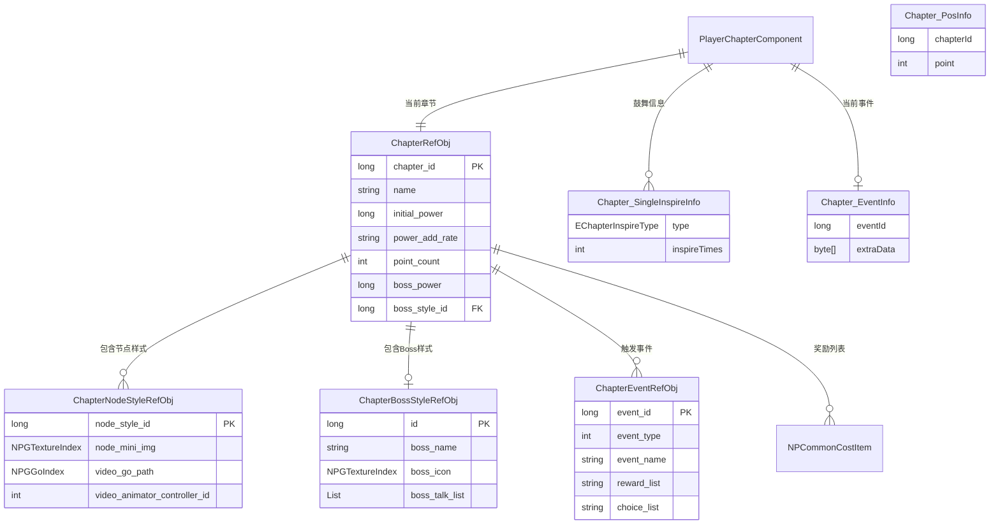
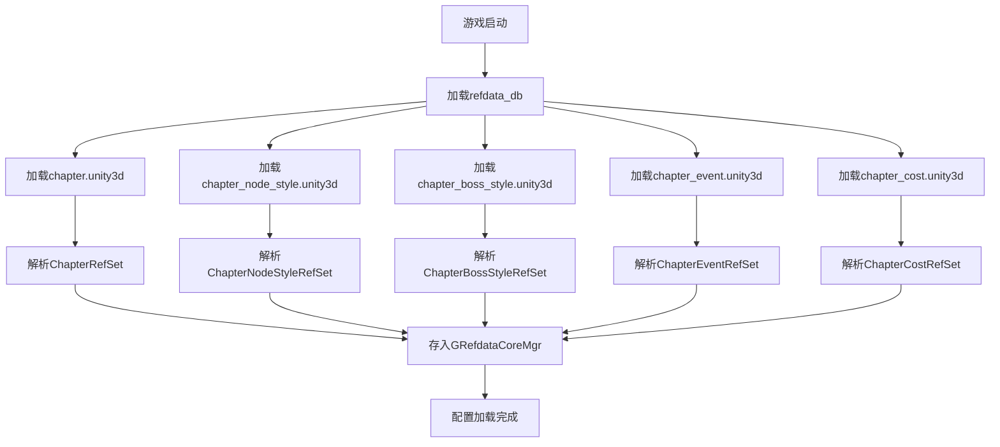
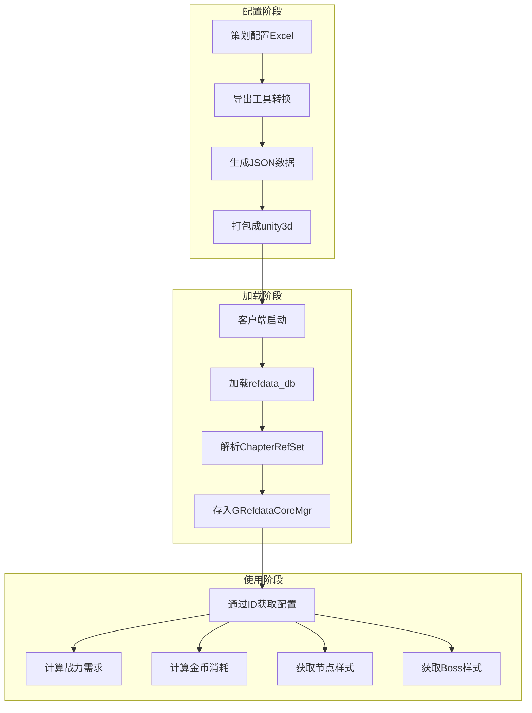
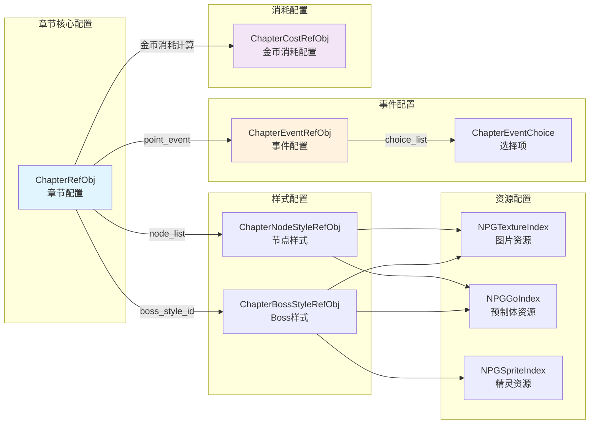
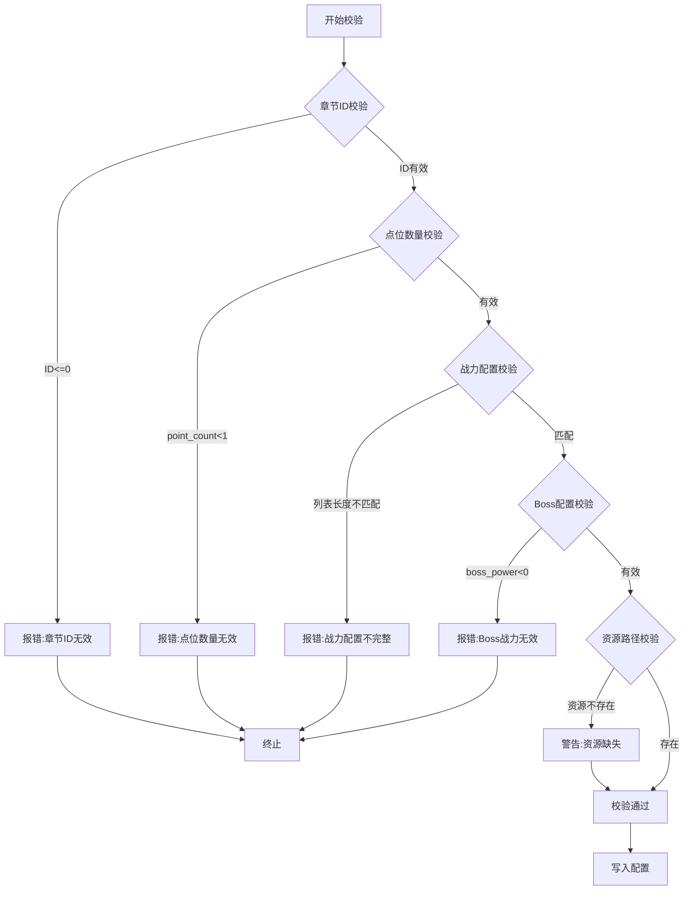
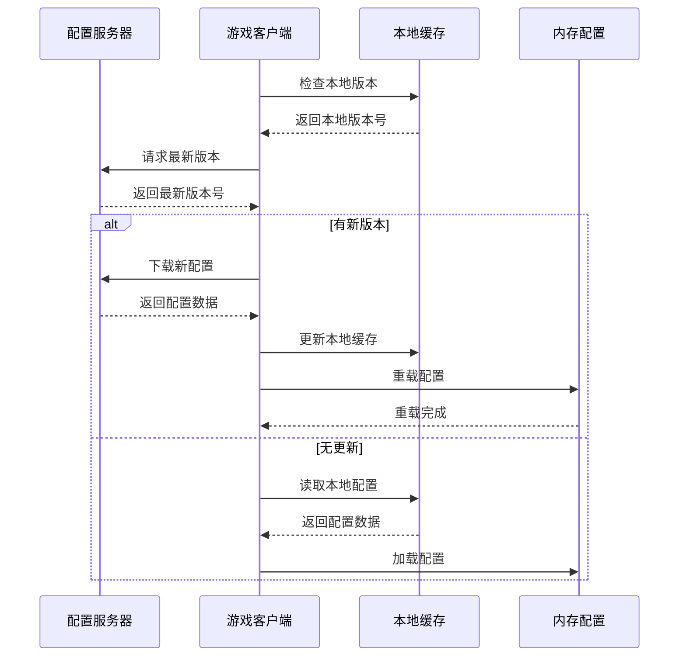

# Module_Chapter - 数据配表文档

**模块名称**: Chapter（章节关卡系统）
**文档版本**: 3.0
**创建日期**: 2026-04-11
**所属系统**: 关卡进度管理

---

## 一、章节配置表 (ChapterRefObj)

### 1.1 表结构定义

**源码路径**: `game_client/Assets/Scripts/ResScripts/NPSO/GSO/Chapter/ChapterRefSet.cs`

**资源路径**: `refdata_db/chapter.unity3d`

**表名**: `chapter`

### 1.2 完整字段列表

| 字段名 | 类型 | 默认值 | 说明 |
|--------|------|--------|------|
| chapter_id | long | - | 章节唯一ID |
| name | string | - | 章节名称 |
| name_args | string | - | 名称参数（多语言） |
| desc | string | - | 章节描述 |
| desc_args | string | - | 描述参数（多语言） |
| initial_power | long | - | 初始战力需求 |
| power_add_rate | string | - | 战力需求递增比例列表（万分比） |
| initial_cost | long | - | 金币前进消耗（SILVER） |
| cost_add_rate | string | - | 金币消耗递增比例列表（万分比） |
| point_count | int | - | 总波次数量（包含boss） |
| after_point_dialog | string | - | 波次后剧情对话配置 |
| boss_start_dialog | long | - | Boss战前对话ID |
| boss_end_dialog | long | - | Boss战结束后对话ID |
| comment_random_group_id | string | - | 弹幕评论随机组配置 |
| boss_power | long | - | Boss战力 |
| reward_list | string | - | Boss战奖励列表 |
| reward_show | string | - | Boss战奖励预览 |
| gold_inspire_base_value | long | - | 金币鼓舞基础值 |
| crit_probability | string | - | 每波暴击概率配置 |
| boss_style_id | long | - | Boss样式ID |
| reward_player_exp | int | - | 关卡前进奖励经验 |
| forward_simple_unlock_id | long | - | 前进条件解锁ID |
| forward_tutorial_id | long | - | 前进条件引导ID |
| chapter_img | string | - | 切图资源索引 |
| node_list | string | - | 关卡节点列表 |
| chapter_map_res_index | string | - | 关卡地图资源索引 |
| enter_chapter_dialog_id | long | - | 进入章节对话ID |
| chapter_bg_music_id | long | - | 章节背景音乐ID |
| chapter_boss_bg_music_id | long | - | Boss战背景音乐ID |
| video_boss_bg_go_path | string | - | 视频背景资源路径 |
| point_event | string | - | 点位事件配置 |

### 1.3 解析属性（运行时）

| 属性名 | 类型 | 说明 |
|--------|------|------|
| nameArgs | List\<string\> | 名称参数列表 |
| descArgs | List\<string\> | 描述参数列表 |
| powerAddRate | List\<int\> | 战力递增比例列表 |
| costAddRate | List\<int\> | 金币消耗递增列表 |
| rewardList | List\<NPCommonCostItem\> | Boss奖励列表 |
| rewardShow | List\<NPCommonCostItem\> | Boss奖励预览列表 |
| afterPointDialog | List\<NPCommonListLongInfo\> | 波次对话配置列表 |
| nodeList | List\<CommonIntLongInfo\> | 节点列表 |
| pointEvent | List\<WCGPairLong\> | 点位事件列表（点位,事件ID） |
| chapterImg | NPGTextureIndex | 章节图片索引 |
| chapterMapResIndex | NPCommonAssetPathInfo | 地图资源路径 |
| videoBossBgGoPath | NPGGoIndex | Boss背景视频路径 |
| critProbability | List\<int\> | 暴击概率列表（万分比） |
| commentRandomGroupId | List\<long\> | 弹幕评论随机组ID列表 |

### 1.4 核心计算方法

```csharp
// 计算指定格子所需战力
public long calNeedPower(int _point)
{
    if(null == powerAddRate)
        return initial_power;

    if(_point < 1 || _point > point_count || _point > powerAddRate.Count)
        return initial_power;

    return (long)math.ceil((double)initial_power * (10000 + powerAddRate[_point - 1]) / 10000);
}

// 计算指定格子所需金币
public long calNeedCost(int _point)
{
    if (null == costAddRate)
        return initial_cost;

    if(_point < 1 || _point > point_count || _point > costAddRate.Count)
        return initial_cost;

    return initial_cost * (10000 + costAddRate[_point - 1]) / 10000;
}

// 计算奖励经验
public ResultOne<Long> calRewardExp(int _point)
{
    if (_point < 1 || _point > point_count)
        return ResultOne.failed(CommErr.PARAM_ERROR);

    long exp = reward_hero_exp_base;
    if (reward_hero_exp_add_rate != null && _point <= reward_hero_exp_add_rate.Count)
    {
        exp = exp * (10000 + reward_hero_exp_add_rate[_point - 1]) / 10000;
    }
    return ResultOne.succ(exp);
}

// 获取节点索引
public int getNodeIndexByPoint(int _point)
{
    if (null == nodeList)
        return 0;

    for (int i = 0; i < nodeList.Count; i++)
    {
        if (nodeList[i].value == _point)
            return nodeList[i].key;
    }
    return 0;
}

// 获取Boss样式
public ChapterBossStyleRefObj getBossStyleRefObj()
{
    if (boss_style_id <= 0)
        return null;
    return GRefdataCoreMgr.instance.chapterBossStyleRefCore.getRef(boss_style_id);
}

// 根据索引获取节点样式
public _IChapterNodeStyle getChapterNodeStyleByIndexId(int _index, out NPGGoIndex _bgGoIndex)
{
    _bgGoIndex = null;

    // Boss节点
    if (_index == point_count)
    {
        return getBossStyleRefObj();
    }

    // 普通节点
    return getChapterNormalNodeStyleByIndexId(_index);
}

// 获取普通节点样式
public ChapterNodeStyleRefObj getChapterNormalNodeStyleByIndexId(int _index)
{
    if (null == nodeList || _index < 0 || _index >= nodeList.Count)
        return null;

    int nodeStyleId = nodeList[_index].key;
    return GRefdataCoreMgr.instance.chapterNodeStyleRefCore.getRef(nodeStyleId);
}
```

---

## 二、节点样式配置表 (ChapterNodeStyleRefObj)

### 2.1 表结构定义

**源码路径**: `game_client/Assets/Scripts/ResScripts/NPSO/GSO/Chapter/ChapterNodeStyleRefSet.cs`

**资源路径**: `refdata_db/chapter_node_style.unity3d`

**表名**: `chapter_node_style`

### 2.2 完整字段列表

| 字段名 | 类型 | 默认值 | 说明 |
|--------|------|--------|------|
| node_style_id | long | - | 节点样式ID |
| node_mini_img | string | - | 小贴图索引 |
| video_go_path | string | - | 视频资源路径 |
| mask_ui_image | string | - | 遮罩资源贴图 |
| video_animator_controller_id | int | 0 | 视频动画控制器ID |
| forward_screen_sfx_id | long | 0 | 前屏幕特效ID |
| forward_td_sfx_id | long | 0 | 前进场景特效ID |
| node_name | string | - | 节点名称 |
| node_desc | string | - | 节点描述 |

### 2.3 解析属性（运行时）

| 属性名 | 类型 | 说明 |
|--------|------|------|
| nodeMiniImg | NPGTextureIndex | 小贴图索引 |
| videoGoPath | NPGGoIndex | 视频资源路径 |
| maskUiImage | NPGSpriteIndex | 遮罩资源贴图 |

### 2.4 接口实现

```csharp
public interface _IChapterNodeStyle
{
    NPGTextureIndex getNodeMiniImg();
    NPGGoIndex getVideoGoPath();
    NPGSpriteIndex getMaskUIImage();
    int getVideoAnimatorControllerId();
    long getForwardScreenSfxId();
    long getForwardTdSfxId();
}

public class ChapterNodeStyleRefObj : _IChapterNodeStyle
{
    public NPGTextureIndex getNodeMiniImg() => nodeMiniImg;
    public NPGGoIndex getVideoGoPath() => videoGoPath;
    public NPGSpriteIndex getMaskUIImage() => maskUiImage;
    public int getVideoAnimatorControllerId() => video_animator_controller_id;
    public long getForwardScreenSfxId() => forward_screen_sfx_id;
    public long getForwardTdSfxId() => forward_td_sfx_id;
}
```

---

## 三、Boss样式配置表 (ChapterBossStyleRefObj)

### 3.1 表结构定义

**源码路径**: `game_client/Assets/Scripts/ResScripts/NPSO/GSO/Chapter/ChapterBossStyleRefSet.cs`

**资源路径**: `refdata_db/chapter_boss_style.unity3d`

**表名**: `chapter_boss_style`

### 3.2 完整字段列表

| 字段名 | 类型 | 默认值 | 说明 |
|--------|------|--------|------|
| id | long | - | 唯一ID |
| boss_name | string | - | Boss名称 |
| boss_icon | string | - | Boss图标 |
| video_boss_go_path | string | - | Boss视频资源路径 |
| boss_talk_list | string | - | Boss对话列表 |
| first_hit_video_boss_go_path | string | - | 一阶段受击视频 |
| second_hit_video_boss_go_path | string | - | 二阶段受击视频 |
| video_animator_controller_id | int | 0 | 视频动画控制器ID |
| forward_screen_sfx_id | long | 0 | 前屏幕特效ID |
| forward_td_sfx_id | long | 0 | 前进场景特效ID |
| boss_desc | string | - | Boss描述 |

### 3.3 解析属性（运行时）

| 属性名 | 类型 | 说明 |
|--------|------|------|
| bossIcon | NPGTextureIndex | Boss图标 |
| videoBossGoPath | NPGGoIndex | Boss视频资源路径 |
| bossTalkList | List\<string\> | Boss对话列表 |
| firstHitVideoBossGoPath | NPGGoIndex | 一阶段受击视频 |
| secondHitVideoBossGoPath | NPGGoIndex | 二阶段受击视频 |

### 3.4 Boss样式接口

```csharp
public class ChapterBossStyleRefObj : _IChapterNodeStyle
{
    public NPGTextureIndex getNodeMiniImg() => bossIcon;
    public NPGGoIndex getVideoGoPath() => videoBossGoPath;
    public NPGSpriteIndex getMaskUIImage() => null;
    public int getVideoAnimatorControllerId() => video_animator_controller_id;
    public long getForwardScreenSfxId() => forward_screen_sfx_id;
    public long getForwardTdSfxId() => forward_td_sfx_id;

    // Boss特有方法
    public string getBossName() => boss_name;
    public List<string> getBossTalkList() => bossTalkList;
    public NPGGoIndex getFirstHitVideoPath() => firstHitVideoBossGoPath;
    public NPGGoIndex getSecondHitVideoPath() => secondHitVideoBossGoPath;
}
```

---

## 四、章节事件配置表 (ChapterEventRefObj)

### 4.1 表结构定义

**源码路径**: `game_client/Assets/Scripts/ResScripts/NPSO/GSO/Chapter/ChapterEventRefSet.cs`

**资源路径**: `refdata_db/chapter_event.unity3d`

**表名**: `chapter_event`

### 4.2 完整字段列表

| 字段名 | 类型 | 默认值 | 说明 |
|--------|------|--------|------|
| event_id | long | - | 事件唯一ID |
| event_type | int | - | 事件类型（枚举） |
| event_name | string | - | 事件名称 |
| event_desc | string | - | 事件描述 |
| event_icon | string | - | 事件图标 |
| event_dialog_id | long | 0 | 事件对话ID |
| reward_list | string | - | 奖励列表（奖励事件用） |
| choice_list | string | - | 选择列表（选择事件用） |
| dispatch_hero_count | int | 0 | 派遣大臣数量（派遣事件用） |
| dispatch_power_require | long | 0 | 派遣战力要求 |
| dispatch_duration | int | 0 | 派遣时长（秒） |
| dispatch_reward_list | string | - | 派遣奖励列表 |

### 4.3 事件类型枚举

```csharp
public enum EChapterEventType
{
    NONE = 0,      // 无
    REWARD = 1,    // 奖励事件
    DISPATCH = 2,  // 大臣派遣事件
    CHOICE = 3,    // 选择事件
}
```

### 4.4 解析属性（运行时）

| 属性名 | 类型 | 说明 |
|--------|------|------|
| eventType | EChapterEventType | 事件类型枚举 |
| eventIcon | NPGTextureIndex | 事件图标 |
| rewardList | List\<NPCommonCostItem\> | 奖励列表 |
| choiceList | List\<ChapterEventChoice\> | 选择列表 |
| dispatchRewardList | List\<NPCommonCostItem\> | 派遣奖励列表 |

### 4.5 选择事件结构

```csharp
public class ChapterEventChoice
{
    public long choiceId;           // 选项ID
    public string choiceText;       // 选项文本
    public string choiceIcon;       // 选项图标
    public List<NPCommonCostItem> rewardList;  // 选项奖励
}
```

---

## 五、金币消耗配置表 (ChapterCostRefObj)

### 5.1 表结构定义

**源码路径**: `game_client/Assets/Scripts/ResScripts/NPSO/GSO/Chapter/ChapterCostRefSet.cs`

**资源路径**: `refdata_db/chapter_cost.unity3d`

**表名**: `chapter_cost`

### 5.2 完整字段列表

| 字段名 | 类型 | 默认值 | 说明 |
|--------|------|--------|------|
| id | long | - | 唯一ID |
| power_rate_min | int | - | 战力比例最小值（万分比） |
| power_rate_max | int | - | 战力比例最大值（万分比） |
| cost_multiple_rate | int | - | 金币消耗放大倍数（万分比） |

### 5.3 获取消耗比例

```csharp
public class RefChapterCost
{
    private static List<RefChapterCost> _cache = null;

    public static RefChapterCost getMgr()
    {
        // 返回管理器实例
    }

    // 根据战力比例获取消耗放大倍数
    public int getCostMultipleRate(int _powerRate)
    {
        foreach (var item in _cache)
        {
            if (_powerRate >= item.power_rate_min && _powerRate <= item.power_rate_max)
            {
                return item.cost_multiple_rate;
            }
        }
        return 0;
    }
}
```

---

## 六、章节解锁数据 (ChapterUnlockData)

### 6.1 数据结构

**源码路径**: `game_server/ClientProtocol/RemarkData/ChapterUnlockData.cs`

| 字段名 | 类型 | 说明 |
|--------|------|------|
| unlockIdList | List\<long\> | 章节解锁ID列表 |

### 6.2 序列化示例

```csharp
public class ChapterUnlockData : _IALProtocolStructure
{
    private List<long> unlockIdList;

    public void PutUnzipBuf(ALProtocolBuf _buf)
    {
        _buf.putShort((short)unlockIdList.Count);
        for(int _i = 0; _i < unlockIdList.Count; _i++) {
            _buf.putLong(unlockIdList[_i]);
        }
    }

    public void ReadUnzipBuf(ALProtocolBuf _buf, int _finalPos)
    {
        unlockIdList = new List<long>();
        if (_finalPos > 0 && _buf.getCurPos() >= _finalPos) return;

        int count = _buf.getShort();
        for (int i = 0; i < count; i++)
        {
            if (_finalPos > 0 && _buf.getCurPos() >= _finalPos) break;
            unlockIdList.Add(_buf.getLong());
        }
    }

    public int GetBufSize()
    {
        return 2 + unlockIdList.Count * 8;
    }
}
```

---

## 七、关卡位置信息 (Chapter_PosInfo)

### 7.1 数据结构

**源码路径**: `game_server/ClientProtocol/Common/ChapterObj/Chapter_PosInfo.cs`

| 字段名 | 类型 | 说明 |
|--------|------|------|
| chapterId | long | 关卡ID |
| point | int | 所在点位 |

### 7.2 序列化实现

```csharp
public class Chapter_PosInfo : _IALProtocolStructure
{
    private long chapterId;
    private int point;

    public void PutUnzipBuf(ALProtocolBuf _buf)
    {
        _buf.putLong(chapterId);
        _buf.putInt(point);
    }

    public void ReadUnzipBuf(ALProtocolBuf _buf, int _finalPos)
    {
        if (_finalPos > 0 && _buf.getCurPos() >= _finalPos) return;
        chapterId = _buf.getLong();
        if (_finalPos > 0 && _buf.getCurPos() >= _finalPos) return;
        point = _buf.getInt();
    }

    public int GetBufSize()
    {
        return 12; // long(8) + int(4)
    }

    // Getter/Setter
    public long getChapterId() => chapterId;
    public int getPoint() => point;
    public void setChapterId(long _id) => chapterId = _id;
    public void setPoint(int _p) => point = _p;
}
```

---

## 八、关卡事件信息 (Chapter_EventInfo)

### 8.1 数据结构

**源码路径**: `game_server/ClientProtocol/Common/ChapterObj/Chapter_EventInfo.cs`

| 字段名 | 类型 | 说明 |
|--------|------|------|
| eventId | long | 事件ID |
| extraData | byte[] | 扩展数据 |

### 8.2 序列化实现

```csharp
public class Chapter_EventInfo : _IALProtocolStructure
{
    private long eventId;
    private byte[] extraData;

    public void PutUnzipBuf(ALProtocolBuf _buf)
    {
        _buf.putLong(eventId);
        if (extraData == null || extraData.Length == 0)
        {
            _buf.putShort(0);
        }
        else
        {
            _buf.putShort((short)extraData.Length);
            _buf.putBytes(extraData);
        }
    }

    public void ReadUnzipBuf(ALProtocolBuf _buf, int _finalPos)
    {
        if (_finalPos > 0 && _buf.getCurPos() >= _finalPos) return;
        eventId = _buf.getLong();
        if (_finalPos > 0 && _buf.getCurPos() >= _finalPos) return;

        int len = _buf.getShort();
        if (len > 0)
        {
            extraData = _buf.getBytes(len);
        }
    }

    public int GetBufSize()
    {
        int size = 10; // long(8) + short(2)
        if (extraData != null)
            size += extraData.Length;
        return size;
    }
}
```

---

## 九、鼓舞信息结构

### 9.1 单个鼓舞信息 (Chapter_SingleInspireInfo)

**源码路径**: `game_server/ClientProtocol/Common/ChapterObj/Chapter_SingleInspireInfo.cs`

| 字段名 | 类型 | 说明 |
|--------|------|------|
| type | EChapterInspireType | 鼓舞类型 |
| inspireTimes | int | 鼓舞次数 |

### 9.2 鼓舞类型枚举 (EChapterInspireType)

**源码路径**: `game_server/ClientProtocol/Common/ChapterEnum/EChapterInspireType.cs`

```csharp
public enum EChapterInspireType
{
    NONE = 0,    // 无
    GOLD = 1,    // 金币鼓舞
    CRYSTAL = 2, // 水晶鼓舞
    ITEM = 3,    // 道具鼓舞
}
```

### 9.3 鼓舞信息列表 (Chapter_InspireInfo)

| 字段名 | 类型 | 说明 |
|--------|------|------|
| inspireList | List\<Chapter_SingleInspireInfo\> | 鼓舞信息列表 |

### 9.4 序列化实现

```csharp
public class Chapter_InspireInfo : _IALProtocolStructure
{
    private List<Chapter_SingleInspireInfo> inspireList;

    public void PutUnzipBuf(ALProtocolBuf _buf)
    {
        _buf.putShort((short)inspireList.Count);
        foreach (var info in inspireList)
        {
            info.PutUnzipBuf(_buf);
        }
    }

    public void ReadUnzipBuf(ALProtocolBuf _buf, int _finalPos)
    {
        inspireList = new List<Chapter_SingleInspireInfo>();
        if (_finalPos > 0 && _buf.getCurPos() >= _finalPos) return;

        int count = _buf.getShort();
        for (int i = 0; i < count; i++)
        {
            Chapter_SingleInspireInfo info = new Chapter_SingleInspireInfo();
            info.ReadUnzipBuf(_buf, _finalPos);
            inspireList.Add(info);
        }
    }
}

public class Chapter_SingleInspireInfo : _IALProtocolStructure
{
    private EChapterInspireType type;
    private int inspireTimes;

    public void PutUnzipBuf(ALProtocolBuf _buf)
    {
        _buf.putInt((int)type);
        _buf.putInt(inspireTimes);
    }

    public void ReadUnzipBuf(ALProtocolBuf _buf, int _finalPos)
    {
        if (_finalPos > 0 && _buf.getCurPos() >= _finalPos) return;
        type = (EChapterInspireType)_buf.getInt();
        if (_finalPos > 0 && _buf.getCurPos() >= _finalPos) return;
        inspireTimes = _buf.getInt();
    }

    public int GetBufSize() => 8; // int(4) + int(4)
}
```

---

## 十、事件类型枚举 (EChapterEventType)

**源码路径**: `game_server/ClientProtocol/Common/ChapterEnum/EChapterEventType.cs`

```csharp
public enum EChapterEventType
{
    NONE = 0,     // 无
    REWARD = 1,   // 奖励事件
    DISPATCH = 2, // 大臣派遣事件
    CHOICE = 3,   // 选择事件
}
```

---

## 十一、数据关系图



---

## 十二、配置加载流程图



---

## 十三、配置加载示例

### 13.1 获取章节配置

```csharp
// 通过ID获取章节配置
ChapterRefObj chapterRef = GRefdataCoreMgr.instance.chapterRefCore.getRef(chapterId);
if (chapterRef == null)
{
    Debug.LogError($"章节配置不存在: {chapterId}");
    return;
}

// 获取当前战力需求
long needPower = chapterRef.calNeedPower(pointId);

// 获取当前金币消耗
long needCost = chapterRef.calNeedCost(pointId);

// 获取Boss样式
ChapterBossStyleRefObj bossStyle = chapterRef.getBossStyleRefObj();
```

### 13.2 获取节点样式

```csharp
// 根据索引获取节点样式
_IChapterNodeStyle nodeStyle = chapterRef.getChapterNodeStyleByIndexId(index, out NPGGoIndex bgGoIndex);

// 获取普通节点样式（不含Boss）
ChapterNodeStyleRefObj normalNodeStyle = chapterRef.getChapterNormalNodeStyleByIndexId(index);

// 根据点位获取节点索引
int nodeIndex = chapterRef.getNodeIndexByPoint(point);

// 检查是否是Boss节点
bool isBoss = (point == chapterRef.point_count);
```

### 13.3 获取事件配置

```csharp
// 获取事件配置
ChapterEventRefObj eventRef = GRefdataCoreMgr.instance.chapterEventRefCore.getRef(eventId);
if (eventRef == null)
{
    Debug.LogError($"事件配置不存在: {eventId}");
    return;
}

// 判断事件类型
switch (eventRef.eventType)
{
    case EChapterEventType.REWARD:
        // 处理奖励事件
        List<NPCommonCostItem> rewards = eventRef.rewardList;
        break;

    case EChapterEventType.CHOICE:
        // 处理选择事件
        List<ChapterEventChoice> choices = eventRef.choiceList;
        break;

    case EChapterEventType.DISPATCH:
        // 处理派遣事件
        int heroCount = eventRef.dispatch_hero_count;
        long powerRequire = eventRef.dispatch_power_require;
        break;
}
```

### 13.4 遍历所有章节

```csharp
// 获取所有章节配置
List<ChapterRefObj> allChapters = GRefdataCoreMgr.instance.chapterRefCore.getAll();

foreach (var chapter in allChapters)
{
    Debug.Log($"章节ID: {chapter.chapter_id}, 名称: {chapter.name}");
    Debug.Log($"  总波次: {chapter.point_count}");
    Debug.Log($"  Boss战力: {chapter.boss_power}");

    // 遍历节点
    for (int i = 1; i <= chapter.point_count; i++)
    {
        long power = chapter.calNeedPower(i);
        long cost = chapter.calNeedCost(i);
        Debug.Log($"  波次{i}: 战力需求={power}, 金币消耗={cost}");
    }
}
```

---

## 十四、数据验证规则

### 14.1 章节配置验证

| 字段名 | 验证规则 | 错误提示 |
|--------|----------|----------|
| chapter_id | > 0 且唯一 | 章节ID必须大于0且唯一 |
| point_count | >= 1 | 波次数量至少为1 |
| initial_power | >= 0 | 初始战力不能为负 |
| boss_power | >= 0 | Boss战力不能为负 |
| power_add_rate | 列表长度 == point_count | 战力递增列表长度必须等于波次数量 |
| cost_add_rate | 列表长度 == point_count | 金币消耗递增列表长度必须等于波次数量 |

### 14.2 节点样式验证

| 字段名 | 验证规则 | 错误提示 |
|--------|----------|----------|
| node_style_id | > 0 且唯一 | 节点样式ID必须大于0且唯一 |
| video_go_path | 非空字符串 | 视频资源路径不能为空 |

### 14.3 Boss样式验证

| 字段名 | 验证规则 | 错误提示 |
|--------|----------|----------|
| id | > 0 且唯一 | Boss样式ID必须大于0且唯一 |
| boss_name | 非空字符串 | Boss名称不能为空 |
| video_boss_go_path | 非空字符串 | Boss视频资源路径不能为空 |

---

## 十五、错误码定义

**源码路径**: `game_server/ClientProtocol/ResultRegisters/ChapterErr.cs`

| 错误码 | 错误信息 | 说明 |
|--------|----------|------|
| 30001 | 关卡BOSS未击败 | Boss战未完成 |
| 30002 | 关卡点位不符 | 请求点位与当前不符 |
| 30003 | 关卡BOSS已击败 | Boss已被击败 |
| 30004 | 关卡攻击BOSS战力不足 | 战力不够打Boss |
| 30005 | 关卡没有在攻击BOSS | 非Boss战状态 |
| 30006 | 关卡未解锁 | 章节尚未解锁 |
| 30007 | 关卡事件未完成 | 事件未处理完 |
| 30008 | 没有可以处理的关卡事件 | 无可处理事件 |
| 30009 | 关卡剧情奖励已领取 | 奖励已领取 |

---

## 十六、配置示例数据

### 16.1 章节配置示例

```json
{
  "chapter_id": 1,
  "name": "初入江湖",
  "name_args": "",
  "desc": "踏入江湖的第一步",
  "initial_power": 1000,
  "power_add_rate": "0,500,1000,1500,2000,2500,3000,3500,4000,4500",
  "initial_cost": 100,
  "cost_add_rate": "0,100,200,300,400,500,600,700,800,900",
  "point_count": 10,
  "boss_power": 50000,
  "reward_list": "100001,1,100;100002,1,50",
  "boss_style_id": 1,
  "reward_player_exp": 100,
  "gold_inspire_base_value": 10000,
  "crit_probability": "500,500,500,500,500,500,500,500,500,500"
}
```

### 16.2 节点样式示例

```json
{
  "node_style_id": 1,
  "node_mini_img": "chapter/node_1.png",
  "video_go_path": "chapter/video/node_1.prefab",
  "mask_ui_image": "chapter/mask_1.png",
  "video_animator_controller_id": 100,
  "forward_screen_sfx_id": 1001,
  "forward_td_sfx_id": 2001
}
```

### 16.3 Boss样式示例

```json
{
  "id": 1,
  "boss_name": "江湖恶霸",
  "boss_icon": "chapter/boss_1.png",
  "video_boss_go_path": "chapter/video/boss_1.prefab",
  "boss_talk_list": "来者何人!;竟敢闯我地盘!;受死吧!",
  "first_hit_video_boss_go_path": "chapter/video/boss_1_hit1.prefab",
  "second_hit_video_boss_go_path": "chapter/video/boss_1_hit2.prefab",
  "video_animator_controller_id": 200
}
```

---

## 十七、章节配置流程图



---

## 十八、章节配置依赖关系图



---

## 十九、数据校验流程



---

## 二十、配置热更新流程



---

## 二十一、配置查询性能优化

### 21.1 索引策略

```csharp
// 章节配置索引结构
public class ChapterRefIndex
{
    // 主键索引: chapterId -> ChapterRefObj
    private Dictionary<long, ChapterRefObj> _idIndex;

    // 章节顺序索引: 用于获取下一章节
    private List<ChapterRefObj> _sortedList;

    // 点位事件索引: point -> eventId (预计算)
    private Dictionary<long, Dictionary<int, long>> _pointEventIndex;

    // 初始化索引
    public void buildIndex(List<ChapterRefObj> _list)
    {
        _idIndex = new Dictionary<long, ChapterRefObj>();
        _sortedList = new List<ChapterRefObj>();
        _pointEventIndex = new Dictionary<long, Dictionary<int, long>>();

        foreach (var item in _list)
        {
            _idIndex[item.chapter_id] = item;
            _sortedList.Add(item);

            // 预计算点位事件索引
            var pointEventDic = new Dictionary<int, long>();
            if (item.pointEvent != null)
            {
                foreach (var pair in item.pointEvent)
                {
                    pointEventDic[(int)pair.first()] = pair.second();
                }
            }
            _pointEventIndex[item.chapter_id] = pointEventDic;
        }

        // 按章节ID排序
        _sortedList.Sort((a, b) => a.chapter_id.CompareTo(b.chapter_id));
    }

    // 快速获取点位事件
    public long getPointEventId(long _chapterId, int _point)
    {
        if (_pointEventIndex.TryGetValue(_chapterId, out var dic))
        {
            if (dic.TryGetValue(_point, out var eventId))
                return eventId;
        }
        return 0;
    }
}
```

### 21.2 缓存策略

```csharp
// 章节计算结果缓存
public class ChapterCalcCache
{
    // 战力需求缓存: chapterId * 100 + point -> power
    private Dictionary<long, long> _powerCache;

    // 金币消耗缓存: chapterId * 100 + point -> cost
    private Dictionary<long, long> _costCache;

    // 节点样式缓存: chapterId * 100 + index -> style
    private Dictionary<long, ChapterNodeStyleRefObj> _nodeStyleCache;

    public long getCachedPower(ChapterRefObj _ref, int _point)
    {
        long key = _ref.chapter_id * 100 + _point;
        if (_powerCache.TryGetValue(key, out var power))
            return power;

        power = _ref.calNeedPower(_point);
        _powerCache[key] = power;
        return power;
    }

    public void clearCache()
    {
        _powerCache?.Clear();
        _costCache?.Clear();
        _nodeStyleCache?.Clear();
    }
}
```

---

## 二十二、配置导出工具说明

### 22.1 Excel配置格式

| 列名 | 类型 | 必填 | 说明 |
|------|------|------|------|
| chapter_id | int | 是 | 章节ID，唯一标识 |
| name | string | 是 | 章节名称 |
| name_args | string | 否 | 多语言参数 |
| desc | string | 是 | 章节描述 |
| initial_power | long | 是 | 初始战力需求 |
| power_add_rate | string | 是 | 战力递增比例，逗号分隔 |
| initial_cost | long | 是 | 初始金币消耗 |
| cost_add_rate | string | 是 | 金币消耗递增，逗号分隔 |
| point_count | int | 是 | 总波次数 |
| boss_power | long | 是 | Boss战力 |
| boss_style_id | int | 是 | Boss样式ID |
| reward_list | string | 是 | Boss奖励，格式:itemId,type,count;... |

### 22.2 导出脚本示例

```python
# chapter_export.py
import json
import pandas as pd

def export_chapter_config(excel_path, output_path):
    """导出章节配置"""
    df = pd.read_excel(excel_path, sheet_name='chapter')

    configs = []
    for _, row in df.iterrows():
        config = {
            'chapter_id': int(row['chapter_id']),
            'name': str(row['name']),
            'name_args': str(row.get('name_args', '')),
            'desc': str(row['desc']),
            'initial_power': int(row['initial_power']),
            'power_add_rate': parse_rate_list(row['power_add_rate']),
            'initial_cost': int(row['initial_cost']),
            'cost_add_rate': parse_rate_list(row['cost_add_rate']),
            'point_count': int(row['point_count']),
            'boss_power': int(row['boss_power']),
            'boss_style_id': int(row['boss_style_id']),
            'reward_list': parse_reward_list(row['reward_list']),
            # ... 其他字段
        }

        # 数据校验
        validate_config(config)
        configs.append(config)

    # 写入JSON
    with open(output_path, 'w', encoding='utf-8') as f:
        json.dump(configs, f, ensure_ascii=False, indent=2)

def parse_rate_list(value):
    """解析比例列表"""
    if pd.isna(value) or value == '':
        return []
    return [int(x.strip()) for x in str(value).split(',')]

def parse_reward_list(value):
    """解析奖励列表"""
    if pd.isna(value) or value == '':
        return []
    rewards = []
    for item in str(value).split(';'):
        parts = item.split(',')
        if len(parts) >= 3:
            rewards.append({
                'itemId': int(parts[0]),
                'type': int(parts[1]),
                'count': int(parts[2])
            })
    return rewards

def validate_config(config):
    """配置校验"""
    errors = []

    if config['chapter_id'] <= 0:
        errors.append(f"章节ID无效: {config['chapter_id']}")

    if config['point_count'] < 1:
        errors.append(f"点位数量无效: {config['point_count']}")

    if len(config['power_add_rate']) != config['point_count']:
        errors.append(f"战力递增列表长度不匹配")

    if errors:
        raise ValueError(f"配置校验失败:\n" + "\n".join(errors))

if __name__ == '__main__':
    export_chapter_config('config/chapter.xlsx', 'output/chapter.json')
```

---

*文档版本: 3.0 | 更新时间: 2026-04-12*
