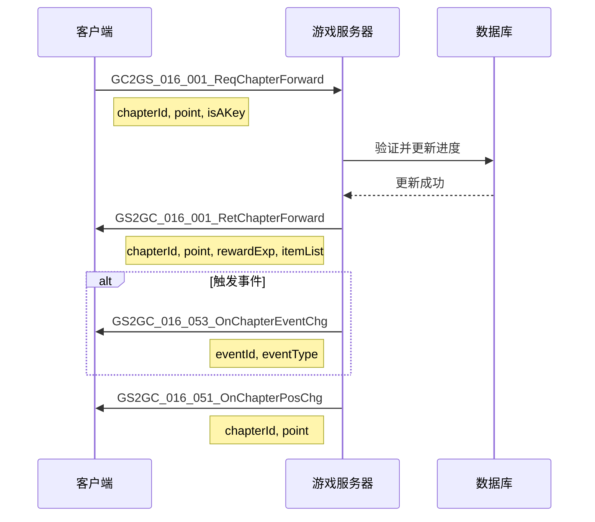
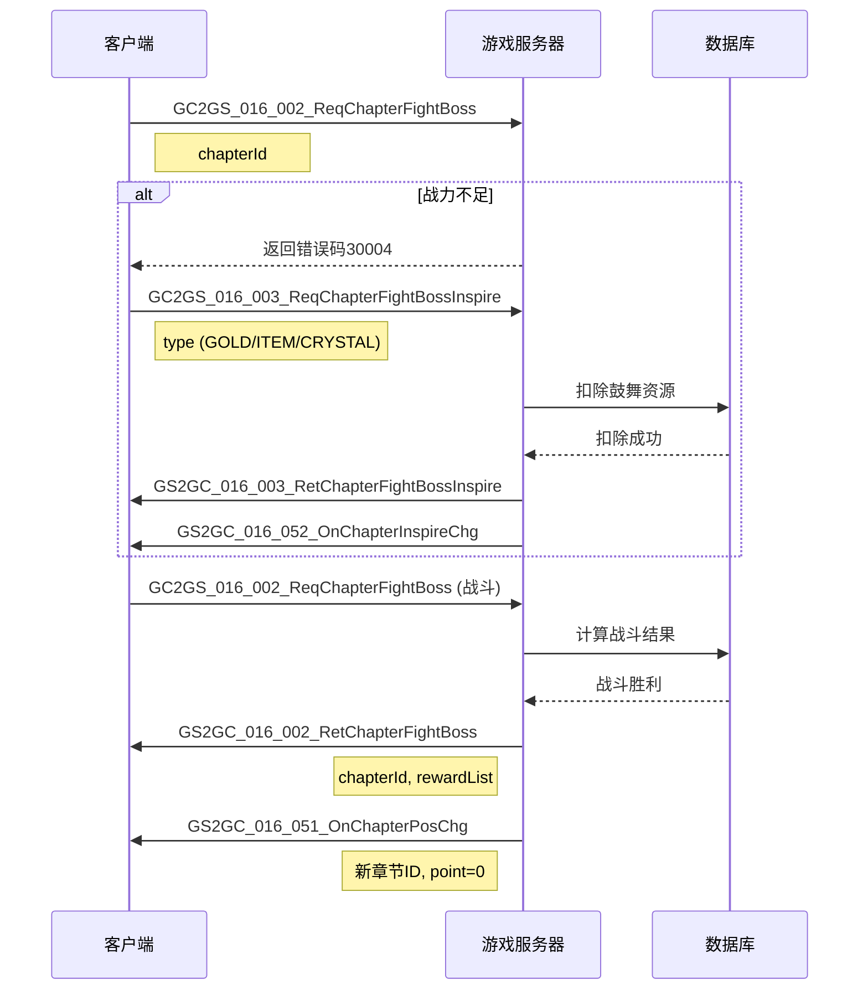
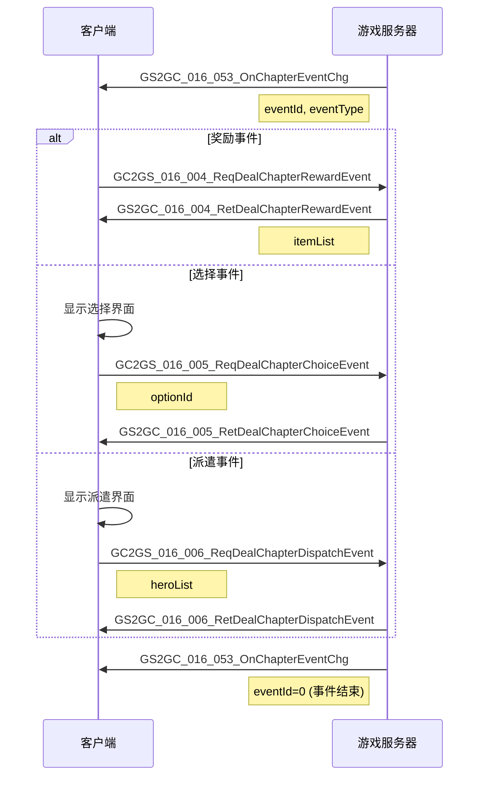
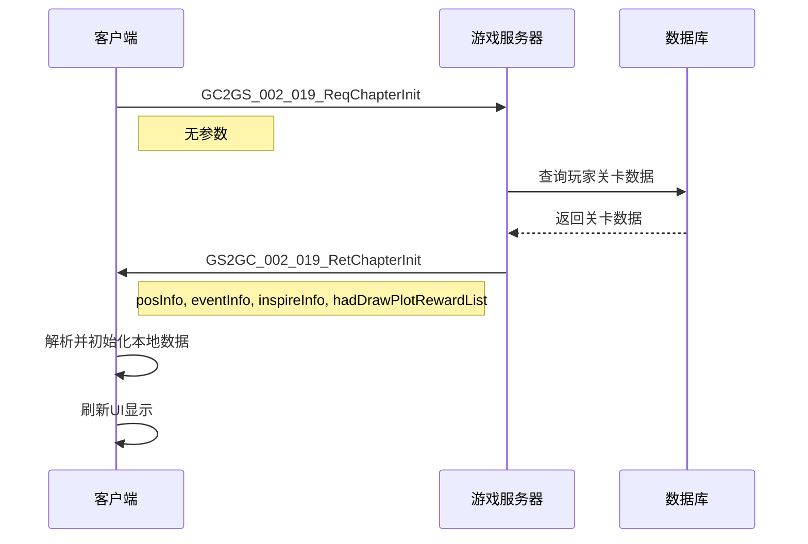

# Module_Chapter - 协议文档

**模块名称**: Chapter（章节关卡系统）
**文档版本**: 3.0
**创建日期**: 2026-04-11
**协议模块号**: 0x10 (16)

---

## 一、协议模块概述

### 1.1 模块编号

章节模块协议使用主协议号 **16 (0x10)**，协议命名空间为 `GC2GS.p016_ChapterOp` 和 `GS2GC.p016_ChapterOp`。

### 1.2 协议分类

| 协议类型 | 方向 | 说明 |
|----------|------|------|
| 请求协议 | GC → GS | 客户端发起请求 |
| 返回协议 | GS → GC | 服务端返回结果 |
| 推送协议 | GS → GC | 服务端主动推送 |

### 1.3 协议列表总览

| 子协议号 | 协议名称 | 方向 | 说明 |
|----------|----------|------|------|
| 001 | ReqChapterForward | GC→GS | 请求关卡前进 |
| 001 | RetChapterForward | GS→GC | 返回关卡前进结果 |
| 002 | ReqChapterFightBoss | GC→GS | 请求打Boss |
| 002 | RetChapterFightBoss | GS→GC | 返回打Boss结果 |
| 003 | ReqChapterFightBossInspire | GC→GS | 请求Boss战鼓舞 |
| 003 | RetChapterFightBossInspire | GS→GC | 返回鼓舞结果 |
| 004 | ReqDealChapterRewardEvent | GC→GS | 请求处理奖励事件 |
| 004 | RetDealChapterRewardEvent | GS→GC | 返回处理结果 |
| 005 | ReqDealChapterChoiceEvent | GC→GS | 请求处理选择事件 |
| 005 | RetDealChapterChoiceEvent | GS→GC | 返回处理结果 |
| 006 | ReqDealChapterDispatchEvent | GC→GS | 请求处理派遣事件 |
| 006 | RetDealChapterDispatchEvent | GS→GC | 返回处理结果 |
| 007 | ReqDrawChapterPlotReward | GC→GS | 请求领取剧情奖励 |
| 007 | RetDrawChapterPlotReward | GS→GC | 返回领取结果 |
| 051 | OnChapterPosChg | GS→GC | 推送位置变更 |
| 052 | OnChapterInspireChg | GS→GC | 推送鼓舞变更 |
| 053 | OnChapterEventChg | GS→GC | 推送事件变更 |
| 054 | OnChapterGmPosChg | GS→GC | 推送GM位置变更 |
| 055 | OnChapterPlotRewardDraw | GS→GC | 推送剧情奖励领取 |

---

## 二、初始化协议

### 2.1 请求关卡初始化 (019)

**协议**: GC2GS_002_019_ReqChapterInit

**主协议号**: 2 | **子协议号**: 19

**请求参数**: 无

**返回结构** (GS2GC_002_019_RetChapterInit):

| 字段名 | 类型 | 说明 |
|--------|------|------|
| posInfo | Chapter_PosInfo | 位置信息 |
| eventInfo | Chapter_EventInfo | 事件信息 |
| inspireInfo | Chapter_InspireInfo | 鼓舞信息 |
| hadDrawPlotRewardList | List\<long\> | 已领取剧情奖励列表 |

**代码示例**:

```csharp
// 发送初始化请求
public void reqChapterInit()
{
    NPGSClientListener.sendRequestByLog(
        GSWriter_002_PlayerOp.make_019_ReqChapterInit(),
        new CommonRequestCallbackProtocolDealer<GS2GC_002_019_RetChapterInit>(
            (info) => {
                // 初始化成功
                _m_curChapterId = info.getPosInfo().getChapterId();
                _m_curPointId = info.getPosInfo().getPoint();
                _m_curChapterEventId = info.getEventInfo().getEventId();

                // 解析鼓舞信息
                foreach (var inspire in info.getInspireInfo().getInspireList())
                {
                    _m_inspireInfoDic[inspire.getType()] = inspire.getInspireTimes();
                }

                // 解析已领取剧情奖励
                _m_hadDrawPlotRewardList = info.getHadDrawPlotRewardList();
            },
            (errCode) => {
                Debug.LogError($"章节初始化失败: {errCode}");
            }
        )
    );
}
```

---

## 三、关卡前进协议

### 3.1 请求关卡前进 (001)

**协议**: GC2GS_016_001_ReqChapterForward

**主协议号**: 16 | **子协议号**: 1

**请求参数**:

| 字段名 | 类型 | 说明 |
|--------|------|------|
| chapterId | long | 章节ID |
| point | int | 目标点位 |
| isAKey | bool | 是否一键前进 |

**代码示例**:

```csharp
// 发送关卡前进请求
public void reqChapterForward(long _chapterId, int _point, bool _isAKey)
{
    NPGSClientListener.sendRequestByLog(
        GSWriter_016_ChapterOp.make_001_ReqChapterForward(_chapterId, _point, _isAKey),
        new CommonRequestCallbackProtocolDealer<GS2GC_016_001_RetChapterForward>(
            (info) => {
                // 成功回调
                Debug.Log($"前进成功，当前点位: {info.getPoint()}");

                // 处理暴击
                if (info.getCoefficient() > 10000)
                {
                    Debug.Log($"暴击！系数: {info.getCoefficient()}");
                }

                // 处理触发事件
                if (info.getEventId() > 0)
                {
                    Debug.Log($"触发事件: {info.getEventId()}");
                    dealWithEvent(info.getEventId());
                }
            },
            (errCode) => {
                // 失败回调
                NPGUIAddSceneCenterTip.instance.showErrorInfo(errCode);
            }
        )
    );
}
```

### 3.2 返回关卡前进结果 (001)

**协议**: GS2GC_016_001_RetChapterForward

**返回参数**:

| 字段名 | 类型 | 说明 |
|--------|------|------|
| chapterId | long | 章节ID |
| point | int | 当前点位 |
| coefficient | int | 系数（10000=普通，>10000=暴击） |
| rewardExp | long | 奖励大臣经验 |
| rewardPlayerExp | long | 奖励玩家经验 |
| eventId | long | 触发事件ID（0表示无事件） |
| itemList | List\<NPCommon_ItemInfo\> | 物品列表 |
| costGoldNum | long | 花费金币数量 |

**返回结构定义**:

```csharp
public class GS2GC_016_001_RetChapterForward : _IALProtocolStructure
{
    private long chapterId;
    private int point;
    private int coefficient;
    private long rewardExp;
    private long rewardPlayerExp;
    private long eventId;
    private List<NPCommon_ItemInfo> itemList;
    private long costGoldNum;

    // Getter方法
    public long getChapterId() => chapterId;
    public int getPoint() => point;
    public int getCoefficient() => coefficient;
    public long getRewardExp() => rewardExp;
    public long getRewardPlayerExp() => rewardPlayerExp;
    public long getEventId() => eventId;
    public List<NPCommon_ItemInfo> getItemList() => itemList;
    public long getCostGoldNum() => costGoldNum;
}
```

---

## 四、Boss战协议

### 4.1 请求打Boss (002)

**协议**: GC2GS_016_002_ReqChapterFightBoss

**请求参数**:

| 字段名 | 类型 | 说明 |
|--------|------|------|
| chapterId | long | 章节ID |

**代码示例**:

```csharp
public void reqChapterFightBoss(long _chapterId)
{
    NPGSClientListener.sendRequestByLog(
        GSWriter_016_ChapterOp.make_002_ReqChapterFightBoss(_chapterId),
        new CommonRequestCallbackProtocolDealer<GS2GC_016_002_RetChapterFightBoss>(
            (info) => {
                // Boss战成功
                Debug.Log($"Boss战胜利！进入下一章节");

                // 处理奖励
                foreach (var item in info.getRewardList())
                {
                    Debug.Log($"获得奖励: {item.itemId} x {item.count}");
                }

                // 更新UI
                WinMsg.SendMsg(WinMsgType.ON_CHAPTER_BOSS_DEFEAT);
            },
            (errCode) => {
                // Boss战失败
                if (errCode == 30004)
                {
                    // 战力不足，提示鼓舞
                    showInspireTip();
                }
                else
                {
                    NPGUIAddSceneCenterTip.instance.showErrorInfo(errCode);
                }
            }
        )
    );
}
```

### 4.2 返回打Boss结果 (002)

**协议**: GS2GC_016_002_RetChapterFightBoss

**返回参数**:

| 字段名 | 类型 | 说明 |
|--------|------|------|
| chapterId | long | 章节ID |
| rewardList | List\<NPCommon_ItemInfo\> | 奖励物品列表 |

### 4.3 请求Boss战鼓舞 (003)

**协议**: GC2GS_016_003_ReqChapterFightBossInspire

**请求参数**:

| 字段名 | 类型 | 说明 |
|--------|------|------|
| type | EChapterInspireType | 鼓舞类型 |

**鼓舞类型枚举**:

| 值 | 名称 | 说明 |
|----|------|------|
| 0 | NONE | 无 |
| 1 | GOLD | 金币鼓舞 |
| 2 | CRYSTAL | 水晶鼓舞 |
| 3 | ITEM | 道具鼓舞 |

**代码示例**:

```csharp
// 金币鼓舞
public void reqGoldInspire()
{
    reqChapterFightBossInspire(EChapterInspireType.GOLD,
        () => {
            Debug.Log("金币鼓舞成功");
            refreshPowerDisplay();
        },
        () => {
            Debug.Log("金币鼓舞失败");
        },
        true
    );
}

// 道具鼓舞
public void reqItemInspire()
{
    reqChapterFightBossInspire(EChapterInspireType.ITEM,
        () => {
            Debug.Log("道具鼓舞成功");
            refreshPowerDisplay();
        },
        () => {
            Debug.Log("道具鼓舞失败");
        },
        true
    );
}

// 水晶鼓舞
public void reqCrystalInspire()
{
    reqChapterFightBossInspire(EChapterInspireType.CRYSTAL,
        () => {
            Debug.Log("水晶鼓舞成功");
            refreshPowerDisplay();
        },
        () => {
            Debug.Log("水晶鼓舞失败");
        },
        true
    );
}
```

### 4.4 返回鼓舞结果 (003)

**协议**: GS2GC_016_003_RetChapterFightBossInspire

**返回参数**: 无（成功时通过推送协议更新鼓舞信息）

---

## 五、事件处理协议

### 5.1 请求处理奖励事件 (004)

**协议**: GC2GS_016_004_ReqDealChapterRewardEvent

**请求参数**: 无

**返回参数**:

| 字段名 | 类型 | 说明 |
|--------|------|------|
| itemList | List\<NPCommon_ItemInfo\> | 奖励物品列表 |

**代码示例**:

```csharp
public void reqDealChapterRewardEvent()
{
    NPGSClientListener.sendRequestByLog(
        GSWriter_016_ChapterOp.make_004_ReqDealChapterRewardEvent(),
        new CommonRequestCallbackProtocolDealer<GS2GC_016_004_RetDealChapterRewardEvent>(
            (info) => {
                Debug.Log("领取奖励事件成功");
                foreach (var item in info.getItemList())
                {
                    Debug.Log($"获得: {item.itemId} x {item.count}");
                }

                // 关闭事件界面
                closeEventPanel();
            },
            (errCode) => {
                NPGUIAddSceneCenterTip.instance.showErrorInfo(errCode);
            }
        )
    );
}
```

### 5.2 请求处理选择事件 (005)

**协议**: GC2GS_016_005_ReqDealChapterChoiceEvent

**请求参数**:

| 字段名 | 类型 | 说明 |
|--------|------|------|
| optionId | long | 选项ID |

**返回参数**:

| 字段名 | 类型 | 说明 |
|--------|------|------|
| itemList | List\<NPCommon_ItemInfo\> | 奖励物品列表 |

**代码示例**:

```csharp
public void reqDealChapterChoiceEvent(long _optionId)
{
    NPGSClientListener.sendRequestByLog(
        GSWriter_016_ChapterOp.make_005_ReqDealChapterChoiceEvent(_optionId),
        new CommonRequestCallbackProtocolDealer<GS2GC_016_005_RetDealChapterChoiceEvent>(
            (info) => {
                Debug.Log($"选择事件处理成功，选项ID: {_optionId}");

                // 显示获得的奖励
                showRewardPanel(info.getItemList());

                // 关闭选择界面
                closeChoicePanel();
            },
            (errCode) => {
                NPGUIAddSceneCenterTip.instance.showErrorInfo(errCode);
            }
        )
    );
}
```

### 5.3 请求处理派遣事件 (006)

**协议**: GC2GS_016_006_ReqDealChapterDispatchEvent

**请求参数**:

| 字段名 | 类型 | 说明 |
|--------|------|------|
| heroList | List\<long\> | 派遣大臣ID列表 |

**返回参数**:

| 字段名 | 类型 | 说明 |
|--------|------|------|
| dispatchId | long | 派遣ID |
| endTime | long | 结束时间戳 |

**代码示例**:

```csharp
public void reqDealChapterDispatchEvent(List<long> _heroList)
{
    NPGSClientListener.sendRequestByLog(
        GSWriter_016_ChapterOp.make_006_ReqDealChapterDispatchEvent(_heroList),
        new CommonRequestCallbackProtocolDealer<GS2GC_016_006_RetDealChapterDispatchEvent>(
            (info) => {
                Debug.Log($"派遣事件处理成功");
                Debug.Log($"派遣ID: {info.getDispatchId()}");
                Debug.Log($"结束时间: {info.getEndTime()}");

                // 显示派遣进度
                showDispatchProgress(info.getDispatchId(), info.getEndTime());

                // 关闭派遣界面
                closeDispatchPanel();
            },
            (errCode) => {
                NPGUIAddSceneCenterTip.instance.showErrorInfo(errCode);
            }
        )
    );
}
```

### 5.4 请求领取剧情奖励 (007)

**协议**: GC2GS_016_007_ReqDrawChapterPlotReward

**请求参数**:

| 字段名 | 类型 | 说明 |
|--------|------|------|
| plotIdList | List\<long\> | 剧情ID列表 |

**返回参数**:

| 字段名 | 类型 | 说明 |
|--------|------|------|
| itemList | List\<NPCommon_ItemInfo\> | 奖励物品列表 |

**代码示例**:

```csharp
public void reqDrawChapterPlotReward(List<long> _plotIdList)
{
    NPGSClientListener.sendRequestByLog(
        GSWriter_016_ChapterOp.make_007_ReqDrawChapterPlotReward(_plotIdList),
        new CommonRequestCallbackProtocolDealer<GS2GC_016_007_RetDrawChapterPlotReward>(
            (info) => {
                Debug.Log("领取剧情奖励成功");

                // 更新已领取列表
                foreach (var plotId in _plotIdList)
                {
                    _m_hadDrawPlotRewardList.Add(plotId);
                }

                // 显示奖励
                showRewardPanel(info.getItemList());
            },
            (errCode) => {
                NPGUIAddSceneCenterTip.instance.showErrorInfo(errCode);
            }
        )
    );
}
```

---

## 六、服务端推送协议

### 6.1 推送位置变更 (051)

**协议**: GS2GC_016_051_OnChapterPosChg

**推送参数**:

| 字段名 | 类型 | 说明 |
|--------|------|------|
| posInfo | Chapter_PosInfo | 新位置信息 |

**处理代码**:

```csharp
public void onChapterPosChg(GS2GC_016_051_OnChapterPosChg _msg)
{
    if (null == _msg) return;

    _m_curChapterId = _msg.getPosInfo().getChapterId();
    _m_curPointId = _msg.getPosInfo().getPoint();
    _m_chapterRefObj = GRefdataCoreMgr.instance.chapterRefCore.getRef(_m_curChapterId);

    if (null != _m_chapterRefObj)
    {
        _m_curNodeIndex = _m_chapterRefObj.getNodeIndexByPoint(_m_curPointId);
    }

    WinMsg.SendMsg(WinMsgType.ON_CHAPTER_POS_CHG);
}
```

### 6.2 推送鼓舞变更 (052)

**协议**: GS2GC_016_052_OnChapterInspireChg

**推送参数**:

| 字段名 | 类型 | 说明 |
|--------|------|------|
| inspireInfo | Chapter_InspireInfo | 鼓舞信息 |

**处理代码**:

```csharp
public void onChapterInspireChg(GS2GC_016_052_OnChapterInspireChg _msg)
{
    if (null == _msg) return;

    foreach (Chapter_SingleInspireInfo info in _msg.getInspireInfo().getInspireList())
    {
        if(null == info) continue;
        _m_inspireInfoDic[info.getType()] = info.getInspireTimes();
    }

    // 刷新战力显示
    refreshPowerDisplay();

    WinMsg.SendMsg(WinMsgType.ON_CHAPTER_INSPIRE_CHG);
}
```

### 6.3 推送事件变更 (053)

**协议**: GS2GC_016_053_OnChapterEventChg

**推送参数**:

| 字段名 | 类型 | 说明 |
|--------|------|------|
| eventInfo | Chapter_EventInfo | 事件信息 |

**处理代码**:

```csharp
public void onChapterEventChg(GS2GC_016_053_OnChapterEventChg _msg)
{
    if (null == _msg) return;

    long eventId = _msg.getEventInfo().getEventId();

    if (eventId == 0)
    {
        // 事件结束
        _m_curChapterEventId = 0;
        closeEventPanel();
        return;
    }

    _m_curChapterEventId = eventId;

    // 获取事件配置
    ChapterEventRefObj eventRef = GRefdataCoreMgr.instance.chapterEventRefCore.getRef(eventId);
    if (eventRef == null)
    {
        Debug.LogError($"事件配置不存在: {eventId}");
        return;
    }

    // 根据事件类型显示界面
    switch (eventRef.eventType)
    {
        case EChapterEventType.REWARD:
            showRewardEventPanel(eventRef);
            break;
        case EChapterEventType.CHOICE:
            showChoiceEventPanel(eventRef);
            break;
        case EChapterEventType.DISPATCH:
            showDispatchEventPanel(eventRef);
            break;
    }

    WinMsg.SendMsg(WinMsgType.ON_CHAPTER_EVENT_CHG);
}
```

### 6.4 推送GM位置变更 (054)

**协议**: GS2GC_016_054_OnChapterGmPosChg

**推送参数**:

| 字段名 | 类型 | 说明 |
|--------|------|------|
| posInfo | Chapter_PosInfo | GM修改后的位置信息 |

**处理代码**:

```csharp
public void onChapterGmPosChg(GS2GC_016_054_OnChapterGmPosChg _msg)
{
    if (null == _msg) return;

    _m_curChapterId = _msg.getPosInfo().getChapterId();
    _m_curPointId = _msg.getPosInfo().getPoint();
    _m_chapterRefObj = GRefdataCoreMgr.instance.chapterRefCore.getRef(_m_curChapterId);

    // 重置鼓舞次数
    foreach (var key in _m_inspireInfoDic.Keys.ToList())
    {
        _m_inspireInfoDic[key] = 0;
    }

    WinMsg.SendMsg(WinMsgType.ON_CHAPTER_POS_CHG_CHEAT);
}
```

### 6.5 推送剧情奖励领取 (055)

**协议**: GS2GC_016_055_OnChapterPlotRewardDraw

**推送参数**:

| 字段名 | 类型 | 说明 |
|--------|------|------|
| plotIdList | List\<long\> | 已领取的剧情ID列表 |

**处理代码**:

```csharp
public void onChapterPlotRewardDraw(GS2GC_016_055_OnChapterPlotRewardDraw _msg)
{
    if (null == _msg) return;

    foreach (var plotId in _msg.getPlotIdList())
    {
        if (!_m_hadDrawPlotRewardList.Contains(plotId))
        {
            _m_hadDrawPlotRewardList.Add(plotId);
        }
    }

    WinMsg.SendMsg(WinMsgType.ON_CHAPTER_PLOT_REWARD_DRAW);
}
```

---

## 七、协议时序图

### 7.1 关卡前进流程



### 7.2 Boss战流程



### 7.3 事件处理流程



### 7.4 初始化流程



---

## 八、数据序列化

### 8.1 序列化格式

所有协议使用 `ALProtocolBuf` 进行二进制序列化。

### 8.2 基础类型大小

| 类型 | 大小 |
|------|------|
| byte | 1 byte |
| short | 2 bytes |
| int | 4 bytes |
| long | 8 bytes |
| float | 4 bytes |

### 8.3 序列化示例

```csharp
// 请求协议写入
public class GC2GS_016_001_ReqChapterForward : _IALProtocolStructure
{
    private long chapterId;
    private int point;
    private bool isAKey;

    public void PutUnzipBuf(ALProtocolBuf _buf)
    {
        _buf.putLong(chapterId);
        _buf.putInt(point);
        _buf.put(isAKey ? (byte)1 : (byte)0);
    }

    public void ReadUnzipBuf(ALProtocolBuf _buf, int _finalPos)
    {
        if(_finalPos > 0 && _buf.getCurPos() >= _finalPos) return;
        chapterId = _buf.getLong();
        if(_finalPos > 0 && _buf.getCurPos() >= _finalPos) return;
        point = _buf.getInt();
        if(_finalPos > 0 && _buf.getCurPos() >= _finalPos) return;
        isAKey = (_buf.get() != 0);
    }

    public int GetBufSize()
    {
        return 13; // long(8) + int(4) + byte(1)
    }
}

// 返回协议写入
public class GS2GC_016_001_RetChapterForward : _IALProtocolStructure
{
    private long chapterId;
    private int point;
    private int coefficient;
    private long rewardExp;
    private long rewardPlayerExp;
    private long eventId;
    private List<NPCommon_ItemInfo> itemList;
    private long costGoldNum;

    public void PutUnzipBuf(ALProtocolBuf _buf)
    {
        _buf.putLong(chapterId);
        _buf.putInt(point);
        _buf.putInt(coefficient);
        _buf.putLong(rewardExp);
        _buf.putLong(rewardPlayerExp);
        _buf.putLong(eventId);

        // 列表序列化
        _buf.putShort((short)itemList.Count);
        foreach (var item in itemList)
        {
            item.PutUnzipBuf(_buf);
        }

        _buf.putLong(costGoldNum);
    }

    public void ReadUnzipBuf(ALProtocolBuf _buf, int _finalPos)
    {
        if(_finalPos > 0 && _buf.getCurPos() >= _finalPos) return;
        chapterId = _buf.getLong();
        if(_finalPos > 0 && _buf.getCurPos() >= _finalPos) return;
        point = _buf.getInt();
        if(_finalPos > 0 && _buf.getCurPos() >= _finalPos) return;
        coefficient = _buf.getInt();
        if(_finalPos > 0 && _buf.getCurPos() >= _finalPos) return;
        rewardExp = _buf.getLong();
        if(_finalPos > 0 && _buf.getCurPos() >= _finalPos) return;
        rewardPlayerExp = _buf.getLong();
        if(_finalPos > 0 && _buf.getCurPos() >= _finalPos) return;
        eventId = _buf.getLong();

        // 列表反序列化
        itemList = new List<NPCommon_ItemInfo>();
        if(_finalPos > 0 && _buf.getCurPos() >= _finalPos) return;
        int count = _buf.getShort();
        for (int i = 0; i < count; i++)
        {
            NPCommon_ItemInfo item = new NPCommon_ItemInfo();
            item.ReadUnzipBuf(_buf, _finalPos);
            itemList.Add(item);
        }

        if(_finalPos > 0 && _buf.getCurPos() >= _finalPos) return;
        costGoldNum = _buf.getLong();
    }
}
```

---

## 九、错误处理

### 9.1 协议错误码

| 错误码 | 错误信息 | 处理建议 |
|--------|----------|----------|
| 30001 | 关卡BOSS未击败 | 继续战斗 |
| 30002 | 关卡点位不符 | 刷新界面 |
| 30003 | 关卡BOSS已击败 | 刷新状态 |
| 30004 | 关卡攻击BOSS战力不足 | 提升战力或鼓舞 |
| 30005 | 关卡没有在攻击BOSS | 检查状态 |
| 30006 | 关卡未解锁 | 检查解锁条件 |
| 30007 | 关卡事件未完成 | 完成事件 |
| 30008 | 没有可以处理的关卡事件 | 检查事件状态 |
| 30009 | 关卡剧情奖励已领取 | 刷新列表 |

### 9.2 错误处理代码

```csharp
// 通用错误处理
NPGSClientListener.sendRequestByLog(request,
    new CommonRequestCallbackProtocolDealer<RetType>(
        (info) => { /* 成功处理 */ },
        (errCode) => {
            // 根据错误码处理
            switch (errCode)
            {
                case 30001: // Boss未击败
                    NPGUIAddSceneCenterTip.instance.showTip("请先击败Boss");
                    break;
                case 30002: // 点位不符
                    NPGUIAddSceneCenterTip.instance.showTip("关卡进度异常，请刷新");
                    refreshChapterData();
                    break;
                case 30004: // 战力不足
                    showInspireDialog(); // 显示鼓舞提示
                    break;
                case 30006: // 未解锁
                    NPGUIAddSceneCenterTip.instance.showTip("章节尚未解锁");
                    break;
                case 30007: // 事件未完成
                    NPGUIAddSceneCenterTip.instance.showTip("请先完成当前事件");
                    break;
                default:
                    NPGUIAddSceneCenterTip.instance.showErrorInfo(errCode);
                    break;
            }
        }
    )
);
```

### 9.3 服务端错误处理

```java
// 服务端错误返回示例
public ResultOne<ForwardResult> forward(long _chapterId, int _targetPoint, NPPlayerContext _context)
{
    // 获取关卡配置
    RefChapter ref = getRef();
    if (ref == null)
        return ResultOne.failed(CommErr.REF_NOT_FOUND);

    // 判断是否有未完成事件
    if (_m_eventInfo != null)
        return ResultOne.failed(ChapterErr.CHAPTER_EVENT_NOT_DONE);

    // 判断关卡是否解锁
    if (!NPPlayerConditionDealerMgr.IsEnable(
        RefGeneral.Ref().unlock_chapter_simple_unlock_id,
        _m_comp.getUserData(), null))
        return ResultOne.failed(ChapterErr.CHAPTER_NOT_UNLOCK);

    // 验证位置
    int curPoint = _m_bo.getPoint();
    int targetPoint = curPoint + 1;

    if (_chapterId != _m_bo.getChapterId() || targetPoint != _targetPoint)
        return ResultOne.failed(ChapterErr.CHAPTER_POINT_NOT_FIT);

    // Boss格需要走特殊逻辑
    if (targetPoint == ref.point_count)
        return ResultOne.failed(ChapterErr.CHAPTER_BOSS_NOT_DEFEAT);

    // ... 继续处理
}
```

---

## 十、协议注册

### 10.1 协议注册表

```csharp
// 客户端协议注册
public static void registerChapterProtocol()
{
    // 请求协议注册
    NPGSClientListener.registerRequest<GS2GC_016_001_RetChapterForward>();
    NPGSClientListener.registerRequest<GS2GC_016_002_RetChapterFightBoss>();
    NPGSClientListener.registerRequest<GS2GC_016_003_RetChapterFightBossInspire>();
    NPGSClientListener.registerRequest<GS2GC_016_004_RetDealChapterRewardEvent>();
    NPGSClientListener.registerRequest<GS2GC_016_005_RetDealChapterChoiceEvent>();
    NPGSClientListener.registerRequest<GS2GC_016_006_RetDealChapterDispatchEvent>();
    NPGSClientListener.registerRequest<GS2GC_016_007_RetDrawChapterPlotReward>();

    // 推送协议注册
    NPGSClientListener.registerPush<GS2GC_016_051_OnChapterPosChg>();
    NPGSClientListener.registerPush<GS2GC_016_052_OnChapterInspireChg>();
    NPGSClientListener.registerPush<GS2GC_016_053_OnChapterEventChg>();
    NPGSClientListener.registerPush<GS2GC_016_054_OnChapterGmPosChg>();
    NPGSClientListener.registerPush<GS2GC_016_055_OnChapterPlotRewardDraw>();
}
```

### 10.2 协议号定义

```csharp
public class ChapterProtocolId
{
    public const int MAIN_PROTOCOL = 16;  // 0x10

    // 请求/返回协议
    public const int REQ_FORWARD = 1;
    public const int REQ_FIGHT_BOSS = 2;
    public const int REQ_INSPIRE = 3;
    public const int REQ_REWARD_EVENT = 4;
    public const int REQ_CHOICE_EVENT = 5;
    public const int REQ_DISPATCH_EVENT = 6;
    public const int REQ_PLOT_REWARD = 7;

    // 推送协议
    public const int ON_POS_CHG = 51;
    public const int ON_INSPIRE_CHG = 52;
    public const int ON_EVENT_CHG = 53;
    public const int ON_GM_POS_CHG = 54;
    public const int ON_PLOT_REWARD_DRAW = 55;
}
```

---

*文档版本: 3.0 | 更新时间: 2026-04-12*
