# Module_Chapter - 协议文档

**模块名称**: Chapter（章节关卡系统）
**文档版本**: 3.0
**创建日期**: 2026-04-11
**协议模块号**: 0x10 (16)

---

## 一、协议模块概述

### 1.1 模块编号

章节模块协议使用主协议号 **16 (0x10)**，协议命名空间为 `GC2GS.p016_ChapterOp` 和 `GS2GC.p016_ChapterOp`。

### 1.2 协议分类

| 协议类型 | 方向 | 说明 |
|----------|------|------|
| 请求协议 | GC → GS | 客户端发起请求 |
| 返回协议 | GS → GC | 服务端返回结果 |
| 推送协议 | GS → GC | 服务端主动推送 |

### 1.3 协议列表总览

| 子协议号 | 协议名称 | 方向 | 说明 |
|----------|----------|------|------|
| 001 | ReqChapterForward | GC→GS | 请求关卡前进 |
| 001 | RetChapterForward | GS→GC | 返回关卡前进结果 |
| 002 | ReqChapterFightBoss | GC→GS | 请求打Boss |
| 002 | RetChapterFightBoss | GS→GC | 返回打Boss结果 |
| 003 | ReqChapterFightBossInspire | GC→GS | 请求Boss战鼓舞 |
| 003 | RetChapterFightBossInspire | GS→GC | 返回鼓舞结果 |
| 004 | ReqDealChapterRewardEvent | GC→GS | 请求处理奖励事件 |
| 004 | RetDealChapterRewardEvent | GS→GC | 返回处理结果 |
| 005 | ReqDealChapterChoiceEvent | GC→GS | 请求处理选择事件 |
| 005 | RetDealChapterChoiceEvent | GS→GC | 返回处理结果 |
| 006 | ReqDealChapterDispatchEvent | GC→GS | 请求处理派遣事件 |
| 006 | RetDealChapterDispatchEvent | GS→GC | 返回处理结果 |
| 007 | ReqDrawChapterPlotReward | GC→GS | 请求领取剧情奖励 |
| 007 | RetDrawChapterPlotReward | GS→GC | 返回领取结果 |
| 051 | OnChapterPosChg | GS→GC | 推送位置变更 |
| 052 | OnChapterInspireChg | GS→GC | 推送鼓舞变更 |
| 053 | OnChapterEventChg | GS→GC | 推送事件变更 |
| 054 | OnChapterGmPosChg | GS→GC | 推送GM位置变更 |
| 055 | OnChapterPlotRewardDraw | GS→GC | 推送剧情奖励领取 |

---

## 二、初始化协议

### 2.1 请求关卡初始化 (019)

**协议**: GC2GS_002_019_ReqChapterInit

**主协议号**: 2 | **子协议号**: 19

**请求参数**: 无

**返回结构** (GS2GC_002_019_RetChapterInit):

| 字段名 | 类型 | 说明 |
|--------|------|------|
| posInfo | Chapter_PosInfo | 位置信息 |
| eventInfo | Chapter_EventInfo | 事件信息 |
| inspireInfo | Chapter_InspireInfo | 鼓舞信息 |
| hadDrawPlotRewardList | List\<long\> | 已领取剧情奖励列表 |

**代码示例**:

```csharp
// 发送初始化请求
public void reqChapterInit()
{
    NPGSClientListener.sendRequestByLog(
        GSWriter_002_PlayerOp.make_019_ReqChapterInit(),
        new CommonRequestCallbackProtocolDealer<GS2GC_002_019_RetChapterInit>(
            (info) => {
                // 初始化成功
                _m_curChapterId = info.getPosInfo().getChapterId();
                _m_curPointId = info.getPosInfo().getPoint();
                _m_curChapterEventId = info.getEventInfo().getEventId();

                // 解析鼓舞信息
                foreach (var inspire in info.getInspireInfo().getInspireList())
                {
                    _m_inspireInfoDic[inspire.getType()] = inspire.getInspireTimes();
                }

                // 解析已领取剧情奖励
                _m_hadDrawPlotRewardList = info.getHadDrawPlotRewardList();
            },
            (errCode) => {
                Debug.LogError($"章节初始化失败: {errCode}");
            }
        )
    );
}
```

---

## 三、关卡前进协议

### 3.1 请求关卡前进 (001)

**协议**: GC2GS_016_001_ReqChapterForward

**主协议号**: 16 | **子协议号**: 1

**请求参数**:

| 字段名 | 类型 | 说明 |
|--------|------|------|
| chapterId | long | 章节ID |
| point | int | 目标点位 |
| isAKey | bool | 是否一键前进 |

**代码示例**:

```csharp
// 发送关卡前进请求
public void reqChapterForward(long _chapterId, int _point, bool _isAKey)
{
    NPGSClientListener.sendRequestByLog(
        GSWriter_016_ChapterOp.make_001_ReqChapterForward(_chapterId, _point, _isAKey),
        new CommonRequestCallbackProtocolDealer<GS2GC_016_001_RetChapterForward>(
            (info) => {
                // 成功回调
                Debug.Log($"前进成功，当前点位: {info.getPoint()}");

                // 处理暴击
                if (info.getCoefficient() > 10000)
                {
                    Debug.Log($"暴击！系数: {info.getCoefficient()}");
                }

                // 处理触发事件
                if (info.getEventId() > 0)
                {
                    Debug.Log($"触发事件: {info.getEventId()}");
                    dealWithEvent(info.getEventId());
                }
            },
            (errCode) => {
                // 失败回调
                NPGUIAddSceneCenterTip.instance.showErrorInfo(errCode);
            }
        )
    );
}
```

### 3.2 返回关卡前进结果 (001)

**协议**: GS2GC_016_001_RetChapterForward

**返回参数**:

| 字段名 | 类型 | 说明 |
|--------|------|------|
| chapterId | long | 章节ID |
| point | int | 当前点位 |
| coefficient | int | 系数（10000=普通，>10000=暴击） |
| rewardExp | long | 奖励大臣经验 |
| rewardPlayerExp | long | 奖励玩家经验 |
| eventId | long | 触发事件ID（0表示无事件） |
| itemList | List\<NPCommon_ItemInfo\> | 物品列表 |
| costGoldNum | long | 花费金币数量 |

**返回结构定义**:

```csharp
public class GS2GC_016_001_RetChapterForward : _IALProtocolStructure
{
    private long chapterId;
    private int point;
    private int coefficient;
    private long rewardExp;
    private long rewardPlayerExp;
    private long eventId;
    private List<NPCommon_ItemInfo> itemList;
    private long costGoldNum;

    // Getter方法
    public long getChapterId() => chapterId;
    public int getPoint() => point;
    public int getCoefficient() => coefficient;
    public long getRewardExp() => rewardExp;
    public long getRewardPlayerExp() => rewardPlayerExp;
    public long getEventId() => eventId;
    public List<NPCommon_ItemInfo> getItemList() => itemList;
    public long getCostGoldNum() => costGoldNum;
}
```

---

## 四、Boss战协议

### 4.1 请求打Boss (002)

**协议**: GC2GS_016_002_ReqChapterFightBoss

**请求参数**:

| 字段名 | 类型 | 说明 |
|--------|------|------|
| chapterId | long | 章节ID |

**代码示例**:

```csharp
public void reqChapterFightBoss(long _chapterId)
{
    NPGSClientListener.sendRequestByLog(
        GSWriter_016_ChapterOp.make_002_ReqChapterFightBoss(_chapterId),
        new CommonRequestCallbackProtocolDealer<GS2GC_016_002_RetChapterFightBoss>(
            (info) => {
                // Boss战成功
                Debug.Log($"Boss战胜利！进入下一章节");

                // 处理奖励
                foreach (var item in info.getRewardList())
                {
                    Debug.Log($"获得奖励: {item.itemId} x {item.count}");
                }

                // 更新UI
                WinMsg.SendMsg(WinMsgType.ON_CHAPTER_BOSS_DEFEAT);
            },
            (errCode) => {
                // Boss战失败
                if (errCode == 30004)
                {
                    // 战力不足，提示鼓舞
                    showInspireTip();
                }
                else
                {
                    NPGUIAddSceneCenterTip.instance.showErrorInfo(errCode);
                }
            }
        )
    );
}
```

### 4.2 返回打Boss结果 (002)

**协议**: GS2GC_016_002_RetChapterFightBoss

**返回参数**:

| 字段名 | 类型 | 说明 |
|--------|------|------|
| chapterId | long | 章节ID |
| rewardList | List\<NPCommon_ItemInfo\> | 奖励物品列表 |

### 4.3 请求Boss战鼓舞 (003)

**协议**: GC2GS_016_003_ReqChapterFightBossInspire

**请求参数**:

| 字段名 | 类型 | 说明 |
|--------|------|------|
| type | EChapterInspireType | 鼓舞类型 |

**鼓舞类型枚举**:

| 值 | 名称 | 说明 |
|----|------|------|
| 0 | NONE | 无 |
| 1 | GOLD | 金币鼓舞 |
| 2 | CRYSTAL | 水晶鼓舞 |
| 3 | ITEM | 道具鼓舞 |

**代码示例**:

```csharp
// 金币鼓舞
public void reqGoldInspire()
{
    reqChapterFightBossInspire(EChapterInspireType.GOLD,
        () => {
            Debug.Log("金币鼓舞成功");
            refreshPowerDisplay();
        },
        () => {
            Debug.Log("金币鼓舞失败");
        },
        true
    );
}

// 道具鼓舞
public void reqItemInspire()
{
    reqChapterFightBossInspire(EChapterInspireType.ITEM,
        () => {
            Debug.Log("道具鼓舞成功");
            refreshPowerDisplay();
        },
        () => {
            Debug.Log("道具鼓舞失败");
        },
        true
    );
}

// 水晶鼓舞
public void reqCrystalInspire()
{
    reqChapterFightBossInspire(EChapterInspireType.CRYSTAL,
        () => {
            Debug.Log("水晶鼓舞成功");
            refreshPowerDisplay();
        },
        () => {
            Debug.Log("水晶鼓舞失败");
        },
        true
    );
}
```

### 4.4 返回鼓舞结果 (003)

**协议**: GS2GC_016_003_RetChapterFightBossInspire

**返回参数**: 无（成功时通过推送协议更新鼓舞信息）

---

## 五、事件处理协议

### 5.1 请求处理奖励事件 (004)

**协议**: GC2GS_016_004_ReqDealChapterRewardEvent

**请求参数**: 无

**返回参数**:

| 字段名 | 类型 | 说明 |
|--------|------|------|
| itemList | List\<NPCommon_ItemInfo\> | 奖励物品列表 |

**代码示例**:

```csharp
public void reqDealChapterRewardEvent()
{
    NPGSClientListener.sendRequestByLog(
        GSWriter_016_ChapterOp.make_004_ReqDealChapterRewardEvent(),
        new CommonRequestCallbackProtocolDealer<GS2GC_016_004_RetDealChapterRewardEvent>(
            (info) => {
                Debug.Log("领取奖励事件成功");
                foreach (var item in info.getItemList())
                {
                    Debug.Log($"获得: {item.itemId} x {item.count}");
                }

                // 关闭事件界面
                closeEventPanel();
            },
            (errCode) => {
                NPGUIAddSceneCenterTip.instance.showErrorInfo(errCode);
            }
        )
    );
}
```

### 5.2 请求处理选择事件 (005)

**协议**: GC2GS_016_005_ReqDealChapterChoiceEvent

**请求参数**:

| 字段名 | 类型 | 说明 |
|--------|------|------|
| optionId | long | 选项ID |

**返回参数**:

| 字段名 | 类型 | 说明 |
|--------|------|------|
| itemList | List\<NPCommon_ItemInfo\> | 奖励物品列表 |

**代码示例**:

```csharp
public void reqDealChapterChoiceEvent(long _optionId)
{
    NPGSClientListener.sendRequestByLog(
        GSWriter_016_ChapterOp.make_005_ReqDealChapterChoiceEvent(_optionId),
        new CommonRequestCallbackProtocolDealer<GS2GC_016_005_RetDealChapterChoiceEvent>(
            (info) => {
                Debug.Log($"选择事件处理成功，选项ID: {_optionId}");

                // 显示获得的奖励
                showRewardPanel(info.getItemList());

                // 关闭选择界面
                closeChoicePanel();
            },
            (errCode) => {
                NPGUIAddSceneCenterTip.instance.showErrorInfo(errCode);
            }
        )
    );
}
```

### 5.3 请求处理派遣事件 (006)

**协议**: GC2GS_016_006_ReqDealChapterDispatchEvent

**请求参数**:

| 字段名 | 类型 | 说明 |
|--------|------|------|
| heroList | List\<long\> | 派遣大臣ID列表 |

**返回参数**:

| 字段名 | 类型 | 说明 |
|--------|------|------|
| dispatchId | long | 派遣ID |
| endTime | long | 结束时间戳 |

**代码示例**:

```csharp
public void reqDealChapterDispatchEvent(List<long> _heroList)
{
    NPGSClientListener.sendRequestByLog(
        GSWriter_016_ChapterOp.make_006_ReqDealChapterDispatchEvent(_heroList),
        new CommonRequestCallbackProtocolDealer<GS2GC_016_006_RetDealChapterDispatchEvent>(
            (info) => {
                Debug.Log($"派遣事件处理成功");
                Debug.Log($"派遣ID: {info.getDispatchId()}");
                Debug.Log($"结束时间: {info.getEndTime()}");

                // 显示派遣进度
                showDispatchProgress(info.getDispatchId(), info.getEndTime());

                // 关闭派遣界面
                closeDispatchPanel();
            },
            (errCode) => {
                NPGUIAddSceneCenterTip.instance.showErrorInfo(errCode);
            }
        )
    );
}
```

### 5.4 请求领取剧情奖励 (007)

**协议**: GC2GS_016_007_ReqDrawChapterPlotReward

**请求参数**:

| 字段名 | 类型 | 说明 |
|--------|------|------|
| plotIdList | List\<long\> | 剧情ID列表 |

**返回参数**:

| 字段名 | 类型 | 说明 |
|--------|------|------|
| itemList | List\<NPCommon_ItemInfo\> | 奖励物品列表 |

**代码示例**:

```csharp
public void reqDrawChapterPlotReward(List<long> _plotIdList)
{
    NPGSClientListener.sendRequestByLog(
        GSWriter_016_ChapterOp.make_007_ReqDrawChapterPlotReward(_plotIdList),
        new CommonRequestCallbackProtocolDealer<GS2GC_016_007_RetDrawChapterPlotReward>(
            (info) => {
                Debug.Log("领取剧情奖励成功");

                // 更新已领取列表
                foreach (var plotId in _plotIdList)
                {
                    _m_hadDrawPlotRewardList.Add(plotId);
                }

                // 显示奖励
                showRewardPanel(info.getItemList());
            },
            (errCode) => {
                NPGUIAddSceneCenterTip.instance.showErrorInfo(errCode);
            }
        )
    );
}
```

---

## 六、服务端推送协议

### 6.1 推送位置变更 (051)

**协议**: GS2GC_016_051_OnChapterPosChg

**推送参数**:

| 字段名 | 类型 | 说明 |
|--------|------|------|
| posInfo | Chapter_PosInfo | 新位置信息 |

**处理代码**:

```csharp
public void onChapterPosChg(GS2GC_016_051_OnChapterPosChg _msg)
{
    if (null == _msg) return;

    _m_curChapterId = _msg.getPosInfo().getChapterId();
    _m_curPointId = _msg.getPosInfo().getPoint();
    _m_chapterRefObj = GRefdataCoreMgr.instance.chapterRefCore.getRef(_m_curChapterId);

    if (null != _m_chapterRefObj)
    {
        _m_curNodeIndex = _m_chapterRefObj.getNodeIndexByPoint(_m_curPointId);
    }

    WinMsg.SendMsg(WinMsgType.ON_CHAPTER_POS_CHG);
}
```

### 6.2 推送鼓舞变更 (052)

**协议**: GS2GC_016_052_OnChapterInspireChg

**推送参数**:

| 字段名 | 类型 | 说明 |
|--------|------|------|
| inspireInfo | Chapter_InspireInfo | 鼓舞信息 |

**处理代码**:

```csharp
public void onChapterInspireChg(GS2GC_016_052_OnChapterInspireChg _msg)
{
    if (null == _msg) return;

    foreach (Chapter_SingleInspireInfo info in _msg.getInspireInfo().getInspireList())
    {
        if(null == info) continue;
        _m_inspireInfoDic[info.getType()] = info.getInspireTimes();
    }

    // 刷新战力显示
    refreshPowerDisplay();

    WinMsg.SendMsg(WinMsgType.ON_CHAPTER_INSPIRE_CHG);
}
```

### 6.3 推送事件变更 (053)

**协议**: GS2GC_016_053_OnChapterEventChg

**推送参数**:

| 字段名 | 类型 | 说明 |
|--------|------|------|
| eventInfo | Chapter_EventInfo | 事件信息 |

**处理代码**:

```csharp
public void onChapterEventChg(GS2GC_016_053_OnChapterEventChg _msg)
{
    if (null == _msg) return;

    long eventId = _msg.getEventInfo().getEventId();

    if (eventId == 0)
    {
        // 事件结束
        _m_curChapterEventId = 0;
        closeEventPanel();
        return;
    }

    _m_curChapterEventId = eventId;

    // 获取事件配置
    ChapterEventRefObj eventRef = GRefdataCoreMgr.instance.chapterEventRefCore.getRef(eventId);
    if (eventRef == null)
    {
        Debug.LogError($"事件配置不存在: {eventId}");
        return;
    }

    // 根据事件类型显示界面
    switch (eventRef.eventType)
    {
        case EChapterEventType.REWARD:
            showRewardEventPanel(eventRef);
            break;
        case EChapterEventType.CHOICE:
            showChoiceEventPanel(eventRef);
            break;
        case EChapterEventType.DISPATCH:
            showDispatchEventPanel(eventRef);
            break;
    }

    WinMsg.SendMsg(WinMsgType.ON_CHAPTER_EVENT_CHG);
}
```

### 6.4 推送GM位置变更 (054)

**协议**: GS2GC_016_054_OnChapterGmPosChg

**推送参数**:

| 字段名 | 类型 | 说明 |
|--------|------|------|
| posInfo | Chapter_PosInfo | GM修改后的位置信息 |

**处理代码**:

```csharp
public void onChapterGmPosChg(GS2GC_016_054_OnChapterGmPosChg _msg)
{
    if (null == _msg) return;

    _m_curChapterId = _msg.getPosInfo().getChapterId();
    _m_curPointId = _msg.getPosInfo().getPoint();
    _m_chapterRefObj = GRefdataCoreMgr.instance.chapterRefCore.getRef(_m_curChapterId);

    // 重置鼓舞次数
    foreach (var key in _m_inspireInfoDic.Keys.ToList())
    {
        _m_inspireInfoDic[key] = 0;
    }

    WinMsg.SendMsg(WinMsgType.ON_CHAPTER_POS_CHG_CHEAT);
}
```

### 6.5 推送剧情奖励领取 (055)

**协议**: GS2GC_016_055_OnChapterPlotRewardDraw

**推送参数**:

| 字段名 | 类型 | 说明 |
|--------|------|------|
| plotIdList | List\<long\> | 已领取的剧情ID列表 |

**处理代码**:

```csharp
public void onChapterPlotRewardDraw(GS2GC_016_055_OnChapterPlotRewardDraw _msg)
{
    if (null == _msg) return;

    foreach (var plotId in _msg.getPlotIdList())
    {
        if (!_m_hadDrawPlotRewardList.Contains(plotId))
        {
            _m_hadDrawPlotRewardList.Add(plotId);
        }
    }

    WinMsg.SendMsg(WinMsgType.ON_CHAPTER_PLOT_REWARD_DRAW);
}
```

---

## 七、协议时序图

### 7.1 关卡前进流程

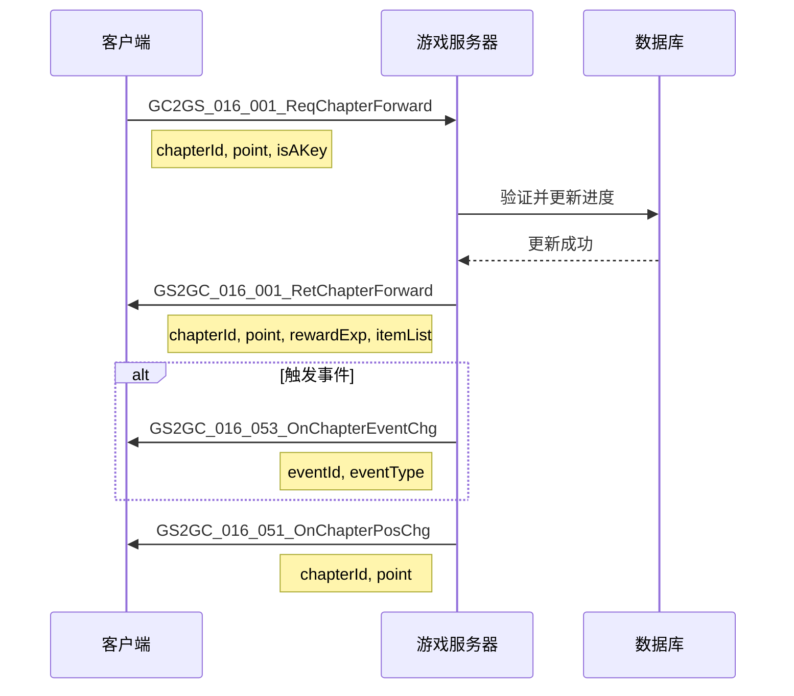

### 7.2 Boss战流程

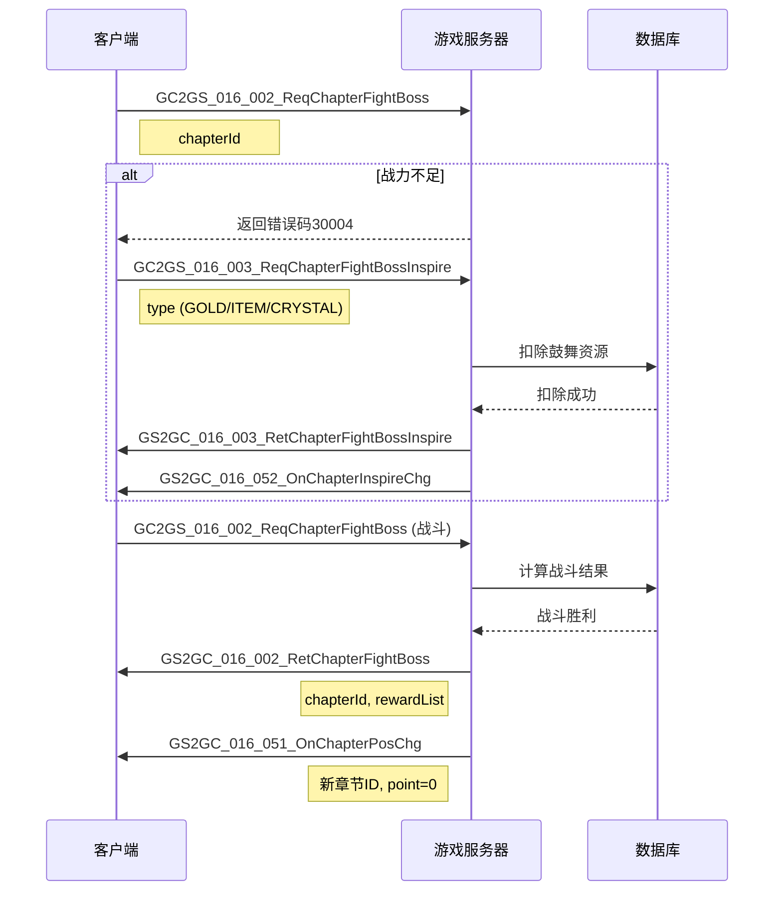

### 7.3 事件处理流程

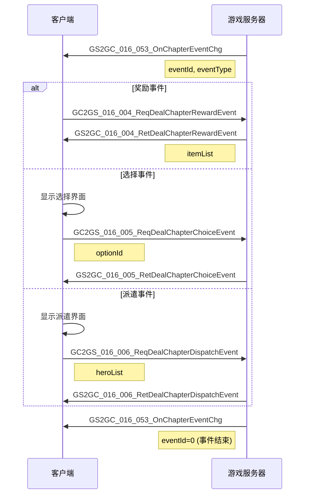

### 7.4 初始化流程

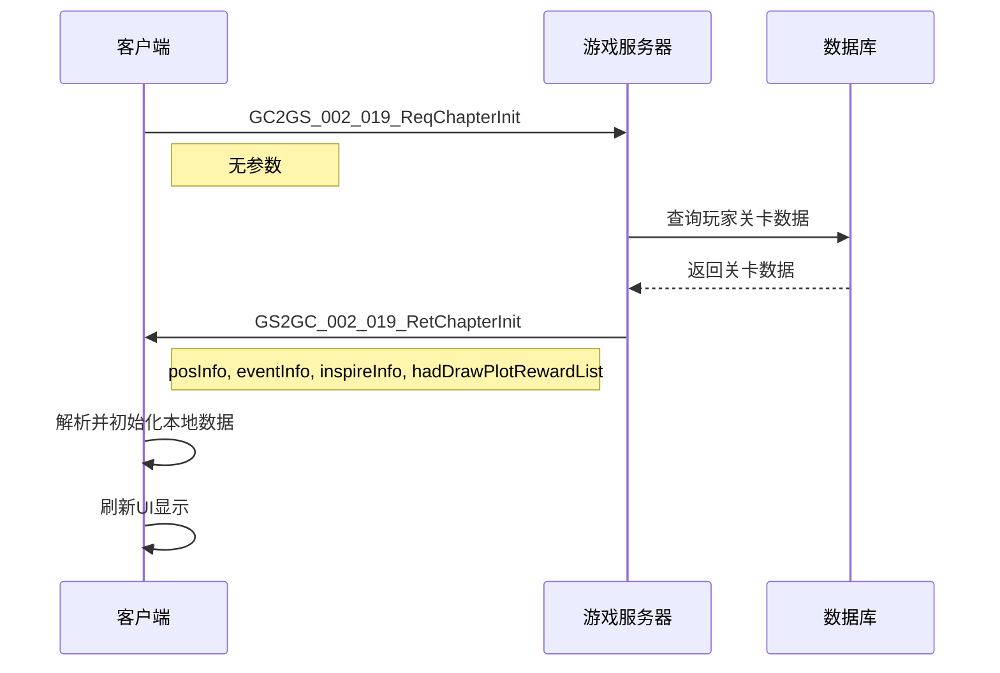

---

## 八、数据序列化

### 8.1 序列化格式

所有协议使用 `ALProtocolBuf` 进行二进制序列化。

### 8.2 基础类型大小

| 类型 | 大小 |
|------|------|
| byte | 1 byte |
| short | 2 bytes |
| int | 4 bytes |
| long | 8 bytes |
| float | 4 bytes |

### 8.3 序列化示例

```csharp
// 请求协议写入
public class GC2GS_016_001_ReqChapterForward : _IALProtocolStructure
{
    private long chapterId;
    private int point;
    private bool isAKey;

    public void PutUnzipBuf(ALProtocolBuf _buf)
    {
        _buf.putLong(chapterId);
        _buf.putInt(point);
        _buf.put(isAKey ? (byte)1 : (byte)0);
    }

    public void ReadUnzipBuf(ALProtocolBuf _buf, int _finalPos)
    {
        if(_finalPos > 0 && _buf.getCurPos() >= _finalPos) return;
        chapterId = _buf.getLong();
        if(_finalPos > 0 && _buf.getCurPos() >= _finalPos) return;
        point = _buf.getInt();
        if(_finalPos > 0 && _buf.getCurPos() >= _finalPos) return;
        isAKey = (_buf.get() != 0);
    }

    public int GetBufSize()
    {
        return 13; // long(8) + int(4) + byte(1)
    }
}

// 返回协议写入
public class GS2GC_016_001_RetChapterForward : _IALProtocolStructure
{
    private long chapterId;
    private int point;
    private int coefficient;
    private long rewardExp;
    private long rewardPlayerExp;
    private long eventId;
    private List<NPCommon_ItemInfo> itemList;
    private long costGoldNum;

    public void PutUnzipBuf(ALProtocolBuf _buf)
    {
        _buf.putLong(chapterId);
        _buf.putInt(point);
        _buf.putInt(coefficient);
        _buf.putLong(rewardExp);
        _buf.putLong(rewardPlayerExp);
        _buf.putLong(eventId);

        // 列表序列化
        _buf.putShort((short)itemList.Count);
        foreach (var item in itemList)
        {
            item.PutUnzipBuf(_buf);
        }

        _buf.putLong(costGoldNum);
    }

    public void ReadUnzipBuf(ALProtocolBuf _buf, int _finalPos)
    {
        if(_finalPos > 0 && _buf.getCurPos() >= _finalPos) return;
        chapterId = _buf.getLong();
        if(_finalPos > 0 && _buf.getCurPos() >= _finalPos) return;
        point = _buf.getInt();
        if(_finalPos > 0 && _buf.getCurPos() >= _finalPos) return;
        coefficient = _buf.getInt();
        if(_finalPos > 0 && _buf.getCurPos() >= _finalPos) return;
        rewardExp = _buf.getLong();
        if(_finalPos > 0 && _buf.getCurPos() >= _finalPos) return;
        rewardPlayerExp = _buf.getLong();
        if(_finalPos > 0 && _buf.getCurPos() >= _finalPos) return;
        eventId = _buf.getLong();

        // 列表反序列化
        itemList = new List<NPCommon_ItemInfo>();
        if(_finalPos > 0 && _buf.getCurPos() >= _finalPos) return;
        int count = _buf.getShort();
        for (int i = 0; i < count; i++)
        {
            NPCommon_ItemInfo item = new NPCommon_ItemInfo();
            item.ReadUnzipBuf(_buf, _finalPos);
            itemList.Add(item);
        }

        if(_finalPos > 0 && _buf.getCurPos() >= _finalPos) return;
        costGoldNum = _buf.getLong();
    }
}
```

---

## 九、错误处理

### 9.1 协议错误码

| 错误码 | 错误信息 | 处理建议 |
|--------|----------|----------|
| 30001 | 关卡BOSS未击败 | 继续战斗 |
| 30002 | 关卡点位不符 | 刷新界面 |
| 30003 | 关卡BOSS已击败 | 刷新状态 |
| 30004 | 关卡攻击BOSS战力不足 | 提升战力或鼓舞 |
| 30005 | 关卡没有在攻击BOSS | 检查状态 |
| 30006 | 关卡未解锁 | 检查解锁条件 |
| 30007 | 关卡事件未完成 | 完成事件 |
| 30008 | 没有可以处理的关卡事件 | 检查事件状态 |
| 30009 | 关卡剧情奖励已领取 | 刷新列表 |

### 9.2 错误处理代码

```csharp
// 通用错误处理
NPGSClientListener.sendRequestByLog(request,
    new CommonRequestCallbackProtocolDealer<RetType>(
        (info) => { /* 成功处理 */ },
        (errCode) => {
            // 根据错误码处理
            switch (errCode)
            {
                case 30001: // Boss未击败
                    NPGUIAddSceneCenterTip.instance.showTip("请先击败Boss");
                    break;
                case 30002: // 点位不符
                    NPGUIAddSceneCenterTip.instance.showTip("关卡进度异常，请刷新");
                    refreshChapterData();
                    break;
                case 30004: // 战力不足
                    showInspireDialog(); // 显示鼓舞提示
                    break;
                case 30006: // 未解锁
                    NPGUIAddSceneCenterTip.instance.showTip("章节尚未解锁");
                    break;
                case 30007: // 事件未完成
                    NPGUIAddSceneCenterTip.instance.showTip("请先完成当前事件");
                    break;
                default:
                    NPGUIAddSceneCenterTip.instance.showErrorInfo(errCode);
                    break;
            }
        }
    )
);
```

### 9.3 服务端错误处理

```java
// 服务端错误返回示例
public ResultOne<ForwardResult> forward(long _chapterId, int _targetPoint, NPPlayerContext _context)
{
    // 获取关卡配置
    RefChapter ref = getRef();
    if (ref == null)
        return ResultOne.failed(CommErr.REF_NOT_FOUND);

    // 判断是否有未完成事件
    if (_m_eventInfo != null)
        return ResultOne.failed(ChapterErr.CHAPTER_EVENT_NOT_DONE);

    // 判断关卡是否解锁
    if (!NPPlayerConditionDealerMgr.IsEnable(
        RefGeneral.Ref().unlock_chapter_simple_unlock_id,
        _m_comp.getUserData(), null))
        return ResultOne.failed(ChapterErr.CHAPTER_NOT_UNLOCK);

    // 验证位置
    int curPoint = _m_bo.getPoint();
    int targetPoint = curPoint + 1;

    if (_chapterId != _m_bo.getChapterId() || targetPoint != _targetPoint)
        return ResultOne.failed(ChapterErr.CHAPTER_POINT_NOT_FIT);

    // Boss格需要走特殊逻辑
    if (targetPoint == ref.point_count)
        return ResultOne.failed(ChapterErr.CHAPTER_BOSS_NOT_DEFEAT);

    // ... 继续处理
}
```

---

## 十、协议注册

### 10.1 协议注册表

```csharp
// 客户端协议注册
public static void registerChapterProtocol()
{
    // 请求协议注册
    NPGSClientListener.registerRequest<GS2GC_016_001_RetChapterForward>();
    NPGSClientListener.registerRequest<GS2GC_016_002_RetChapterFightBoss>();
    NPGSClientListener.registerRequest<GS2GC_016_003_RetChapterFightBossInspire>();
    NPGSClientListener.registerRequest<GS2GC_016_004_RetDealChapterRewardEvent>();
    NPGSClientListener.registerRequest<GS2GC_016_005_RetDealChapterChoiceEvent>();
    NPGSClientListener.registerRequest<GS2GC_016_006_RetDealChapterDispatchEvent>();
    NPGSClientListener.registerRequest<GS2GC_016_007_RetDrawChapterPlotReward>();

    // 推送协议注册
    NPGSClientListener.registerPush<GS2GC_016_051_OnChapterPosChg>();
    NPGSClientListener.registerPush<GS2GC_016_052_OnChapterInspireChg>();
    NPGSClientListener.registerPush<GS2GC_016_053_OnChapterEventChg>();
    NPGSClientListener.registerPush<GS2GC_016_054_OnChapterGmPosChg>();
    NPGSClientListener.registerPush<GS2GC_016_055_OnChapterPlotRewardDraw>();
}
```

### 10.2 协议号定义

```csharp
public class ChapterProtocolId
{
    public const int MAIN_PROTOCOL = 16;  // 0x10

    // 请求/返回协议
    public const int REQ_FORWARD = 1;
    public const int REQ_FIGHT_BOSS = 2;
    public const int REQ_INSPIRE = 3;
    public const int REQ_REWARD_EVENT = 4;
    public const int REQ_CHOICE_EVENT = 5;
    public const int REQ_DISPATCH_EVENT = 6;
    public const int REQ_PLOT_REWARD = 7;

    // 推送协议
    public const int ON_POS_CHG = 51;
    public const int ON_INSPIRE_CHG = 52;
    public const int ON_EVENT_CHG = 53;
    public const int ON_GM_POS_CHG = 54;
    public const int ON_PLOT_REWARD_DRAW = 55;
}
```

---

## 十一、协议完整字段对照表

### 11.1 请求协议字段汇总

| 协议名称 | 字段名 | 类型 | 必填 | 说明 |
|----------|--------|------|------|------|
| ReqChapterForward | chapterId | long | 是 | 章节ID |
| ReqChapterForward | point | int | 是 | 目标点位 |
| ReqChapterForward | isAKey | bool | 否 | 是否一键前进 |
| ReqChapterFightBoss | chapterId | long | 是 | 章节ID |
| ReqChapterFightBossInspire | type | EChapterInspireType | 是 | 鼓舞类型 |
| ReqDealChapterChoiceEvent | optionId | long | 是 | 选项ID |
| ReqDealChapterDispatchEvent | heroList | List\<long\> | 是 | 派遣大臣ID列表 |
| ReqDrawChapterPlotReward | plotIdList | List\<long\> | 是 | 剧情ID列表 |

### 11.2 返回协议字段汇总

| 协议名称 | 字段名 | 类型 | 说明 |
|----------|--------|------|------|
| RetChapterForward | chapterId | long | 章节ID |
| RetChapterForward | point | int | 当前点位 |
| RetChapterForward | coefficient | int | 系数（10000=普通，>10000=暴击） |
| RetChapterForward | rewardExp | long | 奖励大臣经验 |
| RetChapterForward | rewardPlayerExp | long | 奖励玩家经验 |
| RetChapterForward | eventId | long | 触发事件ID |
| RetChapterForward | itemList | List\<NPCommon_ItemInfo\> | 物品列表 |
| RetChapterForward | costGoldNum | long | 花费金币数量 |
| RetChapterFightBoss | chapterId | long | 章节ID |
| RetChapterFightBoss | rewardList | List\<NPCommon_ItemInfo\> | 奖励物品列表 |
| RetDealChapterDispatchEvent | dispatchId | long | 派遣ID |
| RetDealChapterDispatchEvent | endTime | long | 结束时间戳 |

### 11.3 推送协议字段汇总

| 协议名称 | 字段名 | 类型 | 说明 |
|----------|--------|------|------|
| OnChapterPosChg | posInfo | Chapter_PosInfo | 位置信息 |
| OnChapterInspireChg | inspireInfo | Chapter_InspireInfo | 鼓舞信息 |
| OnChapterEventChg | eventInfo | Chapter_EventInfo | 事件信息 |
| OnChapterGmPosChg | posInfo | Chapter_PosInfo | GM修改位置 |
| OnChapterPlotRewardDraw | plotIdList | List\<long\> | 已领取剧情ID |

---

## 十二、协议处理类图

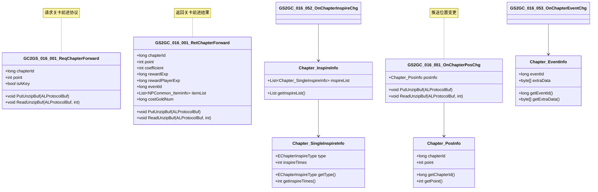

---

## 十三、协议状态流转图

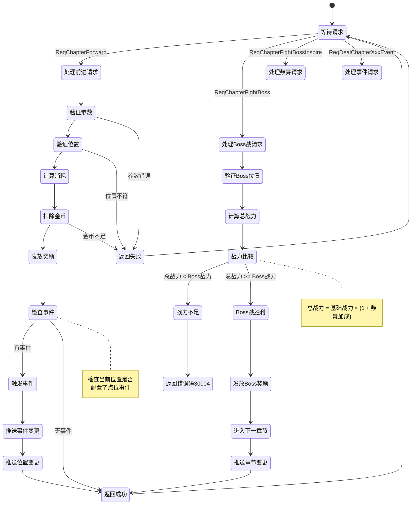

---

## 十四、协议日志记录规范

### 14.1 请求日志格式

```csharp
// 请求日志记录
public void logChapterRequest(string _protoName, params object[] _args)
{
    StringBuilder sb = new StringBuilder();
    sb.Append($"[Chapter][Request]{_protoName}|");
    sb.Append($"cid={NPPlayer.instance.playerInfo.CID}|");
    sb.Append($"time={DateTime.UtcNow.ToString("yyyy-MM-dd HH:mm:ss")}|");

    for (int i = 0; i < _args.Length; i += 2)
    {
        if (i + 1 < _args.Length)
        {
            sb.Append($"{_args[i]}={_args[i + 1]}|");
        }
    }

    Debug.Log(sb.ToString());
}

// 使用示例
logChapterRequest("ReqChapterForward",
    "chapterId", _chapterId,
    "point", _point,
    "isAKey", _isAKey);
```

### 14.2 返回日志格式

```csharp
// 返回日志记录
public void logChapterResponse<T>(string _protoName, T _response, int _errCode = 0)
{
    StringBuilder sb = new StringBuilder();
    sb.Append($"[Chapter][Response]{_protoName}|");
    sb.Append($"cid={NPPlayer.instance.playerInfo.CID}|");
    sb.Append($"time={DateTime.UtcNow.ToString("yyyy-MM-dd HH:mm:ss")}|");
    sb.Append($"errCode={_errCode}|");

    if (_errCode == 0 && _response != null)
    {
        // 记录关键返回数据
        if (_response is GS2GC_016_001_RetChapterForward forward)
        {
            sb.Append($"chapterId={forward.getChapterId()}|");
            sb.Append($"point={forward.getPoint()}|");
            sb.Append($"coefficient={forward.getCoefficient()}|");
            sb.Append($"rewardExp={forward.getRewardExp()}|");
        }
    }

    Debug.Log(sb.ToString());
}
```

---

## 十五、协议压力测试参考

### 15.1 并发请求测试

```csharp
// 模拟并发请求
public class ChapterProtocolStressTest
{
    private int _successCount = 0;
    private int _failCount = 0;
    private float _totalTime = 0f;

    public IEnumerator runStressTest(int _requestCount, int _concurrentCount)
    {
        Debug.Log($"开始压力测试: 总请求={_requestCount}, 并发数={_concurrentCount}");

        for (int i = 0; i < _requestCount; i += _concurrentCount)
        {
            var tasks = new ListCoroutine();
            for (int j = 0; j < _concurrentCount && i + j < _requestCount; j++)
            {
                tasks.Add(sendRequestAsync());
            }
            yield return tasks.WaitForAll();
        }

        Debug.Log($"压力测试完成: 成功={_successCount}, 失败={_failCount}, 平均耗时={_totalTime/(_successCount+_failCount)}ms");
    }

    private IEnumerator sendRequestAsync()
    {
        float startTime = Time.time;
        bool completed = false;

        NPPlayer.instance.chapterComp.reqChapterForward(false,
            (result) => {
                _successCount++;
                completed = true;
            },
            () => {
                _failCount++;
                completed = true;
            }
        );

        yield return new WaitUntil(() => completed);
        _totalTime += (Time.time - startTime) * 1000;
    }
}
```

### 15.2 性能指标参考

| 指标 | 正常值 | 警告值 | 说明 |
|------|--------|--------|------|
| 平均响应时间 | < 100ms | > 200ms | 单次请求耗时 |
| 成功率 | > 99% | < 95% | 请求成功比例 |
| 并发处理能力 | > 100/s | < 50/s | 每秒处理请求数 |
| 内存占用增长 | < 1MB/min | > 5MB/min | 内存泄漏检测 |

---

## 十六、协议版本兼容性

### 16.1 版本兼容策略

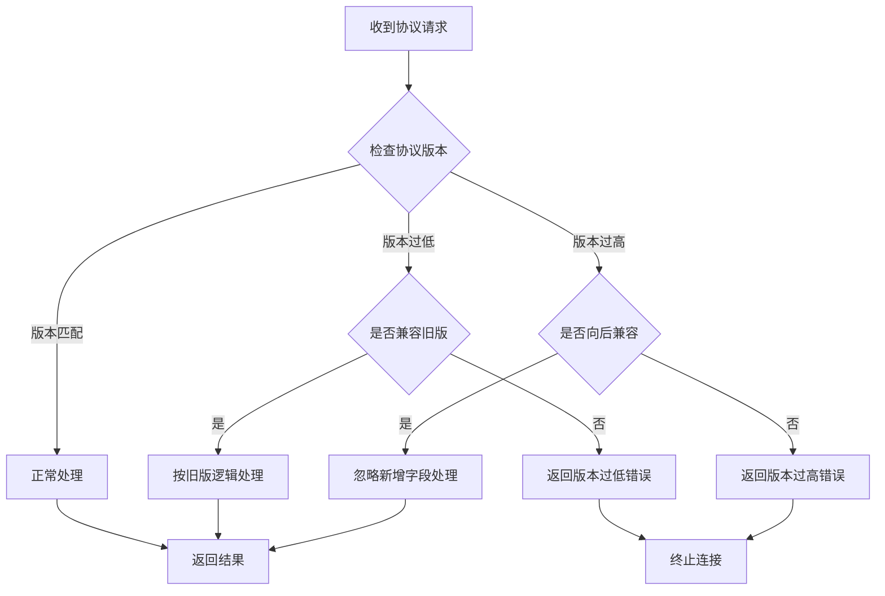

### 16.2 协议升级指南

```csharp
// 协议版本管理
public class ChapterProtocolVersion
{
    public const int CURRENT_VERSION = 3;

    // 版本兼容表
    private static readonly Dictionary<int, List<int>> _compatibilityMap = new()
    {
        { 3, new List<int> { 3, 2 } },  // v3 兼容 v3, v2
        { 2, new List<int> { 2, 1 } },  // v2 兼容 v2, v1
        { 1, new List<int> { 1 } }      // v1 只兼容 v1
    };

    public static bool isCompatible(int _clientVersion, int _serverVersion)
    {
        if (_compatibilityMap.TryGetValue(_serverVersion, out var compatibleList))
        {
            return compatibleList.Contains(_clientVersion);
        }
        return false;
    }
}

// 新增字段示例 (v2 -> v3)
public class GS2GC_016_001_RetChapterForward_v3 : GS2GC_016_001_RetChapterForward_v2
{
    // v3 新增字段
    private long newField;  // 新增的协议字段

    public override void ReadUnzipBuf(ALProtocolBuf _buf, int _finalPos)
    {
        base.ReadUnzipBuf(_buf, _finalPos);

        // 兼容旧版本：读取新字段时检查边界
        if (_finalPos <= 0 || _buf.getCurPos() < _finalPos)
        {
            newField = _buf.getLong();
        }
    }
}
```

---

## 十七、协议安全校验

### 17.1 请求频率限制

```csharp
// 请求频率限制器
public class ChapterRequestLimiter
{
    private Dictionary<string, RequestRecord> _records = new();

    // 各协议限制配置
    private readonly Dictionary<string, RateLimitConfig> _configs = new()
    {
        { "ReqChapterForward", new RateLimitConfig { MaxCount = 10, WindowSeconds = 1 } },
        { "ReqChapterFightBoss", new RateLimitConfig { MaxCount = 5, WindowSeconds = 1 } },
        { "ReqChapterFightBossInspire", new RateLimitConfig { MaxCount = 20, WindowSeconds = 1 } },
    };

    public bool checkLimit(long _cid, string _protoName)
    {
        string key = $"{_cid}_{_protoName}";
        var config = _configs.GetValueOrDefault(_protoName);

        if (config == null) return true;

        if (!_records.TryGetValue(key, out var record))
        {
            record = new RequestRecord();
            _records[key] = record;
        }

        // 清理过期记录
        var now = DateTime.UtcNow;
        record.timestamps = record.timestamps
            .Where(t => (now - t).TotalSeconds < config.WindowSeconds)
            .ToList();

        if (record.timestamps.Count >= config.MaxCount)
        {
            Debug.LogWarning($"请求频率超限: cid={_cid}, proto={_protoName}");
            return false;
        }

        record.timestamps.Add(now);
        return true;
    }
}

public class RateLimitConfig
{
    public int MaxCount { get; set; }
    public int WindowSeconds { get; set; }
}

public class RequestRecord
{
    public List<DateTime> timestamps = new();
}
```

### 17.2 参数合法性校验

```csharp
// 参数校验器
public class ChapterParamValidator
{
    public static bool validateForward(long _chapterId, int _point, bool _isAKey)
    {
        // 章节ID有效性
        if (_chapterId <= 0)
        {
            Debug.LogError($"无效章节ID: {_chapterId}");
            return false;
        }

        // 点位有效性
        if (_point < 0 || _point > 100)
        {
            Debug.LogError($"无效点位: {_point}");
            return false;
        }

        // 章节配置存在性
        var chapterRef = GRefdataCoreMgr.instance.chapterRefCore.getRef(_chapterId);
        if (chapterRef == null)
        {
            Debug.LogError($"章节配置不存在: {_chapterId}");
            return false;
        }

        // 点位范围校验
        if (_point > chapterRef.point_count)
        {
            Debug.LogError($"点位超出范围: {_point} > {chapterRef.point_count}");
            return false;
        }

        return true;
    }

    public static bool validateFightBoss(long _chapterId)
    {
        if (_chapterId <= 0) return false;

        var chapterRef = GRefdataCoreMgr.instance.chapterRefCore.getRef(_chapterId);
        if (chapterRef == null) return false;

        // 检查是否Boss点位
        var curPoint = NPPlayer.instance.chapterComp.curPointId;
        var nextPoint = curPoint + 1;

        if (nextPoint != chapterRef.point_count)
        {
            Debug.LogError($"非Boss点位请求Boss战: nextPoint={nextPoint}, bossPoint={chapterRef.point_count}");
            return false;
        }

        return true;
    }
}
```

---

## 十八、协议调试工具

### 18.1 协议模拟器

```csharp
// 协议模拟发送工具
public class ChapterProtocolSimulator : MonoBehaviour
{
    [Header("模拟参数")]
    [SerializeField] private long _chapterId = 1;
    [SerializeField] private int _point = 1;
    [SerializeField] private bool _isAKey = false;
    [SerializeField] private EChapterInspireType _inspireType = EChapterInspireType.GOLD;

    [ContextMenu("模拟前进请求")]
    public void simulateForward()
    {
        NPPlayer.instance.chapterComp.reqChapterForward(
            _chapterId, _point, _isAKey,
            (result) => {
                Debug.Log($"前进成功: point={result.getPoint()}, coefficient={result.getCoefficient()}");
            },
            () => {
                Debug.Log("前进失败");
            }
        );
    }

    [ContextMenu("模拟Boss战请求")]
    public void simulateFightBoss()
    {
        NPPlayer.instance.chapterComp.reqChapterFightBoss(
            _chapterId,
            (result) => {
                Debug.Log($"Boss战胜利: rewardCount={result.getRewardList().Count}");
            },
            (errCode) => {
                Debug.Log($"Boss战失败: errCode={errCode}");
            }
        );
    }

    [ContextMenu("模拟鼓舞请求")]
    public void simulateInspire()
    {
        NPPlayer.instance.chapterComp.reqChapterFightBossInspire(
            _inspireType,
            () => { Debug.Log("鼓舞成功"); },
            () => { Debug.Log("鼓舞失败"); },
            true
        );
    }

    [ContextMenu("模拟一键前进")]
    public void simulateQuickForward()
    {
        _isAKey = true;
        simulateForward();
    }
}
```

### 18.2 协议抓包分析

```csharp
// 协议数据抓包工具
public class ChapterProtocolSniffer
{
    private static List<ProtocolRecord> _records = new();
    private static int _maxRecords = 100;

    public static void recordProtocol(string _direction, string _protoName, byte[] _data)
    {
        var record = new ProtocolRecord
        {
            direction = _direction,
            protoName = _protoName,
            data = _data,
            timestamp = DateTime.UtcNow,
            dataSize = _data.Length
        };

        _records.Add(record);

        if (_records.Count > _maxRecords)
        {
            _records.RemoveAt(0);
        }
    }

    public static void dumpRecords()
    {
        StringBuilder sb = new StringBuilder();
        sb.AppendLine("=== Chapter Protocol Dump ===");

        foreach (var record in _records)
        {
            sb.AppendLine($"[{record.timestamp:HH:mm:ss.fff}][{record.direction}]{record.protoName} ({record.dataSize} bytes)");
        }

        Debug.Log(sb.ToString());
    }

    public static void clearRecords()
    {
        _records.Clear();
    }
}

public class ProtocolRecord
{
    public string direction;
    public string protoName;
    public byte[] data;
    public DateTime timestamp;
    public int dataSize;
}
```

---

---

## 十九、协议安全机制详解

### 19.1 消息签名验证

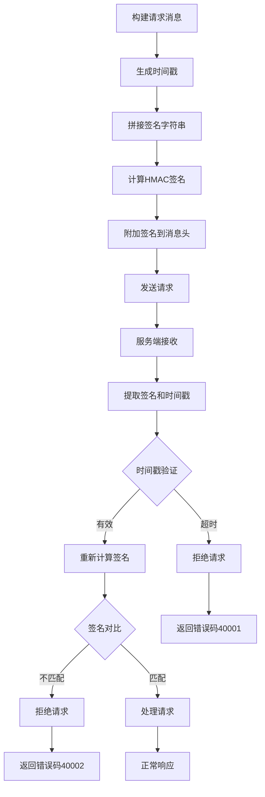

### 19.2 签名算法实现

```csharp
/// <summary>
/// 协议签名工具类
/// </summary>
public class ProtocolSigner
{
    private static readonly string SECRET_KEY = "your_secret_key_here";
    private static readonly int TIMESTAMP_EXPIRE_SECONDS = 300; // 5分钟过期

    /// <summary>
    /// 签名请求协议
    /// </summary>
    public static byte[] SignRequest(byte[] _data, long _timestamp)
    {
        using (var hmac = new HMACSHA256(Encoding.UTF8.GetBytes(SECRET_KEY)))
        {
            // 拼接签名数据: timestamp + data
            var signData = new byte[8 + _data.Length];
            BitConverter.GetBytes(_timestamp).CopyTo(signData, 0);
            _data.CopyTo(signData, 8);

            // 计算签名
            var signature = hmac.ComputeHash(signData);
            return signature;
        }
    }

    /// <summary>
    /// 验证签名
    /// </summary>
    public static bool VerifySignature(byte[] _data, long _timestamp, byte[] _signature)
    {
        // 检查时间戳是否过期
        var currentTime = DateTimeOffset.UtcNow.ToUnixTimeSeconds();
        if (Math.Abs(currentTime - _timestamp) > TIMESTAMP_EXPIRE_SECONDS)
        {
            Debug.LogWarning($"协议时间戳过期: timestamp={_timestamp}, current={currentTime}");
            return false;
        }

        // 计算并比对签名
        var expectedSignature = SignRequest(_data, _timestamp);
        return _signature.SequenceEqual(expectedSignature);
    }
}
```

---

## 二十、协议压缩优化

### 20.1 压缩策略

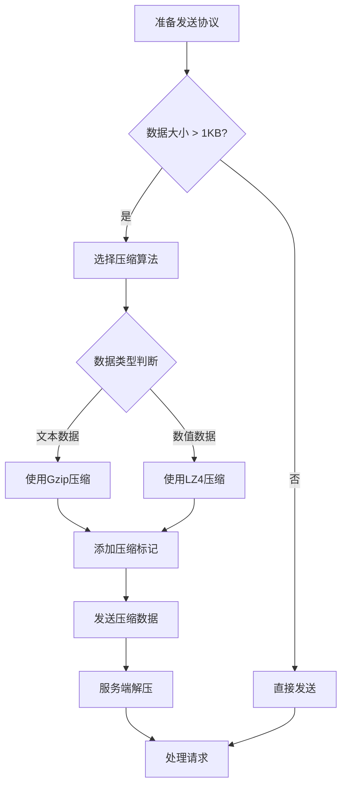

### 20.2 压缩实现

```csharp
/// <summary>
/// 协议压缩工具
/// </summary>
public class ProtocolCompressor
{
    private const int COMPRESSION_THRESHOLD = 1024; // 1KB
    private const byte COMPRESSION_NONE = 0;
    private const byte COMPRESSION_GZIP = 1;
    private const byte COMPRESSION_LZ4 = 2;

    /// <summary>
    /// 压缩协议数据
    /// </summary>
    public static byte[] Compress(byte[] _data)
    {
        if (_data.Length < COMPRESSION_THRESHOLD)
        {
            // 小数据不压缩
            var result = new byte[1 + _data.Length];
            result[0] = COMPRESSION_NONE;
            _data.CopyTo(result, 1);
            return result;
        }

        // 使用Gzip压缩
        using (var output = new MemoryStream())
        {
            output.WriteByte(COMPRESSION_GZIP);

            using (var gzip = new GZipStream(output, CompressionLevel.Optimal))
            {
                gzip.Write(_data, 0, _data.Length);
            }

            return output.ToArray();
        }
    }

    /// <summary>
    /// 解压协议数据
    /// </summary>
    public static byte[] Decompress(byte[] _compressedData)
    {
        if (_compressedData.Length == 0)
            return _compressedData;

        var compressionType = _compressedData[0];
        var data = new byte[_compressedData.Length - 1];
        Array.Copy(_compressedData, 1, data, 0, data.Length);

        switch (compressionType)
        {
            case COMPRESSION_NONE:
                return data;

            case COMPRESSION_GZIP:
                using (var input = new MemoryStream(data))
                using (var gzip = new GZipStream(input, CompressionMode.Decompress))
                using (var output = new MemoryStream())
                {
                    gzip.CopyTo(output);
                    return output.ToArray();
                }

            case COMPRESSION_LZ4:
                // LZ4解压实现
                return LZ4Decompress(data);

            default:
                throw new NotSupportedException($"不支持的压缩类型: {compressionType}");
        }
    }

    private static byte[] LZ4Decompress(byte[] _data)
    {
        // LZ4解压实现
        // ...
        return _data;
    }
}
```

---

## 二十一、协议重发机制

### 21.1 重发策略图

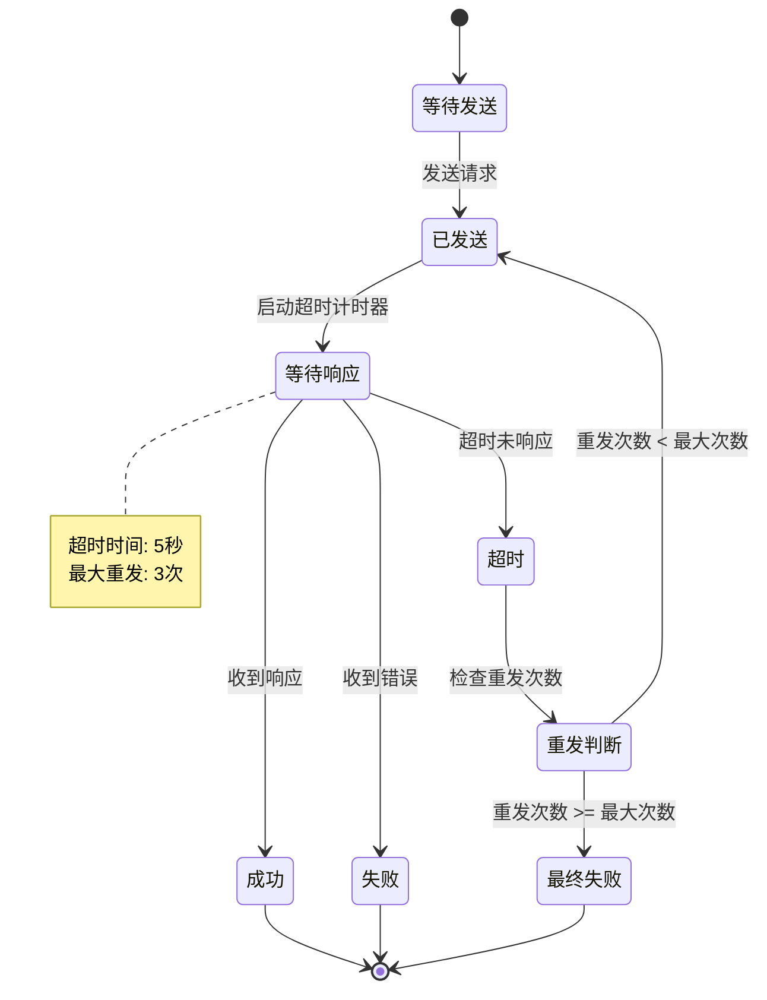

### 21.2 重发管理器实现

```csharp
/// <summary>
/// 协议重发管理器
/// </summary>
public class ProtocolRetryManager
{
    private const int MAX_RETRY_COUNT = 3;
    private const int RETRY_DELAY_MS = 1000;
    private const int TIMEOUT_MS = 5000;

    private Dictionary<long, RetryContext> _pendingRequests = new();
    private long _requestIdCounter = 0;

    /// <summary>
    /// 发送带重发的请求
    /// </summary>
    public void SendWithRetry<T>(
        byte[] _requestData,
        Action<T> _onSuccess,
        Action<int> _onFailed,
        int _currentRetry = 0)
    {
        var requestId = ++_requestIdCounter;

        // 创建重发上下文
        var context = new RetryContext
        {
            RequestId = requestId,
            RequestData = _requestData,
            OnSuccess = _onSuccess,
            OnFailed = _onFailed,
            RetryCount = _currentRetry,
            SendTime = Time.time
        };

        _pendingRequests[requestId] = context;

        // 发送请求
        NPGSClientListener.sendRequestByLog(_requestData,
            new CommonRequestCallbackProtocolDealer<T>(
                (response) => {
                    _pendingRequests.Remove(requestId);
                    _onSuccess?.Invoke(response);
                },
                (errCode) => {
                    HandleError(requestId, errCode);
                }
            )
        );

        // 启动超时检测
        StartTimeoutCheck(requestId);
    }

    /// <summary>
    /// 处理错误
    /// </summary>
    private void HandleError(long _requestId, int _errCode)
    {
        if (!_pendingRequests.TryGetValue(_requestId, out var context))
            return;

        // 网络错误才重试
        if (IsNetworkError(_errCode) && context.RetryCount < MAX_RETRY_COUNT)
        {
            Debug.Log($"协议请求{_requestId}失败，准备第{context.RetryCount + 1}次重试");

            // 延迟重试
            Task.Run(async () => {
                await Task.Delay(RETRY_DELAY_MS);
                SendWithRetry(
                    context.RequestData,
                    context.OnSuccess,
                    context.OnFailed,
                    context.RetryCount + 1
                );
            });

            _pendingRequests.Remove(_requestId);
        }
        else
        {
            _pendingRequests.Remove(_requestId);
            context.OnFailed?.Invoke(_errCode);
        }
    }

    /// <summary>
    /// 判断是否是网络错误
    /// </summary>
    private bool IsNetworkError(int _errCode)
    {
        return _errCode == -1 || _errCode == 10001 || _errCode == 10002;
    }

    /// <summary>
    /// 启动超时检测
    /// </summary>
    private async void StartTimeoutCheck(long _requestId)
    {
        await Task.Delay(TIMEOUT_MS);

        if (_pendingRequests.TryGetValue(_requestId, out var context))
        {
            HandleError(_requestId, -1); // 超时错误
        }
    }

    private class RetryContext
    {
        public long RequestId;
        public byte[] RequestData;
        public object OnSuccess;
        public Action<int> OnFailed;
        public int RetryCount;
        public float SendTime;
    }
}
```

---

## 二十二、协议监控与统计

### 22.1 协议监控面板

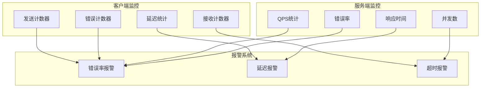

### 22.2 统计数据结构

```csharp
/// <summary>
/// 协议统计数据
/// </summary>
public class ProtocolStatistics
{
    // 总览
    public long totalSent;          // 总发送数
    public long totalReceived;      // 总接收数
    public long totalErrors;        // 总错误数
    public float avgLatency;        // 平均延迟
    public float maxLatency;        // 最大延迟

    // 按协议统计
    public Dictionary<int, ProtocolStat> protocolStats = new();

    // 时间窗口统计
    public Queue<TimeWindowStat> timeWindowStats = new();

    /// <summary>
    /// 记录发送
    /// </summary>
    public void RecordSend(int _protocolId)
    {
        totalSent++;
        GetOrCreateStat(_protocolId).sendCount++;
    }

    /// <summary>
    /// 记录接收
    /// </summary>
    public void RecordReceive(int _protocolId, float _latency)
    {
        totalReceived++;
        var stat = GetOrCreateStat(_protocolId);
        stat.receiveCount++;
        stat.totalLatency += _latency;
        stat.maxLatency = Math.Max(stat.maxLatency, _latency);

        // 更新全局统计
        avgLatency = (avgLatency * (totalReceived - 1) + _latency) / totalReceived;
        maxLatency = Math.Max(maxLatency, _latency);
    }

    /// <summary>
    /// 记录错误
    /// </summary>
    public void RecordError(int _protocolId, int _errCode)
    {
        totalErrors++;
        var stat = GetOrCreateStat(_protocolId);
        stat.errorCount++;
        stat.errorCodes[_errCode] = stat.errorCodes.GetValueOrDefault(_errCode, 0) + 1;
    }

    private ProtocolStat GetOrCreateStat(int _protocolId)
    {
        if (!protocolStats.TryGetValue(_protocolId, out var stat))
        {
            stat = new ProtocolStat { protocolId = _protocolId };
            protocolStats[_protocolId] = stat;
        }
        return stat;
    }

    /// <summary>
    /// 获取错误率
    /// </summary>
    public float GetErrorRate()
    {
        return totalSent > 0 ? (float)totalErrors / totalSent : 0;
    }

    /// <summary>
    /// 获取协议统计报告
    /// </summary>
    public string GetReport()
    {
        var sb = new StringBuilder();
        sb.AppendLine("=== 协议统计报告 ===");
        sb.AppendLine($"总发送: {totalSent}");
        sb.AppendLine($"总接收: {totalReceived}");
        sb.AppendLine($"总错误: {totalErrors}");
        sb.AppendLine($"错误率: {GetErrorRate():P2}");
        sb.AppendLine($"平均延迟: {avgLatency:F2}ms");
        sb.AppendLine($"最大延迟: {maxLatency:F2}ms");
        sb.AppendLine();

        sb.AppendLine("=== 协议详情 ===");
        foreach (var stat in protocolStats.Values.OrderByDescending(s => s.sendCount))
        {
            sb.AppendLine($"协议{stat.protocolId}: 发送{stat.sendCount}, 接收{stat.receiveCount}, 错误{stat.errorCount}");
        }

        return sb.ToString();
    }
}

public class ProtocolStat
{
    public int protocolId;
    public long sendCount;
    public long receiveCount;
    public long errorCount;
    public float totalLatency;
    public float maxLatency;
    public Dictionary<int, int> errorCodes = new();
}

public class TimeWindowStat
{
    public long timestamp;
    public long sendCount;
    public long receiveCount;
    public long errorCount;
}
```

---

## 二十三、协议断线重连处理

### 23.1 重连流程

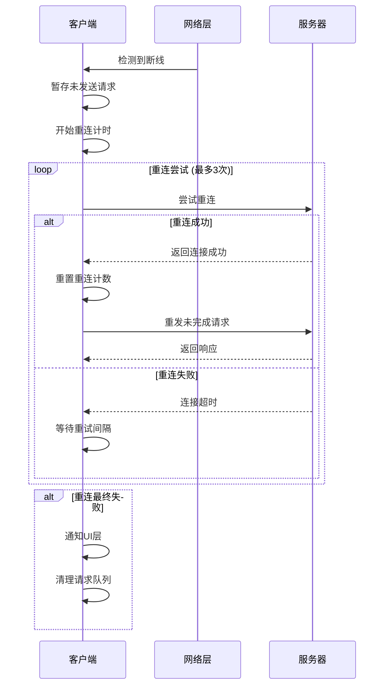

### 23.2 重连管理器

```csharp
/// <summary>
/// 断线重连管理器
/// </summary>
public class ReconnectionManager
{
    private const int MAX_RECONNECT_COUNT = 3;
    private const int RECONNECT_INTERVAL_MS = 2000;
    private const int CONNECT_TIMEOUT_MS = 5000;

    private int _reconnectCount = 0;
    private bool _isReconnecting = false;
    private Queue<PendingRequest> _pendingRequests = new();

    /// <summary>
    /// 处理断线
    /// </summary>
    public void OnDisconnected()
    {
        if (_isReconnecting) return;

        Debug.Log("检测到断线，开始重连...");
        _isReconnecting = true;
        _reconnectCount = 0;

        // 暂存当前请求
        SavePendingRequests();

        // 开始重连
        StartReconnect();
    }

    /// <summary>
    /// 开始重连
    /// </summary>
    private async void StartReconnect()
    {
        while (_reconnectCount < MAX_RECONNECT_COUNT)
        {
            _reconnectCount++;
            Debug.Log($"第{_reconnectCount}次重连尝试...");

            bool connected = await TryReconnect();

            if (connected)
            {
                OnReconnectSuccess();
                return;
            }

            if (_reconnectCount < MAX_RECONNECT_COUNT)
            {
                await Task.Delay(RECONNECT_INTERVAL_MS);
            }
        }

        OnReconnectFailed();
    }

    /// <summary>
    /// 尝试重连
    /// </summary>
    private async Task<bool> TryReconnect()
    {
        try
        {
            var cts = new CancellationTokenSource(CONNECT_TIMEOUT_MS);
            await NPGSClientListener.ReconnectAsync(cts.Token);
            return true;
        }
        catch (Exception e)
        {
            Debug.LogWarning($"重连失败: {e.Message}");
            return false;
        }
    }

    /// <summary>
    /// 重连成功
    /// </summary>
    private void OnReconnectSuccess()
    {
        Debug.Log("重连成功，重发未完成请求");
        _isReconnecting = false;
        _reconnectCount = 0;

        // 重发暂存的请求
        while (_pendingRequests.Count > 0)
        {
            var request = _pendingRequests.Dequeue();
            ResendRequest(request);
        }

        // 通知UI层
        WinMsg.SendMsg(WinMsgType.ON_NETWORK_RECONNECTED);
    }

    /// <summary>
    /// 重连失败
    /// </summary>
    private void OnReconnectFailed()
    {
        Debug.LogError("重连最终失败");
        _isReconnecting = false;

        // 清理请求队列
        _pendingRequests.Clear();

        // 通知UI层
        WinMsg.SendMsg(WinMsgType.ON_NETWORK_RECONNECT_FAILED);
    }

    /// <summary>
    /// 暂存未完成请求
    /// </summary>
    private void SavePendingRequests()
    {
        // 从网络层获取未完成的请求并暂存
        // var requests = NPGSClientListener.GetPendingRequests();
        // foreach (var req in requests)
        // {
        //     _pendingRequests.Enqueue(req);
        // }
    }

    /// <summary>
    /// 重发请求
    /// </summary>
    private void ResendRequest(PendingRequest _request)
    {
        NPGSClientListener.sendRequestByLog(_request.data, _request.callback);
    }
}

public class PendingRequest
{
    public byte[] data;
    public object callback;
    public long timestamp;
}
```

---

*文档版本: 3.0 | 更新时间: 2026-04-12*
