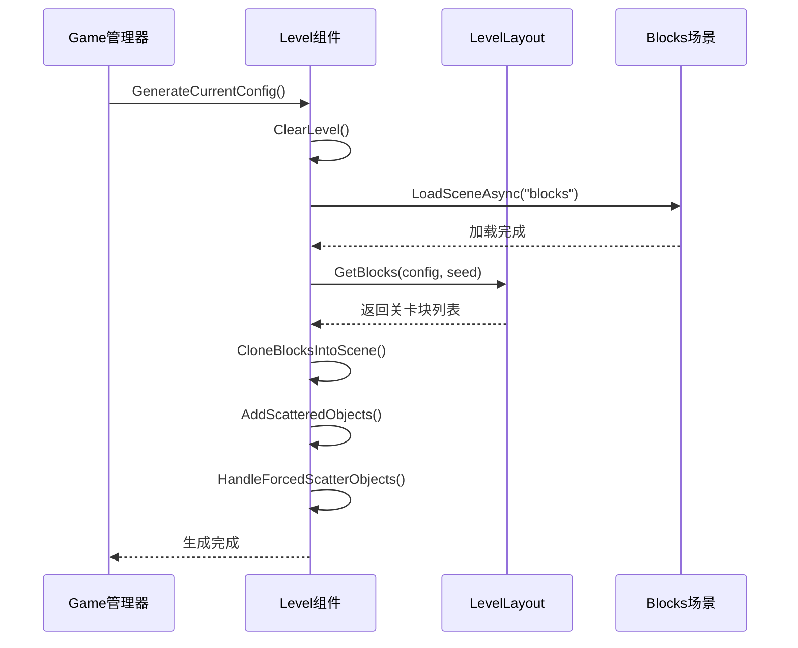
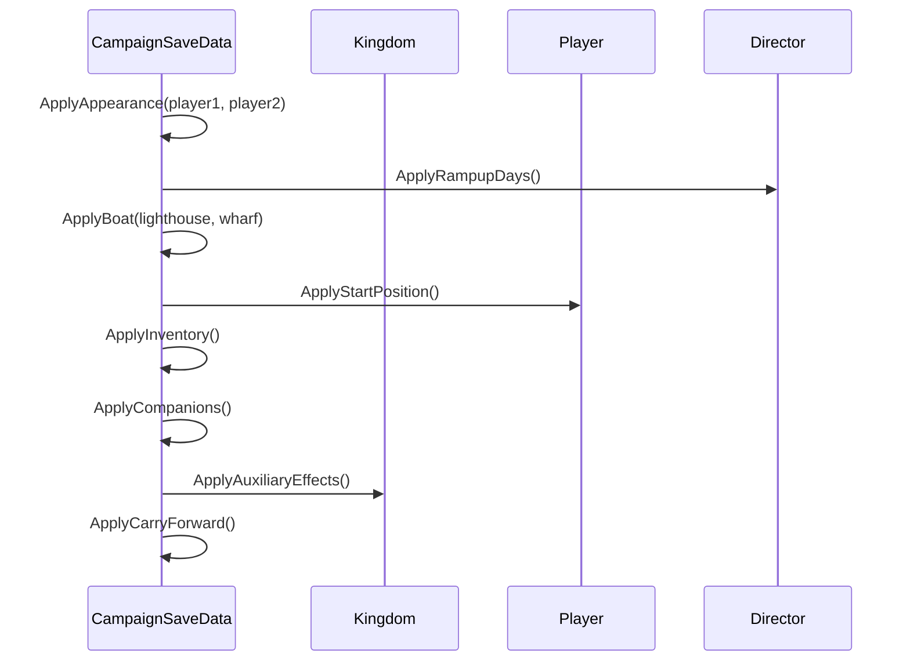
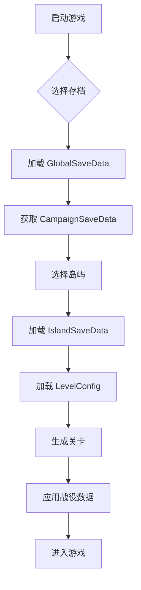
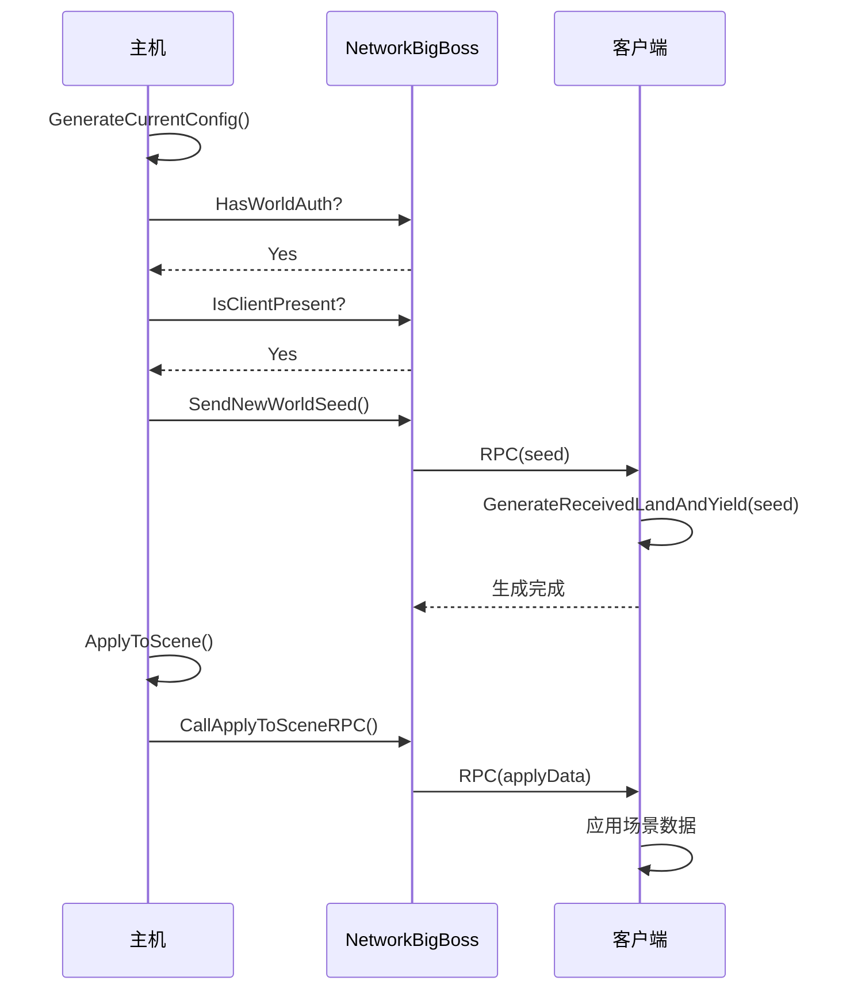
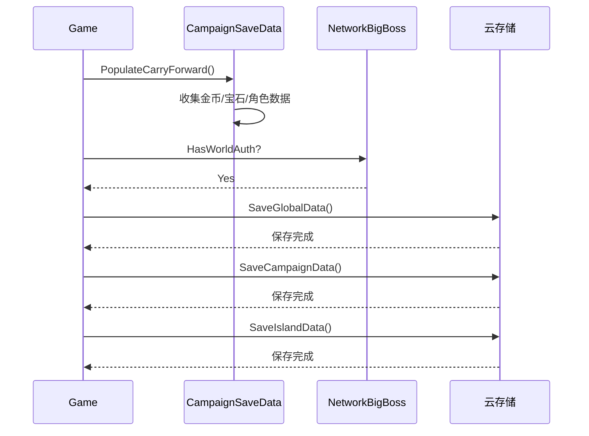

# Module_Chapter - 协议文档

**模块名称**: Chapter（章节/岛屿系统）
**文档版本**: 2.0
**创建日期**: 2026-04-11

---

## 一、协议概述

### 1.1 模块定位

章节模块在 Kingdom Two Crowns 中对应的是岛屿（Land）和关卡（Level）系统。由于 K2C 是单机+合作游戏，其协议设计主要用于：

1. **本地存档同步** - CampaignSaveData 与 IslandSaveData 的序列化/反序列化
2. **多人合作同步** - NetworkBigBoss 管理的客户端-服务端数据同步
3. **跨平台存档** - Steam/Xbox/PSN/Apple/Android 云存档同步

### 1.2 协议模块编号

由于 K2C 使用自定义 RPC 系统，不采用传统的协议号设计。关键 RPC 通过 `StaticPostbox.CallStaticRPCRemotely(opcode)` 调用。

---

## 二、岛屿状态协议

### 2.1 岛屿解锁协议

#### UnlockNextLand - 解锁下一岛屿

**触发时机**: 玩家从当前岛屿乘船离开时

**数据流程**:
```
Game.SailedAway → CampaignSaveData.UnlockNextLand → Stats.GameProgress 更新
```

**核心代码** (`CampaignSaveData.cs`):
```csharp
public Land? UnlockNextLand()
{
    Land furthestUnlockedLand = this.furthestUnlockedLand;
    
    // 如果玩家乘船离开
    if (SingletonMonoBehaviour<Managers>.Inst.game.result == Game.Result.SailedAway)
    {
        // 解锁下一岛屿（最大为 Five）
        this.furthestUnlockedLand = (Land) UnityEngine.Mathf.Min(
            ((int) SingletonMonoBehaviour<Managers>.Inst.game.currentLand) + 1, 4);
    }
    
    // 确保 furthestUnlockedLand 不减少
    this.furthestUnlockedLand = (Land) UnityEngine.Mathf.Max(
        (int) this.furthestUnlockedLand, (int) furthestUnlockedLand);
    
    // 更新游戏进度统计
    float num = 0f;
    float num2 = ((float) this.furthestUnlockedLand) / 4f;
    SingletonMonoBehaviour<Managers>.Inst.stats.SetStat(
        Stat.GameProgress, (num + num2) / 2f, false);
    
    // 返回新解锁的岛屿
    if (furthestUnlockedLand != this.furthestUnlockedLand)
    {
        return new Land?(this.currentLand = this.furthestUnlockedLand);
    }
    return null;
}
```

---

### 2.2 岛屿切换协议

#### SaveBeforeSwitchLand - 切换岛屿前保存

**数据流程**:
```
Game.Run → SaveGameWithFailurePrompt → IslandSaveData.Save → GlobalSaveData.Save
```

**协议数据包结构**:
| 字段名 | 类型 | 说明 |
|--------|------|------|
| land | Land? | 目标岛屿 |
| saveType | int | 保存类型 |
| syncCloud | bool | 是否同步云端 |
| forceSave | bool | 强制保存 |

---

## 三、关卡生成协议

### 3.1 关卡生成 RPC

#### GenerateCurrentConfig - 生成当前关卡配置

**源码路径**: `BuildingWorld/Level.cs`

**RPC Opcode**: 无（本地执行）

**流程**:


### 3.2 网络同步关卡种子

#### SendNewWorldSeed - 发送关卡种子到客户端

**RPC Opcode**: 自定义

**触发时机**: 服务端生成关卡后通知客户端

**数据包结构**:
| 字段名 | 类型 | 说明 |
|--------|------|------|
| seed | int | 关卡生成种子 |
| configId | int | 关卡配置ID |

**核心代码** (`Level.cs`):
```csharp
if (NetworkBigBoss.HasWorldAuth && NetworkBigBoss.IsClientPresent)
{
    UnityEngine.Debug.LogWarningFormat("Notfying connected client of new generation...");
    NetworkBigBoss.Instance.SendNewWorldSeed();
}
```

#### GenerateReceivedLandAndYield - 客户端接收种子生成

**RPC Opcode**: 对应服务端 SendNewWorldSeed

**数据包结构**:
| 字段名 | 类型 | 说明 |
|--------|------|------|
| seed | int | 关卡生成种子 |

---

## 四、战役状态同步协议

### 4.1 ApplyToScene - 应用战役数据到场景

**源码路径**: `CampaignSaveData.cs`

**流程**:


### 4.2 网络同步 ApplyToScene

#### CallApplyToSceneRPC - 网络同步场景数据

**RPC Opcode**: 0x3ed

**数据包结构**:
| 字段名 | 类型 | 说明 |
|--------|------|------|
| hasBoat | bool | 是否有船 |
| hermitHorse | HermitData | 马匹隐士数据 |
| hermitHorn | HermitData | 号角隐士数据 |
| hermitBallista | HermitData | 弩炮隐士数据 |
| hermitBaker | HermitData | 面包师隐士数据 |
| hermitKnight | HermitData | 骑士隐士数据 |
| hasDog | bool | 是否有狗 |
| dogPosition | Vector3 | 狗的位置 |
| dogColor | Color | 狗的颜色 |

**核心代码** (`CampaignSaveData.cs`):
```csharp
private void CallApplyToSceneRPC(Hermit hermitHorse, Hermit hermitHorn, 
    Hermit hermitBallista, Hermit hermitBaker, Hermit hermitKnight, Dog dog)
{
    ByteBuffer.PrepWriteBuffer();
    ByteBuffer.Write(SingletonMonoBehaviour<Managers>.Inst.kingdom.boat != null);
    
    this.WriteHermit(Hermit.HermitType.Horse, hermitHorse);
    this.WriteHermit(Hermit.HermitType.Horn, hermitHorn);
    this.WriteHermit(Hermit.HermitType.Ballista, hermitBallista);
    this.WriteHermit(Hermit.HermitType.Baker, hermitBaker);
    this.WriteHermit(Hermit.HermitType.Knight, hermitKnight);
    
    ByteBuffer.Write(dog != null);
    if (dog != null)
    {
        ByteBuffer.Write(dog.transform.position);
        ByteBuffer.Write(dog.color);
    }
    
    StaticPostbox.CallStaticRPCRemotely(0x3ed);
}
```

### 4.3 玩家位置同步

#### Player Position RPC - 同步玩家位置

**RPC Opcode**: 0x3eb

**数据包结构**:
| 字段名 | 类型 | 说明 |
|--------|------|------|
| playerX | float | 玩家X坐标 |

**核心代码** (`CampaignSaveData.cs`):
```csharp
if (NetworkBigBoss.IsClientPresent)
{
    ByteBuffer.PrepWriteBuffer();
    ByteBuffer.Write((float) (x + 1f));
    StaticPostbox.CallStaticRPCRemotely(0x3eb);
}
```

---

## 五、岛屿存档协议

### 5.1 IslandSaveData 结构

**源码路径**: `Common/IslandSaveData.cs`

| 字段名 | 类型 | 说明 |
|--------|------|------|
| land | Land | 岛屿ID |
| isNew | bool | 是否新岛屿 |
| lastPlayedReign | int | 最后游玩的统治次数 |
| buildings | List\<BuildingSaveData\> | 建筑存档数据 |
| characters | List\<CharacterSaveData\> | 角色存档数据 |
| portals | List\<PortalSaveData\> | 传送门存档数据 |

### 5.2 存档加载流程



---

## 六、跨平台存档协议

### 6.1 Steam 云存档

**相关组件**: `SteamPlatformManager.cs`

**协议接口**:
| 接口名 | 说明 |
|--------|------|
| SteamRemoteStorage | Steam 云存储接口 |
| OnCloudSaveComplete | 云存档完成回调 |
| OnCloudLoadComplete | 云加载完成回调 |

### 6.2 Xbox Live 存档

**相关组件**: `XboxManager.cs`

**协议接口**:
| 接口名 | 说明 |
|--------|------|
| XboxConnectedStorage | Xbox 连接存储 |
| OnXboxSaveComplete | Xbox 存档完成回调 |

### 6.3 PlayStation 存档

**相关组件**: `PS4SaveManager.cs`

### 6.4 Apple Game Center

**相关组件**: `AppleManager.cs`

### 6.5 Google Play Games

**相关组件**: `AndroidManager.cs`

---

## 七、推送协议

### 7.1 游戏事件推送

#### OnCoatOfArmsChanged - 纹章变更推送

**触发时机**: 纹章自定义完成时

```csharp
public static event Action OnCoatOfArmsChanged;
```

#### OnDeityActivated - 神像激活推送

**触发时机**: 神像被激活时

```csharp
public static event Action OnDeityActivated;
```

#### OnPlayerAppearenceChanged - 玩家外观变更推送

**触发时机**: 玩家外观更新时

```csharp
public static event Action OnPlayerAppearenceChanged;
```

### 7.2 游戏结果推送

| 事件名 | 说明 | 数据 |
|--------|------|------|
| OnGameStart | 游戏开始 | 无 |
| OnGameEnd | 游戏结束 | 无 |
| OnLose | 游戏失败 | 无 |
| OnWin | 游戏胜利 | 无 |
| OnSailAway | 乘船离开 | 无 |
| OnNewGame | 新游戏开始 | 无 |

---

## 八、协议数据序列化

### 8.1 ByteBuffer 序列化

**源码路径**: `Network/ByteBuffer.cs`

**主要方法**:
```csharp
// 准备写入缓冲区
ByteBuffer.PrepWriteBuffer();

// 写入基础类型
ByteBuffer.Write(bool value);
ByteBuffer.Write(int value);
ByteBuffer.Write(float value);
ByteBuffer.Write(Vector3 value);
ByteBuffer.Write(Color value);

// 调用远程 RPC
StaticPostbox.CallStaticRPCRemotely(opcode);
```

### 8.2 序列化示例 - 隐士数据

```csharp
private void WriteHermit(Hermit.HermitType type, Hermit hermit)
{
    Hermit.HermitStatus status = this.hermitStatuses[(int) type];
    
    switch (status.position)
    {
        case Hermit.HermitPosition.Roaming:
        case Hermit.HermitPosition.PickedUp:
            if (status.land == this.currentLand)
            {
                ByteBuffer.Write(true);
                ByteBuffer.Write(hermit.transform.position);
                return;
            }
            break;

        case Hermit.HermitPosition.Passenger:
            ByteBuffer.Write(true);
            ByteBuffer.Write(hermit.transform.position);
            return;
    }
    
    ByteBuffer.Write(false);
}
```

---

## 九、网络同步时序图

### 9.1 合作模式关卡同步



### 9.2 存档同步流程



---

## 十、错误处理

### 10.1 网络错误码

| 错误场景 | 处理方式 | 用户提示 |
|----------|----------|----------|
| 客户端连接失败 | 重试连接 | "连接失败，请重试" |
| 存档同步失败 | 本地保存+后续同步 | "存档同步失败，已本地保存" |
| 关卡生成失败 | 回退到默认配置 | "关卡加载失败" |
| RPC 调用失败 | 重试或降级处理 | "网络不稳定" |

### 10.2 存档损坏处理

```csharp
// 存档验证
if (IslandSaveData.loaded == null)
{
    // 创建新存档
    IslandSaveData.loaded = new IslandSaveData();
    IslandSaveData.loaded.isNew = true;
}

// 存档修复
if (IslandSaveData.loaded.land == Land.Invalid)
{
    IslandSaveData.loaded.land = Land.One;
}
```

---

*文档版本: 2.0 | 更新时间: 2026-04-11*