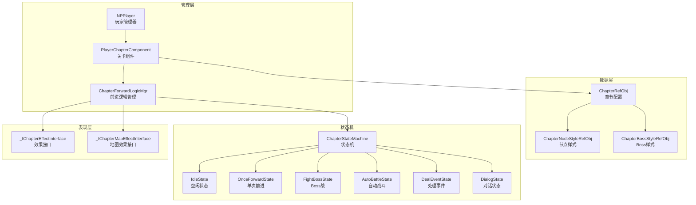
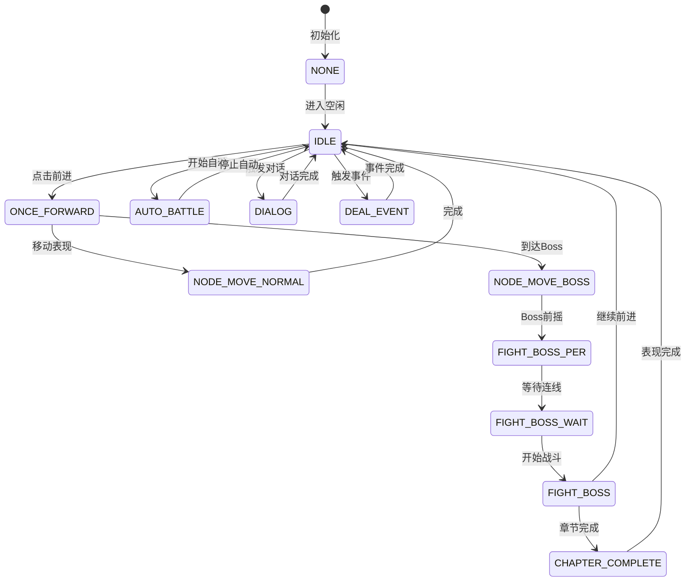
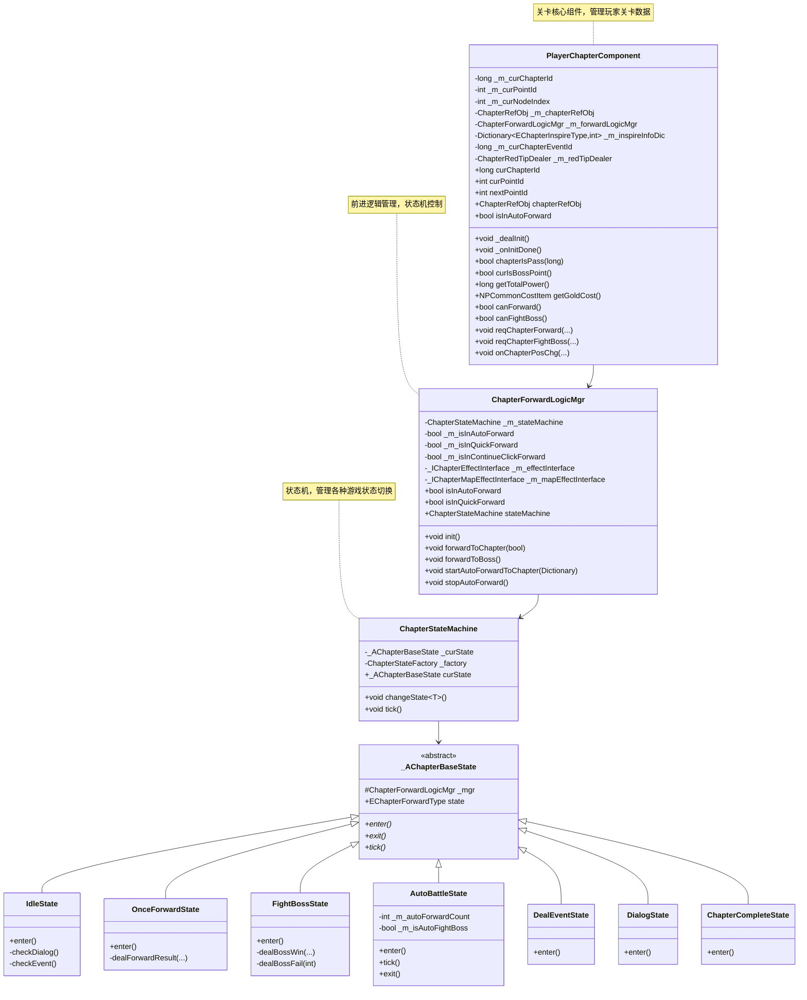
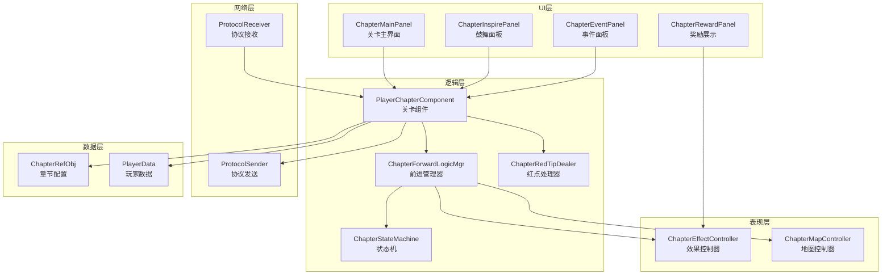
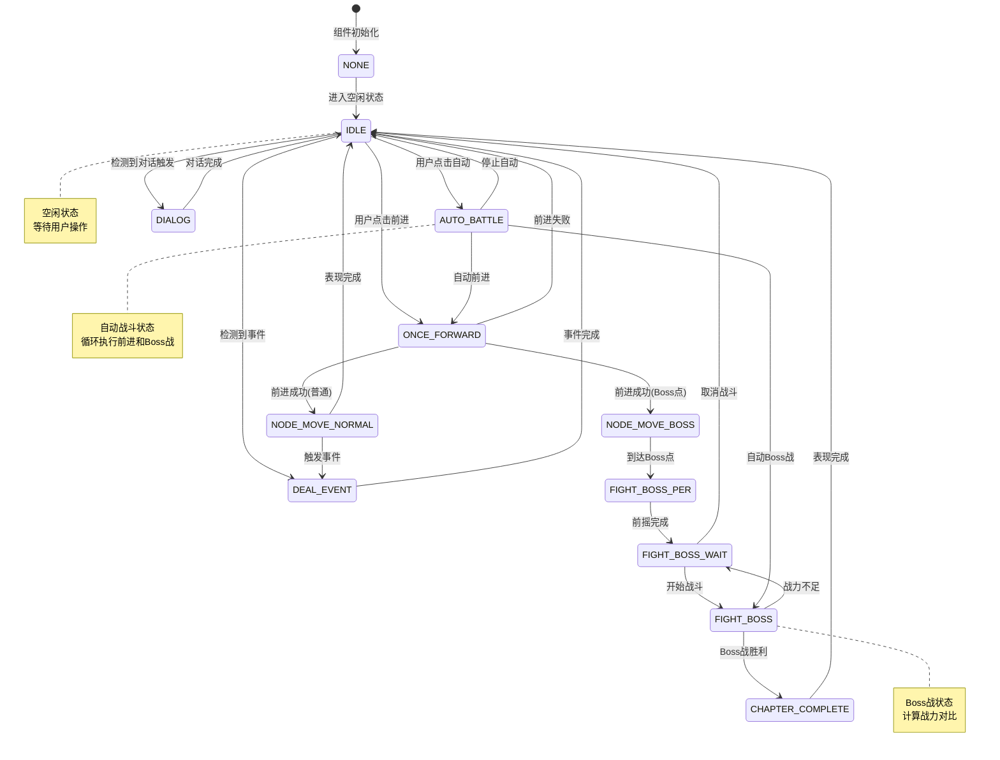
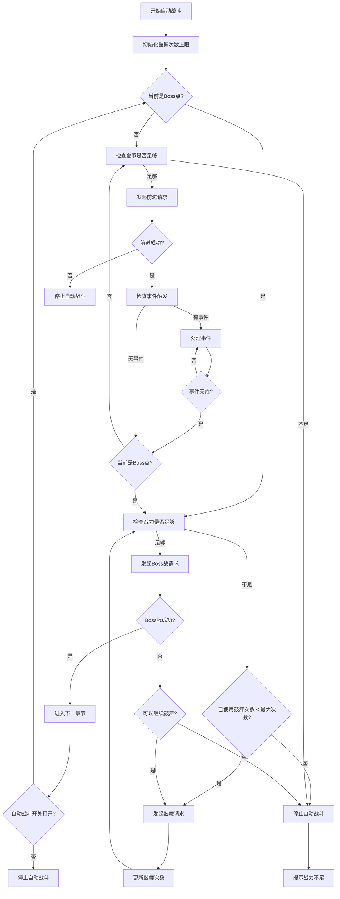
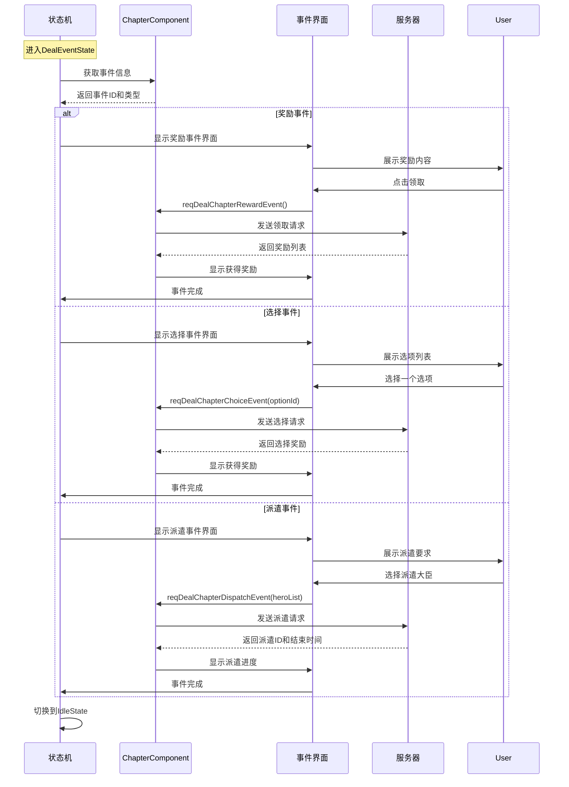

# Module_Chapter - 客户端开发文档

**模块名称**: Chapter（章节关卡系统）
**文档版本**: 3.0
**创建日期**: 2026-04-11

---

## 一、核心组件架构

### 1.1 组件依赖关系



---

## 二、PlayerChapterComponent 组件

### 2.1 类结构

**源码路径**: `game_client/Assets/Scripts/LogicScripts/GameComponent/Chapter/PlayerChapterComponent.cs`

**继承关系**:
```
PlayerChapterComponent : _ANPBasicPlayerComponent
```

### 2.2 核心属性

| 属性名 | 类型 | 说明 |
|--------|------|------|
| curChapterId | long | 当前章节ID |
| curPointId | int | 当前点位 |
| curNodeIndex | int | 当前节点索引 |
| nextPointId | int | 下一点位（只读） |
| chapterRefObj | ChapterRefObj | 当前章节配置 |
| forwardLogicMgr | ChapterForwardLogicMgr | 前进逻辑管理器 |
| curChapterEventId | long | 当前事件ID |
| playerChapterSetting | PlayerChapterSetting | 章节设置 |
| isInAutoForward | bool | 是否在自动前进中 |
| isInQuickForward | bool | 是否在快速前进中 |
| hadDrawPlotRewardList | List\<long\> | 已领取剧情奖励列表 |

### 2.3 初始化流程

```csharp
// 组件初始化
protected override void _dealInit()
{
    // 初始化鼓舞字典
    for (int i = 0; i < EChapterInspireTypeComparer.g_iEnumCount; i++)
    {
        _m_inspireInfoDic.Add((EChapterInspireType)i, 0);
    }

    // 初始化红点处理器
    _m_redTipDealer = new ChapterRedTipDealer(this);
}

// 组件加载完成
protected override void _onInitDone()
{
    // 初始化前进逻辑管理器
    if (_m_forwardLogicMgr != null)
        _m_forwardLogicMgr.init();

    // 初始化设置
    _m_playerChapterSetting = new PlayerChapterSetting(NPPlayer.instance.playerInfo.CID);
    _m_playerChapterSetting.init();
}

// 注册消息监听
protected override void _registerMsg()
{
    base._registerMsg();

    WinMsg.RegisterMsgAct(WinMsgType.ON_CHAPTER_POS_CHG, _onChapterPosChg);
    WinMsg.RegisterMsgAct(WinMsgType.ON_CHAPTER_INSPIRE_CHG, _onChapterInspireChg);
    WinMsg.RegisterMsgAct(WinMsgType.ON_CHAPTER_EVENT_CHG, _onChapterEventChg);
}

// 取消消息监听
protected override void _unRegisterMsg()
{
    base._unRegisterMsg();

    WinMsg.UnRegisterMsgAct(WinMsgType.ON_CHAPTER_POS_CHG, _onChapterPosChg);
    WinMsg.UnRegisterMsgAct(WinMsgType.ON_CHAPTER_INSPIRE_CHG, _onChapterInspireChg);
    WinMsg.UnRegisterMsgAct(WinMsgType.ON_CHAPTER_EVENT_CHG, _onChapterEventChg);
}
```

### 2.4 核心方法

#### 判断是否通过指定关卡

```csharp
public bool chapterIsPass(long _chapterId)
{
    return _chapterId > _m_curChapterId;
}
```

#### 判断当前是否Boss战

```csharp
public bool curIsBossPoint()
{
    ChapterRefObj chapterRefObj = GRefdataCoreMgr.instance.chapterRefCore.getRef(curChapterId);
    if (null == chapterRefObj)
        return false;

    // 当前是Boss战
    if (chapterRefObj.point_count == NPPlayer.instance.chapterComp.nextPointId)
        return true;
    return false;
}
```

#### 获取总战力（含鼓舞加成）

```csharp
public long getTotalPower()
{
    // 大臣总战力
    long basePower = NPPlayer.instance.heroComponent.totalPower;

    // 计算鼓舞加成
    int totalIncreasePer = 0;
    totalIncreasePer += GRefdataCoreMgr.instance.npGeneral.gold_inspire_increase_power_ratio_per
        * _m_inspireInfoDic[EChapterInspireType.GOLD];
    totalIncreasePer += GRefdataCoreMgr.instance.npGeneral.crystal_inspire_increase_power_ratio_per
        * _m_inspireInfoDic[EChapterInspireType.CRYSTAL];
    totalIncreasePer += GRefdataCoreMgr.instance.npGeneral.item_inspire_increase_power_ratio_per
        * _m_inspireInfoDic[EChapterInspireType.ITEM];

    // 总战力
    long totalPower = basePower * (10000 + totalIncreasePer) / 10000;
    return totalPower;
}
```

#### 获取金币消耗

```csharp
public NPCommonCostItem getGoldCost()
{
    if (null == _m_chapterRefObj || curIsBossPoint())
    {
        _m_costItem.setCount(0);
        return _m_costItem;
    }

    // 计算金币消耗
    long goldCost = _m_chapterRefObj.calNeedCost(nextPointId);
    // 计算减免比例
    double reduceRate = getGoldCostReduceRate();

    // 计算最终金币消耗
    long finalCost = (long)math.ceil(goldCost * (1 - reduceRate / 10000d));
    _m_costItem.setCount(finalCost);

    return _m_costItem;
}

// 获取金币消耗减免比例
private double getGoldCostReduceRate()
{
    // 计算战力比例
    long playerPower = NPPlayer.instance.heroComponent.totalPower;
    long needPower = _m_chapterRefObj.calNeedPower(nextPointId);

    if (needPower <= 0) return 0;

    double powerRate = (double)(playerPower - needPower) / needPower * 10000;

    // 获取减免配置
    int costMultipleRate = GRefdataCoreMgr.instance.chapterCostRefCore.getCostMultipleRate((int)powerRate);

    return costMultipleRate * powerRate / 10000d;
}
```

#### 判断是否可以前进

```csharp
public bool canForward()
{
    // 已经在自动不允许点击前进
    if (isInAutoForward) return false;

    // 当前是Boss战不允许前进
    if (curIsBossPoint()) return false;

    // 通关不允许前进
    if (chapterRefObj == null) return false;

    // 有未完成事件不允许前进
    if (curChapterEventId > 0) return false;

    // 检查金币是否足够
    NPCommonCostItem costItem = getGoldCost();
    if (costItem.count > NPPlayer.instance.playerCurrencyComp.getSilver())
        return false;

    return true;
}
```

#### 判断是否可以打Boss

```csharp
public bool canFightBoss()
{
    // 当前不是Boss战不允许
    if (!curIsBossPoint()) return false;

    // 已经在自动不允许
    if (isInAutoForward) return false;

    // 有未完成事件不允许
    if (curChapterEventId > 0) return false;

    // 检查战力是否足够
    long totalPower = getTotalPower();
    long bossPower = chapterRefObj.boss_power;

    return totalPower >= bossPower;
}
```

---

## 三、ChapterForwardLogicMgr 前进逻辑管理器

### 3.1 类结构

**源码路径**: `game_client/Assets/Scripts/LogicScripts/GameComponent/Chapter/ChapterForwardLogicMgr.cs`

### 3.2 状态枚举

```csharp
public enum EChapterForwardType
{
    NONE,              // 无状态
    IDLE,              // 默认状态
    ONCE_FORWARD,      // 一次前进
    FIGHT_BOSS,        // 打Boss
    FIGHT_BOSS_PER,    // Boss战前摇
    FIGHT_BOSS_WAIT,   // Boss战等待连线
    DEAL_EVENT,        // 处理事件
    DIALOG,            // 处理对话
    NODE_MOVE_BOSS,    // 节点移动到Boss表现
    NODE_MOVE_NORMAL,  // 节点移动到节点表现
    CHAPTER_COMPLETE,  // 章节完成表现
    AUTO_BATTLE,       // 自动状态
}
```

### 3.3 状态机架构



### 3.4 核心方法

#### 初始化

```csharp
public void init()
{
    if(_m_isInit) return;
    _m_isInit = true;

    _m_isInAutoForward = false;
    _m_isInQuickForward = false;
    _m_isInContinueClickForward = false;

    _m_stateMachine = new ChapterStateMachine(new ChapterStateFactory(this));
    _m_stateMachine.changeState<IdleState>();

    // 开始刷新任务
    _m_tickTask = ALCommonEnableTickActionMonoTask.addMonoTask(_tick, 0);

    WinMsg.RegisterMsgAct(WinMsgType.ON_CHAPTER_POS_CHG_CHEAT, _onChapterPosChg);
}

// 每帧更新
private void _tick()
{
    if (_m_stateMachine != null && _m_stateMachine.curState != null)
    {
        _m_stateMachine.curState.tick();
    }
}
```

#### 前进关卡

```csharp
public void forwardToChapter(bool _isQuick)
{
    // 当前是Boss战不允许前进
    if(NPPlayer.instance.chapterComp.curIsBossPoint())
        return;

    // 已经在自动不允许点击前进
    if (NPPlayer.instance.chapterComp.forwardLogicMgr.isInQuickForward)
        return;

    // 通关不允许前进
    if (NPPlayer.instance.chapterComp.chapterRefObj == null)
        return;

    _m_isInQuickForward = _isQuick;
    if (_m_stateMachine != null)
        _m_stateMachine.changeState<OnceForwardState>();
}
```

#### 开始Boss战

```csharp
public void forwardToBoss()
{
    // 当前不是Boss战不允许调用
    if(!NPPlayer.instance.chapterComp.curIsBossPoint())
        return;

    if (_m_stateMachine != null)
        _m_stateMachine.changeState<FightBossState>();
}
```

#### 开始自动前进

```csharp
public void startAutoForwardToChapter(Dictionary<EChapterInspireType, int> _inspireInfoDic)
{
    // 不是idle或fight_boss_wait状态不处理
    if(_m_stateMachine?.curState.state != EChapterForwardType.IDLE &&
       _m_stateMachine?.curState.state != EChapterForwardType.FIGHT_BOSS_WAIT)
        return;

    // 最大鼓舞次数统计
    _m_autoForwardInspireMaxDic.AddRange(_inspireInfoDic);

    _m_isInAutoForward = true;
    _m_stateMachine?.changeState<AutoBattleState>();
}
```

#### 停止自动前进

```csharp
public void stopAutoForward()
{
    _m_isInAutoForward = false;
    _m_isInQuickForward = false;

    if (_m_stateMachine != null)
        _m_stateMachine.changeState<IdleState>();
}
```

---

## 四、状态机工厂

### 4.1 状态工厂实现

```csharp
private class ChapterStateFactory : _ATALStateFactory<_AChapterBaseState, EChapterForwardType>
{
    public ChapterStateFactory([NotNull]ChapterForwardLogicMgr _chapterForwardLogicMgr) : base()
    {
        regCacheController(typeof(NoneState),
            new StateCache(() => { return new NoneState(_chapterForwardLogicMgr); }));
        regCacheController(typeof(IdleState),
            new StateCache(() => { return new IdleState(_chapterForwardLogicMgr); }));
        regCacheController(typeof(FightBossState),
            new StateCache(() => { return new FightBossState(_chapterForwardLogicMgr); }));
        regCacheController(typeof(FightBossPerState),
            new StateCache(() => { return new FightBossPerState(_chapterForwardLogicMgr); }));
        regCacheController(typeof(OnceForwardState),
            new StateCache(() => { return new OnceForwardState(_chapterForwardLogicMgr); }));
        regCacheController(typeof(FightBossWaitState),
            new StateCache(() => { return new FightBossWaitState(_chapterForwardLogicMgr); }));
        regCacheController(typeof(AutoBattleState),
            new StateCache(() => { return new AutoBattleState(_chapterForwardLogicMgr); }));
        regCacheController(typeof(DealEventState),
            new StateCache(() => { return new DealEventState(_chapterForwardLogicMgr); }));
        regCacheController(typeof(DialogState),
            new StateCache(() => { return new DialogState(_chapterForwardLogicMgr); }));
        regCacheController(typeof(ChapterCompleteState),
            new StateCache(() => { return new ChapterCompleteState(_chapterForwardLogicMgr); }));
        regCacheController(typeof(NodeMoveBossState),
            new StateCache(() => { return new NodeMoveBossState(_chapterForwardLogicMgr); }));
        regCacheController(typeof(NodeMoveNormalState),
            new StateCache(() => { return new NodeMoveNormalState(_chapterForwardLogicMgr); }));
    }
}
```

### 4.2 状态基类

```csharp
public abstract class _AChapterBaseState : _ATALState<EChapterForwardType>
{
    protected ChapterForwardLogicMgr _mgr;

    public _AChapterBaseState(ChapterForwardLogicMgr _mgr, EChapterForwardType _type) : base(_type)
    {
        this._mgr = _mgr;
    }

    public override void enter() { }
    public override void exit() { }
    public override void tick() { }
}
```

### 4.3 IdleState 实现

```csharp
public class IdleState : _AChapterBaseState
{
    public IdleState(ChapterForwardLogicMgr _mgr) : base(_mgr, EChapterForwardType.IDLE) { }

    public override void enter()
    {
        // 切换到空闲状态效果
        _mgr.effectInterface?.chgIdleEffect();

        // 检查是否触发对话
        checkDialog();

        // 检查是否触发事件
        checkEvent();
    }

    private void checkDialog()
    {
        // 获取当前对话
        long dialogId = getCurDialogId();
        if (dialogId > 0)
        {
            _mgr.stateMachine.changeState<DialogState>();
        }
    }

    private void checkEvent()
    {
        // 检查是否有未完成事件
        long eventId = NPPlayer.instance.chapterComp.curChapterEventId;
        if (eventId > 0)
        {
            _mgr.stateMachine.changeState<DealEventState>();
        }
    }

    private long getCurDialogId()
    {
        // 获取当前点位的对话ID
        ChapterRefObj chapterRef = NPPlayer.instance.chapterComp.chapterRefObj;
        if (chapterRef == null) return 0;

        // 检查是否需要播放对话
        // ...对话逻辑
        return 0;
    }
}
```

### 4.4 OnceForwardState 实现

```csharp
public class OnceForwardState : _AChapterBaseState
{
    public OnceForwardState(ChapterForwardLogicMgr _mgr) : base(_mgr, EChapterForwardType.ONCE_FORWARD) { }

    public override void enter()
    {
        // 发送前进请求
        NPPlayer.instance.chapterComp.reqChapterForward(_mgr.isInQuickForward, (result) =>
        {
            // 前进成功
            dealForwardResult(result);
        }, () =>
        {
            // 前进失败，返回空闲状态
            _mgr.stateMachine.changeState<IdleState>();
        });
    }

    private void dealForwardResult(GS2GC_016_001_RetChapterForward result)
    {
        // 检查是否触发事件
        if (result.getEventId() > 0)
        {
            // 有事件，先处理事件
            _mgr.stateMachine.changeState<DealEventState>();
            return;
        }

        // 检查是否到达Boss点
        if (NPPlayer.instance.chapterComp.curIsBossPoint())
        {
            // 到达Boss点，切换到Boss移动状态
            _mgr.stateMachine.changeState<NodeMoveBossState>();
            return;
        }

        // 普通移动
        _mgr.stateMachine.changeState<NodeMoveNormalState>();
    }
}
```

### 4.5 FightBossState 实现

```csharp
public class FightBossState : _AChapterBaseState
{
    public FightBossState(ChapterForwardLogicMgr _mgr) : base(_mgr, EChapterForwardType.FIGHT_BOSS) { }

    public override void enter()
    {
        // 发送Boss战请求
        long chapterId = NPPlayer.instance.chapterComp.curChapterId;
        NPPlayer.instance.chapterComp.reqChapterFightBoss(chapterId, (result) =>
        {
            // Boss战胜利
            dealBossWin(result);
        }, (errCode) =>
        {
            // Boss战失败
            dealBossFail(errCode);
        });
    }

    private void dealBossWin(GS2GC_016_002_RetChapterFightBoss result)
    {
        // 显示Boss战胜利效果
        _mgr.effectInterface?.showBossWinEffect(result.getRewardList());

        // 切换到章节完成状态
        _mgr.stateMachine.changeState<ChapterCompleteState>();
    }

    private void dealBossFail(int errCode)
    {
        if (errCode == 30004)
        {
            // 战力不足，显示鼓舞界面
            _mgr.stateMachine.changeState<FightBossWaitState>();
        }
        else
        {
            // 其他错误，返回空闲状态
            _mgr.stateMachine.changeState<IdleState>();
        }
    }
}
```

---

## 五、表现接口

### 5.1 效果接口 (_IChapterEffectInterface)

| 方法名 | 参数 | 说明 |
|--------|------|------|
| chgIdleEffect | - | 切换到空闲状态效果 |
| forwardToChapter | fade, sfxId, tdSfxId, coefficient, rewardExp, rewardPlayerExp, eventId, itemList | 前进效果 |
| quickForwardToChapter | 同上 | 快速前进效果 |
| forwardToBoss | chapterRef, doneAction | Boss战效果 |
| forwardToBossPer | doneAction | Boss战前摇效果 |
| forwardToBossWait | - | Boss战等待效果 |
| playForwardVideoAniState | forwardState | 播放视频动画状态 |
| showDialogSliderTip | pointId, doneAction | 显示对话滑块提示 |
| showDialogTipEffect | - | 显示对话提示效果 |
| showEventTipEffect | - | 显示事件提示效果 |
| showBossWinEffect | rewardList | 显示Boss战胜利效果 |

### 5.2 地图效果接口 (_IChapterMapEffectInterface)

| 方法名 | 参数 | 说明 |
|--------|------|------|
| enterAutoState | - | 进入自动状态 |
| quitAutoState | - | 退出自动状态 |
| dealAutoForwardToChapter | targetNodeIndex, fade, coefficient, rewardExp, rewardPlayerExp, itemList | 自动前进效果 |
| dealAutoBossToChapter | playDone | 自动Boss战效果 |
| playChapterCompleteEffect | chapterRef, targetNodeIndex | 章节完成效果 |

### 5.3 效果接口实现示例

```csharp
public class ChapterEffectController : _IChapterEffectInterface
{
    private GameObject _chapterRoot;

    public void chgIdleEffect()
    {
        // 切换到空闲状态
        playIdleAnimation();
        hideAllEffects();
    }

    public void forwardToChapter(bool _fade, long _sfxId, long _tdSfxId,
        int _coefficient, long _rewardExp, long _rewardPlayerExp,
        long _eventId, List<NPCommon_ItemInfo> _itemList)
    {
        // 播放前进动画
        playForwardAnimation(_fade);

        // 播放特效
        if (_sfxId > 0)
            playScreenEffect(_sfxId);
        if (_tdSfxId > 0)
            playTdEffect(_tdSfxId);

        // 显示奖励
        if (_rewardExp > 0 || _rewardPlayerExp > 0 || _itemList?.Count > 0)
        {
            showRewardPanel(_coefficient, _rewardExp, _rewardPlayerExp, _itemList);
        }

        // 暴击效果
        if (_coefficient > 10000)
        {
            showCriticalHitEffect();
        }
    }

    public void forwardToBoss(ChapterRefObj _chapterRef, Action _doneAction)
    {
        // 播放Boss战动画
        playBossFightAnimation(_chapterRef, () =>
        {
            _doneAction?.Invoke();
        });
    }

    public void showBossWinEffect(List<NPCommon_ItemInfo> _rewardList)
    {
        // 显示Boss战胜利界面
        showBossWinPanel(_rewardList);
    }
}
```

---

## 六、协议请求封装

### 6.1 请求关卡前进

```csharp
public void reqChapterForward(bool _isAKey,
    Action<GS2GC_016_001_RetChapterForward> _sucAction = null,
    Action _failAction = null)
{
    reqChapterForward(_m_curChapterId, nextPointId, _isAKey, _sucAction, _failAction);
}

public void reqChapterForward(long _chapterId, int _point, bool _isAKey,
    Action<GS2GC_016_001_RetChapterForward> _sucAction = null,
    Action _failAction = null)
{
    NPGSClientListener.sendRequestByLog(
        GSWriter_016_ChapterOp.make_001_ReqChapterForward(_chapterId, _point, _isAKey),
        new CommonRequestCallbackProtocolDealer<GS2GC.p016_ChapterOp.GS2GC_016_001_RetChapterForward>(
            (info) => {
                if (null == info) return;
                if (_sucAction != null) _sucAction(info);
            },
            (_errCode) => {
                NPGUIAddSceneCenterTip.instance.showErrorInfo(_errCode);
                if (_failAction != null) _failAction();
            }
        )
    );
}
```

### 6.2 请求Boss战

```csharp
public void reqChapterFightBoss(long _chapterId,
    Action<GS2GC_016_002_RetChapterFightBoss> _sucAction,
    Action<int> _failAction)
{
    NPGSClientListener.sendRequestByLog(
        GSWriter_016_ChapterOp.make_002_ReqChapterFightBoss(_chapterId),
        new CommonRequestCallbackProtocolDealer<GS2GC.p016_ChapterOp.GS2GC_016_002_RetChapterFightBoss>(
            (info) => {
                if (null == info) return;
                if (_sucAction != null) _sucAction(info);
            },
            (_errCode) => {
                if (_failAction != null) _failAction(_errCode);
            }
        )
    );
}
```

### 6.3 请求鼓舞

```csharp
public void reqChapterFightBossInspire(EChapterInspireType _type,
    Action _sucAction, Action _failAction, bool _needFailTip)
{
    NPGSClientListener.sendRequestByLog(
        GSWriter_016_ChapterOp.make_003_ReqChapterFightBossInspire(_type),
        new CommonRequestCallbackProtocolDealer<GS2GC.p016_ChapterOp.GS2GC_016_003_RetChapterFightBossInspire>(
            (info) => {
                if (null == info) return;
                if (_sucAction != null) _sucAction();
            },
            (_errCode) => {
                if(_needFailTip)
                    NPGUIAddSceneCenterTip.instance.showErrorInfo(_errCode);
                if (_failAction != null) _failAction();
            }
        )
    );
}
```

---

## 七、消息推送处理

### 7.1 位置变更处理

```csharp
public void onChapterPosChg(GS2GC_016_051_OnChapterPosChg _msg)
{
    if (null == _msg) return;

    _m_curChapterId = _msg.getPosInfo().getChapterId();
    _m_curPointId = _msg.getPosInfo().getPoint();
    _m_chapterRefObj = GRefdataCoreMgr.instance.chapterRefCore.getRef(_m_curChapterId);

    if (null != _m_chapterRefObj)
    {
        _m_curNodeIndex = _m_chapterRefObj.getNodeIndexByPoint(_m_curPointId);
    }

    // 刷新剧情入口红点
    if (_m_redTipDealer != null)
        _m_redTipDealer.refreshPlotEntranceRedTip();

    WinMsg.SendMsg(WinMsgType.ON_CHAPTER_POS_CHG);
}
```

### 7.2 鼓舞变更处理

```csharp
public void onChapterInspireChg(GS2GC_016_052_OnChapterInspireChg _msg)
{
    if (null == _msg) return;

    foreach (Chapter_SingleInspireInfo info in _msg.getInspireInfo().getInspireList())
    {
        if(null == info) continue;
        _m_inspireInfoDic[info.getType()] = info.getInspireTimes();
    }
}
```

### 7.3 事件变更处理

```csharp
public void onChapterEventChg(GS2GC_016_053_OnChapterEventChg _msg)
{
    if (null == _msg) return;
    _m_curChapterEventId = _msg.getEventInfo().getEventId();
}
```

---

## 八、UI界面交互

### 8.1 主界面控制器

```csharp
public class ChapterMainPanelController : MonoBehaviour
{
    private PlayerChapterComponent _chapterComp;

    // UI组件
    [SerializeField] private Text _chapterNameText;
    [SerializeField] private Text _pointText;
    [SerializeField] private Slider _progressSlider;
    [SerializeField] private Button _forwardBtn;
    [SerializeField] private Button _autoBtn;
    [SerializeField] private Button _bossBtn;
    [SerializeField] private GameObject _bossPanel;

    private void Awake()
    {
        _chapterComp = NPPlayer.instance.chapterComp;

        // 注册按钮事件
        _forwardBtn.onClick.AddListener(onForwardClick);
        _autoBtn.onClick.AddListener(onAutoClick);
        _bossBtn.onClick.AddListener(onBossClick);
    }

    private void OnEnable()
    {
        refreshUI();
        WinMsg.RegisterMsgAct(WinMsgType.ON_CHAPTER_POS_CHG, refreshUI);
    }

    private void OnDisable()
    {
        WinMsg.UnRegisterMsgAct(WinMsgType.ON_CHAPTER_POS_CHG, refreshUI);
    }

    private void refreshUI()
    {
        ChapterRefObj chapterRef = _chapterComp.chapterRefObj;
        if (chapterRef == null) return;

        _chapterNameText.text = chapterRef.name;
        _pointText.text = $"{_chapterComp.curPointId}/{chapterRef.point_count}";
        _progressSlider.value = (float)_chapterComp.curPointId / chapterRef.point_count;

        // 更新按钮状态
        _forwardBtn.interactable = _chapterComp.canForward();
        _autoBtn.interactable = !_chapterComp.isInAutoForward;
        _bossPanel.SetActive(_chapterComp.curIsBossPoint());
    }

    private void onForwardClick()
    {
        _chapterComp.forwardLogicMgr.forwardToChapter(false);
    }

    private void onAutoClick()
    {
        if (_chapterComp.isInAutoForward)
        {
            _chapterComp.forwardLogicMgr.stopAutoForward();
        }
        else
        {
            var inspireDic = _chapterComp.getInspireInfoDic();
            _chapterComp.forwardLogicMgr.startAutoForwardToChapter(inspireDic);
        }
    }

    private void onBossClick()
    {
        if (_chapterComp.canFightBoss())
        {
            _chapterComp.forwardLogicMgr.forwardToBoss();
        }
        else
        {
            showInspirePanel();
        }
    }

    private void showInspirePanel()
    {
        // 显示鼓舞面板
        UIManager.instance.openPanel<ChapterInspirePanel>();
    }
}
```

### 8.2 鼓舞面板控制器

```csharp
public class ChapterInspirePanelController : MonoBehaviour
{
    [SerializeField] private Text _powerText;
    [SerializeField] private Text _bossPowerText;
    [SerializeField] private Button _goldInspireBtn;
    [SerializeField] private Button _itemInspireBtn;
    [SerializeField] private Button _crystalInspireBtn;
    [SerializeField] private Button _fightBtn;

    private PlayerChapterComponent _chapterComp;

    private void Awake()
    {
        _chapterComp = NPPlayer.instance.chapterComp;

        _goldInspireBtn.onClick.AddListener(onGoldInspireClick);
        _itemInspireBtn.onClick.AddListener(onItemInspireClick);
        _crystalInspireBtn.onClick.AddListener(onCrystalInspireClick);
        _fightBtn.onClick.AddListener(onFightClick);
    }

    private void OnEnable()
    {
        refreshUI();
        WinMsg.RegisterMsgAct(WinMsgType.ON_CHAPTER_INSPIRE_CHG, refreshUI);
    }

    private void OnDisable()
    {
        WinMsg.UnRegisterMsgAct(WinMsgType.ON_CHAPTER_INSPIRE_CHG, refreshUI);
    }

    private void refreshUI()
    {
        long totalPower = _chapterComp.getTotalPower();
        long bossPower = _chapterComp.chapterRefObj.boss_power;

        _powerText.text = $"当前战力: {totalPower}";
        _bossPowerText.text = $"Boss战力: {bossPower}";

        // 检查是否可以战斗
        _fightBtn.interactable = totalPower >= bossPower;
    }

    private void onGoldInspireClick()
    {
        _chapterComp.reqChapterFightBossInspire(EChapterInspireType.GOLD,
            () => { refreshUI(); }, null, true);
    }

    private void onItemInspireClick()
    {
        _chapterComp.reqChapterFightBossInspire(EChapterInspireType.ITEM,
            () => { refreshUI(); }, null, true);
    }

    private void onCrystalInspireClick()
    {
        _chapterComp.reqChapterFightBossInspire(EChapterInspireType.CRYSTAL,
            () => { refreshUI(); }, null, true);
    }

    private void onFightClick()
    {
        _chapterComp.forwardLogicMgr.forwardToBoss();
        UIManager.instance.closePanel<ChapterInspirePanel>();
    }
}
```

### 8.3 事件面板控制器

```csharp
public class ChapterEventPanelController : MonoBehaviour
{
    [SerializeField] private Text _eventTitleText;
    [SerializeField] private Text _eventDescText;
    [SerializeField] private Image _eventIcon;
    [SerializeField] private Transform _contentRoot;

    private ChapterEventRefObj _eventRef;

    public void setEvent(ChapterEventRefObj _ref)
    {
        _eventRef = _ref;
        refreshUI();
    }

    private void refreshUI()
    {
        if (_eventRef == null) return;

        _eventTitleText.text = _eventRef.event_name;
        _eventDescText.text = _eventRef.event_desc;

        switch (_eventRef.eventType)
        {
            case EChapterEventType.REWARD:
                showRewardEvent();
                break;
            case EChapterEventType.CHOICE:
                showChoiceEvent();
                break;
            case EChapterEventType.DISPATCH:
                showDispatchEvent();
                break;
        }
    }

    private void showRewardEvent()
    {
        // 显示奖励事件界面
        // ...
    }

    private void showChoiceEvent()
    {
        // 显示选择事件界面
        // ...
    }

    private void showDispatchEvent()
    {
        // 显示派遣事件界面
        // ...
    }
}
```

---

## 九、红点系统

### 9.1 红点处理器

```csharp
public class ChapterRedTipDealer
{
    private PlayerChapterComponent _chapterComp;

    public ChapterRedTipDealer(PlayerChapterComponent _comp)
    {
        _chapterComp = _comp;
    }

    // 检查剧情入口红点
    public bool checkPlotEntranceRedTip()
    {
        // 检查是否有可领取的剧情奖励
        var plotList = getUnDrawPlotList();
        return plotList.Count > 0;
    }

    // 检查Boss战红点
    public bool checkBossRedTip()
    {
        if (!_chapterComp.curIsBossPoint())
            return false;

        long totalPower = _chapterComp.getTotalPower();
        long bossPower = _chapterComp.chapterRefObj?.boss_power ?? 0;

        return totalPower >= bossPower;
    }

    private List<long> getUnDrawPlotList()
    {
        // 获取未领取的剧情奖励列表
        // ...
        return new List<long>();
    }

    public void refreshPlotEntranceRedTip()
    {
        bool show = checkPlotEntranceRedTip();
        WinMsg.SendMsg(WinMsgType.ON_CHAPTER_PLOT_REWARD_RED_TIP, show);
    }
}
```

---

## 十、使用示例

### 10.1 获取当前关卡信息

```csharp
// 获取当前章节ID
long chapterId = NPPlayer.instance.chapterComp.curChapterId;

// 获取当前点位
int point = NPPlayer.instance.chapterComp.curPointId;

// 获取章节配置
ChapterRefObj chapterRef = NPPlayer.instance.chapterComp.chapterRefObj;

// 检查是否Boss战
bool isBoss = NPPlayer.instance.chapterComp.curIsBossPoint();

// 获取总战力（含鼓舞）
long totalPower = NPPlayer.instance.chapterComp.getTotalPower();
```

### 10.2 请求前进

```csharp
// 普通前进
NPPlayer.instance.chapterComp.reqChapterForward(false, (result) => {
    // 前进成功
    Debug.Log($"前进到点位: {result.getPoint()}");

    // 检查暴击
    if (result.getCoefficient() > 10000)
    {
        Debug.Log($"暴击！系数: {result.getCoefficient()}");
    }
}, () => {
    // 前进失败
    Debug.Log("前进失败");
});

// 一键前进
NPPlayer.instance.chapterComp.reqChapterForward(true);
```

### 10.3 Boss战流程

```csharp
// 开始Boss战
NPPlayer.instance.chapterComp.reqChapterFightBoss(chapterId, (result) => {
    // Boss战成功
    foreach (var item in result.getRewardList()) {
        Debug.Log($"获得奖励: {item.itemId} x {item.count}");
    }
}, (errCode) => {
    // Boss战失败
    Debug.Log($"Boss战失败: {errCode}");
});
```

### 10.4 自动战斗

```csharp
// 开始自动战斗
var inspireDic = new Dictionary<EChapterInspireType, int>
{
    { EChapterInspireType.GOLD, 5 },
    { EChapterInspireType.ITEM, 3 },
    { EChapterInspireType.CRYSTAL, 2 }
};

NPPlayer.instance.chapterComp.forwardLogicMgr.startAutoForwardToChapter(inspireDic);

// 停止自动战斗
NPPlayer.instance.chapterComp.forwardLogicMgr.stopAutoForward();
```

---

## 十一、调试工具

### 11.1 GM命令

```csharp
// GM修改位置
public void gmChgPos(long _chapterId, int _point)
{
    // 发送GM命令
    NPGSClientListener.sendRequestByLog(
        GSWriter_GM.make_GM_ChapterPosChg(_chapterId, _point),
        new CommonRequestCallbackProtocolDealer<...>(
            (info) => { Debug.Log("GM修改成功"); },
            (errCode) => { Debug.LogError($"GM修改失败: {errCode}"); }
        )
    );
}

// GM到达Boss点
public void gmToBossPoint()
{
    ChapterRefObj chapterRef = NPPlayer.instance.chapterComp.chapterRefObj;
    if (chapterRef != null)
    {
        int bossPoint = chapterRef.point_count - 1;
        gmChgPos(NPPlayer.instance.chapterComp.curChapterId, bossPoint);
    }
}
```

---

---

## 十二、客户端类图详解



---

## 十三、客户端模块交互图



---

## 十四、完整状态转换图



---

## 十五、自动战斗详细流程



---

## 十六、事件处理完整流程



---

## 十七、UI组件详细设计

### 17.1 关卡主界面组件

```csharp
/// <summary>
/// 关卡主界面控制器
/// 负责显示关卡信息、处理用户交互
/// </summary>
public class ChapterMainPanelController : MonoBehaviour
{
    #region UI组件引用

    [Header("标题区域")]
    [SerializeField] private Text _chapterNameText;
    [SerializeField] private Text _chapterDescText;
    [SerializeField] private Image _chapterBannerImage;

    [Header("进度区域")]
    [SerializeField] private Slider _progressSlider;
    [SerializeField] private Text _progressText;
    [SerializeField] private Text _pointText;

    [Header("操作按钮")]
    [SerializeField] private Button _forwardBtn;
    [SerializeField] private Text _forwardBtnText;
    [SerializeField] private Button _autoBtn;
    [SerializeField] private Text _autoBtnText;
    [SerializeField] private Button _bossBtn;

    [Header("消耗显示")]
    [SerializeField] private GameObject _costPanel;
    [SerializeField] private Text _goldCostText;
    [SerializeField] private Image _goldIcon;

    [Header("战力显示")]
    [SerializeField] private Text _playerPowerText;
    [SerializeField] private Text _bossPowerText;
    [SerializeField] private GameObject _bossPowerPanel;

    [Header("奖励预览")]
    [SerializeField] private Transform _rewardPreviewRoot;
    [SerializeField] private GameObject _rewardItemPrefab;

    #endregion

    private PlayerChapterComponent _chapterComp;

    private void Awake()
    {
        _chapterComp = NPPlayer.instance.chapterComp;
        initButtons();
    }

    private void initButtons()
    {
        _forwardBtn.onClick.AddListener(onForwardClick);
        _autoBtn.onClick.AddListener(onAutoClick);
        _bossBtn.onClick.AddListener(onBossClick);
    }

    private void OnEnable()
    {
        refreshUI();
        registerEvents();
    }

    private void OnDisable()
    {
        unregisterEvents();
    }

    private void registerEvents()
    {
        WinMsg.RegisterMsgAct(WinMsgType.ON_CHAPTER_POS_CHG, refreshUI);
        WinMsg.RegisterMsgAct(WinMsgType.ON_CHAPTER_INSPIRE_CHG, refreshPower);
        WinMsg.RegisterMsgAct(WinMsgType.ON_CHAPTER_EVENT_CHG, refreshUI);
    }

    private void unregisterEvents()
    {
        WinMsg.UnRegisterMsgAct(WinMsgType.ON_CHAPTER_POS_CHG, refreshUI);
        WinMsg.UnRegisterMsgAct(WinMsgType.ON_CHAPTER_INSPIRE_CHG, refreshPower);
        WinMsg.UnRegisterMsgAct(WinMsgType.ON_CHAPTER_EVENT_CHG, refreshUI);
    }

    private void refreshUI()
    {
        refreshChapterInfo();
        refreshProgress();
        refreshButtons();
        refreshCost();
        refreshPower();
        refreshRewardPreview();
    }

    private void refreshChapterInfo()
    {
        ChapterRefObj chapterRef = _chapterComp.chapterRefObj;
        if (chapterRef == null)
        {
            _chapterNameText.text = "已通关全部章节";
            _chapterDescText.text = "";
            return;
        }

        _chapterNameText.text = chapterRef.name;
        _chapterDescText.text = chapterRef.desc;

        // 加载章节横幅图片
        if (chapterRef.chapterImg != null)
        {
            // 异步加载图片
            StartCoroutine(loadChapterBanner(chapterRef.chapterImg));
        }
    }

    private void refreshProgress()
    {
        ChapterRefObj chapterRef = _chapterComp.chapterRefObj;
        if (chapterRef == null) return;

        int curPoint = _chapterComp.curPointId;
        int totalPoint = chapterRef.point_count;

        _progressSlider.value = (float)curPoint / totalPoint;
        _progressText.text = $"{(int)((float)curPoint / totalPoint * 100)}%";
        _pointText.text = $"{curPoint}/{totalPoint}";
    }

    private void refreshButtons()
    {
        ChapterRefObj chapterRef = _chapterComp.chapterRefObj;

        // 前进按钮
        bool canForward = _chapterComp.canForward();
        _forwardBtn.interactable = canForward;
        _forwardBtnText.text = canForward ? "前进" : "无法前进";

        // 自动按钮
        bool isInAuto = _chapterComp.isInAutoForward;
        _autoBtn.interactable = !isInAuto || chapterRef != null;
        _autoBtnText.text = isInAuto ? "停止" : "自动";

        // Boss按钮
        bool isBossPoint = _chapterComp.curIsBossPoint();
        _bossBtn.gameObject.SetActive(isBossPoint);
        if (isBossPoint)
        {
            _bossBtn.interactable = _chapterComp.canFightBoss();
        }

        // Boss战力面板
        _bossPowerPanel.SetActive(isBossPoint);
    }

    private void refreshCost()
    {
        if (_chapterComp.curIsBossPoint() || _chapterComp.chapterRefObj == null)
        {
            _costPanel.SetActive(false);
            return;
        }

        NPCommonCostItem costItem = _chapterComp.getGoldCost();
        _costPanel.SetActive(costItem.count > 0);
        _goldCostText.text = costItem.count.ToString();
    }

    private void refreshPower()
    {
        ChapterRefObj chapterRef = _chapterComp.chapterRefObj;
        if (chapterRef == null) return;

        // 玩家总战力
        long playerPower = _chapterComp.getTotalPower();
        _playerPowerText.text = playerPower.ToString();

        // Boss战力
        if (_chapterComp.curIsBossPoint())
        {
            _bossPowerText.text = chapterRef.boss_power.ToString();

            // 战力对比颜色
            bool canWin = playerPower >= chapterRef.boss_power;
            _playerPowerText.color = canWin ? Color.green : Color.red;
        }
    }

    private void refreshRewardPreview()
    {
        // 清空奖励预览
        foreach (Transform child in _rewardPreviewRoot)
        {
            Destroy(child.gameObject);
        }

        ChapterRefObj chapterRef = _chapterComp.chapterRefObj;
        if (chapterRef == null || chapterRef.rewardShow == null) return;

        // 创建奖励预览项
        foreach (var item in chapterRef.rewardShow)
        {
            GameObject go = Instantiate(_rewardItemPrefab, _rewardPreviewRoot);
            // 设置奖励信息
            // ...
        }
    }

    #region 按钮事件

    private void onForwardClick()
    {
        _chapterComp.forwardLogicMgr.forwardToChapter(false);
    }

    private void onAutoClick()
    {
        if (_chapterComp.isInAutoForward)
        {
            _chapterComp.forwardLogicMgr.stopAutoForward();
        }
        else
        {
            var inspireDic = _chapterComp.getInspireInfoDic();
            _chapterComp.forwardLogicMgr.startAutoForwardToChapter(inspireDic);
        }
    }

    private void onBossClick()
    {
        if (_chapterComp.canFightBoss())
        {
            _chapterComp.forwardLogicMgr.forwardToBoss();
        }
        else
        {
            UIManager.instance.openPanel<ChapterInspirePanel>();
        }
    }

    #endregion

    private IEnumerator loadChapterBanner(NPGTextureIndex textureIndex)
    {
        // 异步加载图片
        var loader = GRefdataCoreMgr.instance.textureLoader.loadAsync(textureIndex);
        yield return loader;

        if (loader.asset != null)
        {
            _chapterBannerImage.sprite = loader.asset;
        }
    }
}
```

### 17.2 鼓舞面板组件

```csharp
/// <summary>
/// 鼓舞面板控制器
/// 显示鼓舞选项和战力对比
/// </summary>
public class ChapterInspirePanelController : MonoBehaviour
{
    [Header("战力显示")]
    [SerializeField] private Text _playerPowerText;
    [SerializeField] private Text _bossPowerText;
    [SerializeField] private Slider _powerCompareSlider;
    [SerializeField] private GameObject _canFightTip;

    [Header("鼓舞按钮")]
    [SerializeField] private InspireButton _goldInspireBtn;
    [SerializeField] private InspireButton _itemInspireBtn;
    [SerializeField] private InspireButton _crystalInspireBtn;

    [Header("操作按钮")]
    [SerializeField] private Button _fightBtn;
    [SerializeField] private Button _closeBtn;

    private PlayerChapterComponent _chapterComp;
    private Dictionary<EChapterInspireType, InspireButton> _inspireBtnDic;

    private void Awake()
    {
        _chapterComp = NPPlayer.instance.chapterComp;
        _inspireBtnDic = new Dictionary<EChapterInspireType, InspireButton>
        {
            { EChapterInspireType.GOLD, _goldInspireBtn },
            { EChapterInspireType.ITEM, _itemInspireBtn },
            { EChapterInspireType.CRYSTAL, _crystalInspireBtn }
        };

        initButtons();
    }

    private void initButtons()
    {
        _goldInspireBtn.onClick.AddListener(() => onInspireClick(EChapterInspireType.GOLD));
        _itemInspireBtn.onClick.AddListener(() => onInspireClick(EChapterInspireType.ITEM));
        _crystalInspireBtn.onClick.AddListener(() => onInspireClick(EChapterInspireType.CRYSTAL));
        _fightBtn.onClick.AddListener(onFightClick);
        _closeBtn.onClick.AddListener(onCloseClick);
    }

    private void OnEnable()
    {
        refreshUI();
        WinMsg.RegisterMsgAct(WinMsgType.ON_CHAPTER_INSPIRE_CHG, refreshUI);
    }

    private void OnDisable()
    {
        WinMsg.UnRegisterMsgAct(WinMsgType.ON_CHAPTER_INSPIRE_CHG, refreshUI);
    }

    private void refreshUI()
    {
        refreshPowerCompare();
        refreshInspireButtons();
        refreshFightButton();
    }

    private void refreshPowerCompare()
    {
        ChapterRefObj chapterRef = _chapterComp.chapterRefObj;
        if (chapterRef == null) return;

        long playerPower = _chapterComp.getTotalPower();
        long bossPower = chapterRef.boss_power;

        _playerPowerText.text = playerPower.ToString();
        _bossPowerText.text = bossPower.ToString();

        // 战力对比滑块
        float ratio = Mathf.Min((float)playerPower / bossPower, 1.5f);
        _powerCompareSlider.value = ratio;

        // 是否可以战斗提示
        bool canFight = playerPower >= bossPower;
        _canFightTip.SetActive(canFight);
    }

    private void refreshInspireButtons()
    {
        var inspireDic = _chapterComp.getInspireInfoDic();
        var generalRef = GRefdataCoreMgr.instance.npGeneral;

        // 金币鼓舞
        int goldTimes = inspireDic[EChapterInspireType.GOLD];
        long goldCost = calculateGoldInspireCost(goldTimes + 1);
        _goldInspireBtn.setData(
            "金币鼓舞",
            goldCost.ToString(),
            goldTimes,
            generalRef.gold_inspire_increase_power_ratio_per
        );

        // 道具鼓舞
        int itemTimes = inspireDic[EChapterInspireType.ITEM];
        _itemInspireBtn.setData(
            "道具鼓舞",
            "1",
            itemTimes,
            generalRef.item_inspire_increase_power_ratio_per
        );

        // 水晶鼓舞
        int crystalTimes = inspireDic[EChapterInspireType.CRYSTAL];
        _crystalInspireBtn.setData(
            "水晶鼓舞",
            "100",
            crystalTimes,
            generalRef.crystal_inspire_increase_power_ratio_per
        );
    }

    private void refreshFightButton()
    {
        long playerPower = _chapterComp.getTotalPower();
        long bossPower = _chapterComp.chapterRefObj?.boss_power ?? 0;

        _fightBtn.interactable = playerPower >= bossPower;
    }

    private void onInspireClick(EChapterInspireType type)
    {
        _chapterComp.reqChapterFightBossInspire(type,
            () => {
                // 鼓舞成功，刷新界面
                refreshUI();
                playInspireEffect(type);
            },
            () => {
                // 鼓舞失败
                Debug.Log($"鼓舞失败: {type}");
            },
            true
        );
    }

    private void onFightClick()
    {
        _chapterComp.forwardLogicMgr.forwardToBoss();
        onCloseClick();
    }

    private void onCloseClick()
    {
        UIManager.instance.closePanel<ChapterInspirePanel>();
    }

    private long calculateGoldInspireCost(int times)
    {
        // 计算金币鼓舞消耗
        ChapterRefObj chapterRef = _chapterComp.chapterRefObj;
        if (chapterRef == null) return 0;

        long baseCost = chapterRef.gold_inspire_base_value;
        // 根据次数计算递增消耗
        // ...
        return baseCost * times;
    }

    private void playInspireEffect(EChapterInspireType type)
    {
        // 播放鼓舞特效
        // ...
    }
}

/// <summary>
/// 鼓舞按钮组件
/// </summary>
public class InspireButton : MonoBehaviour
{
    [SerializeField] private Text _nameText;
    [SerializeField] private Text _costText;
    [SerializeField] private Text _timesText;
    [SerializeField] private Text _increaseText;
    [SerializeField] private Button _button;

    public Button.ButtonClickedEvent onClick => _button.onClick;

    public void setData(string name, string cost, int times, int increasePer)
    {
        _nameText.text = name;
        _costText.text = cost;
        _timesText.text = $"已使用: {times}次";
        _increaseText.text = $"+{increasePer / 100f}%";
    }
}
```

---

## 十八、性能优化实践

### 18.1 对象池使用

```csharp
/// <summary>
/// 关卡奖励项对象池
/// </summary>
public class ChapterRewardItemPool
{
    private static Stack<ChapterRewardItem> _pool = new Stack<ChapterRewardItem>();
    private static Transform _poolRoot;
    private static GameObject _prefab;

    public static void init(GameObject prefab, Transform poolRoot)
    {
        _prefab = prefab;
        _poolRoot = poolRoot;
    }

    public static ChapterRewardItem get(Transform parent)
    {
        ChapterRewardItem item;

        if (_pool.Count > 0)
        {
            item = _pool.Pop();
            item.transform.SetParent(parent);
            item.gameObject.SetActive(true);
        }
        else
        {
            var go = Instantiate(_prefab, parent);
            item = go.GetComponent<ChapterRewardItem>();
        }

        return item;
    }

    public static void put(ChapterRewardItem item)
    {
        item.transform.SetParent(_poolRoot);
        item.gameObject.SetActive(false);
        _pool.Push(item);
    }

    public static void clear()
    {
        foreach (var item in _pool)
        {
            Destroy(item.gameObject);
        }
        _pool.Clear();
    }
}
```

### 18.2 事件优化

```csharp
/// <summary>
/// 关卡事件管理器 - 优化版
/// 使用事件委托替代频繁的消息注册
/// </summary>
public class ChapterEventManager
{
    private static ChapterEventManager _instance;
    public static ChapterEventManager instance => _instance ??= new ChapterEventManager();

    // 事件委托
    public event Action<long, int> onChapterPosChg;      // 章节位置变更
    public event Action<Dictionary<EChapterInspireType, int>> onInspireChg;  // 鼓舞变更
    public event Action<long> onEventChg;                // 事件变更

    private ChapterEventManager()
    {
        // 只注册一次消息监听
        WinMsg.RegisterMsgAct(WinMsgType.ON_CHAPTER_POS_CHG, handlePosChg);
        WinMsg.RegisterMsgAct(WinMsgType.ON_CHAPTER_INSPIRE_CHG, handleInspireChg);
        WinMsg.RegisterMsgAct(WinMsgType.ON_CHAPTER_EVENT_CHG, handleEventChg);
    }

    private void handlePosChg()
    {
        var comp = NPPlayer.instance.chapterComp;
        onChapterPosChg?.Invoke(comp.curChapterId, comp.curPointId);
    }

    private void handleInspireChg()
    {
        var inspireDic = NPPlayer.instance.chapterComp.getInspireInfoDic();
        onInspireChg?.Invoke(inspireDic);
    }

    private void handleEventChg()
    {
        var eventId = NPPlayer.instance.chapterComp.curChapterEventId;
        onEventChg?.Invoke(eventId);
    }
}

// 使用示例
public class ChapterUIController : MonoBehaviour
{
    private void OnEnable()
    {
        ChapterEventManager.instance.onChapterPosChg += refreshUI;
        ChapterEventManager.instance.onInspireChg += refreshPower;
    }

    private void OnDisable()
    {
        ChapterEventManager.instance.onChapterPosChg -= refreshUI;
        ChapterEventManager.instance.onInspireChg -= refreshPower;
    }

    private void refreshUI(long chapterId, int point)
    {
        // 刷新UI
    }

    private void refreshPower(Dictionary<EChapterInspireType, int> inspireDic)
    {
        // 刷新战力显示
    }
}
```

---

## 十九、调试和测试工具

### 19.1 调试面板

```csharp
#if UNITY_EDITOR || DEVELOPMENT_BUILD
/// <summary>
/// 关卡调试面板 - 仅开发和测试环境可用
/// </summary>
public class ChapterDebugPanel : MonoBehaviour
{
    [Header("GM功能")]
    [SerializeField] private InputField _chapterIdInput;
    [SerializeField] private InputField _pointInput;
    [SerializeField] private Button _gmPosBtn;
    [SerializeField] private Button _gmToBossBtn;

    [Header("模拟功能")]
    [SerializeField] private Button _simulateForwardBtn;
    [SerializeField] private Button _simulateBossBtn;
    [SerializeField] private Button _simulateEventBtn;

    [Header("调试信息")]
    [SerializeField] private Text _debugInfoText;

    private void Start()
    {
        initButtons();
    }

    private void initButtons()
    {
        _gmPosBtn.onClick.AddListener(onGmPosClick);
        _gmToBossBtn.onClick.AddListener(onGmToBossClick);
        _simulateForwardBtn.onClick.AddListener(onSimulateForward);
        _simulateBossBtn.onClick.AddListener(onSimulateBoss);
        _simulateEventBtn.onClick.AddListener(onSimulateEvent);
    }

    private void Update()
    {
        updateDebugInfo();
    }

    private void updateDebugInfo()
    {
        var comp = NPPlayer.instance.chapterComp;
        var sb = new StringBuilder();

        sb.AppendLine($"当前章节: {comp.curChapterId}");
        sb.AppendLine($"当前点位: {comp.curPointId}");
        sb.AppendLine($"下一点位: {comp.nextPointId}");
        sb.AppendLine($"是否Boss点: {comp.curIsBossPoint()}");
        sb.AppendLine($"是否自动: {comp.isInAutoForward}");
        sb.AppendLine($"当前事件: {comp.curChapterEventId}");
        sb.AppendLine($"总战力: {comp.getTotalPower()}");

        var inspireDic = comp.getInspireInfoDic();
        sb.AppendLine($"金币鼓舞: {inspireDic[EChapterInspireType.GOLD]}");
        sb.AppendLine($"道具鼓舞: {inspireDic[EChapterInspireType.ITEM]}");
        sb.AppendLine($"水晶鼓舞: {inspireDic[EChapterInspireType.CRYSTAL]}");

        _debugInfoText.text = sb.ToString();
    }

    private void onGmPosClick()
    {
        if (long.TryParse(_chapterIdInput.text, out long chapterId) &&
            int.TryParse(_pointInput.text, out int point))
        {
            // 发送GM命令
            sendGmCommand($"chapter_pos {chapterId} {point}");
        }
    }

    private void onGmToBossClick()
    {
        var comp = NPPlayer.instance.chapterComp;
        var chapterRef = comp.chapterRefObj;
        if (chapterRef != null)
        {
            sendGmCommand($"chapter_pos {comp.curChapterId} {chapterRef.point_count - 1}");
        }
    }

    private void onSimulateForward()
    {
        NPPlayer.instance.chapterComp.reqChapterForward(false);
    }

    private void onSimulateBoss()
    {
        var comp = NPPlayer.instance.chapterComp;
        NPPlayer.instance.chapterComp.reqChapterFightBoss(comp.curChapterId, null, null);
    }

    private void onSimulateEvent()
    {
        // 模拟触发事件
        Debug.Log("模拟事件触发");
    }

    private void sendGmCommand(string cmd)
    {
        Debug.Log($"发送GM命令: {cmd}");
        // 实际发送GM命令逻辑
    }
}
#endif
```

### 19.2 单元测试示例

```csharp
#if UNITY_EDITOR
using NUnit.Framework;

[TestFixture]
public class ChapterComponentTests
{
    private PlayerChapterComponent _chapterComp;

    [SetUp]
    public void Setup()
    {
        // 初始化测试环境
        _chapterComp = new PlayerChapterComponent();
        _chapterComp._dealInit();
    }

    [Test]
    public void TestChapterIsPass()
    {
        // 设置当前章节ID
        _chapterComp.setCurChapterIdForTest(5);

        // 测试已通过的章节
        Assert.IsTrue(_chapterComp.chapterIsPass(3));
        Assert.IsTrue(_chapterComp.chapterIsPass(4));

        // 测试未通过的章节
        Assert.IsFalse(_chapterComp.chapterIsPass(5));
        Assert.IsFalse(_chapterComp.chapterIsPass(6));
    }

    [Test]
    public void TestGetTotalPower()
    {
        // 设置基础战力
        NPPlayer.instance.heroComponent.setTotalPowerForTest(10000);

        // 设置鼓舞次数
        var inspireDic = _chapterComp.getInspireInfoDic();
        inspireDic[EChapterInspireType.GOLD] = 2;   // 金币鼓舞2次
        inspireDic[EChapterInspireType.ITEM] = 1;   // 道具鼓舞1次

        // 计算总战力
        long totalPower = _chapterComp.getTotalPower();

        // 验证计算结果
        // 假设: 金币鼓舞每次+10%, 道具鼓舞每次+15%
        // 总加成 = 10% * 2 + 15% * 1 = 35%
        // 总战力 = 10000 * (1 + 0.35) = 13500
        Assert.AreEqual(13500, totalPower);
    }

    [Test]
    public void TestCanForward()
    {
        // 设置测试环境
        _chapterComp.setCurChapterIdForTest(1);
        _chapterComp.setCurPointIdForTest(0);

        // 金币充足时
        NPPlayer.instance.playerCurrencyComp.setSilverForTest(100000);
        Assert.IsTrue(_chapterComp.canForward());

        // 金币不足时
        NPPlayer.instance.playerCurrencyComp.setSilverForTest(0);
        Assert.IsFalse(_chapterComp.canForward());
    }

    [Test]
    public void TestCanFightBoss()
    {
        // 设置为Boss点
        _chapterComp.setCurPointIdForTest(9); // 假设第10点是Boss

        // 战力足够
        NPPlayer.instance.heroComponent.setTotalPowerForTest(100000);
        Assert.IsTrue(_chapterComp.canFightBoss());

        // 战力不足
        NPPlayer.instance.heroComponent.setTotalPowerForTest(1000);
        Assert.IsFalse(_chapterComp.canFightBoss());
    }

    [TearDown]
    public void Teardown()
    {
        // 清理测试环境
        _chapterComp = null;
    }
}
#endif
```

---

*文档版本: 3.0 | 更新时间: 2026-04-12*
