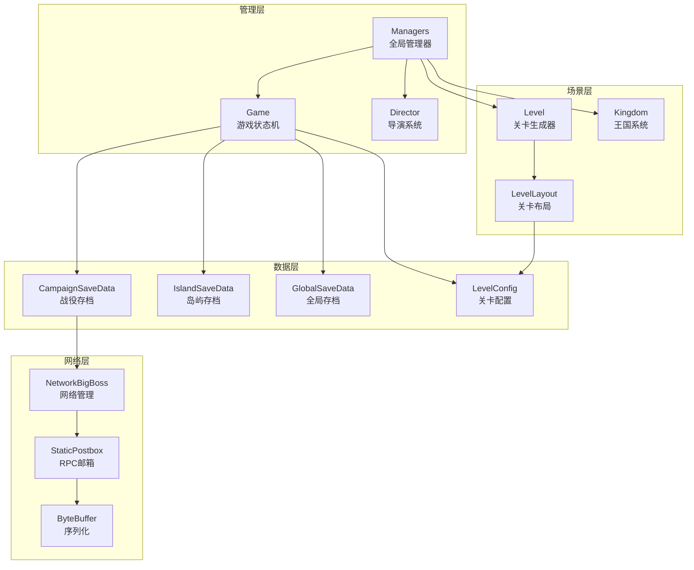
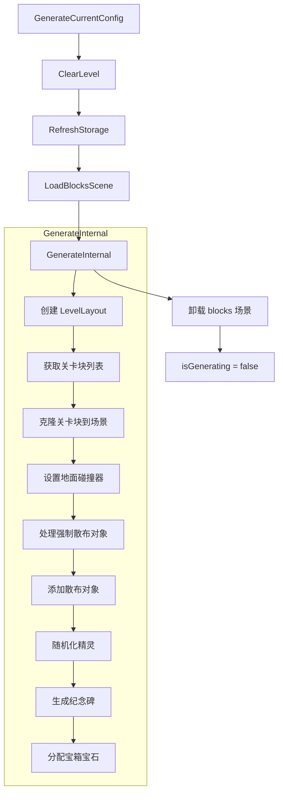

# Module_Chapter - 客户端开发文档

**模块名称**: Chapter（章节/岛屿系统）
**文档版本**: 2.0
**创建日期**: 2026-04-11

---

## 一、核心组件架构

### 1.1 组件依赖关系



---

## 二、Game 状态机组件

### 2.1 Game 类结构

**源码路径**: `Manager/Game.cs`

**继承关系**:
```
Game : Manager, Persistent.IBehaviour
```

### 2.2 状态枚举 (State)

```csharp
public enum State
{
    Loading,              // 加载中
    Intro,                // 开场动画
    Playing,              // 游戏中
    Paused,               // 暂停
    GreedDefeat,          // 贪婪失败
    Sailing,              // 航行中
    Victory,              // 胜利
    NetworkClientPlaying, // 网络客户端游玩
    ChapterComplete       // 章节完成
}
```

### 2.3 核心属性

| 属性名 | 类型 | 说明 |
|--------|------|------|
| currentLand | Land | 当前岛屿 |
| currentLevelConfig | LevelConfig | 当前关卡配置 |
| paused | bool | 游戏暂停状态 |
| highQuality | bool | 高画质模式 |
| playerStartX | float? | 玩家起始X坐标 |
| interfaceOverlay | InterfaceOverlay | 界面覆盖层 |
| touchHints | TouchHints | 触摸提示 |

### 2.4 静态事件

```csharp
public static Action OnGameStart;      // 游戏开始
public static Action OnGameEnd;        // 游戏结束
public static Action OnLose;           // 游戏失败
public static Action OnWin;            // 游戏胜利
public static Action OnSailAway;       // 乘船离开
public static Action OnNewGame;        // 新游戏
```

### 2.5 核心协程 - Run

**功能**: 游戏主循环状态机

```csharp
[UsesGoto, EnableLogging(50, 500)]
private IEnumerator<Routine.Yield> _Run(
    RunSignal signal, 
    RunSignalArgs signalArgs, 
    RunFlag flag, 
    RunFlagArgs flagArgs, 
    Routine.Return<Result> result)
{
    // 初始化
    yield return 0xef;
    
    NetworkBigBoss.Instance.EnterUnjoinableSegment();
    InactiveInputDetector.Inst.Suppress();
    
    // 客户端模式监听启动
    if (listenForBoot = !NetworkBigBoss.HasWorldAuth)
    {
        StartRemoteGame();
        HideCurtainModal();
        yield return Routine.Goto<State>(State.NetworkClientPlaying);
    }
    
    // 新游戏初始化
    if (island.isNew || !playerStartX.HasValue)
    {
        _introSequence.RunIntro();
        SingletonMonoBehaviour<Managers>.Inst.tutorial.StartTutorial();
        yield return Routine.Goto<State>(State.Intro);
    }
    
    // 游戏主循环...
}
```

---

## 三、Level 关卡生成组件

### 3.1 Level 类结构

**源码路径**: `BuildingWorld/Level.cs`

**继承关系**:
```
Level : MonoBehaviour
```

### 3.2 核心属性

| 属性名 | 类型 | 说明 |
|--------|------|------|
| ground | GameObject | 地面对象 |
| scatterableObjects | List\<ScatteredObject\> | 可散布对象 |
| levelMonumentObjects | ScatteredObject[] | 岛屿纪念碑对象 |
| levelWidth | int | 关卡宽度 |
| isGenerating | bool | 是否正在生成 |
| cachedCurrentLevelSeed | int | 当前关卡种子 |
| cachedCurrentLayoutRandom | Random | 当前布局随机数 |

### 3.3 关卡生成流程



### 3.4 核心方法详解

#### GenerateCurrentConfig - 生成当前配置

```csharp
public void GenerateCurrentConfig()
{
    isGenerating = true;
    this.ClearLevel();
    NetworkPostbox.Instance.RefreshStorage();
    
    LevelConfig currentLevelConfig = SingletonMonoBehaviour<Managers>.Inst.game.currentLevelConfig;
    if (currentLevelConfig == null)
    {
        throw new Exception("Current level config is null");
    }
    
    base.StartCoroutine(this.LoadBlocksAndGenerate(currentLevelConfig, -1));
}
```

#### ClearLevel - 清理关卡

```csharp
public void ClearLevel()
{
    this.ValidateLayers();
    List<GameObject> list = new List<GameObject>();
    
    // 清理所有内容层
    foreach (GameObject obj2 in this._contentLayers.Values)
    {
        // 遍历并收集所有子对象
        foreach (Transform current in obj2.transform)
        {
            list.Add(current.gameObject);
        }
    }
    
    // 销毁所有收集的对象
    for (int i = 0; i < list.Count; i++)
    {
        if (list[i] != null)
        {
            if (Application.isPlaying)
            {
                Pool.DespawnOrDestroyImmediate(list[i]);
            }
            else
            {
                DestroyImmediate(list[i]);
            }
        }
    }
    
    // 清理音频池和对象池
    if (Application.isPlaying)
    {
        AudioPool.Clean();
        SingletonMonoBehaviour<Managers>.Inst.pools.ResetPools();
        SingletonMonoBehaviour<Managers>.Inst.kingdom.ResetLists();
    }
}
```

#### AddScatteredObjects - 添加散布对象

```csharp
private void AddScatteredObjects(Tile[] tiles)
{
    foreach (BiomeObjectType type in BiomeObjectTypes.Inst.objectTypes)
    {
        // 获取生物群落数据
        BiomeObjectData dataForName = BiomeData.Current.GetDataForName(type.name);
        
        // 应用关卡覆盖
        Game game = SingletonMonoBehaviour<Managers>.Inst.game;
        if (game.currentLevelConfig?.levelBiomeOverrides != null)
        {
            BiomeObjectData data2 = game.currentLevelConfig.levelBiomeOverrides.GetDataForName(type.name);
            if (data2 != null) dataForName = data2;
        }
        
        // 获取连续区域
        List<RegionRect> contiguousRegions = GetContiguousRegions(tiles, 
            tile => (bool)toggle.GetValue(tile));
        
        // 散布对象
        for (int i = 0; i < contiguousRegions.Count; i++)
        {
            BiomeObjectData data3 = dataForName;
            if (contiguousRegions[i].biomeOverride != null)
            {
                BiomeObjectData data4 = contiguousRegions[i].biomeOverride.GetDataForName(type.name);
                if (data4 != null) data3 = data4;
            }
            
            if (data3?.objectOverrides != null && data3.objectOverrides.Length > 0)
            {
                this.ScatterObjects(data3.objectOverrides, contiguousRegions[i].rect, false);
            }
        }
    }
    
    this.ApplyParallaxCorrection();
}
```

---

## 四、CampaignSaveData 战役数据组件

### 4.1 类结构

**源码路径**: `Common/CampaignSaveData.cs`

### 4.2 核心方法

#### ApplyToScene - 应用存档到场景

```csharp
public void ApplyToScene()
{
    IslandSaveData loaded = IslandSaveData.loaded;
    Kingdom kingdom = SingletonMonoBehaviour<Managers>.Inst.kingdom;
    Player playerOne = kingdom.playerOne;
    Player playerTwo = kingdom.playerTwo;
    
    bool isNew = IslandSaveData.loaded.isNew;
    bool sailingIn = this.carryForward.present;
    
    // 判断是否为失败后的新统治
    newReignForIslandPostLoss = (loaded.lastPlayedReign != this.reign) && 
                                 (loaded.lastPlayedReign != -1);
    
    // 应用各模块
    this.ApplyAppearance(playerOne, playerTwo, ...);
    this.ApplyRampupDays(sailingIn, newReignForIslandPostLoss, ...);
    this.ApplyBoat(lighthouse, ref boat, ...);
    this.ApplyStartPosition(kingdom, playerOne, playerTwo, ...);
    this.ApplyInventory(kingdom, playerOne, playerTwo, ...);
    this.ApplyCompanions(newReignForIslandPostLoss, sailingIn, ...);
    this.ApplyAuxiliaryEffects(kingdom, isNew, ...);
    
    if (sailingIn)
    {
        this.ApplyCarryForward();
    }
    
    IslandSaveData.loaded.lastPlayedReign = this.reign;
}
```

#### UnlockNextLand - 解锁下一岛屿

```csharp
public Land? UnlockNextLand()
{
    Land furthestUnlockedLand = this.furthestUnlockedLand;
    
    if (SingletonMonoBehaviour<Managers>.Inst.game.result == Game.Result.SailedAway)
    {
        this.furthestUnlockedLand = (Land) Mathf.Min(
            ((int) SingletonMonoBehaviour<Managers>.Inst.game.currentLand) + 1, 4);
    }
    
    this.furthestUnlockedLand = (Land) Mathf.Max(
        (int) this.furthestUnlockedLand, (int) furthestUnlockedLand);
    
    // 更新游戏进度统计
    float num = 0f;
    float num2 = ((float) this.furthestUnlockedLand) / 4f;
    SingletonMonoBehaviour<Managers>.Inst.stats.SetStat(
        Stat.GameProgress, (num + num2) / 2f, false);
    
    if (furthestUnlockedLand != this.furthestUnlockedLand)
    {
        return new Land?(this.currentLand = this.furthestUnlockedLand);
    }
    return null;
}
```

#### PopulateCarryForward - 填充携带数据

```csharp
public void PopulateCarryForward()
{
    Kingdom kingdom = SingletonMonoBehaviour<Managers>.Inst.kingdom;
    
    CarryForward forward = new CarryForward {
        present = true,
        coins1 = kingdom.playerOne.coins,
        coins2 = kingdom.playerTwo.coins,
        gems1 = kingdom.playerOne.gems,
        gems2 = kingdom.playerTwo.gems,
        numArchers = kingdom.boat.numArchers,
        numWorkers = kingdom.boat.numWorkers,
        knightCoinCounts = kingdom.boat.knightCoinCounts,
        squireCoinCounts = kingdom.boat.squireCoinCounts
    };
    
    this.carryForward = forward;
}
```

---

## 五、LevelConfig 关卡配置组件

### 5.1 配置加载

```csharp
// 获取当前关卡配置
LevelConfig config = SingletonMonoBehaviour<Managers>.Inst.game.currentLevelConfig;

// 关键属性访问
float seasonDays = config.seasonChangeDays;     // 季节变化天数
int startCoins = config.startingCoins;           // 初始金币
int startGems = config.startingGems;             // 初始宝石
int width = config.minLevelWidth;                // 最小宽度
int gems = config.gemCount;                      // 宝石数量
```

### 5.2 动态覆盖

```csharp
// 应用生物群落覆盖
if (game.currentLevelConfig?.levelBiomeOverrides != null)
{
    BiomeObjectData overrideData = game.currentLevelConfig.levelBiomeOverrides
        .GetDataForName(objectType.name);
    if (overrideData != null)
    {
        // 使用覆盖数据
    }
}
```

---

## 六、网络同步组件

### 6.1 NetworkBigBoss 网络管理

**源码路径**: `Network/NetworkBigBoss.cs`

**核心属性**:
| 属性名 | 类型 | 说明 |
|--------|------|------|
| HasWorldAuth | bool | 是否有世界权限（主机） |
| IsClientPresent | bool | 是否有客户端连接 |
| Instance | NetworkBigBoss | 单例实例 |
| clientCampaignStub | CampaignSaveData | 客户端战役存根 |

### 6.2 关卡种子同步

```csharp
// 主机生成关卡后通知客户端
if (NetworkBigBoss.HasWorldAuth && NetworkBigBoss.IsClientPresent)
{
    Debug.LogWarningFormat("Notfying connected client of new generation...");
    NetworkBigBoss.Instance.SendNewWorldSeed();
}

// 客户端接收种子生成关卡
public IEnumerator GenerateReceivedLandAndYield(int seed)
{
    Level.isGenerating = true;
    SingletonMonoBehaviour<Managers>.Inst.pools.ResetPools();
    this.ClearLevel();
    NetworkPostbox.Instance.RefreshStorage();
    
    LevelConfig config = SingletonMonoBehaviour<Managers>.Inst.game.currentLevelConfig;
    yield return this.StartCoroutine(this.LoadBlocksAndGenerate(config, seed));
}
```

---

## 七、UI 界面集成

### 7.1 界面覆盖层

**InterfaceOverlay** - 界面覆盖层管理

```csharp
InterfaceOverlay overlay = SingletonMonoBehaviour<Managers>.Inst.game.interfaceOverlay;
```

### 7.2 触摸提示

**TouchHints** - 触摸提示系统

```csharp
TouchHints hints = SingletonMonoBehaviour<Managers>.Inst.game.touchHints;
```

### 7.3 分屏界面

**DividerInterface** - 分屏界面管理（合作模式）

---

## 八、访问模式汇总

### 8.1 获取当前岛屿

```csharp
// 方式1: 通过 Game
Land currentLand = SingletonMonoBehaviour<Managers>.Inst.game.currentLand;

// 方式2: 通过 CampaignSaveData
Land currentLand = CampaignSaveData.current.currentLand;
```

### 8.2 获取关卡配置

```csharp
LevelConfig config = SingletonMonoBehaviour<Managers>.Inst.game.currentLevelConfig;
```

### 8.3 获取岛屿进度

```csharp
CampaignSaveData campaign = CampaignSaveData.current;

// 最远解锁岛屿
Land furthest = campaign.furthestUnlockedLand;

// 已安全岛屿数量
int count = campaign.unlockedIslandCount;

// 检查特定岛屿是否安全
bool isSecure = campaign.securedIslands[(int)Land.Three];
```

### 8.4 获取关卡生成器

```csharp
Level level = FindObjectOfType<Level>();

// 检查是否正在生成
bool generating = Level.isGenerating;

// 获取当前种子
int seed = level.cachedCurrentLevelSeed;
```

---

## 九、调试工具

### 9.1 编辑器扩展

```csharp
[Conditional("UNITY_EDITOR"), Conditional("DEVELOPMENT_BUILD")]
private void ValidateNotClientDummy()
{
    if (this.isClientDummy)
    {
        throw new Exception("Tried to use client dummy campaign save data!");
    }
}
```

### 9.2 日志输出

```csharp
// 关卡生成日志
Debug.LogWarningFormat("Generating with seed {0}", this.cachedCurrentLevelSeed);

// 岛屿切换日志
Debug.LogFormat("CampaignSaveData.ApplyToScene:\nnewIsland: {0}\tsailingIn: {1}\tnewReignForIslandPostLoss: {2}", 
    isNew, present, newReignForIslandPostLoss);
```

### 9.3 调试方法

```csharp
// 解锁所有岛屿（调试用）
public void DebugUnlockAllLands()
{
    this.furthestUnlockedLand = Land.Five;
}
```

---

## 十、性能优化建议

### 10.1 关卡生成优化

```csharp
// 1. 使用对象池
Pool.SpawnOrInstantiate<T>(prefab, position, rotation, parent);
Pool.DespawnOrDestroyImmediate(gameObject);

// 2. 异步加载场景
StartCoroutine(LoadBlocksAndGenerate(config, seed));

// 3. 批量操作
List<RegionRect> regions = GetContiguousRegions(tiles, condition);
```

### 10.2 内存优化

```csharp
// 1. 及时清理
ClearLevel();  // 清理关卡时释放内存

// 2. 使用静态标记
private static bool _isGenerating;  // 静态变量节省内存

// 3. 缓存引用
private Dictionary<string, GameObject> _contentLayers;  // 缓存内容层
```

### 10.3 网络优化

```csharp
// 1. 只在必要时同步
if (NetworkBigBoss.HasWorldAuth && NetworkBigBoss.IsClientPresent)
{
    // 发送同步数据
}

// 2. 使用紧凑序列化
ByteBuffer.PrepWriteBuffer();
ByteBuffer.Write(value);  // 紧凑的二进制格式

// 3. 减少同步频率
// 只在关键状态变化时同步
```

---

*文档版本: 2.0 | 更新时间: 2026-04-11*