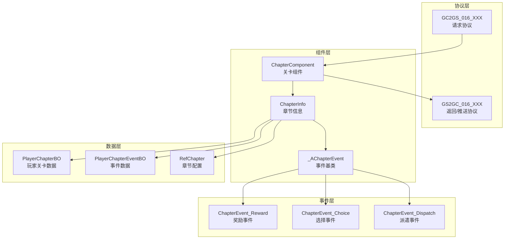
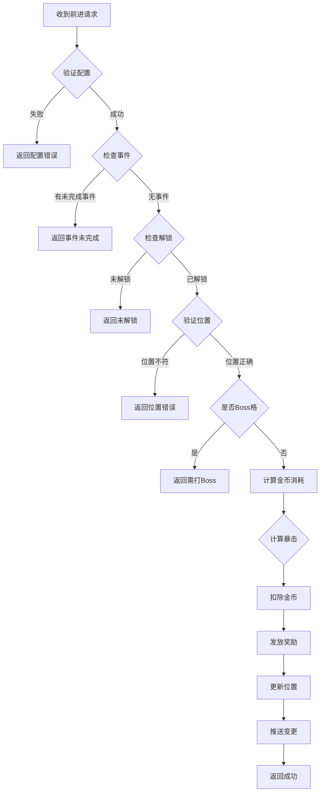
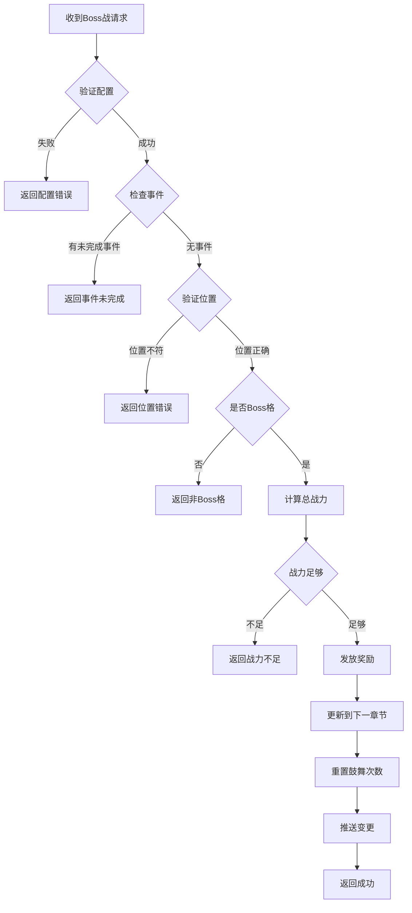

# Module_Chapter - 服务端开发文档

**模块名称**: Chapter（章节关卡系统）
**文档版本**: 3.0
**创建日期**: 2026-04-11

---

## 一、服务端架构概述

### 1.1 模块架构



### 1.2 核心类关系

| 类名 | 职责 | 源码路径 |
|------|------|----------|
| ChapterComponent | 关卡组件管理器 | UserComp/ChapterComp/ChapterComponent.java |
| ChapterInfo | 单个章节信息管理 | UserComp/ChapterComp/ChapterInfo.java |
| _AChapterEvent | 事件处理基类 | UserComp/ChapterComp/Event/_AChapterEvent.java |
| PlayerChapterBO | 玩家关卡数据库对象 | USDB/Bo/PlayerChapterBO.java |

---

## 二、ChapterInfo 核心类

### 2.1 类结构

**源码路径**: `game_server/UserServer/src/NPUSServer/NPUSUserMgr/UserComp/ChapterComp/ChapterInfo.java`

### 2.2 核心属性

| 属性名 | 类型 | 说明 |
|--------|------|------|
| _m_comp | ChapterComponent | 关卡组件引用 |
| _m_bo | PlayerChapterBO | 数据库对象 |
| _m_ref | RefChapter | 章节配置引用 |
| _m_eventInfo | _AChapterEvent | 当前事件信息 |

### 2.3 核心方法

| 方法名 | 返回类型 | 说明 |
|--------|----------|------|
| getChapterId() | long | 获取章节ID |
| getPoint() | int | 获取当前点位 |
| getRef() | RefChapter | 获取配置引用 |
| getEventInfo() | _AChapterEvent | 获取事件信息 |
| getChapterProgress() | long | 获取关卡进度（ID*1000+点位） |

---

## 三、关卡前进处理

### 3.1 前进方法 (forward)

```java
public ResultOne<ForwardResult> forward(long _chapterId, int _targetPoint, NPPlayerContext _context)
{
    // 1. 获取关卡配置
    RefChapter ref = getRef();
    if (ref == null)
        return ResultOne.failed(CommErr.REF_NOT_FOUND);

    // 2. 判断是否有未完成事件
    if (_m_eventInfo != null)
        return ResultOne.failed(ChapterErr.CHAPTER_EVENT_NOT_DONE);

    // 3. 判断关卡是否解锁
    if (!NPPlayerConditionDealerMgr.IsEnable(
        RefGeneral.Ref().unlock_chapter_simple_unlock_id,
        _m_comp.getUserData(), null))
        return ResultOne.failed(ChapterErr.CHAPTER_NOT_UNLOCK);

    // 4. 获取并校验目标位置
    int curPoint = _m_bo.getPoint();
    int targetPoint = curPoint + 1;

    if (_chapterId != _m_bo.getChapterId() || targetPoint != _targetPoint)
        return ResultOne.failed(ChapterErr.CHAPTER_POINT_NOT_FIT);

    // 5. Boss格需要走特殊逻辑
    if (targetPoint == ref.point_count)
        return ResultOne.failed(ChapterErr.CHAPTER_BOSS_NOT_DEFEAT);

    // 6. 计算金币消耗
    ResultOne<Long> goldCostResult = calGoldCost(ref, targetPoint);
    if (!goldCostResult.isSucc())
        return ResultOne.failed(goldCostResult.getResult());
    long goldCost = goldCostResult.getData();

    // 7. 计算是否暴击
    int coefficient = 10000;
    boolean isCrit = false;
    if (CommonFunc.randomInt(10000) < ref.crit_probability)
    {
        isCrit = true;
        coefficient = RefGeneral.Ref().critical_hit_coefficient;
    }

    // 8. 计算奖励
    ResultOne<Long> rewardExpResult = ref.calRewardExp(targetPoint);
    if (!rewardExpResult.isSucc())
        return ResultOne.failed(rewardExpResult.getResult());
    long rewardExp = rewardExpResult.getData() * coefficient / 10000;

    // 9. 扣除金币
    if (!_m_comp.getUserData().spendItem(
        ENPItemType.CURRENCY, ECurrency.SILVER.ordinal(), goldCost, _context))
        return ResultOne.failed(CommErr.ITEM_NOT_ENOUGH);

    // 10. 发放奖励
    _m_comp.getUserData().gainItem(
        ENPItemType.CURRENCY, ECurrency.HERO_EXP.ordinal(), rewardExp, _context);
    _m_comp.getUserData().gainItem(
        ENPItemType.CURRENCY, ECurrency.P_EXP.ordinal(), ref.reward_player_exp, _context);

    // 11. 更新当前位置
    _m_bo.savePoint(_m_comp.getUSServer().getBM(), targetPoint);

    // 12. 推送变更
    _m_comp.getUserData().sendMsgToGC(
        US2GCWriter_016_ChapterOp.make_051_OnChapterPosChg(getPosInfo()));

    return ResultOne.succ(new ForwardResult(coefficient, rewardExp, ref.reward_player_exp, goldCost));
}
```

### 3.2 金币消耗计算

```java
/**
 * 计算金币消耗
 * 公式: 关卡金币消耗基础值*(1+递增比例)*（1 - 金币消耗减免比例）
 * 金币消耗减免比例 =（玩家战力-关卡战力）/关卡战力 * 金币消耗放大倍数
 */
public ResultOne<Long> calGoldCost(RefChapter _ref, int _point)
{
    // 计算基础金币消耗
    ResultOne<Double> goldCostResult = _ref.calNeedCost(_point);
    if (!goldCostResult.isSucc())
        return ResultOne.failed(goldCostResult.getResult());
    double baseGoldCost = goldCostResult.getData();

    // 计算战力比例（万分比）
    ResultOne<Long> powerRateResult = getPowerRate(_ref, _point);
    if (!powerRateResult.isSucc())
        return powerRateResult;
    long powerRate = powerRateResult.getData();

    // 金币消耗放大倍数（万分比）
    int costMultipleRate = RefChapterCost.getMgr().getCostMultipleRate((int) powerRate);

    // 计算最终金币消耗
    long finalCost = (long) Math.ceil(
        baseGoldCost * (1 - costMultipleRate / 10000d * powerRate / 10000d));

    return ResultOne.succ(finalCost);
}
```

---

## 四、Boss战处理

### 4.1 Boss战方法 (challengeBoss)

```java
public ResultOne<List<NPCommon_ItemInfo>> challengeBoss(long _chapterId, NPPlayerContext _context)
{
    // 1. 获取关卡配置
    RefChapter ref = getRef();
    if (ref == null)
        return ResultOne.failed(CommErr.REF_NOT_FOUND);

    // 2. 判断是否有未完成事件
    if (_m_eventInfo != null)
        return ResultOne.failed(ChapterErr.CHAPTER_EVENT_NOT_DONE);

    // 3. 校验章节和位置
    int curPoint = _m_bo.getPoint();
    int targetPoint = curPoint + 1;

    if (_chapterId != _m_bo.getChapterId())
        return ResultOne.failed(ChapterErr.CHAPTER_POINT_NOT_FIT);

    if (curPoint >= ref.point_count)
        return ResultOne.failed(ChapterErr.CHAPTER_BOSS_HAD_DEFEAT);

    if (targetPoint != ref.point_count)
        return ResultOne.failed(ChapterErr.CHAPTER_NOT_ATTACK_BOSS);

    // 4. 计算战力
    long bossPower = ref.boss_power;
    long basePower = _m_comp.getUserData().getHeroComponent().getTotalPower();

    // 计算鼓舞加成
    int totalIncreasePer = 0;
    totalIncreasePer += RefGeneral.Ref().gold_inspire_increase_power_ratio_per
        * _m_bo.getGoldInspireTimes();
    totalIncreasePer += RefGeneral.Ref().item_inspire_increase_power_ratio_per
        * _m_bo.getItemInspireTimes();
    totalIncreasePer += RefGeneral.Ref().crystal_inspire_increase_power_ratio_per
        * _m_bo.getCrystalInspireTimes();

    long totalPower = basePower * (10000 + totalIncreasePer) / 10000;

    // 5. 检查战力是否足够
    if (totalPower < bossPower)
        return ResultOne.failed(ChapterErr.CHAPTER_ATTACK_BOSS_POWER_NOT_ENOUGH);

    // 6. 发放奖励
    List<NPCommonCostItem> itemList = new ArrayList<>();
    List<NPCommonCostItem> consortList = new ArrayList<>();
    for (NPCommonCostItem item : ref.reward_list)
    {
        if (item.getItemType() == ENPItemType.CONSORT)
            consortList.add(item);
        else
            itemList.add(item);
    }
    _m_comp.getUserData().gainItemList(itemList, _context);

    // 7. 更新到下一章节
    long nextChapterId = _m_bo.getChapterId() + 1;
    _m_ref = RefChapter.getMgr().get(nextChapterId);

    BM bmObj = _m_comp.getUSServer().getBM();
    _m_bo.setPoint(bmObj, 0);
    _m_bo.setChapterId(bmObj, nextChapterId);
    _m_bo.setGoldInspireTimes(bmObj, 0);
    _m_bo.setCrystalInspireTimes(bmObj, 0);
    _m_bo.setItemInspireTimes(bmObj, 0);
    _m_bo.saveAllMarked(bmObj);

    // 8. 推送变更
    _m_comp.getUserData().sendMsgToGC(
        US2GCWriter_016_ChapterOp.make_051_OnChapterPosChg(getPosInfo()));
    _m_comp.getUserData().sendMsgToGC(
        US2GCWriter_016_ChapterOp.make_052_OnChapterInspireChg(getInspireInfo()));

    // 9. 构造返回奖励列表
    List<NPCommon_ItemInfo> rewardList = new ArrayList<>();
    _context.getCollector().fillProtoList(rewardList);

    return ResultOne.succ(rewardList);
}
```

---

## 五、鼓舞系统

### 5.1 鼓舞入口

```java
public Result inspire(EChapterInspireType _type, NPPlayerContext _context)
{
    switch (_type)
    {
        case GOLD:
            return inspireGold(_context);
        case ITEM:
            return inspireItem(_context);
        case CRYSTAL:
            return inspireCrystal(_context);
    }
    return CommErr.PARAM_ERROR;
}
```

### 5.2 金币鼓舞

```java
public Result inspireGold(NPPlayerContext _context)
{
    RefChapter ref = getRef();
    if (ref == null)
        return CommErr.REF_NOT_FOUND;

    int targetPoint = _m_bo.getPoint() + 1;

    // 检查是否是Boss格
    if (targetPoint != ref.point_count)
        return ChapterErr.CHAPTER_NOT_ATTACK_BOSS;

    int times = _m_bo.getGoldInspireTimes();
    long cost = calGoldInspireCost(ref, times + 1);

    // 扣除金币
    if (!_m_comp.getUserData().spendItem(
        ENPItemType.CURRENCY, ECurrency.SILVER.ordinal(), cost, _context))
        return CommErr.ITEM_NOT_ENOUGH;

    // 增加鼓舞次数
    _m_bo.saveGoldInspireTimes(_m_comp.getUSServer().getBM(), times + 1);

    // 推送变更
    _m_comp.getUserData().sendMsgToGC(
        US2GCWriter_016_ChapterOp.make_052_OnChapterInspireChg(getInspireInfo()));

    return Result.SUCC;
}
```

### 5.3 金币鼓舞消耗计算

```java
private long calGoldInspireCost(RefChapter _ref, int _times)
{
    long costNum = 0;
    costNum += _ref.gold_inspire_base_value;

    RefTimePrice refTimePrice = RefTimePrice.getMgr().getPrice(
        RefGeneral.Ref().gold_inspire_calculate_ratio_time_price_id, _times);

    if (refTimePrice != null)
    {
        NPVarInfo varInfo = new NPVarInfo();
        varInfo.addObj(ENPPlayerVariableVarType.BUY_TIMES.ordinal(),
            _m_bo.getGoldInspireTimes() + 1);
        costNum *= NPPlayerVariableDeal.getInstance().CalculateVariableResult(
            _m_comp.getUserData(), refTimePrice.cost_item_formula, varInfo);
    }
    return costNum;
}
```

---

## 六、事件系统

### 6.1 事件类型

| 事件类型 | 类名 | 说明 |
|----------|------|------|
| REWARD | ChapterEvent_Reward | 奖励事件 |
| CHOICE | ChapterEvent_Choice | 选择事件 |
| DISPATCH | ChapterEvent_Dispatch | 派遣事件 |

### 6.2 事件触发

```java
public RefChapterEvent tryTriggerEvent(NPPlayerContext context)
{
    RefChapter ref = getRef();
    if (ref == null)
    {
        USLog.error(_m_comp.getUSServer(),
            "ChapterInfo.tryTriggerEvent: can not find ref, chapterId:{}",
            _m_bo.getChapterId());
        return null;
    }

    // 查询当前位置是否有事件
    for (WCGPairLong eventPair : ref.point_event.getList())
    {
        if (eventPair.first() == _m_bo.getPoint())
        {
            RefChapterEvent refEvent = RefChapterEvent.getMgr().get(eventPair.second());
            if (refEvent == null)
            {
                USLog.error(_m_comp.getUSServer(),
                    "ChapterInfo.tryTriggerEvent: can not find ref, eventId:{}",
                    eventPair.second());
                return null;
            }
            return refEvent;
        }
    }

    return null;
}
```

### 6.3 创建事件

```java
public void createEvent(RefChapterEvent _refEvent)
{
    PlayerChapterEventBO bo = new PlayerChapterEventBO();
    bo.setCid(_m_comp.getUSServer().getBM(), _m_bo.getCid());
    bo.setEventId(_m_comp.getUSServer().getBM(), _refEvent.Id());
    bo.insert(_m_comp.getUSServer().getBM());

    // 创建事件对象
    _m_eventInfo = _createChapterEventObj(bo);
    if (_m_eventInfo != null)
    {
        _m_comp.getUserData().sendMsgToGC(
            US2GCWriter_016_ChapterOp.make_053_OnChapterEventChg(
                _m_eventInfo.makeInfo()));
    }
}
```

### 6.4 销毁事件

```java
public void disposeEvent(_AChapterEvent _event, NPPlayerContext _context)
{
    if (_event == null)
        return;

    _m_eventInfo = null;
    _event.dispose();

    _m_comp.getUserData().sendMsgToGC(
        US2GCWriter_016_ChapterOp.make_053_OnChapterEventChg(
            new Chapter_EventInfo()));
}
```

---

## 七、数据推送

### 7.1 推送位置变更

```java
public Chapter_PosInfo getPosInfo()
{
    return new Chapter_PosInfo(_m_bo.getChapterId(), _m_bo.getPoint());
}

// 推送
_m_comp.getUserData().sendMsgToGC(
    US2GCWriter_016_ChapterOp.make_051_OnChapterPosChg(getPosInfo()));
```

### 7.2 推送鼓舞变更

```java
public Chapter_InspireInfo getInspireInfo()
{
    Chapter_InspireInfo inspireInfo = new Chapter_InspireInfo();
    inspireInfo.addInspireList(new Chapter_SingleInspireInfo(
        EChapterInspireType.GOLD, _m_bo.getGoldInspireTimes()));
    inspireInfo.addInspireList(new Chapter_SingleInspireInfo(
        EChapterInspireType.ITEM, _m_bo.getItemInspireTimes()));
    inspireInfo.addInspireList(new Chapter_SingleInspireInfo(
        EChapterInspireType.CRYSTAL, _m_bo.getCrystalInspireTimes()));
    return inspireInfo;
}

// 推送
_m_comp.getUserData().sendMsgToGC(
    US2GCWriter_016_ChapterOp.make_052_OnChapterInspireChg(getInspireInfo()));
```

---

## 八、GM命令

### 8.1 GM修改位置

```java
public Result gmChgPos(long _chapterId, int _point)
{
    RefChapter refChapter = RefChapter.getMgr().get(_chapterId);
    if (refChapter == null)
        return CommErr.REF_NOT_FOUND;

    // 判断点位是否合法
    if (_point < 0 || _point > refChapter.point_count)
        return CommErr.PARAM_ERROR;

    _m_ref = refChapter;
    BM bmObj = _m_comp.getUSServer().getBM();
    _m_bo.setPoint(bmObj, _point);
    _m_bo.setChapterId(bmObj, _chapterId);
    _m_bo.setGoldInspireTimes(bmObj, 0);
    _m_bo.setCrystalInspireTimes(bmObj, 0);
    _m_bo.setItemInspireTimes(bmObj, 0);
    _m_bo.saveAllMarked(bmObj);

    // 推送GM变更
    _m_comp.getUserData().sendMsgToGC(
        US2GCWriter_016_ChapterOp.make_054_OnChapterGmPosChg(getPosInfo()));
    _m_comp.getUserData().sendMsgToGC(
        US2GCWriter_016_ChapterOp.make_052_OnChapterInspireChg(getInspireInfo()));

    return Result.SUCC;
}
```

### 8.2 GM到达Boss点

```java
public Result gmToBossPoint()
{
    RefChapter ref = getRef();
    if (ref == null)
        return CommErr.REF_NOT_FOUND;

    int bossPoint = ref.point_count - 1;
    return gmChgPos(_m_bo.getChapterId(), bossPoint);
}
```

---

## 九、日志记录

### 9.1 前进日志

```java
LogChapterForwardBO logBo = new LogChapterForwardBO();
logBo.setCid(_m_comp.getUSServer().getBM(), _m_comp.getUserData().getCid());
logBo.setLevel(_m_comp.getUSServer().getBM(),
    (int) _m_comp.getUserData().getParam(ENPPlayerParam.LEVEL));
logBo.setChapterId(_m_comp.getUSServer().getBM(), _chapterId);
logBo.setPoint(_m_comp.getUSServer().getBM(), targetPoint);
logBo.setPower(_m_comp.getUSServer().getBM(),
    _m_comp.getUserData().getHeroComponent().getTotalPower());
logBo.setEarnings(_m_comp.getUSServer().getBM(),
    _m_comp.getUserData().getPlayerComponent().getEarnings());
logBo.setIsCriticalHit(_m_comp.getUSServer().getBM(), isCrit);
logBo.setGoldCost(_m_comp.getUSServer().getBM(), goldCost);
CommLogDB.log(_m_comp.getUSServer().getBM(), logBo, _context);
```

### 9.2 Boss战日志

```java
LogChapterFightBossBO logBo = new LogChapterFightBossBO();
logBo.setCid(_m_comp.getUSServer().getBM(), _m_comp.getUserData().getCid());
logBo.setLevel(_m_comp.getUSServer().getBM(),
    (int)_m_comp.getUserData().getParam(ENPPlayerParam.LEVEL));
logBo.setChapterId(_m_comp.getUSServer().getBM(), _chapterId);
logBo.setPower(_m_comp.getUSServer().getBM(), basePower);
logBo.setEarnings(_m_comp.getUSServer().getBM(),
    _m_comp.getUserData().getPlayerComponent().getEarnings());
logBo.setGoldInspireTimes(_m_comp.getUSServer().getBM(), _m_bo.getGoldInspireTimes());
logBo.setItemInspireTimes(_m_comp.getUSServer().getBM(), _m_bo.getItemInspireTimes());
logBo.setCrystalInspireTimes(_m_comp.getUSServer().getBM(), _m_bo.getCrystalInspireTimes());
logBo.setFinalPower(_m_comp.getUSServer().getBM(), totalPower);
CommLogDB.log(_m_comp.getUSServer().getBM(), logBo, _context);
```

---

## 十、服务端流程图

### 10.1 关卡前进流程



### 10.2 Boss战流程



---

*文档版本: 3.0 | 更新时间: 2026-04-11*