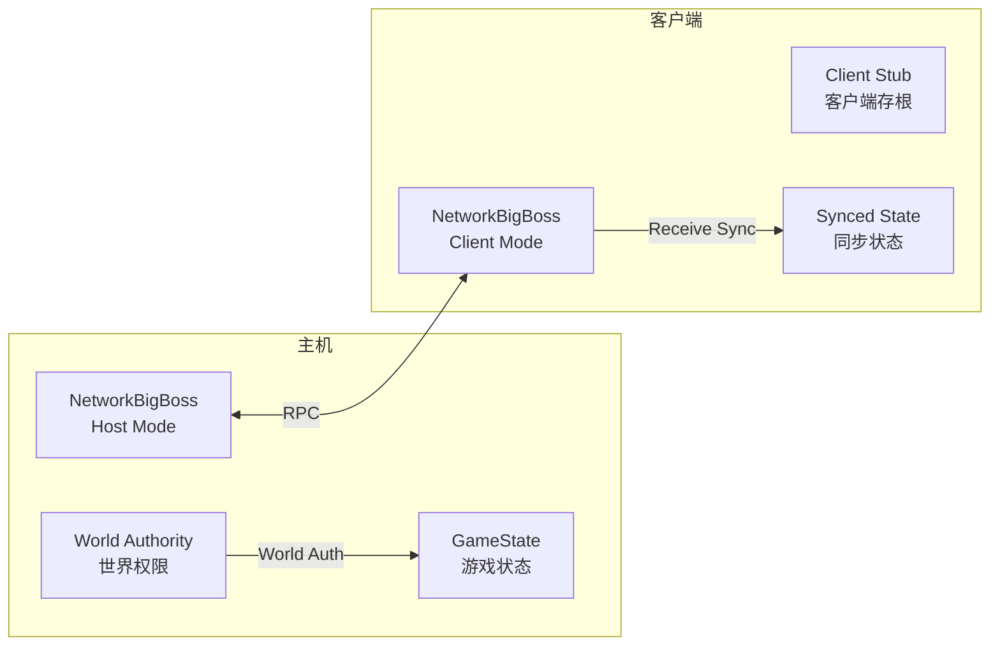
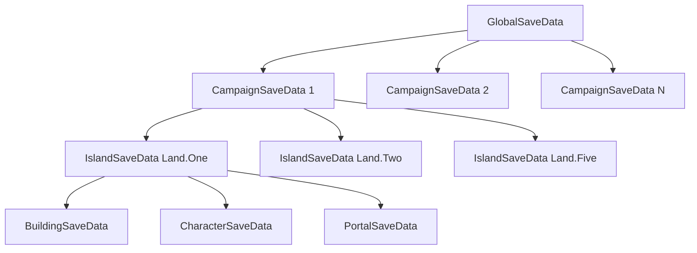
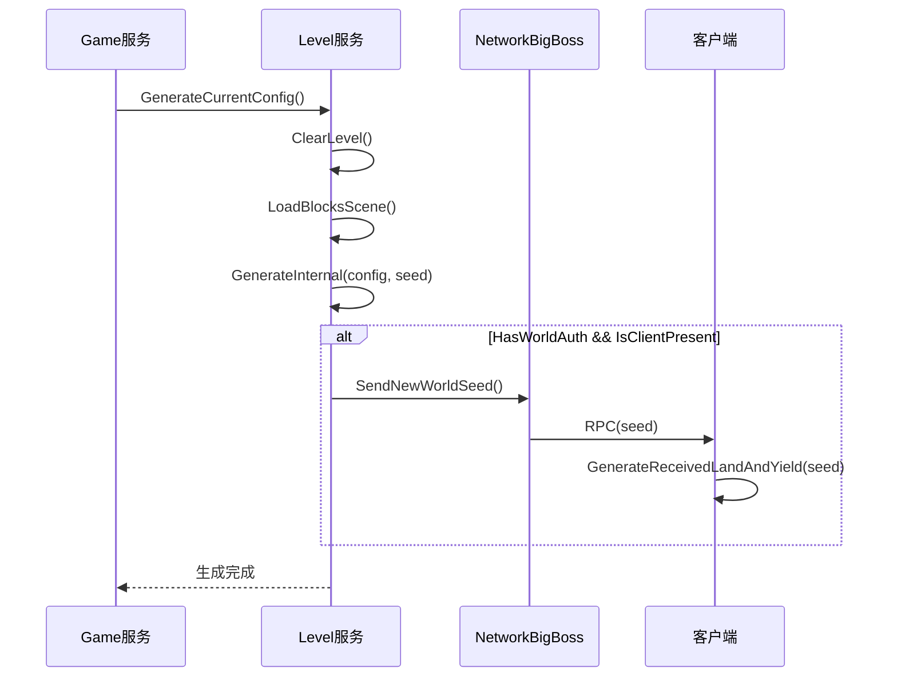
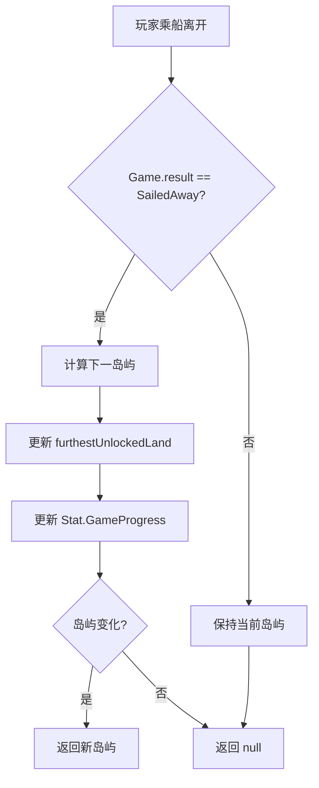

# Module_Chapter - 服务端开发文档

**模块名称**: Chapter（章节/岛屿系统）
**文档版本**: 2.0
**创建日期**: 2026-04-11

---

## 一、服务端架构概述

### 1.1 K2C 网络模型

Kingdom Two Crowns 采用 **P2P 合作模式**，其中一个玩家作为 **主机（Host）**，另一个作为 **客户端（Client）**。



### 1.2 权限模型

| 权限检查 | 主机 | 客户端 |
|----------|------|--------|
| HasWorldAuth | true | false |
| IsClientPresent | true（有客户端时） | false |
| IsServer | true | false |
| 可执行操作 | 世界状态修改 | 接收同步 |

---

## 二、核心服务组件

### 2.1 NetworkBigBoss - 网络管理服务

**源码路径**: `Network/NetworkBigBoss.cs`

**服务职责**:
- 管理网络连接状态
- 协调主机/客户端模式
- 处理 RPC 调用路由
- 管理世界权限

**核心属性**:

| 属性名 | 类型 | 说明 |
|--------|------|------|
| Instance | NetworkBigBoss | 单例实例 |
| HasWorldAuth | bool | 是否有世界权限 |
| IsClientPresent | bool | 是否有客户端连接 |
| clientCampaignStub | CampaignSaveData | 客户端战役存根 |

**权限检查模式**:

```csharp
// 检查是否有世界权限（主机）
if (NetworkBigBoss.HasWorldAuth)
{
    // 执行世界状态修改
    GenerateLevel();
    UpdateGameState();
}

// 检查是否有客户端连接
if (NetworkBigBoss.IsClientPresent)
{
    // 同步到客户端
    SendNewWorldSeed();
    CallApplyToSceneRPC();
}
```

### 2.2 StaticPostbox - RPC 邮箱服务

**源码路径**: `Network/StaticPostbox.cs`

**服务职责**:
- 管理 RPC 调用
- 路由消息到目标
- 处理远程调用

**RPC 调用模式**:

```csharp
// 准备写入缓冲区
ByteBuffer.PrepWriteBuffer();

// 写入参数
ByteBuffer.Write(param1);
ByteBuffer.Write(param2);

// 调用远程 RPC
StaticPostbox.CallStaticRPCRemotely(opcode);
```

### 2.3 NetworkPostbox - 网络对象管理

**服务职责**:
- 注册网络对象
- 管理对象生命周期
- 同步对象状态

```csharp
// 注册网络对象
NetworkPostbox.Instance.RegisterObject(uniqueGameObjects[i], CRPCType.SemiStatic);

// 刷新存储
NetworkPostbox.Instance.RefreshStorage();
```

---

## 三、存档服务

### 3.1 存档层级结构



### 3.2 GlobalSaveData - 全局存档

**源码路径**: `Common/GlobalSaveData.cs`

**数据结构**:

| 字段名 | 类型 | 说明 |
|--------|------|------|
| currentCampaign | int | 当前战役索引 |
| campaigns | CampaignSaveData[] | 战役数组 |
| settings | GameSettings | 游戏设置 |
| achievements | AchievementData | 成就数据 |

### 3.3 CampaignSaveData - 战役存档

**源码路径**: `Common/CampaignSaveData.cs`

**服务端管理方法**:

```csharp
// 获取当前战役
public static CampaignSaveData current
{
    get
    {
        // 优先返回客户端存根（如果存在）
        CampaignSaveData clientCampaignStub = NetworkBigBoss.Instance.clientCampaignStub;
        if (clientCampaignStub != null)
        {
            return clientCampaignStub;
        }
        // 否则返回全局存档中的当前战役
        return GlobalSaveData.loaded.campaigns[GlobalSaveData.loaded.currentCampaign];
    }
}
```

### 3.4 IslandSaveData - 岛屿存档

**数据结构**:

| 字段名 | 类型 | 说明 |
|--------|------|------|
| land | Land | 岛屿ID |
| isNew | bool | 是否新岛屿 |
| lastPlayedReign | int | 最后游玩统治次数 |
| buildings | List\<BuildingSaveData\> | 建筑数据 |
| characters | List\<CharacterSaveData\> | 角色数据 |
| portals | List\<PortalSaveData\> | 传送门数据 |

---

## 四、关卡生成服务

### 4.1 关卡生成流程



### 4.2 种子同步服务

**主机端**:
```csharp
public void SendNewWorldSeed()
{
    int seed = level.cachedCurrentLevelSeed;
    
    ByteBuffer.PrepWriteBuffer();
    ByteBuffer.Write(seed);
    
    StaticPostbox.CallStaticRPCRemotely(RPC_NEW_WORLD_SEED);
}
```

**客户端端**:
```csharp
[RPC]
public void OnReceiveWorldSeed(int seed)
{
    StartCoroutine(level.GenerateReceivedLandAndYield(seed));
}
```

---

## 五、状态同步服务

### 5.1 ApplyToScene 同步

**数据同步协议**:

| Opcode | 数据内容 | 触发时机 |
|--------|----------|----------|
| 0x3ed | ApplyToScene 数据 | 场景加载完成 |
| 0x3eb | 玩家位置 | 位置更新 |

**主机端同步**:
```csharp
private void CallApplyToSceneRPC(Hermit hermitHorse, Hermit hermitHorn, 
    Hermit hermitBallista, Hermit hermitBaker, Hermit hermitKnight, Dog dog)
{
    ByteBuffer.PrepWriteBuffer();
    
    // 写入船只状态
    ByteBuffer.Write(SingletonMonoBehaviour<Managers>.Inst.kingdom.boat != null);
    
    // 写入隐士数据
    this.WriteHermit(Hermit.HermitType.Horse, hermitHorse);
    this.WriteHermit(Hermit.HermitType.Horn, hermitHorn);
    this.WriteHermit(Hermit.HermitType.Ballista, hermitBallista);
    this.WriteHermit(Hermit.HermitType.Baker, hermitBaker);
    this.WriteHermit(Hermit.HermitType.Knight, hermitKnight);
    
    // 写入狗数据
    ByteBuffer.Write(dog != null);
    if (dog != null)
    {
        ByteBuffer.Write(dog.transform.position);
        ByteBuffer.Write(dog.color);
    }
    
    // 调用 RPC
    StaticPostbox.CallStaticRPCRemotely(0x3ed);
}
```

### 5.2 客户端存根管理

```csharp
// 客户端存根用于存储客户端的战役数据
public CampaignSaveData clientCampaignStub;

// 设置客户端存根
public void SetClientCampaignStub(CampaignSaveData stub)
{
    clientCampaignStub = stub;
}

// 清除客户端存根
public void ClearClientCampaignStub()
{
    clientCampaignStub = null;
}
```

---

## 六、岛屿解锁服务

### 6.1 解锁流程



### 6.2 解锁服务实现

```csharp
public Land? UnlockNextLand()
{
    Land furthestUnlockedLand = this.furthestUnlockedLand;
    
    // 检查是否乘船离开
    if (SingletonMonoBehaviour<Managers>.Inst.game.result == Game.Result.SailedAway)
    {
        // 解锁下一岛屿（最大 Five）
        this.furthestUnlockedLand = (Land) Mathf.Min(
            ((int) SingletonMonoBehaviour<Managers>.Inst.game.currentLand) + 1, 
            (int) Land.Five);
    }
    
    // 确保不减少
    this.furthestUnlockedLand = (Land) Mathf.Max(
        (int) this.furthestUnlockedLand, 
        (int) furthestUnlockedLand);
    
    // 更新游戏进度统计
    float progress = ((float) this.furthestUnlockedLand) / 4f;
    SingletonMonoBehaviour<Managers>.Inst.stats.SetStat(Stat.GameProgress, progress / 2f, false);
    
    // 返回新解锁的岛屿
    if (furthestUnlockedLand != this.furthestUnlockedLand)
    {
        this.currentLand = this.furthestUnlockedLand;
        return new Land?(this.currentLand);
    }
    
    return null;
}
```

---

## 七、携带数据服务

### 7.1 CarryForward 服务

**用途**: 岛屿间携带资源（金币、宝石、角色）

**填充携带数据**:
```csharp
public void PopulateCarryForward()
{
    Kingdom kingdom = SingletonMonoBehaviour<Managers>.Inst.kingdom;
    
    this.carryForward = new CarryForward {
        present = true,
        coins1 = kingdom.playerOne.coins,
        coins2 = kingdom.playerTwo.coins,
        gems1 = kingdom.playerOne.gems,
        gems2 = kingdom.playerTwo.gems,
        numArchers = kingdom.boat.numArchers,
        numWorkers = kingdom.boat.numWorkers,
        knightCoinCounts = kingdom.boat.knightCoinCounts,
        squireCoinCounts = kingdom.boat.squireCoinCounts
    };
}
```

**应用携带数据**:
```csharp
public void ApplyCarryForward()
{
    Kingdom kingdom = SingletonMonoBehaviour<Managers>.Inst.kingdom;
    Player playerOne = kingdom.playerOne;
    Player playerTwo = kingdom.playerTwo;
    Holder holder = SingletonMonoBehaviour<Managers>.Inst.holder;
    
    // 应用金币和宝石
    playerOne._wallet.coins = this.carryForward.coins1;
    playerOne._wallet.gems = this.carryForward.gems1;
    
    if (NetworkBigBoss.IsClientPresent)
    {
        playerTwo._wallet.OverrideCounts(
            this.carryForward.coins2, 
            this.carryForward.gems2);
    }
    else
    {
        playerTwo._wallet.coins = this.carryForward.coins2;
        playerTwo._wallet.gems = this.carryForward.gems2;
    }
    
    // 生成携带的角色
    SpawnNearP1<Character>(holder.archerPrefab, this.carryForward.numArchers);
    SpawnNearP1<Character>(holder.workerPrefab, this.carryForward.numWorkers);
    
    // 生成骑士和随从
    foreach (int coinCount in this.carryForward.squireCoinCounts)
    {
        Character squire = SpawnNearP1<Character>(holder.squirePrefab, 1);
        squire.wallet.FastSetCoins(coinCount);
        squire.GetComponent<Knight>().bannerless = true;
    }
    
    foreach (int coinCount in this.carryForward.knightCoinCounts)
    {
        Character knight = SpawnNearP1<Character>(holder.knightPrefab, 1);
        knight.wallet.FastSetCoins(coinCount);
        knight.GetComponent<Knight>().bannerless = true;
    }
    
    // 清空携带数据
    this.carryForward = new CarryForward();
}
```

---

## 八、云存档服务

### 8.1 Steam 云存档

**服务组件**: `SteamPlatformManager.cs`

**接口**:
| 方法 | 说明 |
|------|------|
| OnCloudSaveComplete | 云存档完成回调 |
| OnCloudLoadComplete | 云加载完成回调 |
| SyncToSteamCloud | 同步到 Steam 云 |

### 8.2 Xbox Live 云存档

**服务组件**: `XboxManager.cs`

**接口**:
| 方法 | 说明 |
|------|------|
| XboxConnectedStorage | Xbox 连接存储 |
| OnXboxSaveComplete | Xbox 存档完成回调 |

### 8.3 PlayStation 云存档

**服务组件**: `PS4SaveManager.cs`

### 8.4 Apple Game Center

**服务组件**: `AppleManager.cs`

### 8.5 Google Play Games

**服务组件**: `AndroidManager.cs`

---

## 九、数据序列化服务

### 9.1 ByteBuffer 序列化

**源码路径**: `Network/ByteBuffer.cs`

**支持类型**:

| 方法 | 类型 | 大小 |
|------|------|------|
| Write(bool) | 布尔 | 1 byte |
| Write(int) | 整数 | 4 bytes |
| Write(float) | 浮点 | 4 bytes |
| Write(Vector3) | 向量 | 12 bytes |
| Write(Color) | 颜色 | 16 bytes |
| Write(string) | 字符串 | 变长 |

**序列化示例**:
```csharp
// 准备缓冲区
ByteBuffer.PrepWriteBuffer();

// 写入数据
ByteBuffer.Write(hasBoat);
ByteBuffer.Write(playerPosition);
ByteBuffer.Write(dogColor);

// 发送 RPC
StaticPostbox.CallStaticRPCRemotely(opcode);
```

### 9.2 对象注册服务

```csharp
// 注册半静态对象（关卡生成时）
IRPCable[] componentsInChildren = go.GetComponentsInChildren<IRPCable>();
if (componentsInChildren != null)
{
    GameObject[] uniqueGameObjects = componentsInChildren.GetUniqueGameObjects();
    for (int j = 0; j < uniqueGameObjects.Length; j++)
    {
        if (uniqueGameObjects[j].GetComponent<PrefabID>() != null)
        {
            NetworkPostbox.Instance.RegisterObject(
                uniqueGameObjects[j], 
                CRPCType.SemiStatic);
        }
    }
}
```

---

## 十、错误处理与日志

### 10.1 错误检查

```csharp
// 客户端存根验证
[Conditional("UNITY_EDITOR"), Conditional("DEVELOPMENT_BUILD")]
private void ValidateNotClientDummy()
{
    if (this.isClientDummy)
    {
        throw new Exception("Tried to use client dummy campaign save data!");
    }
}

// 关卡配置验证
if (currentLevelConfig == null)
{
    throw new Exception("Current level config is null");
}
```

### 10.2 日志服务

```csharp
// 关卡生成日志
Debug.LogWarningFormat("Generating with seed {0}", this.cachedCurrentLevelSeed);

// 场景应用日志
Debug.LogFormat("CampaignSaveData.ApplyToScene:\nnewIsland: {0}\tsailingIn: {1}\tnewReignForIslandPostLoss: {2}", 
    isNew, present, newReignForIslandPostLoss);

// 网络同步日志
Debug.LogError("Cleared network storage");
Debug.LogWarningFormat("Notfying connected client of new generation...");
```

### 10.3 调试接口

```csharp
// 解锁所有岛屿（调试）
public void DebugUnlockAllLands()
{
    this.furthestUnlockedLand = Land.Five;
}

// 随机化外观（调试）
public void RandomizeCoatOfArms()
{
    this._coatOfArms.Randomize();
    this.player1Appearance.primaryColor = this._coatOfArms.primaryColor;
    this.player1Appearance.secondaryColor = this._coatOfArms.secondaryColor;
    OnCoatOfArmsChanged?.Invoke();
}
```

---

## 十一、性能优化

### 11.1 网络优化

```csharp
// 1. 只在有客户端时同步
if (NetworkBigBoss.HasWorldAuth && NetworkBigBoss.IsClientPresent)
{
    SendSyncData();
}

// 2. 使用紧凑序列化
ByteBuffer.PrepWriteBuffer();  // 重用缓冲区

// 3. 批量操作
foreach (var obj in objects)
{
    RegisterObject(obj);
}
```

### 11.2 存档优化

```csharp
// 1. 延迟保存
// 只在关键节点保存，避免频繁 IO

// 2. 增量同步
// 只同步变化的数据

// 3. 压缩存储
// 使用紧凑的数据结构
```

---

## 十二、服务配置

### 12.1 网络配置

| 配置项 | 默认值 | 说明 |
|--------|--------|------|
| MaxClients | 1 | 最大客户端数（合作模式） |
| SyncRate | 20 | 同步频率（帧） |
| Timeout | 30 | 连接超时（秒） |

### 12.2 存档配置

| 配置项 | 默认值 | 说明 |
|--------|--------|------|
| AutoSave | true | 自动保存 |
| SaveInterval | 60 | 保存间隔（秒） |
| MaxSaves | 3 | 最大存档数 |

---

*文档版本: 2.0 | 更新时间: 2026-04-11*