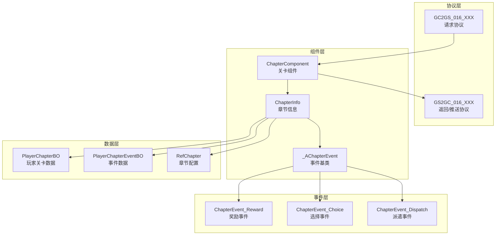
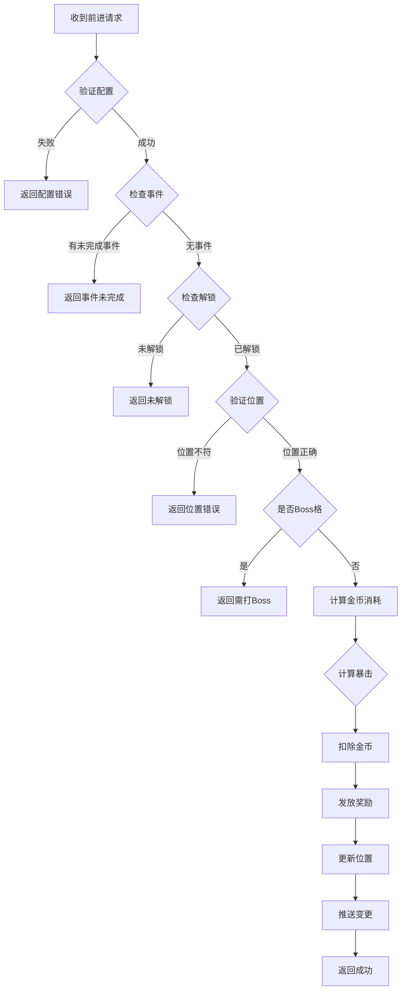
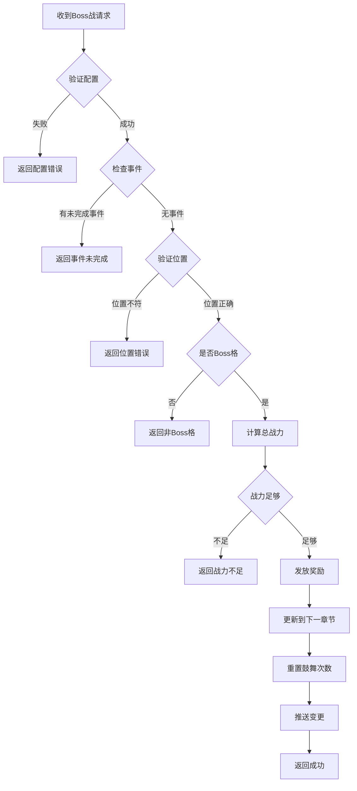
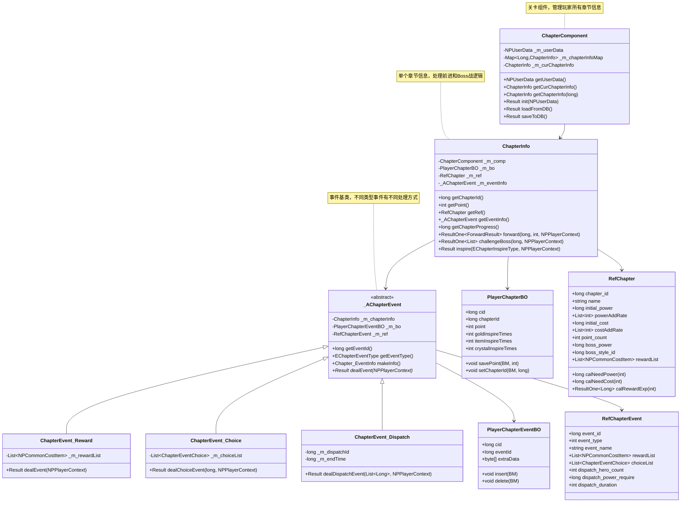
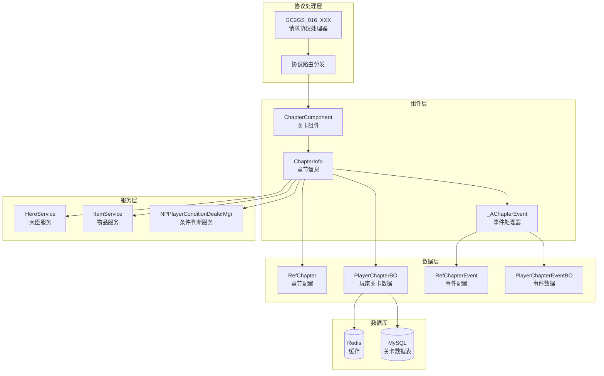
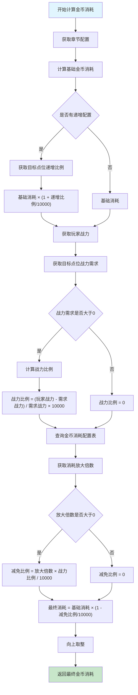
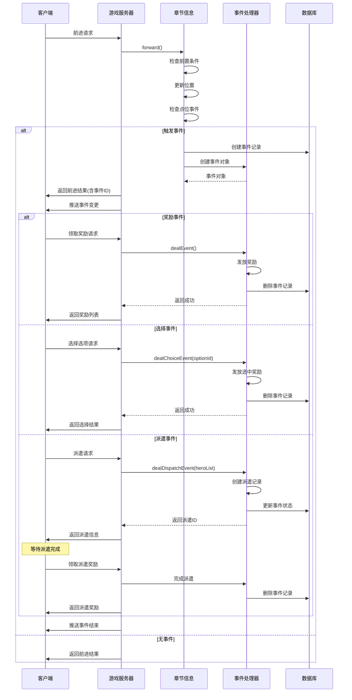

# Module_Chapter - 服务端开发文档

**模块名称**: Chapter（章节关卡系统）
**文档版本**: 3.0
**创建日期**: 2026-04-11

---

## 一、服务端架构概述

### 1.1 模块架构



### 1.2 核心类关系

| 类名 | 职责 | 源码路径 |
|------|------|----------|
| ChapterComponent | 关卡组件管理器 | UserComp/ChapterComp/ChapterComponent.java |
| ChapterInfo | 单个章节信息管理 | UserComp/ChapterComp/ChapterInfo.java |
| _AChapterEvent | 事件处理基类 | UserComp/ChapterComp/Event/_AChapterEvent.java |
| PlayerChapterBO | 玩家关卡数据库对象 | USDB/Bo/PlayerChapterBO.java |

---

## 二、ChapterInfo 核心类

### 2.1 类结构

**源码路径**: `game_server/UserServer/src/NPUSServer/NPUSUserMgr/UserComp/ChapterComp/ChapterInfo.java`

### 2.2 核心属性

| 属性名 | 类型 | 说明 |
|--------|------|------|
| _m_comp | ChapterComponent | 关卡组件引用 |
| _m_bo | PlayerChapterBO | 数据库对象 |
| _m_ref | RefChapter | 章节配置引用 |
| _m_eventInfo | _AChapterEvent | 当前事件信息 |

### 2.3 核心方法

| 方法名 | 返回类型 | 说明 |
|--------|----------|------|
| getChapterId() | long | 获取章节ID |
| getPoint() | int | 获取当前点位 |
| getRef() | RefChapter | 获取配置引用 |
| getEventInfo() | _AChapterEvent | 获取事件信息 |
| getChapterProgress() | long | 获取关卡进度（ID*1000+点位） |

---

## 三、关卡前进处理

### 3.1 前进方法 (forward)

```java
public ResultOne<ForwardResult> forward(long _chapterId, int _targetPoint, NPPlayerContext _context)
{
    // 1. 获取关卡配置
    RefChapter ref = getRef();
    if (ref == null)
        return ResultOne.failed(CommErr.REF_NOT_FOUND);

    // 2. 判断是否有未完成事件
    if (_m_eventInfo != null)
        return ResultOne.failed(ChapterErr.CHAPTER_EVENT_NOT_DONE);

    // 3. 判断关卡是否解锁
    if (!NPPlayerConditionDealerMgr.IsEnable(
        RefGeneral.Ref().unlock_chapter_simple_unlock_id,
        _m_comp.getUserData(), null))
        return ResultOne.failed(ChapterErr.CHAPTER_NOT_UNLOCK);

    // 4. 获取并校验目标位置
    int curPoint = _m_bo.getPoint();
    int targetPoint = curPoint + 1;

    if (_chapterId != _m_bo.getChapterId() || targetPoint != _targetPoint)
        return ResultOne.failed(ChapterErr.CHAPTER_POINT_NOT_FIT);

    // 5. Boss格需要走特殊逻辑
    if (targetPoint == ref.point_count)
        return ResultOne.failed(ChapterErr.CHAPTER_BOSS_NOT_DEFEAT);

    // 6. 计算金币消耗
    ResultOne<Long> goldCostResult = calGoldCost(ref, targetPoint);
    if (!goldCostResult.isSucc())
        return ResultOne.failed(goldCostResult.getResult());
    long goldCost = goldCostResult.getData();

    // 7. 计算是否暴击
    int coefficient = 10000;
    boolean isCrit = false;
    if (CommonFunc.randomInt(10000) < ref.crit_probability)
    {
        isCrit = true;
        coefficient = RefGeneral.Ref().critical_hit_coefficient;
    }

    // 8. 计算奖励
    ResultOne<Long> rewardExpResult = ref.calRewardExp(targetPoint);
    if (!rewardExpResult.isSucc())
        return ResultOne.failed(rewardExpResult.getResult());
    long rewardExp = rewardExpResult.getData() * coefficient / 10000;

    // 9. 扣除金币
    if (!_m_comp.getUserData().spendItem(
        ENPItemType.CURRENCY, ECurrency.SILVER.ordinal(), goldCost, _context))
        return ResultOne.failed(CommErr.ITEM_NOT_ENOUGH);

    // 10. 发放奖励
    _m_comp.getUserData().gainItem(
        ENPItemType.CURRENCY, ECurrency.HERO_EXP.ordinal(), rewardExp, _context);
    _m_comp.getUserData().gainItem(
        ENPItemType.CURRENCY, ECurrency.P_EXP.ordinal(), ref.reward_player_exp, _context);

    // 11. 更新当前位置
    _m_bo.savePoint(_m_comp.getUSServer().getBM(), targetPoint);

    // 12. 推送变更
    _m_comp.getUserData().sendMsgToGC(
        US2GCWriter_016_ChapterOp.make_051_OnChapterPosChg(getPosInfo()));

    return ResultOne.succ(new ForwardResult(coefficient, rewardExp, ref.reward_player_exp, goldCost));
}
```

### 3.2 金币消耗计算

```java
/**
 * 计算金币消耗
 * 公式: 关卡金币消耗基础值*(1+递增比例)*（1 - 金币消耗减免比例）
 * 金币消耗减免比例 =（玩家战力-关卡战力）/关卡战力 * 金币消耗放大倍数
 */
public ResultOne<Long> calGoldCost(RefChapter _ref, int _point)
{
    // 计算基础金币消耗
    ResultOne<Double> goldCostResult = _ref.calNeedCost(_point);
    if (!goldCostResult.isSucc())
        return ResultOne.failed(goldCostResult.getResult());
    double baseGoldCost = goldCostResult.getData();

    // 计算战力比例（万分比）
    ResultOne<Long> powerRateResult = getPowerRate(_ref, _point);
    if (!powerRateResult.isSucc())
        return powerRateResult;
    long powerRate = powerRateResult.getData();

    // 金币消耗放大倍数（万分比）
    int costMultipleRate = RefChapterCost.getMgr().getCostMultipleRate((int) powerRate);

    // 计算最终金币消耗
    long finalCost = (long) Math.ceil(
        baseGoldCost * (1 - costMultipleRate / 10000d * powerRate / 10000d));

    return ResultOne.succ(finalCost);
}
```

---

## 四、Boss战处理

### 4.1 Boss战方法 (challengeBoss)

```java
public ResultOne<List<NPCommon_ItemInfo>> challengeBoss(long _chapterId, NPPlayerContext _context)
{
    // 1. 获取关卡配置
    RefChapter ref = getRef();
    if (ref == null)
        return ResultOne.failed(CommErr.REF_NOT_FOUND);

    // 2. 判断是否有未完成事件
    if (_m_eventInfo != null)
        return ResultOne.failed(ChapterErr.CHAPTER_EVENT_NOT_DONE);

    // 3. 校验章节和位置
    int curPoint = _m_bo.getPoint();
    int targetPoint = curPoint + 1;

    if (_chapterId != _m_bo.getChapterId())
        return ResultOne.failed(ChapterErr.CHAPTER_POINT_NOT_FIT);

    if (curPoint >= ref.point_count)
        return ResultOne.failed(ChapterErr.CHAPTER_BOSS_HAD_DEFEAT);

    if (targetPoint != ref.point_count)
        return ResultOne.failed(ChapterErr.CHAPTER_NOT_ATTACK_BOSS);

    // 4. 计算战力
    long bossPower = ref.boss_power;
    long basePower = _m_comp.getUserData().getHeroComponent().getTotalPower();

    // 计算鼓舞加成
    int totalIncreasePer = 0;
    totalIncreasePer += RefGeneral.Ref().gold_inspire_increase_power_ratio_per
        * _m_bo.getGoldInspireTimes();
    totalIncreasePer += RefGeneral.Ref().item_inspire_increase_power_ratio_per
        * _m_bo.getItemInspireTimes();
    totalIncreasePer += RefGeneral.Ref().crystal_inspire_increase_power_ratio_per
        * _m_bo.getCrystalInspireTimes();

    long totalPower = basePower * (10000 + totalIncreasePer) / 10000;

    // 5. 检查战力是否足够
    if (totalPower < bossPower)
        return ResultOne.failed(ChapterErr.CHAPTER_ATTACK_BOSS_POWER_NOT_ENOUGH);

    // 6. 发放奖励
    List<NPCommonCostItem> itemList = new ArrayList<>();
    List<NPCommonCostItem> consortList = new ArrayList<>();
    for (NPCommonCostItem item : ref.reward_list)
    {
        if (item.getItemType() == ENPItemType.CONSORT)
            consortList.add(item);
        else
            itemList.add(item);
    }
    _m_comp.getUserData().gainItemList(itemList, _context);

    // 7. 更新到下一章节
    long nextChapterId = _m_bo.getChapterId() + 1;
    _m_ref = RefChapter.getMgr().get(nextChapterId);

    BM bmObj = _m_comp.getUSServer().getBM();
    _m_bo.setPoint(bmObj, 0);
    _m_bo.setChapterId(bmObj, nextChapterId);
    _m_bo.setGoldInspireTimes(bmObj, 0);
    _m_bo.setCrystalInspireTimes(bmObj, 0);
    _m_bo.setItemInspireTimes(bmObj, 0);
    _m_bo.saveAllMarked(bmObj);

    // 8. 推送变更
    _m_comp.getUserData().sendMsgToGC(
        US2GCWriter_016_ChapterOp.make_051_OnChapterPosChg(getPosInfo()));
    _m_comp.getUserData().sendMsgToGC(
        US2GCWriter_016_ChapterOp.make_052_OnChapterInspireChg(getInspireInfo()));

    // 9. 构造返回奖励列表
    List<NPCommon_ItemInfo> rewardList = new ArrayList<>();
    _context.getCollector().fillProtoList(rewardList);

    return ResultOne.succ(rewardList);
}
```

---

## 五、鼓舞系统

### 5.1 鼓舞入口

```java
public Result inspire(EChapterInspireType _type, NPPlayerContext _context)
{
    switch (_type)
    {
        case GOLD:
            return inspireGold(_context);
        case ITEM:
            return inspireItem(_context);
        case CRYSTAL:
            return inspireCrystal(_context);
    }
    return CommErr.PARAM_ERROR;
}
```

### 5.2 金币鼓舞

```java
public Result inspireGold(NPPlayerContext _context)
{
    RefChapter ref = getRef();
    if (ref == null)
        return CommErr.REF_NOT_FOUND;

    int targetPoint = _m_bo.getPoint() + 1;

    // 检查是否是Boss格
    if (targetPoint != ref.point_count)
        return ChapterErr.CHAPTER_NOT_ATTACK_BOSS;

    int times = _m_bo.getGoldInspireTimes();
    long cost = calGoldInspireCost(ref, times + 1);

    // 扣除金币
    if (!_m_comp.getUserData().spendItem(
        ENPItemType.CURRENCY, ECurrency.SILVER.ordinal(), cost, _context))
        return CommErr.ITEM_NOT_ENOUGH;

    // 增加鼓舞次数
    _m_bo.saveGoldInspireTimes(_m_comp.getUSServer().getBM(), times + 1);

    // 推送变更
    _m_comp.getUserData().sendMsgToGC(
        US2GCWriter_016_ChapterOp.make_052_OnChapterInspireChg(getInspireInfo()));

    return Result.SUCC;
}
```

### 5.3 金币鼓舞消耗计算

```java
private long calGoldInspireCost(RefChapter _ref, int _times)
{
    long costNum = 0;
    costNum += _ref.gold_inspire_base_value;

    RefTimePrice refTimePrice = RefTimePrice.getMgr().getPrice(
        RefGeneral.Ref().gold_inspire_calculate_ratio_time_price_id, _times);

    if (refTimePrice != null)
    {
        NPVarInfo varInfo = new NPVarInfo();
        varInfo.addObj(ENPPlayerVariableVarType.BUY_TIMES.ordinal(),
            _m_bo.getGoldInspireTimes() + 1);
        costNum *= NPPlayerVariableDeal.getInstance().CalculateVariableResult(
            _m_comp.getUserData(), refTimePrice.cost_item_formula, varInfo);
    }
    return costNum;
}
```

---

## 六、事件系统

### 6.1 事件类型

| 事件类型 | 类名 | 说明 |
|----------|------|------|
| REWARD | ChapterEvent_Reward | 奖励事件 |
| CHOICE | ChapterEvent_Choice | 选择事件 |
| DISPATCH | ChapterEvent_Dispatch | 派遣事件 |

### 6.2 事件触发

```java
public RefChapterEvent tryTriggerEvent(NPPlayerContext context)
{
    RefChapter ref = getRef();
    if (ref == null)
    {
        USLog.error(_m_comp.getUSServer(),
            "ChapterInfo.tryTriggerEvent: can not find ref, chapterId:{}",
            _m_bo.getChapterId());
        return null;
    }

    // 查询当前位置是否有事件
    for (WCGPairLong eventPair : ref.point_event.getList())
    {
        if (eventPair.first() == _m_bo.getPoint())
        {
            RefChapterEvent refEvent = RefChapterEvent.getMgr().get(eventPair.second());
            if (refEvent == null)
            {
                USLog.error(_m_comp.getUSServer(),
                    "ChapterInfo.tryTriggerEvent: can not find ref, eventId:{}",
                    eventPair.second());
                return null;
            }
            return refEvent;
        }
    }

    return null;
}
```

### 6.3 创建事件

```java
public void createEvent(RefChapterEvent _refEvent)
{
    PlayerChapterEventBO bo = new PlayerChapterEventBO();
    bo.setCid(_m_comp.getUSServer().getBM(), _m_bo.getCid());
    bo.setEventId(_m_comp.getUSServer().getBM(), _refEvent.Id());
    bo.insert(_m_comp.getUSServer().getBM());

    // 创建事件对象
    _m_eventInfo = _createChapterEventObj(bo);
    if (_m_eventInfo != null)
    {
        _m_comp.getUserData().sendMsgToGC(
            US2GCWriter_016_ChapterOp.make_053_OnChapterEventChg(
                _m_eventInfo.makeInfo()));
    }
}
```

### 6.4 销毁事件

```java
public void disposeEvent(_AChapterEvent _event, NPPlayerContext _context)
{
    if (_event == null)
        return;

    _m_eventInfo = null;
    _event.dispose();

    _m_comp.getUserData().sendMsgToGC(
        US2GCWriter_016_ChapterOp.make_053_OnChapterEventChg(
            new Chapter_EventInfo()));
}
```

---

## 七、数据推送

### 7.1 推送位置变更

```java
public Chapter_PosInfo getPosInfo()
{
    return new Chapter_PosInfo(_m_bo.getChapterId(), _m_bo.getPoint());
}

// 推送
_m_comp.getUserData().sendMsgToGC(
    US2GCWriter_016_ChapterOp.make_051_OnChapterPosChg(getPosInfo()));
```

### 7.2 推送鼓舞变更

```java
public Chapter_InspireInfo getInspireInfo()
{
    Chapter_InspireInfo inspireInfo = new Chapter_InspireInfo();
    inspireInfo.addInspireList(new Chapter_SingleInspireInfo(
        EChapterInspireType.GOLD, _m_bo.getGoldInspireTimes()));
    inspireInfo.addInspireList(new Chapter_SingleInspireInfo(
        EChapterInspireType.ITEM, _m_bo.getItemInspireTimes()));
    inspireInfo.addInspireList(new Chapter_SingleInspireInfo(
        EChapterInspireType.CRYSTAL, _m_bo.getCrystalInspireTimes()));
    return inspireInfo;
}

// 推送
_m_comp.getUserData().sendMsgToGC(
    US2GCWriter_016_ChapterOp.make_052_OnChapterInspireChg(getInspireInfo()));
```

---

## 八、GM命令

### 8.1 GM修改位置

```java
public Result gmChgPos(long _chapterId, int _point)
{
    RefChapter refChapter = RefChapter.getMgr().get(_chapterId);
    if (refChapter == null)
        return CommErr.REF_NOT_FOUND;

    // 判断点位是否合法
    if (_point < 0 || _point > refChapter.point_count)
        return CommErr.PARAM_ERROR;

    _m_ref = refChapter;
    BM bmObj = _m_comp.getUSServer().getBM();
    _m_bo.setPoint(bmObj, _point);
    _m_bo.setChapterId(bmObj, _chapterId);
    _m_bo.setGoldInspireTimes(bmObj, 0);
    _m_bo.setCrystalInspireTimes(bmObj, 0);
    _m_bo.setItemInspireTimes(bmObj, 0);
    _m_bo.saveAllMarked(bmObj);

    // 推送GM变更
    _m_comp.getUserData().sendMsgToGC(
        US2GCWriter_016_ChapterOp.make_054_OnChapterGmPosChg(getPosInfo()));
    _m_comp.getUserData().sendMsgToGC(
        US2GCWriter_016_ChapterOp.make_052_OnChapterInspireChg(getInspireInfo()));

    return Result.SUCC;
}
```

### 8.2 GM到达Boss点

```java
public Result gmToBossPoint()
{
    RefChapter ref = getRef();
    if (ref == null)
        return CommErr.REF_NOT_FOUND;

    int bossPoint = ref.point_count - 1;
    return gmChgPos(_m_bo.getChapterId(), bossPoint);
}
```

---

## 九、日志记录

### 9.1 前进日志

```java
LogChapterForwardBO logBo = new LogChapterForwardBO();
logBo.setCid(_m_comp.getUSServer().getBM(), _m_comp.getUserData().getCid());
logBo.setLevel(_m_comp.getUSServer().getBM(),
    (int) _m_comp.getUserData().getParam(ENPPlayerParam.LEVEL));
logBo.setChapterId(_m_comp.getUSServer().getBM(), _chapterId);
logBo.setPoint(_m_comp.getUSServer().getBM(), targetPoint);
logBo.setPower(_m_comp.getUSServer().getBM(),
    _m_comp.getUserData().getHeroComponent().getTotalPower());
logBo.setEarnings(_m_comp.getUSServer().getBM(),
    _m_comp.getUserData().getPlayerComponent().getEarnings());
logBo.setIsCriticalHit(_m_comp.getUSServer().getBM(), isCrit);
logBo.setGoldCost(_m_comp.getUSServer().getBM(), goldCost);
CommLogDB.log(_m_comp.getUSServer().getBM(), logBo, _context);
```

### 9.2 Boss战日志

```java
LogChapterFightBossBO logBo = new LogChapterFightBossBO();
logBo.setCid(_m_comp.getUSServer().getBM(), _m_comp.getUserData().getCid());
logBo.setLevel(_m_comp.getUSServer().getBM(),
    (int)_m_comp.getUserData().getParam(ENPPlayerParam.LEVEL));
logBo.setChapterId(_m_comp.getUSServer().getBM(), _chapterId);
logBo.setPower(_m_comp.getUSServer().getBM(), basePower);
logBo.setEarnings(_m_comp.getUSServer().getBM(),
    _m_comp.getUserData().getPlayerComponent().getEarnings());
logBo.setGoldInspireTimes(_m_comp.getUSServer().getBM(), _m_bo.getGoldInspireTimes());
logBo.setItemInspireTimes(_m_comp.getUSServer().getBM(), _m_bo.getItemInspireTimes());
logBo.setCrystalInspireTimes(_m_comp.getUSServer().getBM(), _m_bo.getCrystalInspireTimes());
logBo.setFinalPower(_m_comp.getUSServer().getBM(), totalPower);
CommLogDB.log(_m_comp.getUSServer().getBM(), logBo, _context);
```

---

## 十、服务端流程图

### 10.1 关卡前进流程



### 10.2 Boss战流程



---

---

## 十一、服务端类图详解



---

## 十二、服务端模块交互图



---

## 十三、数据库设计

### 13.1 玩家关卡数据表 (player_chapter)

```sql
CREATE TABLE `player_chapter` (
    `id` BIGINT(20) NOT NULL AUTO_INCREMENT COMMENT '主键ID',
    `cid` BIGINT(20) NOT NULL COMMENT '角色ID',
    `chapter_id` BIGINT(20) NOT NULL DEFAULT '1' COMMENT '当前章节ID',
    `point` INT(11) NOT NULL DEFAULT '0' COMMENT '当前点位',
    `gold_inspire_times` INT(11) NOT NULL DEFAULT '0' COMMENT '金币鼓舞次数',
    `item_inspire_times` INT(11) NOT NULL DEFAULT '0' COMMENT '道具鼓舞次数',
    `crystal_inspire_times` INT(11) NOT NULL DEFAULT '0' COMMENT '水晶鼓舞次数',
    `create_time` DATETIME NOT NULL DEFAULT CURRENT_TIMESTAMP COMMENT '创建时间',
    `update_time` DATETIME NOT NULL DEFAULT CURRENT_TIMESTAMP ON UPDATE CURRENT_TIMESTAMP COMMENT '更新时间',
    PRIMARY KEY (`id`),
    UNIQUE KEY `uk_cid` (`cid`),
    KEY `idx_chapter_id` (`chapter_id`)
) ENGINE=InnoDB DEFAULT CHARSET=utf8mb4 COMMENT='玩家关卡数据表';
```

### 13.2 玩家关卡事件表 (player_chapter_event)

```sql
CREATE TABLE `player_chapter_event` (
    `id` BIGINT(20) NOT NULL AUTO_INCREMENT COMMENT '主键ID',
    `cid` BIGINT(20) NOT NULL COMMENT '角色ID',
    `event_id` BIGINT(20) NOT NULL COMMENT '事件ID',
    `event_type` TINYINT(4) NOT NULL COMMENT '事件类型',
    `extra_data` BLOB COMMENT '扩展数据',
    `status` TINYINT(4) NOT NULL DEFAULT '0' COMMENT '状态：0进行中,1已完成',
    `create_time` DATETIME NOT NULL DEFAULT CURRENT_TIMESTAMP COMMENT '创建时间',
    `update_time` DATETIME NOT NULL DEFAULT CURRENT_TIMESTAMP ON UPDATE CURRENT_TIMESTAMP COMMENT '更新时间',
    PRIMARY KEY (`id`),
    UNIQUE KEY `uk_cid_event` (`cid`, `event_id`),
    KEY `idx_status` (`status`)
) ENGINE=InnoDB DEFAULT CHARSET=utf8mb4 COMMENT='玩家关卡事件表';
```

### 13.3 关卡日志表 (log_chapter_forward)

```sql
CREATE TABLE `log_chapter_forward` (
    `id` BIGINT(20) NOT NULL AUTO_INCREMENT COMMENT '主键ID',
    `cid` BIGINT(20) NOT NULL COMMENT '角色ID',
    `level` INT(11) NOT NULL COMMENT '玩家等级',
    `chapter_id` BIGINT(20) NOT NULL COMMENT '章节ID',
    `point` INT(11) NOT NULL COMMENT '前进点位',
    `power` BIGINT(20) NOT NULL COMMENT '当前战力',
    `earnings` BIGINT(20) NOT NULL COMMENT '收益值',
    `is_critical_hit` TINYINT(4) NOT NULL DEFAULT '0' COMMENT '是否暴击',
    `gold_cost` BIGINT(20) NOT NULL COMMENT '金币消耗',
    `create_time` DATETIME NOT NULL DEFAULT CURRENT_TIMESTAMP COMMENT '创建时间',
    PRIMARY KEY (`id`),
    KEY `idx_cid` (`cid`),
    KEY `idx_chapter` (`chapter_id`, `point`),
    KEY `idx_create_time` (`create_time`)
) ENGINE=InnoDB DEFAULT CHARSET=utf8mb4 COMMENT='关卡前进日志表';
```

---

## 十四、完整金币消耗计算流程



---

## 十五、事件处理完整流程



---

## 十六、服务端性能优化

### 16.1 缓存策略

```java
/**
 * 关卡缓存管理器
 */
public class ChapterCacheManager
{
    // Redis缓存Key前缀
    private static final String CHAPTER_KEY_PREFIX = "chapter:";
    private static final String EVENT_KEY_PREFIX = "chapter_event:";

    // 缓存过期时间
    private static final int CACHE_EXPIRE_SECONDS = 3600;

    /**
     * 获取关卡数据（带缓存）
     */
    public PlayerChapterBO getChapterData(long _cid)
    {
        // 1. 先从Redis获取
        String key = CHAPTER_KEY_PREFIX + _cid;
        String json = RedisManager.get(key);

        if (json != null)
        {
            return JSON.parseObject(json, PlayerChapterBO.class);
        }

        // 2. 从数据库加载
        PlayerChapterBO bo = loadFromDB(_cid);
        if (bo != null)
        {
            // 写入缓存
            RedisManager.setex(key, CACHE_EXPIRE_SECONDS, JSON.toJSONString(bo));
        }

        return bo;
    }

    /**
     * 更新关卡数据（更新缓存）
     */
    public void updateChapterData(PlayerChapterBO _bo)
    {
        // 更新数据库
        saveToDB(_bo);

        // 更新缓存
        String key = CHAPTER_KEY_PREFIX + _bo.getCid();
        RedisManager.setex(key, CACHE_EXPIRE_SECONDS, JSON.toJSONString(_bo));
    }

    /**
     * 清除关卡缓存
     */
    public void clearChapterCache(long _cid)
    {
        String key = CHAPTER_KEY_PREFIX + _cid;
        RedisManager.del(key);
    }
}
```

### 16.2 批量操作优化

```java
/**
 * 批量获取关卡数据
 */
public Map<Long, PlayerChapterBO> batchGetChapterData(List<Long> _cidList)
{
    Map<Long, PlayerChapterBO> result = new HashMap<>();

    // 1. 批量从Redis获取
    List<String> keys = _cidList.stream()
        .map(cid -> CHAPTER_KEY_PREFIX + cid)
        .collect(Collectors.toList());

    List<String> jsonList = RedisManager.mget(keys);

    // 2. 解析缓存数据
    List<Long> missingCids = new ArrayList<>();
    for (int i = 0; i < _cidList.size(); i++)
    {
        String json = jsonList.get(i);
        if (json != null)
        {
            PlayerChapterBO bo = JSON.parseObject(json, PlayerChapterBO.class);
            result.put(_cidList.get(i), bo);
        }
        else
        {
            missingCids.add(_cidList.get(i));
        }
    }

    // 3. 批量从数据库获取缺失数据
    if (!missingCids.isEmpty())
    {
        List<PlayerChapterBO> dbList = batchLoadFromDB(missingCids);

        // 写入缓存
        Map<String, String> cacheData = new HashMap<>();
        for (PlayerChapterBO bo : dbList)
        {
            result.put(bo.getCid(), bo);
            cacheData.put(CHAPTER_KEY_PREFIX + bo.getCid(), JSON.toJSONString(bo));
        }

        if (!cacheData.isEmpty())
        {
            RedisManager.mset(cacheData);
        }
    }

    return result;
}
```

### 16.3 异步日志记录

```java
/**
 * 异步日志队列
 */
public class ChapterLogQueue
{
    private static final int QUEUE_CAPACITY = 10000;
    private static final BlockingQueue<ChapterLogTask> _queue =
        new LinkedBlockingQueue<>(QUEUE_CAPACITY);

    private static volatile boolean _running = false;

    /**
     * 启动日志消费者
     */
    public static void start()
    {
        if (_running) return;
        _running = true;

        // 启动多个消费者线程
        for (int i = 0; i < 3; i++)
        {
            new Thread(() -> {
                while (_running || !_queue.isEmpty())
                {
                    try
                    {
                        ChapterLogTask task = _queue.poll(100, TimeUnit.MILLISECONDS);
                        if (task != null)
                        {
                            task.execute();
                        }
                    }
                    catch (Exception e)
                    {
                        USLog.error(null, "ChapterLogQueue error", e);
                    }
                }
            }, "ChapterLog-" + i).start();
        }
    }

    /**
     * 停止日志消费者
     */
    public static void stop()
    {
        _running = false;
    }

    /**
     * 添加日志任务
     */
    public static void addLog(ChapterLogTask _task)
    {
        if (!_queue.offer(_task))
        {
            USLog.warn(null, "ChapterLogQueue is full, log dropped");
        }
    }
}

/**
 * 关卡前进日志任务
 */
public class ChapterForwardLogTask implements ChapterLogTask
{
    private LogChapterForwardBO _logBo;
    private BM _bm;

    public ChapterForwardLogTask(BM _bm, LogChapterForwardBO _logBo)
    {
        this._bm = _bm;
        this._logBo = _logBo;
    }

    @Override
    public void execute()
    {
        CommLogDB.log(_bm, _logBo, null);
    }
}

// 使用示例
LogChapterForwardBO logBo = new LogChapterForwardBO();
// ... 设置日志字段
ChapterLogQueue.addLog(new ChapterForwardLogTask(bm, logBo));
```

---

## 十七、服务端错误处理

### 17.1 错误码定义

```java
/**
 * 关卡错误码定义
 */
public class ChapterErr
{
    // Boss战相关错误
    public static final int CHAPTER_BOSS_NOT_DEFEAT = 30001;      // Boss未击败
    public static final int CHAPTER_POINT_NOT_FIT = 30002;        // 点位不符
    public static final int CHAPTER_BOSS_HAD_DEFEAT = 30003;      // Boss已击败
    public static final int CHAPTER_ATTACK_BOSS_POWER_NOT_ENOUGH = 30004; // 战力不足
    public static final int CHAPTER_NOT_ATTACK_BOSS = 30005;      // 非Boss战状态

    // 章节解锁相关错误
    public static final int CHAPTER_NOT_UNLOCK = 30006;           // 章节未解锁

    // 事件相关错误
    public static final int CHAPTER_EVENT_NOT_DONE = 30007;       // 事件未完成
    public static final int CHAPTER_NO_EVENT_TO_DEAL = 30008;     // 无可处理事件

    // 奖励相关错误
    public static final int CHAPTER_PLOT_REWARD_DRAWN = 30009;    // 剧情奖励已领取

    /**
     * 获取错误信息
     */
    public static String getErrorMsg(int _errCode)
    {
        switch (_errCode)
        {
            case CHAPTER_BOSS_NOT_DEFEAT:
                return "Boss战未完成";
            case CHAPTER_POINT_NOT_FIT:
                return "关卡进度异常";
            case CHAPTER_BOSS_HAD_DEFEAT:
                return "Boss已被击败";
            case CHAPTER_ATTACK_BOSS_POWER_NOT_ENOUGH:
                return "战力不足，无法挑战Boss";
            case CHAPTER_NOT_ATTACK_BOSS:
                return "当前不是Boss战状态";
            case CHAPTER_NOT_UNLOCK:
                return "章节尚未解锁";
            case CHAPTER_EVENT_NOT_DONE:
                return "请先完成当前事件";
            case CHAPTER_NO_EVENT_TO_DEAL:
                return "没有可处理的事件";
            case CHAPTER_PLOT_REWARD_DRAWN:
                return "剧情奖励已领取";
            default:
                return "未知错误: " + _errCode;
        }
    }
}
```

### 17.2 异常处理策略

```java
/**
 * 关卡操作异常处理器
 */
public class ChapterExceptionHandler
{
    /**
     * 处理关卡操作异常
     */
    public static void handleException(NPPlayerContext _context, Exception _e)
    {
        USLog.error(_context.getServer(), "Chapter operation exception", _e);

        if (_e instanceof ChapterException)
        {
            // 业务异常，返回错误码
            ChapterException ce = (ChapterException) _e;
            _context.setResult(ce.getErrorCode());
        }
        else if (_e instanceof SQLException)
        {
            // 数据库异常
            _context.setResult(CommErr.DB_ERROR);
            // 发送告警
            sendAlert("Chapter DB Error: " + _e.getMessage());
        }
        else if (_e instanceof RedisException)
        {
            // Redis异常，降级处理
            _context.setResult(CommErr.CACHE_ERROR);
            USLog.warn(_context.getServer(), "Redis error, fallback to DB");
        }
        else
        {
            // 未知异常
            _context.setResult(CommErr.UNKNOWN_ERROR);
            // 发送告警
            sendAlert("Chapter Unknown Error: " + _e.getMessage());
        }
    }

    private static void sendAlert(String _message)
    {
        // 发送告警到监控系统
        // AlertManager.send("chapter", _message);
    }
}

/**
 * 自定义关卡异常
 */
public class ChapterException extends RuntimeException
{
    private int errorCode;

    public ChapterException(int _errorCode)
    {
        super(ChapterErr.getErrorMsg(_errorCode));
        this.errorCode = _errorCode;
    }

    public int getErrorCode()
    {
        return errorCode;
    }
}

// 使用示例
public ResultOne<ForwardResult> forward(long _chapterId, int _targetPoint, NPPlayerContext _context)
{
    try
    {
        // ... 业务逻辑
    }
    catch (Exception e)
    {
        ChapterExceptionHandler.handleException(_context, e);
        return ResultOne.failed(CommErr.UNKNOWN_ERROR);
    }
}
```

---

## 十八、GM命令实现

### 18.1 GM命令处理器

```java
/**
 * 关卡GM命令处理器
 */
public class ChapterGMHandler
{
    /**
     * GM修改关卡位置
     */
    @GMCommand("chapter_pos")
    public static Result gmChangePos(NPUserData _userData, String[] _args)
    {
        if (_args.length < 2)
        {
            return Result.failed("Usage: chapter_pos <chapterId> <point>");
        }

        try
        {
            long chapterId = Long.parseLong(_args[0]);
            int point = Integer.parseInt(_args[1]);

            ChapterComponent comp = _userData.getChapterComponent();
            ChapterInfo chapterInfo = comp.getCurChapterInfo();

            if (chapterInfo == null)
            {
                return Result.failed("ChapterInfo not found");
            }

            return chapterInfo.gmChgPos(chapterId, point);
        }
        catch (NumberFormatException e)
        {
            return Result.failed("Invalid parameters");
        }
    }

    /**
     * GM到达Boss点
     */
    @GMCommand("chapter_to_boss")
    public static Result gmToBoss(NPUserData _userData, String[] _args)
    {
        ChapterComponent comp = _userData.getChapterComponent();
        ChapterInfo chapterInfo = comp.getCurChapterInfo();

        if (chapterInfo == null)
        {
            return Result.failed("ChapterInfo not found");
        }

        return chapterInfo.gmToBossPoint();
    }

    /**
     * GM跳过当前事件
     */
    @GMCommand("chapter_skip_event")
    public static Result gmSkipEvent(NPUserData _userData, String[] _args)
    {
        ChapterComponent comp = _userData.getChapterComponent();
        ChapterInfo chapterInfo = comp.getCurChapterInfo();

        if (chapterInfo == null || chapterInfo.getEventInfo() == null)
        {
            return Result.failed("No event to skip");
        }

        chapterInfo.disposeEvent(chapterInfo.getEventInfo(), null);
        return Result.SUCC;
    }

    /**
     * GM重置鼓舞次数
     */
    @GMCommand("chapter_reset_inspire")
    public static Result gmResetInspire(NPUserData _userData, String[] _args)
    {
        ChapterComponent comp = _userData.getChapterComponent();
        ChapterInfo chapterInfo = comp.getCurChapterInfo();

        if (chapterInfo == null)
        {
            return Result.failed("ChapterInfo not found");
        }

        BM bm = _userData.getServer().getBM();
        PlayerChapterBO bo = chapterInfo.getBo();
        bo.setGoldInspireTimes(bm, 0);
        bo.setItemInspireTimes(bm, 0);
        bo.setCrystalInspireTimes(bm, 0);
        bo.saveAllMarked(bm);

        // 推送变更
        _userData.sendMsgToGC(
            US2GCWriter_016_ChapterOp.make_052_OnChapterInspireChg(
                chapterInfo.getInspireInfo()));

        return Result.SUCC;
    }
}
```

---

## 十九、监控和告警

### 19.1 监控指标

```java
/**
 * 关卡监控指标
 */
public class ChapterMetrics
{
    // 前进请求计数
    private static final Counter FORWARD_COUNTER = Counter.builder()
        .name("chapter_forward_total")
        .tag("result", "success")
        .register();

    // 前进请求耗时
    private static final Timer FORWARD_TIMER = Timer.builder()
        .name("chapter_forward_duration")
        .register();

    // Boss战计数
    private static final Counter BOSS_COUNTER = Counter.builder()
        .name("chapter_boss_total")
        .tag("result", "success")
        .register();

    // 事件触发计数
    private static final Counter EVENT_COUNTER = Counter.builder()
        .name("chapter_event_total")
        .tag("type", "reward")
        .register();

    /**
     * 记录前进操作
     */
    public static void recordForward(boolean _success, long _durationMs)
    {
        FORWARD_COUNTER.increment(_success ? "success" : "fail");
        FORWARD_TIMER.record(_durationMs, TimeUnit.MILLISECONDS);
    }

    /**
     * 记录Boss战
     */
    public static void recordBossFight(boolean _success)
    {
        BOSS_COUNTER.increment(_success ? "success" : "fail");
    }

    /**
     * 记录事件触发
     */
    public static void recordEvent(EChapterEventType _type)
    {
        EVENT_COUNTER.increment(_type.name().toLowerCase());
    }
}

// 使用示例
public ResultOne<ForwardResult> forward(...)
{
    long startTime = System.currentTimeMillis();
    try
    {
        ResultOne<ForwardResult> result = doForward(...);
        ChapterMetrics.recordForward(result.isSucc(), System.currentTimeMillis() - startTime);
        return result;
    }
    catch (Exception e)
    {
        ChapterMetrics.recordForward(false, System.currentTimeMillis() - startTime);
        throw e;
    }
}
```

### 19.2 告警配置

```yaml
# 告警规则配置
chapter_alerts:
  - name: chapter_forward_error_rate
    expr: rate(chapter_forward_total{result="fail"}[5m]) / rate(chapter_forward_total[5m]) > 0.1
    severity: warning
    message: "关卡前进错误率超过10%"

  - name: chapter_forward_latency
    expr: histogram_quantile(0.95, chapter_forward_duration_bucket) > 500
    severity: warning
    message: "关卡前进P95延迟超过500ms"

  - name: chapter_boss_fail_rate
    expr: rate(chapter_boss_total{result="fail"}[5m]) / rate(chapter_boss_total[5m]) > 0.05
    severity: info
    message: "Boss战失败率超过5%"

  - name: chapter_db_error
    expr: rate(chapter_db_error_total[5m]) > 1
    severity: critical
    message: "关卡数据库错误"
```

---

*文档版本: 3.0 | 更新时间: 2026-04-12*