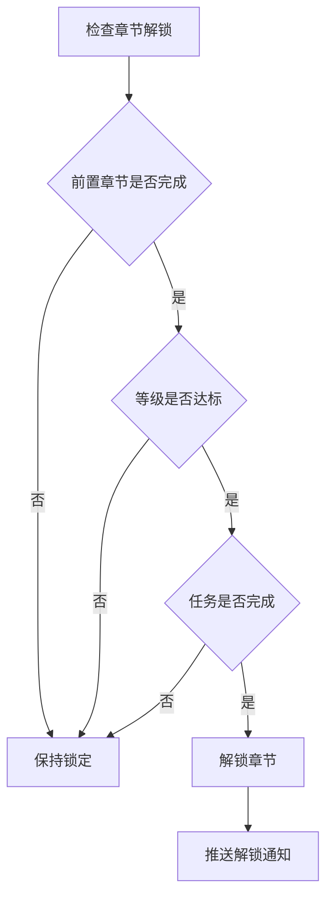
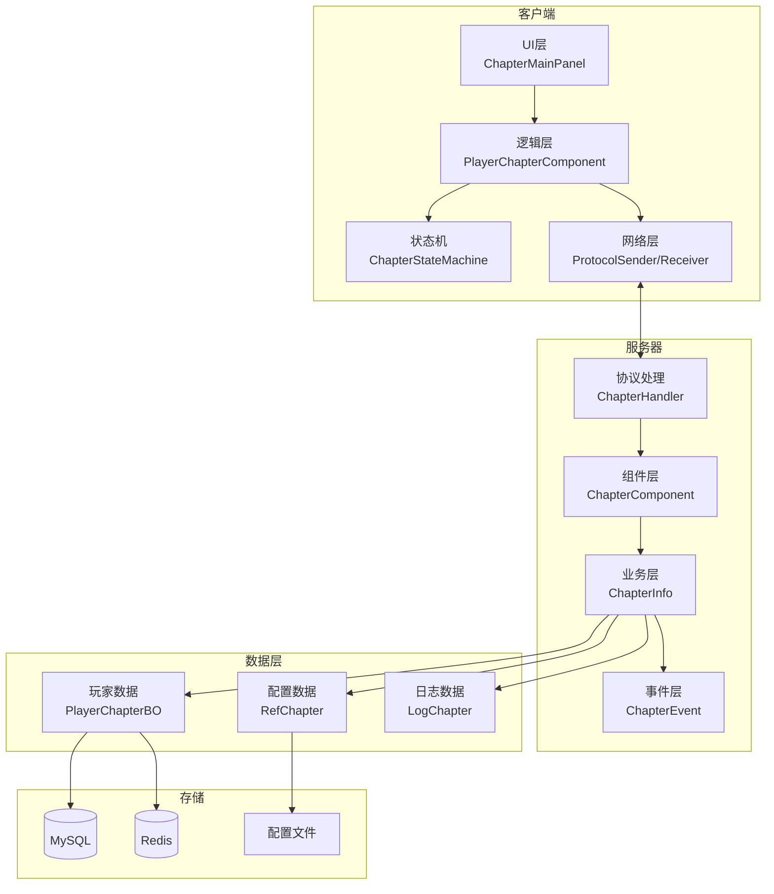
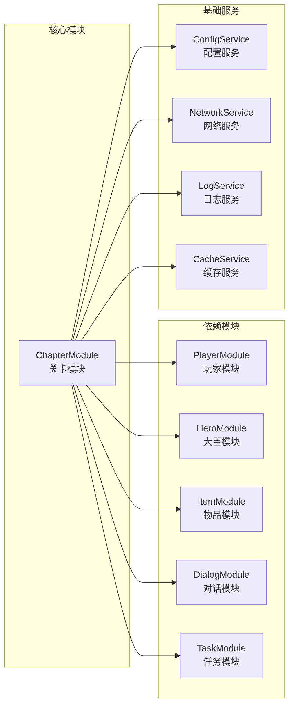
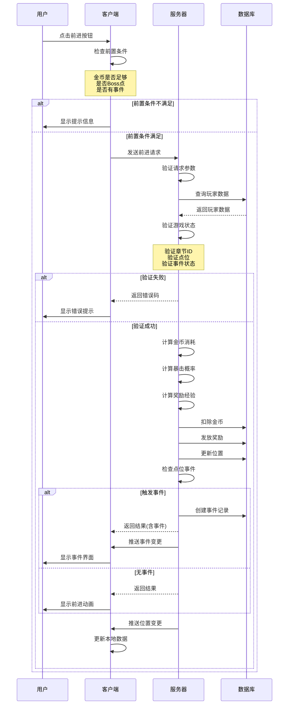
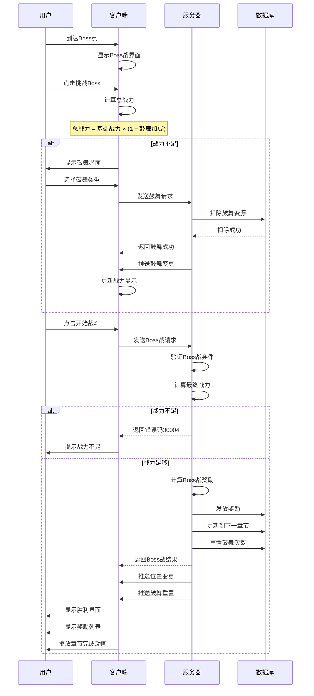
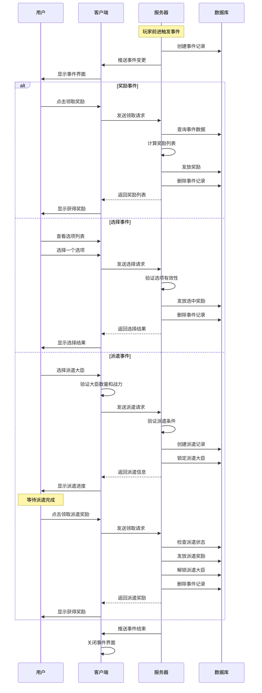
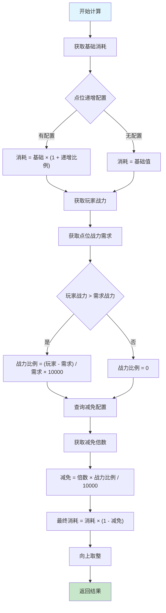
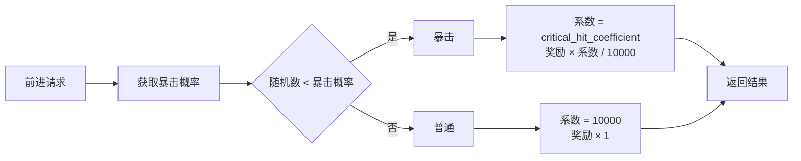
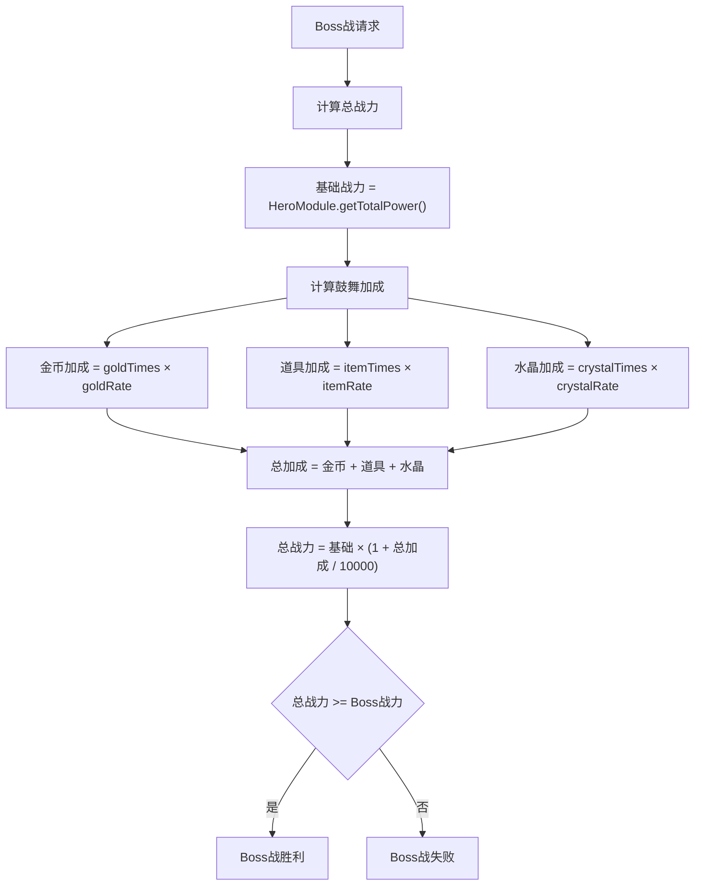
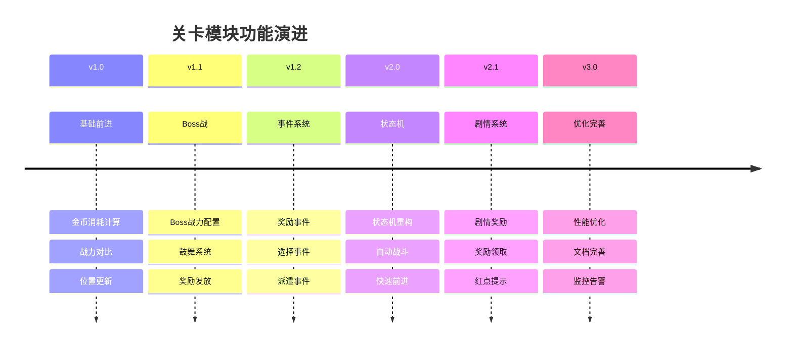

# 章节模块完整说明

## 一、模块概述

### 1.1 业务背景

章节模块是 K2C 游戏的关卡推进系统，将游戏内容按章节组织。玩家通过逐个通关关卡推进游戏进程，解锁新的内容和玩法。章节系统与主线任务紧密配合，引导玩家了解游戏的各个系统。

### 1.2 目标用户

- **所有玩家**：推进游戏进程的必经之路
- **剧情爱好者**：了解游戏故事背景
- **完成型玩家**：追求全关卡三星通关

### 1.3 核心价值

1. **游戏引导**：按章节引导玩家了解游戏
2. **进度展示**：清晰展示游戏进度
3. **内容解锁**：章节进度解锁新内容
4. **成就系统**：章节完成提供成就感

---

## 二、功能清单

### 2.1 章节管理功能

| 功能名称 | 功能描述 | 用户价值 |
|---------|---------|---------|
| 章节列表 | 显示所有章节信息 | 了解游戏结构 |
| 章节解锁 | 完成前置章节解锁 | 开启新内容 |
| 章节奖励 | 章节完成获得奖励 | 阶段性收益 |
| 章节进度 | 显示章节完成度 | 追踪进度 |

### 2.2 关卡管理功能

| 功能名称 | 功能描述 | 用户价值 |
|---------|---------|---------|
| 关卡进入 | 进入关卡开始挑战 | 推进进度 |
| 关卡三星 | 获得三星评价 | 追求完美 |
| 关卡奖励 | 通关获得奖励 | 获取资源 |
| 关卡扫荡 | 快速完成关卡 | 节省时间 |

### 2.3 剧情系统功能

| 功能名称 | 功能描述 | 用户价值 |
|---------|---------|---------|
| 剧情播放 | 播放关卡剧情动画 | 了解故事 |
| 剧情回顾 | 回顾已看过的剧情 | 重温剧情 |
| 剧情跳过 | 跳过剧情直接战斗 | 快速推进 |

---

## 三、业务流程详解

### 3.1 章节推进流程

```mermaid
flowchart TD
    A[进入章节界面] --> B[显示章节列表]
    B --> C{选择章节}
    C --> D[显示章节关卡]
    D --> E{选择关卡}
    E --> F{检查解锁条件}
    F -->|未解锁| G[提示解锁条件]
    F -->|已解锁| H{检查体力}
    H -->|体力不足| I[提示体力不足]
    H -->|体力充足| J[进入关卡]
    J --> K[播放剧情(如有)]
    K --> L[开始战斗]
    L --> M{战斗结果}
    M -->|胜利| N[计算星级]
    N --> O{是否首通}
    O -->|是| P[解锁下一关]
    O -->|否| Q[返回关卡列表]
    P --> R{是否章节完成}
    R -->|是| S[发放章节奖励]
    R -->|否| Q
    S --> Q
    M -->|失败| T[返回重试]
```

**详细步骤说明**：

1. **章节选择**
   - 显示所有章节列表
   - 标识已解锁/未解锁状态
   - 显示章节完成进度

2. **关卡选择**
   - 显示章节内所有关卡
   - 显示关卡星级和推荐战力
   - 标识已解锁/未解锁关卡

3. **战斗执行**
   - 消耗体力进入关卡
   - 播放剧情（首通时）
   - 执行战斗计算

4. **进度更新**
   - 更新关卡通关状态
   - 检查是否解锁下一关
   - 检查是否完成章节

### 3.2 章节解锁流程



---

## 四、关键规则

### 4.1 章节解锁规则

1. **前置章节**：必须完成前一章节
2. **等级要求**：达到指定等级解锁
3. **任务要求**：完成指定任务解锁
4. **特殊条件**：某些章节需要特殊条件

### 4.2 关卡解锁规则

1. **顺序解锁**：通常按顺序解锁关卡
2. **前置条件**：前一关卡获得至少1星
3. **支线关卡**：某些支线关卡独立解锁
4. **隐藏关卡**：满足隐藏条件解锁

### 4.3 星级评价规则

1. **一星**：通关关卡
2. **二星**：指定回合内通关
3. **三星**：全员存活且达成特殊条件

### 4.4 章节奖励规则

1. **通关奖励**：通关所有关卡获得
2. **星级奖励**：累计星级达到阈值获得
3. **完美奖励**：所有关卡三星获得

---

## 五、用户故事

### 5.1 新手玩家故事

> 作为一名新手玩家，我刚进入游戏，第一章引导我了解基本操作。每个关卡都有简单的剧情，让我了解了游戏的故事背景。完成第一章后，我解锁了英雄招募功能，获得了更多英雄。

### 5.2 完成型玩家故事

> 作为一名追求完美的玩家，我不满足于仅仅通关，而是要获得所有关卡的三星评价。我仔细研究每个关卡的特殊条件，调整阵容和策略。终于，我完成了第五章的所有三星，获得了完美通关奖励。

### 5.3 剧情爱好者故事

> 作为一名喜欢剧情的玩家，我特别关注每个关卡的剧情动画。游戏的故事很吸引人，我经常在剧情回顾功能中重温之前看过的剧情。章节完成时的剧情高潮让我很期待后续内容。

---

## 六、示例

### 6.1 章节信息示例

**章节配置**：
```
章节ID：1
章节名称：初入江湖
关卡数量：10
解锁条件：玩家等级1
完成奖励：钻石×100、银两×5000
完美奖励：钻石×200、稀有英雄碎片×10
```

### 6.2 关卡信息示例

**关卡配置**：
```
关卡ID：1-1
关卡名称：初试身手
推荐战力：5,000
体力消耗：6
星级条件：
  - 一星：通关
  - 二星：5回合内通关
  - 三星：全员存活
```

### 6.3 章节进度示例

**玩家进度**：
```
当前章节：第3章
当前关卡：3-5
章节完成度：40%
累计星级：25/30
```

---

---

## 七、系统架构图

### 7.1 整体架构



### 7.2 模块依赖关系



---

## 八、业务流程详解

### 8.1 完整前进流程



### 8.2 Boss战完整流程



### 8.3 事件处理流程



---

## 九、关键规则详解

### 9.1 金币消耗规则



**计算公式**：
```
基础消耗 = initial_cost × (1 + costAddRate[point] / 10000)

战力比例 = max(0, (玩家战力 - 点位战力) / 点位战力) × 10000

减免比例 = costMultipleRate × 战力比例 / 10000

最终消耗 = ceil(基础消耗 × (1 - 减免比例))
```

### 9.2 暴击规则



**暴击配置**：
| 参数 | 说明 | 默认值 |
|------|------|--------|
| crit_probability | 每波暴击概率（万分比） | 500 (5%) |
| critical_hit_coefficient | 暴击系数（万分比） | 15000 (1.5倍) |

### 9.3 鼓舞规则



**鼓舞配置**：
| 鼓舞类型 | 每次加成 | 消耗 | 上限 |
|----------|----------|------|------|
| 金币鼓舞 | 10% | 递增金币 | 无限制 |
| 道具鼓舞 | 15% | 鼓舞道具 | 无限制 |
| 水晶鼓舞 | 20% | 水晶 | 无限制 |

---

## 十、界面设计参考

### 10.1 主界面布局

```
┌─────────────────────────────────────┐
│  [返回]        章节名称         [设置] │
├─────────────────────────────────────┤
│                                     │
│        ┌───────────────────┐        │
│        │                   │        │
│        │   章节地图区域     │        │
│        │   (关卡节点展示)   │        │
│        │                   │        │
│        └───────────────────┘        │
│                                     │
├─────────────────────────────────────┤
│  进度: ████████░░░░ 80%  (8/10)    │
├─────────────────────────────────────┤
│                                     │
│  当前战力: 150,000                  │
│  Boss战力: 120,000                  │
│                                     │
│  ┌─────┐  ┌─────┐  ┌─────┐         │
│  │前进 │  │自动 │  │Boss │         │
│  │1000│  │战斗 │  │战斗 │         │
│  └─────┘  └─────┘  └─────┘         │
│                                     │
└─────────────────────────────────────┘
```

### 10.2 鼓舞界面布局

```
┌─────────────────────────────────────┐
│            Boss战鼓舞               │
├─────────────────────────────────────┤
│                                     │
│      当前战力: 100,000              │
│      Boss战力: 150,000              │
│      差距: 50,000 (需要鼓舞)        │
│                                     │
├─────────────────────────────────────┤
│                                     │
│  ┌─────────────────────────────┐    │
│  │  金币鼓舞    消耗: 10,000   │    │
│  │  战力+10%    已用: 2次     │    │
│  └─────────────────────────────┘    │
│                                     │
│  ┌─────────────────────────────┐    │
│  │  道具鼓舞    消耗: 鼓舞令x1 │    │
│  │  战力+15%    已用: 1次     │    │
│  └─────────────────────────────┘    │
│                                     │
│  ┌─────────────────────────────┐    │
│  │  水晶鼓舞    消耗: 100水晶  │    │
│  │  战力+20%    已用: 0次     │    │
│  └─────────────────────────────┘    │
│                                     │
├─────────────────────────────────────┤
│         [  开始Boss战  ]            │
└─────────────────────────────────────┘
```

### 10.3 事件界面布局

```
奖励事件:
┌─────────────────────────────────────┐
│             发现宝箱!               │
├─────────────────────────────────────┤
│         ┌───────────┐               │
│         │   [图标]  │               │
│         │           │               │
│         └───────────┘               │
│                                     │
│       恭喜获得以下奖励:             │
│       ┌─────┐ ┌─────┐ ┌─────┐      │
│       │金币 │ │经验 │ │道具 │      │
│       │x1000│ │x500│ │x10 │      │
│       └─────┘ └─────┘ └─────┘      │
│                                     │
│           [  领取  ]                │
└─────────────────────────────────────┘

选择事件:
┌─────────────────────────────────────┐
│           神秘商人                 │
├─────────────────────────────────────┤
│                                     │
│  商人: "旅行者，选择你的奖励吧!"    │
│                                     │
│  ┌───────────┐ ┌───────────┐       │
│  │  选项A    │ │  选项B    │       │
│  │           │ │           │       │
│  │ 金币x1000 │ │ 经验x500  │       │
│  └───────────┘ └───────────┘       │
│                                     │
│  ┌───────────┐ ┌───────────┐       │
│  │  选项C    │ │  选项D    │       │
│  │           │ │           │       │
│  │ 道具x10  │ │ 随机奖励  │       │
│  └───────────┘ └───────────┘       │
│                                     │
└─────────────────────────────────────┘
```

---

## 十一、版本历史

### 11.1 版本记录

| 版本 | 日期 | 作者 | 变更说明 |
|------|------|------|----------|
| 1.0 | 2026-03-15 | Team | 初始版本，实现基础关卡系统 |
| 1.1 | 2026-03-20 | Team | 新增Boss战鼓舞功能 |
| 1.2 | 2026-03-25 | Team | 新增关卡事件系统 |
| 2.0 | 2026-04-01 | Team | 重构状态机，优化自动战斗 |
| 2.1 | 2026-04-05 | Team | 新增剧情奖励功能 |
| 3.0 | 2026-04-12 | Team | 文档完善，添加详细说明 |

### 11.2 功能演进图



---

## 十二、FAQ 常见问题

### 12.1 玩家问题

**Q: 为什么我无法前进？**

A: 可能的原因：
1. 金币不足 - 需要积累足够的金币
2. 当前是Boss点 - 需要先击败Boss才能进入下一章
3. 有未完成事件 - 需要先处理当前事件
4. 章节未解锁 - 需要完成前置章节

**Q: 如何提高Boss战胜率？**

A: 建议方案：
1. 使用金币鼓舞 - 消耗金币提升战力
2. 使用道具鼓舞 - 消耗道具提升战力
3. 使用水晶鼓舞 - 消耗水晶大幅提升战力
4. 培养大臣 - 提升大臣等级和装备

**Q: 自动战斗什么时候会停止？**

A: 自动战斗会在以下情况停止：
1. 玩家手动点击停止
2. 金币耗尽
3. Boss战失败且无法继续鼓舞
4. 触发需要选择的事件

### 12.2 开发者问题

**Q: 如何添加新的关卡事件类型？**

A: 实现步骤：
1. 在 `EChapterEventType` 枚举中添加新类型
2. 创建继承 `_AChapterEvent` 的新事件类
3. 在 `_createChapterEventObj` 中添加创建逻辑
4. 在客户端添加对应的事件界面处理

**Q: 如何修改金币消耗计算公式？**

A: 修改位置：
- 服务端: `ChapterInfo.calGoldCost()` 方法
- 注意: 需要同步更新客户端显示逻辑

**Q: 如何添加新的协议？**

A: 实现步骤：
1. 在协议文件中定义协议结构
2. 在 `GSWriter_016_ChapterOp` 中添加写入方法
3. 在服务端添加协议处理器
4. 在客户端注册协议监听

---

## 十三、联系方式

| 角色 | 负责内容 | 联系方式 |
|------|----------|----------|
| 产品 | 需求确认 | product@k2c.com |
| 前端 | 客户端开发 | frontend@k2c.com |
| 后端 | 服务端开发 | backend@k2c.com |
| 测试 | 质量保障 | qa@k2c.com |

---

*文档版本: 3.0 | 更新时间: 2026-04-12*
