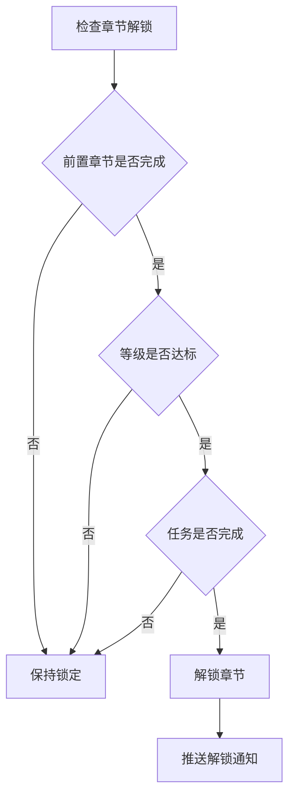

# 章节模块完整说明

## 一、模块概述

### 1.1 业务背景

章节模块是 K2C 游戏的关卡推进系统，将游戏内容按章节组织。玩家通过逐个通关关卡推进游戏进程，解锁新的内容和玩法。章节系统与主线任务紧密配合，引导玩家了解游戏的各个系统。

### 1.2 目标用户

- **所有玩家**：推进游戏进程的必经之路
- **剧情爱好者**：了解游戏故事背景
- **完成型玩家**：追求全关卡三星通关

### 1.3 核心价值

1. **游戏引导**：按章节引导玩家了解游戏
2. **进度展示**：清晰展示游戏进度
3. **内容解锁**：章节进度解锁新内容
4. **成就系统**：章节完成提供成就感

---

## 二、功能清单

### 2.1 章节管理功能

| 功能名称 | 功能描述 | 用户价值 |
|---------|---------|---------|
| 章节列表 | 显示所有章节信息 | 了解游戏结构 |
| 章节解锁 | 完成前置章节解锁 | 开启新内容 |
| 章节奖励 | 章节完成获得奖励 | 阶段性收益 |
| 章节进度 | 显示章节完成度 | 追踪进度 |

### 2.2 关卡管理功能

| 功能名称 | 功能描述 | 用户价值 |
|---------|---------|---------|
| 关卡进入 | 进入关卡开始挑战 | 推进进度 |
| 关卡三星 | 获得三星评价 | 追求完美 |
| 关卡奖励 | 通关获得奖励 | 获取资源 |
| 关卡扫荡 | 快速完成关卡 | 节省时间 |

### 2.3 剧情系统功能

| 功能名称 | 功能描述 | 用户价值 |
|---------|---------|---------|
| 剧情播放 | 播放关卡剧情动画 | 了解故事 |
| 剧情回顾 | 回顾已看过的剧情 | 重温剧情 |
| 剧情跳过 | 跳过剧情直接战斗 | 快速推进 |

---

## 三、业务流程详解

### 3.1 章节推进流程

```mermaid
flowchart TD
    A[进入章节界面] --> B[显示章节列表]
    B --> C{选择章节}
    C --> D[显示章节关卡]
    D --> E{选择关卡}
    E --> F{检查解锁条件}
    F -->|未解锁| G[提示解锁条件]
    F -->|已解锁| H{检查体力}
    H -->|体力不足| I[提示体力不足]
    H -->|体力充足| J[进入关卡]
    J --> K[播放剧情(如有)]
    K --> L[开始战斗]
    L --> M{战斗结果}
    M -->|胜利| N[计算星级]
    N --> O{是否首通}
    O -->|是| P[解锁下一关]
    O -->|否| Q[返回关卡列表]
    P --> R{是否章节完成}
    R -->|是| S[发放章节奖励]
    R -->|否| Q
    S --> Q
    M -->|失败| T[返回重试]
```

**详细步骤说明**：

1. **章节选择**
   - 显示所有章节列表
   - 标识已解锁/未解锁状态
   - 显示章节完成进度

2. **关卡选择**
   - 显示章节内所有关卡
   - 显示关卡星级和推荐战力
   - 标识已解锁/未解锁关卡

3. **战斗执行**
   - 消耗体力进入关卡
   - 播放剧情（首通时）
   - 执行战斗计算

4. **进度更新**
   - 更新关卡通关状态
   - 检查是否解锁下一关
   - 检查是否完成章节

### 3.2 章节解锁流程



---

## 四、关键规则

### 4.1 章节解锁规则

1. **前置章节**：必须完成前一章节
2. **等级要求**：达到指定等级解锁
3. **任务要求**：完成指定任务解锁
4. **特殊条件**：某些章节需要特殊条件

### 4.2 关卡解锁规则

1. **顺序解锁**：通常按顺序解锁关卡
2. **前置条件**：前一关卡获得至少1星
3. **支线关卡**：某些支线关卡独立解锁
4. **隐藏关卡**：满足隐藏条件解锁

### 4.3 星级评价规则

1. **一星**：通关关卡
2. **二星**：指定回合内通关
3. **三星**：全员存活且达成特殊条件

### 4.4 章节奖励规则

1. **通关奖励**：通关所有关卡获得
2. **星级奖励**：累计星级达到阈值获得
3. **完美奖励**：所有关卡三星获得

---

## 五、用户故事

### 5.1 新手玩家故事

> 作为一名新手玩家，我刚进入游戏，第一章引导我了解基本操作。每个关卡都有简单的剧情，让我了解了游戏的故事背景。完成第一章后，我解锁了英雄招募功能，获得了更多英雄。

### 5.2 完成型玩家故事

> 作为一名追求完美的玩家，我不满足于仅仅通关，而是要获得所有关卡的三星评价。我仔细研究每个关卡的特殊条件，调整阵容和策略。终于，我完成了第五章的所有三星，获得了完美通关奖励。

### 5.3 剧情爱好者故事

> 作为一名喜欢剧情的玩家，我特别关注每个关卡的剧情动画。游戏的故事很吸引人，我经常在剧情回顾功能中重温之前看过的剧情。章节完成时的剧情高潮让我很期待后续内容。

---

## 六、示例

### 6.1 章节信息示例

**章节配置**：
```
章节ID：1
章节名称：初入江湖
关卡数量：10
解锁条件：玩家等级1
完成奖励：钻石×100、银两×5000
完美奖励：钻石×200、稀有英雄碎片×10
```

### 6.2 关卡信息示例

**关卡配置**：
```
关卡ID：1-1
关卡名称：初试身手
推荐战力：5,000
体力消耗：6
星级条件：
  - 一星：通关
  - 二星：5回合内通关
  - 三星：全员存活
```

### 6.3 章节进度示例

**玩家进度**：
```
当前章节：第3章
当前关卡：3-5
章节完成度：40%
累计星级：25/30
```

---

*文档生成时间: 2026-04-06*
