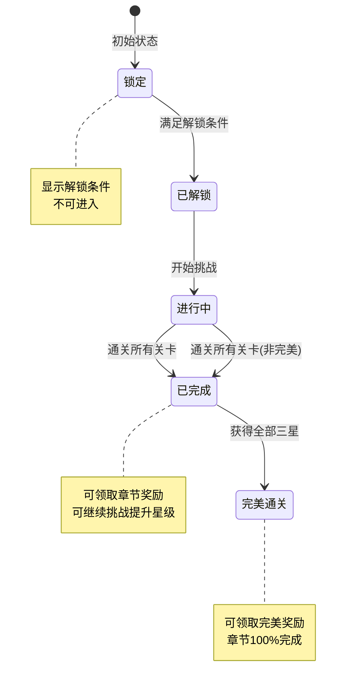
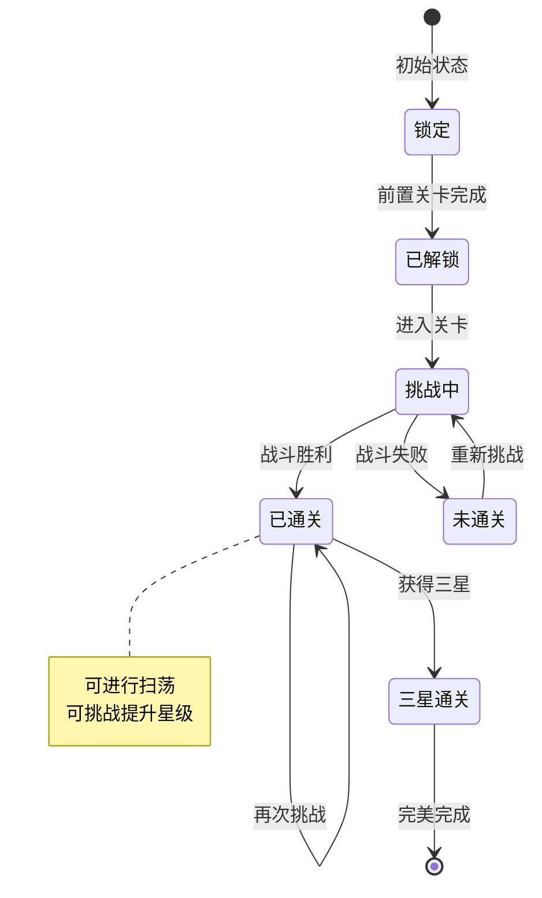

# 章节模块实现细节

## 一、计算公式

### 1.1 章节完成度计算

```
章节完成度 = 已通关关卡数 / 总关卡数 × 100%
```

**示例**：
```
章节总关卡：10
已通关关卡：8
完成度 = 8 / 10 × 100% = 80%
```

### 1.2 累计星级计算

```
累计星级 = Σ(每个关卡的最高星级)
最高星级 = max(历史星级, 本次获得星级)
```

### 1.3 完美评价计算

```
完美评价 = 累计星级 == 总关卡数 × 3
```

### 1.4 关卡推荐战力计算

```
推荐战力 = 基础战力 × (1 + 章节系数 × (章节序号 - 1))
```

**示例**：
```
基础战力：5,000
章节系数：0.5
第3章关卡：
推荐战力 = 5000 × (1 + 0.5 × 2) = 5000 × 2 = 10,000
```

---

## 二、状态机定义

### 2.1 章节状态机



### 2.2 关卡状态机



---

## 三、数据约束

### 3.1 章节配置数据约束

| 字段名 | 数据类型 | 取值范围 | 必填 | 说明 |
|--------|----------|----------|------|------|
| chapterId | long | > 0 | 是 | 章节ID |
| name | string | 非空 | 是 | 章节名称 |
| levelCount | int | > 0 | 是 | 关卡数量 |
| unlockLevel | int | >= 1 | 是 | 解锁等级 |
| preChapter | long | >= 0 | 是 | 前置章节ID |
| completeReward | object | - | 是 | 完成奖励 |
| perfectReward | object | - | 是 | 完美奖励 |

### 3.2 关卡配置数据约束

| 字段名 | 数据类型 | 取值范围 | 必填 | 说明 |
|--------|----------|----------|------|------|
| levelId | long | > 0 | 是 | 关卡ID |
| chapterId | long | > 0 | 是 | 所属章节ID |
| name | string | 非空 | 是 | 关卡名称 |
| order | int | >= 1 | 是 | 关卡顺序 |
| energyCost | int | > 0 | 是 | 体力消耗 |
| recommendedPower | long | > 0 | 是 | 推荐战力 |
| starConditions | array | 长度=3 | 是 | 三星条件 |

### 3.3 玩家章节进度数据约束

| 字段名 | 数据类型 | 取值范围 | 必填 | 说明 |
|--------|----------|----------|------|------|
| playerId | long | > 0 | 是 | 玩家ID |
| chapterId | long | > 0 | 是 | 章节ID |
| status | int | 0-3 | 是 | 状态：0锁定,1解锁,2完成,3完美 |
| totalStars | int | 0-N | 是 | 累计星级 |
| completeTime | datetime | - | 否 | 完成时间 |
| perfectTime | datetime | - | 否 | 完美时间 |

### 3.4 玩家关卡进度数据约束

| 字段名 | 数据类型 | 取值范围 | 必填 | 说明 |
|--------|----------|----------|------|------|
| playerId | long | > 0 | 是 | 玩家ID |
| levelId | long | > 0 | 是 | 关卡ID |
| stars | int | 0-3 | 是 | 最高星级 |
| challengeCount | int | >= 0 | 是 | 挑战次数 |
| firstClearTime | datetime | - | 否 | 首通时间 |
| lastChallengeTime | datetime | - | 否 | 最后挑战时间 |

---

## 四、错误处理策略

### 4.1 章节模块错误码

| 错误码 | 错误信息 | 处理策略 | 用户提示 |
|--------|----------|----------|----------|
| 16001 | 章节不存在 | 检查章节配置 | "章节数据异常" |
| 16002 | 章节未解锁 | 显示解锁条件 | "章节尚未解锁" |
| 16003 | 关卡不存在 | 检查关卡配置 | "关卡数据异常" |
| 16004 | 关卡未解锁 | 显示解锁条件 | "关卡尚未解锁" |
| 16005 | 前置关卡未完成 | 引导完成前置 | "请先完成前置关卡" |
| 16006 | 奖励已领取 | 跳过重复领取 | "奖励已领取" |
| 16007 | 剧情未解锁 | 引导通关解锁 | "请先通关关卡" |

---

## 五、关键代码示例

### 5.1 章节解锁检查伪代码

```csharp
public bool CheckChapterUnlock(long playerId, long chapterId)
{
    ChapterRefObj chapterRef = GetChapterRef(chapterId);
    if (chapterRef == null) return false;

    // 检查等级
    PlayerInfo player = playerService.GetPlayer(playerId);
    if (player.level < chapterRef.unlockLevel) return false;

    // 检查前置章节
    if (chapterRef.preChapter > 0)
    {
        ChapterProgress preProgress = chapterService.GetProgress(playerId, chapterRef.preChapter);
        if (preProgress == null || preProgress.status < ChapterStatus.Completed)
            return false;
    }

    // 检查任务条件
    if (chapterRef.unlockQuest > 0)
    {
        QuestProgress questProgress = questService.GetProgress(playerId, chapterRef.unlockQuest);
        if (questProgress == null || questProgress.status != QuestStatus.Claimed)
            return false;
    }

    return true;
}
```

### 5.2 关卡通关处理伪代码

```csharp
public Result OnLevelClear(long playerId, long levelId, BattleResult battleResult)
{
    // 1. 获取关卡配置
    LevelRefObj levelRef = GetLevelRef(levelId);
    ChapterRefObj chapterRef = GetChapterRef(levelRef.chapterId);

    // 2. 计算星级
    int stars = CalculateStars(battleResult, levelRef.starConditions);

    // 3. 更新关卡进度
    LevelProgress progress = chapterService.GetLevelProgress(playerId, levelId);
    if (progress == null)
    {
        progress = new LevelProgress {
            playerId = playerId,
            levelId = levelId,
            stars = 0,
            challengeCount = 0
        };
    }

    bool newRecord = stars > progress.stars;
    if (newRecord)
    {
        progress.stars = stars;
    }
    progress.challengeCount++;
    if (progress.firstClearTime == null)
    {
        progress.firstClearTime = DateTime.Now;
    }
    progress.lastChallengeTime = DateTime.Now;
    chapterService.UpdateLevelProgress(progress);

    // 4. 检查是否解锁下一关
    LevelRefObj nextLevel = GetNextLevel(levelId);
    if (nextLevel != null && stars >= 1)
    {
        UnlockLevel(playerId, nextLevel.levelId);
    }

    // 5. 更新章节进度
    UpdateChapterProgress(playerId, levelRef.chapterId);

    // 6. 检查章节是否完成
    ChapterProgress chapterProgress = chapterService.GetProgress(playerId, levelRef.chapterId);
    if (chapterProgress.status == ChapterStatus.Completed && !chapterProgress.rewardClaimed)
    {
        // 推送章节完成通知
        PushChapterComplete(playerId, chapterRef);
    }

    // 7. 检查是否完美通关
    if (IsPerfectClear(playerId, levelRef.chapterId))
    {
        chapterProgress.status = ChapterStatus.Perfect;
        chapterProgress.perfectTime = DateTime.Now;
        chapterService.UpdateProgress(chapterProgress);
        PushPerfectClear(playerId, chapterRef);
    }

    return Result.Success(new { stars, newRecord });
}
```

### 5.3 章节奖励领取伪代码

```csharp
public Result ClaimChapterReward(long playerId, long chapterId, int rewardType)
{
    // 1. 获取章节配置
    ChapterRefObj chapterRef = GetChapterRef(chapterId);
    if (chapterRef == null)
        return Result.Error(16001, "章节不存在");

    // 2. 获取进度
    ChapterProgress progress = chapterService.GetProgress(playerId, chapterId);
    if (progress == null)
        return Result.Error(16002, "章节未解锁");

    // 3. 检查奖励类型
    List<RewardItem> rewards = null;
    if (rewardType == 1) // 完成奖励
    {
        if (progress.status < ChapterStatus.Completed)
            return Result.Error(16002, "章节未完成");
        if (progress.completeRewardClaimed)
            return Result.Error(16006, "奖励已领取");
        rewards = chapterRef.completeReward;
        progress.completeRewardClaimed = true;
    }
    else if (rewardType == 2) // 完美奖励
    {
        if (progress.status < ChapterStatus.Perfect)
            return Result.Error(16002, "未达成完美通关");
        if (progress.perfectRewardClaimed)
            return Result.Error(16006, "奖励已领取");
        rewards = chapterRef.perfectReward;
        progress.perfectRewardClaimed = true;
    }

    // 4. 发放奖励
    bagService.AddItems(playerId, rewards);

    // 5. 更新进度
    chapterService.UpdateProgress(progress);

    // 6. 推送领取结果
    PushRewardClaimed(playerId, chapterId, rewardType, rewards);

    return Result.Success(rewards);
}
```

---

## 六、性能优化建议

### 6.1 缓存策略

1. **章节配置缓存**：全量加载章节和关卡配置
2. **进度缓存**：玩家进度缓存到 Redis
3. **星级统计缓存**：章节累计星级缓存

### 6.2 数据库优化

1. **分表策略**：按玩家ID分表存储进度
2. **索引设计**：(playerId, chapterId/levelId) 复合索引
3. **批量查询**：一次查询整个章节进度

---

*文档生成时间: 2026-04-06*
