# 章节模块实现细节

## 一、计算公式

### 1.1 章节完成度计算

```
章节完成度 = 已通关关卡数 / 总关卡数 × 100%
```

**示例**：
```
章节总关卡：10
已通关关卡：8
完成度 = 8 / 10 × 100% = 80%
```

### 1.2 累计星级计算

```
累计星级 = Σ(每个关卡的最高星级)
最高星级 = max(历史星级, 本次获得星级)
```

### 1.3 完美评价计算

```
完美评价 = 累计星级 == 总关卡数 × 3
```

### 1.4 关卡推荐战力计算

```
推荐战力 = 基础战力 × (1 + 章节系数 × (章节序号 - 1))
```

**示例**：
```
基础战力：5,000
章节系数：0.5
第3章关卡：
推荐战力 = 5000 × (1 + 0.5 × 2) = 5000 × 2 = 10,000
```

---

## 二、状态机定义

### 2.1 章节状态机

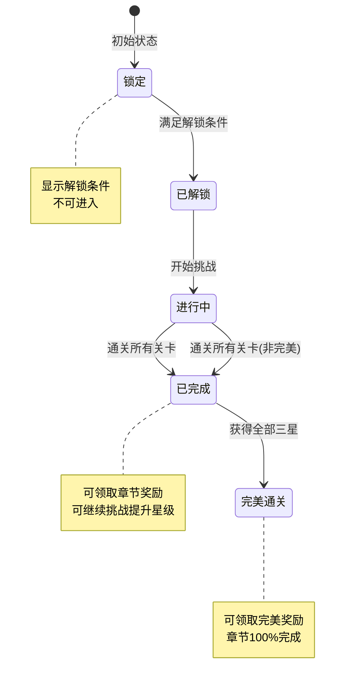

### 2.2 关卡状态机

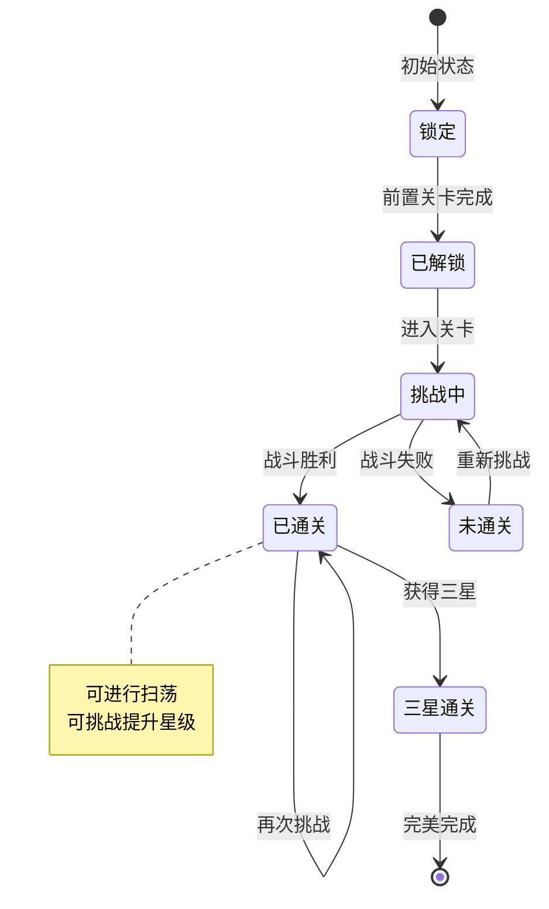

---

## 三、数据约束

### 3.1 章节配置数据约束

| 字段名 | 数据类型 | 取值范围 | 必填 | 说明 |
|--------|----------|----------|------|------|
| chapterId | long | > 0 | 是 | 章节ID |
| name | string | 非空 | 是 | 章节名称 |
| levelCount | int | > 0 | 是 | 关卡数量 |
| unlockLevel | int | >= 1 | 是 | 解锁等级 |
| preChapter | long | >= 0 | 是 | 前置章节ID |
| completeReward | object | - | 是 | 完成奖励 |
| perfectReward | object | - | 是 | 完美奖励 |

### 3.2 关卡配置数据约束

| 字段名 | 数据类型 | 取值范围 | 必填 | 说明 |
|--------|----------|----------|------|------|
| levelId | long | > 0 | 是 | 关卡ID |
| chapterId | long | > 0 | 是 | 所属章节ID |
| name | string | 非空 | 是 | 关卡名称 |
| order | int | >= 1 | 是 | 关卡顺序 |
| energyCost | int | > 0 | 是 | 体力消耗 |
| recommendedPower | long | > 0 | 是 | 推荐战力 |
| starConditions | array | 长度=3 | 是 | 三星条件 |

### 3.3 玩家章节进度数据约束

| 字段名 | 数据类型 | 取值范围 | 必填 | 说明 |
|--------|----------|----------|------|------|
| playerId | long | > 0 | 是 | 玩家ID |
| chapterId | long | > 0 | 是 | 章节ID |
| status | int | 0-3 | 是 | 状态：0锁定,1解锁,2完成,3完美 |
| totalStars | int | 0-N | 是 | 累计星级 |
| completeTime | datetime | - | 否 | 完成时间 |
| perfectTime | datetime | - | 否 | 完美时间 |

### 3.4 玩家关卡进度数据约束

| 字段名 | 数据类型 | 取值范围 | 必填 | 说明 |
|--------|----------|----------|------|------|
| playerId | long | > 0 | 是 | 玩家ID |
| levelId | long | > 0 | 是 | 关卡ID |
| stars | int | 0-3 | 是 | 最高星级 |
| challengeCount | int | >= 0 | 是 | 挑战次数 |
| firstClearTime | datetime | - | 否 | 首通时间 |
| lastChallengeTime | datetime | - | 否 | 最后挑战时间 |

---

## 四、错误处理策略

### 4.1 章节模块错误码

| 错误码 | 错误信息 | 处理策略 | 用户提示 |
|--------|----------|----------|----------|
| 16001 | 章节不存在 | 检查章节配置 | "章节数据异常" |
| 16002 | 章节未解锁 | 显示解锁条件 | "章节尚未解锁" |
| 16003 | 关卡不存在 | 检查关卡配置 | "关卡数据异常" |
| 16004 | 关卡未解锁 | 显示解锁条件 | "关卡尚未解锁" |
| 16005 | 前置关卡未完成 | 引导完成前置 | "请先完成前置关卡" |
| 16006 | 奖励已领取 | 跳过重复领取 | "奖励已领取" |
| 16007 | 剧情未解锁 | 引导通关解锁 | "请先通关关卡" |

---

## 五、关键代码示例

### 5.1 章节解锁检查伪代码

```csharp
public bool CheckChapterUnlock(long playerId, long chapterId)
{
    ChapterRefObj chapterRef = GetChapterRef(chapterId);
    if (chapterRef == null) return false;

    // 检查等级
    PlayerInfo player = playerService.GetPlayer(playerId);
    if (player.level < chapterRef.unlockLevel) return false;

    // 检查前置章节
    if (chapterRef.preChapter > 0)
    {
        ChapterProgress preProgress = chapterService.GetProgress(playerId, chapterRef.preChapter);
        if (preProgress == null || preProgress.status < ChapterStatus.Completed)
            return false;
    }

    // 检查任务条件
    if (chapterRef.unlockQuest > 0)
    {
        QuestProgress questProgress = questService.GetProgress(playerId, chapterRef.unlockQuest);
        if (questProgress == null || questProgress.status != QuestStatus.Claimed)
            return false;
    }

    return true;
}
```

### 5.2 关卡通关处理伪代码

```csharp
public Result OnLevelClear(long playerId, long levelId, BattleResult battleResult)
{
    // 1. 获取关卡配置
    LevelRefObj levelRef = GetLevelRef(levelId);
    ChapterRefObj chapterRef = GetChapterRef(levelRef.chapterId);

    // 2. 计算星级
    int stars = CalculateStars(battleResult, levelRef.starConditions);

    // 3. 更新关卡进度
    LevelProgress progress = chapterService.GetLevelProgress(playerId, levelId);
    if (progress == null)
    {
        progress = new LevelProgress {
            playerId = playerId,
            levelId = levelId,
            stars = 0,
            challengeCount = 0
        };
    }

    bool newRecord = stars > progress.stars;
    if (newRecord)
    {
        progress.stars = stars;
    }
    progress.challengeCount++;
    if (progress.firstClearTime == null)
    {
        progress.firstClearTime = DateTime.Now;
    }
    progress.lastChallengeTime = DateTime.Now;
    chapterService.UpdateLevelProgress(progress);

    // 4. 检查是否解锁下一关
    LevelRefObj nextLevel = GetNextLevel(levelId);
    if (nextLevel != null && stars >= 1)
    {
        UnlockLevel(playerId, nextLevel.levelId);
    }

    // 5. 更新章节进度
    UpdateChapterProgress(playerId, levelRef.chapterId);

    // 6. 检查章节是否完成
    ChapterProgress chapterProgress = chapterService.GetProgress(playerId, levelRef.chapterId);
    if (chapterProgress.status == ChapterStatus.Completed && !chapterProgress.rewardClaimed)
    {
        // 推送章节完成通知
        PushChapterComplete(playerId, chapterRef);
    }

    // 7. 检查是否完美通关
    if (IsPerfectClear(playerId, levelRef.chapterId))
    {
        chapterProgress.status = ChapterStatus.Perfect;
        chapterProgress.perfectTime = DateTime.Now;
        chapterService.UpdateProgress(chapterProgress);
        PushPerfectClear(playerId, chapterRef);
    }

    return Result.Success(new { stars, newRecord });
}
```

### 5.3 章节奖励领取伪代码

```csharp
public Result ClaimChapterReward(long playerId, long chapterId, int rewardType)
{
    // 1. 获取章节配置
    ChapterRefObj chapterRef = GetChapterRef(chapterId);
    if (chapterRef == null)
        return Result.Error(16001, "章节不存在");

    // 2. 获取进度
    ChapterProgress progress = chapterService.GetProgress(playerId, chapterId);
    if (progress == null)
        return Result.Error(16002, "章节未解锁");

    // 3. 检查奖励类型
    List<RewardItem> rewards = null;
    if (rewardType == 1) // 完成奖励
    {
        if (progress.status < ChapterStatus.Completed)
            return Result.Error(16002, "章节未完成");
        if (progress.completeRewardClaimed)
            return Result.Error(16006, "奖励已领取");
        rewards = chapterRef.completeReward;
        progress.completeRewardClaimed = true;
    }
    else if (rewardType == 2) // 完美奖励
    {
        if (progress.status < ChapterStatus.Perfect)
            return Result.Error(16002, "未达成完美通关");
        if (progress.perfectRewardClaimed)
            return Result.Error(16006, "奖励已领取");
        rewards = chapterRef.perfectReward;
        progress.perfectRewardClaimed = true;
    }

    // 4. 发放奖励
    bagService.AddItems(playerId, rewards);

    // 5. 更新进度
    chapterService.UpdateProgress(progress);

    // 6. 推送领取结果
    PushRewardClaimed(playerId, chapterId, rewardType, rewards);

    return Result.Success(rewards);
}
```

---

## 六、性能优化建议

### 6.1 缓存策略

1. **章节配置缓存**：全量加载章节和关卡配置
2. **进度缓存**：玩家进度缓存到 Redis
3. **星级统计缓存**：章节累计星级缓存

### 6.2 数据库优化

1. **分表策略**：按玩家ID分表存储进度
2. **索引设计**：(playerId, chapterId/levelId) 复合索引
3. **批量查询**：一次查询整个章节进度

---

---

## 七、核心算法详解

### 7.1 战力需求计算算法

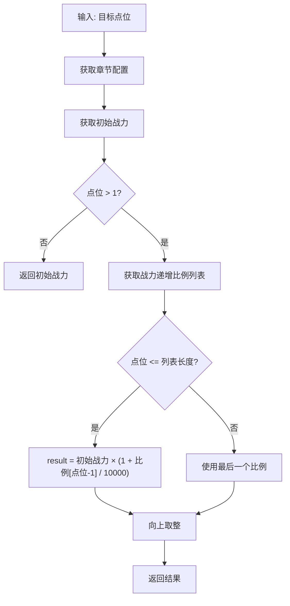

**算法实现**：
```csharp
public long calNeedPower(int _point)
{
    if (null == powerAddRate)
        return initial_power;

    if (_point < 1 || _point > point_count || _point > powerAddRate.Count)
        return initial_power;

    return (long)math.ceil((double)initial_power * (10000 + powerAddRate[_point - 1]) / 10000);
}
```

### 7.2 金币消耗计算算法

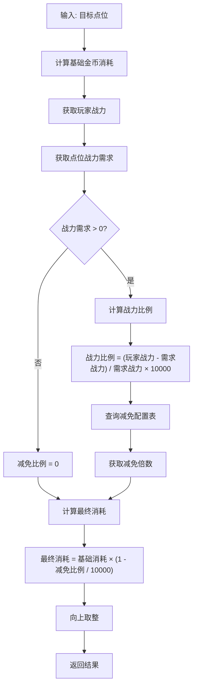

**算法实现**：
```java
public ResultOne<Long> calGoldCost(RefChapter _ref, int _point)
{
    // 计算基础金币消耗
    ResultOne<Double> goldCostResult = _ref.calNeedCost(_point);
    if (!goldCostResult.isSucc())
        return ResultOne.failed(goldCostResult.getResult());
    double baseGoldCost = goldCostResult.getData();

    // 计算战力比例
    ResultOne<Long> powerRateResult = getPowerRate(_ref, _point);
    if (!powerRateResult.isSucc())
        return powerRateResult;
    long powerRate = powerRateResult.getData();

    // 金币消耗减免倍数
    int costMultipleRate = RefChapterCost.getMgr().getCostMultipleRate((int) powerRate);

    // 计算最终金币消耗
    long finalCost = (long) Math.ceil(
        baseGoldCost * (1 - costMultipleRate / 10000d * powerRate / 10000d));

    return ResultOne.succ(finalCost);
}

private ResultOne<Long> getPowerRate(RefChapter _ref, int _point)
{
    long needPower = _ref.calNeedPower(_point);
    if (needPower <= 0)
        return ResultOne.succ(0L);

    long playerPower = _m_comp.getUserData().getHeroComponent().getTotalPower();
    long powerRate = (playerPower - needPower) * 10000 / needPower;

    return ResultOne.succ(Math.max(0, powerRate));
}
```

### 7.3 暴击计算算法

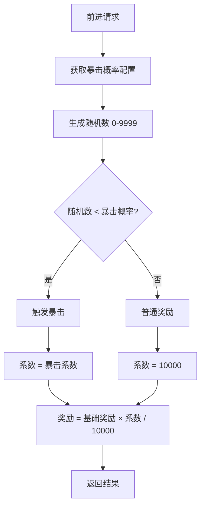

**算法实现**：
```java
// 计算是否暴击
int coefficient = 10000;
boolean isCrit = false;

if (CommonFunc.randomInt(10000) < ref.crit_probability)
{
    isCrit = true;
    coefficient = RefGeneral.Ref().critical_hit_coefficient;
}

// 计算奖励
long rewardExp = rewardExpResult.getData() * coefficient / 10000;
```

---

## 八、数据结构详解

### 8.1 章节数据结构

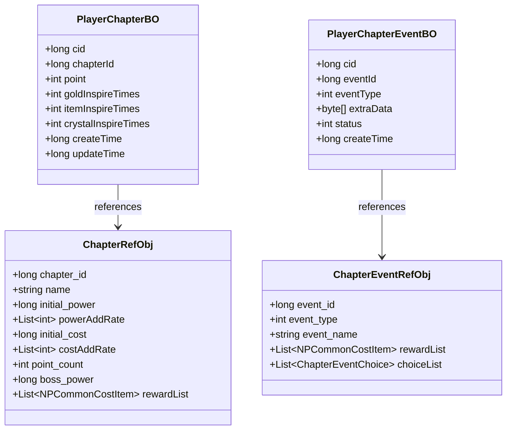

### 8.2 协议数据结构

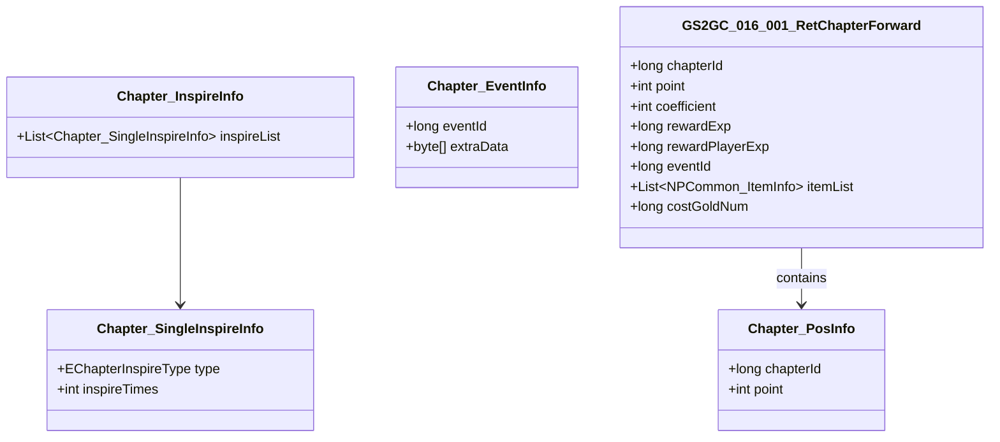

---

## 九、关键代码实现

### 9.1 客户端状态机实现

```csharp
/// <summary>
/// 关卡状态机
/// </summary>
public class ChapterStateMachine
{
    private _AChapterBaseState _curState;
    private ChapterStateFactory _factory;

    public _AChapterBaseState curState => _curState;

    public ChapterStateMachine(ChapterStateFactory _factory)
    {
        this._factory = _factory;
    }

    public void changeState<T>() where T : _AChapterBaseState
    {
        var newState = _factory.getState<T>();
        if (newState == null) return;

        if (_curState != null)
        {
            _curState.exit();
        }

        _curState = newState;
        _curState.enter();
    }

    public void tick()
    {
        _curState?.tick();
    }
}

/// <summary>
/// 空闲状态
/// </summary>
public class IdleState : _AChapterBaseState
{
    public IdleState(ChapterForwardLogicMgr _mgr) : base(_mgr, EChapterForwardType.IDLE) { }

    public override void enter()
    {
        _mgr.effectInterface?.chgIdleEffect();
        checkDialog();
        checkEvent();
    }

    private void checkDialog()
    {
        // 检查是否需要播放对话
        long dialogId = getCurDialogId();
        if (dialogId > 0)
        {
            _mgr.stateMachine.changeState<DialogState>();
        }
    }

    private void checkEvent()
    {
        long eventId = NPPlayer.instance.chapterComp.curChapterEventId;
        if (eventId > 0)
        {
            _mgr.stateMachine.changeState<DealEventState>();
        }
    }

    private long getCurDialogId()
    {
        // 获取当前点位对话ID
        return 0;
    }
}

/// <summary>
/// 一次前进状态
/// </summary>
public class OnceForwardState : _AChapterBaseState
{
    public OnceForwardState(ChapterForwardLogicMgr _mgr) : base(_mgr, EChapterForwardType.ONCE_FORWARD) { }

    public override void enter()
    {
        NPPlayer.instance.chapterComp.reqChapterForward(_mgr.isInQuickForward, (result) =>
        {
            dealForwardResult(result);
        }, () =>
        {
            _mgr.stateMachine.changeState<IdleState>();
        });
    }

    private void dealForwardResult(GS2GC_016_001_RetChapterForward result)
    {
        if (result.getEventId() > 0)
        {
            _mgr.stateMachine.changeState<DealEventState>();
            return;
        }

        if (NPPlayer.instance.chapterComp.curIsBossPoint())
        {
            _mgr.stateMachine.changeState<NodeMoveBossState>();
            return;
        }

        _mgr.stateMachine.changeState<NodeMoveNormalState>();
    }
}
```

### 9.2 服务端事件处理实现

```java
/**
 * 奖励事件处理
 */
public class ChapterEvent_Reward extends _AChapterEvent
{
    private List<NPCommonCostItem> _m_rewardList;

    @Override
    public EChapterEventType getEventType()
    {
        return EChapterEventType.REWARD;
    }

    @Override
    public Result dealEvent(NPPlayerContext _context)
    {
        // 发放奖励
        _m_chapterInfo.getComponent().getUserData().gainItemList(_m_rewardList, _context);

        // 删除事件数据
        _m_bo.delete(_m_chapterInfo.getComponent().getUSServer().getBM());

        // 销毁事件
        _m_chapterInfo.disposeEvent(this, _context);

        return Result.SUCC;
    }

    @Override
    public Chapter_EventInfo makeInfo()
    {
        Chapter_EventInfo info = new Chapter_EventInfo();
        info.setEventId(_m_ref.Id());
        // 序列化奖励列表到extraData
        return info;
    }
}

/**
 * 选择事件处理
 */
public class ChapterEvent_Choice extends _AChapterEvent
{
    private List<ChapterEventChoice> _m_choiceList;
    private long _m_selectedOptionId;

    @Override
    public EChapterEventType getEventType()
    {
        return EChapterEventType.CHOICE;
    }

    public Result dealChoiceEvent(long _optionId, NPPlayerContext _context)
    {
        // 查找选项
        ChapterEventChoice selected = null;
        for (ChapterEventChoice choice : _m_choiceList)
        {
            if (choice.choiceId == _optionId)
            {
                selected = choice;
                break;
            }
        }

        if (selected == null)
            return Result.failed(ChapterErr.CHAPTER_EVENT_OPTION_NOT_FOUND);

        // 发放选中奖励
        _m_chapterInfo.getComponent().getUserData().gainItemList(
            selected.rewardList, _context);

        // 删除事件数据
        _m_bo.delete(_m_chapterInfo.getComponent().getUSServer().getBM());

        // 销毁事件
        _m_chapterInfo.disposeEvent(this, _context);

        return Result.SUCC;
    }
}

/**
 * 派遣事件处理
 */
public class ChapterEvent_Dispatch extends _AChapterEvent
{
    private long _m_dispatchId;
    private long _m_endTime;
    private List<Long> _m_dispatchHeroList;

    @Override
    public EChapterEventType getEventType()
    {
        return EChapterEventType.DISPATCH;
    }

    public Result dealDispatchEvent(List<Long> _heroList, NPPlayerContext _context)
    {
        RefChapterEvent ref = getRef();

        // 验证派遣数量
        if (_heroList.size() != ref.dispatch_hero_count)
            return Result.failed(ChapterErr.CHAPTER_DISPATCH_COUNT_ERROR);

        // 验证战力
        long totalPower = 0;
        for (Long heroId : _heroList)
        {
            HeroInfo hero = _m_chapterInfo.getComponent().getUserData()
                .getHeroComponent().getHeroInfo(heroId);
            if (hero == null)
                return Result.failed(ChapterErr.CHAPTER_DISPATCH_HERO_NOT_FOUND);
            totalPower += hero.getPower();
        }

        if (totalPower < ref.dispatch_power_require)
            return Result.failed(ChapterErr.CHAPTER_DISPATCH_POWER_NOT_ENOUGH);

        // 创建派遣记录
        _m_dispatchId = generateDispatchId();
        _m_endTime = System.currentTimeMillis() / 1000 + ref.dispatch_duration;
        _m_dispatchHeroList = _heroList;

        // 锁定大臣
        for (Long heroId : _heroList)
        {
            _m_chapterInfo.getComponent().getUserData()
                .getHeroComponent().lockHero(heroId);
        }

        // 保存事件数据
        saveEventData();

        return Result.SUCC;
    }

    public Result completeDispatch(NPPlayerContext _context)
    {
        // 检查是否到达结束时间
        if (System.currentTimeMillis() / 1000 < _m_endTime)
            return Result.failed(ChapterErr.CHAPTER_DISPATCH_NOT_COMPLETE);

        // 发放派遣奖励
        RefChapterEvent ref = getRef();
        _m_chapterInfo.getComponent().getUserData().gainItemList(
            ref.dispatchRewardList, _context);

        // 解锁大臣
        for (Long heroId : _m_dispatchHeroList)
        {
            _m_chapterInfo.getComponent().getUserData()
                .getHeroComponent().unlockHero(heroId);
        }

        // 删除事件数据
        _m_bo.delete(_m_chapterInfo.getComponent().getUSServer().getBM());

        // 销毁事件
        _m_chapterInfo.disposeEvent(this, _context);

        return Result.SUCC;
    }
}
```

---

## 十、性能优化实践

### 10.1 客户端优化

```csharp
/// <summary>
/// 对象池管理
/// </summary>
public class ChapterObjectPool
{
    private static Dictionary<Type, Stack<object>> _pools = new();

    public static T Get<T>() where T : class, new()
    {
        var type = typeof(T);
        if (_pools.TryGetValue(type, out var stack) && stack.Count > 0)
        {
            return stack.Pop() as T;
        }
        return new T();
    }

    public static void Put<T>(T obj) where T : class
    {
        if (obj == null) return;
        var type = typeof(T);
        if (!_pools.TryGetValue(type, out var stack))
        {
            stack = new Stack<object>();
            _pools[type] = stack;
        }
        stack.Push(obj);
    }
}

/// <summary>
/// 延迟加载管理
/// </summary>
public class ChapterLazyLoader
{
    private ChapterRefObj _chapterRef;
    private bool _isLoaded = false;

    public ChapterRefObj chapterRef
    {
        get
        {
            if (!_isLoaded)
            {
                _chapterRef = LoadChapterRef();
                _isLoaded = true;
            }
            return _chapterRef;
        }
    }

    private ChapterRefObj LoadChapterRef()
    {
        return GRefdataCoreMgr.instance.chapterRefCore.getRef(_chapterId);
    }
}
```

### 10.2 服务端优化

```java
/**
 * 批量查询优化
 */
public class ChapterBatchLoader
{
    /**
     * 批量加载章节配置
     */
    public Map<Long, RefChapter> batchLoadChapterRef(List<Long> _chapterIds)
    {
        Map<Long, RefChapter> result = new HashMap<>();

        // 从缓存批量获取
        List<String> keys = _chapterIds.stream()
            .map(id -> "chapter_ref:" + id)
            .collect(Collectors.toList());

        List<String> cachedValues = RedisManager.mget(keys);

        // 解析缓存数据并收集未命中ID
        List<Long> missedIds = new ArrayList<>();
        for (int i = 0; i < _chapterIds.size(); i++)
        {
            String value = cachedValues.get(i);
            if (value != null)
            {
                result.put(_chapterIds.get(i), JSON.parseObject(value, RefChapter.class));
            }
            else
            {
                missedIds.add(_chapterIds.get(i));
            }
        }

        // 从数据库加载未命中数据
        if (!missedIds.isEmpty())
        {
            List<RefChapter> dbResults = loadFromDB(missedIds);
            for (RefChapter ref : dbResults)
            {
                result.put(ref.chapter_id, ref);
                // 写入缓存
                RedisManager.setex("chapter_ref:" + ref.chapter_id, 3600, JSON.toJSONString(ref));
            }
        }

        return result;
    }
}
```

---

## 十一、测试用例

### 11.1 单元测试

```csharp
[TestFixture]
public class ChapterCalculationTests
{
    private ChapterRefObj _chapterRef;

    [SetUp]
    public void Setup()
    {
        _chapterRef = new ChapterRefObj
        {
            chapter_id = 1,
            name = "测试章节",
            initial_power = 1000,
            powerAddRate = new List<int> { 0, 500, 1000, 1500, 2000 },
            initial_cost = 100,
            costAddRate = new List<int> { 0, 100, 200, 300, 400 },
            point_count = 5,
            boss_power = 10000
        };
    }

    [Test]
    public void TestCalNeedPower()
    {
        // 点位1: 初始战力
        Assert.AreEqual(1000, _chapterRef.calNeedPower(1));

        // 点位2: 初始战力 * (1 + 500/10000) = 1000 * 1.05 = 1050
        Assert.AreEqual(1050, _chapterRef.calNeedPower(2));

        // 点位3: 初始战力 * (1 + 1000/10000) = 1000 * 1.1 = 1100
        Assert.AreEqual(1100, _chapterRef.calNeedPower(3));
    }

    [Test]
    public void TestCalNeedCost()
    {
        // 点位1: 初始消耗
        Assert.AreEqual(100, _chapterRef.calNeedCost(1));

        // 点位2: 初始消耗 * (1 + 100/10000) = 100 * 1.01 = 101
        Assert.AreEqual(101, _chapterRef.calNeedCost(2));

        // 点位3: 初始消耗 * (1 + 200/10000) = 100 * 1.02 = 102
        Assert.AreEqual(102, _chapterRef.calNeedCost(3));
    }

    [Test]
    public void TestInvalidPoint()
    {
        // 无效点位返回初始值
        Assert.AreEqual(1000, _chapterRef.calNeedPower(0));
        Assert.AreEqual(1000, _chapterRef.calNeedPower(6));
        Assert.AreEqual(100, _chapterRef.calNeedCost(0));
        Assert.AreEqual(100, _chapterRef.calNeedCost(6));
    }
}
```

### 11.2 集成测试

```csharp
[TestFixture]
public class ChapterIntegrationTests
{
    private PlayerChapterComponent _chapterComp;
    private Mock<INetworkService> _networkMock;

    [SetUp]
    public void Setup()
    {
        _chapterComp = new PlayerChapterComponent();
        _networkMock = new Mock<INetworkService>();
        // 初始化测试环境
    }

    [Test]
    public async Task TestForwardFlow()
    {
        // 准备测试数据
        _chapterComp.setCurChapterIdForTest(1);
        _chapterComp.setCurPointIdForTest(0);

        // 模拟服务器响应
        _networkMock.Setup(x => x.SendRequest(It.IsAny<byte[]>()))
            .ReturnsAsync(createMockForwardResponse());

        // 执行前进
        bool success = false;
        _chapterComp.reqChapterForward(false, (result) =>
        {
            success = true;
            Assert.AreEqual(1, result.getPoint());
        });

        // 等待异步完成
        await Task.Delay(100);

        Assert.IsTrue(success);
    }

    [Test]
    public async Task TestBossFightFlow()
    {
        // 准备Boss战测试环境
        _chapterComp.setCurChapterIdForTest(1);
        _chapterComp.setCurPointIdForTest(9); // Boss点

        // 模拟战力不足
        NPPlayer.instance.heroComponent.setTotalPowerForTest(5000);
        var chapterRef = _chapterComp.chapterRefObj;
        // chapterRef.boss_power = 10000

        // 尝试Boss战，应该失败
        bool failed = false;
        _chapterComp.reqChapterFightBoss(1, null, (errCode) =>
        {
            failed = true;
            Assert.AreEqual(30004, errCode); // 战力不足错误码
        });

        await Task.Delay(100);
        Assert.IsTrue(failed);
    }
}
```

---

## 十二、安全考虑

### 12.1 数据校验

```java
/**
 * 关卡请求数据校验
 */
public class ChapterRequestValidator
{
    /**
     * 校验前进请求
     */
    public static boolean validateForwardRequest(long _chapterId, int _targetPoint, NPUserData _userData)
    {
        // 章节ID有效性
        if (_chapterId <= 0)
        {
            USLog.warn(_userData.getServer(), "Invalid chapterId: {}", _chapterId);
            return false;
        }

        // 点位有效性
        if (_targetPoint < 0 || _targetPoint > 1000)
        {
            USLog.warn(_userData.getServer(), "Invalid targetPoint: {}", _targetPoint);
            return false;
        }

        // 章节配置存在性
        RefChapter ref = RefChapter.getMgr().get(_chapterId);
        if (ref == null)
        {
            USLog.warn(_userData.getServer(), "Chapter config not found: {}", _chapterId);
            return false;
        }

        // 点位范围校验
        if (_targetPoint > ref.point_count)
        {
            USLog.warn(_userData.getServer(), "TargetPoint exceeds limit: {} > {}",
                _targetPoint, ref.point_count);
            return false;
        }

        return true;
    }

    /**
     * 校验Boss战请求
     */
    public static boolean validateBossFightRequest(long _chapterId, NPUserData _userData)
    {
        // 基础校验
        if (!validateForwardRequest(_chapterId, 1, _userData))
            return false;

        // 获取玩家当前状态
        ChapterComponent comp = _userData.getChapterComponent();
        ChapterInfo info = comp.getCurChapterInfo();

        if (info == null)
        {
            USLog.warn(_userData.getServer(), "ChapterInfo is null");
            return false;
        }

        // 检查当前点位是否是Boss点
        RefChapter ref = info.getRef();
        int nextPoint = info.getPoint() + 1;

        if (nextPoint != ref.point_count)
        {
            USLog.warn(_userData.getServer(), "Not at boss point: {} != {}",
                nextPoint, ref.point_count);
            return false;
        }

        return true;
    }
}
```

### 12.2 防作弊检查

```java
/**
 * 关卡防作弊检查
 */
public class ChapterAntiCheatChecker
{
    // 请求间隔最小值（毫秒）
    private static final long MIN_REQUEST_INTERVAL = 200;

    // 同一章节最大前进次数（每分钟）
    private static final int MAX_FORWARD_PER_MINUTE = 30;

    /**
     * 检查请求频率
     */
    public static boolean checkRequestFrequency(long _cid, String _requestType)
    {
        String key = "chapter_req:" + _cid + ":" + _requestType;
        Long lastTime = RedisManager.get(key);

        if (lastTime != null)
        {
            long interval = System.currentTimeMillis() - lastTime;
            if (interval < MIN_REQUEST_INTERVAL)
            {
                USLog.warn(null, "Request too frequent: cid={}, type={}, interval={}",
                    _cid, _requestType, interval);
                return false;
            }
        }

        RedisManager.setex(key, 60, String.valueOf(System.currentTimeMillis()));
        return true;
    }

    /**
     * 检查前进频率
     */
    public static boolean checkForwardFrequency(long _cid)
    {
        String key = "chapter_forward_count:" + _cid;
        String countStr = RedisManager.get(key);

        int count = countStr == null ? 0 : Integer.parseInt(countStr);
        if (count >= MAX_FORWARD_PER_MINUTE)
        {
            USLog.warn(null, "Forward count exceeded: cid={}, count={}", _cid, count);
            return false;
        }

        RedisManager.incr(key);
        RedisManager.expire(key, 60);
        return true;
    }

    /**
     * 检查战力合法性
     */
    public static boolean checkPowerLegality(long _cid, long _reportedPower, long _actualPower)
    {
        // 允许一定误差（网络延迟等）
        long tolerance = _actualPower / 100; // 1%误差

        if (Math.abs(_reportedPower - _actualPower) > tolerance)
        {
            USLog.warn(null, "Power mismatch: cid={}, reported={}, actual={}",
                _cid, _reportedPower, _actualPower);
            return false;
        }

        return true;
    }
}
```

---

---

## 十三、系统调用链路图

### 13.1 前进调用链路

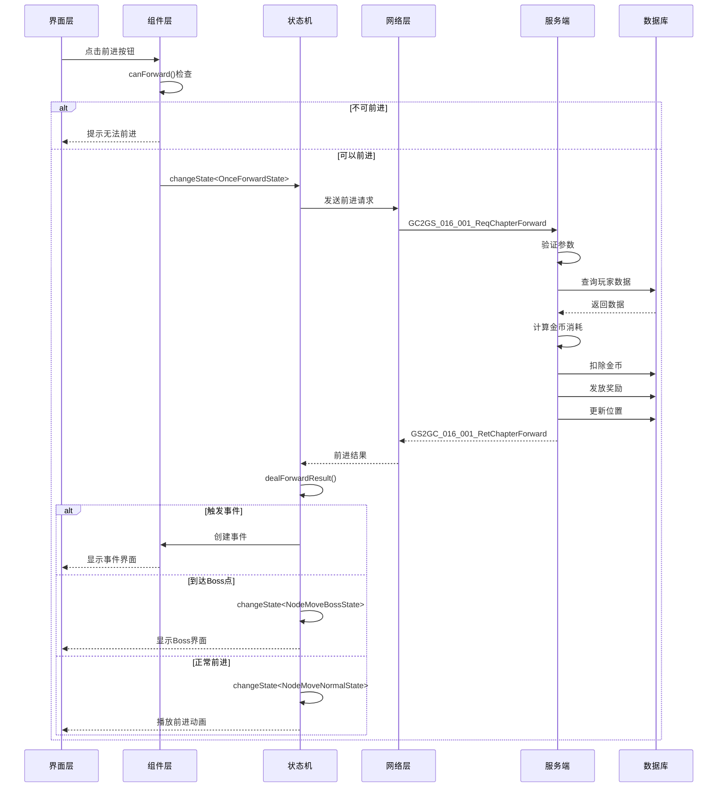

---

## 十四、数据结构详细定义

### 14.1 章节配置数据结构

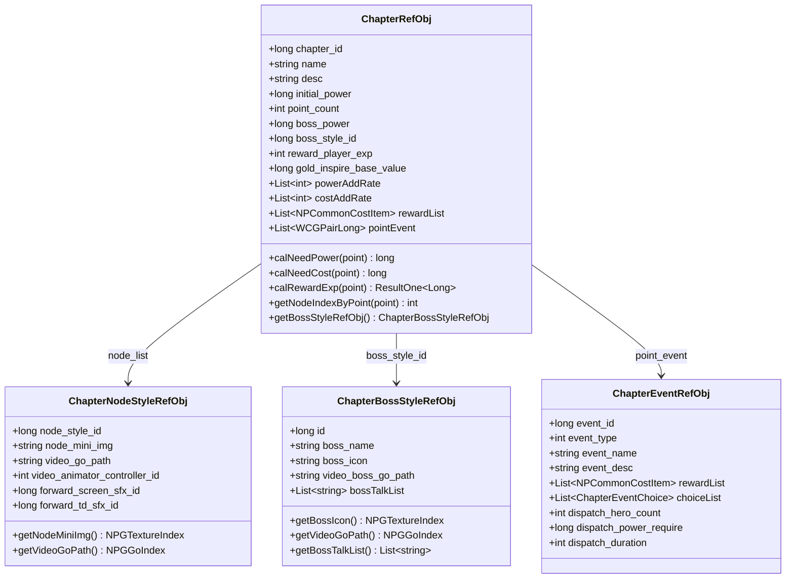

### 14.2 玩家数据结构

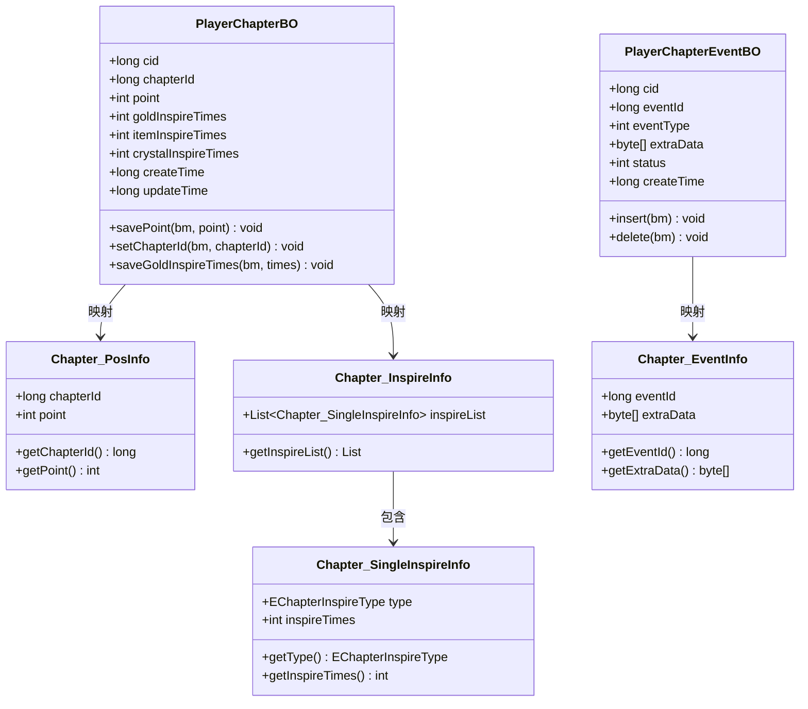

---

## 十五、协议数据结构详细定义

### 15.1 请求协议结构

```mermaid
classDiagram
    class GC2GS_016_001_ReqChapterForward {
        +long chapterId
        +int point
        +bool isAKey
        +PutUnzipBuf(buf) void
        +ReadUnzipBuf(buf, finalPos) void
        +GetBufSize() int
    }

    class GC2GS_016_002_ReqChapterFightBoss {
        +long chapterId
        +PutUnzipBuf(buf) void
        +ReadUnzipBuf(buf, finalPos) void
        +GetBufSize() int
    }

    class GC2GS_016_003_ReqChapterFightBossInspire {
        +EChapterInspireType type
        +PutUnzipBuf(buf) void
        +ReadUnzipBuf(buf, finalPos) void
        +GetBufSize() int
    }

    class GC2GS_016_005_ReqDealChapterChoiceEvent {
        +long optionId
        +PutUnzipBuf(buf) void
        +ReadUnzipBuf(buf, finalPos) void
        +GetBufSize() int
    }

    class GC2GS_016_006_ReqDealChapterDispatchEvent {
        +List~long~ heroList
        +PutUnzipBuf(buf) void
        +ReadUnzipBuf(buf, finalPos) void
        +GetBufSize() int
    }

    class GC2GS_016_007_ReqDrawChapterPlotReward {
        +List~long~ plotIdList
        +PutUnzipBuf(buf) void
        +ReadUnzipBuf(buf, finalPos) void
        +GetBufSize() int
    }
```

### 15.2 返回协议结构

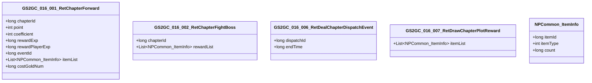

---

## 十六、枚举类型详细定义

### 16.1 枚举值定义

```csharp
/// <summary>
/// 鼓舞类型枚举
/// </summary>
public enum EChapterInspireType
{
    NONE = 0,       // 无
    GOLD = 1,       // 金币鼓舞
    CRYSTAL = 2,    // 水晶鼓舞
    ITEM = 3,       // 道具鼓舞
}

/// <summary>
/// 事件类型枚举
/// </summary>
public enum EChapterEventType
{
    NONE = 0,       // 无
    REWARD = 1,     // 奖励事件
    DISPATCH = 2,   // 大臣派遣事件
    CHOICE = 3,     // 选择事件
}

/// <summary>
/// 前进状态枚举
/// </summary>
public enum EChapterForwardType
{
    NONE = 0,               // 无状态
    IDLE = 1,               // 默认状态
    ONCE_FORWARD = 2,       // 一次前进
    FIGHT_BOSS = 3,         // 打Boss
    FIGHT_BOSS_PER = 4,     // Boss战前摇
    FIGHT_BOSS_WAIT = 5,    // Boss战等待连线
    DEAL_EVENT = 6,         // 处理事件
    DIALOG = 7,             // 处理对话
    NODE_MOVE_BOSS = 8,     // 节点移动到Boss表现
    NODE_MOVE_NORMAL = 9,   // 节点移动到节点表现
    CHAPTER_COMPLETE = 10,  // 章节完成表现
    AUTO_BATTLE = 11,       // 自动状态
}

/// <summary>
/// 章节状态枚举
/// </summary>
public enum EChapterStatus
{
    LOCKED = 0,     // 锁定
    UNLOCKED = 1,   // 已解锁
    IN_PROGRESS = 2,// 进行中
    COMPLETED = 3,  // 已完成
    PERFECT = 4,    // 完美通关
}

/// <summary>
/// 派遣状态枚举
/// </summary>
public enum EDispatchStatus
{
    NONE = 0,       // 无派遣
    IN_PROGRESS = 1,// 派遣中
    COMPLETED = 2,  // 派遣完成
    CLAIMED = 3,    // 已领取
}
```

---

## 十七、配置表字段完整对照

### 17.1 章节配置表 (chapter)

| 字段名 | 类型 | 必填 | 默认值 | 取值范围 | 说明 |
|--------|------|------|--------|----------|------|
| chapter_id | long | 是 | - | > 0 | 章节唯一ID |
| name | string | 是 | - | 非空 | 章节名称 |
| name_args | string | 否 | "" | - | 名称多语言参数 |
| desc | string | 是 | - | - | 章节描述 |
| desc_args | string | 否 | "" | - | 描述多语言参数 |
| initial_power | long | 是 | - | >= 0 | 初始战力需求 |
| power_add_rate | string | 是 | - | - | 战力递增比例(万分比) |
| initial_cost | long | 是 | - | >= 0 | 金币前进消耗 |
| cost_add_rate | string | 是 | - | - | 金币消耗递增比例 |
| point_count | int | 是 | - | 1-100 | 总波次数量 |
| boss_power | long | 是 | - | >= 0 | Boss战力 |
| boss_style_id | long | 是 | - | > 0 | Boss样式ID(外键) |
| reward_list | string | 是 | - | - | Boss战奖励列表 |
| reward_show | string | 否 | "" | - | Boss战奖励预览 |
| gold_inspire_base_value | long | 是 | - | >= 0 | 金币鼓舞基础值 |
| crit_probability | string | 是 | - | - | 每波暴击概率 |
| reward_player_exp | int | 是 | 0 | >= 0 | 关卡前进奖励经验 |
| forward_simple_unlock_id | long | 否 | 0 | - | 前进条件解锁ID |
| forward_tutorial_id | long | 否 | 0 | - | 前进条件引导ID |
| chapter_img | string | 否 | "" | - | 章节图片资源索引 |
| node_list | string | 是 | - | - | 关卡节点列表 |
| point_event | string | 否 | "" | - | 点位事件配置 |
| enter_chapter_dialog_id | long | 否 | 0 | - | 进入章节对话ID |
| chapter_bg_music_id | long | 否 | 0 | - | 章节背景音乐ID |
| video_boss_bg_go_path | string | 否 | "" | - | Boss背景视频路径 |

### 17.2 节点样式配置表 (chapter_node_style)

| 字段名 | 类型 | 必填 | 默认值 | 说明 |
|--------|------|------|--------|------|
| node_style_id | long | 是 | - | 节点样式唯一ID |
| node_mini_img | string | 否 | "" | 小贴图资源索引 |
| video_go_path | string | 否 | "" | 视频预制体路径 |
| mask_ui_image | string | 否 | "" | 遮罩资源贴图 |
| video_animator_controller_id | int | 否 | 0 | 视频动画控制器ID |
| forward_screen_sfx_id | long | 否 | 0 | 前屏幕特效ID |
| forward_td_sfx_id | long | 否 | 0 | 前进场景特效ID |
| node_name | string | 否 | "" | 节点名称 |
| node_desc | string | 否 | "" | 节点描述 |

### 17.3 Boss样式配置表 (chapter_boss_style)

| 字段名 | 类型 | 必填 | 默认值 | 说明 |
|--------|------|------|--------|------|
| id | long | 是 | - | Boss样式唯一ID |
| boss_name | string | 是 | - | Boss名称 |
| boss_icon | string | 否 | "" | Boss图标资源 |
| video_boss_go_path | string | 否 | "" | Boss视频资源路径 |
| boss_talk_list | string | 否 | "" | Boss对话列表 |
| first_hit_video_boss_go_path | string | 否 | "" | 一阶段受击视频 |
| second_hit_video_boss_go_path | string | 否 | "" | 二阶段受击视频 |
| video_animator_controller_id | int | 否 | 0 | 视频动画控制器ID |
| forward_screen_sfx_id | long | 否 | 0 | 前屏幕特效ID |
| forward_td_sfx_id | long | 否 | 0 | 前进场景特效ID |
| boss_desc | string | 否 | "" | Boss描述 |

### 17.4 事件配置表 (chapter_event)

| 字段名 | 类型 | 必填 | 默认值 | 说明 |
|--------|------|------|--------|------|
| event_id | long | 是 | - | 事件唯一ID |
| event_type | int | 是 | - | 事件类型(0-3) |
| event_name | string | 是 | - | 事件名称 |
| event_desc | string | 否 | "" | 事件描述 |
| event_icon | string | 否 | "" | 事件图标 |
| event_dialog_id | long | 否 | 0 | 事件对话ID |
| reward_list | string | 否 | "" | 奖励列表(奖励事件用) |
| choice_list | string | 否 | "" | 选择列表(选择事件用) |
| dispatch_hero_count | int | 否 | 0 | 派遣大臣数量 |
| dispatch_power_require | long | 否 | 0 | 派遣战力要求 |
| dispatch_duration | int | 否 | 0 | 派遣时长(秒) |
| dispatch_reward_list | string | 否 | "" | 派遣奖励列表 |

---

*文档版本: 3.0 | 更新时间: 2026-04-12*
