# ChatOp 模块 - 数据配表文档

## 模块概述

**模块编号**: p022
**模块名称**: ChatOp (聊天操作)
**主要功能**: 提供游戏内聊天频道管理、私聊系统、消息发送与接收、敏感词过滤等功能

---

## 配置表总览

聊天模块相关的配置数据主要存储在以下配表中:

### 配表依赖关系图

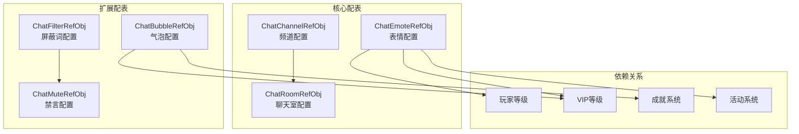

### 配表实体关系图

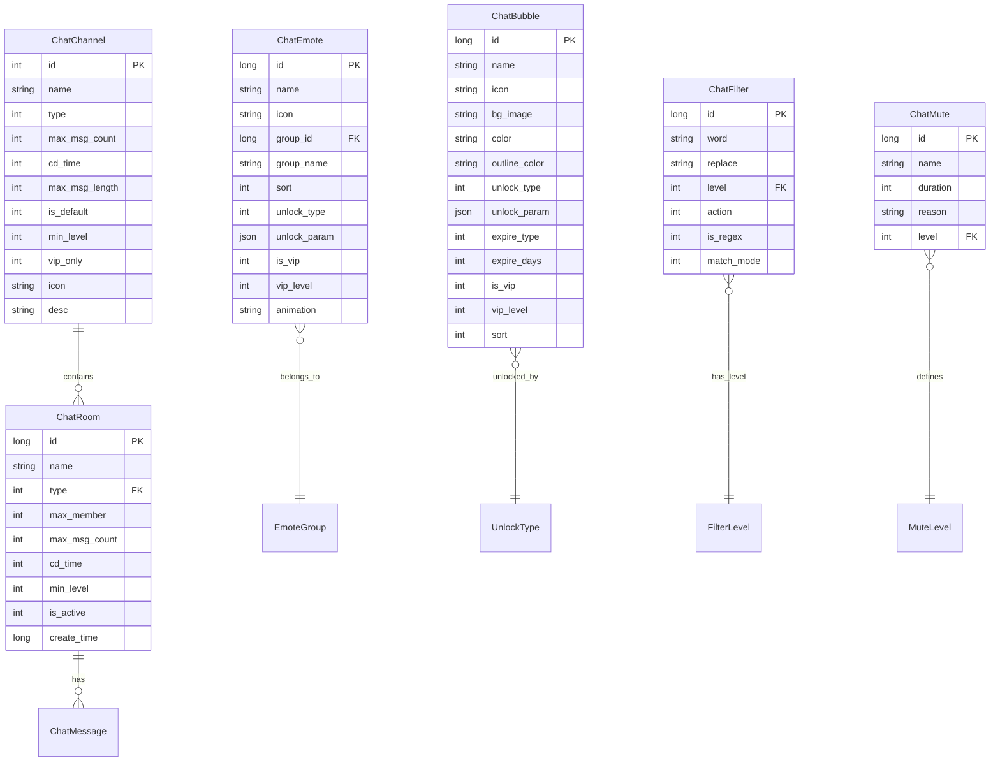

| 配表名称 | 文件名 | 说明 |
|---------|--------|------|
| ChatChannelRefObj | chat_channel_ref.json | 聊天频道配置 |
| ChatEmoteRefObj | chat_emote_ref.json | 聊天表情配置 |
| ChatFilterRefObj | chat_filter_ref.json | 聊天屏蔽词配置 |
| ChatBubbleRefObj | chat_bubble_ref.json | 聊天气泡配置 |
| ChatRoomRefObj | chat_room_ref.json | 聊天室配置 |
| ChatMuteRefObj | chat_mute_ref.json | 禁言配置 |

---

## 一、聊天频道配表

### ChatChannelRefObj - 聊天频道配置
**文件**: `chat_channel_ref.json`

| 字段名 | 类型 | 说明 | 示例值 |
|--------|------|------|--------|
| id | int | 频道ID | 1, 2, 3 |
| name | string | 频道名称 | "世界频道" |
| type | int | 频道类型 | 1 |
| max_msg_count | int | 最大消息数 | 100 |
| cd_time | int | 发言冷却时间（秒） | 5 |
| max_msg_length | int | 最大消息长度 | 200 |
| is_default | int | 是否默认加入 | 1 |
| min_level | int | 加入最低等级 | 1 |
| vip_only | int | 是否VIP专属 | 0 |
| icon | string | 频道图标 | "channel_world" |
| desc | string | 频道描述 | "全服玩家交流" |

### 频道类型枚举 (ENPChatRoomType)

> 源码路径: `ClientProtocol/NPEnum/ENPChatRoomType.cs`

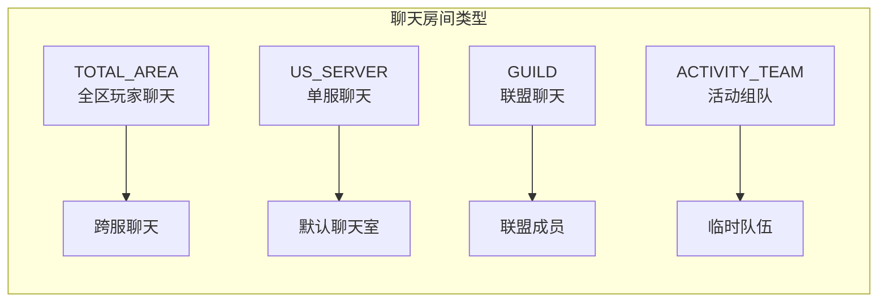

| 类型ID | 枚举名 | 说明 | 典型场景 |
|--------|--------|------|----------|
| 0 | NONE | 无效类型 | 默认值 |
| 1 | TOTAL_AREA | 全区玩家聊天 | 跨服世界频道 |
| 2 | US_SERVER | 单个玩家服聊天 | 本服默认频道 |
| 3 | GUILD | 联盟聊天 | 公会/联盟内部 |
| 4 | ACTIVITY_TEAM | 活动队伍聊天 | 临时组队频道 |

### 频道配置示例

```json
{
  "id": 1,
  "name": "世界频道",
  "type": 1,
  "max_msg_count": 100,
  "cd_time": 5,
  "max_msg_length": 200,
  "is_default": 1,
  "min_level": 1,
  "vip_only": 0,
  "icon": "channel_world",
  "desc": "全服玩家交流频道，所有玩家可见"
}
```

```json
{
  "id": 2,
  "name": "公会频道",
  "type": 2,
  "max_msg_count": 200,
  "cd_time": 3,
  "max_msg_length": 200,
  "is_default": 0,
  "min_level": 1,
  "vip_only": 0,
  "icon": "channel_guild",
  "desc": "公会内部聊天频道"
}
```

---

## 二、聊天表情配表

### ChatEmoteRefObj - 聊天表情配置
**文件**: `chat_emote_ref.json`

| 字段名 | 类型 | 说明 | 示例值 |
|--------|------|------|--------|
| id | long | 表情ID | 10001 |
| name | string | 表情名称 | "笑脸" |
| icon | string | 表情图标资源路径 | "emote/smile" |
| group_id | long | 表情组ID | 1 |
| group_name | string | 表情组名称 | "基础表情" |
| sort | int | 排序权重 | 1 |
| unlock_type | int | 解锁类型 | 1 |
| unlock_param | object | 解锁条件参数 | `{level: 10}` |
| is_vip | int | 是否VIP专属 | 0 |
| vip_level | int | 所需VIP等级 | 0 |
| animation | string | 动画资源 | "emote/smile_anim" |

### 表情解锁类型枚举

| 类型ID | 类型名 | 说明 |
|--------|--------|------|
| 1 | DEFAULT | 默认解锁 |
| 2 | LEVEL | 等级解锁 |
| 3 | VIP | VIP解锁 |
| 4 | ACHIEVEMENT | 成就解锁 |
| 5 | ACTIVITY | 活动获取 |
| 6 | SHOP | 商城购买 |

### 表情配置示例

```json
{
  "id": 10001,
  "name": "笑脸",
  "icon": "emote/smile",
  "group_id": 1,
  "group_name": "基础表情",
  "sort": 1,
  "unlock_type": 1,
  "unlock_param": {},
  "is_vip": 0,
  "vip_level": 0,
  "animation": "emote/smile_anim"
}
```

```json
{
  "id": 10101,
  "name": "专属表情",
  "icon": "emote/vip_smile",
  "group_id": 10,
  "group_name": "VIP专属",
  "sort": 1,
  "unlock_type": 3,
  "unlock_param": {"vip_level": 5},
  "is_vip": 1,
  "vip_level": 5,
  "animation": "emote/vip_smile_anim"
}
```

---

## 三、聊天屏蔽词配表

### ChatFilterRefObj - 聊天屏蔽词配置
**文件**: `chat_filter_ref.json`

| 字段名 | 类型 | 说明 | 示例值 |
|--------|------|------|--------|
| id | long | 配置ID | 1 |
| word | string | 屏蔽词 | "敏感词" |
| replace | string | 替换词 | "***" |
| level | int | 敏感等级 | 1 |
| action | int | 处理动作 | 1 |
| is_regex | int | 是否正则匹配 | 0 |
| match_mode | int | 匹配模式 | 1 |

### 敏感等级枚举

| 等级 | 说明 | 处理方式 |
|------|------|----------|
| 1 | 轻微敏感 | 替换显示 |
| 2 | 中度敏感 | 替换并记录 |
| 3 | 严重敏感 | 拦截并警告 |
| 4 | 违规 | 拦截并禁言 |

### 处理动作枚举

| 动作ID | 说明 |
|--------|------|
| 1 | 替换为指定字符 |
| 2 | 替换为星号 |
| 3 | 拦截消息 |
| 4 | 禁言处理 |

### 匹配模式枚举

| 模式ID | 说明 |
|--------|------|
| 1 | 精确匹配 |
| 2 | 包含匹配 |
| 3 | 前缀匹配 |
| 4 | 后缀匹配 |

### 屏蔽词配置示例

```json
{
  "id": 1,
  "word": "敏感词",
  "replace": "***",
  "level": 1,
  "action": 2,
  "is_regex": 0,
  "match_mode": 2
}
```

---

## 四、聊天气泡配表

### ChatBubbleRefObj - 聊天气泡配置
**文件**: `chat_bubble_ref.json`

| 字段名 | 类型 | 说明 | 示例值 |
|--------|------|------|--------|
| id | long | 气泡ID | 30001 |
| name | string | 气泡名称 | "默认气泡" |
| icon | string | 气泡图标 | "bubble/default" |
| bg_image | string | 背景图片 | "bubble/default_bg" |
| color | string | 文字颜色 | "#FFFFFF" |
| outline_color | string | 描边颜色 | "#000000" |
| unlock_type | int | 解锁类型 | 1 |
| unlock_param | object | 解锁条件 | `{}` |
| expire_type | int | 过期类型 | 0 |
| expire_days | int | 有效天数 | 0 |
| is_vip | int | 是否VIP专属 | 0 |
| vip_level | int | 所需VIP等级 | 0 |
| sort | int | 排序权重 | 1 |

### 过期类型枚举

| 类型ID | 说明 |
|--------|------|
| 0 | 永久有效 |
| 1 | 限时有效 |
| 2 | 活动期间有效 |

### 气泡配置示例

```json
{
  "id": 30001,
  "name": "默认气泡",
  "icon": "bubble/default",
  "bg_image": "bubble/default_bg",
  "color": "#FFFFFF",
  "outline_color": "#000000",
  "unlock_type": 1,
  "unlock_param": {},
  "expire_type": 0,
  "expire_days": 0,
  "is_vip": 0,
  "vip_level": 0,
  "sort": 1
}
```

```json
{
  "id": 30101,
  "name": "VIP专属气泡",
  "icon": "bubble/vip_gold",
  "bg_image": "bubble/vip_gold_bg",
  "color": "#FFD700",
  "outline_color": "#8B4513",
  "unlock_type": 3,
  "unlock_param": {"vip_level": 10},
  "expire_type": 0,
  "expire_days": 0,
  "is_vip": 1,
  "vip_level": 10,
  "sort": 100
}
```

---

## 五、聊天室配表

### ChatRoomRefObj - 聊天室配置
**文件**: `chat_room_ref.json`

| 字段名 | 类型 | 说明 | 示例值 |
|--------|------|------|--------|
| id | long | 聊天室ID | 100001 |
| name | string | 聊天室名称 | "世界聊天室1" |
| type | int | 聊天室类型 | 1 |
| max_member | int | 最大成员数 | 5000 |
| max_msg_count | int | 最大消息数 | 100 |
| cd_time | int | 发言冷却时间（秒） | 5 |
| max_msg_length | int | 最大消息长度 | 200 |
| min_level | int | 加入最低等级 | 1 |
| is_active | int | 是否启用 | 1 |
| create_time | long | 创建时间 | 1640000000 |

### 聊天室类型枚举

| 类型ID | 说明 |
|--------|------|
| 1 | 世界聊天室 |
| 2 | 公会聊天室 |
| 3 | 组队聊天室 |
| 4 | 活动聊天室 |

### 聊天室配置示例

```json
{
  "id": 100001,
  "name": "世界聊天室1",
  "type": 1,
  "max_member": 5000,
  "max_msg_count": 100,
  "cd_time": 5,
  "max_msg_length": 200,
  "min_level": 1,
  "is_active": 1,
  "create_time": 1640000000
}
```

---

## 六、禁言配置配表

### ChatMuteRefObj - 禁言配置
**文件**: `chat_mute_ref.json`

| 字段名 | 类型 | 说明 | 示例值 |
|--------|------|------|--------|
| id | long | 配置ID | 1 |
| name | string | 配置名称 | "首次违规禁言" |
| duration | int | 禁言时长（秒） | 3600 |
| reason | string | 禁言原因 | "首次发布违规内容" |
| level | int | 违规等级 | 1 |

### 禁言时长配置示例

```json
{
  "id": 1,
  "name": "首次违规禁言",
  "duration": 3600,
  "reason": "首次发布违规内容",
  "level": 1
}
```

```json
{
  "id": 2,
  "name": "二次违规禁言",
  "duration": 86400,
  "reason": "二次发布违规内容",
  "level": 2
}
```

---

## 七、消息类型枚举 (ENPChatMsgType)

> 源码路径: `ClientProtocol/NPEnum/ENPChatMsgType.cs`

### 7.1 消息类型分类图

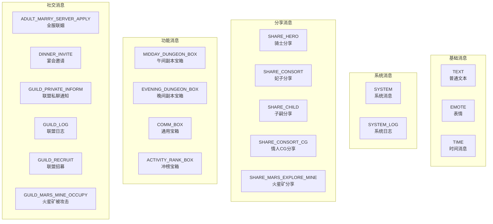

### 7.2 完整消息类型列表

| 类型ID | 枚举名 | 说明 | 消息内容类 |
|--------|--------|------|------------|
| 0 | NONE | 无效类型 | - |
| 1 | TEXT | 普通私聊内容 | ChatContent_TextMsg |
| 2 | TIME | 时间消息(时间戳) | - |
| 3 | SYSTEM | 系统消息 | NPCommon_ChatContent_System |
| 4 | MIDDAY_DUNGEON_BOX | 午间副本宝箱 | ChatObj_MiddayDungeonBox |
| 5 | SYSTEM_LOG | 系统日志消息 | ChatObj_SystemLog |
| 6 | COMM_BOX | 通用宝箱 | NPCommon_ChatContent_CommBox |
| 7 | EVENING_DUNGEON_BOX | 晚间副本宝箱 | - |
| 8 | ADULT_MARRY_SERVER_APPLY | 子嗣全服联姻 | NPCommon_ChatContent_AdultMarryServerApply |
| 9 | DINNER_INVITE | 宴会邀请 | NPCommon_ChatContent_Dinner |
| 10 | EMOTE | 表情 | NPCommon_ChatContent_Emoji |
| 11 | SHARE_HERO | 骑士分享 | NPCommon_ChatContent_HeroShare |
| 12 | SHARE_CONSORT | 妃子分享 | NPCommon_ChatContent_ConsortShare |
| 13 | SHARE_CHILD | 子嗣分享 | NPCommon_ChatContent_ChildShare |
| 14 | ACTIVITY_RANK_BOX | 冲榜宝箱 | NPCommon_ChatContent_ActivityRankBox |
| 15 | GUILD_PRIVATE_INFORM | 联盟私聊通知 | Common_ChatContent_GuildLog |
| 16 | GUILD_LOG | 联盟日志消息 | Common_ChatContent_GuildLog |
| 17 | GUILD_RECRUIT | 联盟招募 | Common_ChatContent_GuildRecruit |
| 18 | SHARE_CONSORT_CG | 情人CG分享 | NPCommon_ChatContent_ConsortCGShare |
| 19 | GUILD_MARS_MINE_OCCUPY | 联盟成员火星矿被攻击 | ChatContent_GuildMarsMineAttackShare |
| 20 | SHARE_MARS_EXPLORE_MINE | 火星探险矿分享 | NPCommon_ChatContent_MarsExploreMineShare |

### 7.3 消息类型配置示例

```csharp
// 客户端消息类型设置注册 (NPPlayerChatComponent.cs)
_m_chatData.setMsgInfoSetting((int)ENPChatMsgType.TEXT, new NPChatTextDataSetting());
_m_chatData.setMsgInfoSetting((int)ENPChatMsgType.EMOTE, new NPChatEmoteDataSetting());
_m_chatData.setMsgInfoSetting((int)ENPChatMsgType.SHARE_HERO, new NPChatShareHeroDataSetting());
_m_chatData.setMsgInfoSetting((int)ENPChatMsgType.SHARE_CONSORT, new NPChatShareConsortDataSetting());
_m_chatData.setMsgInfoSetting((int)ENPChatMsgType.SHARE_CHILD, new NPChatShareChildDataSetting());
_m_chatData.setMsgInfoSetting((int)ENPChatMsgType.SYSTEM, new NPChatSystemDataSetting());
_m_chatData.setMsgInfoSetting((int)ENPChatMsgType.COMM_BOX, new NPChatCommonBoxDataSetting());
```

---

## 八、配表数据关系详解

### 8.1 频道与聊天室关系

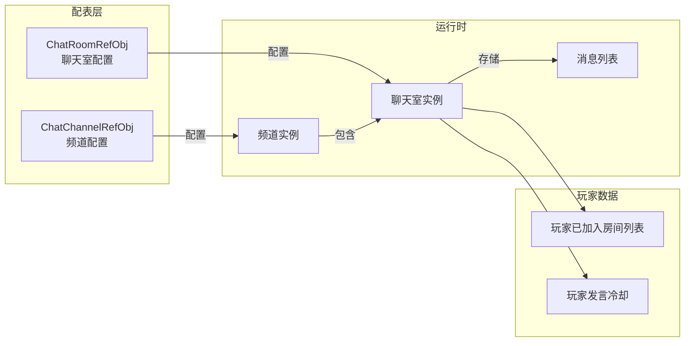

### 8.2 表情解锁链路

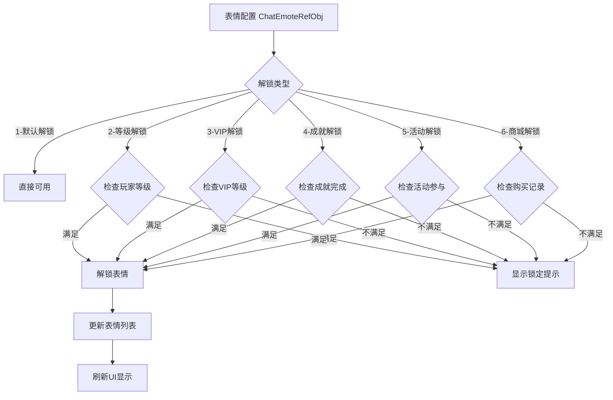

### 8.3 敏感词过滤链路

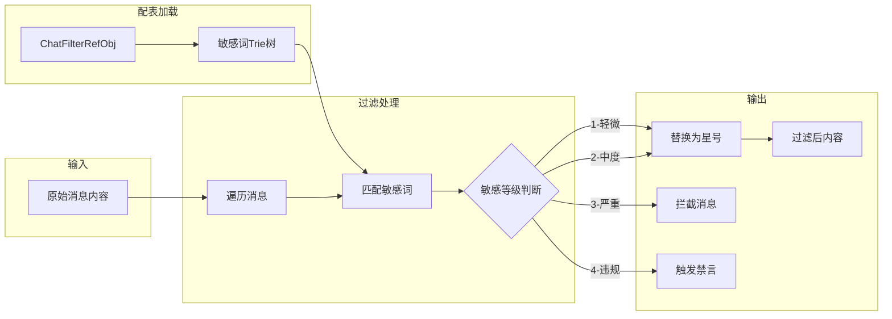

---

## 十、配表加载方式

### 8.1 客户端加载

```csharp
// 获取聊天频道配置
ChatChannelRefObj channelRef = GRefdataCoreMgr.instance.chatChannelRefCore.getRef(channelId);
if (channelRef != null)
{
    string channelName = channelRef.name;
    int cdTime = channelRef.cd_time;
    int maxMsgLength = channelRef.max_msg_length;
}

// 获取聊天表情配置
ChatEmoteRefObj emoteRef = GRefdataCoreMgr.instance.chatEmoteRefCore.getRef(emoteId);
if (emoteRef != null)
{
    string iconPath = emoteRef.icon;
    bool isVip = emoteRef.is_vip == 1;
}

// 获取聊天气泡配置
ChatBubbleRefObj bubbleRef = GRefdataCoreMgr.instance.chatBubbleRefCore.getRef(bubbleId);

// 检查表情是否解锁
public bool IsEmoteUnlocked(long emoteId)
{
    ChatEmoteRefObj emoteRef = GRefdataCoreMgr.instance.chatEmoteRefCore.getRef(emoteId);
    if (emoteRef == null) return false;

    switch (emoteRef.unlock_type)
    {
        case 1: // 默认解锁
            return true;
        case 2: // 等级解锁
            return NPPlayer.instance.playerInfo.playerLevel >= emoteRef.unlock_param.level;
        case 3: // VIP解锁
            return NPPlayer.instance.playerInfo.vipLevel >= emoteRef.vip_level;
        default:
            return false;
    }
}
```

### 8.2 服务端加载

```java
// 获取聊天频道配置
ChatChannelRefObj channelRef = ChatChannelRefObj.getMgr().get(channelId);
if (channelRef != null) {
    String channelName = channelRef.name;
    int cdTime = channelRef.cd_time;
}

// 获取聊天表情配置
ChatEmoteRefObj emoteRef = ChatEmoteRefObj.getMgr().get(emoteId);

// 获取聊天气泡配置
ChatBubbleRefObj bubbleRef = ChatBubbleRefObj.getMgr().get(bubbleId);

// 检查消息长度限制
public boolean checkMessageLength(int channelId, String content)
{
    ChatChannelRefObj channelRef = ChatChannelRefObj.getMgr().get(channelId);
    if (channelRef == null) return false;

    return content.length() <= channelRef.max_msg_length;
}
```

---

## 十一、配表数据流程图

### 9.1 配表加载流程

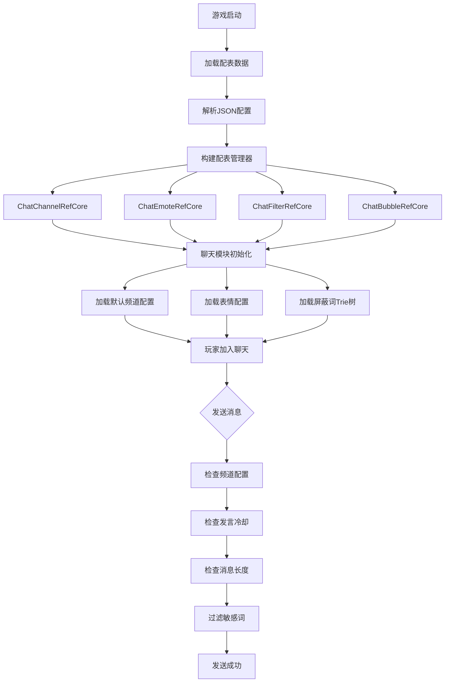

### 9.2 表情解锁判定流程

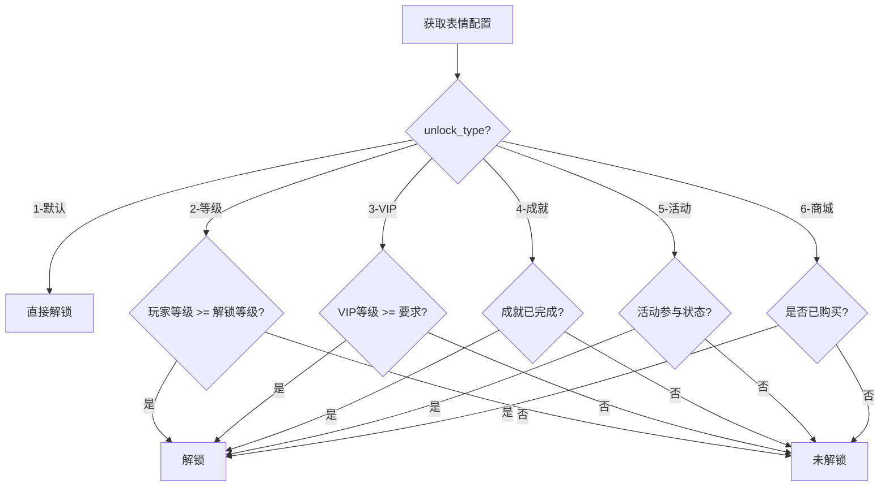

### 9.3 敏感词过滤流程

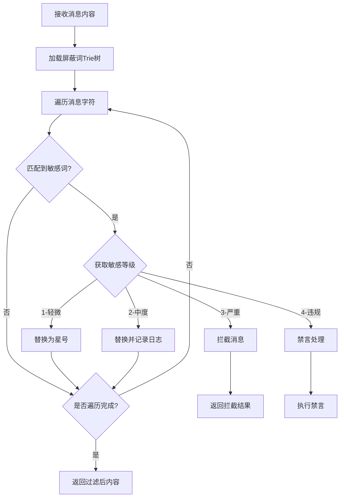

---

## 十二、字段校验规则

### 10.1 频道配置校验

| 字段名 | 校验规则 | 异常处理 |
|--------|----------|----------|
| id | 必须唯一，范围 1-999 | 配表加载时去重 |
| name | 长度 1-32 字符 | 配表加载时校验 |
| type | 范围 1-7 | 配表加载时校验 |
| max_msg_count | 范围 50-500 | 默认100 |
| cd_time | 范围 0-60 | 默认5 |
| max_msg_length | 范围 50-500 | 默认200 |

### 10.2 表情配置校验

| 字段名 | 校验规则 | 异常处理 |
|--------|----------|----------|
| id | 必须唯一 | 配表加载时去重 |
| name | 长度 1-32 字符 | 配表加载时校验 |
| icon | 必须有效资源路径 | 运行时检查 |
| unlock_type | 范围 1-6 | 默认1 |
| vip_level | 范围 0-100 | 默认0 |

### 10.3 数据类型约束

| 数据类型 | 取值范围 | 存储格式 |
|----------|----------|----------|
| int | -2147483648 ~ 2147483647 | 32位整数 |
| long | -9223372036854775808 ~ 9223372036854775807 | 64位整数 |
| string | UTF-8编码 | 字符串 |
| object | JSON对象 | 序列化存储 |

---

## 十三、配表热更新机制

### 11.1 配表更新流程

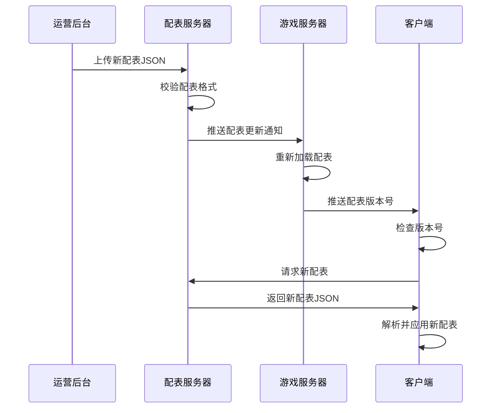

### 11.2 配表版本管理

```json
{
  "version": "1.0.5",
  "updateTime": "2026-04-11 10:00:00",
  "tables": {
    "chat_channel_ref": "hash_md5_1",
    "chat_emote_ref": "hash_md5_2",
    "chat_filter_ref": "hash_md5_3",
    "chat_bubble_ref": "hash_md5_4"
  }
}
```

---

## 十四、完整字段速查表

### 12.1 ChatChannelRefObj 完整字段

| 字段名 | 类型 | 必填 | 默认值 | 取值范围 | 说明 |
|--------|------|------|--------|----------|------|
| id | int | 是 | - | 1-999 | 频道ID，唯一标识 |
| name | string | 是 | - | 1-32字符 | 频道名称，显示用 |
| type | int | 是 | - | 1-7 | 频道类型枚举 |
| max_msg_count | int | 否 | 100 | 50-500 | 最大消息数 |
| cd_time | int | 否 | 5 | 0-60 | 发言冷却时间(秒) |
| max_msg_length | int | 否 | 200 | 50-500 | 最大消息长度 |
| is_default | int | 否 | 0 | 0-1 | 是否默认加入 |
| min_level | int | 否 | 1 | 1-100 | 加入最低等级 |
| vip_only | int | 否 | 0 | 0-1 | 是否VIP专属 |
| icon | string | 否 | "" | 资源路径 | 频道图标 |
| desc | string | 否 | "" | 1-200字符 | 频道描述 |

### 12.2 ChatEmoteRefObj 完整字段

| 字段名 | 类型 | 必填 | 默认值 | 取值范围 | 说明 |
|--------|------|------|--------|----------|------|
| id | long | 是 | - | > 0 | 表情ID，唯一标识 |
| name | string | 是 | - | 1-32字符 | 表情名称 |
| icon | string | 是 | - | 资源路径 | 表情图标路径 |
| group_id | long | 否 | 0 | > 0 | 表情组ID |
| group_name | string | 否 | "" | 1-32字符 | 表情组名称 |
| sort | int | 否 | 0 | 0-9999 | 排序权重 |
| unlock_type | int | 否 | 1 | 1-6 | 解锁类型枚举 |
| unlock_param | object | 否 | {} | JSON对象 | 解锁条件参数 |
| is_vip | int | 否 | 0 | 0-1 | 是否VIP专属 |
| vip_level | int | 否 | 0 | 0-100 | 所需VIP等级 |
| animation | string | 否 | "" | 资源路径 | 动画资源路径 |

### 12.3 ChatFilterRefObj 完整字段

| 字段名 | 类型 | 必填 | 默认值 | 取值范围 | 说明 |
|--------|------|------|--------|----------|------|
| id | long | 是 | - | > 0 | 配置ID，唯一标识 |
| word | string | 是 | - | 1-50字符 | 屏蔽词内容 |
| replace | string | 否 | "***" | 1-50字符 | 替换词 |
| level | int | 否 | 1 | 1-4 | 敏感等级枚举 |
| action | int | 否 | 2 | 1-4 | 处理动作枚举 |
| is_regex | int | 否 | 0 | 0-1 | 是否正则匹配 |
| match_mode | int | 否 | 2 | 1-4 | 匹配模式枚举 |

### 12.4 ChatBubbleRefObj 完整字段

| 字段名 | 类型 | 必填 | 默认值 | 取值范围 | 说明 |
|--------|------|------|--------|----------|------|
| id | long | 是 | - | > 0 | 气泡ID，唯一标识 |
| name | string | 是 | - | 1-32字符 | 气泡名称 |
| icon | string | 是 | - | 资源路径 | 气泡图标 |
| bg_image | string | 是 | - | 资源路径 | 背景图片 |
| color | string | 否 | "#FFFFFF" | 颜色值 | 文字颜色 |
| outline_color | string | 否 | "#000000" | 颜色值 | 描边颜色 |
| unlock_type | int | 否 | 1 | 1-6 | 解锁类型枚举 |
| unlock_param | object | 否 | {} | JSON对象 | 解锁条件 |
| expire_type | int | 否 | 0 | 0-2 | 过期类型枚举 |
| expire_days | int | 否 | 0 | 0-365 | 有效天数 |
| is_vip | int | 否 | 0 | 0-1 | 是否VIP专属 |
| vip_level | int | 否 | 0 | 0-100 | 所需VIP等级 |
| sort | int | 否 | 0 | 0-9999 | 排序权重 |

### 12.5 ChatRoomRefObj 完整字段

| 字段名 | 类型 | 必填 | 默认值 | 取值范围 | 说明 |
|--------|------|------|--------|----------|------|
| id | long | 是 | - | > 0 | 聊天室ID，唯一标识 |
| name | string | 是 | - | 1-32字符 | 聊天室名称 |
| type | int | 是 | - | 1-4 | 聊天室类型枚举 |
| max_member | int | 否 | 5000 | 100-10000 | 最大成员数 |
| max_msg_count | int | 否 | 100 | 50-500 | 最大消息数 |
| cd_time | int | 否 | 5 | 0-60 | 发言冷却时间(秒) |
| max_msg_length | int | 否 | 200 | 50-500 | 最大消息长度 |
| min_level | int | 否 | 1 | 1-100 | 加入最低等级 |
| is_active | int | 否 | 1 | 0-1 | 是否启用 |
| create_time | long | 否 | 0 | 时间戳 | 创建时间 |

### 12.6 ChatMuteRefObj 完整字段

| 字段名 | 类型 | 必填 | 默认值 | 取值范围 | 说明 |
|--------|------|------|--------|----------|------|
| id | long | 是 | - | > 0 | 配置ID，唯一标识 |
| name | string | 是 | - | 1-32字符 | 配置名称 |
| duration | int | 是 | - | 60-2592000 | 禁言时长(秒) |
| reason | string | 否 | "" | 1-200字符 | 禁言原因 |
| level | int | 否 | 1 | 1-10 | 违规等级 |

---

## 十五、数据库表结构

### chat_message (聊天消息记录表)

```sql
CREATE TABLE IF NOT EXISTS `chat_message` (
    `id` BIGINT NOT NULL AUTO_INCREMENT COMMENT '主键',
    `msg_id` BIGINT NOT NULL COMMENT '消息ID（雪花算法）',
    `room_id` BIGINT NOT NULL COMMENT '房间ID',
    `sender_id` BIGINT NOT NULL COMMENT '发送者ID',
    `sender_name` VARCHAR(64) NOT NULL COMMENT '发送者名称',
    `msg_type` TINYINT NOT NULL DEFAULT 1 COMMENT '消息类型',
    `content` TEXT NOT NULL COMMENT '消息内容',
    `bubble_id` BIGINT DEFAULT 0 COMMENT '气泡ID',
    `send_time` BIGINT NOT NULL COMMENT '发送时间戳',
    `create_time` DATETIME NOT NULL DEFAULT CURRENT_TIMESTAMP COMMENT '创建时间',
    PRIMARY KEY (`id`),
    UNIQUE KEY `uk_msg_id` (`msg_id`),
    KEY `idx_room_time` (`room_id`, `send_time`),
    KEY `idx_sender_time` (`sender_id`, `send_time`)
) ENGINE=InnoDB DEFAULT CHARSET=utf8mb4 COMMENT='聊天消息记录表';
```

### chat_private_message (私聊消息记录表)

```sql
CREATE TABLE IF NOT EXISTS `chat_private_message` (
    `id` BIGINT NOT NULL AUTO_INCREMENT COMMENT '主键',
    `msg_id` BIGINT NOT NULL COMMENT '消息ID',
    `sender_id` BIGINT NOT NULL COMMENT '发送者ID',
    `receiver_id` BIGINT NOT NULL COMMENT '接收者ID',
    `msg_type` TINYINT NOT NULL DEFAULT 1 COMMENT '消息类型',
    `content` TEXT NOT NULL COMMENT '消息内容',
    `is_read` TINYINT NOT NULL DEFAULT 0 COMMENT '是否已读',
    `send_time` BIGINT NOT NULL COMMENT '发送时间戳',
    `create_time` DATETIME NOT NULL DEFAULT CURRENT_TIMESTAMP COMMENT '创建时间',
    PRIMARY KEY (`id`),
    UNIQUE KEY `uk_msg_id` (`msg_id`),
    KEY `idx_sender_receiver` (`sender_id`, `receiver_id`),
    KEY `idx_receiver_time` (`receiver_id`, `send_time`)
) ENGINE=InnoDB DEFAULT CHARSET=utf8mb4 COMMENT='私聊消息记录表';
```

### chat_blacklist (聊天黑名单表)

```sql
CREATE TABLE IF NOT EXISTS `chat_blacklist` (
    `id` BIGINT NOT NULL AUTO_INCREMENT COMMENT '主键',
    `player_id` BIGINT NOT NULL COMMENT '玩家ID',
    `block_player_id` BIGINT NOT NULL COMMENT '被屏蔽玩家ID',
    `create_time` DATETIME NOT NULL DEFAULT CURRENT_TIMESTAMP COMMENT '创建时间',
    PRIMARY KEY (`id`),
    UNIQUE KEY `uk_player_block` (`player_id`, `block_player_id`),
    KEY `idx_player` (`player_id`)
) ENGINE=InnoDB DEFAULT CHARSET=utf8mb4 COMMENT='聊天黑名单表';
```

### chat_mute_record (禁言记录表)

```sql
CREATE TABLE IF NOT EXISTS `chat_mute_record` (
    `id` BIGINT NOT NULL AUTO_INCREMENT COMMENT '主键',
    `player_id` BIGINT NOT NULL COMMENT '玩家ID',
    `operator_id` BIGINT NOT NULL COMMENT '操作者ID',
    `mute_type` TINYINT NOT NULL DEFAULT 1 COMMENT '禁言类型(1-临时 2-永久)',
    `duration` INT NOT NULL COMMENT '禁言时长(秒)',
    `start_time` BIGINT NOT NULL COMMENT '开始时间戳',
    `end_time` BIGINT NOT NULL COMMENT '结束时间戳',
    `reason` VARCHAR(256) DEFAULT '' COMMENT '禁言原因',
    `status` TINYINT NOT NULL DEFAULT 1 COMMENT '状态(1-生效中 2-已解除)',
    `create_time` DATETIME NOT NULL DEFAULT CURRENT_TIMESTAMP COMMENT '创建时间',
    PRIMARY KEY (`id`),
    KEY `idx_player` (`player_id`),
    KEY `idx_end_time` (`end_time`)
) ENGINE=InnoDB DEFAULT CHARSET=utf8mb4 COMMENT='禁言记录表';
```

---

## 十六、配表数据校验规则

### 16.1 数据完整性校验

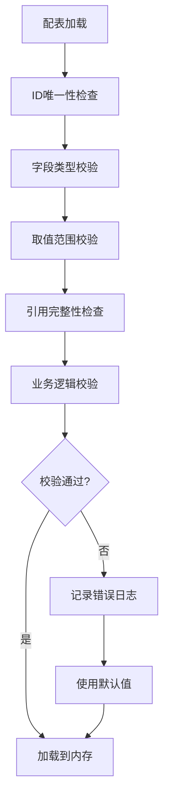

### 16.2 字段校验规则表

| 配表 | 字段 | 校验规则 | 错误处理 |
|------|------|----------|----------|
| ChatChannelRefObj | id | 唯一性 | 去重警告 |
| ChatChannelRefObj | type | 1-7范围内 | 默认值1 |
| ChatChannelRefObj | cd_time | 0-60秒 | 默认值5 |
| ChatEmoteRefObj | icon | 资源路径存在 | 占位图 |
| ChatFilterRefObj | word | 非空 | 跳过该条 |
| ChatBubbleRefObj | color | 颜色格式校验 | 默认白色 |

---

## 十七、配表数据使用示例

### 17.1 获取频道完整配置

```csharp
/// <summary>
/// 获取频道完整配置信息
/// </summary>
public ChannelConfigInfo GetChannelConfig(int channelId)
{
    ChatChannelRefObj channelRef = GRefdataCoreMgr.instance.chatChannelRefCore.getRef(channelId);
    if (channelRef == null) return null;

    return new ChannelConfigInfo
    {
        ChannelId = channelRef.id,
        ChannelName = channelRef.name,
        ChannelType = (EChatChannelType)channelRef.type,
        MaxMsgCount = channelRef.max_msg_count,
        CdTime = channelRef.cd_time,
        MaxMsgLength = channelRef.max_msg_length,
        IsDefault = channelRef.is_default == 1,
        MinLevel = channelRef.min_level,
        IsVipOnly = channelRef.vip_only == 1,
        Icon = channelRef.icon,
        Desc = channelRef.desc
    };
}
```

### 13.2 批量获取可用表情

```csharp
/// <summary>
/// 获取玩家可用的所有表情
/// </summary>
public List<EmoteInfo> GetAvailableEmotes(long playerId)
{
    List<EmoteInfo> result = new List<EmoteInfo>();
    var allEmotes = GRefdataCoreMgr.instance.chatEmoteRefCore.getAll();

    int playerLevel = NPPlayer.instance.playerInfo.playerLevel;
    int vipLevel = NPPlayer.instance.playerInfo.vipLevel;

    foreach (var emoteRef in allEmotes)
    {
        bool isUnlocked = CheckEmoteUnlock(emoteRef, playerLevel, vipLevel);
        if (isUnlocked)
        {
            result.Add(new EmoteInfo
            {
                EmoteId = emoteRef.id,
                Name = emoteRef.name,
                Icon = emoteRef.icon,
                GroupId = emoteRef.group_id,
                GroupName = emoteRef.group_name
            });
        }
    }

    return result.OrderBy(e => e.GroupId).ThenBy(e => e.Sort).ToList();
}

/// <summary>
/// 检查表情解锁状态
/// </summary>
private bool CheckEmoteUnlock(ChatEmoteRefObj emoteRef, int playerLevel, int vipLevel)
{
    switch (emoteRef.unlock_type)
    {
        case 1: // 默认解锁
            return true;
        case 2: // 等级解锁
            return playerLevel >= emoteRef.unlock_param.level;
        case 3: // VIP解锁
            return vipLevel >= emoteRef.vip_level;
        case 4: // 成就解锁
            return AchievementManager.Instance.IsCompleted(emoteRef.unlock_param.achievement_id);
        case 5: // 活动获取
            return ActivityManager.Instance.HasReward(emoteRef.unlock_param.activity_id, emoteRef.id);
        case 6: // 商城购买
            return ShopManager.Instance.HasPurchased(emoteRef.id);
        default:
            return false;
    }
}
```

### 13.3 敏感词批量校验

```java
/**
 * 批量加载敏感词到Trie树
 */
public void loadSensitiveWords() {
    TrieNode root = new TrieNode();
    List<ChatFilterRefObj> filterList = ChatFilterRefObj.getMgr().getAll();

    for (ChatFilterRefObj filter : filterList) {
        String word = filter.word;
        TrieNode node = root;

        for (char c : word.toCharArray()) {
            if (!node.children.containsKey(c)) {
                node.children.put(c, new TrieNode());
            }
            node = node.children.get(c);
        }

        node.isEnd = true;
        node.level = filter.level;
        node.action = filter.action;
        node.replace = filter.replace;
    }

    this.sensitiveWordRoot = root;
}

/**
 * 检查内容中的敏感词
 */
public FilterResult checkSensitiveWords(String content) {
    FilterResult result = new FilterResult();
    StringBuilder filtered = new StringBuilder(content);
    int index = 0;

    while (index < content.length()) {
        MatchResult match = findMatch(content, index);

        if (match != null && match.length > 0) {
            result.hasSensitiveWord = true;
            result.sensitiveLevel = Math.max(result.sensitiveLevel, match.level);

            // 根据动作处理
            switch (match.action) {
                case 1: // 替换为指定字符
                case 2: // 替换为星号
                    String replacement = match.replace != null ? match.replace : "***";
                    for (int i = 0; i < match.length; i++) {
                        if (i < replacement.length()) {
                            filtered.setCharAt(index + i, replacement.charAt(i));
                        } else {
                            filtered.setCharAt(index + i, '*');
                        }
                    }
                    break;
                case 3: // 拦截消息
                    result.blocked = true;
                    break;
                case 4: // 禁言处理
                    result.needMute = true;
                    result.muteLevel = match.level;
                    break;
            }

            index += match.length;
        } else {
            index++;
        }
    }

    result.filteredContent = filtered.toString();
    return result;
}
```
