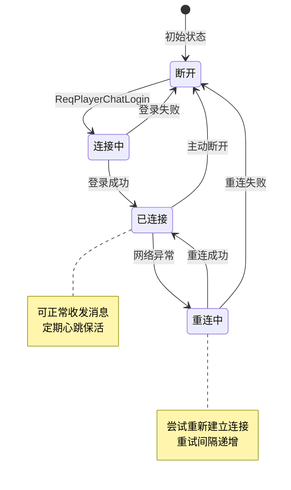
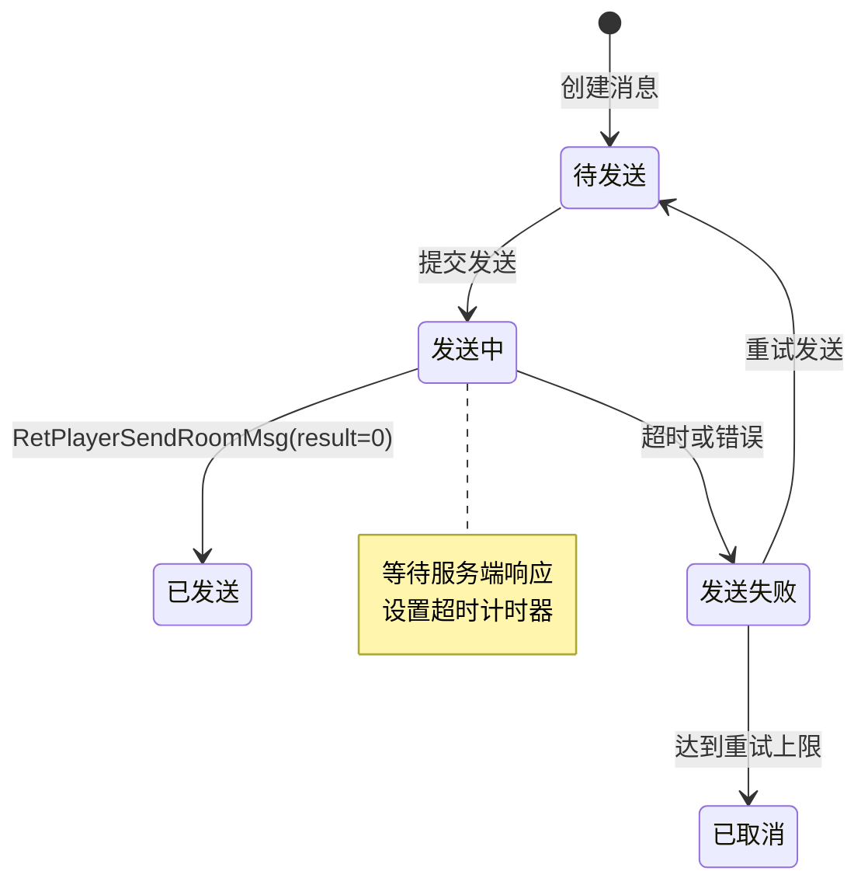
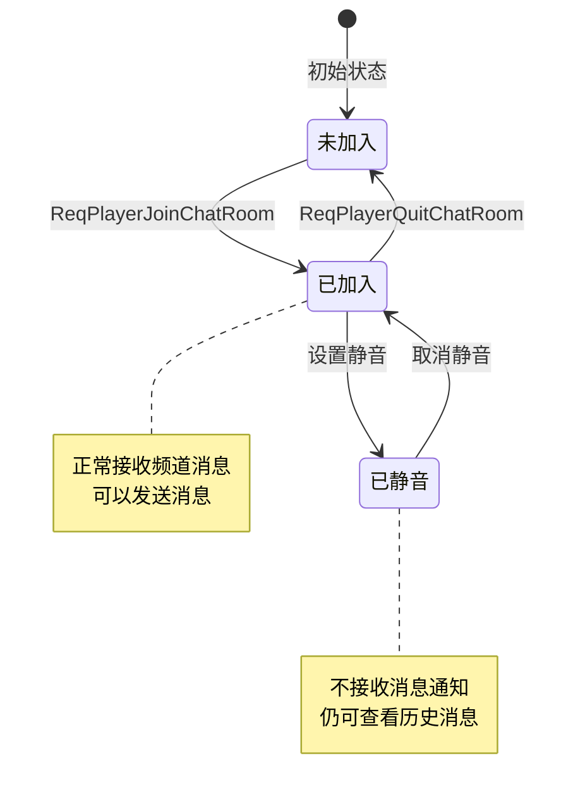
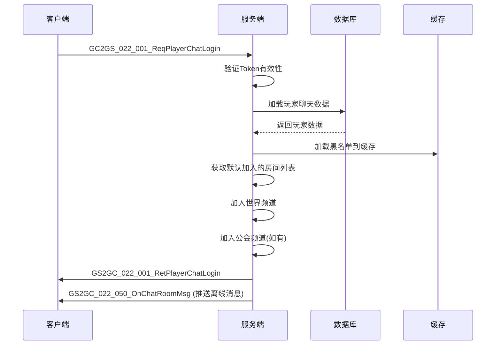
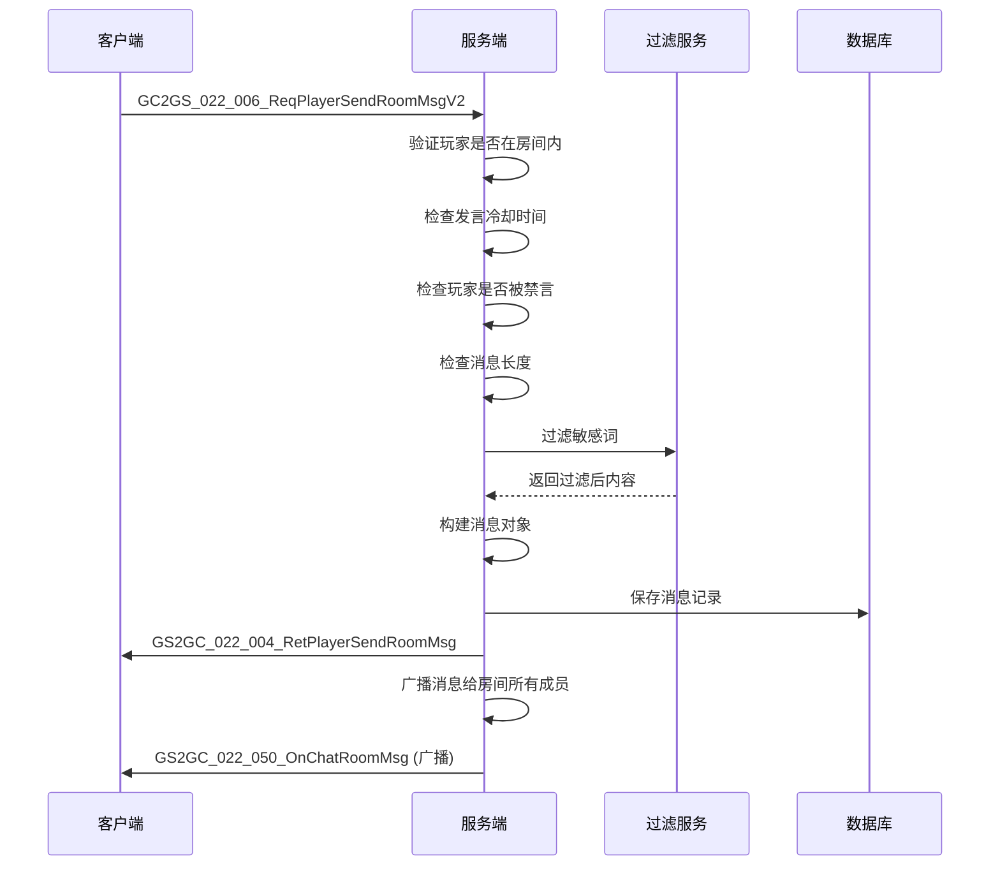
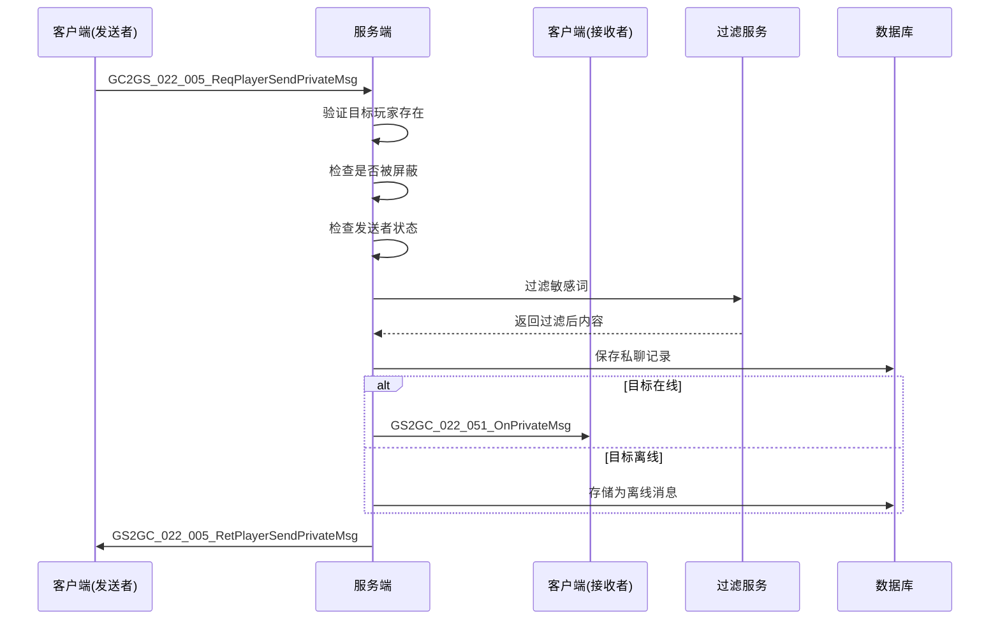
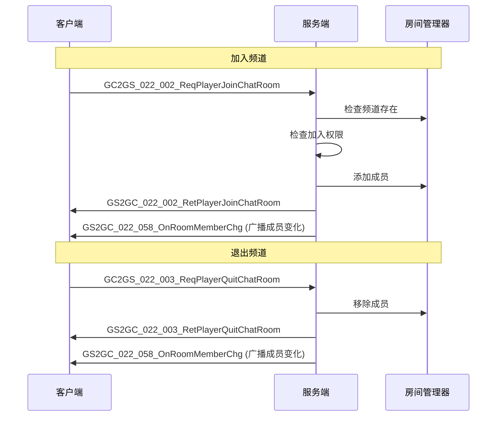
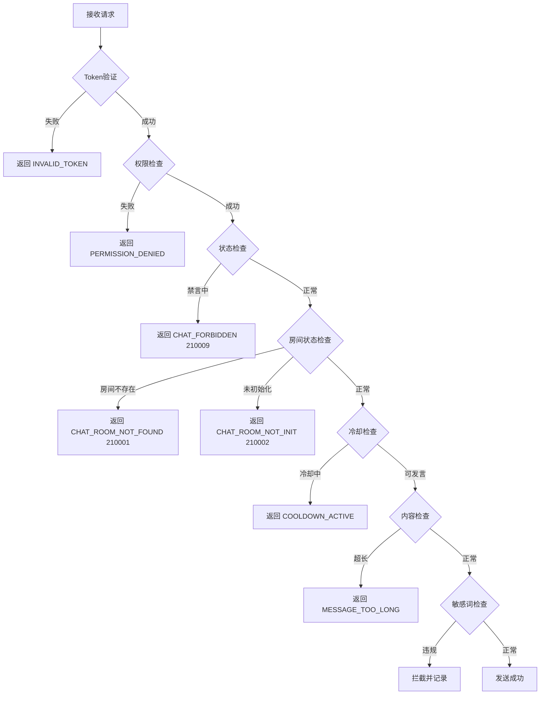

# 聊天模块协议文档

**模块名称**: Chat（聊天模块）
**模块编号**: p022
**文档版本**: 2.0
**更新日期**: 2026-04-11

## 协议模块编号: p022

**源码路径**:
- 客户端请求: `ClientProtocol/GC2GS/p022_ChatOp/`
- 服务端响应: `ClientProtocol/GS2GC/p022_ChatOp/`

---

## 一、协议总览

### 1.1 协议分类

| 分类 | 主序号 | 说明 |
|------|--------|------|
| 聊天操作协议 | 22 | 聊天相关操作请求/响应 |

### 1.2 协议架构图

```mermaid
graph TB
    subgraph 客户端请求 GC2GS
        A1[001_ReqPlayerChatLogin 聊天登录]
        A2[002_ReqPlayerJoinChatRoom 加入聊天室]
        A3[003_ReqPlayerQuitChatRoom 退出聊天室]
        A4[004_ReqPlayerSendRoomMsg 发送房间消息]
        A5[005_ReqPlayerSendPrivateMsg 发送私聊消息]
        A6[006_ReqPlayerSendRoomMsgV2 发送房间消息V2]
        A7[007_ReqPlayerChatHistory 请求聊天历史]
        A8[008_ReqSetBlackList 设置黑名单]
        A9[009_ReqRemoveBlackList 移除黑名单]
        A10[010_ReqPrivateChatList 请求私聊列表]
    end

    subgraph 服务端响应 GS2GC
        B1[001_RetPlayerChatLogin 登录结果]
        B2[002_RetPlayerJoinChatRoom 加入结果]
        B3[003_RetPlayerQuitChatRoom 退出结果]
        B4[004_RetPlayerSendRoomMsg 发送结果]
        B5[005_RetPlayerSendPrivateMsg 私聊结果]
        B6[050_OnChatRoomMsg 房间消息推送]
        B7[051_OnPrivateMsg 私聊消息推送]
        B8[052_OnSystemMsg 系统消息推送]
        B9[053_OnPlayerOnline 玩家上线推送]
        B10[054_OnPlayerOffline 玩家下线推送]
        B11[055_OnMuteStateChg 禁言状态变化]
    end

    A1 --> B1
    A2 --> B2
    A3 --> B3
    A4 --> B4
    A4 --> B6
    A5 --> B5
    A5 --> B7
```



---

## 二、请求协议 (GC2GS)

### 2.1 聊天登录

#### GC2GS_022_001_ReqPlayerChatLogin - 聊天登录
**主序号**: 22 | **子序号**: 1

| 字段名 | 类型 | 说明 | 必填 |
|--------|------|------|------|
| playerId | long | 玩家ID | 是 |
| token | string | 登录令牌 | 是 |
| clientVer | string | 客户端版本 | 否 |
| deviceId | string | 设备ID | 否 |

**请求示例**:
```csharp
GC2GS_022_001_ReqPlayerChatLogin req = new GC2GS_022_001_ReqPlayerChatLogin();
req.setPlayerId(20001);
req.setToken("login_token_xxx");
req.setClientVer("1.0.0");
req.setDeviceId("device_xxx");
// 发送请求
```

---

### 2.2 聊天室操作

#### GC2GS_022_002_ReqPlayerJoinChatRoom - 加入聊天室
**主序号**: 22 | **子序号**: 2

| 字段名 | 类型 | 说明 | 必填 |
|--------|------|------|------|
| roomId | long | 房间ID | 是 |
| roomType | int | 房间类型 | 是 |
| password | string | 房间密码(如有) | 否 |

**请求示例**:
```csharp
GC2GS_022_002_ReqPlayerJoinChatRoom req = new GC2GS_022_002_ReqPlayerJoinChatRoom();
req.setRoomId(100001);
req.setRoomType(1); // 世界聊天室
// 发送请求
```

#### GC2GS_022_003_ReqPlayerQuitChatRoom - 退出聊天室
**主序号**: 22 | **子序号**: 3

| 字段名 | 类型 | 说明 | 必填 |
|--------|------|------|------|
| roomId | long | 房间ID | 是 |

---

### 2.3 消息发送

#### GC2GS_022_004_ReqPlayerSendRoomMsg - 发送房间消息（旧版）
**主序号**: 22 | **子序号**: 4

| 字段名 | 类型 | 说明 | 必填 |
|--------|------|------|------|
| roomId | long | 房间ID | 是 |
| msgType | int | 消息类型 | 是 |
| gameUser | byte[] | 发送者信息(序列化) | 是 |
| gameContent | byte[] | 消息内容(序列化) | 是 |

#### GC2GS_022_006_ReqPlayerSendRoomMsgV2 - 发送房间消息（新版）
**主序号**: 22 | **子序号**: 6

> 源码路径: `ClientProtocol/GC2GS/p022_ChatOp/GC2GS_022_006_ReqPlayerSendRoomMsgV2.cs`

| 字段名 | 类型 | 说明 | 必填 | 校验规则 |
|--------|------|------|------|----------|
| roomType | int | 聊天房间类型 | 是 | ENPChatRoomType枚举值 |
| extId | long | 额外参数 | 是 | 活动组队聊天时传活动实例ID, 其他传0 |
| msgType | int | 消息类型 | 是 | ENPChatMsgType枚举值 |
| gameUser | byte[] | 发送者信息(序列化) | 是 | NPCommon_ChatPlayerContent序列化 |
| gameContent | byte[] | 消息内容(序列化) | 是 | 根据msgType序列化对应内容 |

**请求示例**:
```csharp
GC2GS_022_006_ReqPlayerSendRoomMsgV2 req = new GC2GS_022_006_ReqPlayerSendRoomMsgV2();
req.setRoomType((int)ENPChatRoomType.US_SERVER); // 单服聊天室
req.setExtId(0); // 非活动组队传0
req.setMsgType((int)ENPChatMsgType.TEXT); // 文本消息
// 构建发送者信息
NPCommon_ChatPlayerContent playerContent = new NPCommon_ChatPlayerContent();
playerContent.setCid(NPPlayer.instance.playerInfo.CID);
playerContent.setCName(NPPlayer.instance.playerInfo.playerName);
playerContent.setBubbleId(NPPlayer.instance.playerInfo.bubbleId);
req.setGameUser(Serialize(playerContent));
// 构建消息内容
NPCommon_ChatContent_Text textContent = new NPCommon_ChatContent_Text();
textContent.setText("大家好，今天副本有人组队吗？");
req.setGameContent(Serialize(textContent));
// 发送请求
```

#### GC2GS_022_005_ReqPlayerSendPrivateMsg - 发送私聊消息
**主序号**: 22 | **子序号**: 5

| 字段名 | 类型 | 说明 | 必填 |
|--------|------|------|------|
| targetId | long | 目标玩家ID | 是 |
| msgType | int | 消息类型 | 是 |
| gameUser | byte[] | 发送者信息(序列化) | 是 |
| gameContent | byte[] | 消息内容(序列化) | 是 |

**请求示例**:
```csharp
GC2GS_022_005_ReqPlayerSendPrivateMsg req = new GC2GS_022_005_ReqPlayerSendPrivateMsg();
req.setTargetId(20002);
req.setMsgType(1);
// 构建发送者信息
Common_FriendChatInfo userInfo = new Common_FriendChatInfo();
userInfo.setSenderId(NPPlayer.instance.playerInfo.playerId);
userInfo.setSenderName(NPPlayer.instance.playerInfo.playerName);
req.setGameUser(Serialize(userInfo));
// 构建消息内容
req.setGameContent(Serialize("你好，那个道具还在吗？"));
// 发送请求
```

---

### 2.4 历史记录

#### GC2GS_022_007_ReqPlayerChatHistory - 请求聊天历史
**主序号**: 22 | **子序号**: 7

| 字段名 | 类型 | 说明 | 必填 |
|--------|------|------|------|
| roomId | long | 房间ID | 是 |
| lastMsgId | long | 最后消息ID(分页用) | 否 |
| count | int | 请求数量 | 是 |

**请求示例**:
```csharp
GC2GS_022_007_ReqPlayerChatHistory req = new GC2GS_022_007_ReqPlayerChatHistory();
req.setRoomId(100001);
req.setLastMsgId(0); // 首次加载
req.setCount(50);
// 发送请求
```

---

### 2.5 黑名单管理

#### GC2GS_022_008_ReqSetBlackList - 设置黑名单
**主序号**: 22 | **子序号**: 8

| 字段名 | 类型 | 说明 | 必填 |
|--------|------|------|------|
| targetId | long | 被屏蔽玩家ID | 是 |

#### GC2GS_022_009_ReqRemoveBlackList - 移除黑名单
**主序号**: 22 | **子序号**: 9

| 字段名 | 类型 | 说明 | 必填 |
|--------|------|------|------|
| targetId | long | 取消屏蔽玩家ID | 是 |

---

### 2.6 私聊列表

#### GC2GS_022_010_ReqPrivateChatList - 请求私聊列表
**主序号**: 22 | **子序号**: 10

| 字段名 | 类型 | 说明 | 必填 |
|--------|------|------|------|
| - | - | 无参数 | - |

---

### 2.7 完整请求协议列表

| 协议名 | 主序号 | 子序号 | 说明 |
|--------|--------|--------|------|
| GC2GS_022_001_ReqPlayerChatLogin | 22 | 1 | 聊天登录 |
| GC2GS_022_002_ReqPlayerJoinChatRoom | 22 | 2 | 加入聊天室 |
| GC2GS_022_003_ReqPlayerQuitChatRoom | 22 | 3 | 退出聊天室 |
| GC2GS_022_004_ReqPlayerSendRoomMsg | 22 | 4 | 发送房间消息(旧版) |
| GC2GS_022_005_ReqPlayerSendPrivateMsg | 22 | 5 | 发送私聊消息 |
| GC2GS_022_006_ReqPlayerSendRoomMsgV2 | 22 | 6 | 发送房间消息(新版) |
| GC2GS_022_007_ReqPlayerChatHistory | 22 | 7 | 请求聊天历史 |
| GC2GS_022_008_ReqSetBlackList | 22 | 8 | 设置黑名单 |
| GC2GS_022_009_ReqRemoveBlackList | 22 | 9 | 移除黑名单 |
| GC2GS_022_010_ReqPrivateChatList | 22 | 10 | 请求私聊列表 |
| GC2GS_022_011_ReqRoomMemberList | 22 | 11 | 请求房间成员列表 |
| GC2GS_022_012_ReqMutePlayer | 22 | 12 | 禁言玩家(GM) |
| GC2GS_022_013_ReqUnmutePlayer | 22 | 13 | 解除禁言(GM) |
| GC2GS_022_014_ReqBroadcastMsg | 22 | 14 | 发送广播(GM) |

---

## 三、响应协议 (GS2GC)

### 3.1 登录响应

#### GS2GC_022_001_RetPlayerChatLogin - 聊天登录结果
**主序号**: 22 | **子序号**: 1

| 字段名 | 类型 | 说明 |
|--------|------|------|
| result | int | 结果码 (0=成功) |
| serverTime | long | 服务器时间戳 |
| defaultRooms | List\\<long\\> | 默认加入的房间列表 |
| blackList | List\\<long\\> | 黑名单列表 |

**响应示例**:
```csharp
GS2GC_022_001_RetPlayerChatLogin res = ...;
if (res.getResult() == 0) {
    List<long> rooms = res.getDefaultRooms();
    List<long> blackList = res.getBlackList();
    // 处理登录成功
}
```

---

### 3.2 聊天室操作响应

#### GS2GC_022_002_RetPlayerJoinChatRoom - 加入聊天室结果
**主序号**: 22 | **子序号**: 2

| 字段名 | 类型 | 说明 |
|--------|------|------|
| result | int | 结果码 |
| roomId | long | 房间ID |
| roomInfo | ChatRoomInfo | 房间信息 |

#### GS2GC_022_003_RetPlayerQuitChatRoom - 退出聊天室结果
**主序号**: 22 | **子序号**: 3

| 字段名 | 类型 | 说明 |
|--------|------|------|
| result | int | 结果码 |
| roomId | long | 房间ID |

---

### 3.3 消息发送响应

#### GS2GC_022_004_RetPlayerSendRoomMsg - 发送房间消息结果
**主序号**: 22 | **子序号**: 4

| 字段名 | 类型 | 说明 |
|--------|------|------|
| result | int | 结果码 |
| msgId | long | 消息ID |
| sendTime | long | 发送时间戳 |

**响应示例**:
```csharp
GS2GC_022_004_RetPlayerSendRoomMsg res = ...;
if (res.getResult() == 0) {
    long msgId = res.getMsgId();
    long sendTime = res.getSendTime();
    // 消息发送成功
}
```

#### GS2GC_022_005_RetPlayerSendPrivateMsg - 发送私聊消息结果
**主序号**: 22 | **子序号**: 5

| 字段名 | 类型 | 说明 |
|--------|------|------|
| result | int | 结果码 |
| msgId | long | 消息ID |
| targetId | long | 目标玩家ID |
| sendTime | long | 发送时间戳 |

---

### 3.4 推送协议

#### GS2GC_022_050_OnChatRoomMsg - 聊天室消息推送
**主序号**: 22 | **子序号**: 50

| 字段名 | 类型 | 说明 |
|--------|------|------|
| roomId | long | 房间ID |
| msgInfo | ChatMessageInfo | 消息信息 |

**ChatMessageInfo 结构**:

| 字段名 | 类型 | 说明 |
|--------|------|------|
| msgId | long | 消息ID |
| senderId | long | 发送者ID |
| senderName | string | 发送者名称 |
| senderIcon | long | 发送者头像 |
| senderVipLevel | int | 发送者VIP等级 |
| msgType | int | 消息类型 |
| content | string | 消息内容 |
| bubbleId | long | 气泡ID |
| sendTime | long | 发送时间戳 |

**响应示例**:
```csharp
GS2GC_022_050_OnChatRoomMsg push = ...;
ChatMessageInfo msgInfo = push.getMsgInfo();

// 显示消息
string senderName = msgInfo.getSenderName();
string content = msgInfo.getContent();
long sendTime = msgInfo.getSendTime();

// 更新UI
chatWindow.AddMessage(msgInfo);
```

#### GS2GC_022_051_OnPrivateMsg - 私聊消息推送
**主序号**: 22 | **子序号**: 51

| 字段名 | 类型 | 说明 |
|--------|------|------|
| msgInfo | PrivateMessageInfo | 私聊消息信息 |

**PrivateMessageInfo 结构**:

| 字段名 | 类型 | 说明 |
|--------|------|------|
| msgId | long | 消息ID |
| senderId | long | 发送者ID |
| senderName | string | 发送者名称 |
| senderIcon | long | 发送者头像 |
| receiverId | long | 接收者ID |
| msgType | int | 消息类型 |
| content | string | 消息内容 |
| sendTime | long | 发送时间戳 |

#### GS2GC_022_052_OnSystemMsg - 系统消息推送
**主序号**: 22 | **子序号**: 52

| 字段名 | 类型 | 说明 |
|--------|------|------|
| msgType | int | 系统消息类型 |
| title | string | 消息标题 |
| content | string | 消息内容 |
| params | object | 参数对象 |
| sendTime | long | 发送时间戳 |

#### GS2GC_022_053_OnPlayerOnline - 玩家上线推送
**主序号**: 22 | **子序号**: 53

| 字段名 | 类型 | 说明 |
|--------|------|------|
| playerId | long | 玩家ID |
| playerName | string | 玩家名称 |
| roomId | long | 所在房间ID |

#### GS2GC_022_054_OnPlayerOffline - 玩家下线推送
**主序号**: 22 | **子序号**: 54

| 字段名 | 类型 | 说明 |
|--------|------|------|
| playerId | long | 玩家ID |
| roomId | long | 所在房间ID |

#### GS2GC_022_055_OnMuteStateChg - 禁言状态变化推送
**主序号**: 22 | **子序号**: 55

| 字段名 | 类型 | 说明 |
|--------|------|------|
| isMuted | bool | 是否被禁言 |
| muteEndTime | long | 禁言结束时间戳 |
| reason | string | 禁言原因 |

---

### 3.5 完整响应协议列表

| 协议名 | 主序号 | 子序号 | 类型 | 说明 |
|--------|--------|--------|------|------|
| GS2GC_022_001_RetPlayerChatLogin | 22 | 1 | 响应 | 聊天登录结果 |
| GS2GC_022_002_RetPlayerJoinChatRoom | 22 | 2 | 响应 | 加入聊天室结果 |
| GS2GC_022_003_RetPlayerQuitChatRoom | 22 | 3 | 响应 | 退出聊天室结果 |
| GS2GC_022_004_RetPlayerSendRoomMsg | 22 | 4 | 响应 | 发送房间消息结果 |
| GS2GC_022_005_RetPlayerSendPrivateMsg | 22 | 5 | 响应 | 发送私聊消息结果 |
| GS2GC_022_006_RetPlayerChatHistory | 22 | 6 | 响应 | 聊天历史结果 |
| GS2GC_022_007_RetSetBlackList | 22 | 7 | 响应 | 设置黑名单结果 |
| GS2GC_022_008_RetRemoveBlackList | 22 | 8 | 响应 | 移除黑名单结果 |
| GS2GC_022_009_RetPrivateChatList | 22 | 9 | 响应 | 私聊列表结果 |
| GS2GC_022_050_OnChatRoomMsg | 22 | 50 | 推送 | 聊天室消息推送 |
| GS2GC_022_051_OnPrivateMsg | 22 | 51 | 推送 | 私聊消息推送 |
| GS2GC_022_052_OnSystemMsg | 22 | 52 | 推送 | 系统消息推送 |
| GS2GC_022_053_OnPlayerOnline | 22 | 53 | 推送 | 玩家上线推送 |
| GS2GC_022_054_OnPlayerOffline | 22 | 54 | 推送 | 玩家下线推送 |
| GS2GC_022_055_OnMuteStateChg | 22 | 55 | 推送 | 禁言状态变化 |
| GS2GC_022_056_OnBlackListAdd | 22 | 56 | 推送 | 黑名单新增 |
| GS2GC_022_057_OnBlackListRemove | 22 | 57 | 推送 | 黑名单移除 |
| GS2GC_022_058_OnRoomMemberChg | 22 | 58 | 推送 | 房间成员变化 |

---

## 四、协议状态机图

### 4.1 聊天连接状态机



### 4.2 消息发送状态机



### 4.3 房间状态机



---

## 五、协议交互流程图

### 4.1 聊天登录流程



### 4.2 发送房间消息流程



### 4.3 发送私聊消息流程



### 4.4 加入/退出频道流程



---

## 六、协议注册示例

### 5.1 客户端协议注册

```csharp
// 协议处理器注册
public void RegisterProtocols()
{
    // 请求协议注册
    networkManager.RegisterRequest<GC2GS_022_001_ReqPlayerChatLogin>(SendChatLogin);
    networkManager.RegisterRequest<GC2GS_022_002_ReqPlayerJoinChatRoom>(SendJoinRoom);
    networkManager.RegisterRequest<GC2GS_022_006_ReqPlayerSendRoomMsgV2>(SendRoomMsg);

    // 响应协议监听
    networkManager.AddListener<GS2GC_022_001_RetPlayerChatLogin>(OnChatLoginResult);
    networkManager.AddListener<GS2GC_022_050_OnChatRoomMsg>(OnChatRoomMessage);
    networkManager.AddListener<GS2GC_022_051_OnPrivateMsg>(OnPrivateMessage);
    networkManager.AddListener<GS2GC_022_052_OnSystemMsg>(OnSystemMessage);
    networkManager.AddListener<GS2GC_022_055_OnMuteStateChg>(OnMuteStateChanged);
}
```

### 5.2 客户端消息处理示例

```csharp
/// <summary>
/// 处理聊天室消息推送
/// </summary>
private void OnChatRoomMessage(GS2GC_022_050_OnChatRoomMsg _proto)
{
    ChatMessageInfo msgInfo = _proto.getMsgInfo();

    // 检查是否被屏蔽
    if (blackList.Contains(msgInfo.getSenderId()))
    {
        return; // 忽略被屏蔽玩家的消息
    }

    // 添加到消息列表
    chatMessages.Add(msgInfo);

    // 更新UI
    if (currentRoomId == _proto.getRoomId())
    {
        chatWindow.DisplayMessage(msgInfo);
    }

    // 显示通知
    if (!isInChatWindow)
    {
        notificationManager.ShowChatNotification(msgInfo);
    }
}

/// <summary>
/// 处理私聊消息推送
/// </summary>
private void OnPrivateMessage(GS2GC_022_051_OnPrivateMsg _proto)
{
    PrivateMessageInfo msgInfo = _proto.getMsgInfo();

    // 检查是否被屏蔽
    if (blackList.Contains(msgInfo.getSenderId()))
    {
        return;
    }

    // 添加到私聊列表
    AddPrivateChat(msgInfo);

    // 更新未读数
    unreadPrivateCount++;

    // 显示通知
    notificationManager.ShowPrivateChatNotification(msgInfo);
}
```

---

## 七、服务端协议处理器实现

### 6.1 聊天登录处理器

```java
/**
 * 处理聊天登录请求
 */
public void OnPlayerChatLogin(NPPlayerContext _context, GC2GS_022_001_ReqPlayerChatLogin _proto)
{
    long playerId = _proto.getPlayerId();
    String token = _proto.getToken();

    // 验证Token
    if (!TokenManager.validateToken(playerId, token)) {
        _context.sendError(ChatErr.INVALID_TOKEN);
        return;
    }

    NPUSUserData userData = _context.getUserData();

    // 加载黑名单
    List<Long> blackList = chatService.getBlackList(playerId);

    // 获取默认房间列表
    List<Long> defaultRooms = chatService.getDefaultRooms(playerId);

    // 加入默认房间
    for (Long roomId : defaultRooms) {
        chatRoomManager.joinRoom(playerId, roomId);
    }

    // 发送登录结果
    GS2GC_022_001_RetPlayerChatLogin res = new GS2GC_022_001_RetPlayerChatLogin();
    res.setResult(0);
    res.setServerTime(System.currentTimeMillis());
    res.setDefaultRooms(defaultRooms);
    res.setBlackList(blackList);
    userData.sendMsgToGC(res);

    // 推送离线消息
    pushOfflineMessages(userData);
}
```

### 6.2 发送房间消息处理器

```java
/**
 * 处理发送房间消息请求
 */
public void OnPlayerSendRoomMsg(NPPlayerContext _context, GC2GS_022_006_ReqPlayerSendRoomMsgV2 _proto)
{
    NPUSUserData userData = _context.getUserData();
    long playerId = userData.getCid();
    long roomId = _proto.getRoomId();
    int msgType = _proto.getMsgType();
    String content = _proto.getContent();

    // 检查玩家是否在房间内
    if (!chatRoomManager.isInRoom(playerId, roomId)) {
        _context.sendError(ChatErr.NOT_IN_ROOM);
        return;
    }

    // 检查发言冷却
    int remainingCd = chatCooldownManager.getRemainingCooldown(playerId, roomId);
    if (remainingCd > 0) {
        _context.sendError(ChatErr.COOLDOWN_ACTIVE);
        return;
    }

    // 检查玩家状态
    if (chatService.isMuted(playerId)) {
        _context.sendError(ChatErr.PLAYER_MUTED);
        return;
    }

    // 检查消息长度
    ChatChannelRefObj channelRef = ChatChannelRefObj.getMgr().get(roomId);
    if (content.length() > channelRef.max_msg_length) {
        _context.sendError(ChatErr.MESSAGE_TOO_LONG);
        return;
    }

    // 过滤敏感词
    content = sensitiveWordFilter.filter(content);

    // 构建消息
    ChatMessageInfo msgInfo = new ChatMessageInfo();
    msgInfo.setMsgId(idGenerator.nextId());
    msgInfo.setSenderId(playerId);
    msgInfo.setSenderName(userData.getPlayerComponent().getPlayerName());
    msgInfo.setSenderIcon(userData.getPlayerComponent().getIconId());
    msgInfo.setSenderVipLevel(userData.getPlayerComponent().getVipLevel());
    msgInfo.setMsgType(msgType);
    msgInfo.setContent(content);
    msgInfo.setBubbleId(_proto.getBubbleId());
    msgInfo.setSendTime(System.currentTimeMillis());

    // 保存消息
    chatMessageRepository.save(roomId, msgInfo);

    // 更新冷却时间
    chatCooldownManager.updateCooldown(playerId, roomId, channelRef.cd_time);

    // 发送响应
    GS2GC_022_004_RetPlayerSendRoomMsg res = new GS2GC_022_004_RetPlayerSendRoomMsg();
    res.setResult(0);
    res.setMsgId(msgInfo.getMsgId());
    res.setSendTime(msgInfo.getSendTime());
    userData.sendMsgToGC(res);

    // 广播消息
    broadcastRoomMessage(roomId, msgInfo);
}
```

### 6.3 发送私聊消息处理器

```java
/**
 * 处理发送私聊消息请求
 */
public void OnPlayerSendPrivateMsg(NPPlayerContext _context, GC2GS_022_005_ReqPlayerSendPrivateMsg _proto)
{
    NPUSUserData userData = _context.getUserData();
    long senderId = userData.getCid();
    long targetId = _proto.getTargetId();
    int msgType = _proto.getMsgType();

    // 解析消息内容
    Common_FriendChatInfo gameUser = deserialize(_proto.getGameUser());
    String content = deserializeContent(_proto.getGameContent());

    // 检查目标玩家存在
    if (!playerService.exists(targetId)) {
        _context.sendError(ChatErr.TARGET_NOT_FOUND);
        return;
    }

    // 检查是否被屏蔽
    if (blacklistService.isBlocked(targetId, senderId)) {
        _context.sendError(ChatErr.BLOCKED_BY_TARGET);
        return;
    }

    // 检查发送者状态
    if (chatService.isMuted(senderId)) {
        _context.sendError(ChatErr.PLAYER_MUTED);
        return;
    }

    // 过滤敏感词
    content = sensitiveWordFilter.filter(content);

    // 构建消息
    PrivateMessageInfo msgInfo = new PrivateMessageInfo();
    msgInfo.setMsgId(idGenerator.nextId());
    msgInfo.setSenderId(senderId);
    msgInfo.setSenderName(gameUser.getSenderName());
    msgInfo.setSenderIcon(gameUser.getSenderIcon());
    msgInfo.setReceiverId(targetId);
    msgInfo.setMsgType(msgType);
    msgInfo.setContent(content);
    msgInfo.setSendTime(System.currentTimeMillis());

    // 保存消息
    privateMessageRepository.save(msgInfo);

    // 发送响应
    GS2GC_022_005_RetPlayerSendPrivateMsg res = new GS2GC_022_005_RetPlayerSendPrivateMsg();
    res.setResult(0);
    res.setMsgId(msgInfo.getMsgId());
    res.setTargetId(targetId);
    res.setSendTime(msgInfo.getSendTime());
    userData.sendMsgToGC(res);

    // 推送消息
    if (playerService.isOnline(targetId)) {
        pushPrivateMessage(targetId, msgInfo);
    } else {
        // 存储为离线消息
        offlineMessageService.store(targetId, msgInfo);
    }
}
```

---

## 八、协议错误码定义

### 7.1 聊天模块错误码

> 源码路径: `ClientProtocol/ResultRegisters/ChatErr.cs`

| 错误码 | 常量名 | 说明 | 触发场景 |
|--------|--------|------|----------|
| 210001 | CHAT_ROOM_NOT_FOUND | 聊天房间不存在 | 加入/发送消息时房间不存在 |
| 210002 | CHAT_ROOM_NOT_INIT | 聊天房间未初始化完成 | 操作未初始化完成的房间 |
| 210003 | CHAT_USER_NOT_FOUND | 聊天用户不存在 | 用户未登录聊天服务器 |
| 210006 | CHAT_JOIN_ROOM_FAILED | 聊天用户加入房间失败 | 加入房间时发生错误 |
| 210007 | CHAT_QUIT_ROOM_FAILED | 聊天用户退出房间失败 | 退出房间时发生错误 |
| 210008 | CHAT_SEND_MSG_FAILED | 发送消息失败 | 消息发送过程中出错 |
| 210009 | CHAT_FORBIDDEN | 禁言中 | 玩家被禁言时尝试发言 |

### 7.2 错误处理流程



---

## 九、协议调试技巧

### 8.1 协议日志打印

```csharp
// 客户端协议日志
public void LogProtocol<T>(T proto, bool isSend) where T : _IALProtocolStructure
{
    string direction = isSend ? "SEND" : "RECV";
    Debug.Log($"[{direction}] {proto.GetType().Name}: {JsonUtility.ToJson(proto)}");
}

// 使用示例
NetworkManager.OnProtocolReceived += (proto) => LogProtocol(proto, false);
NetworkManager.OnProtocolSent += (proto) => LogProtocol(proto, true);
```

### 8.2 协议模拟测试

```csharp
// 模拟发送房间消息
public void TestSendRoomMessage(long roomId, string content)
{
    GC2GS_022_006_ReqPlayerSendRoomMsgV2 req = new GC2GS_022_006_ReqPlayerSendRoomMsgV2();
    req.setRoomId(roomId);
    req.setMsgType(1);
    req.setContent(content);
    NetworkManager.Send(req);
}

// 模拟发送私聊消息
public void TestSendPrivateMessage(long targetId, string content)
{
    GC2GS_022_005_ReqPlayerSendPrivateMsg req = new GC2GS_022_005_ReqPlayerSendPrivateMsg();
    req.setTargetId(targetId);
    req.setMsgType(1);
    // ... 设置其他参数
    NetworkManager.Send(req);
}
```

### 8.3 协议抓包分析

使用 Wireshark 或 Fiddler 抓取协议数据：
1. 设置过滤规则：`tcp.port == 游戏端口`
2. 分析协议头：主序号(22) + 子序号
3. 解析协议体：根据协议定义解析字段

---

*文档生成时间: 2026-04-11*
*源码参考路径: `/game_server/ClientProtocol/GC2GS/p022_ChatOp/`*
*源码参考路径: `/game_server/ClientProtocol/GS2GC/p022_ChatOp/`*

---

## 十、协议字段速查表

### 9.1 请求协议字段速查

| 协议名 | 必填字段 | 可选字段 | 备注 |
|--------|----------|----------|------|
| ReqPlayerChatLogin | playerId, token | clientVer, deviceId | 首次登录必须 |
| ReqPlayerJoinChatRoom | roomId, roomType | password | 加入私有房间需密码 |
| ReqPlayerQuitChatRoom | roomId | - | 退出房间 |
| ReqPlayerSendRoomMsg | roomId, msgType, gameUser, gameContent | - | 旧版协议 |
| ReqPlayerSendRoomMsgV2 | roomId, msgType, content | bubbleId, extraData | 新版协议 |
| ReqPlayerSendPrivateMsg | targetId, msgType, gameUser, gameContent | - | 私聊消息 |
| ReqPlayerChatHistory | roomId, count | lastMsgId | 分页加载历史 |
| ReqSetBlackList | targetId | - | 添加屏蔽 |
| ReqRemoveBlackList | targetId | - | 移除屏蔽 |
| ReqPrivateChatList | - | - | 请求私聊列表 |

### 9.2 响应协议字段速查

| 协议名 | 核心字段 | 说明 |
|--------|----------|------|
| RetPlayerChatLogin | result, defaultRooms, blackList | 登录结果 |
| RetPlayerJoinChatRoom | result, roomId, roomInfo | 加入结果 |
| RetPlayerQuitChatRoom | result, roomId | 退出结果 |
| RetPlayerSendRoomMsg | result, msgId, sendTime | 发送结果 |
| RetPlayerSendPrivateMsg | result, msgId, targetId, sendTime | 私聊结果 |
| OnChatRoomMsg | roomId, msgInfo | 房间消息推送 |
| OnPrivateMsg | msgInfo | 私聊消息推送 |
| OnSystemMsg | msgType, title, content, sendTime | 系统消息推送 |
| OnMuteStateChg | isMuted, muteEndTime, reason | 禁言状态变化 |

---

## 十一、协议完整示例代码

### 10.1 完整聊天登录流程

```csharp
/// <summary>
/// 聊天管理器 - 完整登录流程
/// </summary>
public class ChatManager : MonoBehaviour
{
    private bool isChatLoggedIn = false;
    private List<long> joinedRooms = new List<long>();
    private List<long> blackList = new List<long>();

    /// <summary>
    /// 执行聊天登录
    /// </summary>
    public void DoChatLogin()
    {
        // 1. 检查是否已登录
        if (isChatLoggedIn)
        {
            Debug.LogWarning("聊天已登录，无需重复登录");
            return;
        }

        // 2. 构建登录请求
        GC2GS_022_001_ReqPlayerChatLogin req = new GC2GS_022_001_ReqPlayerChatLogin();
        req.setPlayerId(NPPlayer.instance.playerId);
        req.setToken(NPPlayer.instance.loginToken);
        req.setClientVer(Application.version);
        req.setDeviceId(SystemInfo.deviceUniqueIdentifier);

        // 3. 发送请求
        NetworkManager.Send(req);

        // 4. 设置超时检测
        StartCoroutine(CheckLoginTimeout());
    }

    /// <summary>
    /// 处理聊天登录结果
    /// </summary>
    private void OnChatLoginResult(GS2GC_022_001_RetPlayerChatLogin _proto)
    {
        // 停止超时检测
        StopAllCoroutines();

        // 检查结果
        if (_proto.getResult() != 0)
        {
            Debug.LogError($"聊天登录失败，错误码: {_proto.getResult()}");
            UIManager.ShowToast("聊天服务连接失败");
            return;
        }

        // 保存黑名单
        blackList = _proto.getBlackList();
        ChatDataManager.Instance.SetBlackList(blackList);

        // 获取默认房间列表
        List<long> defaultRooms = _proto.getDefaultRooms();

        // 依次加入默认房间
        StartCoroutine(JoinDefaultRooms(defaultRooms));

        // 标记登录成功
        isChatLoggedIn = true;
        Debug.Log("聊天登录成功");
    }

    /// <summary>
    /// 依次加入默认房间
    /// </summary>
    private IEnumerator JoinDefaultRooms(List<long> roomIds)
    {
        foreach (long roomId in roomIds)
        {
            JoinRoom(roomId, 1);
            yield return new WaitForSeconds(0.1f); // 避免请求过快
        }
    }

    /// <summary>
    /// 登录超时检测
    /// </summary>
    private IEnumerator CheckLoginTimeout()
    {
        yield return new WaitForSeconds(10f);
        Debug.LogError("聊天登录超时");
        UIManager.ShowToast("聊天服务连接超时，请重试");
    }
}
```

### 10.2 完整消息发送流程

```csharp
/// <summary>
/// 消息发送管理器
/// </summary>
public class MessageSendManager : MonoBehaviour
{
    // 消息队列（等待确认）
    private Queue<PendingMessage> pendingMessages = new Queue<PendingMessage>();
    // 消息ID到发送时间的映射
    private Dictionary<long, float> messageSendTimes = new Dictionary<long, float>();
    // 超时时间（秒）
    private const float MESSAGE_TIMEOUT = 5f;

    /// <summary>
    /// 发送房间消息（带重试机制）
    /// </summary>
    public void SendRoomMessageWithRetry(long roomId, int msgType, string content, int maxRetry = 3)
    {
        StartCoroutine(SendRoomMessageCoroutine(roomId, msgType, content, maxRetry));
    }

    private IEnumerator SendRoomMessageCoroutine(long roomId, int msgType, string content, int maxRetry)
    {
        int retryCount = 0;
        bool success = false;

        while (retryCount < maxRetry && !success)
        {
            // 检查冷却
            if (ChatCooldownManager.Instance.IsInCooldown(roomId))
            {
                int remaining = ChatCooldownManager.Instance.GetRemainingCooldown(roomId);
                UIManager.ShowToast($"发言冷却中，请等待{remaining}秒");
                yield break;
            }

            // 检查消息长度
            if (string.IsNullOrEmpty(content) || content.Length > 200)
            {
                UIManager.ShowToast("消息长度不合法");
                yield break;
            }

            // 发送消息
            GC2GS_022_006_ReqPlayerSendRoomMsgV2 req = new GC2GS_022_006_ReqPlayerSendRoomMsgV2();
            req.setRoomId(roomId);
            req.setMsgType(msgType);
            req.setContent(content);
            req.setBubbleId(ChatDataManager.Instance.GetCurrentBubbleId());

            // 记录发送时间
            float sendTime = Time.time;

            NetworkManager.Send(req);

            // 等待响应
            yield return StartCoroutine(WaitForMessageResponse(roomId, sendTime, 3f));

            if (messageSendTimes.ContainsValue(sendTime))
            {
                // 收到响应
                success = true;
                messageSendTimes.Remove(roomId);
            }
            else
            {
                // 超时，重试
                retryCount++;
                if (retryCount < maxRetry)
                {
                    Debug.LogWarning($"消息发送超时，重试第{retryCount}次");
                    yield return new WaitForSeconds(1f);
                }
            }
        }

        if (!success)
        {
            UIManager.ShowToast("消息发送失败，请稍后重试");
        }
    }

    /// <summary>
    /// 等待消息响应
    /// </summary>
    private IEnumerator WaitForMessageResponse(long roomId, float sendTime, float timeout)
    {
        float elapsed = 0f;
        while (elapsed < timeout)
        {
            if (!messageSendTimes.ContainsValue(sendTime))
            {
                yield break; // 已收到响应
            }
            elapsed += Time.deltaTime;
            yield return null;
        }
    }

    /// <summary>
    /// 处理消息发送结果
    /// </summary>
    private void OnSendRoomMsgResult(GS2GC_022_004_RetPlayerSendRoomMsg _proto)
    {
        if (_proto.getResult() == 0)
        {
            long msgId = _proto.getMsgId();
            long sendTime = _proto.getSendTime();

            // 更新冷却时间
            // 开始冷却...
        }
        else
        {
            HandleSendError(_proto.getResult());
        }
    }

    /// <summary>
    /// 处理发送错误
    /// </summary>
    private void HandleSendError(int errorCode)
    {
        string errorMsg = "";
        switch (errorCode)
        {
            case 22001: errorMsg = "未连接聊天服务"; break;
            case 22002: errorMsg = "未加入该聊天室"; break;
            case 22003: errorMsg = "发言冷却中"; break;
            case 22004: errorMsg = "消息过长"; break;
            case 22005: errorMsg = "您已被禁言"; break;
            case 22008: errorMsg = "消息包含敏感内容"; break;
            default: errorMsg = $"发送失败({errorCode})"; break;
        }
        UIManager.ShowToast(errorMsg);
    }
}
```

### 10.3 完整私聊流程

```csharp
/// <summary>
/// 私聊管理器
/// </summary>
public class PrivateChatManager : MonoBehaviour
{
    // 私聊列表
    private Dictionary<long, PrivateChatInfo> privateChatDict = new Dictionary<long, PrivateChatInfo>();
    // 事件
    public event Action<PrivateMessage> OnPrivateMessageReceived;
    public event Action<int> OnUnreadCountChanged;

    /// <summary>
    /// 发送私聊消息
    /// </summary>
    public void SendPrivateMessage(long targetId, string content, int msgType = 1)
    {
        // 参数校验
        if (targetId <= 0)
        {
            UIManager.ShowToast("目标玩家ID无效");
            return;
        }

        if (string.IsNullOrEmpty(content) || content.Length > 200)
        {
            UIManager.ShowToast("消息长度不合法");
            return;
        }

        // 构建请求
        GC2GS_022_005_ReqPlayerSendPrivateMsg req = new GC2GS_022_005_ReqPlayerSendPrivateMsg();
        req.setTargetId(targetId);
        req.setMsgType(msgType);

        // 构建发送者信息
        Common_FriendChatInfo userInfo = new Common_FriendChatInfo();
        userInfo.setSenderId(NPPlayer.instance.playerId);
        userInfo.setSenderName(NPPlayer.instance.playerInfo.playerName);
        userInfo.setSenderIcon(NPPlayer.instance.playerInfo.iconId);
        userInfo.setSenderVipLevel(NPPlayer.instance.playerInfo.vipLevel);
        req.setGameUser(Serialize(userInfo));

        // 设置消息内容
        req.setGameContent(Serialize(content));

        // 发送
        NetworkManager.Send(req);
    }

    /// <summary>
    /// 处理私聊消息推送
    /// </summary>
    private void OnPrivateMessageReceivedHandler(GS2GC_022_051_OnPrivateMsg _proto)
    {
        PrivateMessageInfo msgInfo = _proto.getMsgInfo();

        // 检查黑名单
        if (ChatDataManager.Instance.IsInBlackList(msgInfo.getSenderId()))
        {
            return; // 忽略黑名单用户的消息
        }

        // 构建客户端消息对象
        PrivateMessage message = new PrivateMessage
        {
            msgId = msgInfo.getMsgId(),
            senderId = msgInfo.getSenderId(),
            senderName = msgInfo.getSenderName(),
            senderIcon = msgInfo.getSenderIcon(),
            receiverId = msgInfo.getReceiverId(),
            content = msgInfo.getContent(),
            sendTime = msgInfo.getSendTime(),
            msgType = msgInfo.getMsgType(),
            isRead = false
        };

        // 添加到私聊列表
        long targetId = message.senderId == NPPlayer.instance.playerId
            ? message.receiverId
            : message.senderId;

        if (!privateChatDict.TryGetValue(targetId, out var chatInfo))
        {
            chatInfo = new PrivateChatInfo
            {
                targetId = targetId,
                targetName = message.senderName,
                targetIcon = message.senderIcon,
                messageList = new List<PrivateMessage>()
            };
            privateChatDict[targetId] = chatInfo;
        }

        chatInfo.messageList.Add(message);
        chatInfo.lastMsgTime = message.sendTime;

        // 更新未读数
        if (message.senderId != NPPlayer.instance.playerId)
        {
            chatInfo.unreadCount++;
            OnUnreadCountChanged?.Invoke(GetTotalUnreadCount());

            // 显示通知
            NotificationManager.Instance.ShowPrivateChatNotification(message);
        }

        // 触发事件
        OnPrivateMessageReceived?.Invoke(message);
    }

    /// <summary>
    /// 获取总未读数
    /// </summary>
    public int GetTotalUnreadCount()
    {
        int total = 0;
        foreach (var chat in privateChatDict.Values)
        {
            total += chat.unreadCount;
        }
        return total;
    }

    /// <summary>
    /// 清除未读数
    /// </summary>
    public void ClearUnreadCount(long targetId)
    {
        if (privateChatDict.TryGetValue(targetId, out var chatInfo))
        {
            chatInfo.unreadCount = 0;
            OnUnreadCountChanged?.Invoke(GetTotalUnreadCount());
        }
    }
}
```

---

## 十二、协议测试用例

### 11.1 单元测试示例

```csharp
/// <summary>
/// 聊天协议单元测试
/// </summary>
public class ChatProtocolTest
{
    [Test]
    public void TestChatLoginRequest()
    {
        // 准备数据
        long playerId = 20001;
        string token = "test_token_123";

        // 构建请求
        GC2GS_022_001_ReqPlayerChatLogin req = new GC2GS_022_001_ReqPlayerChatLogin();
        req.setPlayerId(playerId);
        req.setToken(token);

        // 验证字段
        Assert.AreEqual(playerId, req.getPlayerId());
        Assert.AreEqual(token, req.getToken());
    }

    [Test]
    public void TestSendRoomMessageRequest()
    {
        // 准备数据
        long roomId = 100001;
        int msgType = 1;
        string content = "测试消息内容";

        // 构建请求
        GC2GS_022_006_ReqPlayerSendRoomMsgV2 req = new GC2GS_022_006_ReqPlayerSendRoomMsgV2();
        req.setRoomId(roomId);
        req.setMsgType(msgType);
        req.setContent(content);

        // 验证字段
        Assert.AreEqual(roomId, req.getRoomId());
        Assert.AreEqual(msgType, req.getMsgType());
        Assert.AreEqual(content, req.getContent());
    }

    [Test]
    public void TestMessageLengthValidation()
    {
        // 正常长度
        string normalContent = new string('a', 200);
        Assert.IsTrue(normalContent.Length == 200);

        // 超长消息
        string longContent = new string('a', 201);
        Assert.IsFalse(ValidateMessageLength(longContent));

        // 空消息
        string emptyContent = "";
        Assert.IsFalse(ValidateMessageLength(emptyContent));
    }

    private bool ValidateMessageLength(string content)
    {
        return !string.IsNullOrEmpty(content) && content.Length <= 200;
    }
}
```

### 11.2 集成测试示例

```csharp
/// <summary>
/// 聊天集成测试
/// </summary>
public class ChatIntegrationTest : MonoBehaviour
{
    private ChatManager chatManager;
    private bool loginCompleted = false;
    private bool messageSent = false;

    [UnityTest]
    public IEnumerator TestChatLoginFlow()
    {
        // 初始化
        chatManager = gameObject.AddComponent<ChatManager>();

        // 注册监听
        NetworkManager.AddListener<GS2GC_022_001_RetPlayerChatLogin>(OnLoginResult);

        // 发送登录请求
        chatManager.DoChatLogin();

        // 等待结果（最多10秒）
        float timeout = 10f;
        while (!loginCompleted && timeout > 0)
        {
            timeout -= Time.deltaTime;
            yield return null;
        }

        // 验证结果
        Assert.IsTrue(loginCompleted, "聊天登录超时");
    }

    private void OnLoginResult(GS2GC_022_001_RetPlayerChatLogin _proto)
    {
        loginCompleted = true;
        Assert.AreEqual(0, _proto.getResult(), "登录失败");
        Assert.IsNotNull(_proto.getDefaultRooms(), "默认房间列表为空");
    }

    [UnityTest]
    public IEnumerator TestSendMessageFlow()
    {
        // 前置条件：已登录聊天
        yield return TestChatLoginFlow();

        // 注册监听
        NetworkManager.AddListener<GS2GC_022_004_RetPlayerSendRoomMsg>(OnSendResult);
        NetworkManager.AddListener<GS2GC_022_050_OnChatRoomMsg>(OnRoomMessage);

        // 发送消息
        long roomId = 100001;
        string content = "集成测试消息";
        ChatProtocolSender.SendRoomMessage(roomId, 1, content);

        // 等待结果
        float timeout = 5f;
        while (!messageSent && timeout > 0)
        {
            timeout -= Time.deltaTime;
            yield return null;
        }

        Assert.IsTrue(messageSent, "消息发送超时");
    }

    private void OnSendResult(GS2GC_022_004_RetPlayerSendRoomMsg _proto)
    {
        Assert.AreEqual(0, _proto.getResult(), "消息发送失败");
        messageSent = true;
    }

    private void OnRoomMessage(GS2GC_022_050_OnChatRoomMsg _proto)
    {
        Debug.Log($"收到房间消息: {_proto.getMsgInfo().getContent()}");
    }
}
```
