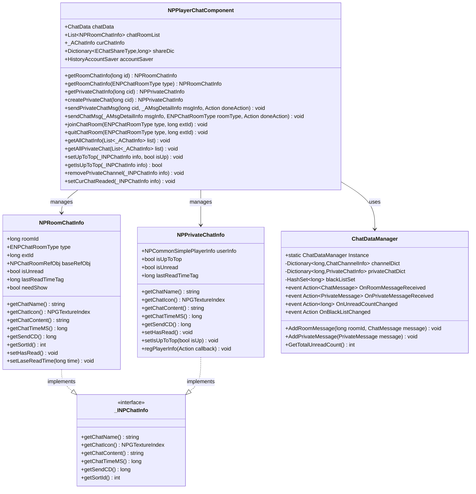
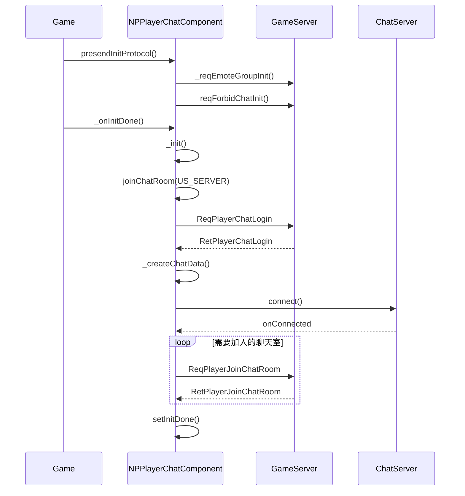
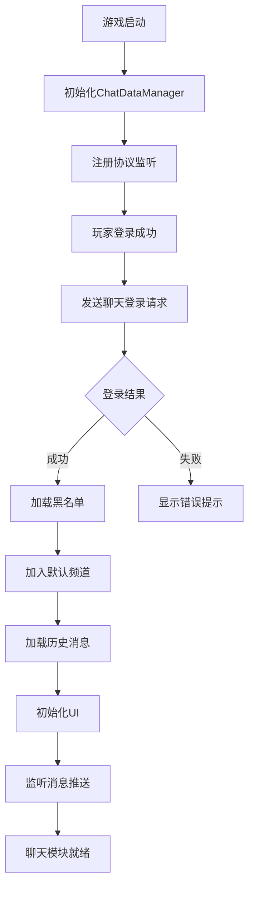
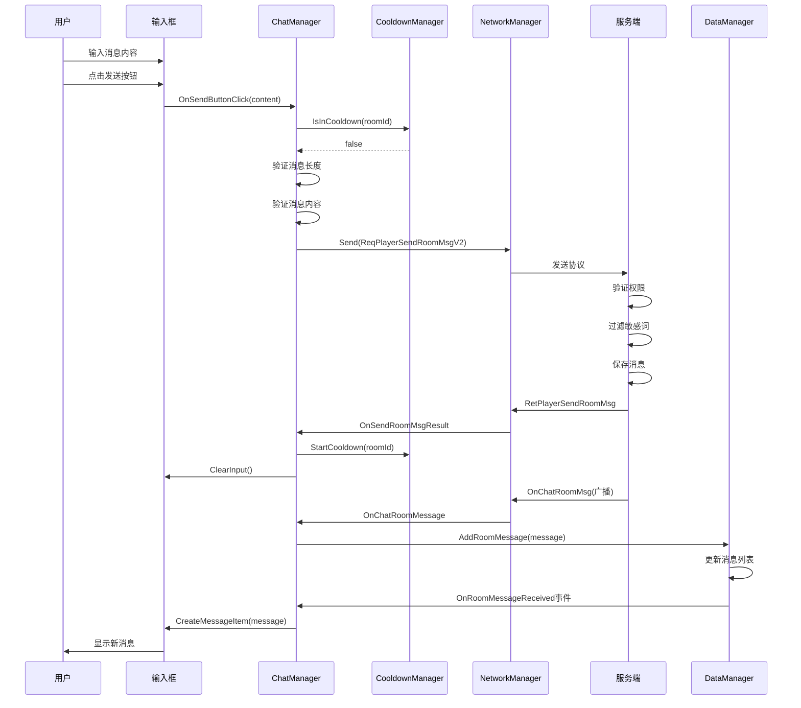
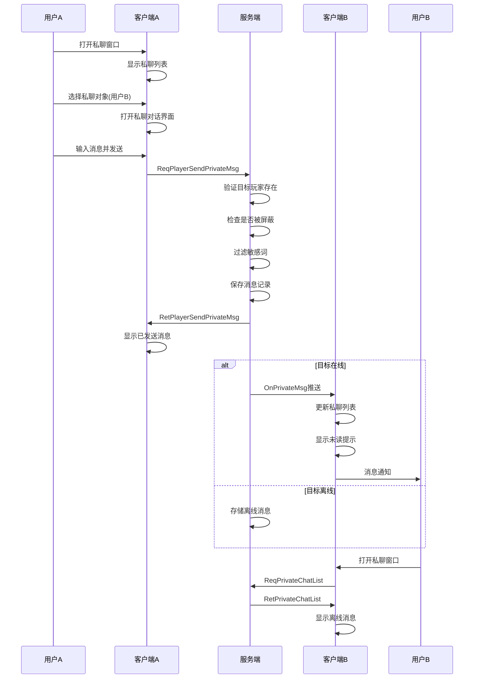
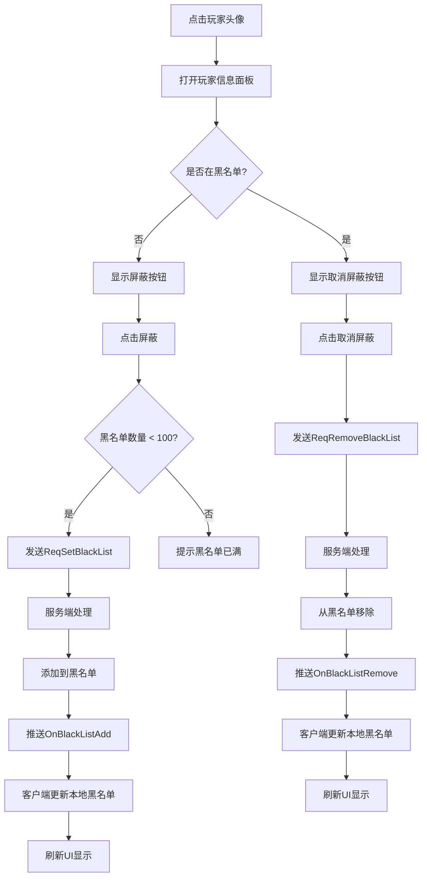

# 聊天模块客户端开发文档

**模块名称**: Chat（聊天模块）
**模块编号**: p022
**文档版本**: 2.0
**更新日期**: 2026-04-11

---

## 一、组件数据层

### 1.0 类结构图



### 1.1 核心组件类

#### NPPlayerChatComponent
**路径**: `GameComponent/NPChat/NPPlayerChatComponent.cs`

**功能**: 聊天组件，管理玩家聊天数据

**继承关系**:
```
NPPlayerChatComponent : _ANPBasicPlayerComponent
```

**协议模块**: p022_ChatOp

**主要属性**:

| 属性名 | 类型 | 说明 |
|--------|------|------|
| chatData | ChatData | 聊天包的数据对象 |
| chatRoomList | List\\<NPRoomChatInfo\\> | 聊天室的列表 |
| curChatInfo | _AChatInfo | 当前显示的聊天频道 |
| shareDic | Dictionary\\<EChatShareType,long\\> | 发送分享时间戳 |
| accountSaver | HistoryAccountSaver | 账号本地存储对象 |

**主要事件**:

| 事件名 | 参数类型 | 说明 |
|--------|----------|------|
| onChatRoomAdd | NPRoomChatInfo | 当有新的聊天室开启时 |
| onChatRoomRemove | NPRoomChatInfo | 当有聊天室关闭时 |
| onPrivateChatAdd | - | 当有新的私聊开启时 |
| onPrivateChatRemove | - | 当有私聊关闭时 |
| onChatDataCreat | - | 聊天数据创建时(断线重连等) |

**主要方法**:

| 方法名 | 参数 | 返回值 | 说明 |
|--------|------|--------|------|
| getRoomChatInfo | long _id | NPRoomChatInfo | 获取指定ID的聊天室 |
| getRoomChatInfo | ENPChatRoomType _roomType | NPRoomChatInfo | 获取指定类型的聊天室 |
| getPrivateChatInfo | long _cid | NPPrivateChatInfo | 获取指定私聊 |
| createPrivateChat | long _cid | NPPrivateChatInfo | 创建一个新的私聊会话 |
| sendPrivateChatMsg | long _cid, _AMsgDetailInfo _msgInfo, Action _doneAction | void | 发送私聊消息 |
| sendChatMsg | _AMsgDetailInfo _msgInfo, ENPChatRoomType _roomType, Action _doneAction | void | 发送频道消息 |
| joinChatRoom | ENPChatRoomType _type, long _extId | void | 加入聊天频道 |
| quitChatRoom | ENPChatRoomType _type, long _extId | void | 退出聊天频道 |
| getAllChatInfo | List\\<_AChatInfo\\> _list | void | 获取所有聊天室 |
| getAllPrivateChat | List\\<_AChatInfo\\> _list | void | 获取所有私聊 |
| setUpToTop | _INPChatInfo _info, bool _isUp | void | 设置是否置顶 |
| getIsUpToTop | _INPChatInfo _info | bool | 判断是否置顶 |
| removePrivateChannel | _INPChatInfo _info | void | 移除私聊频道 |
| setCurChatReaded | _INPChatInfo _info | void | 设置当前聊天已读 |

**组件初始化流程**:



---

### 1.2 聊天信息类

#### NPRoomChatInfo - 聊天室数据
**路径**: `GameComponent/NPChat/NPRoomChatInfo.cs`

**继承关系**:
```
NPRoomChatInfo : _ARoomChatInfo, _INPChatInfo
```

| 属性名 | 类型 | 说明 |
|--------|------|------|
| roomId | long | 聊天室ID |
| type | ENPChatRoomType | 聊天室类型 |
| extId | long | 扩展ID（如组队频道的活动实例ID） |
| baseRefObj | NPChatRoomRefObj | 聊天室配置 |
| isUnread | bool | 是否有未读消息 |
| lastReadTimeTag | long | 最后读取时间戳 |
| needShow | bool | 是否需要显示（根据解锁条件） |

**主要方法**:

| 方法名 | 参数 | 返回值 | 说明 |
|--------|------|--------|------|
| getChatName | - | string | 获取聊天室名称 |
| getChatIcon | - | NPGTextureIndex | 获取聊天室图标 |
| getChatContent | - | string | 获取最后一条消息内容 |
| getChatTimeMS | - | long | 获取最后消息时间戳 |
| getSendCD | - | long | 获取发送冷却时间（毫秒） |
| getSortId | - | int | 获取排序ID |
| setHasRead | - | void | 设置为已读 |
| setLaseReadTime | long | void | 设置最后读取时间 |

#### NPPrivateChatInfo - 私聊信息
**路径**: `GameComponent/NPChat/NPPrivateChatInfo.cs`

**继承关系**:
```
NPPrivateChatInfo : _APrivateChatInfo, _INPChatInfo
```

| 属性名 | 类型 | 说明 |
|--------|------|------|
| userInfo | NPCommonSimplePlayerInfo | 对方玩家信息 |
| isUpToTop | bool | 是否置顶 |
| isUnread | bool | 是否有未读消息 |
| lastReadTimeTag | long | 最后读取时间戳 |

**主要方法**:

| 方法名 | 参数 | 返回值 | 说明 |
|--------|------|--------|------|
| getChatName | - | string | 获取对方玩家名称 |
| getChatIcon | - | NPGTextureIndex | 获取对方头像 |
| getChatContent | - | string | 获取最后一条消息内容 |
| getChatTimeMS | - | long | 获取最后消息时间戳 |
| getSendCD | - | long | 获取发送冷却时间（毫秒） |
| setHasRead | - | void | 设置为已读 |
| setIsUpToTop | bool | void | 设置是否置顶 |
| regPlayerInfo | Action | void | 请求对方玩家信息 |

#### _INPChatInfo - 聊天信息接口
**路径**: `GameComponent/NPChat/_INPChatInfo.cs`

```csharp
public interface _INPChatInfo
{
    string getChatName();      // 获取聊天名称
    NPGTextureIndex getChatIcon(); // 获取聊天图标
    string getChatContent();   // 获取最后消息内容
    long getChatTimeMS();      // 获取最后消息时间
    long getSendCD();          // 获取发送冷却时间
    int getSortId();           // 获取排序ID
}
```

---

### 1.3 数据管理器

#### ChatDataManager
**路径**: `Manager/Chat/ChatDataManager.cs`

**功能**: 聊天数据管理中心，管理所有聊天相关数据

```csharp
public class ChatDataManager : MonoBehaviour
{
    // 单例
    public static ChatDataManager Instance { get; private set; }

    // 数据存储
    private Dictionary<long, ChatChannelInfo> channelDict;      // 频道字典
    private Dictionary<long, PrivateChatInfo> privateChatDict;  // 私聊字典
    private HashSet<long> blackListSet;                         // 黑名单集合

    // 事件
    public event Action<ChatMessage> OnRoomMessageReceived;
    public event Action<PrivateMessage> OnPrivateMessageReceived;
    public event Action<long> OnUnreadCountChanged;
    public event Action OnBlackListChanged;

    private void Awake()
    {
        Instance = this;
        channelDict = new Dictionary<long, ChatChannelInfo>();
        privateChatDict = new Dictionary<long, PrivateChatInfo>();
        blackListSet = new HashSet<long>();
    }

    /// <summary>
    /// 添加房间消息
    /// </summary>
    public void AddRoomMessage(long roomId, ChatMessage message)
    {
        if (!channelDict.TryGetValue(roomId, out var channel))
        {
            channel = new ChatChannelInfo { channelId = roomId };
            channelDict[roomId] = channel;
        }

        // 检查是否被屏蔽
        if (blackListSet.Contains(message.senderId))
        {
            return;
        }

        channel.messageList.Add(message);
        channel.lastMsgTime = message.sendTime;

        // 限制消息数量
        if (channel.messageList.Count > channel.maxMsgCount)
        {
            channel.messageList.RemoveAt(0);
        }

        // 触发事件
        OnRoomMessageReceived?.Invoke(message);
    }

    /// <summary>
    /// 添加私聊消息
    /// </summary>
    public void AddPrivateMessage(PrivateMessage message)
    {
        long targetId = message.senderId == NPPlayer.instance.playerId
            ? message.receiverId
            : message.senderId;

        if (!privateChatDict.TryGetValue(targetId, out var chatInfo))
        {
            chatInfo = new PrivateChatInfo { targetId = targetId };
            privateChatDict[targetId] = chatInfo;
        }

        // 检查是否被屏蔽
        if (blackListSet.Contains(message.senderId))
        {
            return;
        }

        chatInfo.messageList.Add(message);
        chatInfo.lastMsgTime = message.sendTime;

        // 增加未读数
        if (message.senderId != NPPlayer.instance.playerId && !message.isRead)
        {
            chatInfo.unreadCount++;
            OnUnreadCountChanged?.Invoke(GetTotalUnreadCount());
        }

        // 触发事件
        OnPrivateMessageReceived?.Invoke(message);
    }

    /// <summary>
    /// 获取总未读消息数
    /// </summary>
    public int GetTotalUnreadCount()
    {
        int total = 0;
        foreach (var channel in channelDict.Values)
        {
            total += channel.unreadCount;
        }
        foreach (var chat in privateChatDict.Values)
        {
            total += chat.unreadCount;
        }
        return total;
    }
}
```

---

## 二、协议接口

### 2.1 请求协议

| 协议名 | 说明 | 调用时机 |
|--------|------|----------|
| GC2GS_022_001_ReqPlayerChatLogin | 聊天登录 | 游戏登录后 |
| GC2GS_022_002_ReqPlayerJoinChatRoom | 加入聊天室 | 进入聊天频道 |
| GC2GS_022_003_ReqPlayerQuitChatRoom | 退出聊天室 | 离开聊天频道 |
| GC2GS_022_004_ReqPlayerSendRoomMsg | 发送聊天消息 | 发送频道消息 |
| GC2GS_022_005_ReqPlayerSendPrivateMsg | 发送私聊消息 | 发送私聊 |
| GC2GS_022_006_ReqPlayerSendRoomMsgV2 | 发送聊天消息V2 | 发送频道消息(新版) |
| GC2GS_022_007_ReqPlayerChatHistory | 请求聊天历史 | 加载历史消息 |
| GC2GS_022_008_ReqSetBlackList | 设置黑名单 | 屏蔽玩家 |
| GC2GS_022_009_ReqRemoveBlackList | 移除黑名单 | 取消屏蔽 |

### 2.2 响应协议

| 协议名 | 说明 | 处理方式 |
|--------|------|----------|
| GS2GC_022_001_RetPlayerChatLogin | 登录结果 | 初始化聊天数据 |
| GS2GC_022_002_RetPlayerJoinChatRoom | 加入结果 | 更新频道列表 |
| GS2GC_022_003_RetPlayerQuitChatRoom | 退出结果 | 更新频道列表 |
| GS2GC_022_004_RetPlayerSendRoomMsg | 发送结果 | 更新消息状态 |
| GS2GC_022_005_RetPlayerSendPrivateMsg | 私聊结果 | 更新消息状态 |
| GS2GC_022_050_OnChatRoomMsg | 新消息推送 | 显示新消息 |
| GS2GC_022_051_OnPrivateMsg | 私聊消息推送 | 显示私聊消息 |
| GS2GC_022_052_OnSystemMsg | 系统消息推送 | 显示系统消息 |

### 2.3 协议发送封装

```csharp
/// <summary>
/// 聊天协议发送器
/// </summary>
public class ChatProtocolSender
{
    /// <summary>
    /// 发送聊天登录请求
    /// </summary>
    public static void SendChatLogin()
    {
        GC2GS_022_001_ReqPlayerChatLogin req = new GC2GS_022_001_ReqPlayerChatLogin();
        req.setPlayerId(NPPlayer.instance.playerId);
        req.setToken(NPPlayer.instance.loginToken);
        NetworkManager.Send(req);
    }

    /// <summary>
    /// 发送房间消息
    /// </summary>
    public static void SendRoomMessage(long roomId, int msgType, string content, long bubbleId = 0)
    {
        // 检查内容长度
        if (string.IsNullOrEmpty(content) || content.Length > 200)
        {
            UIManager.ShowToast("消息长度不合法");
            return;
        }

        // 检查冷却
        if (ChatCooldownManager.Instance.IsInCooldown(roomId))
        {
            int remaining = ChatCooldownManager.Instance.GetRemainingCooldown(roomId);
            UIManager.ShowToast($"发言冷却中，请等待{remaining}秒");
            return;
        }

        GC2GS_022_006_ReqPlayerSendRoomMsgV2 req = new GC2GS_022_006_ReqPlayerSendRoomMsgV2();
        req.setRoomId(roomId);
        req.setMsgType(msgType);
        req.setContent(content);
        req.setBubbleId(bubbleId);
        NetworkManager.Send(req);

        // 开始冷却
        ChatCooldownManager.Instance.StartCooldown(roomId);
    }

    /// <summary>
    /// 发送私聊消息
    /// </summary>
    public static void SendPrivateMessage(long targetId, int msgType, string content)
    {
        if (string.IsNullOrEmpty(content) || content.Length > 200)
        {
            UIManager.ShowToast("消息长度不合法");
            return;
        }

        GC2GS_022_005_ReqPlayerSendPrivateMsg req = new GC2GS_022_005_ReqPlayerSendPrivateMsg();
        req.setTargetId(targetId);
        req.setMsgType(msgType);

        // 构建发送者信息
        Common_FriendChatInfo userInfo = new Common_FriendChatInfo();
        userInfo.setSenderId(NPPlayer.instance.playerId);
        userInfo.setSenderName(NPPlayer.instance.playerInfo.playerName);
        userInfo.setSenderIcon(NPPlayer.instance.playerInfo.iconId);
        req.setGameUser(Serialize(userInfo));
        req.setGameContent(Serialize(content));

        NetworkManager.Send(req);
    }

    /// <summary>
    /// 加入房间
    /// </summary>
    public static void JoinRoom(long roomId, int roomType)
    {
        GC2GS_022_002_ReqPlayerJoinChatRoom req = new GC2GS_022_002_ReqPlayerJoinChatRoom();
        req.setRoomId(roomId);
        req.setRoomType(roomType);
        NetworkManager.Send(req);
    }

    /// <summary>
    /// 退出房间
    /// </summary>
    public static void QuitRoom(long roomId)
    {
        GC2GS_022_003_ReqPlayerQuitChatRoom req = new GC2GS_022_003_ReqPlayerQuitChatRoom();
        req.setRoomId(roomId);
        NetworkManager.Send(req);
    }

    /// <summary>
    /// 添加黑名单
    /// </summary>
    public static void AddToBlackList(long targetId)
    {
        GC2GS_022_008_ReqSetBlackList req = new GC2GS_022_008_ReqSetBlackList();
        req.setTargetId(targetId);
        NetworkManager.Send(req);
    }
}
```

### 2.4 协议接收处理

```csharp
/// <summary>
/// 聊天协议接收器
/// </summary>
public class ChatProtocolReceiver : MonoBehaviour
{
    private void Start()
    {
        RegisterListeners();
    }

    private void RegisterListeners()
    {
        NetworkManager.AddListener<GS2GC_022_001_RetPlayerChatLogin>(OnChatLoginResult);
        NetworkManager.AddListener<GS2GC_022_002_RetPlayerJoinChatRoom>(OnJoinRoomResult);
        NetworkManager.AddListener<GS2GC_022_004_RetPlayerSendRoomMsg>(OnSendRoomMsgResult);
        NetworkManager.AddListener<GS2GC_022_050_OnChatRoomMsg>(OnChatRoomMessage);
        NetworkManager.AddListener<GS2GC_022_051_OnPrivateMsg>(OnPrivateMessage);
        NetworkManager.AddListener<GS2GC_022_052_OnSystemMsg>(OnSystemMessage);
        NetworkManager.AddListener<GS2GC_022_055_OnMuteStateChg>(OnMuteStateChanged);
    }

    /// <summary>
    /// 聊天登录结果
    /// </summary>
    private void OnChatLoginResult(GS2GC_022_001_RetPlayerChatLogin _proto)
    {
        if (_proto.getResult() != 0)
        {
            UIManager.ShowToast("聊天服务连接失败");
            return;
        }

        // 初始化黑名单
        var blackList = _proto.getBlackList();
        ChatDataManager.Instance.SetBlackList(blackList);

        // 加入默认房间
        var defaultRooms = _proto.getDefaultRooms();
        foreach (var roomId in defaultRooms)
        {
            ChatProtocolSender.JoinRoom(roomId, 1);
        }

        // 标记登录成功
        NPPlayer.instance.chatComp.isChatLoggedIn = true;
    }

    /// <summary>
    /// 房间消息推送
    /// </summary>
    private void OnChatRoomMessage(GS2GC_022_050_OnChatRoomMsg _proto)
    {
        ChatMessageInfo msgInfo = _proto.getMsgInfo();

        // 检查黑名单
        if (ChatDataManager.Instance.IsInBlackList(msgInfo.getSenderId()))
        {
            return;
        }

        // 转换为客户端消息对象
        ChatMessage message = new ChatMessage
        {
            msgId = msgInfo.getMsgId(),
            roomId = _proto.getRoomId(),
            senderId = msgInfo.getSenderId(),
            senderName = msgInfo.getSenderName(),
            senderIcon = msgInfo.getSenderIcon(),
            senderVipLevel = msgInfo.getSenderVipLevel(),
            content = msgInfo.getContent(),
            sendTime = msgInfo.getSendTime(),
            msgType = msgInfo.getMsgType(),
            bubbleId = msgInfo.getBubbleId()
        };

        // 添加到数据管理器
        ChatDataManager.Instance.AddRoomMessage(_proto.getRoomId(), message);
    }

    /// <summary>
    /// 私聊消息推送
    /// </summary>
    private void OnPrivateMessage(GS2GC_022_051_OnPrivateMsg _proto)
    {
        PrivateMessageInfo msgInfo = _proto.getMsgInfo();

        // 检查黑名单
        if (ChatDataManager.Instance.IsInBlackList(msgInfo.getSenderId()))
        {
            return;
        }

        PrivateMessage message = new PrivateMessage
        {
            msgId = msgInfo.getMsgId(),
            senderId = msgInfo.getSenderId(),
            senderName = msgInfo.getSenderName(),
            senderIcon = msgInfo.getSenderIcon(),
            receiverId = msgInfo.getReceiverId(),
            content = msgInfo.getContent(),
            sendTime = msgInfo.getSendTime(),
            msgType = msgInfo.getMsgType(),
            isRead = false
        };

        ChatDataManager.Instance.AddPrivateMessage(message);
    }

    /// <summary>
    /// 系统消息推送
    /// </summary>
    private void OnSystemMessage(GS2GC_022_052_OnSystemMsg _proto)
    {
        SystemMessage message = new SystemMessage
        {
            msgType = _proto.getMsgType(),
            title = _proto.getTitle(),
            content = _proto.getContent(),
            sendTime = _proto.getSendTime()
        };

        // 显示系统消息
        UIManager.ShowSystemMessage(message);
    }

    /// <summary>
    /// 禁言状态变化
    /// </summary>
    private void OnMuteStateChanged(GS2GC_022_055_OnMuteStateChg _proto)
    {
        if (_proto.getIsMuted())
        {
            long endTime = _proto.getMuteEndTime();
            string reason = _proto.getReason();
            UIManager.ShowToast($"您已被禁言，结束时间：{FormatTime(endTime)}，原因：{reason}");
        }
        else
        {
            UIManager.ShowToast("您已被解除禁言");
        }
    }
}
```

---

## 三、频道类型

| 类型 | 类型ID | 说明 | 特点 |
|------|--------|------|------|
| 世界频道 | 1 | 全服广播 | 所有玩家可见，有发言冷却 |
| 公会频道 | 2 | 公会内部聊天 | 仅公会成员可见 |
| 私聊频道 | 3 | 一对一聊天 | 无冷却，隐私保护 |
| 系统频道 | 4 | 系统消息 | 仅GM可用，无冷却 |
| 广播频道 | 5 | 特殊活动广播 | 活动期间可用 |
| 组队频道 | 6 | 组队聊天 | 队伍成员可见 |
| 附近频道 | 7 | 同屏玩家 | 同场景玩家可见 |

---

## 四、UI窗口

### 4.1 窗口目录结构

```
GameWndGui/GGui/Chat/
├── GGUIWndChatMain.cs          # 聊天主界面
├── GGUIWndChatChannel.cs       # 频道界面
├── GGUIWndChatPrivate.cs       # 私聊界面
├── GGUIWndChatInput.cs         # 输入框
├── GGUIWndChatEmote.cs         # 表情选择
├── GGUIWndChatBubble.cs        # 气泡选择
├── GGUIWndChatHistory.cs       # 历史记录
├── GGUIWndChatBlackList.cs     # 黑名单管理
└── Components/
    ├── ChatMessageItem.cs      # 消息项组件
    ├── ChatChannelTab.cs       # 频道标签组件
    ├── ChatPrivateItem.cs      # 私聊项组件
    └── ChatEmoteItem.cs        # 表情项组件
```

### 4.2 窗口说明

| 类名 | 说明 | 功能 |
|------|------|------|
| GGUIWndChatMain | 聊天主界面 | 频道切换、消息显示、输入框 |
| GGUIWndChatChannel | 频道界面 | 频道列表、加入/退出频道 |
| GGUIWndChatPrivate | 私聊界面 | 私聊列表、私聊对话 |
| GGUIWndChatInput | 输入框 | 文本输入、表情、发送 |
| GGUIWndChatEmote | 表情选择 | 表情列表、选择表情 |
| GGUIWndChatBubble | 气泡选择 | 气泡列表、选择气泡 |
| GGUIWndChatHistory | 历史记录 | 查看历史消息 |
| GGUIWndChatBlackList | 黑名单管理 | 添加/移除黑名单 |

### 4.3 主界面实现示例

```csharp
/// <summary>
/// 聊天主界面
/// </summary>
public class GGUIWndChatMain : GGUIWndBase
{
    // UI组件
    [SerializeField] private Transform channelTabContainer;   // 频道标签容器
    [SerializeField] private Transform messageContainer;      // 消息容器
    [SerializeField] private GGUIWndChatInput inputField;     // 输入框
    [SerializeField] private ScrollRect messageScrollRect;    // 消息滚动视图

    // 预制体
    [SerializeField] private GameObject messageItemPrefab;    // 消息项预制体
    [SerializeField] private GameObject channelTabPrefab;     // 频道标签预制体

    // 数据
    private long currentRoomId = 1;                           // 当前房间ID
    private List<GameObject> messageItems = new List<GameObject>();
    private Dictionary<long, ChatChannelTab> channelTabs = new Dictionary<long, ChatChannelTab>();

    protected override void OnInit()
    {
        base.OnInit();

        // 注册事件
        ChatDataManager.Instance.OnRoomMessageReceived += OnMessageReceived;
        ChatDataManager.Instance.OnUnreadCountChanged += OnUnreadCountChanged;

        // 初始化频道标签
        InitChannelTabs();
    }

    protected override void OnShow()
    {
        base.OnShow();

        // 刷新消息列表
        RefreshMessages();

        // 清除当前频道未读
        ChatDataManager.Instance.ClearUnreadCount(currentRoomId);
    }

    protected override void OnDestroy()
    {
        // 注销事件
        ChatDataManager.Instance.OnRoomMessageReceived -= OnMessageReceived;
        ChatDataManager.Instance.OnUnreadCountChanged -= OnUnreadCountChanged;

        base.OnDestroy();
    }

    /// <summary>
    /// 初始化频道标签
    /// </summary>
    private void InitChannelTabs()
    {
        // 世界频道
        CreateChannelTab(1, "世界", 1);

        // 公会频道
        if (NPPlayer.instance.guildComp != null && NPPlayer.instance.guildComp.HasGuild())
        {
            CreateChannelTab(2, "公会", 2);
        }

        // 私聊
        CreateChannelTab(0, "私聊", 3);
    }

    /// <summary>
    /// 创建频道标签
    /// </summary>
    private void CreateChannelTab(long roomId, string name, int type)
    {
        GameObject tabObj = Instantiate(channelTabPrefab, channelTabContainer);
        ChatChannelTab tab = tabObj.GetComponent<ChatChannelTab>();
        tab.SetData(roomId, name, type);
        tab.OnClick += OnChannelTabClick;
        channelTabs[roomId] = tab;
    }

    /// <summary>
    /// 频道标签点击
    /// </summary>
    private void OnChannelTabClick(long roomId)
    {
        if (currentRoomId == roomId) return;

        currentRoomId = roomId;

        // 更新标签选中状态
        foreach (var tab in channelTabs.Values)
        {
            tab.SetSelected(tab.RoomId == roomId);
        }

        // 刷新消息列表
        RefreshMessages();

        // 清除未读
        ChatDataManager.Instance.ClearUnreadCount(roomId);
    }

    /// <summary>
    /// 刷新消息列表
    /// </summary>
    private void RefreshMessages()
    {
        // 清除旧消息
        foreach (var item in messageItems)
        {
            Destroy(item);
        }
        messageItems.Clear();

        // 获取消息列表
        var messages = ChatDataManager.Instance.GetMessages(currentRoomId);
        if (messages == null) return;

        // 创建消息项
        foreach (var message in messages)
        {
            CreateMessageItem(message);
        }

        // 滚动到底部
        ScrollToBottom();
    }

    /// <summary>
    /// 创建消息项
    /// </summary>
    private void CreateMessageItem(ChatMessage message)
    {
        GameObject itemObj = Instantiate(messageItemPrefab, messageContainer);
        ChatMessageItem item = itemObj.GetComponent<ChatMessageItem>();
        item.SetData(message);
        messageItems.Add(itemObj);
    }

    /// <summary>
    /// 接收到新消息
    /// </summary>
    private void OnMessageReceived(ChatMessage message)
    {
        if (message.roomId != currentRoomId) return;

        // 检查是否被屏蔽
        if (ChatDataManager.Instance.IsInBlackList(message.senderId))
        {
            return;
        }

        // 添加消息项
        CreateMessageItem(message);

        // 滚动到底部
        ScrollToBottom();
    }

    /// <summary>
    /// 未读数变化
    /// </summary>
    private void OnUnreadCountChanged(int totalUnread)
    {
        // 更新红点显示
        // ...
    }

    /// <summary>
    /// 发送消息
    /// </summary>
    public void OnSendButtonClick()
    {
        string content = inputField.GetText();
        if (string.IsNullOrEmpty(content)) return;

        ChatProtocolSender.SendRoomMessage(currentRoomId, 1, content);

        // 清空输入框
        inputField.Clear();
    }

    /// <summary>
    /// 滚动到底部
    /// </summary>
    private void ScrollToBottom()
    {
        Canvas.ForceUpdateCanvases();
        messageScrollRect.verticalNormalizedPosition = 0;
    }
}
```

---

## 五、发言冷却管理

```csharp
/// <summary>
/// 聊天冷却管理器
/// </summary>
public class ChatCooldownManager : MonoBehaviour
{
    public static ChatCooldownManager Instance { get; private set; }

    // 冷却数据
    private Dictionary<long, float> cooldownDict = new Dictionary<long, float>();

    // 配置数据
    private Dictionary<long, int> roomCdTimeDict = new Dictionary<long, int>();

    private void Awake()
    {
        Instance = this;
    }

    /// <summary>
    /// 设置房间冷却时间
    /// </summary>
    public void SetRoomCdTime(long roomId, int cdTime)
    {
        roomCdTimeDict[roomId] = cdTime;
    }

    /// <summary>
    /// 开始冷却
    /// </summary>
    public void StartCooldown(long roomId)
    {
        if (!roomCdTimeDict.TryGetValue(roomId, out int cdTime))
        {
            cdTime = 5; // 默认5秒
        }

        cooldownDict[roomId] = Time.time + cdTime;
    }

    /// <summary>
    /// 是否在冷却中
    /// </summary>
    public bool IsInCooldown(long roomId)
    {
        if (!cooldownDict.TryGetValue(roomId, out float endTime))
        {
            return false;
        }

        return Time.time < endTime;
    }

    /// <summary>
    /// 获取剩余冷却时间
    /// </summary>
    public int GetRemainingCooldown(long roomId)
    {
        if (!cooldownDict.TryGetValue(roomId, out float endTime))
        {
            return 0;
        }

        float remaining = endTime - Time.time;
        return remaining > 0 ? Mathf.CeilToInt(remaining) : 0;
    }

    /// <summary>
    /// 清除冷却
    /// </summary>
    public void ClearCooldown(long roomId)
    {
        cooldownDict.Remove(roomId);
    }
}
```

---

## 六、访问方式

```csharp
// 获取聊天组件
NPPlayerChatComponent chatComp = NPPlayer.instance.chatComp;

// 获取未读消息数
int unread = chatComp.unreadCount;

// 获取频道列表
var channels = chatComp.channelList;

// 获取私聊列表
var privateChats = chatComp.privateChatList;

// 检查是否在房间内
bool isInRoom = ChatDataManager.Instance.IsInRoom(roomId);

// 获取房间消息
var messages = ChatDataManager.Instance.GetMessages(roomId);

// 发送消息
ChatProtocolSender.SendRoomMessage(roomId, 1, "消息内容");

// 发送私聊
ChatProtocolSender.SendPrivateMessage(targetId, 1, "私聊内容");

// 添加黑名单
ChatProtocolSender.AddToBlackList(targetId);

// 检查是否在黑名单
bool isBlocked = ChatDataManager.Instance.IsInBlackList(targetId);
```

---

## 七、组件初始化流程



---

*文档生成时间: 2026-04-11*
*源码参考路径: `/game_client/Assets/Scripts/GameComponent/NPChat/`*

---

## 八、UI组件详解

### 8.1 消息项组件 (ChatMessageItem)

```csharp
/// <summary>
/// 聊天消息项组件
/// </summary>
public class ChatMessageItem : MonoBehaviour
{
    [Header("UI组件")]
    [SerializeField] private Image avatarImage;          // 头像
    [SerializeField] private Text nameText;              // 名称
    [SerializeField] private Text contentText;           // 内容
    [SerializeField] private Text timeText;              // 时间
    [SerializeField] private Image bubbleImage;          // 气泡背景
    [SerializeField] private GameObject vipIcon;         // VIP图标
    [SerializeField] private Button avatarButton;        // 头像点击
    [SerializeField] private LayoutElement layoutElement; // 布局元素

    private ChatMessage messageData;

    /// <summary>
    /// 设置消息数据
    /// </summary>
    public void SetData(ChatMessage message)
    {
        messageData = message;

        // 设置头像
        AvatarManager.Instance.LoadAvatar(message.senderIcon, avatarImage);

        // 设置名称
        nameText.text = message.senderName;

        // 设置内容（根据消息类型）
        SetContent(message);

        // 设置时间
        timeText.text = FormatTime(message.sendTime);

        // 设置气泡
        SetBubble(message.bubbleId);

        // 设置VIP图标
        vipIcon.SetActive(message.senderVipLevel > 0);

        // 设置布局（自己发送的消息靠右）
        bool isSelf = message.senderId == NPPlayer.instance.playerId;
        layoutElement.childAlignment = isSelf ? TextAnchor.MiddleRight : TextAnchor.MiddleLeft;

        // 注册点击事件
        avatarButton.onClick.RemoveAllListeners();
        avatarButton.onClick.AddListener(() => OnAvatarClick(message.senderId));
    }

    /// <summary>
    /// 设置消息内容
    /// </summary>
    private void SetContent(ChatMessage message)
    {
        switch (message.msgType)
        {
            case 1: // 文本消息
                contentText.text = message.content;
                break;
            case 2: // 表情消息
                contentText.text = $"<sprite={message.content}>";
                break;
            case 5: // 物品分享
                SetItemShareContent(message.content);
                break;
            case 6: // 大臣分享
                SetHeroShareContent(message.content);
                break;
            default:
                contentText.text = message.content;
                break;
        }
    }

    /// <summary>
    /// 设置气泡样式
    /// </summary>
    private void SetBubble(long bubbleId)
    {
        ChatBubbleRefObj bubbleRef = GRefdataCoreMgr.instance.chatBubbleRefCore.getRef(bubbleId);
        if (bubbleRef != null)
        {
            // 加载气泡背景
            ResourceManager.Instance.LoadSprite(bubbleRef.bg_image, (sprite) =>
            {
                bubbleImage.sprite = sprite;
            });

            // 设置文字颜色
            Color textColor;
            if (ColorUtility.TryParseHtmlString(bubbleRef.color, out textColor))
            {
                contentText.color = textColor;
            }

            // 设置描边颜色
            if (ColorUtility.TryParseHtmlString(bubbleRef.outline_color, out Color outlineColor))
            {
                var outline = contentText.GetComponent<Outline>();
                if (outline != null)
                {
                    outline.effectColor = outlineColor;
                }
            }
        }
    }

    /// <summary>
    /// 设置物品分享内容
    /// </summary>
    private void SetItemShareContent(string content)
    {
        // 解析物品信息
        var itemInfo = JsonUtility.FromJson<ItemShareInfo>(content);

        // 显示物品卡片
        contentText.text = $"<color=yellow>[物品]</color> {itemInfo.itemName} x{itemInfo.count}";
    }

    /// <summary>
    /// 设置大臣分享内容
    /// </summary>
    private void SetHeroShareContent(string content)
    {
        var heroInfo = JsonUtility.FromJson<HeroShareInfo>(content);

        contentText.text = $"<color=purple>[大臣]</color> {heroInfo.heroName} Lv.{heroInfo.level}";
    }

    /// <summary>
    /// 格式化时间
    /// </summary>
    private string FormatTime(long timestamp)
    {
        DateTime time = DateTimeOffset.FromUnixTimeMilliseconds(timestamp).LocalDateTime;
        DateTime now = DateTime.Now;

        if (time.Date == now.Date)
        {
            return time.ToString("HH:mm");
        }
        else if (time.Date == now.AddDays(-1).Date)
        {
            return $"昨天 {time:HH:mm}";
        }
        else
        {
            return time.ToString("MM-dd HH:mm");
        }
    }

    /// <summary>
    /// 头像点击事件
    /// </summary>
    private void OnAvatarClick(long playerId)
    {
        // 打开玩家信息面板
        UIManager.Instance.OpenWindow<PlayerInfoWindow>(playerId);
    }
}
```

### 8.2 频道标签组件 (ChatChannelTab)

```csharp
/// <summary>
/// 聊天频道标签组件
/// </summary>
public class ChatChannelTab : MonoBehaviour
{
    [Header("UI组件")]
    [SerializeField] private Image tabImage;           // 标签背景
    [SerializeField] private Text nameText;            // 频道名称
    [SerializeField] private GameObject unreadObj;     // 未读红点
    [SerializeField] private Text unreadText;          // 未读数量
    [SerializeField] private Button tabButton;         // 标签按钮

    [Header("状态样式")]
    [SerializeField] private Color normalColor = Color.white;
    [SerializeField] private Color selectedColor = new Color(1, 0.8f, 0.4f);

    // 数据
    public long RoomId { get; private set; }
    public event Action<long> OnClick;

    private bool isSelected = false;

    /// <summary>
    /// 设置数据
    /// </summary>
    public void SetData(long roomId, string name, int type)
    {
        RoomId = roomId;
        nameText.text = name;

        // 设置图标
        SetTabIcon(type);

        // 注册点击事件
        tabButton.onClick.RemoveAllListeners();
        tabButton.onClick.AddListener(() => OnClick?.Invoke(RoomId));
    }

    /// <summary>
    /// 设置选中状态
    /// </summary>
    public void SetSelected(bool selected)
    {
        isSelected = selected;
        tabImage.color = selected ? selectedColor : normalColor;
        nameText.fontStyle = selected ? FontStyle.Bold : FontStyle.Normal;
    }

    /// <summary>
    /// 更新未读数
    /// </summary>
    public void UpdateUnreadCount(int count)
    {
        if (count > 0)
        {
            unreadObj.SetActive(true);
            unreadText.text = count > 99 ? "99+" : count.ToString();
        }
        else
        {
            unreadObj.SetActive(false);
        }
    }

    /// <summary>
    /// 设置标签图标
    /// </summary>
    private void SetTabIcon(int type)
    {
        // 根据频道类型设置不同图标
        string iconPath = "";
        switch (type)
        {
            case 1: iconPath = "UI/Chat/icon_world"; break;
            case 2: iconPath = "UI/Chat/icon_guild"; break;
            case 3: iconPath = "UI/Chat/icon_private"; break;
            case 4: iconPath = "UI/Chat/icon_system"; break;
            case 5: iconPath = "UI/Chat/icon_broadcast"; break;
            default: iconPath = "UI/Chat/icon_default"; break;
        }

        ResourceManager.Instance.LoadSprite(iconPath, (sprite) =>
        {
            if (tabImage != null && sprite != null)
            {
                tabImage.sprite = sprite;
            }
        });
    }
}
```

### 8.3 表情选择面板 (GGUIWndChatEmote)

```csharp
/// <summary>
/// 表情选择面板
/// </summary>
public class GGUIWndChatEmote : GGUIWndBase
{
    [Header("UI组件")]
    [SerializeField] private Transform emoteGroupContainer;   // 表情组容器
    [SerializeField] private Transform emoteGridContainer;    // 表情网格容器
    [SerializeField] private GameObject emoteGroupPrefab;     // 表情组预制体
    [SerializeField] private GameObject emoteItemPrefab;      // 表情项预制体

    // 数据
    private List<EmoteGroup> emoteGroups = new List<EmoteGroup>();
    private int currentGroupId = 1;

    // 事件
    public event Action<long> OnEmoteSelected;

    protected override void OnInit()
    {
        base.OnInit();
        LoadEmoteData();
    }

    protected override void OnShow()
    {
        base.OnShow();
        RefreshEmoteGroups();
        RefreshEmoteGrid(currentGroupId);
    }

    /// <summary>
    /// 加载表情数据
    /// </summary>
    private void LoadEmoteData()
    {
        emoteGroups.Clear();

        // 从配表加载表情
        var allEmotes = GRefdataCoreMgr.instance.chatEmoteRefCore.getAll();

        // 按组分类
        var groups = allEmotes.GroupBy(e => e.group_id);
        foreach (var group in groups)
        {
            var emoteGroup = new EmoteGroup
            {
                GroupId = group.Key,
                GroupName = group.First().group_name,
                Emotes = group.ToList()
            };
            emoteGroups.Add(emoteGroup);
        }

        // 排序
        emoteGroups = emoteGroups.OrderBy(g => g.GroupId).ToList();
    }

    /// <summary>
    /// 刷新表情组标签
    /// </summary>
    private void RefreshEmoteGroups()
    {
        // 清除旧内容
        foreach (Transform child in emoteGroupContainer)
        {
            Destroy(child.gameObject);
        }

        // 创建标签
        foreach (var group in emoteGroups)
        {
            GameObject groupObj = Instantiate(emoteGroupPrefab, emoteGroupContainer);
            Text groupText = groupObj.GetComponentInChildren<Text>();
            groupText.text = group.GroupName;

            Button groupBtn = groupObj.GetComponent<Button>();
            int groupId = group.GroupId;
            groupBtn.onClick.AddListener(() => OnGroupClick(groupId));

            // 高亮当前组
            if (group.GroupId == currentGroupId)
            {
                groupText.color = Color.yellow;
            }
        }
    }

    /// <summary>
    /// 刷新表情网格
    /// </summary>
    private void RefreshEmoteGrid(int groupId)
    {
        // 清除旧内容
        foreach (Transform child in emoteGridContainer)
        {
            Destroy(child.gameObject);
        }

        // 获取当前组的表情
        var group = emoteGroups.FirstOrDefault(g => g.GroupId == groupId);
        if (group == null) return;

        int playerLevel = NPPlayer.instance.playerInfo.playerLevel;
        int vipLevel = NPPlayer.instance.playerInfo.vipLevel;

        // 创建表情项
        foreach (var emoteRef in group.Emotes.OrderBy(e => e.sort))
        {
            // 检查解锁状态
            bool isUnlocked = CheckEmoteUnlock(emoteRef, playerLevel, vipLevel);

            GameObject emoteObj = Instantiate(emoteItemPrefab, emoteGridContainer);

            // 设置表情图标
            Image emoteImage = emoteObj.GetComponent<Image>();
            ResourceManager.Instance.LoadSprite(emoteRef.icon, (sprite) =>
            {
                emoteImage.sprite = sprite;
                emoteImage.color = isUnlocked ? Color.white : new Color(0.5f, 0.5f, 0.5f);
            });

            // 注册点击事件
            Button emoteBtn = emoteObj.GetComponent<Button>();
            long emoteId = emoteRef.id;
            emoteBtn.onClick.AddListener(() => OnEmoteClick(emoteId, isUnlocked));

            // 锁定状态
            if (!isUnlocked)
            {
                Transform lockIcon = emoteObj.transform.Find("LockIcon");
                if (lockIcon != null) lockIcon.gameObject.SetActive(true);
            }
        }
    }

    /// <summary>
    /// 检查表情解锁状态
    /// </summary>
    private bool CheckEmoteUnlock(ChatEmoteRefObj emoteRef, int playerLevel, int vipLevel)
    {
        switch (emoteRef.unlock_type)
        {
            case 1: return true;
            case 2: return playerLevel >= emoteRef.unlock_param.level;
            case 3: return vipLevel >= emoteRef.vip_level;
            case 4: return AchievementManager.Instance.IsCompleted(emoteRef.unlock_param.achievement_id);
            case 5: return ActivityManager.Instance.HasReward(emoteRef.unlock_param.activity_id, emoteRef.id);
            case 6: return ShopManager.Instance.HasPurchased(emoteRef.id);
            default: return false;
        }
    }

    /// <summary>
    /// 表情组点击
    /// </summary>
    private void OnGroupClick(int groupId)
    {
        if (currentGroupId == groupId) return;

        currentGroupId = groupId;
        RefreshEmoteGroups();
        RefreshEmoteGrid(groupId);
    }

    /// <summary>
    /// 表情点击
    /// </summary>
    private void OnEmoteClick(long emoteId, bool isUnlocked)
    {
        if (!isUnlocked)
        {
            UIManager.ShowToast("该表情尚未解锁");
            return;
        }

        // 触发事件
        OnEmoteSelected?.Invoke(emoteId);

        // 关闭面板
        Close();
    }
}

/// <summary>
/// 表情组数据结构
/// </summary>
public class EmoteGroup
{
    public long GroupId;
    public string GroupName;
    public List<ChatEmoteRefObj> Emotes;
}
```

---

## 九、完整交互流程图

### 9.1 聊天消息发送完整流程



### 9.2 私聊完整交互流程



### 9.3 黑名单管理流程



---

## 十、性能优化建议

### 10.1 消息列表优化

```csharp
/// <summary>
/// 优化的消息列表组件 - 使用对象池
/// </summary>
public class OptimizedMessageList : MonoBehaviour
{
    [SerializeField] private ScrollRect scrollRect;
    [SerializeField] private RectTransform contentContainer;
    [SerializeField] private GameObject messageItemPrefab;

    // 对象池
    private ObjectPool<ChatMessageItem> messageItemPool;
    // 可见消息项
    private List<ChatMessageItem> visibleItems = new List<ChatMessageItem>();
    // 消息数据
    private List<ChatMessage> messageDataList = new List<ChatMessage>();

    // 虚拟列表参数
    private float itemHeight = 80f;
    private float viewportHeight;
    private int visibleItemCount;

    private void Awake()
    {
        // 初始化对象池
        messageItemPool = new ObjectPool<ChatMessageItem>(
            () => Instantiate(messageItemPrefab, contentContainer).GetComponent<ChatMessageItem>(),
            (item) => item.gameObject.SetActive(true),
            (item) => item.gameObject.SetActive(false)
        );

        viewportHeight = scrollRect.viewport.rect.height;
        visibleItemCount = Mathf.CeilToInt(viewportHeight / itemHeight) + 2;
    }

    /// <summary>
    /// 添加消息
    /// </summary>
    public void AddMessage(ChatMessage message)
    {
        messageDataList.Add(message);

        // 只在底部时自动滚动
        if (IsAtBottom())
        {
            RefreshVisibleItems();
            ScrollToBottom();
        }
        else
        {
            // 显示新消息提示
            ShowNewMessageIndicator();
        }
    }

    /// <summary>
    /// 刷新可见消息项
    /// </summary>
    private void RefreshVisibleItems()
    {
        // 回收所有可见项
        foreach (var item in visibleItems)
        {
            messageItemPool.Return(item);
        }
        visibleItems.Clear();

        // 计算可见范围
        int startIndex = Mathf.Max(0, Mathf.FloorToInt(contentContainer.anchoredPosition.y / itemHeight));
        int endIndex = Mathf.Min(messageDataList.Count, startIndex + visibleItemCount);

        // 创建可见项
        for (int i = startIndex; i < endIndex; i++)
        {
            var item = messageItemPool.Get();
            item.transform.SetSiblingIndex(i - startIndex);
            item.SetData(messageDataList[i]);
            visibleItems.Add(item);
        }

        // 更新内容高度
        contentContainer.sizeDelta = new Vector2(contentContainer.sizeDelta.x, messageDataList.Count * itemHeight);
    }

    /// <summary>
    /// 是否在底部
    /// </summary>
    private bool IsAtBottom()
    {
        return scrollRect.verticalNormalizedPosition <= 0.1f;
    }

    /// <summary>
    /// 滚动到底部
    /// </summary>
    private void ScrollToBottom()
    {
        scrollRect.verticalNormalizedPosition = 0;
    }
}
```

### 10.2 表情资源预加载

```csharp
/// <summary>
/// 表情资源预加载管理器
/// </summary>
public class EmotePreloadManager : MonoBehaviour
{
    private Dictionary<long, Sprite> emoteSpriteCache = new Dictionary<long, Sprite>();

    /// <summary>
    /// 预加载常用表情
    /// </summary>
    public void PreloadCommonEmotes()
    {
        // 获取默认解锁的表情
        var allEmotes = GRefdataCoreMgr.instance.chatEmoteRefCore.getAll();
        var commonEmotes = allEmotes.Where(e => e.unlock_type == 1).Take(20);

        foreach (var emote in commonEmotes)
        {
            StartCoroutine(LoadEmoteSprite(emote.id, emote.icon));
        }
    }

    private IEnumerator LoadEmoteSprite(long emoteId, string iconPath)
    {
        ResourceRequest request = Resources.LoadAsync<Sprite>(iconPath);
        yield return request;

        if (request.asset != null)
        {
            emoteSpriteCache[emoteId] = request.asset as Sprite;
        }
    }

    /// <summary>
    /// 获取表情精灵
    /// </summary>
    public Sprite GetEmoteSprite(long emoteId)
    {
        if (emoteSpriteCache.TryGetValue(emoteId, out Sprite sprite))
        {
            return sprite;
        }

        // 未缓存则同步加载
        var emoteRef = GRefdataCoreMgr.instance.chatEmoteRefCore.getRef(emoteId);
        if (emoteRef != null)
        {
            sprite = Resources.Load<Sprite>(emoteRef.icon);
            if (sprite != null)
            {
                emoteSpriteCache[emoteId] = sprite;
            }
        }

        return sprite;
    }
}
```
