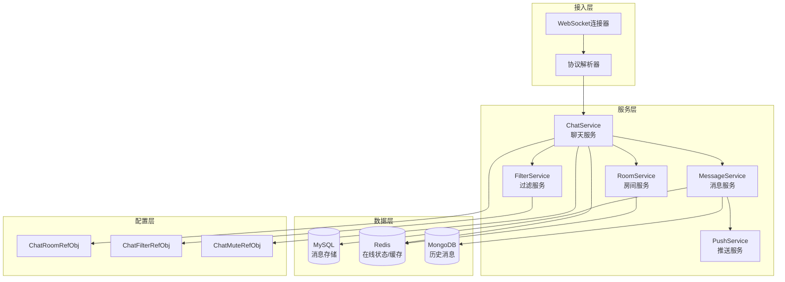
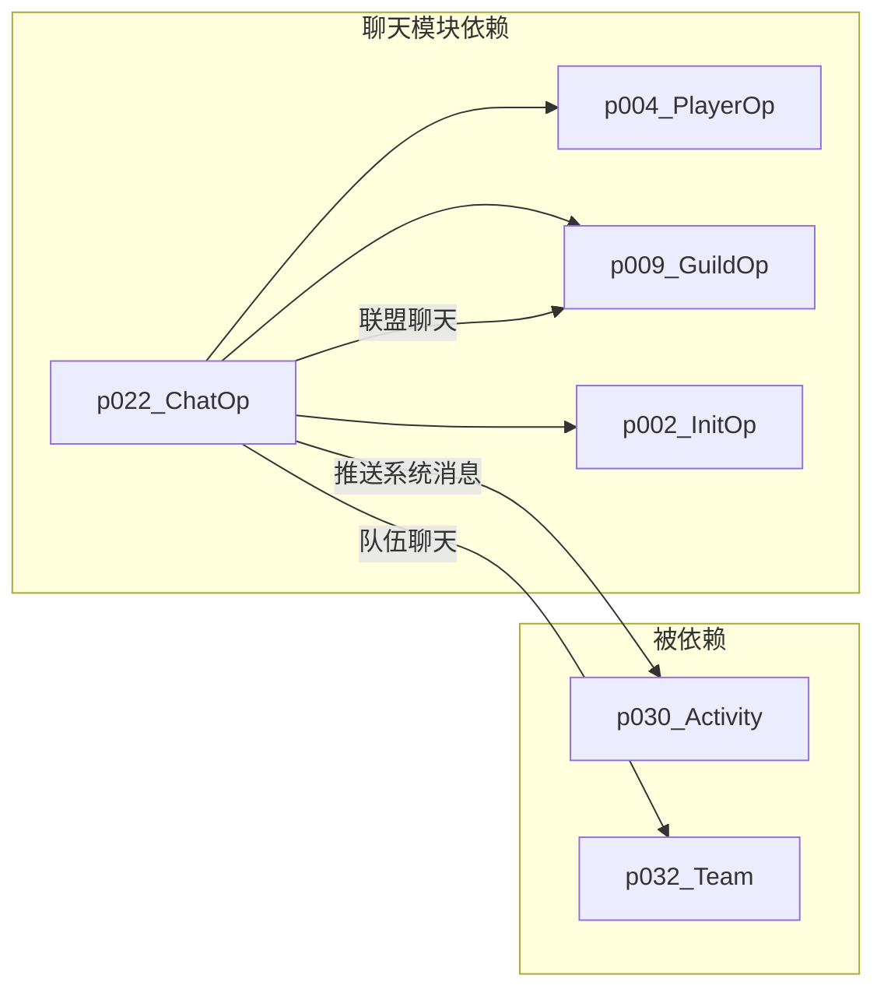
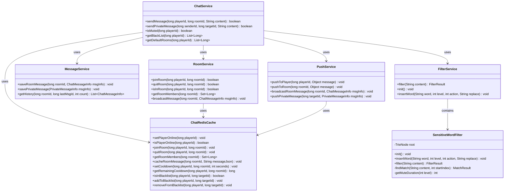
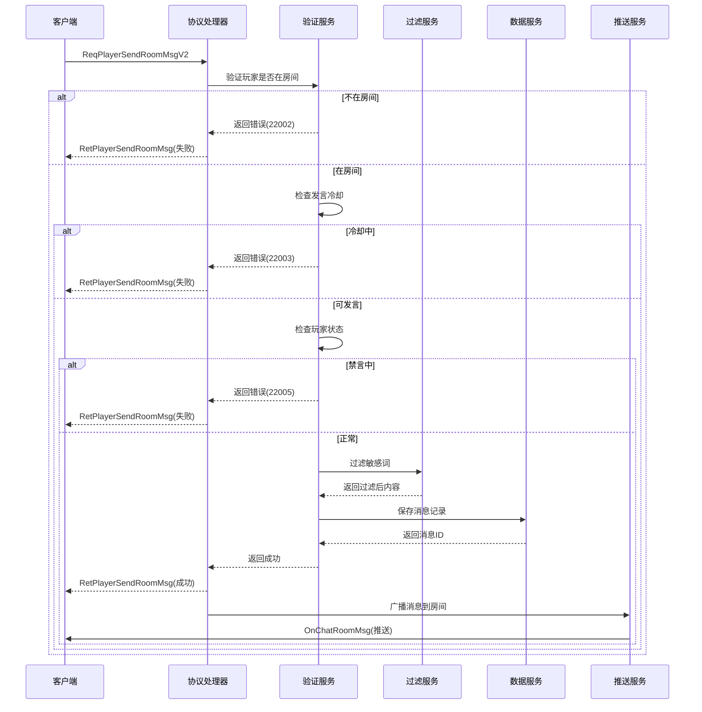
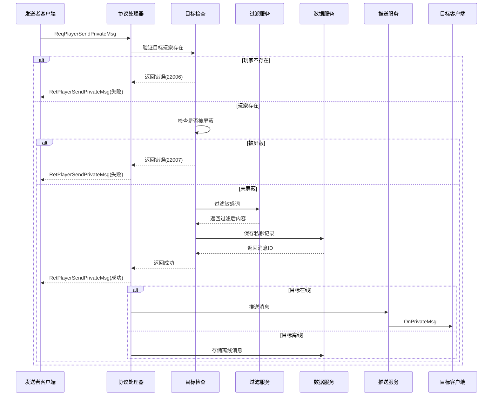
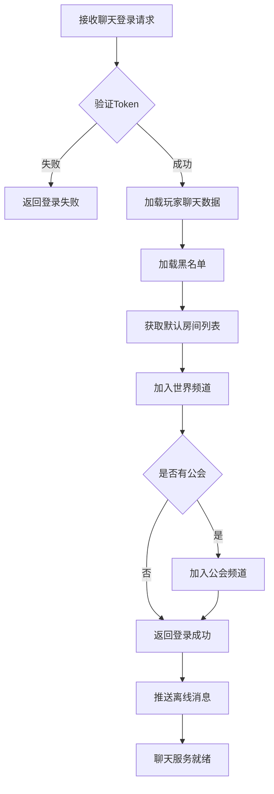

# ChatOp 模块 - 服务端开发文档

## 模块概述

**模块编号**: p022
**模块名称**: ChatOp (聊天操作)
**主要功能**: 服务端聊天服务架构、协议处理、数据存储、消息推送

---

## 一、模块架构

### 1.1 模块概述

聊天模块（Chat Module）负责管理游戏内聊天功能，包括：
- 聊天登录管理
- 聊天室管理
- 消息发送与接收
- 私聊系统
- 系统消息推送
- 聊天内容过滤

### 1.2 模块编号

协议模块编号: `p022`

### 1.3 服务端架构图



### 1.4 模块依赖关系



---

## 二、核心数据结构

### 2.0 服务端类结构图



### 2.1 聊天信息 (Common_FriendChatInfo)

**路径**: `ClientProtocol/Common/Common_FriendChatInfo.cs`

| 字段名 | 类型 | 说明 |
|--------|------|------|
| senderId | long | 发送者ID |
| senderName | string | 发送者名称 |
| senderIcon | long | 发送者头像 |
| senderVipLevel | int | 发送者VIP等级 |
| msgType | int | 消息类型 |
| content | string | 消息内容 |
| timestamp | long | 时间戳 |

### 2.2 AI聊天消息 (Common_AiChatMessage)

**路径**: `ClientProtocol/Common/Common_AiChatMessage.cs`

| 字段名 | 类型 | 说明 |
|--------|------|------|
| msgId | long | 消息ID |
| content | string | 消息内容 |
| isAi | bool | 是否AI消息 |

### 2.3 聊天室信息 (ChatRoomInfo)

| 字段名 | 类型 | 说明 |
|--------|------|------|
| roomId | long | 房间ID |
| roomName | string | 房间名称 |
| roomType | int | 房间类型 |
| maxMember | int | 最大成员数 |
| memberList | List\<Long\> | 成员列表 |
| msgCount | int | 消息计数 |
| createTime | long | 创建时间 |

---

## 三、协议处理

### 3.1 请求协议 (GC2GS)

| 协议名 | 主序号 | 子序号 | 说明 |
|--------|--------|--------|------|
| GC2GS_022_001_ReqPlayerChatLogin | 22 | 1 | 聊天登录 |
| GC2GS_022_002_ReqPlayerJoinChatRoom | 22 | 2 | 加入聊天室 |
| GC2GS_022_003_ReqPlayerQuitChatRoom | 22 | 3 | 退出聊天室 |
| GC2GS_022_004_ReqPlayerSendRoomMsg | 22 | 4 | 发送房间消息（旧版） |
| GC2GS_022_005_ReqPlayerSendPrivateMsg | 22 | 5 | 发送私聊消息 |
| GC2GS_022_006_ReqPlayerSendRoomMsgV2 | 22 | 6 | 发送房间消息（新版） |

---

## 四、核心逻辑流程

### 4.1 发送聊天消息流程



### 4.2 私聊消息流程



### 4.3 聊天登录流程



---

## 五、数据库设计

### 5.1 聊天记录表 (chat_message)

```sql
CREATE TABLE `chat_message` (
    `id` BIGINT NOT NULL AUTO_INCREMENT COMMENT '主键',
    `msg_id` BIGINT NOT NULL COMMENT '消息ID（雪花算法）',
    `room_id` BIGINT NOT NULL COMMENT '房间ID',
    `sender_id` BIGINT NOT NULL COMMENT '发送者ID',
    `sender_name` VARCHAR(64) NOT NULL COMMENT '发送者名称',
    `msg_type` TINYINT NOT NULL DEFAULT 1 COMMENT '消息类型',
    `content` TEXT NOT NULL COMMENT '消息内容',
    `bubble_id` BIGINT DEFAULT 0 COMMENT '气泡ID',
    `send_time` BIGINT NOT NULL COMMENT '发送时间戳',
    `create_time` DATETIME NOT NULL DEFAULT CURRENT_TIMESTAMP COMMENT '创建时间',
    PRIMARY KEY (`id`),
    UNIQUE KEY `uk_msg_id` (`msg_id`),
    KEY `idx_room_time` (`room_id`, `send_time`),
    KEY `idx_sender_time` (`sender_id`, `send_time`)
) ENGINE=InnoDB DEFAULT CHARSET=utf8mb4 COMMENT='聊天消息记录表';
```

### 5.2 私聊记录表 (chat_private_message)

```sql
CREATE TABLE `chat_private_message` (
    `id` BIGINT NOT NULL AUTO_INCREMENT COMMENT '主键',
    `msg_id` BIGINT NOT NULL COMMENT '消息ID',
    `sender_id` BIGINT NOT NULL COMMENT '发送者ID',
    `receiver_id` BIGINT NOT NULL COMMENT '接收者ID',
    `msg_type` TINYINT NOT NULL DEFAULT 1 COMMENT '消息类型',
    `content` TEXT NOT NULL COMMENT '消息内容',
    `is_read` TINYINT NOT NULL DEFAULT 0 COMMENT '是否已读',
    `send_time` BIGINT NOT NULL COMMENT '发送时间戳',
    `create_time` DATETIME NOT NULL DEFAULT CURRENT_TIMESTAMP COMMENT '创建时间',
    PRIMARY KEY (`id`),
    UNIQUE KEY `uk_msg_id` (`msg_id`),
    KEY `idx_sender_receiver` (`sender_id`, `receiver_id`),
    KEY `idx_receiver_time` (`receiver_id`, `send_time`),
    KEY `idx_sender_time` (`sender_id`, `send_time`)
) ENGINE=InnoDB DEFAULT CHARSET=utf8mb4 COMMENT='私聊消息记录表';
```

### 5.3 黑名单表 (chat_blacklist)

```sql
CREATE TABLE `chat_blacklist` (
    `id` BIGINT NOT NULL AUTO_INCREMENT COMMENT '主键',
    `player_id` BIGINT NOT NULL COMMENT '玩家ID',
    `block_player_id` BIGINT NOT NULL COMMENT '被屏蔽玩家ID',
    `create_time` DATETIME NOT NULL DEFAULT CURRENT_TIMESTAMP COMMENT '创建时间',
    PRIMARY KEY (`id`),
    UNIQUE KEY `uk_player_block` (`player_id`, `block_player_id`),
    KEY `idx_player` (`player_id`)
) ENGINE=InnoDB DEFAULT CHARSET=utf8mb4 COMMENT='聊天黑名单表';
```

### 5.4 禁言记录表 (chat_mute_record)

```sql
CREATE TABLE `chat_mute_record` (
    `id` BIGINT NOT NULL AUTO_INCREMENT COMMENT '主键',
    `player_id` BIGINT NOT NULL COMMENT '玩家ID',
    `operator_id` BIGINT NOT NULL COMMENT '操作者ID',
    `mute_type` TINYINT NOT NULL DEFAULT 1 COMMENT '禁言类型(1-临时 2-永久)',
    `duration` INT NOT NULL COMMENT '禁言时长(秒)',
    `start_time` BIGINT NOT NULL COMMENT '开始时间戳',
    `end_time` BIGINT NOT NULL COMMENT '结束时间戳',
    `reason` VARCHAR(256) DEFAULT '' COMMENT '禁言原因',
    `status` TINYINT NOT NULL DEFAULT 1 COMMENT '状态(1-生效中 2-已解除)',
    `create_time` DATETIME NOT NULL DEFAULT CURRENT_TIMESTAMP COMMENT '创建时间',
    PRIMARY KEY (`id`),
    KEY `idx_player` (`player_id`),
    KEY `idx_end_time` (`end_time`)
) ENGINE=InnoDB DEFAULT CHARSET=utf8mb4 COMMENT='禁言记录表';
```

---

## 六、Redis缓存设计

### 6.1 缓存结构设计

```
# 玩家在线状态
chat:online:{player_id} -> 1  (TTL: 5分钟，心跳续期)

# 玩家所在房间列表
chat:player_rooms:{player_id} -> SET(room_id1, room_id2, ...)

# 房间成员列表
chat:room_members:{room_id} -> SET(player_id1, player_id2, ...)

# 房间消息缓存（最近100条）
chat:room_msgs:{room_id} -> LIST(msg_json1, msg_json2, ...)

# 发言冷却时间
chat:cooldown:{player_id}:{room_id} -> end_timestamp (TTL: 冷却时间)

# 玩家黑名单
chat:blacklist:{player_id} -> SET(block_player_id1, block_player_id2, ...)

# 私聊未读数
chat:private_unread:{player_id}:{target_id} -> unread_count

# 离线消息队列
chat:offline_msg:{player_id} -> LIST(msg_json1, msg_json2, ...)
```

### 6.2 缓存操作代码

```java
/**
 * Redis缓存操作类
 */
public class ChatRedisCache {

    private JedisPool jedisPool;

    /**
     * 设置玩家在线状态
     */
    public void setPlayerOnline(long playerId) {
        try (Jedis jedis = jedisPool.getResource()) {
            String key = "chat:online:" + playerId;
            jedis.setex(key, 300, "1"); // 5分钟过期
        }
    }

    /**
     * 检查玩家是否在线
     */
    public boolean isPlayerOnline(long playerId) {
        try (Jedis jedis = jedisPool.getResource()) {
            String key = "chat:online:" + playerId;
            return jedis.exists(key);
        }
    }

    /**
     * 加入房间
     */
    public void joinRoom(long playerId, long roomId) {
        try (Jedis jedis = jedisPool.getResource()) {
            // 添加到玩家房间列表
            jedis.sadd("chat:player_rooms:" + playerId, String.valueOf(roomId));
            // 添加到房间成员列表
            jedis.sadd("chat:room_members:" + roomId, String.valueOf(playerId));
        }
    }

    /**
     * 退出房间
     */
    public void quitRoom(long playerId, long roomId) {
        try (Jedis jedis = jedisPool.getResource()) {
            // 从玩家房间列表移除
            jedis.srem("chat:player_rooms:" + playerId, String.valueOf(roomId));
            // 从房间成员列表移除
            jedis.srem("chat:room_members:" + roomId, String.valueOf(playerId));
        }
    }

    /**
     * 获取房间成员列表
     */
    public Set<Long> getRoomMembers(long roomId) {
        try (Jedis jedis = jedisPool.getResource()) {
            String key = "chat:room_members:" + roomId;
            Set<String> members = jedis.smembers(key);
            return members.stream()
                .map(Long::parseLong)
                .collect(Collectors.toSet());
        }
    }

    /**
     * 缓存房间消息
     */
    public void cacheRoomMessage(long roomId, String messageJson) {
        try (Jedis jedis = jedisPool.getResource()) {
            String key = "chat:room_msgs:" + roomId;
            jedis.lpush(key, messageJson);
            jedis.ltrim(key, 0, 99); // 只保留最近100条
        }
    }

    /**
     * 设置发言冷却
     */
    public void setCooldown(long playerId, long roomId, int seconds) {
        try (Jedis jedis = jedisPool.getResource()) {
            String key = "chat:cooldown:" + playerId + ":" + roomId;
            jedis.setex(key, seconds, String.valueOf(System.currentTimeMillis() + seconds * 1000));
        }
    }

    /**
     * 获取剩余冷却时间
     */
    public long getRemainingCooldown(long playerId, long roomId) {
        try (Jedis jedis = jedisPool.getResource()) {
            String key = "chat:cooldown:" + playerId + ":" + roomId;
            long ttl = jedis.ttl(key);
            return ttl > 0 ? ttl : 0;
        }
    }

    /**
     * 检查是否在黑名单中
     */
    public boolean isInBlacklist(long playerId, long targetId) {
        try (Jedis jedis = jedisPool.getResource()) {
            String key = "chat:blacklist:" + playerId;
            return jedis.sismember(key, String.valueOf(targetId));
        }
    }

    /**
     * 添加黑名单
     */
    public void addToBlacklist(long playerId, long targetId) {
        try (Jedis jedis = jedisPool.getResource()) {
            String key = "chat:blacklist:" + playerId;
            jedis.sadd(key, String.valueOf(targetId));
        }
    }

    /**
     * 移除黑名单
     */
    public void removeFromBlacklist(long playerId, long targetId) {
        try (Jedis jedis = jedisPool.getResource()) {
            String key = "chat:blacklist:" + playerId;
            jedis.srem(key, String.valueOf(targetId));
        }
    }
}
```

---

## 七、服务配置

### 7.1 协议注册

```java
/**
 * 聊天协议处理器注册
 */
public class ChatProtocolHandler implements ProtocolHandler {

    // 协议主序号
    public static final byte CHAT_MODULE_ORDER = 22;

    @Override
    public void register(ProtocolDispatcher dispatcher) {
        // 登录相关
        dispatcher.register(CHAT_MODULE_ORDER, 1, this::onPlayerChatLogin);

        // 房间操作
        dispatcher.register(CHAT_MODULE_ORDER, 2, this::onPlayerJoinChatRoom);
        dispatcher.register(CHAT_MODULE_ORDER, 3, this::onPlayerQuitChatRoom);

        // 消息发送
        dispatcher.register(CHAT_MODULE_ORDER, 4, this::onPlayerSendRoomMsg);
        dispatcher.register(CHAT_MODULE_ORDER, 5, this::onPlayerSendPrivateMsg);
        dispatcher.register(CHAT_MODULE_ORDER, 6, this::onPlayerSendRoomMsgV2);

        // 历史记录
        dispatcher.register(CHAT_MODULE_ORDER, 7, this::onPlayerChatHistory);

        // 黑名单
        dispatcher.register(CHAT_MODULE_ORDER, 8, this::onSetBlackList);
        dispatcher.register(CHAT_MODULE_ORDER, 9, this::onRemoveBlackList);

        // 私聊列表
        dispatcher.register(CHAT_MODULE_ORDER, 10, this::onPrivateChatList);
    }
}
```

### 7.2 服务依赖

```java
/**
 * 聊天模块服务依赖配置
 */
@Configuration
public class ChatModuleConfig {

    @Bean
    public ChatService chatService() {
        return new ChatService();
    }

    @Bean
    public RoomService roomService() {
        return new RoomService();
    }

    @Bean
    public MessageService messageService() {
        return new MessageService();
    }

    @Bean
    public FilterService filterService() {
        return new FilterService();
    }

    @Bean
    public PushService pushService() {
        return new PushService();
    }

    @Bean
    public ChatRedisCache chatRedisCache() {
        return new ChatRedisCache();
    }
}
```

### 7.3 线程池配置

```java
/**
 * 聊天模块线程池配置
 */
@Configuration
public class ChatThreadPoolConfig {

    /**
     * 消息处理线程池
     */
    @Bean("chatMessageExecutor")
    public ThreadPoolExecutor chatMessageExecutor() {
        return new ThreadPoolExecutor(
            4,                      // 核心线程数
            16,                     // 最大线程数
            60L,                    // 空闲线程存活时间
            TimeUnit.SECONDS,
            new LinkedBlockingQueue<>(10000),  // 任务队列
            new ThreadFactoryBuilder().setNameFormat("chat-msg-%d").build(),
            new ThreadPoolExecutor.CallerRunsPolicy()  // 拒绝策略
        );
    }

    /**
     * 推送线程池
     */
    @Bean("chatPushExecutor")
    public ThreadPoolExecutor chatPushExecutor() {
        return new ThreadPoolExecutor(
            8,
            32,
            60L,
            TimeUnit.SECONDS,
            new LinkedBlockingQueue<>(5000),
            new ThreadFactoryBuilder().setNameFormat("chat-push-%d").build(),
            new ThreadPoolExecutor.CallerRunsPolicy()
        );
    }

    /**
     * 敏感词过滤线程池
     */
    @Bean("chatFilterExecutor")
    public ThreadPoolExecutor chatFilterExecutor() {
        return new ThreadPoolExecutor(
            2,
            8,
            60L,
            TimeUnit.SECONDS,
            new LinkedBlockingQueue<>(2000),
            new ThreadFactoryBuilder().setNameFormat("chat-filter-%d").build(),
            new ThreadPoolExecutor.CallerRunsPolicy()
        );
    }
}
```

---

## 八、核心服务实现

### 8.1 聊天登录处理器

```java
/**
 * 处理聊天登录请求
 */
public void onPlayerChatLogin(NPPlayerContext _context, GC2GS_022_001_ReqPlayerChatLogin _proto)
{
    long playerId = _proto.getPlayerId();
    String token = _proto.getToken();

    // 1. 验证Token
    if (!TokenManager.validateToken(playerId, token)) {
        sendError(_context, ChatErrorCode.INVALID_TOKEN);
        return;
    }

    NPUSUserData userData = _context.getUserData();

    // 2. 设置在线状态
    chatRedisCache.setPlayerOnline(playerId);

    // 3. 加载黑名单
    List<Long> blackList = loadBlackList(playerId);
    chatRedisCache.setBlackList(playerId, blackList);

    // 4. 获取默认房间列表
    List<Long> defaultRooms = getDefaultRooms(playerId);

    // 5. 加入默认房间
    for (Long roomId : defaultRooms) {
        joinRoomInternal(playerId, roomId, userData);
    }

    // 6. 发送登录结果
    GS2GC_022_001_RetPlayerChatLogin res = new GS2GC_022_001_RetPlayerChatLogin();
    res.setResult(0);
    res.setServerTime(System.currentTimeMillis());
    res.setDefaultRooms(defaultRooms);
    res.setBlackList(blackList);
    userData.sendMsgToGC(res);

    // 7. 推送离线消息
    pushOfflineMessages(playerId, userData);

    // 8. 推送离线私聊
    pushOfflinePrivateMessages(playerId, userData);

    logger.info("玩家聊天登录成功: playerId={}", playerId);
}
```

### 8.2 发送房间消息处理器

```java
/**
 * 处理发送房间消息请求
 */
public void onPlayerSendRoomMsgV2(NPPlayerContext _context, GC2GS_022_006_ReqPlayerSendRoomMsgV2 _proto)
{
    NPUSUserData userData = _context.getUserData();
    long playerId = userData.getCid();
    long roomId = _proto.getRoomId();
    int msgType = _proto.getMsgType();
    String content = _proto.getContent();
    long bubbleId = _proto.getBubbleId();

    // 1. 检查玩家是否在房间内
    if (!chatRedisCache.isPlayerInRoom(playerId, roomId)) {
        sendError(_context, ChatErrorCode.NOT_IN_ROOM);
        return;
    }

    // 2. 检查发言冷却
    long remainingCd = chatRedisCache.getRemainingCooldown(playerId, roomId);
    if (remainingCd > 0) {
        sendError(_context, ChatErrorCode.COOLDOWN_ACTIVE, String.valueOf(remainingCd));
        return;
    }

    // 3. 检查玩家状态
    if (isPlayerMuted(playerId)) {
        sendError(_context, ChatErrorCode.PLAYER_MUTED);
        return;
    }

    // 4. 检查消息长度
    ChatChannelRefObj channelRef = ChatChannelRefObj.getMgr().get(roomId);
    if (channelRef == null) {
        sendError(_context, ChatErrorCode.ROOM_NOT_FOUND);
        return;
    }

    if (content.length() > channelRef.max_msg_length) {
        sendError(_context, ChatErrorCode.MESSAGE_TOO_LONG);
        return;
    }

    // 5. 过滤敏感词
    FilterResult filterResult = filterService.filter(content);
    if (filterResult.isBlocked()) {
        sendError(_context, ChatErrorCode.SENSITIVE_WORD);
        return;
    }

    if (filterResult.needMute()) {
        // 触发自动禁言
        mutePlayer(playerId, filterResult.getMuteDuration(), "发布违规内容");
        sendError(_context, ChatErrorCode.PLAYER_MUTED);
        return;
    }

    content = filterResult.getFilteredContent();

    // 6. 构建消息
    long msgId = idGenerator.nextId();
    long sendTime = System.currentTimeMillis();

    ChatMessageInfo msgInfo = new ChatMessageInfo();
    msgInfo.setMsgId(msgId);
    msgInfo.setSenderId(playerId);
    msgInfo.setSenderName(userData.getPlayerComponent().getPlayerName());
    msgInfo.setSenderIcon(userData.getPlayerComponent().getIconId());
    msgInfo.setSenderVipLevel(userData.getPlayerComponent().getVipLevel());
    msgInfo.setMsgType(msgType);
    msgInfo.setContent(content);
    msgInfo.setBubbleId(bubbleId);
    msgInfo.setSendTime(sendTime);

    // 7. 保存消息
    messageService.saveRoomMessage(roomId, msgInfo);

    // 8. 缓存消息到Redis
    chatRedisCache.cacheRoomMessage(roomId, JsonUtil.toJson(msgInfo));

    // 9. 更新冷却时间
    chatRedisCache.setCooldown(playerId, roomId, channelRef.cd_time);

    // 10. 发送响应
    GS2GC_022_004_RetPlayerSendRoomMsg res = new GS2GC_022_004_RetPlayerSendRoomMsg();
    res.setResult(0);
    res.setMsgId(msgId);
    res.setSendTime(sendTime);
    userData.sendMsgToGC(res);

    // 11. 广播消息
    broadcastRoomMessage(roomId, msgInfo);

    logger.debug("房间消息发送成功: roomId={}, playerId={}, msgId={}", roomId, playerId, msgId);
}
```

### 8.3 发送私聊消息处理器

```java
/**
 * 处理发送私聊消息请求
 */
public void onPlayerSendPrivateMsg(NPPlayerContext _context, GC2GS_022_005_ReqPlayerSendPrivateMsg _proto)
{
    NPUSUserData userData = _context.getUserData();
    long senderId = userData.getCid();
    long targetId = _proto.getTargetId();
    int msgType = _proto.getMsgType();

    // 解析消息内容
    Common_FriendChatInfo gameUser = deserialize(_proto.getGameUser());
    String content = deserializeContent(_proto.getGameContent());

    // 1. 检查目标玩家存在
    if (!playerService.exists(targetId)) {
        sendError(_context, ChatErrorCode.TARGET_NOT_FOUND);
        return;
    }

    // 2. 检查是否被屏蔽
    if (chatRedisCache.isInBlacklist(targetId, senderId)) {
        sendError(_context, ChatErrorCode.BLOCKED_BY_TARGET);
        return;
    }

    // 3. 检查发送者状态
    if (isPlayerMuted(senderId)) {
        sendError(_context, ChatErrorCode.PLAYER_MUTED);
        return;
    }

    // 4. 过滤敏感词
    FilterResult filterResult = filterService.filter(content);
    if (filterResult.isBlocked()) {
        sendError(_context, ChatErrorCode.SENSITIVE_WORD);
        return;
    }

    content = filterResult.getFilteredContent();

    // 5. 构建消息
    long msgId = idGenerator.nextId();
    long sendTime = System.currentTimeMillis();

    PrivateMessageInfo msgInfo = new PrivateMessageInfo();
    msgInfo.setMsgId(msgId);
    msgInfo.setSenderId(senderId);
    msgInfo.setSenderName(gameUser.getSenderName());
    msgInfo.setSenderIcon(gameUser.getSenderIcon());
    msgInfo.setReceiverId(targetId);
    msgInfo.setMsgType(msgType);
    msgInfo.setContent(content);
    msgInfo.setSendTime(sendTime);

    // 6. 保存消息
    messageService.savePrivateMessage(msgInfo);

    // 7. 发送响应
    GS2GC_022_005_RetPlayerSendPrivateMsg res = new GS2GC_022_005_RetPlayerSendPrivateMsg();
    res.setResult(0);
    res.setMsgId(msgId);
    res.setTargetId(targetId);
    res.setSendTime(sendTime);
    userData.sendMsgToGC(res);

    // 8. 推送消息
    if (chatRedisCache.isPlayerOnline(targetId)) {
        // 目标在线，直接推送
        pushPrivateMessage(targetId, msgInfo);
    } else {
        // 目标离线，存储离线消息
        storeOfflineMessage(targetId, msgInfo);
    }

    logger.debug("私聊消息发送成功: senderId={}, targetId={}, msgId={}", senderId, targetId, msgId);
}
```

---

## 九、敏感词过滤服务

### 9.1 Trie树实现

```java
/**
 * 敏感词Trie树节点
 */
public class TrieNode {
    Map<Character, TrieNode> children = new HashMap<>();
    boolean isEnd = false;
    int level = 0;      // 敏感等级
    int action = 0;     // 处理动作
    String replace = ""; // 替换词
}

/**
 * 敏感词过滤服务
 */
public class SensitiveWordFilter {

    private TrieNode root;
    private static final String REPLACE_CHAR = "*";

    /**
     * 初始化敏感词库
     */
    public void init() {
        root = new TrieNode();

        // 从配表加载敏感词
        List<ChatFilterRefObj> filterList = ChatFilterRefObj.getMgr().getAll();

        for (ChatFilterRefObj filter : filterList) {
            if (filter.is_regex == 1) {
                // 正则表达式单独处理
                continue;
            }

            insertWord(filter.word, filter.level, filter.action, filter.replace);
        }

        logger.info("敏感词库加载完成，共{}个敏感词", filterList.size());
    }

    /**
     * 插入敏感词
     */
    private void insertWord(String word, int level, int action, String replace) {
        TrieNode node = root;

        for (char c : word.toCharArray()) {
            node.children.putIfAbsent(c, new TrieNode());
            node = node.children.get(c);
        }

        node.isEnd = true;
        node.level = level;
        node.action = action;
        node.replace = replace;
    }

    /**
     * 过滤消息内容
     */
    public FilterResult filter(String content) {
        FilterResult result = new FilterResult();
        StringBuilder filtered = new StringBuilder();
        int index = 0;

        while (index < content.length()) {
            MatchResult match = findMatch(content, index);

            if (match != null && match.length > 0) {
                result.hasSensitiveWord = true;
                result.sensitiveLevel = Math.max(result.sensitiveLevel, match.level);

                switch (match.action) {
                    case 1: // 替换为指定字符
                    case 2: // 替换为星号
                        String replacement = match.replace != null && !match.replace.isEmpty()
                            ? match.replace : REPLACE_CHAR;
                        for (int i = 0; i < match.length; i++) {
                            if (i < replacement.length()) {
                                filtered.append(replacement.charAt(i));
                            } else {
                                filtered.append('*');
                            }
                        }
                        break;
                    case 3: // 拦截消息
                        result.blocked = true;
                        break;
                    case 4: // 禁言处理
                        result.needMute = true;
                        result.muteDuration = getMuteDuration(match.level);
                        break;
                }

                index += match.length;
            } else {
                filtered.append(content.charAt(index));
                index++;
            }
        }

        result.filteredContent = filtered.toString();
        return result;
    }

    /**
     * 查找匹配的敏感词
     */
    private MatchResult findMatch(String content, int startIndex) {
        TrieNode node = root;
        MatchResult result = null;

        for (int i = startIndex; i < content.length(); i++) {
            char c = content.charAt(i);

            if (!node.children.containsKey(c)) {
                break;
            }

            node = node.children.get(c);

            if (node.isEnd) {
                result = new MatchResult();
                result.length = i - startIndex + 1;
                result.level = node.level;
                result.action = node.action;
                result.replace = node.replace;
            }
        }

        return result;
    }

    /**
     * 获取禁言时长
     */
    private int getMuteDuration(int level) {
        ChatMuteRefObj muteRef = ChatMuteRefObj.getMgr().getByLevel(level);
        return muteRef != null ? muteRef.duration : 3600; // 默认1小时
    }
}

/**
 * 过滤结果
 */
public class FilterResult {
    public boolean hasSensitiveWord = false;
    public int sensitiveLevel = 0;
    public boolean blocked = false;
    public boolean needMute = false;
    public int muteDuration = 0;
    public String filteredContent = "";
}
```

---

## 十、消息推送服务

### 10.1 房间消息广播

```java
/**
 * 广播房间消息
 */
public void broadcastRoomMessage(long roomId, ChatMessageInfo msgInfo) {
    // 获取房间成员
    Set<Long> members = chatRedisCache.getRoomMembers(roomId);

    if (members.isEmpty()) {
        return;
    }

    // 构建推送消息
    GS2GC_022_050_OnChatRoomMsg push = new GS2GC_022_050_OnChatRoomMsg();
    push.setRoomId(roomId);
    push.setMsgInfo(msgInfo);

    // 批量推送
    List<Long> onlineMembers = new ArrayList<>();
    for (Long memberId : members) {
        // 排除发送者
        if (memberId == msgInfo.getSenderId()) {
            continue;
        }

        // 检查是否在黑名单中
        if (chatRedisCache.isInBlacklist(memberId, msgInfo.getSenderId())) {
            continue;
        }

        // 检查在线状态
        if (chatRedisCache.isPlayerOnline(memberId)) {
            onlineMembers.add(memberId);
        }
    }

    // 异步推送
    CompletableFuture.runAsync(() -> {
        for (Long memberId : onlineMembers) {
            NPUSUserData userData = playerManager.getUserData(memberId);
            if (userData != null) {
                userData.sendMsgToGC(push);
            }
        }
    }, chatPushExecutor);
}
```

### 10.2 离线消息推送

```java
/**
 * 推送离线消息
 */
public void pushOfflineMessages(long playerId, NPUSUserData userData) {
    // 获取玩家所在房间
    Set<Long> rooms = chatRedisCache.getPlayerRooms(playerId);

    for (Long roomId : rooms) {
        // 获取房间最近消息
        List<String> messages = chatRedisCache.getRecentMessages(roomId, 50);

        for (String msgJson : messages) {
            ChatMessageInfo msgInfo = JsonUtil.fromJson(msgJson, ChatMessageInfo.class);

            // 检查是否在黑名单中
            if (chatRedisCache.isInBlacklist(playerId, msgInfo.getSenderId())) {
                continue;
            }

            // 构建推送
            GS2GC_022_050_OnChatRoomMsg push = new GS2GC_022_050_OnChatRoomMsg();
            push.setRoomId(roomId);
            push.setMsgInfo(msgInfo);

            userData.sendMsgToGC(push);
        }
    }
}

/**
 * 存储离线私聊消息
 */
public void storeOfflineMessage(long playerId, PrivateMessageInfo msgInfo) {
    // 存储到Redis离线队列
    chatRedisCache.pushOfflineMessage(playerId, JsonUtil.toJson(msgInfo));

    // 同时存储到数据库
    messageService.saveOfflinePrivateMessage(playerId, msgInfo);
}

/**
 * 推送离线私聊消息
 */
public void pushOfflinePrivateMessages(long playerId, NPUSUserData userData) {
    List<String> messages = chatRedisCache.getOfflineMessages(playerId, 100);

    for (String msgJson : messages) {
        PrivateMessageInfo msgInfo = JsonUtil.fromJson(msgJson, PrivateMessageInfo.class);

        GS2GC_022_051_OnPrivateMsg push = new GS2GC_022_051_OnPrivateMsg();
        push.setMsgInfo(msgInfo);

        userData.sendMsgToGC(push);
    }

    // 清除离线消息缓存
    chatRedisCache.clearOfflineMessages(playerId);
}
```

---

## 十一、错误码定义

```java
/**
 * 聊天模块错误码
 */
public class ChatErrorCode {
    public static final int NOT_LOGGED_IN = 22001;      // 未登录聊天服务器
    public static final int NOT_IN_ROOM = 22002;        // 未加入该聊天室
    public static final int COOLDOWN_ACTIVE = 22003;    // 发言冷却中
    public static final int MESSAGE_TOO_LONG = 22004;   // 消息过长
    public static final int PLAYER_MUTED = 22005;       // 玩家被禁言
    public static final int TARGET_NOT_FOUND = 22006;   // 目标玩家不存在
    public static final int BLOCKED_BY_TARGET = 22007;  // 被目标玩家屏蔽
    public static final int SENSITIVE_WORD = 22008;     // 包含敏感词
    public static final int ROOM_NOT_FOUND = 22009;     // 频道不存在
    public static final int BLACKLIST_FULL = 22010;     // 黑名单已满
    public static final int INVALID_TOKEN = 22011;      // 无效的Token
    public static final int PERMISSION_DENIED = 22012;  // 无权限
    public static final int ROOM_FULL = 22013;          // 房间已满
    public static final int ALREADY_IN_ROOM = 22014;    // 已在房间内
    public static final int INVALID_MESSAGE_TYPE = 22015; // 无效的消息类型
}
```

---

## 十二、性能监控

### 12.1 监控指标

```java
/**
 * 聊天模块监控指标
 */
public class ChatMetrics {

    // 消息处理计数器
    private Counter messageProcessedCounter;

    // 消息处理延迟
    private Timer messageProcessTimer;

    // 在线人数
    private Gauge onlinePlayersGauge;

    // 房间数量
    private Gauge activeRoomsGauge;

    // 消息队列大小
    private Gauge messageQueueSizeGauge;

    @PostConstruct
    public void init() {
        // 注册指标
        messageProcessedCounter = Counter.builder("chat.message.processed")
            .description("处理的消息数量")
            .register(Metrics.globalRegistry);

        messageProcessTimer = Timer.builder("chat.message.process.time")
            .description("消息处理时间")
            .register(Metrics.globalRegistry);

        onlinePlayersGauge = Gauge.builder("chat.online.players", this::getOnlinePlayerCount)
            .description("在线玩家数")
            .register(Metrics.globalRegistry);

        activeRoomsGauge = Gauge.builder("chat.active.rooms", this::getActiveRoomCount)
            .description("活跃房间数")
            .register(Metrics.globalRegistry);
    }

    /**
     * 记录消息处理
     */
    public void recordMessageProcessed(long durationMs) {
        messageProcessedCounter.increment();
        messageProcessTimer.record(durationMs, TimeUnit.MILLISECONDS);
    }

    private int getOnlinePlayerCount() {
        return chatRedisCache.getOnlinePlayerCount();
    }

    private int getActiveRoomCount() {
        return chatRedisCache.getActiveRoomCount();
    }
}
```

### 12.2 日志记录

```java
/**
 * 聊天模块日志记录
 */
public class ChatLogger {

    private static final Logger logger = LoggerFactory.getLogger("CHAT");

    /**
     * 记录消息发送
     */
    public static void logMessageSend(long playerId, long roomId, long msgId, String content) {
        logger.info("MSG_SEND|playerId={}|roomId={}|msgId={}|content={}",
            playerId, roomId, msgId, truncate(content, 50));
    }

    /**
     * 记录私聊消息
     */
    public static void logPrivateMessage(long senderId, long receiverId, long msgId, String content) {
        logger.info("PRIVATE_MSG|senderId={}|receiverId={}|msgId={}|content={}",
            senderId, receiverId, msgId, truncate(content, 50));
    }

    /**
     * 记录敏感词触发
     */
    public static void logSensitiveWord(long playerId, String content, int level) {
        logger.warn("SENSITIVE_WORD|playerId={}|level={}|content={}",
            playerId, level, truncate(content, 100));
    }

    /**
     * 记录禁言操作
     */
    public static void logMute(long playerId, long operatorId, int duration, String reason) {
        logger.warn("MUTE_PLAYER|playerId={}|operatorId={}|duration={}|reason={}",
            playerId, operatorId, duration, reason);
    }

    private static String truncate(String str, int maxLen) {
        if (str == null) return "";
        return str.length() > maxLen ? str.substring(0, maxLen) + "..." : str;
    }
}
```

---

*文档生成时间: 2026-04-11*
*源码参考路径: `/game_server/src/main/java/com/game/module/chat/`*
