# ChatOp 模块 - 完整说明文档

## 模块概述

**模块编号**: p022
**模块名称**: ChatOp (聊天操作)
**主要功能**: 聊天模块业务背景、功能清单、业务流程、用户故事

## 一、模块概述

### 1.1 业务背景

聊天模块是 K2C 游戏的核心社交功能模块，负责管理游戏内所有玩家间的即时通讯功能。包括全区频道、单服频道、公会频道、私聊系统等多种聊天场景，是玩家互动交流的主要渠道。

### 1.2 目标用户

- **所有游戏玩家**：通过聊天进行社交互动、组队邀请、交易协商等
- **运营人员**：通过系统消息发布公告、活动通知
- **公会管理**：通过公会频道进行内部管理

### 1.3 核心价值

1. **社交连接**：为玩家提供实时沟通渠道，增强游戏社交体验
2. **信息传播**：支持频道广播，快速传达游戏信息
3. **私聊互动**：支持一对一私密对话，保护玩家隐私
4. **内容安全**：内置敏感词过滤，维护健康的游戏环境

### 1.4 模块架构概览

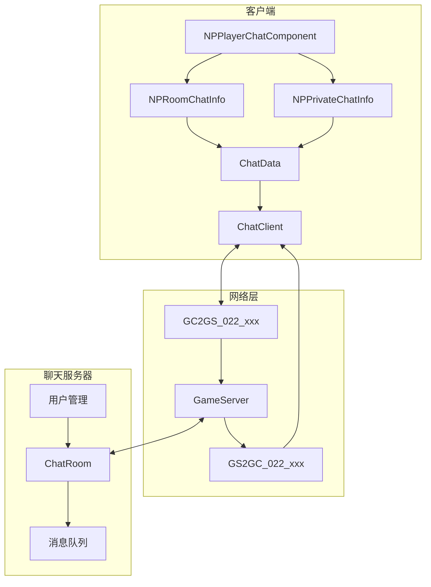

---

## 二、功能清单

### 2.1 频道管理功能

| 功能名称 | 功能描述 | 用户价值 |
|---------|---------|---------|
| 聊天登录 | 登录聊天服务器 | 建立聊天连接 |
| 加入频道 | 加入指定聊天频道 | 参与频道交流 |
| 退出频道 | 退出指定聊天频道 | 减少无关消息干扰 |

### 2.2 消息发送功能

| 功能名称 | 功能描述 | 用户价值 |
|---------|---------|---------|
| 发送房间消息 | 在聊天室发送消息 | 与多人同时交流 |
| 发送私聊消息 | 向指定玩家发送私聊 | 一对一私密交流 |
| 发送表情 | 发送预设表情 | 丰富表达方式 |

### 2.3 消息接收功能

| 功能名称 | 功能描述 | 用户价值 |
|---------|---------|---------|
| 房间消息推送 | 接收聊天室消息 | 实时获取频道信息 |
| 私聊消息推送 | 接收私聊消息 | 及时响应私聊 |
| 系统消息推送 | 接收系统公告 | 获取官方通知 |

### 2.4 辅助功能

| 功能名称 | 功能描述 | 用户价值 |
|---------|---------|---------|
| 敏感词过滤 | 自动过滤敏感词汇 | 维护聊天环境 |
| 黑名单设置 | 屏蔽指定玩家消息 | 避免骚扰 |
| 聊天历史 | 查看历史聊天记录 | 回顾聊天内容 |

---

## 三、业务流程详解

### 3.1 聊天登录流程

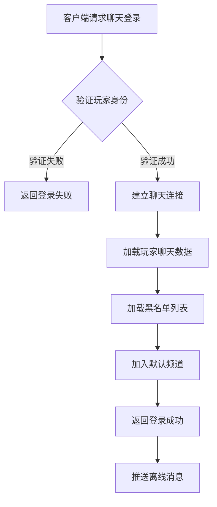

**详细步骤说明**：

1. **身份验证**
   - 验证玩家Token有效性
   - 验证玩家账号状态

2. **连接建立**
   - 建立WebSocket连接
   - 注册消息监听器

3. **数据加载**
   - 加载玩家黑名单
   - 加载最近聊天记录

4. **频道加入**
   - 自动加入世界频道
   - 加入公会频道（如有公会）

### 3.2 发送房间消息流程

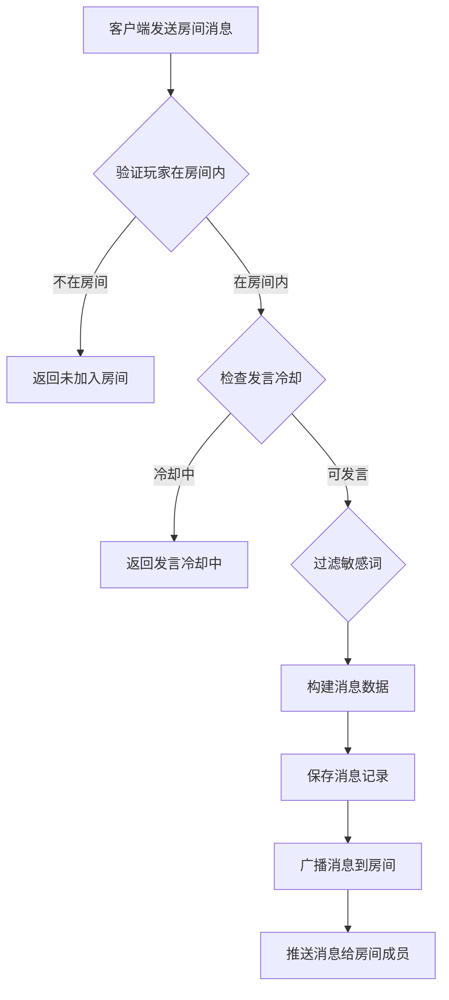

**详细步骤说明**：

1. **权限验证**
   - 检查玩家是否已加入该房间
   - 检查玩家是否被禁言

2. **频率控制**
   - 检查发言冷却时间
   - 防止刷屏行为

3. **内容处理**
   - 过滤敏感词
   - 处理特殊字符

4. **消息广播**
   - 构建消息对象
   - 推送给房间内所有成员

### 3.3 发送私聊消息流程

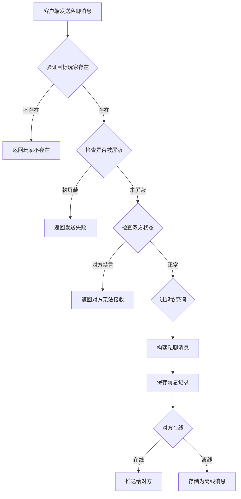

**详细步骤说明**：

1. **目标验证**
   - 验证目标玩家ID有效性
   - 验证目标玩家账号状态

2. **屏蔽检查**
   - 检查目标是否屏蔽发送者
   - 检查发送者是否在黑名单中

3. **消息处理**
   - 过滤敏感词
   - 构建消息对象

4. **消息投递**
   - 在线则直接推送
   - 离线则存储待推送

### 3.4 加入/退出频道流程

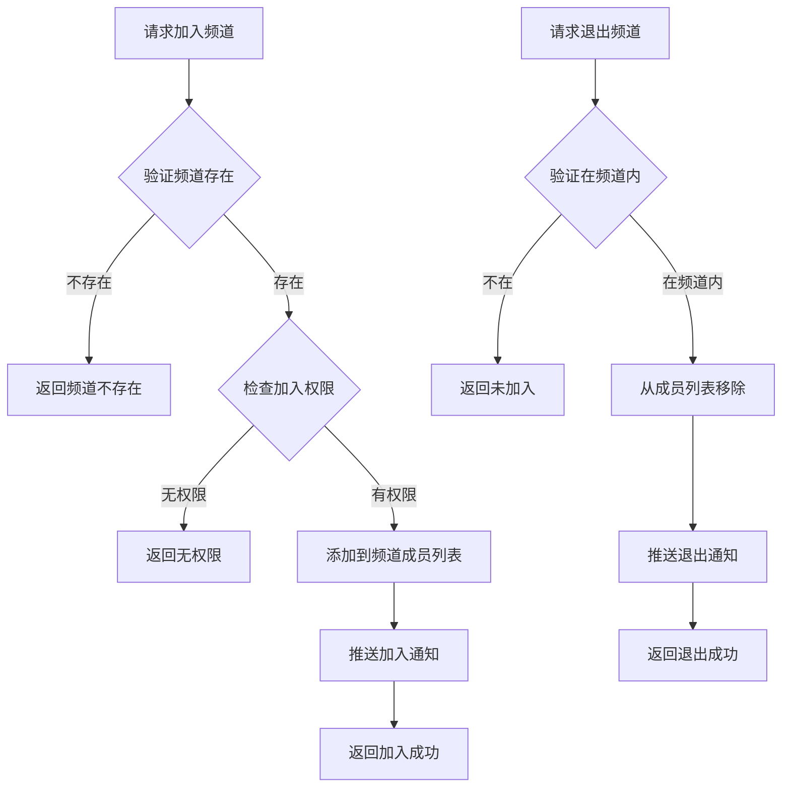

---

## 四、关键规则

### 4.1 频道类型规则

> 源码: `ClientProtocol/NPEnum/ENPChatRoomType.cs`

| 频道类型 | 类型ID | 说明 | 冷却时间 | 解锁条件 |
|---------|--------|------|----------|----------|
| 全区频道 | 1 | TOTAL_AREA - 跨服聊天 | 配表配置 | 配表条件 |
| 单服频道 | 2 | US_SERVER - 默认聊天室 | 配表配置 | 默认解锁 |
| 联盟频道 | 3 | GUILD - 联盟内部聊天 | 配表配置 | 加入联盟 |
| 活动组队 | 4 | ACTIVITY_TEAM - 临时队伍 | 配表配置 | 加入活动队伍 |

### 4.2 发言规则

1. **冷却时间**
   - 世界频道：5秒冷却
   - 公会频道：3秒冷却
   - 私聊频道：无冷却

2. **消息长度**
   - 最大字符数：200字符
   - 超出部分自动截断

3. **敏感词处理**
   - 敏感词替换为***
   - 严重违规可能触发禁言

### 4.3 黑名单规则

1. **屏蔽效果**：被屏蔽玩家发送的消息不会显示
2. **数量限制**：最多屏蔽100名玩家
3. **双向生效**：A屏蔽B后，B发给A的消息会被拦截

---

## 五、用户故事

### 5.1 新玩家社交故事

> 作为一名新玩家，我刚进入游戏，在世界频道看到大家热烈讨论。我尝试发送"大家好，我是新人"，系统提示发言冷却中，我等待几秒后成功发送。很快有玩家回复我"欢迎加入"，我感受到了游戏的热情氛围。

### 5.2 公会活动故事

> 作为一名公会成员，公会即将开始攻城战。会长在公会频道发布集结命令，所有在线成员都收到了消息。我快速响应并前往集合地点。战斗结束后，我们在公会频道分享战斗心得，增进了公会成员间的感情。

### 5.3 私聊交易故事

> 作为一名商人玩家，我在世界频道看到有人求购稀有道具，便私聊对方进行协商。我们讨论了价格和交易方式，最终达成了交易。私聊功能保护了我们的交易隐私。

---

## 六、示例

### 6.1 发送房间消息示例

**输入数据**：
- 房间ID：10001
- 消息类型：1（文本消息）
- 消息内容："大家好，今天副本有人组队吗？"

**发送结果**：
```
消息ID：100001
发送者ID：20001
发送者名称：剑舞春秋
房间ID：10001
消息内容：大家好，今天副本有人组队吗？
发送时间：2026-04-07 10:30:00
状态：发送成功
```

### 6.2 发送私聊消息示例

**输入数据**：
- 目标玩家ID：20002
- 消息类型：1（文本消息）
- 消息内容："你好，那个道具还在吗？"

**发送结果**：
```
消息ID：100002
发送者ID：20001
接收者ID：20002
消息内容：你好，那个道具还在吗？
发送时间：2026-04-07 10:35:00
状态：已送达
```

### 6.3 敏感词过滤示例

**原始消息**："这是一条包含敏感词的消息"

**过滤后消息**："这是一条包含***的消息"

---

## 十二、模块测试方案

### 12.1 测试用例矩阵

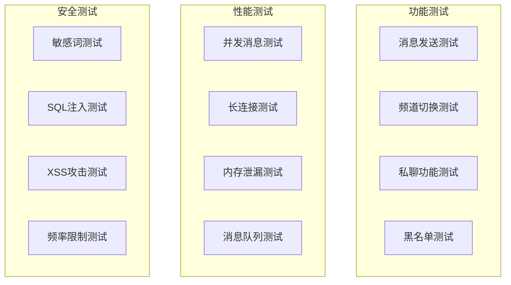

### 12.2 测试环境配置

```yaml
# 测试环境配置
test_env:
  server:
    host: "test.game.com"
    port: 9000
    max_players: 1000

  database:
    type: "mysql"
    host: "test-db.game.com"
    database: "chat_test"

  redis:
    host: "test-redis.game.com"
    port: 6379
    db: 1

  test_accounts:
    - id: 10001
      name: "测试账号1"
    - id: 10002
      name: "测试账号2"
```

---

## 十三、模块部署架构

### 13.1 生产环境部署图

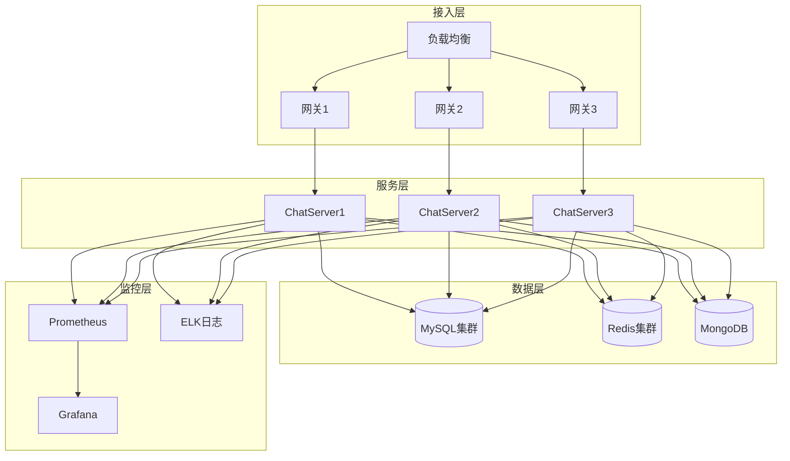

### 13.2 容量规划表

| 服务 | 单实例容量 | 预估峰值 | 实例数量 | 扩容阈值 |
|------|-----------|---------|---------|---------|
| ChatServer | 1万连接 | 5万连接 | 5 | CPU > 70% |
| Redis | 10万QPS | 50万QPS | 5集群 | 内存 > 80% |
| MySQL | 5000 TPS | 20000 TPS | 4主4从 | 连接数 > 80% |

---

*文档生成时间: 2026-04-11*

---

## 七、模块交互图

### 7.1 聊天模块与其他模块交互

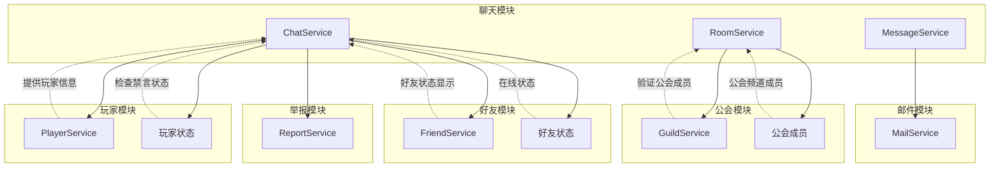

### 7.2 聊天数据流向图

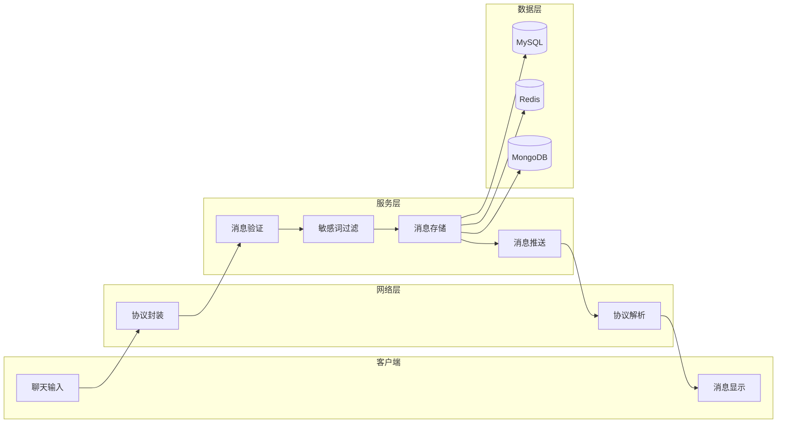

---

## 八、业务场景详解

### 8.1 新玩家首次聊天场景

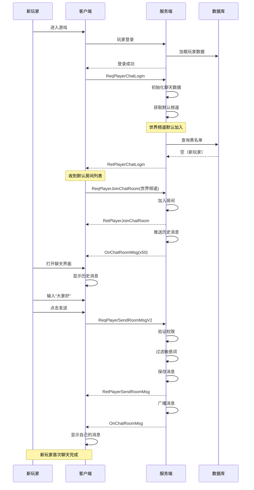

### 8.2 公会战协调场景

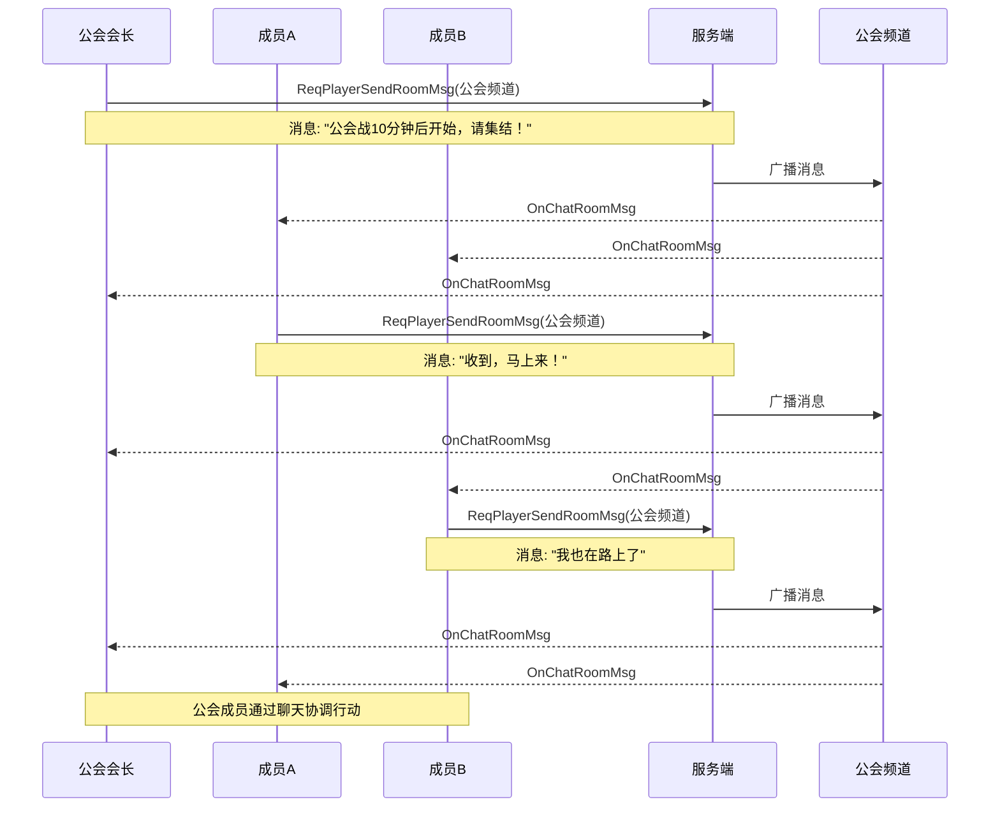

### 8.3 私聊交易场景

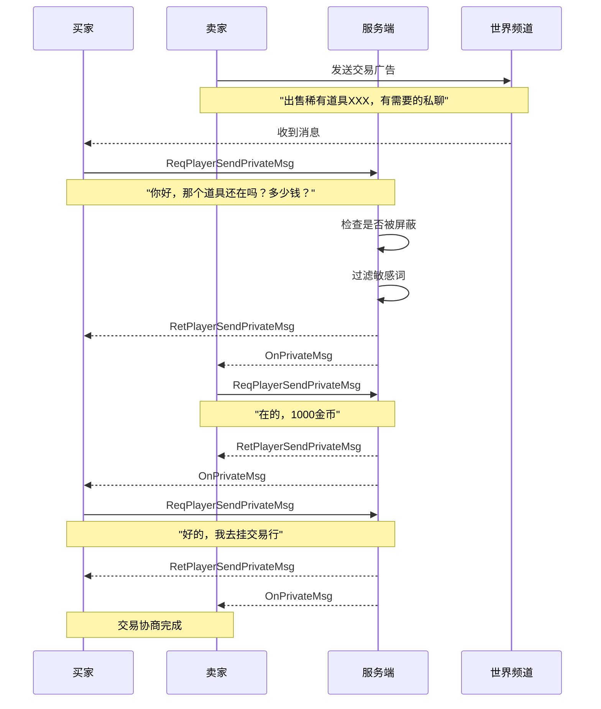

### 8.4 GM公告场景

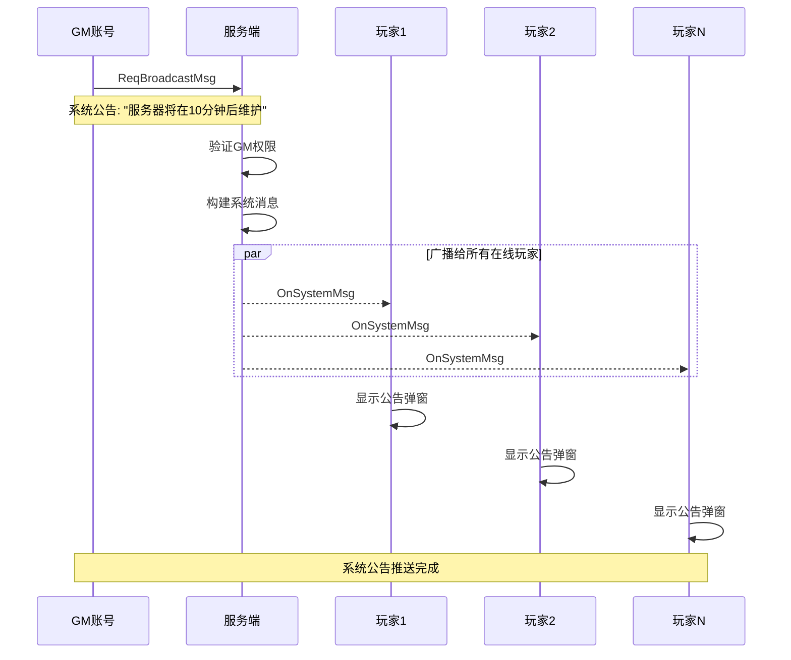

---

## 九、完整字段速查表

### 9.1 频道类型速查

| 频道类型 | 类型ID | 冷却时间 | 消息长度 | 默认加入 | 特殊权限 |
|----------|--------|----------|----------|----------|----------|
| 世界频道 | 1 | 5秒 | 200字符 | 是 | 无 |
| 公会频道 | 2 | 3秒 | 200字符 | 否 | 公会成员 |
| 私聊频道 | 3 | 无 | 200字符 | 否 | 无 |
| 系统频道 | 4 | 无 | 500字符 | 否 | GM |
| 广播频道 | 5 | 无 | 200字符 | 否 | 运营 |
| 组队频道 | 6 | 3秒 | 200字符 | 否 | 队伍成员 |
| 附近频道 | 7 | 3秒 | 200字符 | 否 | 同场景玩家 |

### 9.2 消息类型速查

| 消息类型 | 类型ID | 客户端显示 | 服务端处理 |
|----------|--------|------------|------------|
| 文本消息 | 1 | 直接显示 | 过滤敏感词 |
| 表情消息 | 2 | 显示表情 | 转换表情ID |
| 图片消息 | 3 | 显示图片 | 存储图片URL |
| 语音消息 | 4 | 播放语音 | 存储语音URL |
| 物品分享 | 5 | 显示物品卡片 | 验证物品归属 |
| 大臣分享 | 6 | 显示大臣卡片 | 验证大臣归属 |
| 链接消息 | 7 | 显示链接预览 | 验证链接安全性 |
| 系统消息 | 8 | 显示系统格式 | 特殊处理 |
| 红包消息 | 9 | 显示红包卡片 | 关联红包系统 |
| 位置分享 | 10 | 显示位置地图 | 验证位置有效性 |

### 9.3 错误码速查

| 错误码 | 错误信息 | 用户提示 | 处理建议 |
|--------|----------|----------|----------|
| 22001 | 未登录聊天服务器 | 聊天服务未连接，请重新登录 | 自动重连 |
| 22002 | 未加入该聊天室 | 您未加入该聊天室 | 引导加入 |
| 22003 | 发言冷却中 | 发言冷却中，请等待X秒 | 显示倒计时 |
| 22004 | 消息过长 | 消息过长，最多200字符 | 自动截断提示 |
| 22005 | 玩家被禁言 | 您已被禁言，无法发言 | 显示禁言时长 |
| 22006 | 目标玩家不存在 | 该玩家不存在 | 检查玩家ID |
| 22007 | 被目标玩家屏蔽 | 对方已屏蔽您的消息 | 无法处理 |
| 22008 | 包含敏感词 | 消息包含敏感内容 | 提示修改内容 |
| 22009 | 频道不存在 | 该频道不存在 | 刷新频道列表 |
| 22010 | 黑名单已满 | 黑名单已满，请先移除 | 引导清理 |

---

## 十、配置参数速查

### 10.1 频道默认配置

```json
{
  "channel_config": {
    "world": {
      "name": "世界频道",
      "type": 1,
      "cd_time": 5,
      "max_msg_length": 200,
      "max_msg_count": 100,
      "is_default": true,
      "min_level": 1
    },
    "guild": {
      "name": "公会频道",
      "type": 2,
      "cd_time": 3,
      "max_msg_length": 200,
      "max_msg_count": 200,
      "is_default": false
    },
    "private": {
      "name": "私聊频道",
      "type": 3,
      "cd_time": 0,
      "max_msg_length": 200,
      "max_msg_count": 500
    }
  }
}
```

### 10.2 禁言时长配置

```json
{
  "mute_config": {
    "level_1": {
      "name": "轻微违规",
      "duration": 3600,
      "reason": "发布不当言论"
    },
    "level_2": {
      "name": "中度违规",
      "duration": 86400,
      "reason": "多次发布不当言论"
    },
    "level_3": {
      "name": "严重违规",
      "duration": 604800,
      "reason": "发布违规内容"
    },
    "level_4": {
      "name": "永久禁言",
      "duration": -1,
      "reason": "严重违反用户协议"
    }
  }
}
```

---

## 十一、API接口汇总

### 11.1 客户端调用接口

| 接口名 | 参数 | 返回值 | 说明 |
|--------|------|--------|------|
| SendRoomMessage | roomId, msgType, content | void | 发送房间消息 |
| SendPrivateMessage | targetId, msgType, content | void | 发送私聊消息 |
| JoinRoom | roomId, roomType | void | 加入房间 |
| QuitRoom | roomId | void | 退出房间 |
| GetHistory | roomId, lastMsgId, count | void | 获取历史消息 |
| AddBlackList | targetId | void | 添加黑名单 |
| RemoveBlackList | targetId | void | 移除黑名单 |
| GetPrivateChatList | - | void | 获取私聊列表 |

### 11.2 服务端推送接口

| 接口名 | 触发条件 | 数据内容 |
|--------|----------|----------|
| OnChatRoomMsg | 房间有新消息 | 房间ID + 消息内容 |
| OnPrivateMsg | 收到私聊 | 私聊消息内容 |
| OnSystemMsg | 系统公告 | 系统消息内容 |
| OnMuteStateChg | 禁言状态变化 | 禁言状态信息 |
| OnBlackListAdd | 黑名单新增 | 被屏蔽玩家ID |
| OnBlackListRemove | 黑名单移除 | 取消屏蔽玩家ID |
| OnRoomMemberChg | 房间成员变化 | 成员变化信息 |
