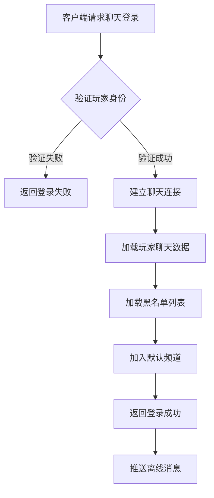
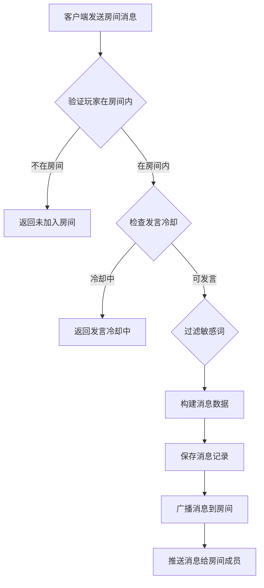
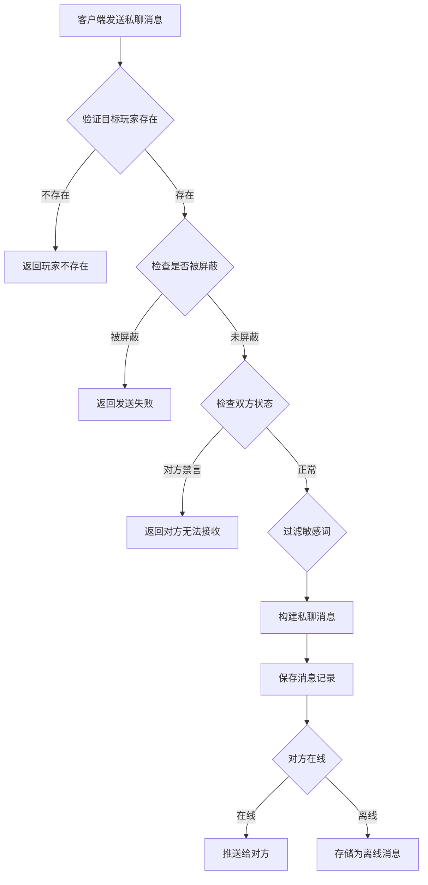
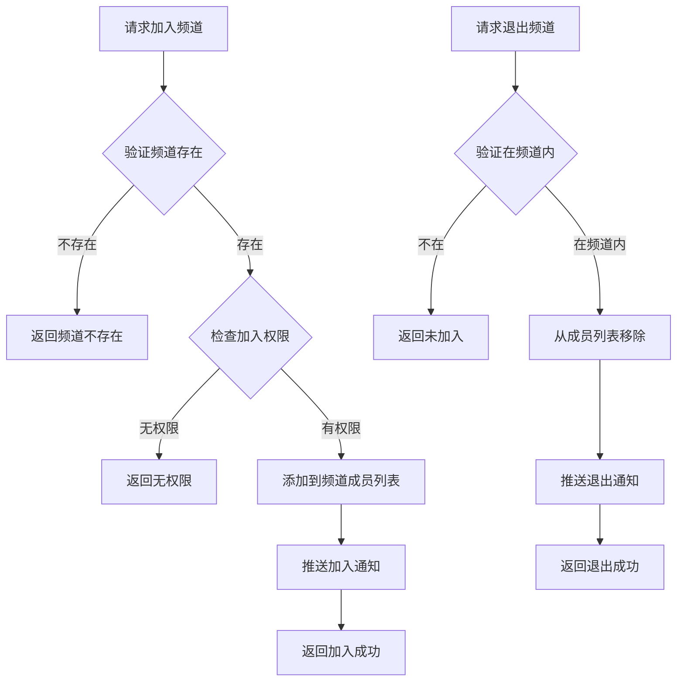

# 聊天模块完整说明

## 一、模块概述

### 1.1 业务背景

聊天模块是 K2C 游戏的核心社交功能模块，负责管理游戏内所有玩家间的即时通讯功能。包括世界频道、公会频道、私聊系统等多种聊天场景，是玩家互动交流的主要渠道。

### 1.2 目标用户

- **所有游戏玩家**：通过聊天进行社交互动、组队邀请、交易协商等
- **运营人员**：通过系统消息发布公告、活动通知
- **公会管理**：通过公会频道进行内部管理

### 1.3 核心价值

1. **社交连接**：为玩家提供实时沟通渠道，增强游戏社交体验
2. **信息传播**：支持世界频道广播，快速传达游戏信息
3. **私聊互动**：支持一对一私密对话，保护玩家隐私
4. **内容安全**：内置敏感词过滤，维护健康的游戏环境

---

## 二、功能清单

### 2.1 频道管理功能

| 功能名称 | 功能描述 | 用户价值 |
|---------|---------|---------|
| 聊天登录 | 登录聊天服务器 | 建立聊天连接 |
| 加入频道 | 加入指定聊天频道 | 参与频道交流 |
| 退出频道 | 退出指定聊天频道 | 减少无关消息干扰 |

### 2.2 消息发送功能

| 功能名称 | 功能描述 | 用户价值 |
|---------|---------|---------|
| 发送房间消息 | 在聊天室发送消息 | 与多人同时交流 |
| 发送私聊消息 | 向指定玩家发送私聊 | 一对一私密交流 |
| 发送表情 | 发送预设表情 | 丰富表达方式 |

### 2.3 消息接收功能

| 功能名称 | 功能描述 | 用户价值 |
|---------|---------|---------|
| 房间消息推送 | 接收聊天室消息 | 实时获取频道信息 |
| 私聊消息推送 | 接收私聊消息 | 及时响应私聊 |
| 系统消息推送 | 接收系统公告 | 获取官方通知 |

### 2.4 辅助功能

| 功能名称 | 功能描述 | 用户价值 |
|---------|---------|---------|
| 敏感词过滤 | 自动过滤敏感词汇 | 维护聊天环境 |
| 黑名单设置 | 屏蔽指定玩家消息 | 避免骚扰 |
| 聊天历史 | 查看历史聊天记录 | 回顾聊天内容 |

---

## 三、业务流程详解

### 3.1 聊天登录流程



**详细步骤说明**：

1. **身份验证**
   - 验证玩家Token有效性
   - 验证玩家账号状态

2. **连接建立**
   - 建立WebSocket连接
   - 注册消息监听器

3. **数据加载**
   - 加载玩家黑名单
   - 加载最近聊天记录

4. **频道加入**
   - 自动加入世界频道
   - 加入公会频道（如有公会）

### 3.2 发送房间消息流程



**详细步骤说明**：

1. **权限验证**
   - 检查玩家是否已加入该房间
   - 检查玩家是否被禁言

2. **频率控制**
   - 检查发言冷却时间
   - 防止刷屏行为

3. **内容处理**
   - 过滤敏感词
   - 处理特殊字符

4. **消息广播**
   - 构建消息对象
   - 推送给房间内所有成员

### 3.3 发送私聊消息流程



**详细步骤说明**：

1. **目标验证**
   - 验证目标玩家ID有效性
   - 验证目标玩家账号状态

2. **屏蔽检查**
   - 检查目标是否屏蔽发送者
   - 检查发送者是否在黑名单中

3. **消息处理**
   - 过滤敏感词
   - 构建消息对象

4. **消息投递**
   - 在线则直接推送
   - 离线则存储待推送

### 3.4 加入/退出频道流程



---

## 四、关键规则

### 4.1 频道类型规则

| 频道类型 | 类型ID | 说明 |
|---------|--------|------|
| 世界频道 | 1 | 全服广播，所有玩家可见 |
| 公会频道 | 2 | 公会内部聊天，仅公会成员可见 |
| 私聊频道 | 3 | 一对一私聊 |
| 系统频道 | 4 | 系统公告，仅GM可用 |
| 广播频道 | 5 | 特殊活动广播 |

### 4.2 发言规则

1. **冷却时间**
   - 世界频道：5秒冷却
   - 公会频道：3秒冷却
   - 私聊频道：无冷却

2. **消息长度**
   - 最大字符数：200字符
   - 超出部分自动截断

3. **敏感词处理**
   - 敏感词替换为***
   - 严重违规可能触发禁言

### 4.3 黑名单规则

1. **屏蔽效果**：被屏蔽玩家发送的消息不会显示
2. **数量限制**：最多屏蔽100名玩家
3. **双向生效**：A屏蔽B后，B发给A的消息会被拦截

---

## 五、用户故事

### 5.1 新玩家社交故事

> 作为一名新玩家，我刚进入游戏，在世界频道看到大家热烈讨论。我尝试发送"大家好，我是新人"，系统提示发言冷却中，我等待几秒后成功发送。很快有玩家回复我"欢迎加入"，我感受到了游戏的热情氛围。

### 5.2 公会活动故事

> 作为一名公会成员，公会即将开始攻城战。会长在公会频道发布集结命令，所有在线成员都收到了消息。我快速响应并前往集合地点。战斗结束后，我们在公会频道分享战斗心得，增进了公会成员间的感情。

### 5.3 私聊交易故事

> 作为一名商人玩家，我在世界频道看到有人求购稀有道具，便私聊对方进行协商。我们讨论了价格和交易方式，最终达成了交易。私聊功能保护了我们的交易隐私。

---

## 六、示例

### 6.1 发送房间消息示例

**输入数据**：
- 房间ID：10001
- 消息类型：1（文本消息）
- 消息内容："大家好，今天副本有人组队吗？"

**发送结果**：
```
消息ID：100001
发送者ID：20001
发送者名称：剑舞春秋
房间ID：10001
消息内容：大家好，今天副本有人组队吗？
发送时间：2026-04-07 10:30:00
状态：发送成功
```

### 6.2 发送私聊消息示例

**输入数据**：
- 目标玩家ID：20002
- 消息类型：1（文本消息）
- 消息内容："你好，那个道具还在吗？"

**发送结果**：
```
消息ID：100002
发送者ID：20001
接收者ID：20002
消息内容：你好，那个道具还在吗？
发送时间：2026-04-07 10:35:00
状态：已送达
```

### 6.3 敏感词过滤示例

**原始消息**："这是一条包含敏感词的消息"

**过滤后消息**："这是一条包含***的消息"

---

*文档生成时间: 2026-04-07*
