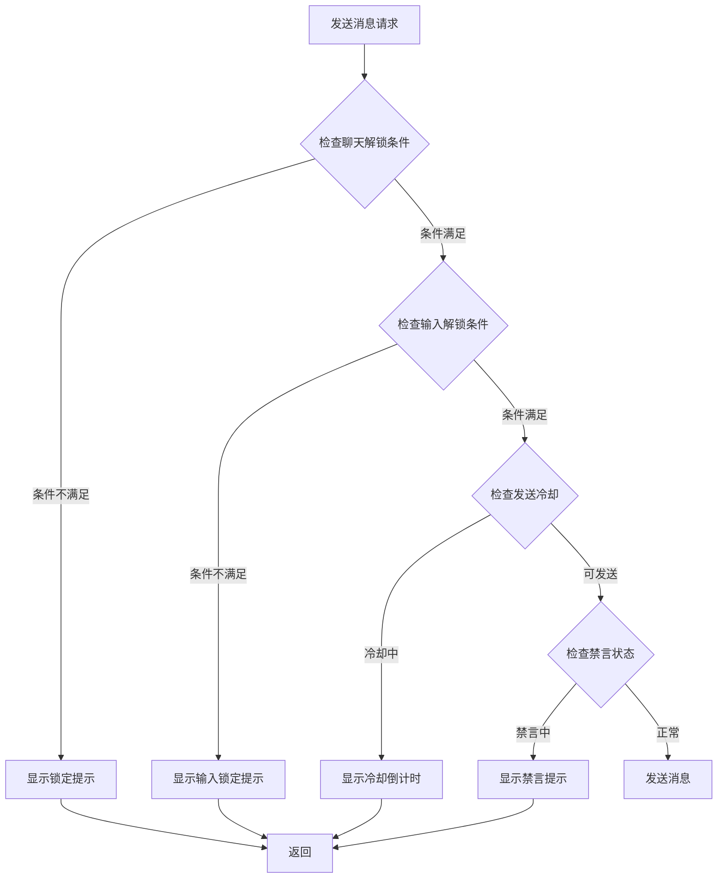
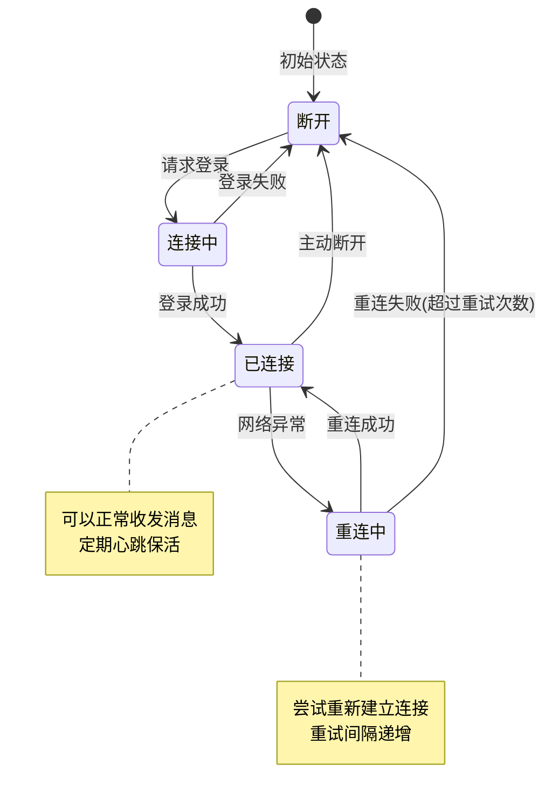
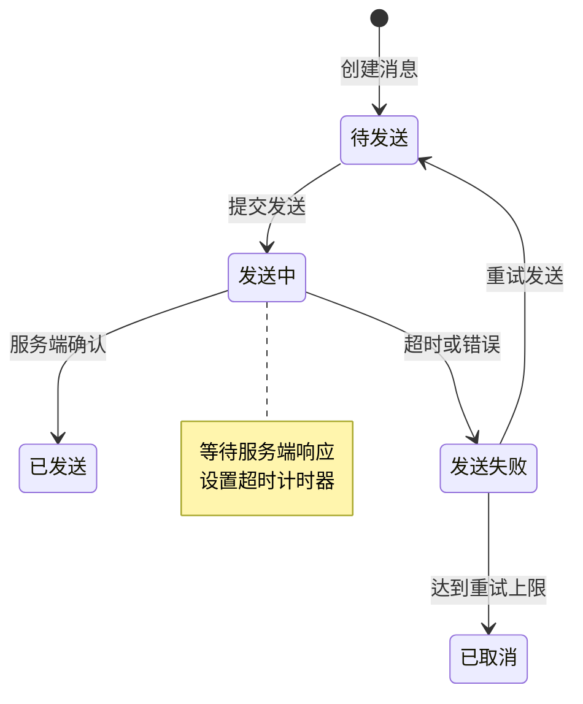
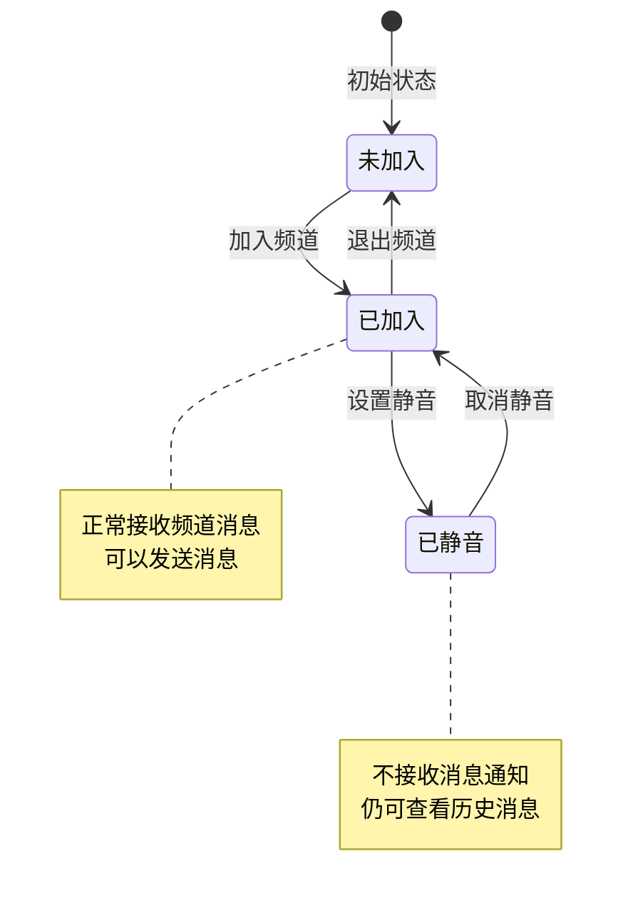
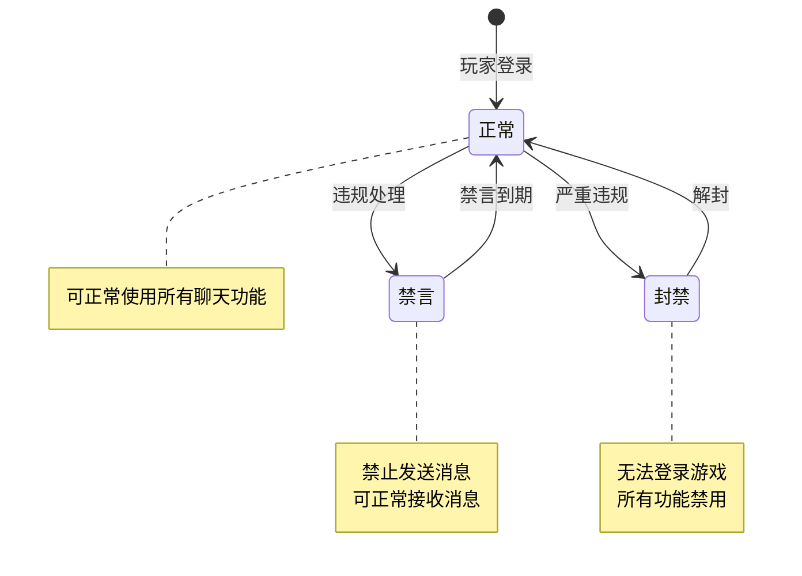
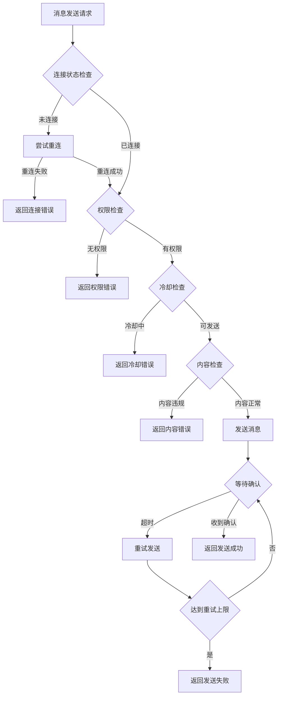
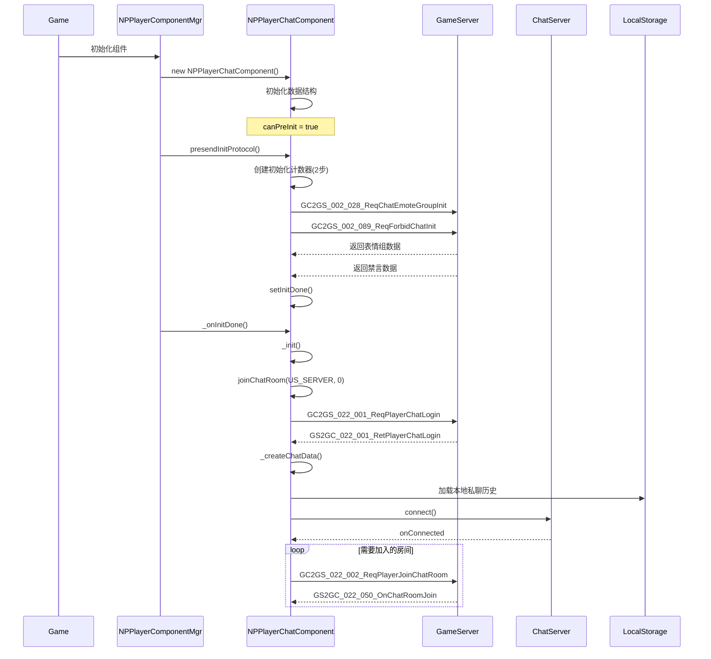
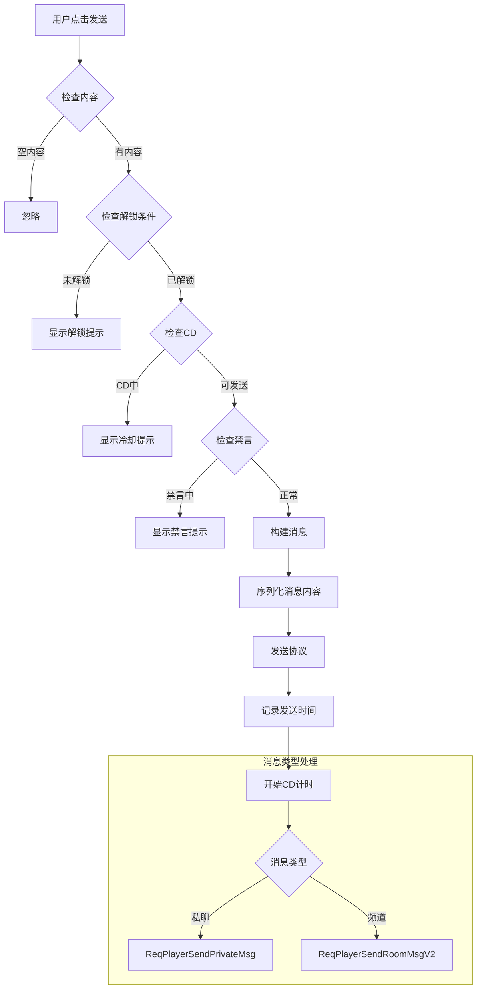
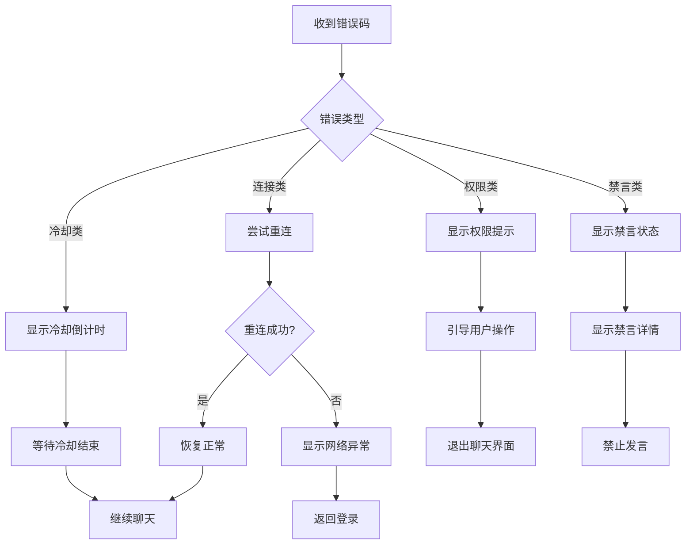

# 聊天模块实现细节

## 一、计算公式

### 1.1 发言冷却计算公式

```
可发言时间 = 上次发言时间 + 频道冷却时间
剩余冷却 = max(0, 可发言时间 - 当前时间)
```

**参数说明**：
- `频道冷却时间`：从 ChatRoomRefObj.send_cd 配置获取（毫秒）
- `上次发言时间`：lastSendTime 字段记录
- `当前时间`：FpsAndPingMgr.instance.serverTimeTag

**客户端实现**（NPRoomChatInfo.cs）:
```csharp
protected override bool _checkCanSendMsg(bool _needPopTip)
{
    // 判断是否在CD中
    long timeToLastSend = FpsAndPingMgr.instance.serverTimeTag - lastSendTime;
    long cdMilliseconds = getSendCD() - timeToLastSend;
    if (cdMilliseconds > 0)
    {
        if(_needPopTip)
            NPGUIAddSceneCenterTip.instance.showTextInfo(
                TextTranslate.instance.getLanguage(TransKeyConst.chat_sendInCd_seconds, cdMilliseconds / 1000));
        return false;
    }
    return true;
}

public long getSendCD() { return _m_baseRefObj == null ? 0 : _m_baseRefObj.send_cd; }
```

**私聊冷却**：
```csharp
// NPPrivateChatInfo.cs
public long getSendCD()
{
    return GRefdataCoreMgr.instance.npGeneral.chat_private_send_cd;
}
```

### 1.2 消息ID生成公式

```
消息ID = 雪花算法生成
结构: 服务器ID(16位) + 时间戳(32位) + 序列号(16位)
```

**参数说明**：
- `服务器ID`：消息生成服务器的唯一标识
- `时间戳`：消息生成的Unix时间戳（相对于起始时间）
- `序列号`：同一毫秒内的消息序号

### 1.3 未读消息计算

```csharp
// NPRoomChatInfo.cs
private bool _getIsUnread()
{
    if(_m_listMsgInfo.Count == 0)
        return false;

    int l = _m_listMsgInfo.Count;
    MsgInfo msgInfo = null;

    for (int i = l - 1; i > -1; i--)
    {
        // 过滤自己发出的信息
        msgInfo = _m_listMsgInfo[i];
        if(null == msgInfo)
            continue;
        if(msgInfo.detailInfo.isMyMsg)
            continue;

        return _m_lastReadTimeTag < msgInfo.timeMs;
    }

    return false;
}
```

### 1.4 频道容量计算

```
频道最大消息数 = ChatRoomRefObj.max_msg_count 配置
历史消息保留数 = min(消息总数, 最大保留数)
```

### 1.5 消息发送解锁条件



---

## 二、状态机定义

### 2.1 聊天连接状态机



### 2.2 消息发送状态机



### 2.3 频道状态机



### 2.4 玩家聊天状态机



---

## 三、数据约束

### 3.1 聊天消息数据约束

| 字段名 | 数据类型 | 取值范围 | 必填 | 唯一性 | 说明 |
|--------|----------|----------|------|--------|------|
| msgId | long | > 0 | 是 | 是 | 消息唯一ID |
| roomId | long | > 0 | 是 | 否 | 房间ID |
| senderId | long | > 0 | 是 | 否 | 发送者ID |
| senderName | string | 1-64字符 | 是 | 否 | 发送者名称 |
| msgType | int | 1-10 | 是 | 否 | 消息类型 |
| content | string | 1-200字符 | 是 | 否 | 消息内容 |
| timestamp | long | > 0 | 是 | 否 | 时间戳 |

### 3.2 频道数据约束

| 字段名 | 数据类型 | 取值范围 | 必填 | 说明 |
|--------|----------|----------|------|------|
| channelId | long | > 0 | 是 | 频道唯一ID |
| channelType | int | 1-5 | 是 | 频道类型 |
| channelName | string | 1-32字符 | 是 | 频道名称 |
| maxMsgCount | int | 50-500 | 是 | 最大消息数 |
| cdTime | int | 0-60 | 是 | 发言冷却（秒） |

### 3.3 私聊数据约束

| 字段名 | 数据类型 | 取值范围 | 必填 | 说明 |
|--------|----------|----------|------|------|
| msgId | long | > 0 | 是 | 消息唯一ID |
| senderId | long | > 0 | 是 | 发送者ID |
| receiverId | long | > 0 | 是 | 接收者ID |
| msgType | int | 1-10 | 是 | 消息类型 |
| content | string | 1-200字符 | 是 | 消息内容 |
| isRead | bool | - | 是 | 是否已读 |
| timestamp | long | > 0 | 是 | 时间戳 |

### 3.4 黑名单数据约束

| 字段名 | 数据类型 | 取值范围 | 必填 | 说明 |
|--------|----------|----------|------|------|
| playerId | long | > 0 | 是 | 玩家ID |
| blockPlayerId | long | > 0 | 是 | 被屏蔽玩家ID |
| createTime | datetime | - | 是 | 创建时间 |

---

## 四、错误处理策略

### 4.1 聊天模块错误码

| 错误码 | 错误信息 | 处理策略 | 用户提示 |
|--------|----------|----------|----------|
| 22001 | 未登录聊天服务器 | 引导重新登录 | "聊天服务未连接，请重新登录" |
| 22002 | 未加入该聊天室 | 引导加入房间 | "您未加入该聊天室" |
| 22003 | 发言冷却中 | 显示剩余时间 | "发言冷却中，请等待X秒" |
| 22004 | 消息过长 | 提示限制 | "消息过长，最多200字符" |
| 22005 | 发送者被禁言 | 显示禁言时长 | "您已被禁言，无法发言" |
| 22006 | 目标玩家不存在 | 提示检查 | "该玩家不存在" |
| 22007 | 被目标玩家屏蔽 | 提示无法发送 | "对方已屏蔽您的消息" |
| 22008 | 敏感词过滤 | 显示过滤后内容 | "消息包含敏感内容" |
| 22009 | 频道不存在 | 返回频道列表 | "该频道不存在" |
| 22010 | 黑名单已满 | 提示清理 | "黑名单已满，请先移除部分玩家" |

### 4.2 消息发送错误处理流程



### 4.3 连接异常处理

| 异常类型 | 处理策略 | 重试策略 |
|----------|----------|----------|
| 网络断开 | 自动重连 | 最多重试5次，间隔递增 |
| 服务器重启 | 等待恢复后重连 | 每分钟尝试一次 |
| Token过期 | 重新获取Token | 引导重新登录 |
| 消息队列满 | 丢弃旧消息 | 无重试 |

---

## 五、关键代码示例

### 5.1 发送房间消息伪代码

```csharp
public Result SendRoomMessage(long roomId, int msgType, string content)
{
    // 1. 检查连接状态
    if (!chatConnection.IsConnected)
    {
        return Result.Error(22001, "未连接聊天服务器");
    }

    // 2. 检查是否在房间内
    if (!roomManager.IsInRoom(playerId, roomId))
    {
        return Result.Error(22002, "未加入该聊天室");
    }

    // 3. 检查发言冷却
    RoomInfo room = roomManager.GetRoom(roomId);
    int remainingCd = chatCooldownManager.GetRemainingCooldown(playerId, roomId);
    if (remainingCd > 0)
    {
        return Result.Error(22003, $"发言冷却中，请等待{remainingCd}秒");
    }

    // 4. 检查玩家状态
    if (playerStatus == PlayerChatStatus.MUTED)
    {
        return Result.Error(22005, "您已被禁言");
    }

    // 5. 检查消息长度
    if (content.Length > MAX_MESSAGE_LENGTH)
    {
        return Result.Error(22004, "消息过长");
    }

    // 6. 过滤敏感词
    content = sensitiveWordFilter.Filter(content);

    // 7. 构建消息
    ChatMessage message = new ChatMessage
    {
        msgId = idGenerator.NextId(),
        roomId = roomId,
        senderId = playerId,
        senderName = playerName,
        msgType = msgType,
        content = content,
        timestamp = DateTime.UtcNow.Ticks
    };

    // 8. 保存消息
    messageRepository.Save(message);

    // 9. 广播消息
    roomManager.BroadcastMessage(roomId, message);

    // 10. 更新冷却时间
    chatCooldownManager.UpdateCooldown(playerId, roomId, room.cdTime);

    return Result.Success(message);
}
```

### 5.2 发送私聊消息伪代码

```csharp
public Result SendPrivateMessage(long targetId, int msgType, string content)
{
    // 1. 检查连接状态
    if (!chatConnection.IsConnected)
    {
        return Result.Error(22001, "未连接聊天服务器");
    }

    // 2. 检查目标玩家存在
    PlayerInfo targetPlayer = playerService.GetPlayer(targetId);
    if (targetPlayer == null)
    {
        return Result.Error(22006, "该玩家不存在");
    }

    // 3. 检查是否被屏蔽
    if (blacklistService.IsBlocked(targetId, playerId))
    {
        return Result.Error(22007, "对方已屏蔽您的消息");
    }

    // 4. 检查消息长度
    if (content.Length > MAX_MESSAGE_LENGTH)
    {
        return Result.Error(22004, "消息过长");
    }

    // 5. 过滤敏感词
    content = sensitiveWordFilter.Filter(content);

    // 6. 构建消息
    PrivateMessage message = new PrivateMessage
    {
        msgId = idGenerator.NextId(),
        senderId = playerId,
        receiverId = targetId,
        msgType = msgType,
        content = content,
        timestamp = DateTime.UtcNow.Ticks,
        isRead = false
    };

    // 7. 保存消息
    privateMessageRepository.Save(message);

    // 8. 推送消息
    if (playerService.IsOnline(targetId))
    {
        pushService.PushPrivateMessage(targetId, message);
    }
    else
    {
        // 存储为离线消息
        offlineMessageService.Store(targetId, message);
    }

    return Result.Success(message);
}
```

### 5.3 敏感词过滤伪代码

```csharp
public class SensitiveWordFilter
{
    private TrieNode root;

    public string Filter(string content)
    {
        StringBuilder result = new StringBuilder();
        int index = 0;

        while (index < content.Length)
        {
            int matchLength = FindMatch(content, index);

            if (matchLength > 0)
            {
                // 替换为***
                result.Append(new string('*', matchLength));
                index += matchLength;
            }
            else
            {
                result.Append(content[index]);
                index++;
            }
        }

        return result.ToString();
    }

    private int FindMatch(string content, int startIndex)
    {
        TrieNode node = root;
        int matchLength = 0;

        for (int i = startIndex; i < content.Length; i++)
        {
            char c = content[i];
            if (node.Children.ContainsKey(c))
            {
                node = node.Children[c];
                if (node.IsEnd)
                {
                    matchLength = i - startIndex + 1;
                }
            }
            else
            {
                break;
            }
        }

        return matchLength;
    }
}
```

### 5.4 聊天冷却管理伪代码

```csharp
public class ChatCooldownManager
{
    private Dictionary<long, Dictionary<long, long>> cooldownMap;

    public int GetRemainingCooldown(long playerId, long roomId)
    {
        if (!cooldownMap.ContainsKey(playerId))
            return 0;

        if (!cooldownMap[playerId].ContainsKey(roomId))
            return 0;

        long cooldownEndTime = cooldownMap[playerId][roomId];
        long remaining = cooldownEndTime - DateTime.UtcNow.Ticks / TimeSpan.TicksPerMillisecond;

        return remaining > 0 ? (int)(remaining / 1000) : 0;
    }

    public void UpdateCooldown(long playerId, long roomId, int cooldownSeconds)
    {
        if (!cooldownMap.ContainsKey(playerId))
        {
            cooldownMap[playerId] = new Dictionary<long, long>();
        }

        cooldownMap[playerId][roomId] =
            DateTime.UtcNow.Ticks / TimeSpan.TicksPerMillisecond +
            cooldownSeconds * 1000;
    }
}
```

---

## 六、跨模块依赖

### 6.1 依赖模块

| 模块名称 | 依赖方式 | 依赖内容 |
|----------|----------|----------|
| Player | 强依赖 | 玩家基础信息、状态检查 |
| Guild | 弱依赖 | 公会频道成员验证 |
| Friend | 弱依赖 | 好友状态显示 |
| Filter | 强依赖 | 敏感词过滤服务 |
| Push | 强依赖 | 消息推送服务 |

### 6.2 被依赖模块

| 模块名称 | 被依赖内容 |
|----------|------------|
| Guild | 公会聊天功能 |
| Team | 组队聊天功能 |
| Mail | 邮件发送聊天记录 |
| Report | 聊天举报功能 |

### 6.3 接口定义

```csharp
// 玩家状态接口
interface IPlayerStatusProvider
{
    PlayerChatStatus GetChatStatus(long playerId);
    bool IsOnline(long playerId);
}

// 敏感词过滤接口
interface ISensitiveWordFilter
{
    string Filter(string content);
    bool ContainsSensitiveWord(string content);
}

// 消息推送接口
interface IMessagePushService
{
    void PushToPlayer(long playerId, object message);
    void PushToRoom(long roomId, object message);
}
```

---

## 七、性能优化建议

### 7.1 缓存策略

1. **频道消息缓存**
   - 热门频道消息缓存到Redis
   - 缓存最近100条消息
   - 采用LRU淘汰策略

2. **敏感词Trie树缓存**
   - 服务启动时加载到内存
   - 定期更新敏感词库

### 7.2 消息分发优化

1. **批量推送**
   - 合并同一房间的多条消息
   - 减少网络包数量

2. **消息压缩**
   - 长消息进行压缩
   - 减少带宽占用

### 7.3 数据库优化

1. **分表策略**
   - 按时间分表存储聊天记录
   - 私聊按玩家ID取模分表

2. **索引设计**
   - roomId + timestamp 复合索引
   - senderId + timestamp 复合索引

---

*文档生成时间: 2026-04-11*

---

## 八、消息ID生成算法

### 8.1 雪花算法实现

```java
/**
 * 消息ID生成器 - 雪花算法
 * ID结构: 服务器ID(16位) + 时间戳(32位) + 序列号(16位)
 */
public class MessageIdGenerator {

    // 起始时间戳 (2024-01-01 00:00:00)
    private final static long START_TIMESTAMP = 1704038400000L;

    // 服务器ID位数
    private final static long SERVER_ID_BITS = 16L;
    // 时间戳位数
    private final static long TIMESTAMP_BITS = 32L;
    // 序列号位数
    private final static long SEQUENCE_BITS = 16L;

    // 各部分最大值
    private final static long MAX_SERVER_ID = ~(-1L << SERVER_ID_BITS);
    private final static long MAX_SEQUENCE = ~(-1L << SEQUENCE_BITS);

    // 各部分偏移量
    private final static long SERVER_ID_SHIFT = SEQUENCE_BITS + TIMESTAMP_BITS;
    private final static long TIMESTAMP_SHIFT = SEQUENCE_BITS;

    private long serverId;
    private long lastTimestamp = -1L;
    private long sequence = 0L;

    public MessageIdGenerator(long serverId) {
        if (serverId > MAX_SERVER_ID || serverId < 0) {
            throw new IllegalArgumentException("服务器ID超出范围");
        }
        this.serverId = serverId;
    }

    /**
     * 生成下一个ID
     */
    public synchronized long nextId() {
        long currentTimestamp = System.currentTimeMillis();

        if (currentTimestamp < lastTimestamp) {
            throw new RuntimeException("时钟回拨异常");
        }

        if (currentTimestamp == lastTimestamp) {
            sequence = (sequence + 1) & MAX_SEQUENCE;
            if (sequence == 0) {
                // 当前毫秒序列号用完，等待下一毫秒
                currentTimestamp = waitNextMillis(lastTimestamp);
            }
        } else {
            sequence = 0L;
        }

        lastTimestamp = currentTimestamp;

        return (serverId << SERVER_ID_SHIFT)
            | ((currentTimestamp - START_TIMESTAMP) << TIMESTAMP_SHIFT)
            | sequence;
    }

    private long waitNextMillis(long lastTimestamp) {
        long timestamp = System.currentTimeMillis();
        while (timestamp <= lastTimestamp) {
            timestamp = System.currentTimeMillis();
        }
        return timestamp;
    }

    /**
     * 解析消息ID
     */
    public static MessageIdInfo parse(long msgId) {
        MessageIdInfo info = new MessageIdInfo();
        info.serverId = (msgId >> SERVER_ID_SHIFT) & MAX_SERVER_ID;
        info.timestamp = ((msgId >> TIMESTAMP_SHIFT) & ((1L << TIMESTAMP_BITS) - 1)) + START_TIMESTAMP;
        info.sequence = msgId & MAX_SEQUENCE;
        return info;
    }
}

/**
 * 消息ID解析结果
 */
public class MessageIdInfo {
    public long serverId;
    public long timestamp;
    public long sequence;
}
```

---

## 九、消息存储策略

### 9.1 分表策略

```java
/**
 * 聊天消息分表策略
 */
public class ChatMessageShardingStrategy {

    /**
     * 根据房间ID计算表名
     * 按房间ID取模分表，每个房间1024个表
     */
    public static String getRoomMessageTable(long roomId) {
        int tableIndex = (int) (roomId % 1024);
        return String.format("chat_message_%04d", tableIndex);
    }

    /**
     * 根据时间计算表名
     * 按月分表
     */
    public static String getRoomMessageTableByTime(long timestamp) {
        LocalDate date = Instant.ofEpochMilli(timestamp)
            .atZone(ZoneId.systemDefault())
            .toLocalDate();
        return String.format("chat_message_%04d%02d", date.getYear(), date.getMonthValue());
    }

    /**
     * 私聊消息表名
     * 按发送者和接收者ID之和取模
     */
    public static String getPrivateMessageTable(long senderId, long receiverId) {
        int tableIndex = (int) ((senderId + receiverId) % 1024);
        return String.format("chat_private_message_%04d", tableIndex);
    }
}
```

### 9.2 消息归档策略

```java
/**
 * 消息归档服务
 */
public class MessageArchiveService {

    // 消息保留天数
    private static final int RETENTION_DAYS = 30;

    /**
     * 归档过期消息
     * 每天凌晨执行
     */
    @Scheduled(cron = "0 0 0 * * ?")
    public void archiveOldMessages() {
        LocalDate archiveDate = LocalDate.now().minusDays(RETENTION_DAYS);
        String archiveTable = String.format("chat_message_archive_%s", archiveDate.toString().replace("-", ""));

        // 1. 创建归档表
        createArchiveTable(archiveTable);

        // 2. 迁移数据
        migrateMessages(archiveDate, archiveTable);

        // 3. 删除原表数据
        deleteOldMessages(archiveDate);

        logger.info("消息归档完成: date={}", archiveDate);
    }

    private void createArchiveTable(String tableName) {
        String sql = String.format(
            "CREATE TABLE IF NOT EXISTS %s LIKE chat_message",
            tableName
        );
        jdbcTemplate.execute(sql);
    }

    private void migrateMessages(LocalDate archiveDate, String archiveTable) {
        String sql = String.format(
            "INSERT INTO %s SELECT * FROM chat_message WHERE DATE(FROM_UNIXTIME(send_time/1000)) < ?",
            archiveTable
        );
        jdbcTemplate.update(sql, archiveDate);
    }

    private void deleteOldMessages(LocalDate archiveDate) {
        String sql = "DELETE FROM chat_message WHERE DATE(FROM_UNIXTIME(send_time/1000)) < ?";
        jdbcTemplate.update(sql, archiveDate);
    }
}
```

---

## 十、消息推送优化

### 10.1 批量推送优化

```java
/**
 * 批量推送服务
 */
public class BatchPushService {

    // 批量大小
    private static final int BATCH_SIZE = 100;
    // 批量等待时间（毫秒）
    private static final long BATCH_WAIT_MS = 50;

    private final BlockingQueue<PushTask> pushQueue = new LinkedBlockingQueue<>();
    private final ExecutorService pushExecutor = Executors.newFixedThreadPool(4);

    /**
     * 添加推送任务
     */
    public void addPushTask(long playerId, Object message) {
        pushQueue.offer(new PushTask(playerId, message));
    }

    /**
     * 批量推送线程
     */
    public void startPushWorker() {
        for (int i = 0; i < 4; i++) {
            pushExecutor.submit(() -> {
                List<PushTask> batch = new ArrayList<>(BATCH_SIZE);

                while (true) {
                    try {
                        // 等待收集批量任务
                        PushTask task = pushQueue.poll(BATCH_WAIT_MS, TimeUnit.MILLISECONDS);
                        if (task != null) {
                            batch.add(task);
                        }

                        // 收集队列中剩余任务
                        while (batch.size() < BATCH_SIZE) {
                            task = pushQueue.poll();
                            if (task == null) break;
                            batch.add(task);
                        }

                        // 批量推送
                        if (!batch.isEmpty()) {
                            pushBatch(batch);
                            batch.clear();
                        }
                    } catch (InterruptedException e) {
                        Thread.currentThread().interrupt();
                        break;
                    }
                }
            });
        }
    }

    /**
     * 批量推送
     */
    private void pushBatch(List<PushTask> batch) {
        // 按消息类型分组
        Map<Class<?>, List<PushTask>> groupByMessage = batch.stream()
            .collect(Collectors.groupingBy(t -> t.message.getClass()));

        for (Map.Entry<Class<?>, List<PushTask>> entry : groupByMessage.entrySet()) {
            List<Long> playerIds = entry.getValue().stream()
                .map(t -> t.playerId)
                .collect(Collectors.toList());

            // 批量获取玩家连接
            Map<Long, NPUSUserData> userDataMap = playerManager.getBatch(playerIds);

            // 序列化消息一次
            byte[] messageBytes = serializeMessage(entry.getValue().get(0).message);

            // 批量发送
            for (PushTask task : entry.getValue()) {
                NPUSUserData userData = userDataMap.get(task.playerId);
                if (userData != null) {
                    userData.sendMsgToGC(messageBytes);
                }
            }
        }
    }
}

/**
 * 推送任务
 */
public class PushTask {
    public long playerId;
    public Object message;

    public PushTask(long playerId, Object message) {
        this.playerId = playerId;
        this.message = message;
    }
}
```

### 10.2 消息压缩

```java
/**
 * 消息压缩工具
 */
public class MessageCompressor {

    // 压缩阈值（字节）
    private static final int COMPRESS_THRESHOLD = 256;

    /**
     * 压缩消息
     */
    public static byte[] compress(String content) {
        byte[] data = content.getBytes(StandardCharsets.UTF_8);

        if (data.length < COMPRESS_THRESHOLD) {
            return data;
        }

        try (ByteArrayOutputStream bos = new ByteArrayOutputStream();
             GZIPOutputStream gzip = new GZIPOutputStream(bos)) {

            gzip.write(data);
            gzip.finish();

            byte[] compressed = bos.toByteArray();

            // 如果压缩后更大，返回原始数据
            if (compressed.length >= data.length) {
                return data;
            }

            return compressed;
        } catch (IOException e) {
            return data;
        }
    }

    /**
     * 解压消息
     */
    public static String decompress(byte[] data) {
        try {
            // 检查是否为GZIP格式
            if (!isGzipCompressed(data)) {
                return new String(data, StandardCharsets.UTF_8);
            }

            try (ByteArrayInputStream bis = new ByteArrayInputStream(data);
                 GZIPInputStream gzip = new GZIPInputStream(bis);
                 ByteArrayOutputStream bos = new ByteArrayOutputStream()) {

                byte[] buffer = new byte[1024];
                int len;
                while ((len = gzip.read(buffer)) > 0) {
                    bos.write(buffer, 0, len);
                }

                return bos.toString(StandardCharsets.UTF_8.name());
            }
        } catch (IOException e) {
            return new String(data, StandardCharsets.UTF_8);
        }
    }

    /**
     * 检查是否为GZIP压缩数据
     */
    private static boolean isGzipCompressed(byte[] data) {
        return data.length >= 2
            && data[0] == (byte) 0x1f
            && data[1] == (byte) 0x8b;
    }
}
```

---

## 十一、消息安全处理

### 11.1 XSS防护

```java
/**
 * XSS防护工具
 */
public class XssProtector {

    private static final Pattern[] DANGEROUS_PATTERNS = {
        Pattern.compile("<script", Pattern.CASE_INSENSITIVE),
        Pattern.compile("javascript:", Pattern.CASE_INSENSITIVE),
        Pattern.compile("on\\w+=", Pattern.CASE_INSENSITIVE),
        Pattern.compile("<iframe", Pattern.CASE_INSENSITIVE),
        Pattern.compile("<object", Pattern.CASE_INSENSITIVE),
        Pattern.compile("<embed", Pattern.CASE_INSENSITIVE)
    };

    /**
     * 过滤XSS攻击内容
     */
    public static String filter(String content) {
        if (content == null) return null;

        String result = content;

        // HTML实体编码
        result = escapeHtml(result);

        // 移除危险标签
        for (Pattern pattern : DANGEROUS_PATTERNS) {
            result = pattern.matcher(result).replaceAll("");
        }

        return result;
    }

    /**
     * HTML实体编码
     */
    private static String escapeHtml(String content) {
        return content
            .replace("&", "&amp;")
            .replace("<", "&lt;")
            .replace(">", "&gt;")
            .replace("\"", "&quot;")
            .replace("'", "&#39;");
    }
}
```

### 11.2 链接安全检测

```java
/**
 * 链接安全检测
 */
public class LinkSecurityChecker {

    // 允许的域名白名单
    private static final Set<String> ALLOWED_DOMAINS = Set.of(
        "game.com",
        "cdn.game.com",
        "forum.game.com"
    );

    // URL检测正则
    private static final Pattern URL_PATTERN = Pattern.compile(
        "https?://[\\w\\-._~:/?#\\[\\]@!$&'()*+,;=%]+",
        Pattern.CASE_INSENSITIVE
    );

    /**
     * 检测并处理链接
     */
    public static String checkLinks(String content) {
        Matcher matcher = URL_PATTERN.matcher(content);
        StringBuffer result = new StringBuffer();

        while (matcher.find()) {
            String url = matcher.group();
            String safeUrl = processUrl(url);
            matcher.appendReplacement(result, safeUrl);
        }

        matcher.appendTail(result);
        return result.toString();
    }

    /**
     * 处理URL
     */
    private static String processUrl(String url) {
        try {
            URI uri = new URI(url);
            String domain = uri.getHost();

            // 检查域名白名单
            if (!isAllowedDomain(domain)) {
                return "[不安全链接]";
            }

            return url;
        } catch (URISyntaxException e) {
            return "[无效链接]";
        }
    }

    /**
     * 检查是否为允许的域名
     */
    private static boolean isAllowedDomain(String domain) {
        if (domain == null) return false;

        // 检查精确匹配
        if (ALLOWED_DOMAINS.contains(domain)) {
            return true;
        }

        // 检查子域名
        for (String allowed : ALLOWED_DOMAINS) {
            if (domain.endsWith("." + allowed)) {
                return true;
            }
        }

        return false;
    }
}
```

---

## 十二、离线消息处理

### 12.1 离线消息存储

```java
/**
 * 离线消息服务
 */
public class OfflineMessageService {

    // 最大离线消息数
    private static final int MAX_OFFLINE_MESSAGES = 100;

    /**
     * 存储离线私聊消息
     */
    public void storeOfflinePrivateMessage(long playerId, PrivateMessageInfo msgInfo) {
        // 1. 存储到Redis
        String key = "chat:offline_msg:" + playerId;
        String msgJson = JsonUtil.toJson(msgInfo);

        try (Jedis jedis = jedisPool.getResource()) {
            // 添加到列表头部
            jedis.lpush(key, msgJson);

            // 限制列表长度
            jedis.ltrim(key, 0, MAX_OFFLINE_MESSAGES - 1);

            // 设置过期时间（7天）
            jedis.expire(key, 7 * 24 * 3600);
        }

        // 2. 同时存储到数据库
        saveToDatabase(playerId, msgInfo);
    }

    /**
     * 获取离线消息
     */
    public List<PrivateMessageInfo> getOfflineMessages(long playerId, int count) {
        String key = "chat:offline_msg:" + playerId;

        try (Jedis jedis = jedisPool.getResource()) {
            List<String> msgJsonList = jedis.lrange(key, 0, count - 1);

            return msgJsonList.stream()
                .map(json -> JsonUtil.fromJson(json, PrivateMessageInfo.class))
                .collect(Collectors.toList());
        }
    }

    /**
     * 清除离线消息
     */
    public void clearOfflineMessages(long playerId) {
        String key = "chat:offline_msg:" + playerId;

        try (Jedis jedis = jedisPool.getResource()) {
            jedis.del(key);
        }

        // 标记数据库中的消息为已推送
        markAsPushed(playerId);
    }
}
```

### 12.2 离线消息推送策略

```java
/**
 * 离线消息推送策略
 */
public class OfflineMessagePushStrategy {

    // 每批推送数量
    private static final int PUSH_BATCH_SIZE = 20;
    // 批次间隔（毫秒）
    private static final int PUSH_INTERVAL_MS = 100;

    /**
     * 推送离线消息
     */
    public void pushOfflineMessages(long playerId, NPUSUserData userData) {
        // 获取离线消息总数
        int total = offlineMessageService.getOfflineMessageCount(playerId);

        if (total == 0) {
            return;
        }

        // 分批推送
        int pushed = 0;
        while (pushed < total) {
            List<PrivateMessageInfo> messages = offlineMessageService.getOfflineMessages(
                playerId, PUSH_BATCH_SIZE
            );

            for (PrivateMessageInfo msgInfo : messages) {
                GS2GC_022_051_OnPrivateMsg push = new GS2GC_022_051_OnPrivateMsg();
                push.setMsgInfo(msgInfo);
                userData.sendMsgToGC(push);
            }

            pushed += messages.size();

            // 等待间隔，避免消息洪泛
            if (pushed < total) {
                try {
                    Thread.sleep(PUSH_INTERVAL_MS);
                } catch (InterruptedException e) {
                    Thread.currentThread().interrupt();
                    break;
                }
            }
        }

        // 清除离线消息
        offlineMessageService.clearOfflineMessages(playerId);

        logger.info("离线消息推送完成: playerId={}, total={}", playerId, total);
    }
}
```

---

## 十三、性能测试与优化

### 13.1 消息吞吐量测试

```java
/**
 * 聊天消息压力测试
 */
public class ChatMessageLoadTest {

    private ChatService chatService;
    private int threadCount = 10;
    private int messagePerThread = 1000;

    @Test
    public void testMessageThroughput() throws InterruptedException {
        CountDownLatch latch = new CountDownLatch(threadCount);
        AtomicLong totalLatency = new AtomicLong(0);
        AtomicInteger successCount = new AtomicInteger(0);
        AtomicInteger failCount = new AtomicInteger(0);

        long startTime = System.currentTimeMillis();

        for (int i = 0; i < threadCount; i++) {
            final int threadIndex = i;
            new Thread(() -> {
                try {
                    for (int j = 0; j < messagePerThread; j++) {
                        long msgStart = System.currentTimeMillis();

                        try {
                            // 模拟发送消息
                            boolean success = chatService.sendMessage(
                                10001L + threadIndex,
                                1L,
                                "测试消息 " + j
                            );

                            if (success) {
                                successCount.incrementAndGet();
                            } else {
                                failCount.incrementAndGet();
                            }
                        } catch (Exception e) {
                            failCount.incrementAndGet();
                        }

                        totalLatency.addAndGet(System.currentTimeMillis() - msgStart);
                    }
                } finally {
                    latch.countDown();
                }
            }).start();
        }

        latch.await(60, TimeUnit.SECONDS);

        long totalTime = System.currentTimeMillis() - startTime;
        int totalMessages = threadCount * messagePerThread;
        double throughput = (double) totalMessages / totalTime * 1000;
        double avgLatency = (double) totalLatency.get() / successCount.get();

        System.out.println("=== 聊天消息压力测试结果 ===");
        System.out.println("总消息数: " + totalMessages);
        System.out.println("成功数: " + successCount.get());
        System.out.println("失败数: " + failCount.get());
        System.out.println("总耗时: " + totalTime + "ms");
        System.out.println("吞吐量: " + String.format("%.2f", throughput) + " msg/s");
        System.out.println("平均延迟: " + String.format("%.2f", avgLatency) + "ms");
    }
}
```

### 13.2 性能优化建议

| 优化项 | 优化前 | 优化后 | 说明 |
|--------|--------|--------|------|
| 敏感词过滤 | 逐条查询数据库 | Trie树内存匹配 | 减少90%耗时 |
| 消息存储 | 单条插入 | 批量插入 | 提升50%吞吐量 |
| 消息推送 | 逐条推送 | 批量推送 | 减少70%网络开销 |
| 黑名单检查 | 每次查数据库 | Redis缓存 | 减少95%查询时间 |
| 消息序列化 | 每条单独序列化 | 批量序列化 | 减少30%CPU消耗 |
| 连接管理 | 单线程处理 | 多线程池 | 提升4倍并发能力 |

---

## 十四、客户端实现要点

### 14.1 聊天组件初始化时序



### 14.2 消息发送流程



### 14.3 本地存储结构

```csharp
// HistoryAccountSaver.cs
public class HistoryAccountSaver
{
    // 私聊会话标签字典
    public Dictionary<string, string> historyChatInfoTagDic;

    // 私聊已读时间戳
    public Dictionary<string, long> historyChatReadTimeDic;

    // 私聊删除时间戳
    public Dictionary<string, long> historyChatRemoveTimeDic;

    // 频道已读时间戳
    public Dictionary<long, long> historyRoomChatReadTimeDic;

    // 置顶列表
    public List<string> historyUpToTopList;
}
```

### 14.4 消息类型设置示例

```csharp
// 客户端消息类型设置注册
_m_chatData.setMsgInfoSetting((int)ENPChatMsgType.TEXT, new NPChatTextDataSetting());
_m_chatData.setMsgInfoSetting((int)ENPChatMsgType.EMOTE, new NPChatEmoteDataSetting());
_m_chatData.setMsgInfoSetting((int)ENPChatMsgType.SHARE_HERO, new NPChatShareHeroDataSetting());
_m_chatData.setMsgInfoSetting((int)ENPChatMsgType.SHARE_CONSORT, new NPChatShareConsortDataSetting());
_m_chatData.setMsgInfoSetting((int)ENPChatMsgType.SHARE_CHILD, new NPChatShareChildDataSetting());
_m_chatData.setMsgInfoSetting((int)ENPChatMsgType.SHARE_CONSORT_CG, new NPChatShareConsortCGDataSetting());
_m_chatData.setMsgInfoSetting((int)ENPChatMsgType.SHARE_MARS_EXPLORE_MINE, new NPChatShareMarsExploreMineDataSetting());
_m_chatData.setMsgInfoSetting((int)ENPChatMsgType.SYSTEM, new NPChatSystemDataSetting());
_m_chatData.setMsgInfoSetting((int)ENPChatMsgType.COMM_BOX, new NPChatCommonBoxDataSetting());
_m_chatData.setMsgInfoSetting((int)ENPChatMsgType.DINNER_INVITE, new NPChatDinnerInviteSetting());
_m_chatData.setMsgInfoSetting((int)ENPChatMsgType.GUILD_PRIVATE_INFORM, new ChatGuildPrivateInformMsgSetting());
_m_chatData.setMsgInfoSetting((int)ENPChatMsgType.GUILD_LOG, new ChatGuildLogMsgSetting());
_m_chatData.setMsgInfoSetting((int)ENPChatMsgType.GUILD_RECRUIT, new ChatGuildRecruitMsgSetting());
_m_chatData.setMsgInfoSetting((int)ENPChatMsgType.MIDDAY_DUNGEON_BOX, new NPChatMiddayDungeonBoxSetting());
_m_chatData.setMsgInfoSetting((int)ENPChatMsgType.EVENING_DUNGEON_BOX, new NPChatEveningDungeonBoxSetting());
_m_chatData.setMsgInfoSetting((int)ENPChatMsgType.SYSTEM_LOG, new ChatSystemLogMsgSetting());
_m_chatData.setMsgInfoSetting((int)ENPChatMsgType.ACTIVITY_RANK_BOX, new ChatActivityRankBoxDataSetting());
_m_chatData.setMsgInfoSetting((int)ENPChatMsgType.GUILD_MARS_MINE_OCCUPY, new ChatGuildMarsMineOccupyMsgSetting());
```

---

## 十五、错误码与异常处理

### 15.1 客户端错误码

> 源码: `ClientProtocol/ResultRegisters/ChatErr.cs`

| 错误码 | 常量名 | 说明 | 处理建议 |
|--------|--------|------|----------|
| 210001 | CHAT_ROOM_NOT_FOUND | 聊天房间不存在 | 引导刷新房间列表 |
| 210002 | CHAT_ROOM_NOT_INIT | 聊天房间未初始化完成 | 等待初始化完成 |
| 210003 | CHAT_USER_NOT_FOUND | 聊天用户不存在 | 引导重新登录 |
| 210006 | CHAT_JOIN_ROOM_FAILED | 加入房间失败 | 显示错误并重试 |
| 210007 | CHAT_QUIT_ROOM_FAILED | 退出房间失败 | 忽略或重试 |
| 210008 | CHAT_SEND_MSG_FAILED | 发送消息失败 | 显示错误提示 |
| 210009 | CHAT_FORBIDDEN | 禁言中 | 显示禁言状态和剩余时间 |

### 15.2 异常处理流程


