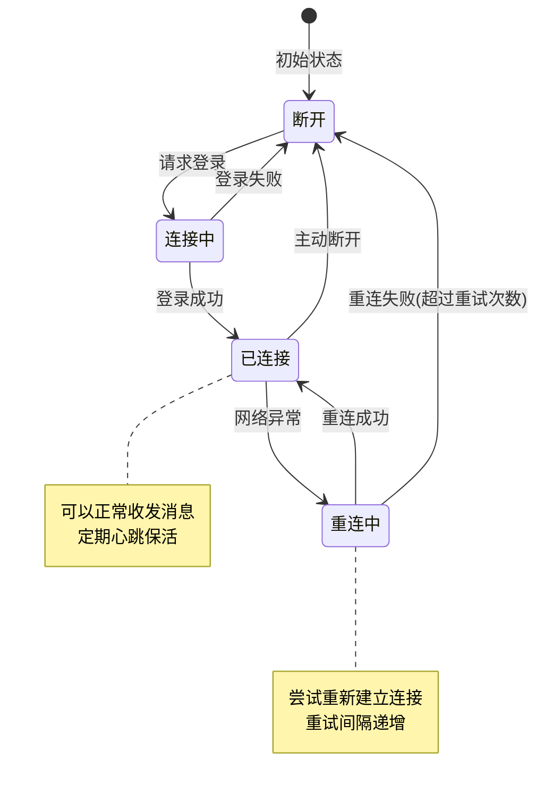
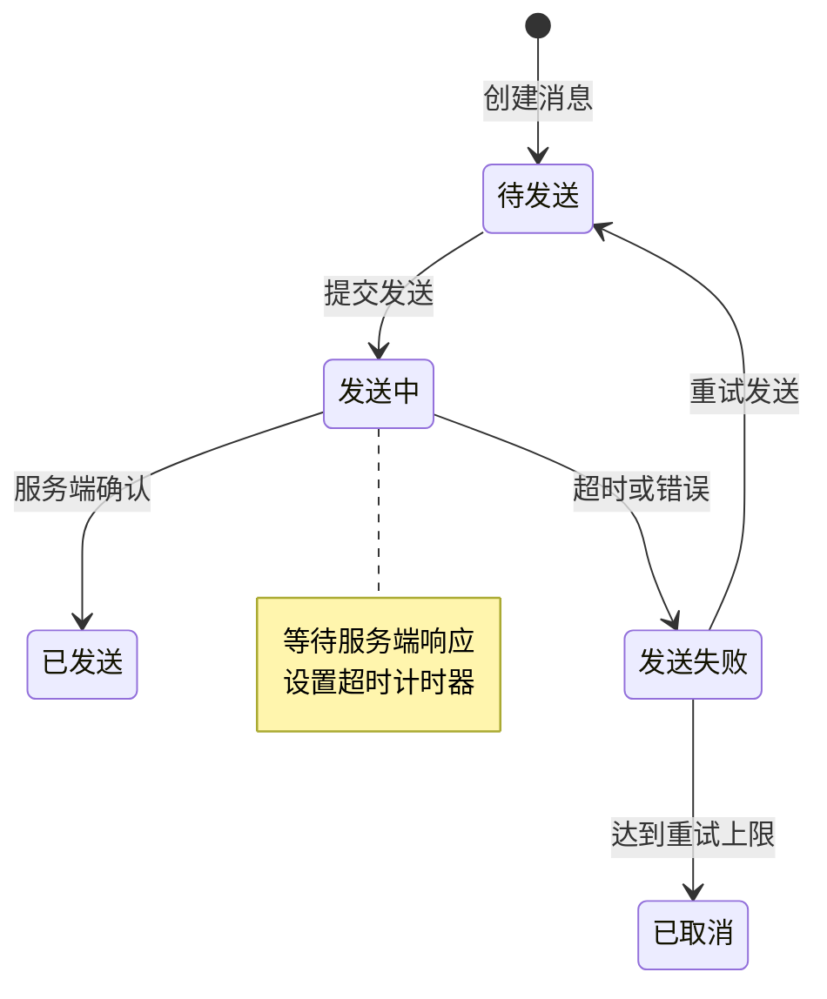
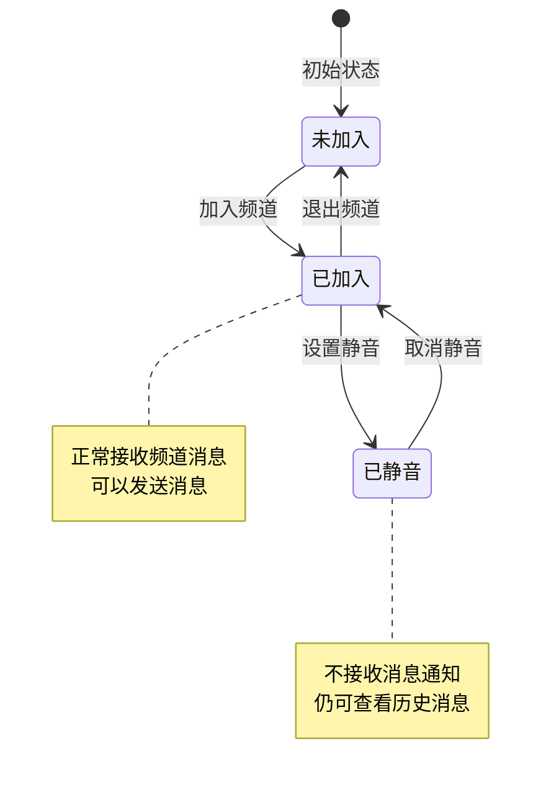
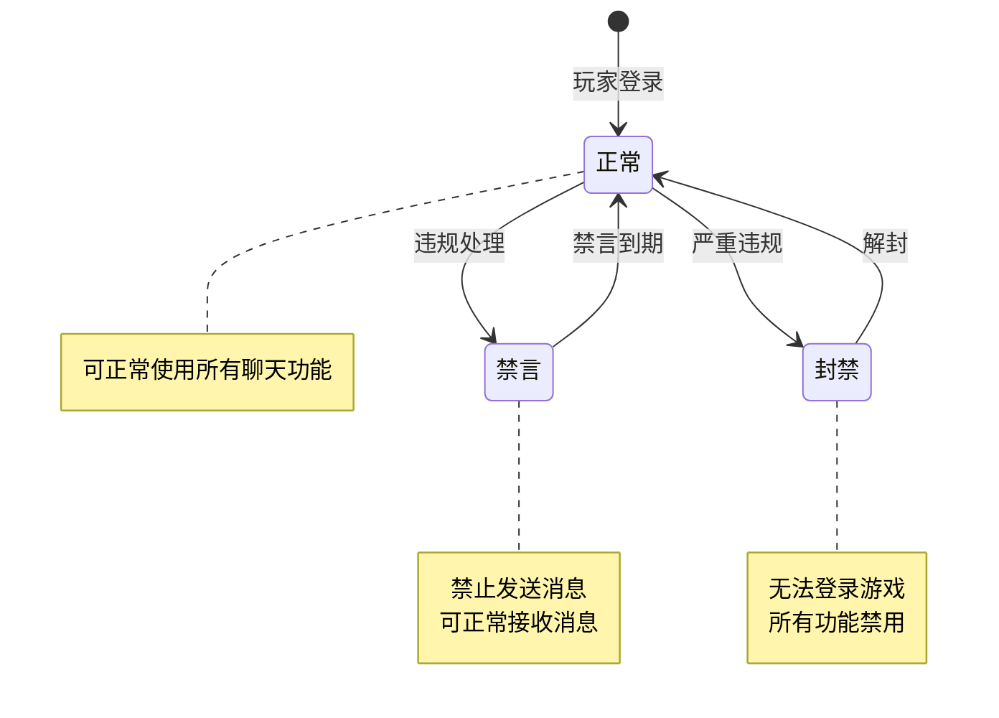
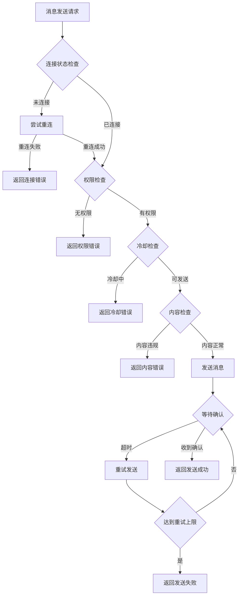

# 聊天模块实现细节

## 一、计算公式

### 1.1 发言冷却计算公式

```
可发言时间 = 上次发言时间 + 频道冷却时间
剩余冷却 = max(0, 可发言时间 - 当前时间)
```

**参数说明**：
- `频道冷却时间`：根据频道类型配置的冷却时间（秒）
- `上次发言时间`：玩家在该频道最后一次发言的时间戳

**示例计算**：
```
世界频道冷却时间：5秒
上次发言时间：10:00:00
当前时间：10:00:03

可发言时间：10:00:05
剩余冷却：2秒
```

### 1.2 消息ID生成公式

```
消息ID = 服务器ID(16位) + 时间戳(32位) + 序列号(16位)
```

**参数说明**：
- `服务器ID`：消息生成服务器的唯一标识
- `时间戳`：消息生成的Unix时间戳
- `序列号`：同一毫秒内的消息序号

### 1.3 频道容量计算

```
频道最大消息数 = 基础容量 + VIP加成
历史消息保留数 = min(消息总数, 最大保留数)
```

---

## 二、状态机定义

### 2.1 聊天连接状态机



### 2.2 消息发送状态机



### 2.3 频道状态机



### 2.4 玩家聊天状态机



---

## 三、数据约束

### 3.1 聊天消息数据约束

| 字段名 | 数据类型 | 取值范围 | 必填 | 唯一性 | 说明 |
|--------|----------|----------|------|--------|------|
| msgId | long | > 0 | 是 | 是 | 消息唯一ID |
| roomId | long | > 0 | 是 | 否 | 房间ID |
| senderId | long | > 0 | 是 | 否 | 发送者ID |
| senderName | string | 1-64字符 | 是 | 否 | 发送者名称 |
| msgType | int | 1-10 | 是 | 否 | 消息类型 |
| content | string | 1-200字符 | 是 | 否 | 消息内容 |
| timestamp | long | > 0 | 是 | 否 | 时间戳 |

### 3.2 频道数据约束

| 字段名 | 数据类型 | 取值范围 | 必填 | 说明 |
|--------|----------|----------|------|------|
| channelId | long | > 0 | 是 | 频道唯一ID |
| channelType | int | 1-5 | 是 | 频道类型 |
| channelName | string | 1-32字符 | 是 | 频道名称 |
| maxMsgCount | int | 50-500 | 是 | 最大消息数 |
| cdTime | int | 0-60 | 是 | 发言冷却（秒） |

### 3.3 私聊数据约束

| 字段名 | 数据类型 | 取值范围 | 必填 | 说明 |
|--------|----------|----------|------|------|
| msgId | long | > 0 | 是 | 消息唯一ID |
| senderId | long | > 0 | 是 | 发送者ID |
| receiverId | long | > 0 | 是 | 接收者ID |
| msgType | int | 1-10 | 是 | 消息类型 |
| content | string | 1-200字符 | 是 | 消息内容 |
| isRead | bool | - | 是 | 是否已读 |
| timestamp | long | > 0 | 是 | 时间戳 |

### 3.4 黑名单数据约束

| 字段名 | 数据类型 | 取值范围 | 必填 | 说明 |
|--------|----------|----------|------|------|
| playerId | long | > 0 | 是 | 玩家ID |
| blockPlayerId | long | > 0 | 是 | 被屏蔽玩家ID |
| createTime | datetime | - | 是 | 创建时间 |

---

## 四、错误处理策略

### 4.1 聊天模块错误码

| 错误码 | 错误信息 | 处理策略 | 用户提示 |
|--------|----------|----------|----------|
| 22001 | 未登录聊天服务器 | 引导重新登录 | "聊天服务未连接，请重新登录" |
| 22002 | 未加入该聊天室 | 引导加入房间 | "您未加入该聊天室" |
| 22003 | 发言冷却中 | 显示剩余时间 | "发言冷却中，请等待X秒" |
| 22004 | 消息过长 | 提示限制 | "消息过长，最多200字符" |
| 22005 | 发送者被禁言 | 显示禁言时长 | "您已被禁言，无法发言" |
| 22006 | 目标玩家不存在 | 提示检查 | "该玩家不存在" |
| 22007 | 被目标玩家屏蔽 | 提示无法发送 | "对方已屏蔽您的消息" |
| 22008 | 敏感词过滤 | 显示过滤后内容 | "消息包含敏感内容" |
| 22009 | 频道不存在 | 返回频道列表 | "该频道不存在" |
| 22010 | 黑名单已满 | 提示清理 | "黑名单已满，请先移除部分玩家" |

### 4.2 消息发送错误处理流程



### 4.3 连接异常处理

| 异常类型 | 处理策略 | 重试策略 |
|----------|----------|----------|
| 网络断开 | 自动重连 | 最多重试5次，间隔递增 |
| 服务器重启 | 等待恢复后重连 | 每分钟尝试一次 |
| Token过期 | 重新获取Token | 引导重新登录 |
| 消息队列满 | 丢弃旧消息 | 无重试 |

---

## 五、关键代码示例

### 5.1 发送房间消息伪代码

```csharp
public Result SendRoomMessage(long roomId, int msgType, string content)
{
    // 1. 检查连接状态
    if (!chatConnection.IsConnected)
    {
        return Result.Error(22001, "未连接聊天服务器");
    }

    // 2. 检查是否在房间内
    if (!roomManager.IsInRoom(playerId, roomId))
    {
        return Result.Error(22002, "未加入该聊天室");
    }

    // 3. 检查发言冷却
    RoomInfo room = roomManager.GetRoom(roomId);
    int remainingCd = chatCooldownManager.GetRemainingCooldown(playerId, roomId);
    if (remainingCd > 0)
    {
        return Result.Error(22003, $"发言冷却中，请等待{remainingCd}秒");
    }

    // 4. 检查玩家状态
    if (playerStatus == PlayerChatStatus.MUTED)
    {
        return Result.Error(22005, "您已被禁言");
    }

    // 5. 检查消息长度
    if (content.Length > MAX_MESSAGE_LENGTH)
    {
        return Result.Error(22004, "消息过长");
    }

    // 6. 过滤敏感词
    content = sensitiveWordFilter.Filter(content);

    // 7. 构建消息
    ChatMessage message = new ChatMessage
    {
        msgId = idGenerator.NextId(),
        roomId = roomId,
        senderId = playerId,
        senderName = playerName,
        msgType = msgType,
        content = content,
        timestamp = DateTime.UtcNow.Ticks
    };

    // 8. 保存消息
    messageRepository.Save(message);

    // 9. 广播消息
    roomManager.BroadcastMessage(roomId, message);

    // 10. 更新冷却时间
    chatCooldownManager.UpdateCooldown(playerId, roomId, room.cdTime);

    return Result.Success(message);
}
```

### 5.2 发送私聊消息伪代码

```csharp
public Result SendPrivateMessage(long targetId, int msgType, string content)
{
    // 1. 检查连接状态
    if (!chatConnection.IsConnected)
    {
        return Result.Error(22001, "未连接聊天服务器");
    }

    // 2. 检查目标玩家存在
    PlayerInfo targetPlayer = playerService.GetPlayer(targetId);
    if (targetPlayer == null)
    {
        return Result.Error(22006, "该玩家不存在");
    }

    // 3. 检查是否被屏蔽
    if (blacklistService.IsBlocked(targetId, playerId))
    {
        return Result.Error(22007, "对方已屏蔽您的消息");
    }

    // 4. 检查消息长度
    if (content.Length > MAX_MESSAGE_LENGTH)
    {
        return Result.Error(22004, "消息过长");
    }

    // 5. 过滤敏感词
    content = sensitiveWordFilter.Filter(content);

    // 6. 构建消息
    PrivateMessage message = new PrivateMessage
    {
        msgId = idGenerator.NextId(),
        senderId = playerId,
        receiverId = targetId,
        msgType = msgType,
        content = content,
        timestamp = DateTime.UtcNow.Ticks,
        isRead = false
    };

    // 7. 保存消息
    privateMessageRepository.Save(message);

    // 8. 推送消息
    if (playerService.IsOnline(targetId))
    {
        pushService.PushPrivateMessage(targetId, message);
    }
    else
    {
        // 存储为离线消息
        offlineMessageService.Store(targetId, message);
    }

    return Result.Success(message);
}
```

### 5.3 敏感词过滤伪代码

```csharp
public class SensitiveWordFilter
{
    private TrieNode root;

    public string Filter(string content)
    {
        StringBuilder result = new StringBuilder();
        int index = 0;

        while (index < content.Length)
        {
            int matchLength = FindMatch(content, index);

            if (matchLength > 0)
            {
                // 替换为***
                result.Append(new string('*', matchLength));
                index += matchLength;
            }
            else
            {
                result.Append(content[index]);
                index++;
            }
        }

        return result.ToString();
    }

    private int FindMatch(string content, int startIndex)
    {
        TrieNode node = root;
        int matchLength = 0;

        for (int i = startIndex; i < content.Length; i++)
        {
            char c = content[i];
            if (node.Children.ContainsKey(c))
            {
                node = node.Children[c];
                if (node.IsEnd)
                {
                    matchLength = i - startIndex + 1;
                }
            }
            else
            {
                break;
            }
        }

        return matchLength;
    }
}
```

### 5.4 聊天冷却管理伪代码

```csharp
public class ChatCooldownManager
{
    private Dictionary<long, Dictionary<long, long>> cooldownMap;

    public int GetRemainingCooldown(long playerId, long roomId)
    {
        if (!cooldownMap.ContainsKey(playerId))
            return 0;

        if (!cooldownMap[playerId].ContainsKey(roomId))
            return 0;

        long cooldownEndTime = cooldownMap[playerId][roomId];
        long remaining = cooldownEndTime - DateTime.UtcNow.Ticks / TimeSpan.TicksPerMillisecond;

        return remaining > 0 ? (int)(remaining / 1000) : 0;
    }

    public void UpdateCooldown(long playerId, long roomId, int cooldownSeconds)
    {
        if (!cooldownMap.ContainsKey(playerId))
        {
            cooldownMap[playerId] = new Dictionary<long, long>();
        }

        cooldownMap[playerId][roomId] =
            DateTime.UtcNow.Ticks / TimeSpan.TicksPerMillisecond +
            cooldownSeconds * 1000;
    }
}
```

---

## 六、跨模块依赖

### 6.1 依赖模块

| 模块名称 | 依赖方式 | 依赖内容 |
|----------|----------|----------|
| Player | 强依赖 | 玩家基础信息、状态检查 |
| Guild | 弱依赖 | 公会频道成员验证 |
| Friend | 弱依赖 | 好友状态显示 |
| Filter | 强依赖 | 敏感词过滤服务 |
| Push | 强依赖 | 消息推送服务 |

### 6.2 被依赖模块

| 模块名称 | 被依赖内容 |
|----------|------------|
| Guild | 公会聊天功能 |
| Team | 组队聊天功能 |
| Mail | 邮件发送聊天记录 |
| Report | 聊天举报功能 |

### 6.3 接口定义

```csharp
// 玩家状态接口
interface IPlayerStatusProvider
{
    PlayerChatStatus GetChatStatus(long playerId);
    bool IsOnline(long playerId);
}

// 敏感词过滤接口
interface ISensitiveWordFilter
{
    string Filter(string content);
    bool ContainsSensitiveWord(string content);
}

// 消息推送接口
interface IMessagePushService
{
    void PushToPlayer(long playerId, object message);
    void PushToRoom(long roomId, object message);
}
```

---

## 七、性能优化建议

### 7.1 缓存策略

1. **频道消息缓存**
   - 热门频道消息缓存到Redis
   - 缓存最近100条消息
   - 采用LRU淘汰策略

2. **敏感词Trie树缓存**
   - 服务启动时加载到内存
   - 定期更新敏感词库

### 7.2 消息分发优化

1. **批量推送**
   - 合并同一房间的多条消息
   - 减少网络包数量

2. **消息压缩**
   - 长消息进行压缩
   - 减少带宽占用

### 7.3 数据库优化

1. **分表策略**
   - 按时间分表存储聊天记录
   - 私聊按玩家ID取模分表

2. **索引设计**
   - roomId + timestamp 复合索引
   - senderId + timestamp 复合索引

---

*文档生成时间: 2026-04-07*
