# 子女系统 - 数据配表文档

## 模块概述

**模块编号**: p014
**模块名称**: ChildOp (子女操作)
**主要功能**: 提供子女获取、培养、毕业、联姻等核心养成玩法功能

---

## 核心概念

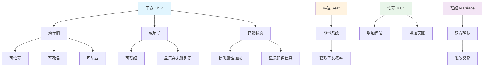

---

## 配表文件列表

| 配表名称 | 文件路径 | 说明 |
|---------|---------|------|
| ChildRefObj | game_server/GameRes/src/NPGameRes/Refs/Child/ChildRefObj.java | 子女基础配置 |
| ChildTrainRefObj | game_server/GameRes/src/NPGameRes/Refs/Child/ChildTrainRefObj.java | 培养配置 |
| ChildSeatRefObj | game_server/GameRes/src/NPGameRes/Refs/Child/ChildSeatRefObj.java | 座位配置 |
| ChildMarriageRefObj | game_server/GameRes/src/NPGameRes/Refs/Child/ChildMarriageRefObj.java | 联姻配置 |
| ChildLevelRefObj | game_server/GameRes/src/NPGameRes/Refs/Child/ChildLevelRefObj.java | 等级配置 |
| ChildTalentRefObj | game_server/GameRes/src/NPGameRes/Refs/Child/ChildTalentRefObj.java | 天赋配置 |

---

## 配表关系图

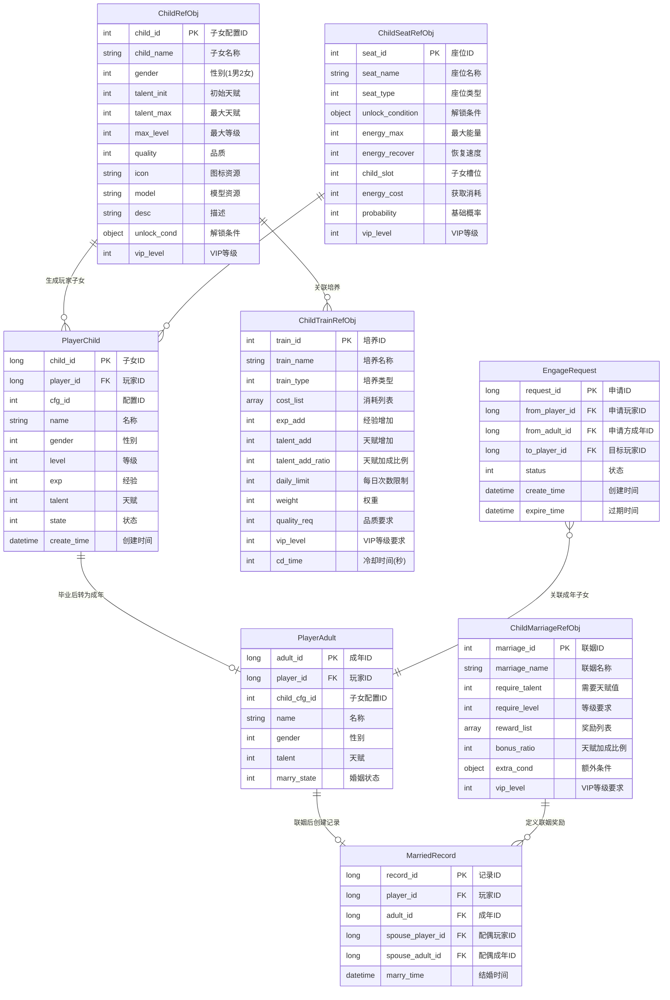

---

## 配表依赖关系图

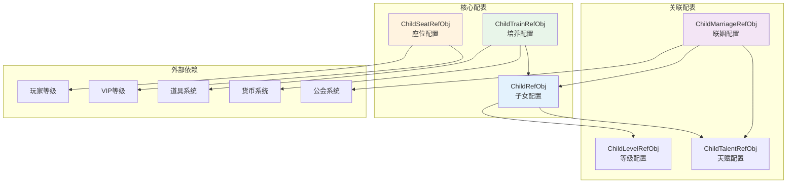

---

## 一、子女基础配置 (ChildRefObj)

**配表名**: `child_ref`

### 完整字段列表

| 字段名 | 类型 | 必填 | 默认值 | 说明 | 约束条件 |
|--------|------|------|--------|------|----------|
| child_id | int | 是 | - | 子女配置ID，唯一标识 | 唯一，> 0 |
| child_name | string | 是 | - | 子女名称 | 1-32字符 |
| gender | int | 是 | - | 性别：1男 2女 | 范围 1-2 |
| talent_init | int | 是 | 50 | 初始天赋值 | 范围 1-100 |
| talent_max | int | 是 | 100 | 最大天赋值 | 范围 1-100 |
| max_level | int | 是 | 10 | 最大等级 | 范围 1-100 |
| quality | int | 否 | 1 | 品质 | 范围 1-5 |
| icon | string | 否 | "" | 图标资源路径 | 有效资源路径 |
| model | string | 否 | "" | 模型资源路径 | 有效资源路径 |
| desc | string | 否 | "" | 描述文本 | 1-200字符 |
| unlock_cond | object | 否 | {} | 解锁条件 | 条件对象格式 |
| vip_level | int | 否 | 0 | 所需VIP等级 | 范围 0-100 |

### 字段详细说明

#### unlock_cond 结构

```json
{
    "condType": 1,      // 条件类型 (1:玩家等级, 2:主线进度, 3:VIP等级, 4:累计充值)
    "condValue": 20     // 条件值
}
```

#### 解锁条件类型枚举

| 类型值 | 说明 | 使用场景 |
|--------|------|----------|
| 1 | 玩家等级 | 达到指定等级解锁 |
| 2 | 主线进度 | 完成指定主线任务 |
| 3 | VIP等级 | 达到指定VIP等级 |
| 4 | 累计充值 | 累计充值达到金额 |
| 5 | 活动时间 | 活动期间限时解锁 |

### 子女性别枚举 (ENPChildGender)

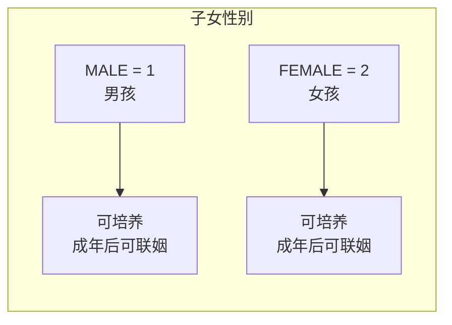

| 枚举值 | 数值 | 说明 | 图标前缀 | 模型前缀 |
|--------|------|------|----------|----------|
| MALE | 1 | 男孩 | boy_ | m_ |
| FEMALE | 2 | 女孩 | girl_ | f_ |

```csharp
/// <summary>
/// 子女性别枚举
/// </summary>
public enum ENPChildGender
{
    /// <summary>男孩</summary>
    MALE = 1,

    /// <summary>女孩</summary>
    FEMALE = 2,
}
```

### 子女品质枚举 (ENPChildQuality)

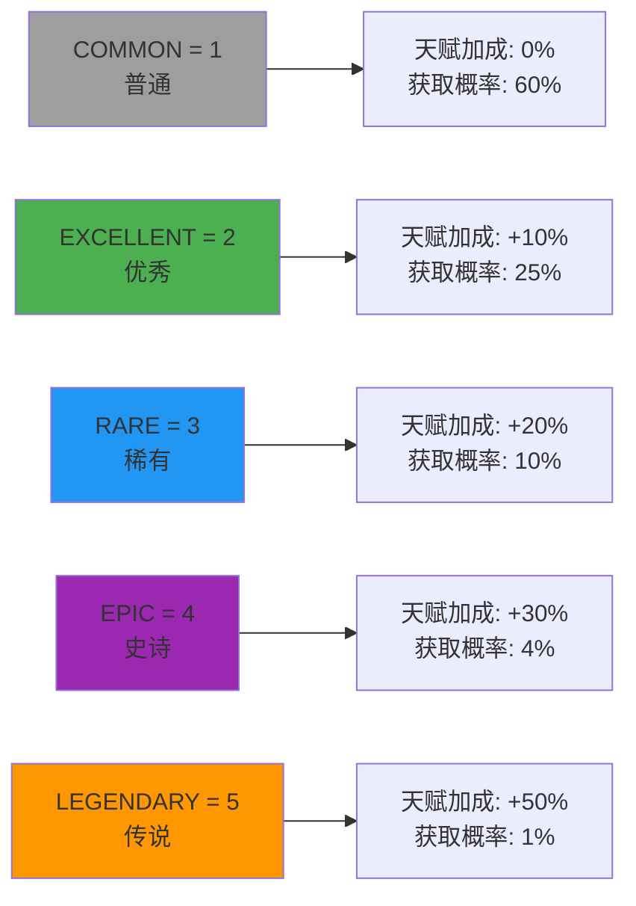

| 枚举值 | 数值 | 说明 | 天赋加成 | 获取概率 | 颜色代码 |
|--------|------|------|----------|----------|----------|
| COMMON | 1 | 普通 | 0% | 60% | #9e9e9e |
| EXCELLENT | 2 | 优秀 | +10% | 25% | #4caf50 |
| RARE | 3 | 稀有 | +20% | 10% | #2196f3 |
| EPIC | 4 | 史诗 | +30% | 4% | #9c27b0 |
| LEGENDARY | 5 | 传说 | +50% | 1% | #ff9800 |

```csharp
/// <summary>
/// 子女品质枚举
/// </summary>
public enum ENPChildQuality
{
    /// <summary>普通</summary>
    COMMON = 1,

    /// <summary>优秀</summary>
    EXCELLENT = 2,

    /// <summary>稀有</summary>
    RARE = 3,

    /// <summary>史诗</summary>
    EPIC = 4,

    /// <summary>传说</summary>
    LEGENDARY = 5,
}
```

### 子女状态枚举 (EChildState)

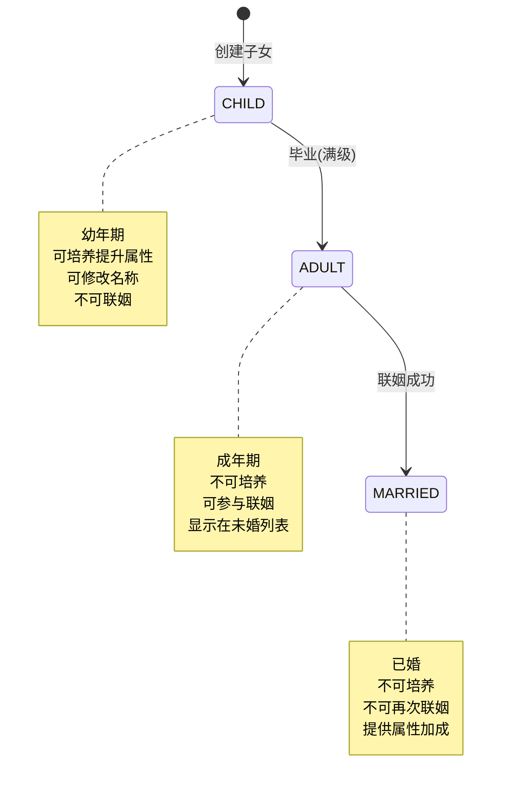

| 状态值 | 枚举名 | 说明 | 可执行操作 |
|--------|--------|------|------------|
| 1 | CHILD | 幼年期 | 培养、改名、毕业 |
| 2 | ADULT | 成年期 | 联姻、查看 |
| 3 | MARRIED | 已婚 | 查看配偶信息 |

```csharp
/// <summary>
/// 子女状态枚举
/// </summary>
public enum EChildState
{
    /// <summary>幼年期</summary>
    CHILD = 1,

    /// <summary>成年期</summary>
    ADULT = 2,

    /// <summary>已婚</summary>
    MARRIED = 3,
}
```

### 配置示例

```json
{
    "child_id": 10001,
    "child_name": "聪慧男孩",
    "gender": 1,
    "talent_init": 50,
    "talent_max": 100,
    "max_level": 10,
    "quality": 3,
    "icon": "child/boy_001",
    "model": "model/child/boy_001",
    "desc": "天资聪颖的小男孩，培养潜力巨大",
    "unlock_cond": {
        "condType": 1,
        "condValue": 20
    },
    "vip_level": 0
}
```

```json
{
    "child_id": 10002,
    "child_name": "伶俐女孩",
    "gender": 2,
    "talent_init": 60,
    "talent_max": 100,
    "max_level": 10,
    "quality": 4,
    "icon": "child/girl_001",
    "model": "model/child/girl_001",
    "desc": "聪明伶俐的小女孩，天赋异禀",
    "unlock_cond": {},
    "vip_level": 5
}
```

### 配置示例（多品质完整列表）

```json
[
    {
        "child_id": 10001,
        "child_name": "普通男孩",
        "gender": 1,
        "talent_init": 30,
        "talent_max": 60,
        "max_level": 10,
        "quality": 1,
        "icon": "child/boy_common",
        "model": "model/child/boy_common",
        "desc": "一个普通的男孩",
        "unlock_cond": {},
        "vip_level": 0
    },
    {
        "child_id": 10002,
        "child_name": "优秀男孩",
        "gender": 1,
        "talent_init": 45,
        "talent_max": 75,
        "max_level": 10,
        "quality": 2,
        "icon": "child/boy_excellent",
        "model": "model/child/boy_excellent",
        "desc": "资质优秀的男孩",
        "unlock_cond": {"condType": 1, "condValue": 10},
        "vip_level": 0
    },
    {
        "child_id": 10003,
        "child_name": "稀有男孩",
        "gender": 1,
        "talent_init": 55,
        "talent_max": 85,
        "max_level": 10,
        "quality": 3,
        "icon": "child/boy_rare",
        "model": "model/child/boy_rare",
        "desc": "天资聪颖的男孩",
        "unlock_cond": {"condType": 1, "condValue": 20},
        "vip_level": 3
    },
    {
        "child_id": 10004,
        "child_name": "史诗男孩",
        "gender": 1,
        "talent_init": 70,
        "talent_max": 95,
        "max_level": 10,
        "quality": 4,
        "icon": "child/boy_epic",
        "model": "model/child/boy_epic",
        "desc": "天赋异禀的男孩",
        "unlock_cond": {"condType": 3, "condValue": 5},
        "vip_level": 8
    },
    {
        "child_id": 10005,
        "child_name": "传说男孩",
        "gender": 1,
        "talent_init": 85,
        "talent_max": 100,
        "max_level": 10,
        "quality": 5,
        "icon": "child/boy_legendary",
        "model": "model/child/boy_legendary",
        "desc": "天生奇才，前途不可限量",
        "unlock_cond": {"condType": 3, "condValue": 12},
        "vip_level": 15
    }
]
```

### 代码示例

```java
// 服务端获取子女配置
ChildRefObj childRef = ChildRefObj.getMgr().get(childId);
if (childRef == null) {
    return CommErr.REF_NOT_FOUND;
}

// 获取基础属性
int maxLevel = childRef.max_level;
int initTalent = childRef.talent_init;
int quality = childRef.quality;

// 检查解锁条件
if (childRef.unlock_cond != null && !childRef.unlock_cond.isEmpty()) {
    boolean unlocked = childRef.unlock_cond.IsEnable(playerData);
    if (!unlocked) {
        return ChildErr.CHILD_NOT_UNLOCKED;
    }
}

// 检查VIP等级
if (playerInfo.vipLevel < childRef.vip_level) {
    return ChildErr.VIP_LEVEL_NOT_ENOUGH;
}

// 计算实际初始天赋（加入品质加成）
int actualInitTalent = initTalent;
switch (childRef.quality) {
    case 2: actualInitTalent = (int)(initTalent * 1.1); break;
    case 3: actualInitTalent = (int)(initTalent * 1.2); break;
    case 4: actualInitTalent = (int)(initTalent * 1.3); break;
    case 5: actualInitTalent = (int)(initTalent * 1.5); break;
}
```

```csharp
// 客户端获取子女配置
ChildRefObj childRef = GRefdataCoreMgr.instance.childRefCore.getRef(childId);
if (childRef == null)
{
    Debug.LogError($"子女配置不存在: {childId}");
    return;
}

// 获取显示信息
string childName = childRef.child_name;
string iconPath = childRef.icon;
int quality = childRef.quality;

// 获取品质颜色
Color qualityColor = GetQualityColor(quality);

// 检查是否可解锁
bool canUnlock = CheckUnlockCondition(childRef.unlock_cond);

// 获取品质颜色
private Color GetQualityColor(int quality)
{
    switch (quality)
    {
        case 1: return new Color(0.62f, 0.62f, 0.62f); // 灰色
        case 2: return new Color(0.30f, 0.69f, 0.31f); // 绿色
        case 3: return new Color(0.13f, 0.59f, 0.95f); // 蓝色
        case 4: return new Color(0.61f, 0.15f, 0.69f); // 紫色
        case 5: return new Color(1.00f, 0.60f, 0.00f); // 橙色
        default: return Color.white;
    }
}
```

---

## 二、培养配置 (ChildTrainRefObj)

**配表名**: `child_train_ref`

### 完整字段列表

| 字段名 | 类型 | 必填 | 默认值 | 说明 | 约束条件 |
|--------|------|------|--------|------|----------|
| train_id | int | 是 | - | 培养配置ID | 唯一，> 0 |
| train_name | string | 是 | - | 培养名称 | 1-32字符 |
| train_type | int | 是 | 1 | 培养类型 | 范围 1-5 |
| cost_list | array | 是 | - | 消耗列表 | 非空数组 |
| exp_add | int | 是 | 0 | 经验增加值 | >= 0 |
| talent_add | int | 是 | 0 | 天赋增加值 | >= 0 |
| talent_add_ratio | int | 否 | 0 | 天赋增加比例(万分比) | 0-10000 |
| daily_limit | int | 否 | 0 | 每日次数限制(0不限) | 0-100 |
| weight | int | 否 | 100 | 权重 | 1-10000 |
| quality_req | int | 否 | 0 | 品质要求 | 0-5 |
| vip_level | int | 否 | 0 | VIP等级要求 | 0-100 |
| cd_time | int | 否 | 0 | 冷却时间(秒) | 0-86400 |

### 字段详细说明

#### cost_list 结构

```json
[
    {
        "item": {
            "itemType": 2,      // 物品类型 (1:普通道具, 2:货币, 3:装备)
            "itemId": 0         // 物品ID (货币类型时itemId为0)
        },
        "count": 1000           // 数量
    }
]
```

#### 物品类型枚举 (ENPItemType)

| 类型值 | 说明 | 典型用途 |
|--------|------|----------|
| 1 | 普通道具 | 培养丹、经验书 |
| 2 | 货币 | 银两、钻石 |
| 3 | 装备 | 装备道具 |
| 4 | 材料 | 升级材料 |

### 培养类型枚举 (ENPTrainType)

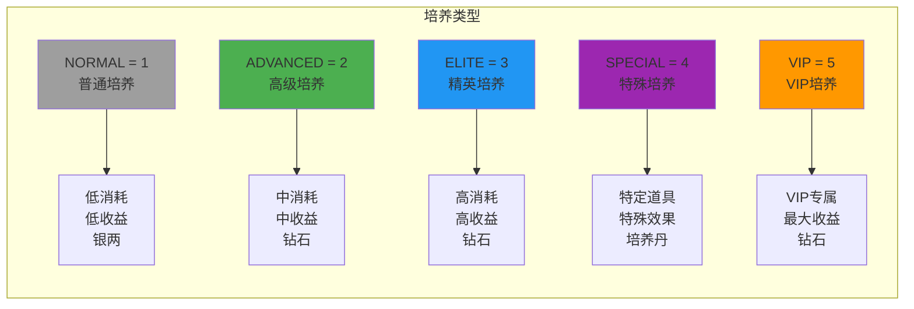

| 枚举值 | 数值 | 说明 | 典型消耗 | 经验 | 天赋 | 每日限制 |
|--------|------|------|----------|------|------|----------|
| NORMAL | 1 | 普通培养 | 银两 x 1000 | +50 | +2 | 5次 |
| ADVANCED | 2 | 高级培养 | 钻石 x 50 | +100 | +5 | 3次 |
| ELITE | 3 | 精英培养 | 钻石 x 200 | +200 | +10 | 2次 |
| SPECIAL | 4 | 特殊培养 | 培养丹 x 1 | +500 | +20 | 1次 |
| VIP | 5 | VIP培养 | 钻石 x 500 | +300 | +15 | 无限制 |

```csharp
/// <summary>
/// 培养类型枚举
/// </summary>
public enum ENPTrainType
{
    /// <summary>普通培养</summary>
    NORMAL = 1,

    /// <summary>高级培养</summary>
    ADVANCED = 2,

    /// <summary>精英培养</summary>
    ELITE = 3,

    /// <summary>特殊培养</summary>
    SPECIAL = 4,

    /// <summary>VIP培养</summary>
    VIP = 5,
}
```

### 培养消耗数据结构

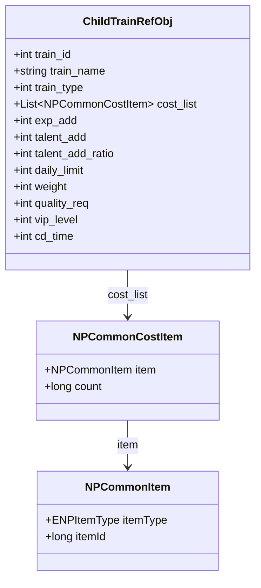

### 配置示例

```json
{
    "train_id": 1,
    "train_name": "普通培养",
    "train_type": 1,
    "cost_list": [
        {
            "item": {"itemType": 2, "itemId": 0},
            "count": 1000
        }
    ],
    "exp_add": 50,
    "talent_add": 2,
    "talent_add_ratio": 0,
    "daily_limit": 5,
    "weight": 100,
    "quality_req": 0,
    "vip_level": 0,
    "cd_time": 0
}
```

```json
{
    "train_id": 3,
    "train_name": "精英培养",
    "train_type": 3,
    "cost_list": [
        {
            "item": {"itemType": 2, "itemId": 0},
            "count": 200
        }
    ],
    "exp_add": 200,
    "talent_add": 10,
    "talent_add_ratio": 500,
    "daily_limit": 2,
    "weight": 50,
    "quality_req": 3,
    "vip_level": 0,
    "cd_time": 3600
}
```

```json
{
    "train_id": 5,
    "train_name": "VIP培养",
    "train_type": 5,
    "cost_list": [
        {
            "item": {"itemType": 2, "itemId": 0},
            "count": 500
        }
    ],
    "exp_add": 300,
    "talent_add": 15,
    "talent_add_ratio": 1000,
    "daily_limit": 0,
    "weight": 30,
    "quality_req": 0,
    "vip_level": 10,
    "cd_time": 0
}
```

### 代码示例

```java
/**
 * 执行培养逻辑
 */
public TrainResult trainChild(long playerId, long childId, int trainType) {
    TrainResult result = new TrainResult();

    // 1. 获取培养配置
    ChildTrainRefObj trainRef = ChildTrainRefObj.getMgr().get(trainType);
    if (trainRef == null) {
        result.setError(CommErr.REF_NOT_FOUND, "培养配置不存在");
        return result;
    }

    // 2. 获取子女信息
    PlayerChild child = childDao.selectById(childId);
    if (child == null || child.getPlayerId() != playerId) {
        result.setError(ChildErr.CHILD_NOT_FOUND, "子女不存在");
        return result;
    }

    // 3. 检查子女状态
    if (child.getState() != EChildState.CHILD.getValue()) {
        result.setError(ChildErr.CHILD_ALREADY_ADULT, "子女已成年，无法培养");
        return result;
    }

    // 4. 检查品质要求
    ChildRefObj childRef = ChildRefObj.getMgr().get(child.getCfgId());
    if (trainRef.quality_req > 0 && childRef.quality < trainRef.quality_req) {
        result.setError(ChildErr.QUALITY_NOT_ENOUGH, "子女品质不足");
        return result;
    }

    // 5. 检查VIP等级
    if (playerInfo.vipLevel < trainRef.vip_level) {
        result.setError(ChildErr.VIP_LEVEL_NOT_ENOUGH, "VIP等级不足");
        return result;
    }

    // 6. 检查每日次数
    int todayCount = getChildTodayTrainCount(playerId, childId, trainType);
    if (trainRef.daily_limit > 0 && todayCount >= trainRef.daily_limit) {
        result.setError(ChildErr.TRAIN_LIMIT_EXCEEDED, "今日培养次数已用完");
        return result;
    }

    // 7. 检查并扣除消耗
    if (!itemService.checkAndConsume(playerId, trainRef.cost_list, "子女培养")) {
        result.setError(CommErr.ITEM_NOT_ENOUGH, "道具不足");
        return result;
    }

    // 8. 增加经验和天赋
    int expAdd = trainRef.exp_add;
    int talentAdd = trainRef.talent_add;

    // 天赋加成比例计算
    if (trainRef.talent_add_ratio > 0) {
        talentAdd += child.getTalent() * trainRef.talent_add_ratio / 10000;
    }

    child.setExp(child.getExp() + expAdd);
    child.setTalent(Math.min(child.getTalent() + talentAdd, childRef.talent_max));

    // 9. 检查升级
    checkLevelUp(child, childRef);

    // 10. 更新数据
    childDao.updateById(child);
    updateTodayTrainCount(playerId, childId, trainType);

    // 11. 返回结果
    result.setSuccess(child.getLevel(), child.getExp(), child.getTalent());
    return result;
}
```

---

## 三、座位配置 (ChildSeatRefObj)

**配表名**: `child_seat_ref`

### 完整字段列表

| 字段名 | 类型 | 必填 | 默认值 | 说明 | 约束条件 |
|--------|------|------|--------|------|----------|
| seat_id | int | 是 | - | 座位ID | 唯一，> 0 |
| seat_name | string | 是 | - | 座位名称 | 1-32字符 |
| seat_type | int | 是 | 1 | 座位类型 | 范围 1-5 |
| unlock_condition | object | 否 | {} | 解锁条件 | 条件对象格式 |
| energy_max | int | 是 | 100 | 最大能量值 | 1-10000 |
| energy_recover | int | 否 | 10 | 每小时恢复量 | 0-1000 |
| child_slot | int | 是 | 1 | 子女槽位数 | 1-10 |
| energy_cost | int | 是 | 50 | 获取子女消耗 | 1-1000 |
| probability | int | 否 | 10000 | 基础概率(万分比) | 1-10000 |
| vip_level | int | 否 | 0 | 所需VIP等级 | 0-100 |

### 字段详细说明

#### unlock_condition 结构

```json
{
    "condType": 1,      // 条件类型
    "condValue": 10     // 条件值
}
```

### 座位类型枚举 (ENPSeatType)

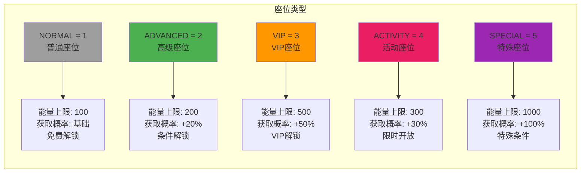

| 枚举值 | 数值 | 说明 | 能量上限 | 获取概率 | 解锁方式 |
|--------|------|------|----------|----------|----------|
| NORMAL | 1 | 普通座位 | 100 | 基础 | 免费 |
| ADVANCED | 2 | 高级座位 | 200 | +20% | 玩家等级 |
| VIP | 3 | VIP座位 | 500 | +50% | VIP等级 |
| ACTIVITY | 4 | 活动座位 | 300 | +30% | 活动期间 |
| SPECIAL | 5 | 特殊座位 | 1000 | +100% | 特殊条件 |

```csharp
/// <summary>
/// 座位类型枚举
/// </summary>
public enum ENPSeatType
{
    /// <summary>普通座位</summary>
    NORMAL = 1,

    /// <summary>高级座位</summary>
    ADVANCED = 2,

    /// <summary>VIP座位</summary>
    VIP = 3,

    /// <summary>活动座位</summary>
    ACTIVITY = 4,

    /// <summary>特殊座位</summary>
    SPECIAL = 5,
}
```

### 座位解锁流程

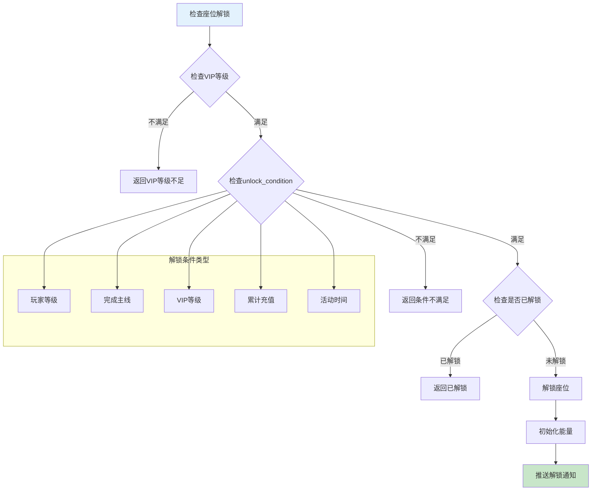

### 配置示例

```json
{
    "seat_id": 1,
    "seat_name": "普通摇篮",
    "seat_type": 1,
    "unlock_condition": {
        "condType": 1,
        "condValue": 10
    },
    "energy_max": 100,
    "energy_recover": 10,
    "child_slot": 1,
    "energy_cost": 50,
    "probability": 10000,
    "vip_level": 0
}
```

```json
{
    "seat_id": 3,
    "seat_name": "VIP黄金摇篮",
    "seat_type": 3,
    "unlock_condition": {},
    "energy_max": 500,
    "energy_recover": 50,
    "child_slot": 3,
    "energy_cost": 100,
    "probability": 15000,
    "vip_level": 10
}
```

### 代码示例

```java
/**
 * 随机获取子女
 */
public RandomChildResult randomGainChild(long playerId, int seatId) {
    RandomChildResult result = new RandomChildResult();

    // 1. 获取座位配置
    ChildSeatRefObj seatRef = ChildSeatRefObj.getMgr().get(seatId);
    if (seatRef == null) {
        result.setError(CommErr.REF_NOT_FOUND, "座位配置不存在");
        return result;
    }

    // 2. 检查座位是否解锁
    PlayerSeat seat = seatDao.getByPlayerAndSeat(playerId, seatId);
    if (seat == null) {
        result.setError(ChildErr.SEAT_NOT_UNLOCKED, "座位未解锁");
        return result;
    }

    // 3. 检查能量是否足够
    if (seat.getEnergy() < seatRef.energy_cost) {
        result.setError(ChildErr.ENERGY_NOT_ENOUGH, "能量不足");
        return result;
    }

    // 4. 检查子女槽位
    int childCount = childDao.countByPlayer(playerId);
    if (childCount >= seatRef.child_slot) {
        result.setError(ChildErr.CHILD_SLOT_FULL, "子女槽位已满");
        return result;
    }

    // 5. 扣除能量
    seat.setEnergy(seat.getEnergy() - seatRef.energy_cost);
    seatDao.updateById(seat);

    // 6. 随机选择子女配置（根据概率权重）
    ChildRefObj childRef = randomSelectChild(seatRef.probability);

    // 7. 创建子女
    PlayerChild child = createChild(playerId, childRef);
    childDao.insert(child);

    // 8. 推送通知
    pushChildAdd(playerId, child);
    pushSeatChg(playerId, seat);

    result.setSuccess(child);
    return result;
}

/**
 * 根据概率随机选择子女配置
 */
private ChildRefObj randomSelectChild(int baseProbability) {
    List<ChildRefObj> allChildRefs = ChildRefObj.getMgr().getAll();
    List<Pair<ChildRefObj, Integer>> weightedList = new ArrayList<>();

    // 计算权重
    int totalWeight = 0;
    for (ChildRefObj ref : allChildRefs) {
        // 权重 = 基础权重 * 品质权重 * (基础概率加成)
        int weight = ref.weight * getQualityWeight(ref.quality);
        weight = weight * baseProbability / 10000;
        weightedList.add(new Pair<>(ref, weight));
        totalWeight += weight;
    }

    // 随机选择
    int random = ThreadLocalRandom.current().nextInt(totalWeight);
    int currentSum = 0;
    for (Pair<ChildRefObj, Integer> pair : weightedList) {
        currentSum += pair.getSecond();
        if (random < currentSum) {
            return pair.getFirst();
        }
    }

    return weightedList.get(0).getFirst();
}
```

---

## 四、联姻配置 (ChildMarriageRefObj)

**配表名**: `child_marriage_ref`

### 完整字段列表

| 字段名 | 类型 | 必填 | 默认值 | 说明 | 约束条件 |
|--------|------|------|--------|------|----------|
| marriage_id | int | 是 | - | 联姻配置ID | 唯一，> 0 |
| marriage_name | string | 是 | - | 联姻名称 | 1-32字符 |
| require_talent | int | 是 | 0 | 需要天赋值 | 0-100 |
| require_level | int | 否 | 0 | 需要等级 | 0-100 |
| reward_list | array | 是 | - | 联姻奖励列表 | 非空数组 |
| bonus_ratio | int | 否 | 0 | 天赋加成比例(万分比) | 0-10000 |
| extra_cond | object | 否 | {} | 额外条件 | 条件对象格式 |
| vip_level | int | 否 | 0 | VIP等级要求 | 0-100 |

### 联姻奖励计算公式

```
基础奖励 = 配置奖励
天赋加成奖励 = 基础奖励 × (天赋_男方 + 天赋_女方) × bonus_ratio / 10000
最终奖励 = 基础奖励 + 天赋加成奖励
```

**示例计算**:
```
基础奖励: 银两 × 1000
男方天赋: 80
女方天赋: 70
bonus_ratio = 100 (1%)

天赋加成奖励 = 1000 × (80 + 70) × 100 / 10000 = 1500
最终奖励 = 1000 + 1500 = 2500 银两
```

### 联姻流程图

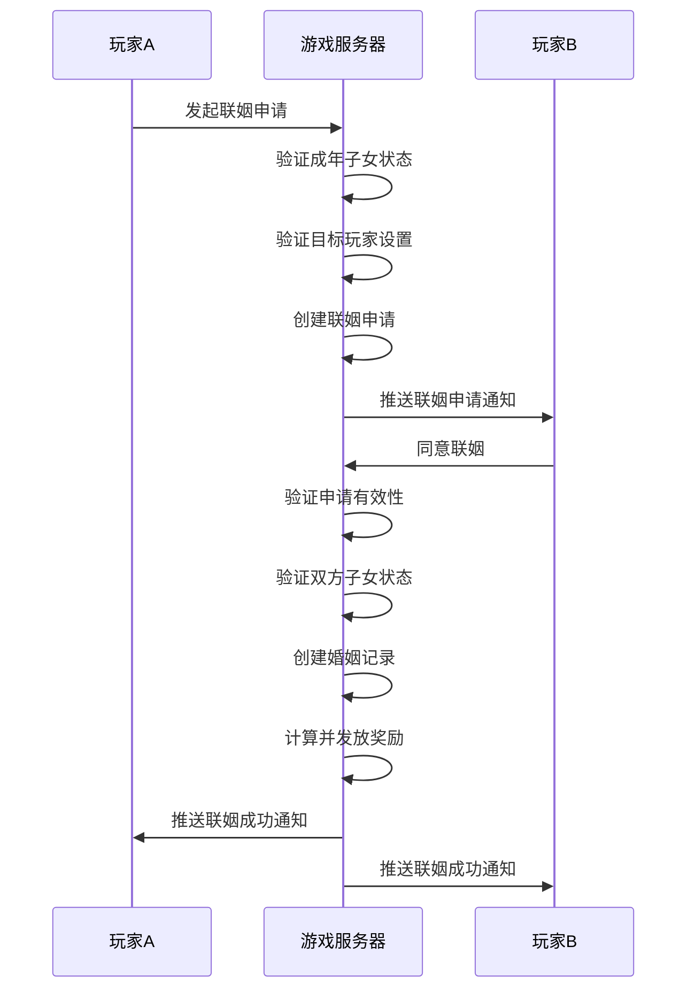

### 配置示例

```json
{
    "marriage_id": 1,
    "marriage_name": "普通联姻",
    "require_talent": 50,
    "require_level": 0,
    "reward_list": [
        {
            "item": {"itemType": 2, "itemId": 0},
            "count": 1000
        },
        {
            "item": {"itemType": 1, "itemId": 50001},
            "count": 10
        }
    ],
    "bonus_ratio": 100,
    "extra_cond": {},
    "vip_level": 0
}
```

```json
{
    "marriage_id": 2,
    "marriage_name": "豪门联姻",
    "require_talent": 80,
    "require_level": 50,
    "reward_list": [
        {
            "item": {"itemType": 2, "itemId": 0},
            "count": 5000
        },
        {
            "item": {"itemType": 1, "itemId": 50002},
            "count": 20
        }
    ],
    "bonus_ratio": 200,
    "extra_cond": {
        "condType": 6,
        "condValue": 1
    },
    "vip_level": 5
}
```

---

## 五、等级配置 (ChildLevelRefObj)

**配表名**: `child_level_ref`

### 完整字段列表

| 字段名 | 类型 | 必填 | 默认值 | 说明 | 约束条件 |
|--------|------|------|--------|------|----------|
| level | int | 是 | - | 等级 | 1-100 |
| need_exp | int | 是 | - | 升级所需经验 | >= 0 |
| exp_grow_type | int | 否 | 1 | 经验成长类型 | 1-3 |
| exp_grow_param | float | 否 | 1.0 | 成长参数 | > 0 |
| talent_limit | int | 否 | 0 | 天赋上限 | 0-100 |
| attribute_bonus | object | 否 | {} | 属性加成 | 加成对象 |

### 经验成长类型枚举

| 类型值 | 说明 | 公式 | 示例 (base=100) |
|--------|------|------|-----------------|
| 1 | 线性成长 | need_exp × level | 100 × 5 = 500 |
| 2 | 指数成长 | need_exp × param^level | 100 × 1.2^5 ≈ 249 |
| 3 | 自定义 | 按配置表指定 | 由配表决定 |

### 等级经验计算流程

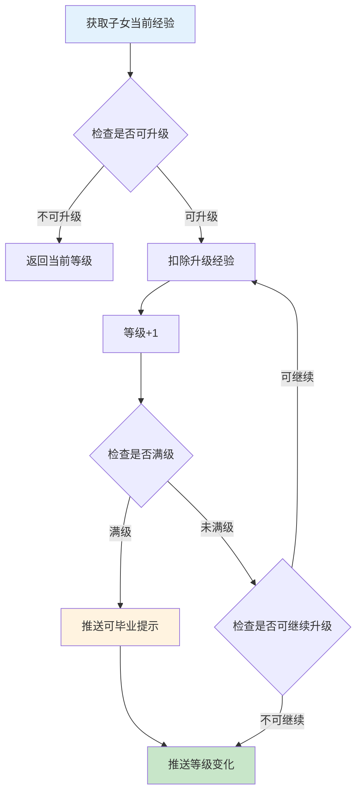

### 配置示例

```json
[
    {
        "level": 1,
        "need_exp": 100,
        "exp_grow_type": 2,
        "exp_grow_param": 1.2,
        "talent_limit": 20,
        "attribute_bonus": {
            "attack": 10,
            "defense": 5
        }
    },
    {
        "level": 2,
        "need_exp": 120,
        "exp_grow_type": 2,
        "exp_grow_param": 1.2,
        "talent_limit": 30,
        "attribute_bonus": {
            "attack": 15,
            "defense": 8
        }
    },
    {
        "level": 3,
        "need_exp": 144,
        "exp_grow_type": 2,
        "exp_grow_param": 1.2,
        "talent_limit": 40,
        "attribute_bonus": {
            "attack": 20,
            "defense": 10
        }
    }
]
```

---

## 六、天赋配置 (ChildTalentRefObj)

**配表名**: `child_talent_ref`

### 完整字段列表

| 字段名 | 类型 | 必填 | 默认值 | 说明 | 约束条件 |
|--------|------|------|--------|------|----------|
| talent_level | int | 是 | - | 天赋等级 | 1-100 |
| talent_min | int | 是 | - | 天赋下限 | 1-100 |
| talent_max | int | 是 | - | 天赋上限 | 1-100 |
| quality | int | 否 | 1 | 对应品质 | 1-5 |
| bonus_ratio | int | 否 | 10000 | 加成比例(万分比) | 1-10000 |
| desc | string | 否 | "" | 描述 | 1-200字符 |

### 天赋等级对照表

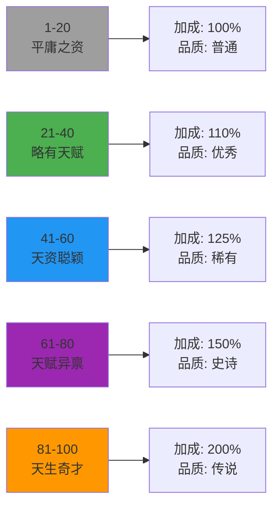

| 天赋值 | 等级 | 品质 | 描述 | 加成比例 |
|--------|------|------|------|----------|
| 1-20 | 1 | 普通 | 平庸之资 | 100% |
| 21-40 | 2 | 优秀 | 略有天赋 | 110% |
| 41-60 | 3 | 稀有 | 天资聪颖 | 125% |
| 61-80 | 4 | 史诗 | 天赋异禀 | 150% |
| 81-100 | 5 | 传说 | 天生奇才 | 200% |

### 配置示例

```json
[
    {
        "talent_level": 1,
        "talent_min": 1,
        "talent_max": 20,
        "quality": 1,
        "bonus_ratio": 10000,
        "desc": "平庸之资，需勤加培养"
    },
    {
        "talent_level": 2,
        "talent_min": 21,
        "talent_max": 40,
        "quality": 2,
        "bonus_ratio": 11000,
        "desc": "略有天赋，潜力可期"
    },
    {
        "talent_level": 3,
        "talent_min": 41,
        "talent_max": 60,
        "quality": 3,
        "bonus_ratio": 12500,
        "desc": "天资聪颖，未来可期"
    },
    {
        "talent_level": 4,
        "talent_min": 61,
        "talent_max": 80,
        "quality": 4,
        "bonus_ratio": 15000,
        "desc": "天赋异禀，人中龙凤"
    },
    {
        "talent_level": 5,
        "talent_min": 81,
        "talent_max": 100,
        "quality": 5,
        "bonus_ratio": 20000,
        "desc": "天生奇才，前途不可限量"
    }
]
```

---

## 数据库表结构

### player_child（玩家子女数据表）

```sql
CREATE TABLE IF NOT EXISTS `player_child` (
    `id` bigint(20) NOT NULL COMMENT '子女ID (主键)',
    `player_id` bigint(20) NOT NULL COMMENT '玩家ID',
    `cfg_id` int(11) NOT NULL COMMENT '配置ID',
    `name` varchar(64) NOT NULL DEFAULT '' COMMENT '名称',
    `gender` int(11) NOT NULL DEFAULT '1' COMMENT '性别 (1男 2女)',
    `level` int(11) NOT NULL DEFAULT '1' COMMENT '等级',
    `exp` int(11) NOT NULL DEFAULT '0' COMMENT '经验',
    `talent` int(11) NOT NULL DEFAULT '50' COMMENT '天赋',
    `state` int(11) NOT NULL DEFAULT '1' COMMENT '状态 (1幼年 2成年 3已婚)',
    `create_time` datetime DEFAULT CURRENT_TIMESTAMP COMMENT '创建时间',
    `update_time` datetime DEFAULT CURRENT_TIMESTAMP ON UPDATE CURRENT_TIMESTAMP COMMENT '更新时间',
    PRIMARY KEY (`id`),
    KEY `idx_player_id` (`player_id`),
    KEY `idx_state` (`state`),
    KEY `idx_player_state` (`player_id`, `state`)
) COMMENT='玩家子女数据' engine=InnoDB DEFAULT CHARSET=utf8mb4;
```

### player_adult（玩家成年子女数据表）

```sql
CREATE TABLE IF NOT EXISTS `player_adult` (
    `id` bigint(20) NOT NULL COMMENT '成年ID (主键)',
    `player_id` bigint(20) NOT NULL COMMENT '玩家ID',
    `child_cfg_id` int(11) NOT NULL COMMENT '原子女配置ID',
    `name` varchar(64) NOT NULL DEFAULT '' COMMENT '名称',
    `gender` int(11) NOT NULL DEFAULT '1' COMMENT '性别',
    `talent` int(11) NOT NULL DEFAULT '50' COMMENT '天赋',
    `marry_state` int(11) NOT NULL DEFAULT '0' COMMENT '婚姻状态 (0未婚 1联姻中 2已婚)',
    `spouse_player_id` bigint(20) DEFAULT NULL COMMENT '配偶玩家ID',
    `spouse_adult_id` bigint(20) DEFAULT NULL COMMENT '配偶成年ID',
    `marry_time` datetime DEFAULT NULL COMMENT '结婚时间',
    `create_time` datetime DEFAULT CURRENT_TIMESTAMP COMMENT '创建时间',
    `update_time` datetime DEFAULT CURRENT_TIMESTAMP ON UPDATE CURRENT_TIMESTAMP COMMENT '更新时间',
    PRIMARY KEY (`id`),
    KEY `idx_player_id` (`player_id`),
    KEY `idx_marry_state` (`marry_state`),
    KEY `idx_player_marry` (`player_id`, `marry_state`)
) COMMENT='玩家成年子女数据' engine=InnoDB DEFAULT CHARSET=utf8mb4;
```

### engage_request（联姻申请表）

```sql
CREATE TABLE IF NOT EXISTS `engage_request` (
    `id` bigint(20) NOT NULL COMMENT '申请ID (主键)',
    `from_player_id` bigint(20) NOT NULL COMMENT '申请玩家ID',
    `from_adult_id` bigint(20) NOT NULL COMMENT '申请方成年ID',
    `to_player_id` bigint(20) NOT NULL COMMENT '目标玩家ID',
    `to_adult_id` bigint(20) DEFAULT NULL COMMENT '目标成年ID（可选）',
    `status` int(11) NOT NULL DEFAULT '0' COMMENT '状态 (0待处理 1已同意 2已拒绝 3已过期 4已取消)',
    `create_time` datetime DEFAULT CURRENT_TIMESTAMP COMMENT '创建时间',
    `expire_time` datetime NOT NULL COMMENT '过期时间',
    PRIMARY KEY (`id`),
    KEY `idx_from_player` (`from_player_id`),
    KEY `idx_to_player` (`to_player_id`),
    KEY `idx_status` (`status`),
    KEY `idx_expire` (`expire_time`),
    KEY `idx_to_status` (`to_player_id`, `status`)
) COMMENT='联姻申请' engine=InnoDB DEFAULT CHARSET=utf8mb4;
```

### married_record（婚姻记录表）

```sql
CREATE TABLE IF NOT EXISTS `married_record` (
    `id` bigint(20) NOT NULL AUTO_INCREMENT COMMENT '记录ID (主键)',
    `player_id` bigint(20) NOT NULL COMMENT '玩家ID',
    `adult_id` bigint(20) NOT NULL COMMENT '成年ID',
    `spouse_player_id` bigint(20) NOT NULL COMMENT '配偶玩家ID',
    `spouse_adult_id` bigint(20) NOT NULL COMMENT '配偶成年ID',
    `marry_time` datetime NOT NULL COMMENT '结婚时间',
    `create_time` datetime DEFAULT CURRENT_TIMESTAMP COMMENT '创建时间',
    PRIMARY KEY (`id`),
    KEY `idx_player_id` (`player_id`),
    KEY `idx_adult_id` (`adult_id`),
    KEY `idx_spouse_player` (`spouse_player_id`),
    KEY `idx_spouse_adult` (`spouse_adult_id`)
) COMMENT='婚姻记录' engine=InnoDB DEFAULT CHARSET=utf8mb4;
```

### player_seat（玩家座位数据表）

```sql
CREATE TABLE IF NOT EXISTS `player_seat` (
    `id` bigint(20) NOT NULL AUTO_INCREMENT COMMENT '自增ID (主键)',
    `player_id` bigint(20) NOT NULL COMMENT '玩家ID',
    `seat_id` int(11) NOT NULL COMMENT '座位配置ID',
    `energy` int(11) NOT NULL DEFAULT '0' COMMENT '当前能量',
    `is_unlocked` tinyint(1) NOT NULL DEFAULT '0' COMMENT '是否已解锁',
    `unlock_time` datetime DEFAULT NULL COMMENT '解锁时间',
    `create_time` datetime DEFAULT CURRENT_TIMESTAMP COMMENT '创建时间',
    `update_time` datetime DEFAULT CURRENT_TIMESTAMP ON UPDATE CURRENT_TIMESTAMP COMMENT '更新时间',
    PRIMARY KEY (`id`),
    UNIQUE KEY `uk_player_seat` (`player_id`, `seat_id`),
    KEY `idx_player_id` (`player_id`)
) COMMENT='玩家座位数据' engine=InnoDB DEFAULT CHARSET=utf8mb4;
```

### 数据库表关系图

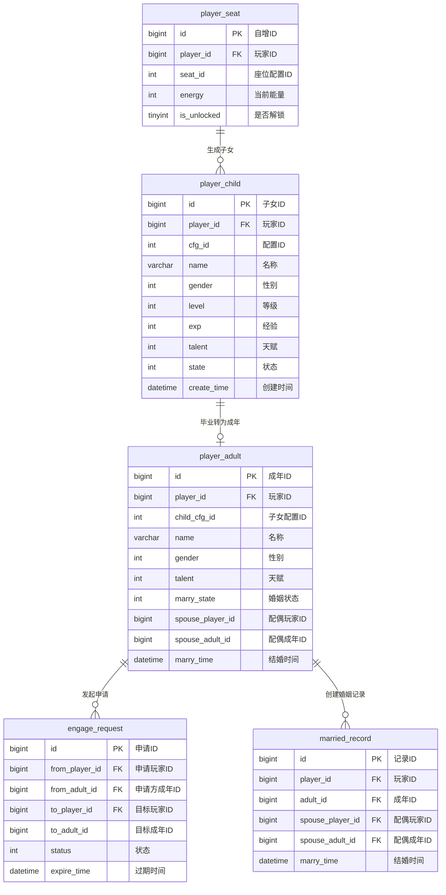

---

## 配表校验规则

### 子女配置校验

| 字段名 | 校验规则 | 异常处理 | 校验时机 |
|--------|----------|----------|----------|
| child_id | 必须唯一，范围 > 0 | 配表加载时去重 | 加载时 |
| gender | 范围 1-2 | 使用默认值1 | 加载时 |
| talent_init | 范围 1-100，<= talent_max | 使用默认值50 | 加载时 |
| talent_max | 范围 1-100，>= talent_init | 使用默认值100 | 加载时 |
| max_level | 范围 1-100 | 使用默认值10 | 加载时 |
| quality | 范围 1-5 | 使用默认值1 | 加载时 |
| icon | 资源路径存在性检查 | 加载警告 | 加载时 |

### 培养配置校验

| 字段名 | 校验规则 | 异常处理 | 校验时机 |
|--------|----------|----------|----------|
| train_id | 必须唯一 | 配表加载时去重 | 加载时 |
| train_type | 范围 1-5 | 使用默认值1 | 加载时 |
| cost_list | 必须非空，关联有效物品 | 加载时报错 | 加载时 |
| exp_add | 范围 >= 0 | 使用默认值0 | 加载时 |
| talent_add | 范围 >= 0 | 使用默认值0 | 加载时 |
| daily_limit | 范围 0-100 | 使用默认值0 | 加载时 |

### 座位配置校验

| 字段名 | 校验规则 | 异常处理 | 校验时机 |
|--------|----------|----------|----------|
| seat_id | 必须唯一 | 配表加载时去重 | 加载时 |
| seat_type | 范围 1-5 | 使用默认值1 | 加载时 |
| energy_max | 范围 1-10000 | 使用默认值100 | 加载时 |
| energy_cost | 范围 1-1000，<= energy_max | 使用默认值50 | 加载时 |
| child_slot | 范围 1-10 | 使用默认值1 | 加载时 |

### 配置校验流程

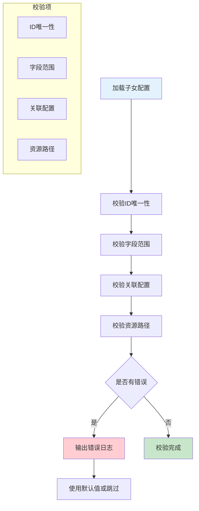

### 校验代码示例

```java
// 配表校验代码
public void validateChildConfig(List<ChildRefObj> childList) {
    Set<Integer> idSet = new HashSet<>();

    for (ChildRefObj child : childList) {
        // 检查ID唯一性
        if (idSet.contains(child.child_id)) {
            throw new ConfigException("子女ID重复: " + child.child_id);
        }
        idSet.add(child.child_id);

        // 检查性别范围
        if (child.gender < 1 || child.gender > 2) {
            log.warn("子女 {} 性别值异常 {}，使用默认值1", child.child_id, child.gender);
            child.gender = 1;
        }

        // 检查天赋范围
        if (child.talent_init > child.talent_max) {
            throw new ConfigException("子女 " + child.child_id + " 初始天赋大于最大天赋");
        }

        // 检查等级配置关联
        if (!ChildLevelRefObj.getMgr().hasLevel(child.max_level)) {
            throw new ConfigException("子女 " + child.child_id + " 引用了不存在的等级配置");
        }
    }
}
```

---

## 完整字段速查表

### ChildRefObj 完整字段

| 字段名 | 类型 | 必填 | 默认值 | 取值范围 | 说明 |
|--------|------|------|--------|----------|------|
| child_id | int | 是 | - | > 0 | 子女配置ID |
| child_name | string | 是 | - | 1-32字符 | 子女名称 |
| gender | int | 是 | - | 1-2 | 性别 |
| talent_init | int | 是 | 50 | 1-100 | 初始天赋 |
| talent_max | int | 是 | 100 | 1-100 | 最大天赋 |
| max_level | int | 是 | 10 | 1-100 | 最大等级 |
| quality | int | 否 | 1 | 1-5 | 品质 |
| icon | string | 否 | "" | 资源路径 | 图标 |
| model | string | 否 | "" | 资源路径 | 模型 |
| desc | string | 否 | "" | 1-200字符 | 描述 |
| unlock_cond | object | 否 | {} | 条件对象 | 解锁条件 |
| vip_level | int | 否 | 0 | 0-100 | VIP等级 |

### ChildTrainRefObj 完整字段

| 字段名 | 类型 | 必填 | 默认值 | 取值范围 | 说明 |
|--------|------|------|--------|----------|------|
| train_id | int | 是 | - | > 0 | 培养ID |
| train_name | string | 是 | - | 1-32字符 | 培养名称 |
| train_type | int | 是 | 1 | 1-5 | 培养类型 |
| cost_list | array | 是 | - | - | 消耗列表 |
| exp_add | int | 是 | 0 | >= 0 | 经验增加 |
| talent_add | int | 是 | 0 | >= 0 | 天赋增加 |
| talent_add_ratio | int | 否 | 0 | 0-10000 | 天赋加成比例 |
| daily_limit | int | 否 | 0 | 0-100 | 每日限制 |
| weight | int | 否 | 100 | 1-10000 | 权重 |
| quality_req | int | 否 | 0 | 0-5 | 品质要求 |
| vip_level | int | 否 | 0 | 0-100 | VIP要求 |
| cd_time | int | 否 | 0 | 0-86400 | 冷却时间 |

### ChildSeatRefObj 完整字段

| 字段名 | 类型 | 必填 | 默认值 | 取值范围 | 说明 |
|--------|------|------|--------|----------|------|
| seat_id | int | 是 | - | > 0 | 座位ID |
| seat_name | string | 是 | - | 1-32字符 | 座位名称 |
| seat_type | int | 是 | 1 | 1-5 | 座位类型 |
| unlock_condition | object | 否 | {} | 条件对象 | 解锁条件 |
| energy_max | int | 是 | 100 | 1-10000 | 最大能量 |
| energy_recover | int | 否 | 10 | 0-1000 | 恢复速度 |
| child_slot | int | 是 | 1 | 1-10 | 子女槽位 |
| energy_cost | int | 是 | 50 | 1-1000 | 获取消耗 |
| probability | int | 否 | 10000 | 1-10000 | 基础概率 |
| vip_level | int | 否 | 0 | 0-100 | VIP要求 |

### ChildMarriageRefObj 完整字段

| 字段名 | 类型 | 必填 | 默认值 | 取值范围 | 说明 |
|--------|------|------|--------|----------|------|
| marriage_id | int | 是 | - | > 0 | 联姻ID |
| marriage_name | string | 是 | - | 1-32字符 | 联姻名称 |
| require_talent | int | 是 | 0 | 0-100 | 需要天赋 |
| require_level | int | 否 | 0 | 0-100 | 需要等级 |
| reward_list | array | 是 | - | - | 奖励列表 |
| bonus_ratio | int | 否 | 0 | 0-10000 | 加成比例 |
| extra_cond | object | 否 | {} | 条件对象 | 额外条件 |
| vip_level | int | 否 | 0 | 0-100 | VIP要求 |

---

## 配置文件位置

```
game_server/GameRes/src/NPGameRes/Refs/Child/
├── ChildRefObj.java           # 子女配置
├── ChildTrainRefObj.java      # 培养配置
├── ChildSeatRefObj.java       # 座位配置
├── ChildMarriageRefObj.java   # 联姻配置
├── ChildLevelRefObj.java      # 等级配置
└── ChildTalentRefObj.java     # 天赋配置

game_server/DBTool/source_db/UserServer/
├── player_child.py            # 子女数据表定义
├── player_adult.py            # 成年数据表定义
├── engage_request.py          # 联姻申请表定义
├── married_record.py          # 婚姻记录表定义
└── player_seat.py             # 座位数据表定义

game_client/Assets/Scripts/ResScripts/NPSO/GSO/Child/
├── ChildRefObj.cs             # 子女配置对象
├── ChildTrainRefObj.cs        # 培养配置对象
├── ChildSeatRefObj.cs         # 座位配置对象
├── ChildMarriageRefObj.cs     # 联姻配置对象
├── ChildLevelRefObj.cs        # 等级配置对象
└── ChildTalentRefObj.cs       # 天赋配置对象
```

---

*文档生成时间: 2026-04-12*
*文档版本: v2.1.0*
