# 子女系统 - 数据配表文档

## 模块概述

**模块编号**: p014
**模块名称**: ChildOp (子女操作)
**主要功能**: 提供子女获取、培养、毕业、联姻等核心养成玩法功能

---

## 核心概念

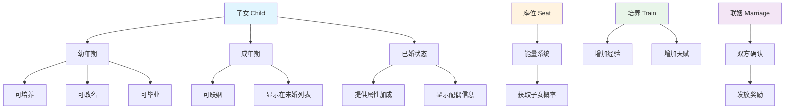

---

## 配表文件列表

| 配表名称 | 文件名 | 说明 |
|---------|--------|------|
| ChildRefObj | child_ref.json | 子女基础配置 |
| ChildTrainRefObj | child_train_ref.json | 培养配置 |
| ChildSeatRefObj | child_seat_ref.json | 座位配置 |
| ChildMarriageRefObj | child_marriage_ref.json | 联姻配置 |
| ChildLevelRefObj | child_level_ref.json | 等级配置 |
| ChildTalentRefObj | child_talent_ref.json | 天赋配置 |

---

## 配表依赖关系图

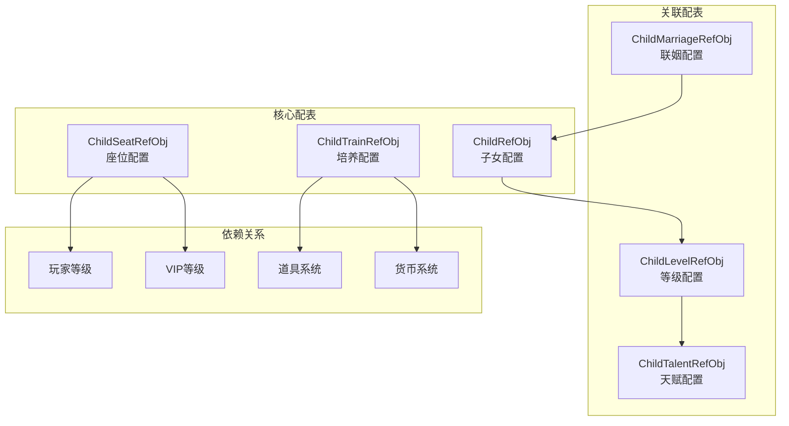

---

## 配表实体关系图

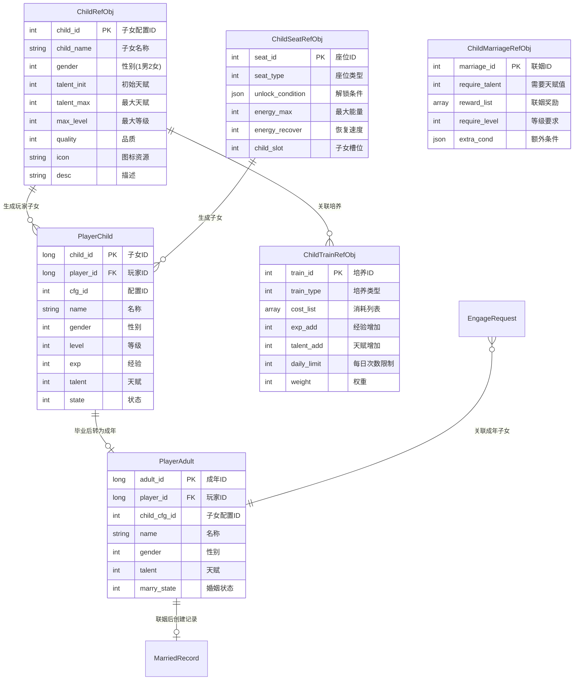

---

## 一、子女基础配置 (ChildRefObj)

**配表名**: `child_ref`

### 完整字段列表

| 字段名 | 类型 | 必填 | 默认值 | 取值范围 | 说明 |
|--------|------|------|--------|----------|------|
| child_id | int | 是 | - | > 0 | 子女配置ID，唯一标识 |
| child_name | string | 是 | - | 1-32字符 | 子女名称 |
| gender | int | 是 | - | 1-2 | 性别：1男 2女 |
| talent_init | int | 是 | 50 | 1-100 | 初始天赋值 |
| talent_max | int | 是 | 100 | 1-100 | 最大天赋值 |
| max_level | int | 是 | 10 | 1-100 | 最大等级 |
| quality | int | 否 | 1 | 1-5 | 品质：1普通 2优秀 3稀有 4史诗 5传说 |
| icon | string | 否 | "" | 资源路径 | 图标资源路径 |
| model | string | 否 | "" | 资源路径 | 模型资源路径 |
| desc | string | 否 | "" | 1-200字符 | 描述文本 |
| unlock_cond | object | 否 | {} | 条件对象 | 解锁条件 |
| vip_level | int | 否 | 0 | 0-100 | 所需VIP等级 |

### 子女性别枚举 (ENPChildGender)

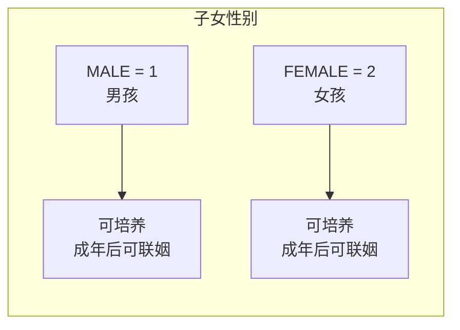

| 枚举值 | 数值 | 说明 | 图标前缀 |
|--------|------|------|----------|
| MALE | 1 | 男孩 | boy_ |
| FEMALE | 2 | 女孩 | girl_ |

### 子女品质枚举 (ENPChildQuality)

| 枚举值 | 数值 | 说明 | 天赋加成 | 获取概率 |
|--------|------|------|----------|----------|
| COMMON | 1 | 普通 | 0% | 60% |
| EXCELLENT | 2 | 优秀 | +10% | 25% |
| RARE | 3 | 稀有 | +20% | 10% |
| EPIC | 4 | 史诗 | +30% | 4% |
| LEGENDARY | 5 | 传说 | +50% | 1% |

### 子女状态枚举 (EChildState)

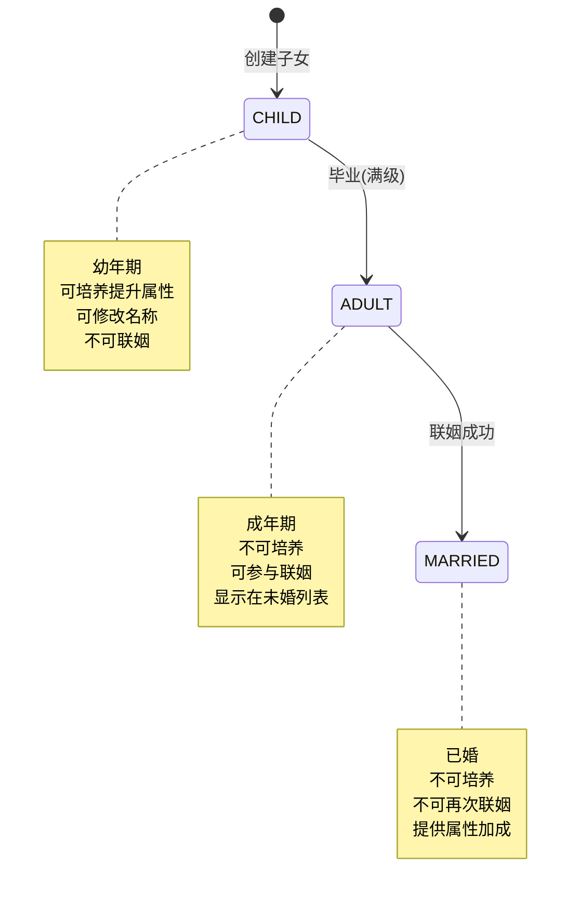

| 状态值 | 枚举名 | 说明 | 可执行操作 |
|--------|--------|------|------------|
| 1 | CHILD | 幼年期 | 培养、改名、毕业 |
| 2 | ADULT | 成年期 | 联姻、查看 |
| 3 | MARRIED | 已婚 | 查看配偶信息 |

### 配置示例

```json
{
    "child_id": 10001,
    "child_name": "聪慧男孩",
    "gender": 1,
    "talent_init": 50,
    "talent_max": 100,
    "max_level": 10,
    "quality": 3,
    "icon": "child/boy_001",
    "model": "model/child/boy_001",
    "desc": "天资聪颖的小男孩，培养潜力巨大",
    "unlock_cond": {
        "condType": 1,
        "condValue": 20
    },
    "vip_level": 0
}
```

```json
{
    "child_id": 10002,
    "child_name": "伶俐女孩",
    "gender": 2,
    "talent_init": 60,
    "talent_max": 100,
    "max_level": 10,
    "quality": 4,
    "icon": "child/girl_001",
    "model": "model/child/girl_001",
    "desc": "聪明伶俐的小女孩，天赋异禀",
    "unlock_cond": {},
    "vip_level": 5
}
```

### 代码示例

```java
// 服务端获取子女配置
ChildRefObj childRef = ChildRefObj.getMgr().get(childId);
if (childRef == null) {
    return CommErr.REF_NOT_FOUND;
}

// 获取基础属性
int maxLevel = childRef.max_level;
int initTalent = childRef.talent_init;
int quality = childRef.quality;

// 检查解锁条件
if (childRef.unlock_cond != null && !childRef.unlock_cond.isEmpty()) {
    boolean unlocked = childRef.unlock_cond.IsEnable(playerData);
    if (!unlocked) {
        return ChildErr.CHILD_NOT_UNLOCKED;
    }
}

// 检查VIP等级
if (playerInfo.vipLevel < childRef.vip_level) {
    return ChildErr.VIP_LEVEL_NOT_ENOUGH;
}
```

```csharp
// 客户端获取子女配置
ChildRefObj childRef = GRefdataCoreMgr.instance.childRefCore.getRef(childId);
if (childRef == null)
{
    Debug.LogError($"子女配置不存在: {childId}");
    return;
}

// 获取显示信息
string childName = childRef.child_name;
string iconPath = childRef.icon;
int quality = childRef.quality;

// 获取品质颜色
Color qualityColor = GetQualityColor(quality);

// 检查是否可解锁
bool canUnlock = CheckUnlockCondition(childRef.unlock_cond);
```

---

## 二、培养配置 (ChildTrainRefObj)

**配表名**: `child_train_ref`

### 完整字段列表

| 字段名 | 类型 | 必填 | 默认值 | 取值范围 | 说明 |
|--------|------|------|--------|----------|------|
| train_id | int | 是 | - | > 0 | 培养配置ID |
| train_name | string | 是 | - | 1-32字符 | 培养名称 |
| train_type | int | 是 | 1 | 1-5 | 培养类型 |
| cost_list | array | 是 | - | - | 消耗列表 |
| exp_add | int | 是 | 0 | >= 0 | 经验增加值 |
| talent_add | int | 是 | 0 | >= 0 | 天赋增加值 |
| talent_add_ratio | int | 否 | 0 | 0-10000 | 天赋增加比例(万分比) |
| daily_limit | int | 否 | 0 | 0-100 | 每日次数限制(0不限) |
| weight | int | 否 | 100 | 1-10000 | 权重 |
| quality_req | int | 否 | 0 | 0-5 | 品质要求 |
| vip_level | int | 否 | 0 | 0-100 | VIP等级要求 |
| cd_time | int | 否 | 0 | 0-86400 | 冷却时间(秒) |

### 培养类型枚举 (ENPTrainType)

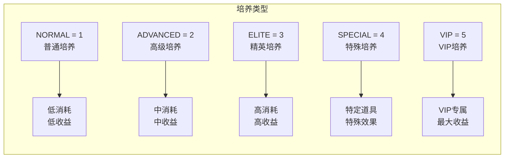

| 枚举值 | 数值 | 说明 | 典型消耗 | 经验/天赋 |
|--------|------|------|----------|-----------|
| NORMAL | 1 | 普通培养 | 银两 x 1000 | +50/+2 |
| ADVANCED | 2 | 高级培养 | 钻石 x 50 | +100/+5 |
| ELITE | 3 | 精英培养 | 钻石 x 200 | +200/+10 |
| SPECIAL | 4 | 特殊培养 | 培养丹 x 1 | +500/+20 |
| VIP | 5 | VIP培养 | 钻石 x 500 | +300/+15 |

### 培养消耗数据结构

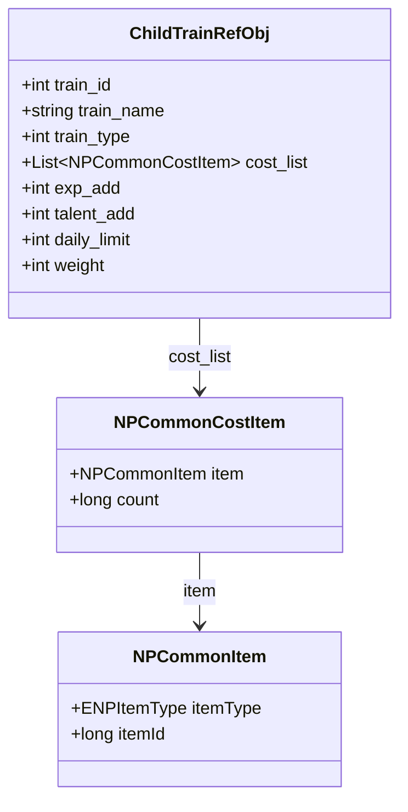

### 配置示例

```json
{
    "train_id": 1,
    "train_name": "普通培养",
    "train_type": 1,
    "cost_list": [
        {
            "item": {"itemType": 2, "itemId": 0},
            "count": 1000
        }
    ],
    "exp_add": 50,
    "talent_add": 2,
    "talent_add_ratio": 0,
    "daily_limit": 5,
    "weight": 100,
    "quality_req": 0,
    "vip_level": 0,
    "cd_time": 0
}
```

```json
{
    "train_id": 3,
    "train_name": "精英培养",
    "train_type": 3,
    "cost_list": [
        {
            "item": {"itemType": 2, "itemId": 0},
            "count": 200
        }
    ],
    "exp_add": 200,
    "talent_add": 10,
    "talent_add_ratio": 500,
    "daily_limit": 3,
    "weight": 50,
    "quality_req": 3,
    "vip_level": 0,
    "cd_time": 3600
}
```

### 代码示例

```java
/**
 * 执行培养逻辑
 */
public TrainResult trainChild(long playerId, long childId, int trainType) {
    TrainResult result = new TrainResult();

    // 1. 获取培养配置
    ChildTrainRefObj trainRef = ChildTrainRefObj.getMgr().get(trainType);
    if (trainRef == null) {
        result.setError(CommErr.REF_NOT_FOUND, "培养配置不存在");
        return result;
    }

    // 2. 获取子女信息
    PlayerChild child = childDao.selectById(childId);
    if (child == null || child.getPlayerId() != playerId) {
        result.setError(ChildErr.CHILD_NOT_FOUND, "子女不存在");
        return result;
    }

    // 3. 检查子女状态
    if (child.getState() != EChildState.CHILD.getValue()) {
        result.setError(ChildErr.CHILD_ALREADY_ADULT, "子女已成年，无法培养");
        return result;
    }

    // 4. 检查品质要求
    ChildRefObj childRef = ChildRefObj.getMgr().get(child.getCfgId());
    if (trainRef.quality_req > 0 && childRef.quality < trainRef.quality_req) {
        result.setError(ChildErr.QUALITY_NOT_ENOUGH, "子女品质不足");
        return result;
    }

    // 5. 检查每日次数
    int todayCount = getChildTodayTrainCount(playerId, childId, trainType);
    if (trainRef.daily_limit > 0 && todayCount >= trainRef.daily_limit) {
        result.setError(ChildErr.TRAIN_LIMIT_EXCEEDED, "今日培养次数已用完");
        return result;
    }

    // 6. 检查并扣除消耗
    if (!itemService.checkAndConsume(playerId, trainRef.cost_list, "子女培养")) {
        result.setError(CommErr.ITEM_NOT_ENOUGH, "道具不足");
        return result;
    }

    // 7. 增加经验和天赋
    int expAdd = trainRef.exp_add;
    int talentAdd = trainRef.talent_add;

    // 天赋加成比例计算
    if (trainRef.talent_add_ratio > 0) {
        talentAdd += child.getTalent() * trainRef.talent_add_ratio / 10000;
    }

    child.setExp(child.getExp() + expAdd);
    child.setTalent(Math.min(child.getTalent() + talentAdd, childRef.talent_max));

    // 8. 检查升级
    checkLevelUp(child, childRef);

    // 9. 更新数据
    childDao.updateById(child);
    updateTodayTrainCount(playerId, childId, trainType);

    // 10. 返回结果
    result.setSuccess(child.getLevel(), child.getExp(), child.getTalent());
    return result;
}
```

---

## 三、座位配置 (ChildSeatRefObj)

**配表名**: `child_seat_ref`

### 完整字段列表

| 字段名 | 类型 | 必填 | 默认值 | 取值范围 | 说明 |
|--------|------|------|--------|----------|------|
| seat_id | int | 是 | - | > 0 | 座位ID |
| seat_name | string | 是 | - | 1-32字符 | 座位名称 |
| seat_type | int | 是 | 1 | 1-5 | 座位类型 |
| unlock_condition | object | 否 | {} | 条件对象 | 解锁条件 |
| energy_max | int | 是 | 100 | 1-10000 | 最大能量值 |
| energy_recover | int | 否 | 10 | 0-1000 | 每小时恢复量 |
| child_slot | int | 是 | 1 | 1-10 | 子女槽位数 |
| energy_cost | int | 是 | 50 | 1-1000 | 获取子女消耗 |
| probability | int | 否 | 10000 | 1-10000 | 基础概率(万分比) |
| vip_level | int | 否 | 0 | 0-100 | 所需VIP等级 |

### 座位类型枚举 (ENPSeatType)

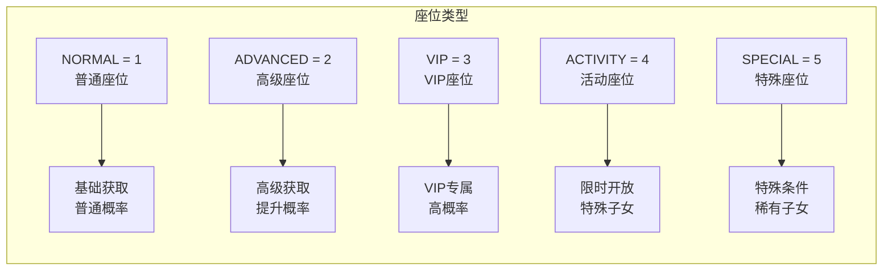

| 枚举值 | 数值 | 说明 | 能量上限 | 获取概率 |
|--------|------|------|----------|----------|
| NORMAL | 1 | 普通座位 | 100 | 基础 |
| ADVANCED | 2 | 高级座位 | 200 | +20% |
| VIP | 3 | VIP座位 | 500 | +50% |
| ACTIVITY | 4 | 活动座位 | 300 | +30% |
| SPECIAL | 5 | 特殊座位 | 1000 | +100% |

### 座位解锁流程

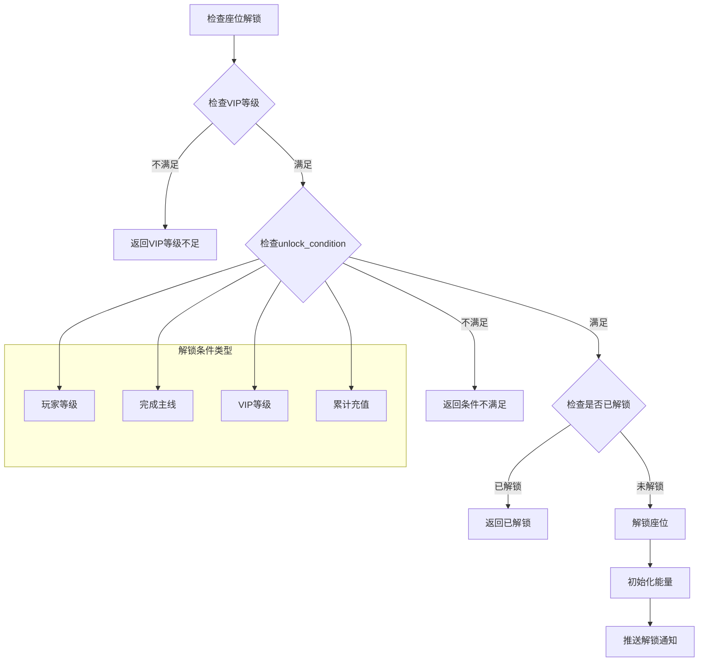

### 配置示例

```json
{
    "seat_id": 1,
    "seat_name": "普通摇篮",
    "seat_type": 1,
    "unlock_condition": {
        "condType": 1,
        "condValue": 10
    },
    "energy_max": 100,
    "energy_recover": 10,
    "child_slot": 1,
    "energy_cost": 50,
    "probability": 10000,
    "vip_level": 0
}
```

```json
{
    "seat_id": 3,
    "seat_name": "VIP黄金摇篮",
    "seat_type": 3,
    "unlock_condition": {},
    "energy_max": 500,
    "energy_recover": 50,
    "child_slot": 3,
    "energy_cost": 100,
    "probability": 15000,
    "vip_level": 10
}
```

### 代码示例

```java
/**
 * 随机获取子女
 */
public RandomChildResult randomGainChild(long playerId, int seatId) {
    RandomChildResult result = new RandomChildResult();

    // 1. 获取座位配置
    ChildSeatRefObj seatRef = ChildSeatRefObj.getMgr().get(seatId);
    if (seatRef == null) {
        result.setError(CommErr.REF_NOT_FOUND, "座位配置不存在");
        return result;
    }

    // 2. 检查座位是否解锁
    PlayerSeat seat = seatDao.getByPlayerAndSeat(playerId, seatId);
    if (seat == null) {
        result.setError(ChildErr.SEAT_NOT_UNLOCKED, "座位未解锁");
        return result;
    }

    // 3. 检查能量是否足够
    if (seat.getEnergy() < seatRef.energy_cost) {
        result.setError(ChildErr.ENERGY_NOT_ENOUGH, "能量不足");
        return result;
    }

    // 4. 检查子女槽位
    int childCount = childDao.countByPlayer(playerId);
    if (childCount >= seatRef.child_slot) {
        result.setError(ChildErr.CHILD_SLOT_FULL, "子女槽位已满");
        return result;
    }

    // 5. 扣除能量
    seat.setEnergy(seat.getEnergy() - seatRef.energy_cost);
    seatDao.updateById(seat);

    // 6. 随机选择子女配置
    ChildRefObj childRef = randomSelectChild(seatRef.probability);

    // 7. 创建子女
    PlayerChild child = createChild(playerId, childRef);
    childDao.insert(child);

    // 8. 推送通知
    pushChildAdd(playerId, child);

    result.setSuccess(child);
    return result;
}
```

---

## 四、联姻配置 (ChildMarriageRefObj)

**配表名**: `child_marriage_ref`

### 完整字段列表

| 字段名 | 类型 | 必填 | 默认值 | 取值范围 | 说明 |
|--------|------|------|--------|----------|------|
| marriage_id | int | 是 | - | > 0 | 联姻配置ID |
| marriage_name | string | 是 | - | 1-32字符 | 联姻名称 |
| require_talent | int | 是 | 0 | 0-100 | 需要天赋值 |
| require_level | int | 否 | 0 | 0-100 | 需要等级 |
| reward_list | array | 是 | - | - | 联姻奖励列表 |
| bonus_ratio | int | 否 | 0 | 0-10000 | 天赋加成比例 |
| extra_cond | object | 否 | {} | 条件对象 | 额外条件 |
| vip_level | int | 否 | 0 | 0-100 | VIP等级要求 |

### 联姻奖励计算公式

```
基础奖励 = 配置奖励
天赋加成奖励 = 基础奖励 × (天赋_男方 + 天赋_女方) × bonus_ratio / 10000
最终奖励 = 基础奖励 + 天赋加成奖励
```

**示例计算**:
```
基础奖励: 银两 × 1000
男方天赋: 80
女方天赋: 70
bonus_ratio = 100 (1%)

天赋加成奖励 = 1000 × (80 + 70) × 100 / 10000 = 1500
最终奖励 = 1000 + 1500 = 2500 银两
```

### 联姻流程图

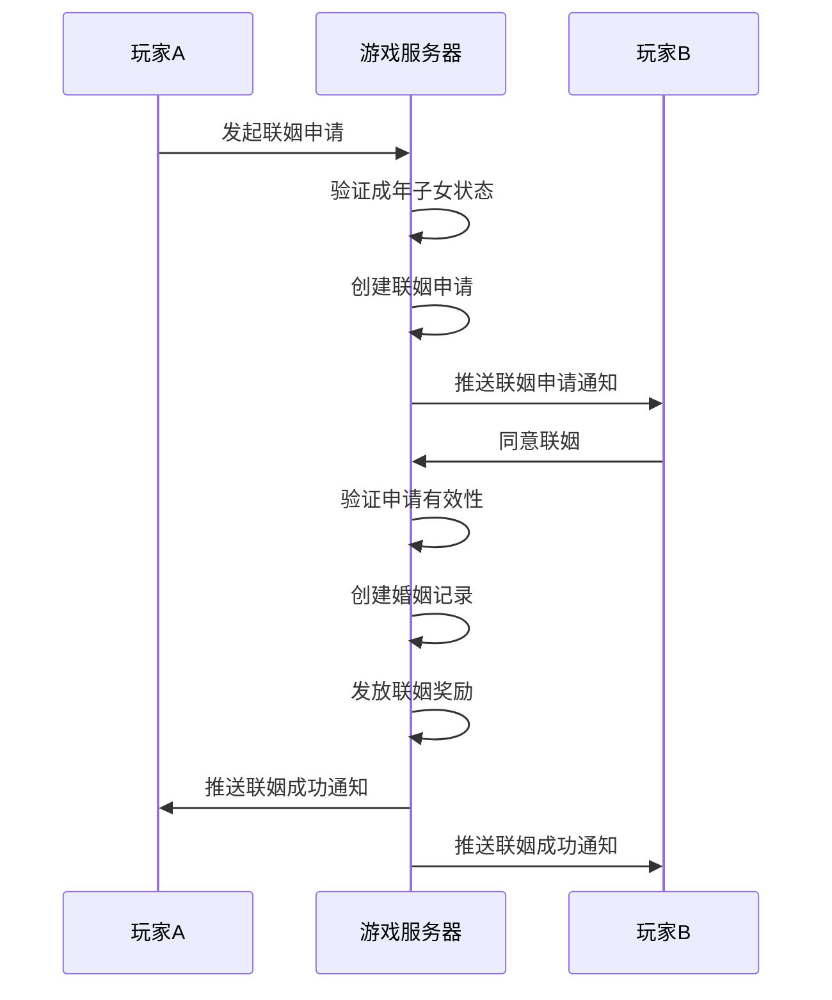

### 配置示例

```json
{
    "marriage_id": 1,
    "marriage_name": "普通联姻",
    "require_talent": 50,
    "require_level": 0,
    "reward_list": [
        {
            "item": {"itemType": 2, "itemId": 0},
            "count": 1000
        },
        {
            "item": {"itemType": 1, "itemId": 50001},
            "count": 10
        }
    ],
    "bonus_ratio": 100,
    "extra_cond": {},
    "vip_level": 0
}
```

```json
{
    "marriage_id": 2,
    "marriage_name": "豪门联姻",
    "require_talent": 80,
    "require_level": 50,
    "reward_list": [
        {
            "item": {"itemType": 2, "itemId": 0},
            "count": 5000
        },
        {
            "item": {"itemType": 1, "itemId": 50002},
            "count": 20
        }
    ],
    "bonus_ratio": 200,
    "extra_cond": {
        "condType": 6,
        "condValue": 1
    },
    "vip_level": 5
}
```

---

## 五、等级配置 (ChildLevelRefObj)

**配表名**: `child_level_ref`

### 完整字段列表

| 字段名 | 类型 | 必填 | 默认值 | 取值范围 | 说明 |
|--------|------|------|--------|----------|------|
| level | int | 是 | - | 1-100 | 等级 |
| need_exp | int | 是 | - | >= 0 | 升级所需经验 |
| exp_grow_type | int | 否 | 1 | 1-3 | 经验成长类型 |
| exp_grow_param | float | 否 | 1.0 | > 0 | 成长参数 |
| talent_limit | int | 否 | 0 | 0-100 | 天赋上限 |
| attribute_bonus | object | 否 | {} | 加成对象 | 属性加成 |

### 经验成长类型枚举

| 类型值 | 说明 | 公式 | 示例 |
|--------|------|------|------|
| 1 | 线性成长 | need_exp × level | 100 × 5 = 500 |
| 2 | 指数成长 | need_exp × exp_grow_param^level | 100 × 1.2^5 ≈ 249 |
| 3 | 自定义 | 按配置表指定 | 由配表决定 |

### 等级经验计算流程

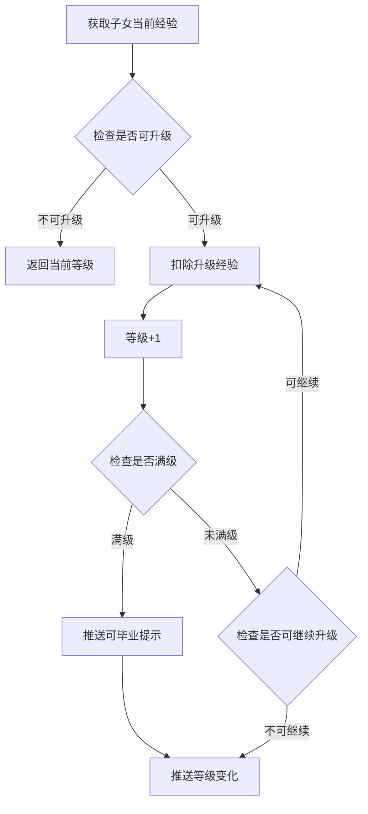

### 配置示例

```json
{
    "level": 1,
    "need_exp": 100,
    "exp_grow_type": 2,
    "exp_grow_param": 1.2,
    "talent_limit": 20,
    "attribute_bonus": {
        "attack": 10,
        "defense": 5
    }
}
```

---

## 六、天赋配置 (ChildTalentRefObj)

**配表名**: `child_talent_ref`

### 完整字段列表

| 字段名 | 类型 | 必填 | 默认值 | 取值范围 | 说明 |
|--------|------|------|--------|----------|------|
| talent_level | int | 是 | - | 1-100 | 天赋等级 |
| talent_min | int | 是 | - | 1-100 | 天赋下限 |
| talent_max | int | 是 | - | 1-100 | 天赋上限 |
| quality | int | 否 | 1 | 1-5 | 对应品质 |
| bonus_ratio | int | 否 | 10000 | 1-10000 | 加成比例 |
| desc | string | 否 | "" | 1-200字符 | 描述 |

### 天赋等级对照表

| 天赋值 | 等级 | 品质 | 描述 | 加成比例 |
|--------|------|------|------|----------|
| 1-20 | 1 | 普通 | 平庸之资 | 100% |
| 21-40 | 2 | 优秀 | 略有天赋 | 110% |
| 41-60 | 3 | 稀有 | 天资聪颖 | 125% |
| 61-80 | 4 | 史诗 | 天赋异禀 | 150% |
| 81-100 | 5 | 传说 | 天生奇才 | 200% |

---

## 七、配表数据流程图

### 子女获取流程

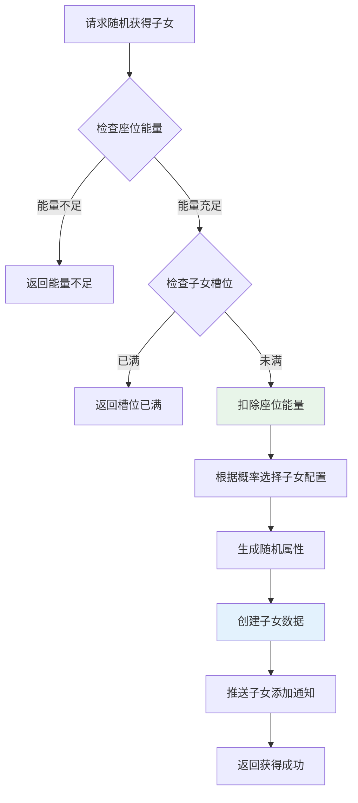

### 子女培养流程

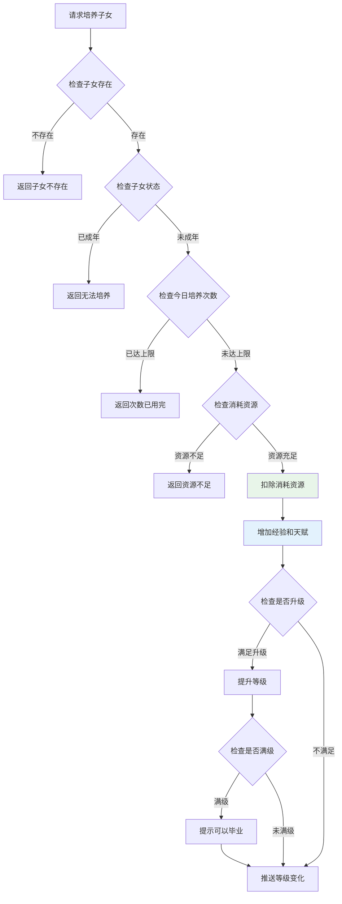

---

## 八、配表加载方式

### 客户端加载

```csharp
// 获取子女配置
ChildRefObj childRef = GRefdataCoreMgr.instance.childRefCore.getRef(childId);
if (childRef != null)
{
    string childName = childRef.child_name;
    int maxLevel = childRef.max_level;
    int quality = childRef.quality;
}

// 获取培养配置
ChildTrainRefObj trainRef = GRefdataCoreMgr.instance.childTrainRefCore.getRef(trainId);
if (trainRef != null)
{
    int expAdd = trainRef.exp_add;
    int talentAdd = trainRef.talent_add;
}

// 获取座位配置
ChildSeatRefObj seatRef = GRefdataCoreMgr.instance.childSeatRefCore.getRef(seatId);
if (seatRef != null)
{
    int energyMax = seatRef.energy_max;
    int energyCost = seatRef.energy_cost;
}
```

### 服务端加载

```java
// 获取子女配置
ChildRefObj childRef = ChildRefObj.getMgr().get(childId);
if (childRef != null) {
    String childName = childRef.child_name;
    int maxLevel = childRef.max_level;
}

// 获取培养配置
ChildTrainRefObj trainRef = ChildTrainRefObj.getMgr().get(trainId);

// 获取座位配置
ChildSeatRefObj seatRef = ChildSeatRefObj.getMgr().get(seatId);
```

---

## 九、配表校验规则

### 子女配置校验

| 字段名 | 校验规则 | 异常处理 |
|--------|----------|----------|
| child_id | 必须唯一，范围 > 0 | 配表加载时去重 |
| gender | 范围 1-2 | 使用默认值1 |
| talent_init | 范围 1-100 | 使用默认值50 |
| max_level | 范围 1-100 | 使用默认值10 |
| quality | 范围 1-5 | 使用默认值1 |

### 培养配置校验

| 字段名 | 校验规则 | 异常处理 |
|--------|----------|----------|
| train_id | 必须唯一 | 配表加载时去重 |
| train_type | 范围 1-5 | 使用默认值1 |
| cost_list | 必须非空 | 加载时报错 |
| exp_add | 范围 >= 0 | 使用默认值0 |
| talent_add | 范围 >= 0 | 使用默认值0 |

---

## 十、完整字段速查表

### ChildRefObj 完整字段

| 字段名 | 类型 | 必填 | 默认值 | 取值范围 | 说明 |
|--------|------|------|--------|----------|------|
| child_id | int | 是 | - | > 0 | 子女配置ID |
| child_name | string | 是 | - | 1-32字符 | 子女名称 |
| gender | int | 是 | - | 1-2 | 性别 |
| talent_init | int | 是 | 50 | 1-100 | 初始天赋 |
| talent_max | int | 是 | 100 | 1-100 | 最大天赋 |
| max_level | int | 是 | 10 | 1-100 | 最大等级 |
| quality | int | 否 | 1 | 1-5 | 品质 |
| icon | string | 否 | "" | 资源路径 | 图标 |
| model | string | 否 | "" | 资源路径 | 模型 |
| desc | string | 否 | "" | 1-200字符 | 描述 |
| unlock_cond | object | 否 | {} | 条件对象 | 解锁条件 |
| vip_level | int | 否 | 0 | 0-100 | VIP等级 |

### ChildTrainRefObj 完整字段

| 字段名 | 类型 | 必填 | 默认值 | 取值范围 | 说明 |
|--------|------|------|--------|----------|------|
| train_id | int | 是 | - | > 0 | 培养ID |
| train_name | string | 是 | - | 1-32字符 | 培养名称 |
| train_type | int | 是 | 1 | 1-5 | 培养类型 |
| cost_list | array | 是 | - | - | 消耗列表 |
| exp_add | int | 是 | 0 | >= 0 | 经验增加 |
| talent_add | int | 是 | 0 | >= 0 | 天赋增加 |
| talent_add_ratio | int | 否 | 0 | 0-10000 | 天赋加成比例 |
| daily_limit | int | 否 | 0 | 0-100 | 每日限制 |
| weight | int | 否 | 100 | 1-10000 | 权重 |
| quality_req | int | 否 | 0 | 0-5 | 品质要求 |
| vip_level | int | 否 | 0 | 0-100 | VIP要求 |
| cd_time | int | 否 | 0 | 0-86400 | 冷却时间 |

### ChildSeatRefObj 完整字段

| 字段名 | 类型 | 必填 | 默认值 | 取值范围 | 说明 |
|--------|------|------|--------|----------|------|
| seat_id | int | 是 | - | > 0 | 座位ID |
| seat_name | string | 是 | - | 1-32字符 | 座位名称 |
| seat_type | int | 是 | 1 | 1-5 | 座位类型 |
| unlock_condition | object | 否 | {} | 条件对象 | 解锁条件 |
| energy_max | int | 是 | 100 | 1-10000 | 最大能量 |
| energy_recover | int | 否 | 10 | 0-1000 | 恢复速度 |
| child_slot | int | 是 | 1 | 1-10 | 子女槽位 |
| energy_cost | int | 是 | 50 | 1-1000 | 获取消耗 |
| probability | int | 否 | 10000 | 1-10000 | 基础概率 |
| vip_level | int | 否 | 0 | 0-100 | VIP要求 |

### ChildMarriageRefObj 完整字段

| 字段名 | 类型 | 必填 | 默认值 | 取值范围 | 说明 |
|--------|------|------|--------|----------|------|
| marriage_id | int | 是 | - | > 0 | 联姻ID |
| marriage_name | string | 是 | - | 1-32字符 | 联姻名称 |
| require_talent | int | 是 | 0 | 0-100 | 需要天赋 |
| require_level | int | 否 | 0 | 0-100 | 需要等级 |
| reward_list | array | 是 | - | - | 奖励列表 |
| bonus_ratio | int | 否 | 0 | 0-10000 | 加成比例 |
| extra_cond | object | 否 | {} | 条件对象 | 额外条件 |
| vip_level | int | 否 | 0 | 0-100 | VIP要求 |

---

## 十一、配表路径

### 客户端配置路径

```
game_client/Assets/Scripts/ResScripts/NPSO/GSO/Child/
├── ChildRefObj.java          # 子女配置
├── ChildTrainRefObj.java     # 培养配置
├── ChildSeatRefObj.java      # 座位配置
├── ChildMarriageRefObj.java  # 联姻配置
├── ChildLevelRefObj.java     # 等级配置
└── ChildTalentRefObj.java    # 天赋配置
```

### 服务端配置路径

```
game_server/Config/child/
├── child_ref.json           # 子女配置
├── child_train_ref.json     # 培养配置
├── child_seat_ref.json      # 座位配置
├── child_marriage_ref.json  # 联姻配置
├── child_level_ref.json     # 等级配置
└── child_talent_ref.json    # 天赋配置
```

---

*文档生成时间: 2026-04-12*
*文档版本: v1.3.0*
