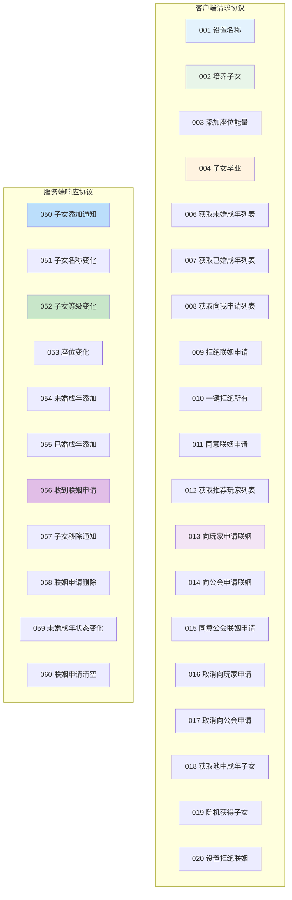
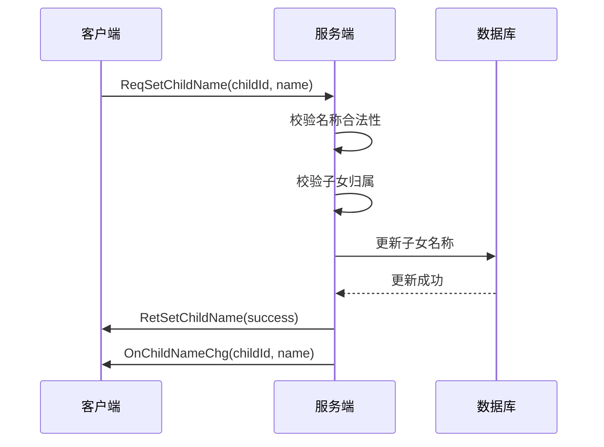
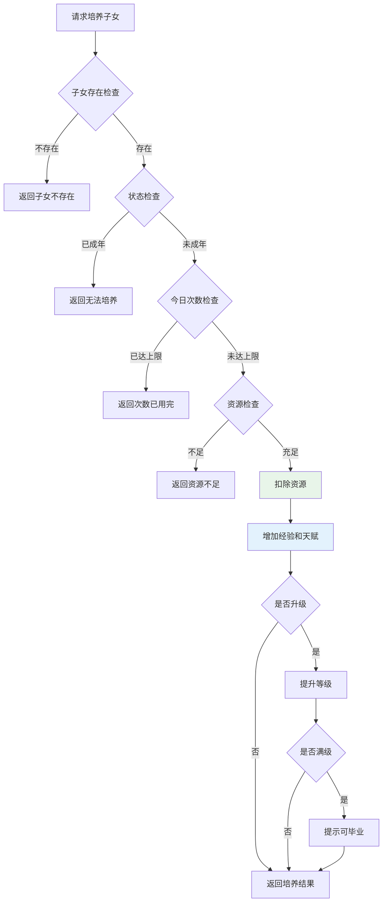
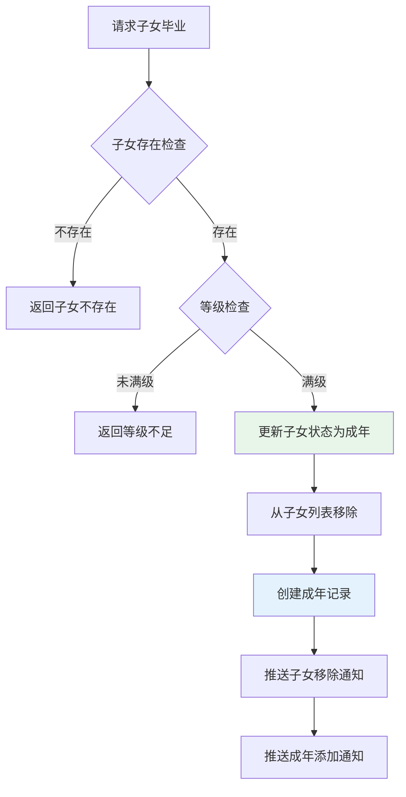
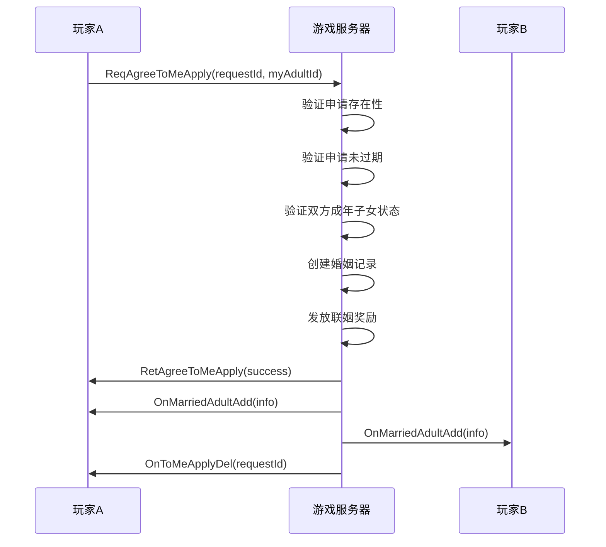
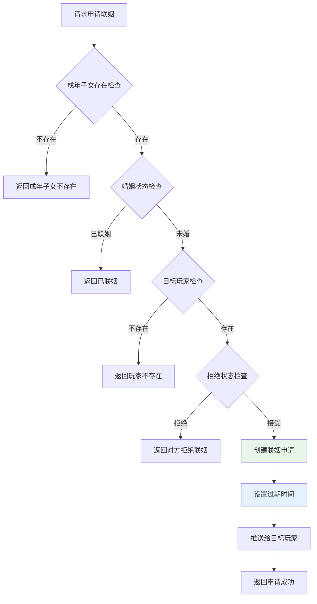
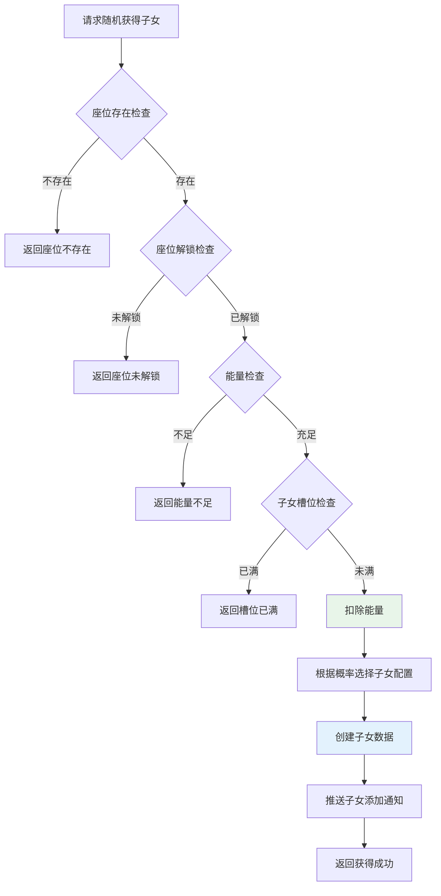
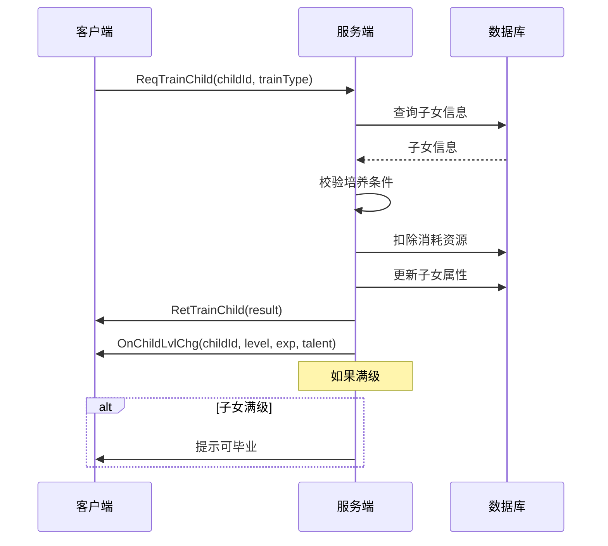
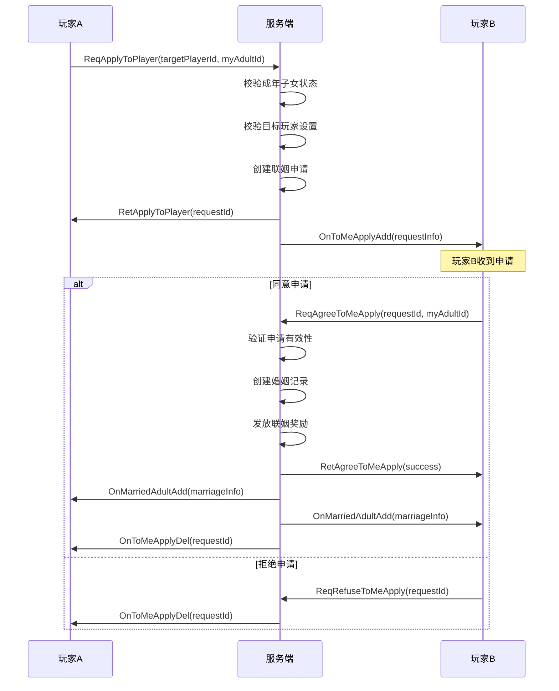
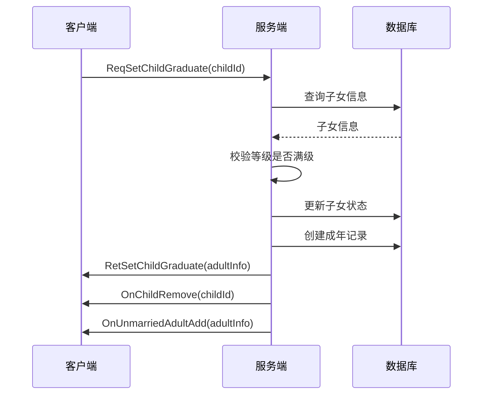

# 子女系统 - 协议文档

## 协议编号

**模块编号**: p014 (ChildOp)
**协议前缀**: GC2GS (客户端请求), GS2GC (服务端响应/推送)

---

## 协议概览图



---

## 一、客户端请求协议 (GC2GS)

### GC2GS_014_001_ReqSetChildName

**说明**: 请求设置子女名称

**协议ID**: 014_001

#### 请求参数

| 字段名 | 类型 | 必填 | 说明 | 约束条件 |
|--------|------|------|------|----------|
| childId | long | 是 | 子女ID | > 0 |
| name | string | 是 | 新名称 | 1-16字符，不含敏感词 |

#### 返回参数

| 字段名 | 类型 | 说明 |
|--------|------|------|
| errCode | int | 错误码 |
| childId | long | 子女ID |
| name | string | 新名称 |

#### 流程图



#### 代码示例

```java
// 服务端处理
public void handleSetChildName(long playerId, GC2GS_014_001_ReqSetChildName req) {
    // 1. 校验名称
    if (!validateName(req.name)) {
        sendError(CommErr.INVALID_NAME, "名称不合法");
        return;
    }

    // 2. 获取子女
    PlayerChild child = childDao.selectById(req.childId);
    if (child == null || child.getPlayerId() != playerId) {
        sendError(ChildErr.CHILD_NOT_FOUND, "子女不存在");
        return;
    }

    // 3. 更新名称
    child.setName(req.name);
    childDao.updateById(child);

    // 4. 返回结果
    sendRetSetChildName(child.getChildId(), child.getName());

    // 5. 推送名称变化
    pushChildNameChg(playerId, child.getChildId(), child.getName());
}
```

---

### GC2GS_014_002_ReqTrainChild

**说明**: 请求培养子女

**协议ID**: 014_002

#### 请求参数

| 字段名 | 类型 | 必填 | 说明 | 约束条件 |
|--------|------|------|------|----------|
| childId | long | 是 | 子女ID | > 0 |
| trainType | int | 是 | 培养类型 | 1-5 |

#### 返回参数

| 字段名 | 类型 | 说明 |
|--------|------|------|
| errCode | int | 错误码 |
| childId | long | 子女ID |
| level | int | 当前等级 |
| exp | int | 当前经验 |
| talent | int | 当前天赋 |
| remainCount | int | 今日剩余次数 |

#### 流程图



#### 代码示例

```java
// 服务端处理
public void handleTrainChild(long playerId, GC2GS_014_002_ReqTrainChild req) {
    // 1. 获取培养配置
    ChildTrainRefObj trainRef = ChildTrainRefObj.getMgr().get(req.trainType);
    if (trainRef == null) {
        sendError(CommErr.REF_NOT_FOUND, "培养配置不存在");
        return;
    }

    // 2. 获取子女信息
    PlayerChild child = childDao.selectById(req.childId);
    if (child == null || child.getPlayerId() != playerId) {
        sendError(ChildErr.CHILD_NOT_FOUND, "子女不存在");
        return;
    }

    // 3. 检查状态
    if (child.getState() != EChildState.CHILD.getValue()) {
        sendError(ChildErr.CHILD_ALREADY_ADULT, "子女已成年，无法培养");
        return;
    }

    // 4. 检查今日次数
    int todayCount = getChildTodayTrainCount(playerId, req.childId, req.trainType);
    if (trainRef.daily_limit > 0 && todayCount >= trainRef.daily_limit) {
        sendError(ChildErr.TRAIN_LIMIT_EXCEEDED, "今日培养次数已用完");
        return;
    }

    // 5. 扣除资源
    if (!itemService.checkAndConsume(playerId, trainRef.cost_list, "子女培养")) {
        sendError(CommErr.ITEM_NOT_ENOUGH, "道具不足");
        return;
    }

    // 6. 增加属性
    child.setExp(child.getExp() + trainRef.exp_add);
    child.setTalent(child.getTalent() + trainRef.talent_add);

    // 7. 检查升级
    checkLevelUp(child);

    // 8. 更新数据
    childDao.updateById(child);
    updateTodayTrainCount(playerId, req.childId, req.trainType);

    // 9. 返回结果
    sendRetTrainChild(child.getChildId(), child.getLevel(), child.getExp(),
                      child.getTalent(), trainRef.daily_limit - todayCount - 1);

    // 10. 推送等级变化
    pushChildLvlChg(playerId, child);
}
```

---

### GC2GS_014_003_ReqAddSeatEnergy

**说明**: 请求添加座位能量

**协议ID**: 014_003

#### 请求参数

| 字段名 | 类型 | 必填 | 说明 | 约束条件 |
|--------|------|------|------|----------|
| seatId | int | 是 | 座位ID | > 0 |
| energyAdd | int | 是 | 添加能量值 | > 0 |
| costType | int | 是 | 消耗类型 | 1道具 2货币 |

#### 返回参数

| 字段名 | 类型 | 说明 |
|--------|------|------|
| errCode | int | 错误码 |
| seatId | int | 座位ID |
| energy | int | 当前能量 |

---

### GC2GS_014_004_ReqSetChildGraduate

**说明**: 请求子女毕业

**协议ID**: 014_004

#### 请求参数

| 字段名 | 类型 | 必填 | 说明 | 约束条件 |
|--------|------|------|------|----------|
| childId | long | 是 | 子女ID | > 0 |

#### 返回参数

| 字段名 | 类型 | 说明 |
|--------|------|------|
| errCode | int | 错误码 |
| adultInfo | Adult_ServerInfo | 成年子女信息 |

#### 流程图



#### 代码示例

```java
// 服务端处理
public void handleGraduateChild(long playerId, GC2GS_014_004_ReqSetChildGraduate req) {
    // 1. 获取子女信息
    PlayerChild child = childDao.selectById(req.childId);
    if (child == null || child.getPlayerId() != playerId) {
        sendError(ChildErr.CHILD_NOT_FOUND, "子女不存在");
        return;
    }

    // 2. 检查等级
    ChildRefObj childRef = ChildRefObj.getMgr().get(child.getCfgId());
    if (child.getLevel() < childRef.max_level) {
        sendError(ChildErr.CHILD_LEVEL_NOT_ENOUGH, "子女等级不足，无法毕业");
        return;
    }

    // 3. 更新子女状态
    child.setState(EChildState.ADULT.getValue());
    childDao.updateById(child);

    // 4. 创建成年记录
    PlayerAdult adult = new PlayerAdult();
    adult.setAdultId(idGenerator.nextId());
    adult.setPlayerId(playerId);
    adult.setChildCfgId(child.getCfgId());
    adult.setName(child.getName());
    adult.setGender(child.getGender());
    adult.setTalent(child.getTalent());
    adult.setMarryState(EMarriageState.UNMARRIED.getValue());
    adultDao.insert(adult);

    // 5. 推送通知
    pushChildRemove(playerId, req.childId);
    pushUnmarriedAdultAdd(playerId, adult);

    // 6. 返回结果
    sendRetSetChildGraduate(adult.toServerInfo());
}
```

---

### GC2GS_014_006_ReqGetUnMarriedAdult

**说明**: 请求获取未婚成年列表

**协议ID**: 014_006

#### 请求参数

无

#### 返回参数

| 字段名 | 类型 | 说明 |
|--------|------|------|
| errCode | int | 错误码 |
| adultList | List\<Adult_ServerInfo\> | 未婚成年列表 |

---

### GC2GS_014_007_ReqGetMarriedAdult

**说明**: 请求获取已婚成年列表

**协议ID**: 014_007

#### 请求参数

无

#### 返回参数

| 字段名 | 类型 | 说明 |
|--------|------|------|
| errCode | int | 错误码 |
| adultList | List\<MarriedAdult_ServerInfo\> | 已婚成年列表 |

---

### GC2GS_014_008_ReqGetToMeApply

**说明**: 请求获取向我申请联姻的列表

**协议ID**: 014_008

#### 请求参数

无

#### 返回参数

| 字段名 | 类型 | 说明 |
|--------|------|------|
| errCode | int | 错误码 |
| requestList | List\<EngageRequest_ServerInfo\> | 联姻申请列表 |

---

### GC2GS_014_009_ReqRefuseToMeApply

**说明**: 请求拒绝联姻申请

**协议ID**: 014_009

#### 请求参数

| 字段名 | 类型 | 必填 | 说明 | 约束条件 |
|--------|------|------|------|----------|
| requestId | long | 是 | 申请ID | > 0 |

#### 返回参数

| 字段名 | 类型 | 说明 |
|--------|------|------|
| errCode | int | 错误码 |
| requestId | long | 申请ID |

---

### GC2GS_014_010_ReqAkeyRefuseToMeApply

**说明**: 请求一键拒绝所有联姻申请

**协议ID**: 014_010

#### 请求参数

无

#### 返回参数

| 字段名 | 类型 | 说明 |
|--------|------|------|
| errCode | int | 错误码 |
| refuseCount | int | 拒绝数量 |

---

### GC2GS_014_011_ReqAgreeToMeApply

**说明**: 请求同意联姻申请

**协议ID**: 014_011

#### 请求参数

| 字段名 | 类型 | 必填 | 说明 | 约束条件 |
|--------|------|------|------|----------|
| requestId | long | 是 | 申请ID | > 0 |
| myAdultId | long | 是 | 我的成年子女ID | > 0 |

#### 返回参数

| 字段名 | 类型 | 说明 |
|--------|------|------|
| errCode | int | 错误码 |
| marriageInfo | Marriage_ServerInfo | 婚姻信息 |

#### 流程图



---

### GC2GS_014_012_ReqGetRecommendPlayerList

**说明**: 请求获取推荐联姻玩家列表

**协议ID**: 014_012

#### 请求参数

| 字段名 | 类型 | 必填 | 说明 | 约束条件 |
|--------|------|------|------|----------|
| adultId | long | 是 | 成年子女ID | > 0 |
| page | int | 否 | 页码 | >= 1，默认1 |
| pageSize | int | 否 | 每页数量 | 1-50，默认10 |

#### 返回参数

| 字段名 | 类型 | 说明 |
|--------|------|------|
| errCode | int | 错误码 |
| playerList | List\<RecommendPlayer_Info\> | 推荐玩家列表 |
| totalCount | int | 总数量 |

---

### GC2GS_014_013_ReqApplyToPlayer

**说明**: 请求向玩家申请联姻

**协议ID**: 014_013

#### 请求参数

| 字段名 | 类型 | 必填 | 说明 | 约束条件 |
|--------|------|------|------|----------|
| targetPlayerId | long | 是 | 目标玩家ID | > 0 |
| myAdultId | long | 是 | 我的成年子女ID | > 0 |

#### 返回参数

| 字段名 | 类型 | 说明 |
|--------|------|------|
| errCode | int | 错误码 |
| requestId | long | 申请ID |

#### 流程图



#### 代码示例

```java
// 服务端处理
public void handleApplyToPlayer(long playerId, GC2GS_014_013_ReqApplyToPlayer req) {
    // 1. 检查成年子女
    PlayerAdult myAdult = adultDao.selectById(req.myAdultId);
    if (myAdult == null || myAdult.getPlayerId() != playerId) {
        sendError(ChildErr.ADULT_NOT_FOUND, "成年子女不存在");
        return;
    }

    if (myAdult.getMarryState() != EMarriageState.UNMARRIED.getValue()) {
        sendError(ChildErr.ADULT_ALREADY_MARRIED, "成年子女已联姻");
        return;
    }

    // 2. 检查目标玩家
    PlayerBase targetPlayer = playerDao.selectById(req.targetPlayerId);
    if (targetPlayer == null) {
        sendError(CommErr.PLAYER_NOT_FOUND, "玩家不存在");
        return;
    }

    // 3. 检查是否拒绝联姻
    if (isRefuseMarriage(req.targetPlayerId)) {
        sendError(ChildErr.PLAYER_REFUSE_MARRIAGE, "对方当前不接受联姻申请");
        return;
    }

    // 4. 检查是否已有待处理申请
    EngageRequest existing = engageRequestDao.selectPending(playerId, req.targetPlayerId);
    if (existing != null) {
        sendError(ChildErr.REQUEST_ALREADY_EXISTS, "已有待处理的联姻申请");
        return;
    }

    // 5. 创建申请
    EngageRequest request = new EngageRequest();
    request.setRequestId(idGenerator.nextId());
    request.setFromPlayerId(playerId);
    request.setFromAdultId(req.myAdultId);
    request.setToPlayerId(req.targetPlayerId);
    request.setStatus(ERequestStatus.PENDING.getValue());
    request.setCreateTime(new Date());
    request.setExpireTime(DateUtils.addHours(new Date(), 24));
    engageRequestDao.insert(request);

    // 6. 推送给目标玩家
    pushToMeApplyAdd(req.targetPlayerId, request);

    // 7. 返回结果
    sendRetApplyToPlayer(request.getRequestId());
}
```

---

### GC2GS_014_014_ReqApplyToGroup

**说明**: 请求向公会申请联姻

**协议ID**: 014_014

#### 请求参数

| 字段名 | 类型 | 必填 | 说明 | 约束条件 |
|--------|------|------|------|----------|
| groupId | long | 是 | 公会ID | > 0 |
| myAdultId | long | 是 | 我的成年子女ID | > 0 |

#### 返回参数

| 字段名 | 类型 | 说明 |
|--------|------|------|
| errCode | int | 错误码 |
| requestId | long | 申请ID |

---

### GC2GS_014_015_ReqAgreeApplyGroup

**说明**: 请求同意公会联姻申请

**协议ID**: 014_015

#### 请求参数

| 字段名 | 类型 | 必填 | 说明 | 约束条件 |
|--------|------|------|------|----------|
| requestId | long | 是 | 申请ID | > 0 |
| myAdultId | long | 是 | 我的成年子女ID | > 0 |

#### 返回参数

| 字段名 | 类型 | 说明 |
|--------|------|------|
| errCode | int | 错误码 |
| marriageInfo | Marriage_ServerInfo | 婚姻信息 |

---

### GC2GS_014_016_ReqCancelApplyToPlayer

**说明**: 请求取消向玩家的联姻申请

**协议ID**: 014_016

#### 请求参数

| 字段名 | 类型 | 必填 | 说明 | 约束条件 |
|--------|------|------|------|----------|
| requestId | long | 是 | 申请ID | > 0 |

#### 返回参数

| 字段名 | 类型 | 说明 |
|--------|------|------|
| errCode | int | 错误码 |
| requestId | long | 申请ID |

---

### GC2GS_014_017_ReqCancelApplyToGroup

**说明**: 请求取消向公会的联姻申请

**协议ID**: 014_017

#### 请求参数

| 字段名 | 类型 | 必填 | 说明 | 约束条件 |
|--------|------|------|------|----------|
| requestId | long | 是 | 申请ID | > 0 |

#### 返回参数

| 字段名 | 类型 | 说明 |
|--------|------|------|
| errCode | int | 错误码 |
| requestId | long | 申请ID |

---

### GC2GS_014_018_ReqGetPoolAdult

**说明**: 请求获取池中成年子女

**协议ID**: 014_018

#### 请求参数

| 字段名 | 类型 | 必填 | 说明 | 约束条件 |
|--------|------|------|------|----------|
| gender | int | 否 | 性别筛选 | 0全部 1男 2女 |
| minTalent | int | 否 | 最小天赋 | 0-100 |
| page | int | 否 | 页码 | >= 1 |
| pageSize | int | 否 | 每页数量 | 1-50 |

#### 返回参数

| 字段名 | 类型 | 说明 |
|--------|------|------|
| errCode | int | 错误码 |
| adultList | List\<PoolAdult_ServerInfo\> | 池中成年子女列表 |
| totalCount | int | 总数量 |

---

### GC2GS_014_019_ReqRandomGainChild

**说明**: 请求随机获得子女

**协议ID**: 014_019

#### 请求参数

| 字段名 | 类型 | 必填 | 说明 | 约束条件 |
|--------|------|------|------|----------|
| seatId | int | 是 | 座位ID | > 0 |

#### 返回参数

| 字段名 | 类型 | 说明 |
|--------|------|------|
| errCode | int | 错误码 |
| childInfo | Child_ServerInfo | 子女信息 |

#### 流程图



---

### GC2GS_014_020_ReqSetRefuseMarry

**说明**: 请求设置拒绝联姻状态

**协议ID**: 014_020

#### 请求参数

| 字段名 | 类型 | 必填 | 说明 | 约束条件 |
|--------|------|------|------|----------|
| isRefuse | boolean | 是 | 是否拒绝联姻 | true/false |

#### 返回参数

| 字段名 | 类型 | 说明 |
|--------|------|------|
| errCode | int | 错误码 |
| isRefuse | boolean | 当前拒绝状态 |

---

## 二、服务端响应协议 (GS2GC)

### GS2GC_014_050_OnChildAdd

**说明**: 通知子女添加

**协议ID**: 014_050

#### 推送参数

| 字段名 | 类型 | 说明 |
|--------|------|------|
| childInfo | Child_ServerInfo | 子女信息 |

#### Child_ServerInfo 数据结构

| 字段名 | 类型 | 说明 |
|--------|------|------|
| childId | long | 子女ID |
| cfgId | int | 配置ID |
| name | string | 名称 |
| gender | int | 性别 |
| level | int | 等级 |
| exp | int | 经验 |
| talent | int | 天赋 |
| state | int | 状态 |

---

### GS2GC_014_051_OnChildNameChg

**说明**: 通知子女名称变化

**协议ID**: 014_051

#### 推送参数

| 字段名 | 类型 | 说明 |
|--------|------|------|
| childId | long | 子女ID |
| name | string | 新名称 |

---

### GS2GC_014_052_OnChildLvlChg

**说明**: 通知子女等级变化

**协议ID**: 014_052

#### 推送参数

| 字段名 | 类型 | 说明 |
|--------|------|------|
| childId | long | 子女ID |
| level | int | 当前等级 |
| exp | int | 当前经验 |
| talent | int | 当前天赋 |

---

### GS2GC_014_053_OnSeatChg

**说明**: 通知座位变化

**协议ID**: 014_053

#### 推送参数

| 字段名 | 类型 | 说明 |
|--------|------|------|
| seatId | int | 座位ID |
| energy | int | 当前能量 |

---

### GS2GC_014_054_OnUnmarriedAdultAdd

**说明**: 通知未婚成年添加

**协议ID**: 014_054

#### 推送参数

| 字段名 | 类型 | 说明 |
|--------|------|------|
| adultInfo | Adult_ServerInfo | 成年子女信息 |

#### Adult_ServerInfo 数据结构

| 字段名 | 类型 | 说明 |
|--------|------|------|
| adultId | long | 成年ID |
| childCfgId | int | 子女配置ID |
| name | string | 名称 |
| gender | int | 性别 |
| talent | int | 天赋 |
| marryState | int | 婚姻状态 |

---

### GS2GC_014_055_OnMarriedAdultAdd

**说明**: 通知已婚成年添加

**协议ID**: 014_055

#### 推送参数

| 字段名 | 类型 | 说明 |
|--------|------|------|
| marriedInfo | Married_ServerInfo | 已婚信息 |

#### Married_ServerInfo 数据结构

| 字段名 | 类型 | 说明 |
|--------|------|------|
| adultId | long | 成年ID |
| childCfgId | int | 子女配置ID |
| name | string | 名称 |
| gender | int | 性别 |
| talent | int | 天赋 |
| spousePlayerId | long | 配偶玩家ID |
| spousePlayerName | string | 配偶玩家名称 |
| spouseAdultId | long | 配偶成年ID |
| marryTime | long | 结婚时间戳 |

---

### GS2GC_014_056_OnToMeApplyAdd

**说明**: 通知收到联姻申请

**协议ID**: 014_056

#### 推送参数

| 字段名 | 类型 | 说明 |
|--------|------|------|
| requestInfo | EngageRequest_ServerInfo | 联姻申请信息 |

#### EngageRequest_ServerInfo 数据结构

| 字段名 | 类型 | 说明 |
|--------|------|------|
| requestId | long | 申请ID |
| fromPlayerId | long | 申请玩家ID |
| fromPlayerName | string | 申请玩家名称 |
| fromAdultId | long | 申请方成年ID |
| fromAdultName | string | 申请方成年名称 |
| fromAdultGender | int | 申请方成年性别 |
| fromAdultTalent | int | 申请方成年天赋 |
| createTime | long | 创建时间戳 |
| expireTime | long | 过期时间戳 |

---

### GS2GC_014_057_OnChildRemove

**说明**: 通知子女移除

**协议ID**: 014_057

#### 推送参数

| 字段名 | 类型 | 说明 |
|--------|------|------|
| childId | long | 子女ID |

---

### GS2GC_014_058_OnToMeApplyDel

**说明**: 通知联姻申请删除

**协议ID**: 014_058

#### 推送参数

| 字段名 | 类型 | 说明 |
|--------|------|------|
| requestId | long | 申请ID |

---

### GS2GC_014_059_OnUnmarriedAdultStatusChg

**说明**: 通知未婚成年状态变化

**协议ID**: 014_059

#### 推送参数

| 字段名 | 类型 | 说明 |
|--------|------|------|
| adultId | long | 成年ID |
| marryState | int | 婚姻状态 |

---

### GS2GC_014_060_OnToMeApplyClear

**说明**: 通知联姻申请清空

**协议ID**: 014_060

#### 推送参数

无

---

## 三、协议时序图

### 子女培养完整流程



### 联姻申请完整流程



### 子女毕业流程



---

## 四、错误码定义

### 子女系统错误码

| 错误码 | 枚举名 | 说明 | 处理建议 |
|--------|--------|------|----------|
| 14001 | CHILD_NOT_FOUND | 子女不存在 | 检查子女ID有效性 |
| 14002 | CHILD_LIMIT_EXCEEDED | 子女已达上限 | 提示上限数量 |
| 14003 | CHILD_ALREADY_ADULT | 子女已成年 | 检查子女状态 |
| 14004 | TRAIN_LIMIT_EXCEEDED | 今日培养次数已用完 | 提示明日重置 |
| 14005 | CHILD_LEVEL_NOT_ENOUGH | 子女等级不足 | 提示所需等级 |
| 14006 | ADULT_NOT_FOUND | 成年子女不存在 | 检查成年ID有效性 |
| 14007 | ADULT_ALREADY_MARRIED | 成年子女已联姻 | 提示已婚状态 |
| 14008 | REQUEST_NOT_FOUND | 联姻申请不存在 | 检查申请ID有效性 |
| 14009 | REQUEST_ALREADY_HANDLED | 联姻申请已处理 | 提示已处理状态 |
| 14010 | REQUEST_EXPIRED | 联姻申请已过期 | 提示重新申请 |
| 14011 | PLAYER_REFUSE_MARRIAGE | 对方拒绝联姻 | 提示对方设置 |
| 14012 | ENERGY_NOT_ENOUGH | 座位能量不足 | 提示获取途径 |
| 14013 | CHILD_SLOT_FULL | 子女槽位已满 | 提示扩展槽位 |
| 14014 | SEAT_NOT_UNLOCKED | 座位未解锁 | 提示解锁条件 |
| 14015 | INVALID_NAME | 名称不合法 | 提示命名规则 |
| 14016 | REQUEST_ALREADY_EXISTS | 已有待处理申请 | 提示等待处理 |
| 14017 | VIP_LEVEL_NOT_ENOUGH | VIP等级不足 | 提示充值 |
| 14018 | QUALITY_NOT_ENOUGH | 品质不足 | 提示品质要求 |

### 错误码枚举定义

```csharp
/// <summary>
/// 子女系统错误码
/// </summary>
public enum ChildErr
{
    /// <summary>子女不存在</summary>
    CHILD_NOT_FOUND = 14001,

    /// <summary>子女已达上限</summary>
    CHILD_LIMIT_EXCEEDED = 14002,

    /// <summary>子女已成年</summary>
    CHILD_ALREADY_ADULT = 14003,

    /// <summary>今日培养次数已用完</summary>
    TRAIN_LIMIT_EXCEEDED = 14004,

    /// <summary>子女等级不足</summary>
    CHILD_LEVEL_NOT_ENOUGH = 14005,

    /// <summary>成年子女不存在</summary>
    ADULT_NOT_FOUND = 14006,

    /// <summary>成年子女已联姻</summary>
    ADULT_ALREADY_MARRIED = 14007,

    /// <summary>联姻申请不存在</summary>
    REQUEST_NOT_FOUND = 14008,

    /// <summary>联姻申请已处理</summary>
    REQUEST_ALREADY_HANDLED = 14009,

    /// <summary>联姻申请已过期</summary>
    REQUEST_EXPIRED = 14010,

    /// <summary>对方拒绝联姻</summary>
    PLAYER_REFUSE_MARRIAGE = 14011,

    /// <summary>座位能量不足</summary>
    ENERGY_NOT_ENOUGH = 14012,

    /// <summary>子女槽位已满</summary>
    CHILD_SLOT_FULL = 14013,

    /// <summary>座位未解锁</summary>
    SEAT_NOT_UNLOCKED = 14014,

    /// <summary>名称不合法</summary>
    INVALID_NAME = 14015,

    /// <summary>已有待处理申请</summary>
    REQUEST_ALREADY_EXISTS = 14016,

    /// <summary>VIP等级不足</summary>
    VIP_LEVEL_NOT_ENOUGH = 14017,

    /// <summary>品质不足</summary>
    QUALITY_NOT_ENOUGH = 14018,
}
```

---

## 五、协议代码示例

### 客户端发送请求

```csharp
// 发送培养子女请求
public void reqTrainChild(long childId, int trainType, Action<GS2GC_014_002_RetTrainChild> callback)
{
    var req = new GC2GS_014_002_ReqTrainChild();
    req.childId = childId;
    req.trainType = trainType;

    NPGSClientListener.sendRequest(
        NPGSWriter_014_ChildOp.make_002_ReqTrainChild(childId, trainType),
        new CommonErrCodeRequestCallbackProtocolDealer<GS2GC_014_002_RetTrainChild>((msg) =>
        {
            if (msg.errCode == 0)
            {
                // 更新本地数据
                updateChildData(msg.childId, msg.level, msg.exp, msg.talent);
            }
            callback?.Invoke(msg);
        }));
}

// 发送申请联姻请求
public void reqApplyToPlayer(long targetPlayerId, long myAdultId, Action<GS2GC_014_013_RetApplyToPlayer> callback)
{
    var req = new GC2GS_014_013_ReqApplyToPlayer();
    req.targetPlayerId = targetPlayerId;
    req.myAdultId = myAdultId;

    NPGSClientListener.sendRequest(
        NPGSWriter_014_ChildOp.make_013_ReqApplyToPlayer(targetPlayerId, myAdultId),
        new CommonErrCodeRequestCallbackProtocolDealer<GS2GC_014_013_RetApplyToPlayer>((msg) =>
        {
            if (msg.errCode == 0)
            {
                // 更新申请状态
                updateAdultMarryState(myAdultId, EMarriageState.IN_ENGAGE);
            }
            callback?.Invoke(msg);
        }));
}
```

### 服务端处理请求

```java
// 处理培养子女请求
@Handler(protocolId = 014_002)
public void handleTrainChild(long playerId, GC2GS_014_002_ReqTrainChild req) {
    try {
        TrainResult result = childService.trainChild(playerId, req.childId, req.trainType);

        // 返回结果
        GS2GC_014_002_RetTrainChild ret = new GS2GC_014_002_RetTrainChild();
        ret.errCode = 0;
        ret.childId = result.childId;
        ret.level = result.level;
        ret.exp = result.exp;
        ret.talent = result.talent;
        ret.remainCount = result.remainCount;

        send(ret);

        // 推送等级变化
        if (result.levelChanged) {
            pushChildLvlChg(playerId, result.childId, result.level, result.exp, result.talent);
        }
    } catch (BusinessException e) {
        sendError(e.getErrorCode(), e.getMessage());
    }
}

// 处理申请联姻请求
@Handler(protocolId = 014_013)
public void handleApplyToPlayer(long playerId, GC2GS_014_013_ReqApplyToPlayer req) {
    try {
        EngageRequest request = marriageService.applyMarriage(playerId, req.targetPlayerId, req.myAdultId);

        // 返回结果
        GS2GC_014_013_RetApplyToPlayer ret = new GS2GC_014_013_RetApplyToPlayer();
        ret.errCode = 0;
        ret.requestId = request.getRequestId();

        send(ret);

        // 推送给目标玩家
        pushToMeApplyAdd(req.targetPlayerId, request);
    } catch (BusinessException e) {
        sendError(e.getErrorCode(), e.getMessage());
    }
}
```

---

## 六、协议字段速查表

### 请求协议速查表

| 协议ID | 协议名称 | 主要参数 | 返回数据 |
|--------|----------|----------|----------|
| 001 | 设置名称 | childId, name | childId, name |
| 002 | 培养子女 | childId, trainType | level, exp, talent, remainCount |
| 003 | 添加能量 | seatId, energyAdd, costType | seatId, energy |
| 004 | 子女毕业 | childId | adultInfo |
| 006 | 获取未婚成年 | - | adultList |
| 007 | 获取已婚成年 | - | adultList |
| 008 | 获取申请列表 | - | requestList |
| 009 | 拒绝申请 | requestId | requestId |
| 010 | 一键拒绝 | - | refuseCount |
| 011 | 同意申请 | requestId, myAdultId | marriageInfo |
| 012 | 获取推荐玩家 | adultId, page, pageSize | playerList, totalCount |
| 013 | 申请联姻 | targetPlayerId, myAdultId | requestId |
| 014 | 公会联姻 | groupId, myAdultId | requestId |
| 015 | 同意公会联姻 | requestId, myAdultId | marriageInfo |
| 016 | 取消玩家申请 | requestId | requestId |
| 017 | 取消公会申请 | requestId | requestId |
| 018 | 获取池中成年 | gender, minTalent, page | adultList, totalCount |
| 019 | 随机获得子女 | seatId | childInfo |
| 020 | 设置拒绝联姻 | isRefuse | isRefuse |

### 推送协议速查表

| 协议ID | 协议名称 | 推送时机 | 主要数据 |
|--------|----------|----------|----------|
| 050 | 子女添加 | 获得子女时 | childInfo |
| 051 | 名称变化 | 修改名称时 | childId, name |
| 052 | 等级变化 | 培养/升级时 | childId, level, exp, talent |
| 053 | 座位变化 | 能量变化时 | seatId, energy |
| 054 | 未婚成年添加 | 子女毕业时 | adultInfo |
| 055 | 已婚成年添加 | 联姻成功时 | marriedInfo |
| 056 | 收到申请 | 被申请联姻时 | requestInfo |
| 057 | 子女移除 | 毕业/删除时 | childId |
| 058 | 申请删除 | 处理申请后 | requestId |
| 059 | 未婚成年状态变化 | 联姻状态变化 | adultId, marryState |
| 060 | 申请清空 | 一键拒绝时 | - |

---

*文档生成时间: 2026-04-12*
*文档版本: v2.1.0*
