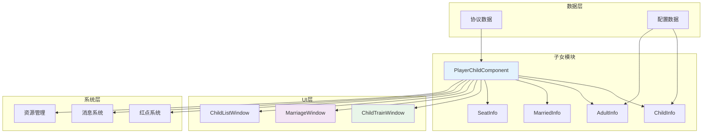
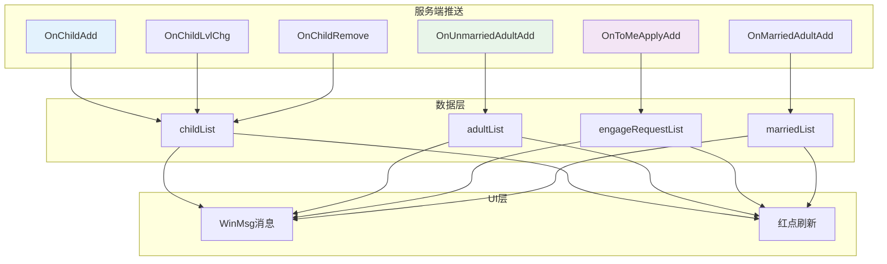
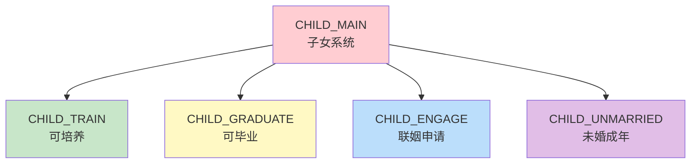

# 子女系统 - 客户端开发

## 模块架构

### 目录结构

```
GameComponent/Child/
├── ChildInfo.cs                   # 子女信息类
├── AdultInfo.cs                   # 成年信息类
├── MarriedInfo.cs                 # 已婚信息类
├── UnmarriedInfo.cs               # 未婚信息类
├── AdultEngageRequestInfo.cs      # 联姻申请信息类
├── SeatInfo.cs                    # 座位信息类
├── PoolSimpleAdultInfo.cs         # 池中成年简要信息类
├── Component/
│   ├── PlayerChildComponent.cs    # 子女组件主类
│   ├── PlayerChildComponent_RedTipDealer.cs   # 红点处理
│   └── PlayerChildComponent_ReadEngageRequestSaver.cs  # 申请缓存
└── _IChildInfo.cs                 # 子女信息接口
```

### 模块依赖关系



---

## 一、核心数据类

### ChildInfo - 子女信息类

```csharp
/// <summary>
/// 子女信息类
/// </summary>
public class ChildInfo : _IChildInfo
{
    private long _m_childId;
    private int _m_cfgId;
    private string _m_name;
    private int _m_gender;
    private int _m_level;
    private int _m_exp;
    private int _m_talent;
    private int _m_state;

    /// <summary>子女ID</summary>
    public long childId { get { return _m_childId; } }

    /// <summary>配置ID</summary>
    public int cfgId { get { return _m_cfgId; } }

    /// <summary>名称</summary>
    public string name { get { return _m_name; } }

    /// <summary>性别 (1男 2女)</summary>
    public int gender { get { return _m_gender; } }

    /// <summary>等级</summary>
    public int level { get { return _m_level; } }

    /// <summary>经验</summary>
    public int exp { get { return _m_exp; } }

    /// <summary>天赋</summary>
    public int talent { get { return _m_talent; } }

    /// <summary>状态 (1幼年 2成年 3已婚)</summary>
    public int state { get { return _m_state; } }

    /// <summary>是否成年</summary>
    public bool isAdult { get { return _m_state >= (int)EChildState.ADULT; } }

    /// <summary>是否满级</summary>
    public bool isMaxLevel
    {
        get
        {
            ChildRefObj childRef = GRefdataCoreMgr.instance.childRefCore.getRef(_m_cfgId);
            return childRef != null && _m_level >= childRef.max_level;
        }
    }

    /// <summary>获取配置</summary>
    public ChildRefObj getRef()
    {
        return GRefdataCoreMgr.instance.childRefCore.getRef(_m_cfgId);
    }

    /// <summary>获取升级所需经验</summary>
    public int getNeedExp()
    {
        ChildLevelRefObj levelRef = GRefdataCoreMgr.instance.childLevelRefCore.getRef(_m_level);
        return levelRef != null ? levelRef.need_exp : 0;
    }

    /// <summary>获取经验进度 (0-1)</summary>
    public float getExpProgress()
    {
        int needExp = getNeedExp();
        return needExp > 0 ? (float)_m_exp / needExp : 0f;
    }

    /// <summary>更新数据</summary>
    public void updateInfo(Child_ServerInfo serverInfo)
    {
        _m_childId = serverInfo.getChildId();
        _m_cfgId = serverInfo.getCfgId();
        _m_name = serverInfo.getName();
        _m_gender = serverInfo.getGender();
        _m_level = serverInfo.getLevel();
        _m_exp = serverInfo.getExp();
        _m_talent = serverInfo.getTalent();
        _m_state = serverInfo.getState();
    }

    /// <summary>更新等级信息</summary>
    public void updateLevel(int level, int exp, int talent)
    {
        _m_level = level;
        _m_exp = exp;
        _m_talent = talent;
    }

    /// <summary>更新名称</summary>
    public void updateName(string name)
    {
        _m_name = name;
    }
}
```

### AdultInfo - 成年子女信息类

```csharp
/// <summary>
/// 成年子女信息类
/// </summary>
public class AdultInfo : _IChildInfo
{
    private long _m_adultId;
    private int _m_childCfgId;
    private string _m_name;
    private int _m_gender;
    private int _m_talent;
    private int _m_marryState;

    /// <summary>成年ID</summary>
    public long adultId { get { return _m_adultId; } }

    /// <summary>子女配置ID</summary>
    public int childCfgId { get { return _m_childCfgId; } }

    /// <summary>名称</summary>
    public string name { get { return _m_name; } }

    /// <summary>性别</summary>
    public int gender { get { return _m_gender; } }

    /// <summary>天赋</summary>
    public int talent { get { return _m_talent; } }

    /// <summary>婚姻状态 (0未婚 1联姻中 2已婚)</summary>
    public int marryState { get { return _m_marryState; } }

    /// <summary>是否未婚</summary>
    public bool isUnmarried { get { return _m_marryState == (int)EMarriageState.UNMARRIED; } }

    /// <summary>是否已婚</summary>
    public bool isMarried { get { return _m_marryState == (int)EMarriageState.MARRIED; } }

    /// <summary>更新数据</summary>
    public void updateInfo(Adult_ServerInfo serverInfo)
    {
        _m_adultId = serverInfo.getAdultId();
        _m_childCfgId = serverInfo.getChildCfgId();
        _m_name = serverInfo.getName();
        _m_gender = serverInfo.getGender();
        _m_talent = serverInfo.getTalent();
        _m_marryState = serverInfo.getMarryState();
    }

    /// <summary>更新婚姻状态</summary>
    public void updateMarryState(int marryState)
    {
        _m_marryState = marryState;
    }
}
```

### MarriedInfo - 已婚信息类

```csharp
/// <summary>
/// 已婚信息类
/// </summary>
public class MarriedInfo
{
    private long _m_adultId;
    private int _m_childCfgId;
    private string _m_name;
    private int _m_gender;
    private int _m_talent;
    private long _m_spousePlayerId;
    private string _m_spousePlayerName;
    private long _m_spouseAdultId;
    private long _m_marryTime;

    public long adultId { get { return _m_adultId; } }
    public string name { get { return _m_name; } }
    public int gender { get { return _m_gender; } }
    public int talent { get { return _m_talent; } }
    public long spousePlayerId { get { return _m_spousePlayerId; } }
    public string spousePlayerName { get { return _m_spousePlayerName; } }
    public long spouseAdultId { get { return _m_spouseAdultId; } }
    public long marryTime { get { return _m_marryTime; } }

    /// <summary>更新数据</summary>
    public void updateInfo(Married_ServerInfo serverInfo)
    {
        _m_adultId = serverInfo.getAdultId();
        _m_childCfgId = serverInfo.getChildCfgId();
        _m_name = serverInfo.getName();
        _m_gender = serverInfo.getGender();
        _m_talent = serverInfo.getTalent();
        _m_spousePlayerId = serverInfo.getSpousePlayerId();
        _m_spousePlayerName = serverInfo.getSpousePlayerName();
        _m_spouseAdultId = serverInfo.getSpouseAdultId();
        _m_marryTime = serverInfo.getMarryTime();
    }
}
```

### AdultEngageRequestInfo - 联姻申请信息类

```csharp
/// <summary>
/// 联姻申请信息类
/// </summary>
public class AdultEngageRequestInfo
{
    private long _m_requestId;
    private long _m_fromPlayerId;
    private string _m_fromPlayerName;
    private long _m_fromAdultId;
    private string _m_fromAdultName;
    private int _m_fromAdultGender;
    private int _m_fromAdultTalent;
    private long _m_createTime;
    private long _m_expireTime;

    public long requestId { get { return _m_requestId; } }
    public long fromPlayerId { get { return _m_fromPlayerId; } }
    public string fromPlayerName { get { return _m_fromPlayerName; } }
    public long fromAdultId { get { return _m_fromAdultId; } }
    public string fromAdultName { get { return _m_fromAdultName; } }
    public int fromAdultGender { get { return _m_fromAdultGender; } }
    public int fromAdultTalent { get { return _m_fromAdultTalent; } }
    public long createTime { get { return _m_createTime; } }
    public long expireTime { get { return _m_expireTime; } }

    /// <summary>是否已过期</summary>
    public bool isExpired
    {
        get { return TimeUtils.GetServerTimeMs() >= _m_expireTime; }
    }

    /// <summary>剩余时间(秒)</summary>
    public int remainSeconds
    {
        get
        {
            long remain = (_m_expireTime - TimeUtils.GetServerTimeMs()) / 1000;
            return remain > 0 ? (int)remain : 0;
        }
    }

    /// <summary>更新数据</summary>
    public void updateInfo(EngageRequest_ServerInfo serverInfo)
    {
        _m_requestId = serverInfo.getRequestId();
        _m_fromPlayerId = serverInfo.getFromPlayerId();
        _m_fromPlayerName = serverInfo.getFromPlayerName();
        _m_fromAdultId = serverInfo.getFromAdultId();
        _m_fromAdultName = serverInfo.getFromAdultName();
        _m_fromAdultGender = serverInfo.getFromAdultGender();
        _m_fromAdultTalent = serverInfo.getFromAdultTalent();
        _m_createTime = serverInfo.getCreateTime();
        _m_expireTime = serverInfo.getExpireTime();
    }
}
```

---

## 二、PlayerChildComponent 组件

### 类定义

```csharp
/// <summary>
/// 子女组件
/// </summary>
public class PlayerChildComponent : _ANPBasicPlayerComponent
{
    // 子女列表
    private List<ChildInfo> _m_childList = new List<ChildInfo>();

    // 成年子女列表
    private List<AdultInfo> _m_adultList = new List<AdultInfo>();

    // 已婚列表
    private List<MarriedInfo> _m_marriedList = new List<MarriedInfo>();

    // 联姻申请列表
    private List<AdultEngageRequestInfo> _m_engageRequestList = new List<AdultEngageRequestInfo>();

    // 座位列表
    private List<SeatInfo> _m_seatList = new List<SeatInfo>();

    // 是否拒绝联姻
    private bool _m_isRefuseMarry = false;

    /// <summary>获取子女列表</summary>
    public List<ChildInfo> childList { get { return _m_childList; } }

    /// <summary>获取成年子女列表</summary>
    public List<AdultInfo> adultList { get { return _m_adultList; } }

    /// <summary>获取已婚列表</summary>
    public List<MarriedInfo> marriedList { get { return _m_marriedList; } }

    /// <summary>获取联姻申请列表</summary>
    public List<AdultEngageRequestInfo> engageRequestList { get { return _m_engageRequestList; } }

    /// <summary>获取座位列表</summary>
    public List<SeatInfo> seatList { get { return _m_seatList; } }

    /// <summary>获取未婚成年列表</summary>
    public List<AdultInfo> unmarriedAdultList
    {
        get { return _m_adultList.FindAll(a => a.isUnmarried); }
    }

    /// <summary>是否拒绝联姻</summary>
    public bool isRefuseMarry { get { return _m_isRefuseMarry; } }

    #region 单例
    private static PlayerChildComponent _instance;
    public static PlayerChildComponent instance
    {
        get
        {
            if (_instance == null)
            {
                _instance = new PlayerChildComponent();
            }
            return _instance;
        }
    }
    #endregion
}
```

### 查询方法

```csharp
/// <summary>
/// 获取指定子女
/// </summary>
public ChildInfo getChildById(long childId)
{
    return _m_childList.Find(c => c.childId == childId);
}

/// <summary>
/// 获取指定成年子女
/// </summary>
public AdultInfo getAdultById(long adultId)
{
    return _m_adultList.Find(a => a.adultId == adultId);
}

/// <summary>
/// 获取指定已婚信息
/// </summary>
public MarriedInfo getMarriedById(long adultId)
{
    return _m_marriedList.Find(m => m.adultId == adultId);
}

/// <summary>
/// 获取指定联姻申请
/// </summary>
public AdultEngageRequestInfo getEngageRequestById(long requestId)
{
    return _m_engageRequestList.Find(r => r.requestId == requestId);
}

/// <summary>
/// 获取指定座位
/// </summary>
public SeatInfo getSeatById(int seatId)
{
    return _m_seatList.Find(s => s.seatId == seatId);
}

/// <summary>
/// 获取可培养的子女列表
/// </summary>
public List<ChildInfo> getTrainableChildList()
{
    return _m_childList.FindAll(c => !c.isAdult && !c.isMaxLevel);
}

/// <summary>
/// 获取可毕业的子女列表
/// </summary>
public List<ChildInfo> getGraduateableChildList()
{
    return _m_childList.FindAll(c => c.isMaxLevel);
}

/// <summary>
/// 获取子女数量
/// </summary>
public int getChildCount()
{
    return _m_childList.Count;
}

/// <summary>
/// 获取成年子女数量
/// </summary>
public int getAdultCount()
{
    return _m_adultList.Count;
}

/// <summary>
/// 获取联姻申请数量
/// </summary>
public int getEngageRequestCount()
{
    return _m_engageRequestList.Count;
}
```

### 请求方法

```csharp
/// <summary>
/// 请求设置子女名称
/// </summary>
public void reqSetChildName(long childId, string name, Action callback)
{
    NPGSClientListener.sendRequest(
        NPGSWriter_014_ChildOp.make_001_ReqSetChildName(childId, name),
        new CommonErrCodeRequestCallbackProtocolDealer<GS2GC_014_001_RetSetChildName>((msg) =>
        {
            if (msg.errCode == 0)
            {
                var child = getChildById(childId);
                if (child != null)
                {
                    child.updateName(name);
                }
                callback?.Invoke();
            }
            else
            {
                showError(msg.errCode);
            }
        }));
}

/// <summary>
/// 请求培养子女
/// </summary>
public void reqTrainChild(long childId, int trainType, Action callback)
{
    NPGSClientListener.sendRequest(
        NPGSWriter_014_ChildOp.make_002_ReqTrainChild(childId, trainType),
        new CommonErrCodeRequestCallbackProtocolDealer<GS2GC_014_002_RetTrainChild>((msg) =>
        {
            if (msg.errCode == 0)
            {
                var child = getChildById(childId);
                if (child != null)
                {
                    child.updateLevel(msg.level, msg.exp, msg.talent);
                }
                callback?.Invoke();
            }
            else
            {
                showError(msg.errCode);
            }
        }));
}

/// <summary>
/// 请求子女毕业
/// </summary>
public void reqSetChildGraduate(long childId, Action<AdultInfo> callback)
{
    NPGSClientListener.sendRequest(
        NPGSWriter_014_ChildOp.make_004_ReqSetChildGraduate(childId),
        new CommonErrCodeRequestCallbackProtocolDealer<GS2GC_014_004_RetSetChildGraduate>((msg) =>
        {
            if (msg.errCode == 0)
            {
                // 子女列表会通过推送更新
                callback?.Invoke(null);
            }
            else
            {
                showError(msg.errCode);
            }
        }));
}

/// <summary>
/// 请求获取未婚成年列表
/// </summary>
public void reqGetUnMarriedAdult(Action callback)
{
    NPGSClientListener.sendRequest(
        NPGSWriter_014_ChildOp.make_006_ReqGetUnMarriedAdult(),
        new CommonErrCodeRequestCallbackProtocolDealer<GS2GC_014_006_RetGetUnMarriedAdult>((msg) =>
        {
            if (msg.errCode == 0)
            {
                _m_adultList.Clear();
                foreach (var info in msg.adultList)
                {
                    var adult = new AdultInfo();
                    adult.updateInfo(info);
                    _m_adultList.Add(adult);
                }
                callback?.Invoke();
            }
        }));
}

/// <summary>
/// 请求申请联姻
/// </summary>
public void reqApplyToPlayer(long targetPlayerId, long myAdultId, Action callback)
{
    NPGSClientListener.sendRequest(
        NPGSWriter_014_ChildOp.make_013_ReqApplyToPlayer(targetPlayerId, myAdultId),
        new CommonErrCodeRequestCallbackProtocolDealer<GS2GC_014_013_RetApplyToPlayer>((msg) =>
        {
            if (msg.errCode == 0)
            {
                callback?.Invoke();
            }
            else
            {
                showError(msg.errCode);
            }
        }));
}

/// <summary>
/// 请求同意联姻
/// </summary>
public void reqAgreeToMeApply(long requestId, long myAdultId, Action callback)
{
    NPGSClientListener.sendRequest(
        NPGSWriter_014_ChildOp.make_011_ReqAgreeToMeApply(requestId, myAdultId),
        new CommonErrCodeRequestCallbackProtocolDealer<GS2GC_014_011_RetAgreeToMeApply>((msg) =>
        {
            if (msg.errCode == 0)
            {
                callback?.Invoke();
            }
            else
            {
                showError(msg.errCode);
            }
        }));
}

/// <summary>
/// 请求拒绝联姻
/// </summary>
public void reqRefuseToMeApply(long requestId, Action callback)
{
    NPGSClientListener.sendRequest(
        NPGSWriter_014_ChildOp.make_009_ReqRefuseToMeApply(requestId),
        new CommonErrCodeRequestCallbackProtocolDealer<GS2GC_014_009_RetRefuseToMeApply>((msg) =>
        {
            if (msg.errCode == 0)
            {
                callback?.Invoke();
            }
        }));
}

/// <summary>
/// 请求一键拒绝
/// </summary>
public void reqAkeyRefuseToMeApply(Action callback)
{
    NPGSClientListener.sendRequest(
        NPGSWriter_014_ChildOp.make_010_ReqAkeyRefuseToMeApply(),
        new CommonErrCodeRequestCallbackProtocolDealer<GS2GC_014_010_RetAkeyRefuseToMeApply>((msg) =>
        {
            if (msg.errCode == 0)
            {
                callback?.Invoke();
            }
        }));
}

/// <summary>
/// 请求随机获得子女
/// </summary>
public void reqRandomGainChild(int seatId, Action<ChildInfo> callback)
{
    NPGSClientListener.sendRequest(
        NPGSWriter_014_ChildOp.make_019_ReqRandomGainChild(seatId),
        new CommonErrCodeRequestCallbackProtocolDealer<GS2GC_014_019_RetRandomGainChild>((msg) =>
        {
            if (msg.errCode == 0)
            {
                // 子女会通过推送添加
                callback?.Invoke(null);
            }
            else
            {
                showError(msg.errCode);
            }
        }));
}

/// <summary>
/// 请求设置拒绝联姻状态
/// </summary>
public void reqSetRefuseMarry(bool isRefuse, Action callback)
{
    NPGSClientListener.sendRequest(
        NPGSWriter_014_ChildOp.make_020_ReqSetRefuseMarry(isRefuse),
        new CommonErrCodeRequestCallbackProtocolDealer<GS2GC_014_020_RetSetRefuseMarry>((msg) =>
        {
            if (msg.errCode == 0)
            {
                _m_isRefuseMarry = msg.isRefuse;
                callback?.Invoke();
            }
        }));
}
```

---

## 三、协议对接

### 协议注册

```csharp
/// <summary>
/// 注册协议监听
/// </summary>
public void registerProtocolListener()
{
    // 子女添加
    NPGSClientListener.registProtocolListener<GS2GC_014_050_OnChildAdd>(onChildAdd);

    // 子女名称变化
    NPGSClientListener.registProtocolListener<GS2GC_014_051_OnChildNameChg>(onChildNameChg);

    // 子女等级变化
    NPGSClientListener.registProtocolListener<GS2GC_014_052_OnChildLvlChg>(onChildLvlChg);

    // 座位变化
    NPGSClientListener.registProtocolListener<GS2GC_014_053_OnSeatChg>(onSeatChg);

    // 未婚成年添加
    NPGSClientListener.registProtocolListener<GS2GC_014_054_OnUnmarriedAdultAdd>(onUnmarriedAdultAdd);

    // 已婚成年添加
    NPGSClientListener.registProtocolListener<GS2GC_014_055_OnMarriedAdultAdd>(onMarriedAdultAdd);

    // 收到联姻申请
    NPGSClientListener.registProtocolListener<GS2GC_014_056_OnToMeApplyAdd>(onToMeApplyAdd);

    // 子女移除
    NPGSClientListener.registProtocolListener<GS2GC_014_057_OnChildRemove>(onChildRemove);

    // 联姻申请删除
    NPGSClientListener.registProtocolListener<GS2GC_014_058_OnToMeApplyDel>(onToMeApplyDel);

    // 未婚成年状态变化
    NPGSClientListener.registProtocolListener<GS2GC_014_059_OnUnmarriedAdultStatusChg>(onUnmarriedAdultStatusChg);

    // 联姻申请清空
    NPGSClientListener.registProtocolListener<GS2GC_014_060_OnToMeApplyClear>(onToMeApplyClear);
}
```

### 协议处理

```csharp
/// <summary>
/// 接收子女添加通知
/// </summary>
private void onChildAdd(GS2GC_014_050_OnChildAdd msg)
{
    var childInfo = new ChildInfo();
    childInfo.updateInfo(msg.getChildInfo());
    _m_childList.Add(childInfo);

    // 发送消息通知UI刷新
    WinMsg.SendMsg(WinMsgType.ON_CHILD_ADD, childInfo);

    // 刷新红点
    _refreshRedTip();
}

/// <summary>
/// 接收子女名称变化
/// </summary>
private void onChildNameChg(GS2GC_014_051_OnChildNameChg msg)
{
    var child = getChildById(msg.getChildId());
    if (child != null)
    {
        child.updateName(msg.getName());
        WinMsg.SendMsg(WinMsgType.ON_CHILD_NAME_CHG, child);
    }
}

/// <summary>
/// 接收子女等级变化
/// </summary>
private void onChildLvlChg(GS2GC_014_052_OnChildLvlChg msg)
{
    var child = getChildById(msg.getChildId());
    if (child != null)
    {
        child.updateLevel(msg.getLevel(), msg.getExp(), msg.getTalent());
        WinMsg.SendMsg(WinMsgType.ON_CHILD_LVL_CHG, child);
    }
}

/// <summary>
/// 接收座位变化
/// </summary>
private void onSeatChg(GS2GC_014_053_OnSeatChg msg)
{
    var seat = getSeatById(msg.getSeatId());
    if (seat != null)
    {
        seat.updateEnergy(msg.getEnergy());
        WinMsg.SendMsg(WinMsgType.ON_SEAT_CHG, seat);
    }
}

/// <summary>
/// 接收未婚成年添加
/// </summary>
private void onUnmarriedAdultAdd(GS2GC_014_054_OnUnmarriedAdultAdd msg)
{
    var adult = new AdultInfo();
    adult.updateInfo(msg.getAdultInfo());
    _m_adultList.Add(adult);

    WinMsg.SendMsg(WinMsgType.ON_UNMARRIED_ADULT_ADD, adult);
    _refreshRedTip();
}

/// <summary>
/// 接收已婚成年添加
/// </summary>
private void onMarriedAdultAdd(GS2GC_014_055_OnMarriedAdultAdd msg)
{
    var married = new MarriedInfo();
    married.updateInfo(msg.getMarriedInfo());
    _m_marriedList.Add(married);

    WinMsg.SendMsg(WinMsgType.ON_MARRIED_ADULT_ADD, married);
    _refreshRedTip();
}

/// <summary>
/// 接收联姻申请
/// </summary>
private void onToMeApplyAdd(GS2GC_014_056_OnToMeApplyAdd msg)
{
    var request = new AdultEngageRequestInfo();
    request.updateInfo(msg.getRequestInfo());
    _m_engageRequestList.Add(request);

    // 刷新红点
    _refreshRedTip();
    WinMsg.SendMsg(WinMsgType.ON_ENGAGE_REQUEST_ADD, request);
}

/// <summary>
/// 接收子女移除
/// </summary>
private void onChildRemove(GS2GC_014_057_OnChildRemove msg)
{
    var child = getChildById(msg.getChildId());
    if (child != null)
    {
        _m_childList.Remove(child);
        WinMsg.SendMsg(WinMsgType.ON_CHILD_REMOVE, msg.getChildId());
    }
}

/// <summary>
/// 接收联姻申请删除
/// </summary>
private void onToMeApplyDel(GS2GC_014_058_OnToMeApplyDel msg)
{
    var request = getEngageRequestById(msg.getRequestId());
    if (request != null)
    {
        _m_engageRequestList.Remove(request);
        WinMsg.SendMsg(WinMsgType.ON_ENGAGE_REQUEST_DEL, msg.getRequestId());
        _refreshRedTip();
    }
}

/// <summary>
/// 接收未婚成年状态变化
/// </summary>
private void onUnmarriedAdultStatusChg(GS2GC_014_059_OnUnmarriedAdultStatusChg msg)
{
    var adult = getAdultById(msg.getAdultId());
    if (adult != null)
    {
        adult.updateMarryState(msg.getMarryState());
        WinMsg.SendMsg(WinMsgType.ON_ADULT_STATUS_CHG, adult);
    }
}

/// <summary>
/// 接收联姻申请清空
/// </summary>
private void onToMeApplyClear(GS2GC_014_060_OnToMeApplyClear msg)
{
    _m_engageRequestList.Clear();
    WinMsg.SendMsg(WinMsgType.ON_ENGAGE_REQUEST_CLEAR);
    _refreshRedTip();
}
```

### 数据流程图



---

## 四、UI 窗口实现

### 子女培养界面

```csharp
/// <summary>
/// 子女培养界面
/// </summary>
public class ChildTrainWindow : BaseWindow
{
    [SerializeField] private Text _nameText;
    [SerializeField] private Text _levelText;
    [SerializeField] private Text _expText;
    [SerializeField] private Slider _expSlider;
    [SerializeField] private Text _talentText;
    [SerializeField] private Transform _trainBtnGroup;

    private ChildInfo _currentChild;
    private List<TrainBtnItem> _trainBtnItems = new List<TrainBtnItem>();

    public void setChildInfo(ChildInfo childInfo)
    {
        _currentChild = childInfo;
        refreshUI();
    }

    private void refreshUI()
    {
        if (_currentChild == null) return;

        _nameText.text = _currentChild.name;
        _levelText.text = $"Lv.{_currentChild.level}";
        _expText.text = $"{_currentChild.exp}/{_currentChild.getNeedExp()}";
        _expSlider.value = _currentChild.getExpProgress();
        _talentText.text = $"天赋: {_currentChild.talent}";

        refreshTrainBtns();
    }

    private void refreshTrainBtns()
    {
        // 获取所有培养配置
        var trainRefs = GRefdataCoreMgr.instance.childTrainRefCore.refList;

        // 清空旧按钮
        foreach (var item in _trainBtnItems)
        {
            Destroy(item.gameObject);
        }
        _trainBtnItems.Clear();

        // 创建新按钮
        foreach (var trainRef in trainRefs)
        {
            // 检查品质要求
            if (trainRef.quality_req > 0 && _currentChild.getRef().quality < trainRef.quality_req)
                continue;

            // 检查VIP要求
            if (trainRef.vip_level > 0 && PlayerInfoComponent.instance.vipLevel < trainRef.vip_level)
                continue;

            var item = Instantiate(_trainBtnItemPrefab, _trainBtnGroup).GetComponent<TrainBtnItem>();
            item.setData(trainRef, _currentChild);
            item.onClick += onTrainBtnClick;
            _trainBtnItems.Add(item);
        }
    }

    private void onTrainBtnClick(int trainType)
    {
        if (_currentChild == null) return;

        // 检查是否满级
        if (_currentChild.isMaxLevel)
        {
            showMessage("子女已满级，无法继续培养");
            return;
        }

        PlayerChildComponent.instance.reqTrainChild(_currentChild.childId, trainType, () =>
        {
            refreshUI();
            showTrainEffect();
        });
    }

    /// <summary>
    /// 毕业
    /// </summary>
    public void onClickGraduate()
    {
        if (_currentChild == null) return;

        if (!_currentChild.isMaxLevel)
        {
            showMessage("等级不足，无法毕业");
            return;
        }

        PlayerChildComponent.instance.reqSetChildGraduate(_currentChild.childId, (adult) =>
        {
            closeWindow();
        });
    }

    /// <summary>
    /// 显示培养特效
    /// </summary>
    private void showTrainEffect()
    {
        // 播放培养成功特效
        EffectManager.instance.playEffect("train_success", transform.position);

        // 震动反馈
        VibrationManager.instance.vibrate();
    }

    private void OnEnable()
    {
        WinMsg.RegisterMsg(WinMsgType.ON_CHILD_LVL_CHG, onChildLvlChg);
    }

    private void OnDisable()
    {
        WinMsg.UnregisterMsg(WinMsgType.ON_CHILD_LVL_CHG, onChildLvlChg);
    }

    private void onChildLvlChg(object data)
    {
        if (data is ChildInfo child && _currentChild != null && child.childId == _currentChild.childId)
        {
            refreshUI();
        }
    }
}
```

### 联姻界面

```csharp
/// <summary>
/// 联姻界面
/// </summary>
public class MarriageWindow : BaseWindow
{
    [SerializeField] private Transform _requestListContainer;
    [SerializeField] private Transform _adultListContainer;
    [SerializeField] private GameObject _requestItemPrefab;
    [SerializeField] private GameObject _adultItemPrefab;

    private List<AdultEngageRequestInfo> _requestList = new List<AdultEngageRequestInfo>();
    private AdultInfo _selectedAdult;

    public void init()
    {
        // 请求获取申请列表
        requestEngageList();

        // 刷新成年子女列表
        refreshAdultList();
    }

    /// <summary>
    /// 请求联姻申请列表
    /// </summary>
    public void requestEngageList()
    {
        PlayerChildComponent.instance.reqGetToMeApply(() =>
        {
            _requestList = PlayerChildComponent.instance.engageRequestList;
            refreshRequestList();
        });
    }

    /// <summary>
    /// 刷新申请列表
    /// </summary>
    private void refreshRequestList()
    {
        // 清空旧列表
        foreach (Transform child in _requestListContainer)
        {
            Destroy(child.gameObject);
        }

        // 创建新列表
        foreach (var request in _requestList)
        {
            var item = Instantiate(_requestItemPrefab, _requestListContainer).GetComponent<EngageRequestItem>();
            item.setData(request);
            item.onAgree += () => onAgreeRequest(request);
            item.onRefuse += () => onRefuseRequest(request.requestId);
        }

        // 更新红点
        RedTipMgr.instance.setCountByRefRedTipId(RedTipId.CHILD_ENGAGE, _requestList.Count);
    }

    /// <summary>
    /// 刷新成年子女列表
    /// </summary>
    private void refreshAdultList()
    {
        foreach (Transform child in _adultListContainer)
        {
            Destroy(child.gameObject);
        }

        var adultList = PlayerChildComponent.instance.unmarriedAdultList;
        foreach (var adult in adultList)
        {
            var item = Instantiate(_adultItemPrefab, _adultListContainer).GetComponent<AdultSelectItem>();
            item.setData(adult);
            item.onClick += () => onSelectAdult(adult);
        }
    }

    /// <summary>
    /// 选择成年子女
    /// </summary>
    private void onSelectAdult(AdultInfo adult)
    {
        _selectedAdult = adult;
        // 更新UI选中状态
    }

    /// <summary>
    /// 同意联姻
    /// </summary>
    private void onAgreeRequest(AdultEngageRequestInfo request)
    {
        if (_selectedAdult == null)
        {
            showMessage("请先选择要联姻的成年子女");
            return;
        }

        PlayerChildComponent.instance.reqAgreeToMeApply(request.requestId, _selectedAdult.adultId, () =>
        {
            refreshUI();
            showMarriageEffect();
        });
    }

    /// <summary>
    /// 拒绝联姻
    /// </summary>
    private void onRefuseRequest(long requestId)
    {
        PlayerChildComponent.instance.reqRefuseToMeApply(requestId, () =>
        {
            _requestList.RemoveAll(r => r.requestId == requestId);
            refreshRequestList();
        });
    }

    /// <summary>
    /// 一键拒绝
    /// </summary>
    public void onClickRefuseAll()
    {
        PlayerChildComponent.instance.reqAkeyRefuseToMeApply(() =>
        {
            _requestList.Clear();
            refreshRequestList();
        });
    }

    /// <summary>
    /// 显示联姻成功特效
    /// </summary>
    private void showMarriageEffect()
    {
        EffectManager.instance.playEffect("marriage_success", transform.position);
    }

    private void OnEnable()
    {
        WinMsg.RegisterMsg(WinMsgType.ON_ENGAGE_REQUEST_ADD, onEngageRequestAdd);
        WinMsg.RegisterMsg(WinMsgType.ON_ENGAGE_REQUEST_DEL, onEngageRequestDel);
    }

    private void OnDisable()
    {
        WinMsg.UnregisterMsg(WinMsgType.ON_ENGAGE_REQUEST_ADD, onEngageRequestAdd);
        WinMsg.UnregisterMsg(WinMsgType.ON_ENGAGE_REQUEST_DEL, onEngageRequestDel);
    }

    private void onEngageRequestAdd(object data)
    {
        if (data is AdultEngageRequestInfo request)
        {
            _requestList.Add(request);
            refreshRequestList();
        }
    }

    private void onEngageRequestDel(object data)
    {
        if (data is long requestId)
        {
            _requestList.RemoveAll(r => r.requestId == requestId);
            refreshRequestList();
        }
    }
}
```

---

## 五、红点系统

### 红点刷新逻辑

```csharp
/// <summary>
/// 刷新红点
/// </summary>
private void _refreshRedTip()
{
    // 联姻申请红点
    int engageCount = _m_engageRequestList.Count;
    RedTipMgr.instance.setCountByRefRedTipId(RedTipId.CHILD_ENGAGE, engageCount);

    // 可培养红点
    int trainableCount = getTrainableChildList().Count;
    RedTipMgr.instance.setCountByRefRedTipId(RedTipId.CHILD_TRAIN, trainableCount);

    // 可毕业红点
    int graduateableCount = getGraduateableChildList().Count;
    RedTipMgr.instance.setCountByRefRedTipId(RedTipId.CHILD_GRADUATE, graduateableCount);

    // 未婚成年红点
    int unmarriedCount = unmarriedAdultList.Count;
    RedTipMgr.instance.setCountByRefRedTipId(RedTipId.CHILD_UNMARRIED, unmarriedCount);
}
```

### 红点定义

```csharp
/// <summary>
/// 子女系统红点ID
/// </summary>
public static class ChildRedTipId
{
    /// <summary>联姻申请</summary>
    public const int CHILD_ENGAGE = 14001;

    /// <summary>可培养</summary>
    public const int CHILD_TRAIN = 14002;

    /// <summary>可毕业</summary>
    public const int CHILD_GRADUATE = 14003;

    /// <summary>未婚成年</summary>
    public const int CHILD_UNMARRIED = 14004;

    /// <summary>子女系统总入口</summary>
    public const int CHILD_MAIN = 14000;
}
```

### 红点树结构



---

## 六、注意事项

### 1. 子女培养限制

```csharp
/// <summary>
/// 检查是否可以培养
/// </summary>
public bool canTrain(ChildInfo child, int trainType)
{
    // 状态检查
    if (child.isAdult)
    {
        showMessage("子女已成年，无法培养");
        return false;
    }

    // 满级检查
    if (child.isMaxLevel)
    {
        showMessage("子女已满级，无需培养");
        return false;
    }

    // 培养配置检查
    var trainRef = GRefdataCoreMgr.instance.childTrainRefCore.getRef(trainType);
    if (trainRef == null)
    {
        showMessage("培养配置不存在");
        return false;
    }

    // 品质要求检查
    if (trainRef.quality_req > 0 && child.getRef().quality < trainRef.quality_req)
    {
        showMessage($"品质不足，需要{trainRef.quality_req}品质");
        return false;
    }

    // VIP要求检查
    if (trainRef.vip_level > 0 && PlayerInfoComponent.instance.vipLevel < trainRef.vip_level)
    {
        showMessage($"VIP等级不足，需要VIP{trainRef.vip_level}");
        return false;
    }

    return true;
}
```

### 2. 联姻限制

```csharp
/// <summary>
/// 检查是否可以联姻
/// </summary>
public bool canMarry(AdultInfo adult)
{
    // 状态检查
    if (adult.isMarried)
    {
        showMessage("该成年子女已联姻");
        return false;
    }

    // 联姻配置检查
    var marriageRef = GRefdataCoreMgr.instance.childMarriageRefCore.getRef(1);
    if (marriageRef != null)
    {
        // 天赋要求检查
        if (marriageRef.require_talent > 0 && adult.talent < marriageRef.require_talent)
        {
            showMessage($"天赋不足，需要{marriageRef.require_talent}天赋");
            return false;
        }

        // VIP要求检查
        if (marriageRef.vip_level > 0 && PlayerInfoComponent.instance.vipLevel < marriageRef.vip_level)
        {
            showMessage($"VIP等级不足，需要VIP{marriageRef.vip_level}");
            return false;
        }
    }

    return true;
}
```

### 3. 申请过期处理

```csharp
/// <summary>
/// 获取有效申请列表
/// </summary>
public List<AdultEngageRequestInfo> getValidEngageRequestList()
{
    // 过滤已过期的申请
    return _m_engageRequestList.FindAll(r => !r.isExpired);
}

/// <summary>
/// 定时清理过期申请
/// </summary>
private IEnumerator cleanExpiredRequests()
{
    while (true)
    {
        yield return new WaitForSeconds(60f); // 每分钟检查一次

        var expiredList = _m_engageRequestList.FindAll(r => r.isExpired);
        foreach (var expired in expiredList)
        {
            _m_engageRequestList.Remove(expired);
        }

        if (expiredList.Count > 0)
        {
            _refreshRedTip();
        }
    }
}
```

---

## 七、性能优化

### 1. 列表缓存

```csharp
// 使用缓存避免频繁创建列表
private List<ChildInfo> _cachedTrainableList = new List<ChildInfo>();
private List<AdultInfo> _cachedUnmarriedList = new List<AdultInfo>();

public List<ChildInfo> getTrainableChildList()
{
    _cachedTrainableList.Clear();
    foreach (var child in _m_childList)
    {
        if (!child.isAdult && !child.isMaxLevel)
        {
            _cachedTrainableList.Add(child);
        }
    }
    return _cachedTrainableList;
}
```

### 2. 配置缓存

```csharp
// 缓存常用配置
private Dictionary<int, ChildTrainRefObj> _trainRefCache = new Dictionary<int, ChildTrainRefObj>();

public ChildTrainRefObj getTrainRef(int trainId)
{
    if (!_trainRefCache.TryGetValue(trainId, out var refObj))
    {
        refObj = GRefdataCoreMgr.instance.childTrainRefCore.getRef(trainId);
        if (refObj != null)
        {
            _trainRefCache[trainId] = refObj;
        }
    }
    return refObj;
}
```

### 3. 消息优化

```csharp
// 批量更新时避免多次刷新UI
private bool _isBatchUpdate = false;

public void beginBatchUpdate()
{
    _isBatchUpdate = true;
}

public void endBatchUpdate()
{
    _isBatchUpdate = false;
    refreshAllUI();
}
```

---

*文档生成时间: 2026-04-12*
*文档版本: v2.1.0*
