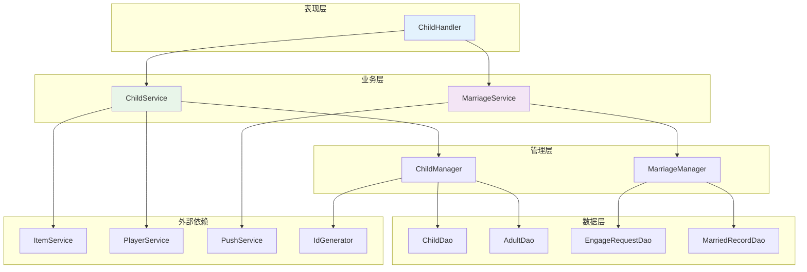
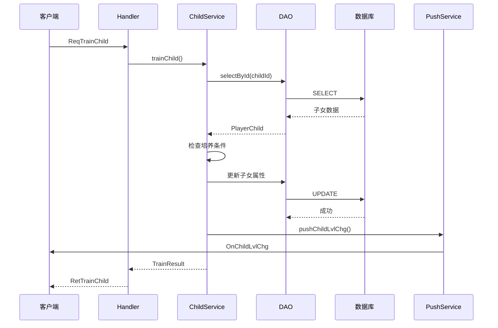
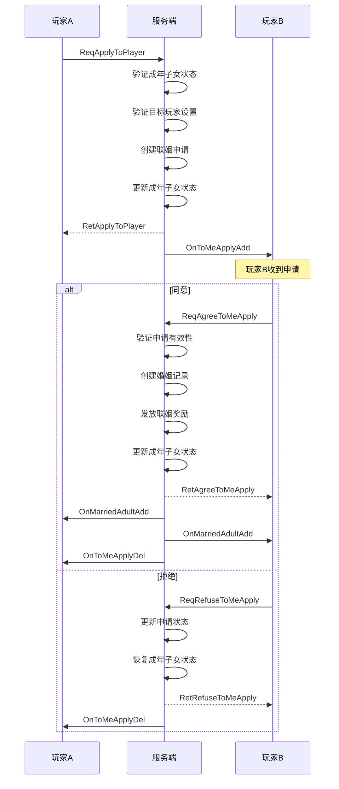

# 子女系统 - 服务端开发

## 模块架构

### 目录结构

```
GameServer/
├── ChildModule/
│   ├── ChildHandler.java         # 协议处理器
│   ├── ChildService.java         # 子女业务逻辑
│   ├── ChildManager.java         # 子女管理器
│   ├── MarriageService.java      # 联姻业务逻辑
│   ├── MarriageManager.java      # 联姻管理器
│   ├── ChildDao.java             # 子女数据访问层
│   ├── AdultDao.java             # 成年子女数据访问层
│   ├── EngageRequestDao.java     # 联姻申请数据访问层
│   └── MarriedRecordDao.java     # 婚姻记录数据访问层
```

### 模块依赖关系



---

## 一、数据存储

### 子女数据表 (player_child)

```sql
CREATE TABLE IF NOT EXISTS `player_child` (
    `id` bigint(20) NOT NULL COMMENT '子女ID (主键)',
    `player_id` bigint(20) NOT NULL COMMENT '玩家ID',
    `cfg_id` int(11) NOT NULL COMMENT '配置ID',
    `name` varchar(64) NOT NULL DEFAULT '' COMMENT '名称',
    `gender` int(11) NOT NULL DEFAULT '1' COMMENT '性别 (1男 2女)',
    `level` int(11) NOT NULL DEFAULT '1' COMMENT '等级',
    `exp` int(11) NOT NULL DEFAULT '0' COMMENT '经验',
    `talent` int(11) NOT NULL DEFAULT '50' COMMENT '天赋',
    `state` int(11) NOT NULL DEFAULT '1' COMMENT '状态 (1幼年 2成年 3已婚)',
    `create_time` datetime DEFAULT CURRENT_TIMESTAMP COMMENT '创建时间',
    `update_time` datetime DEFAULT CURRENT_TIMESTAMP ON UPDATE CURRENT_TIMESTAMP COMMENT '更新时间',
    PRIMARY KEY (`id`),
    KEY `idx_player_id` (`player_id`),
    KEY `idx_state` (`state`),
    KEY `idx_player_state` (`player_id`, `state`)
) COMMENT='玩家子女数据' engine=InnoDB DEFAULT CHARSET=utf8mb4;
```

### 联姻申请表 (engage_request)

```sql
CREATE TABLE IF NOT EXISTS `engage_request` (
    `id` bigint(20) NOT NULL COMMENT '申请ID (主键)',
    `from_player_id` bigint(20) NOT NULL COMMENT '申请玩家ID',
    `from_adult_id` bigint(20) NOT NULL COMMENT '申请方成年ID',
    `to_player_id` bigint(20) NOT NULL COMMENT '目标玩家ID',
    `to_adult_id` bigint(20) DEFAULT NULL COMMENT '目标成年ID（可选）',
    `status` int(11) NOT NULL DEFAULT '0' COMMENT '状态 (0待处理 1已同意 2已拒绝 3已过期 4已取消)',
    `create_time` datetime DEFAULT CURRENT_TIMESTAMP COMMENT '创建时间',
    `expire_time` datetime NOT NULL COMMENT '过期时间',
    PRIMARY KEY (`id`),
    KEY `idx_from_player` (`from_player_id`),
    KEY `idx_to_player` (`to_player_id`),
    KEY `idx_status` (`status`),
    KEY `idx_expire` (`expire_time`),
    KEY `idx_to_status` (`to_player_id`, `status`)
) COMMENT='联姻申请' engine=InnoDB DEFAULT CHARSET=utf8mb4;
```

### 已婚记录表 (married_record)

```sql
CREATE TABLE IF NOT EXISTS `married_record` (
    `id` bigint(20) NOT NULL AUTO_INCREMENT COMMENT '记录ID (主键)',
    `player_id` bigint(20) NOT NULL COMMENT '玩家ID',
    `adult_id` bigint(20) NOT NULL COMMENT '成年ID',
    `spouse_player_id` bigint(20) NOT NULL COMMENT '配偶玩家ID',
    `spouse_adult_id` bigint(20) NOT NULL COMMENT '配偶成年ID',
    `marry_time` datetime NOT NULL COMMENT '结婚时间',
    `create_time` datetime DEFAULT CURRENT_TIMESTAMP COMMENT '创建时间',
    PRIMARY KEY (`id`),
    KEY `idx_player_id` (`player_id`),
    KEY `idx_adult_id` (`adult_id`),
    KEY `idx_spouse_player` (`spouse_player_id`),
    KEY `idx_spouse_adult` (`spouse_adult_id`)
) COMMENT='婚姻记录' engine=InnoDB DEFAULT CHARSET=utf8mb4;
```

### 成年子女表 (player_adult)

```sql
CREATE TABLE IF NOT EXISTS `player_adult` (
    `id` bigint(20) NOT NULL COMMENT '成年ID (主键)',
    `player_id` bigint(20) NOT NULL COMMENT '玩家ID',
    `child_cfg_id` int(11) NOT NULL COMMENT '原子女配置ID',
    `name` varchar(64) NOT NULL DEFAULT '' COMMENT '名称',
    `gender` int(11) NOT NULL DEFAULT '1' COMMENT '性别',
    `talent` int(11) NOT NULL DEFAULT '50' COMMENT '天赋',
    `marry_state` int(11) NOT NULL DEFAULT '0' COMMENT '婚姻状态 (0未婚 1联姻中 2已婚)',
    `spouse_player_id` bigint(20) DEFAULT NULL COMMENT '配偶玩家ID',
    `spouse_adult_id` bigint(20) DEFAULT NULL COMMENT '配偶成年ID',
    `marry_time` datetime DEFAULT NULL COMMENT '结婚时间',
    `create_time` datetime DEFAULT CURRENT_TIMESTAMP COMMENT '创建时间',
    `update_time` datetime DEFAULT CURRENT_TIMESTAMP ON UPDATE CURRENT_TIMESTAMP COMMENT '更新时间',
    PRIMARY KEY (`id`),
    KEY `idx_player_id` (`player_id`),
    KEY `idx_marry_state` (`marry_state`),
    KEY `idx_player_marry` (`player_id`, `marry_state`)
) COMMENT='玩家成年子女数据' engine=InnoDB DEFAULT CHARSET=utf8mb4;
```

### 玩家座位表 (player_seat)

```sql
CREATE TABLE IF NOT EXISTS `player_seat` (
    `id` bigint(20) NOT NULL AUTO_INCREMENT COMMENT '自增ID (主键)',
    `player_id` bigint(20) NOT NULL COMMENT '玩家ID',
    `seat_id` int(11) NOT NULL COMMENT '座位配置ID',
    `energy` int(11) NOT NULL DEFAULT '0' COMMENT '当前能量',
    `is_unlocked` tinyint(1) NOT NULL DEFAULT '0' COMMENT '是否已解锁',
    `unlock_time` datetime DEFAULT NULL COMMENT '解锁时间',
    `create_time` datetime DEFAULT CURRENT_TIMESTAMP COMMENT '创建时间',
    `update_time` datetime DEFAULT CURRENT_TIMESTAMP ON UPDATE CURRENT_TIMESTAMP COMMENT '更新时间',
    PRIMARY KEY (`id`),
    UNIQUE KEY `uk_player_seat` (`player_id`, `seat_id`),
    KEY `idx_player_id` (`player_id`)
) COMMENT='玩家座位数据' engine=InnoDB DEFAULT CHARSET=utf8mb4;
```

---

## 二、核心服务实现

### ChildService - 子女业务服务

```java
@Service
public class ChildService {

    @Autowired
    private ChildDao childDao;

    @Autowired
    private AdultDao adultDao;

    @Autowired
    private ChildManager childManager;

    @Autowired
    private ItemService itemService;

    @Autowired
    private IdGenerator idGenerator;

    @Autowired
    private PushService pushService;

    /**
     * 培养子女
     */
    public TrainResult trainChild(long playerId, long childId, int trainType) {
        TrainResult result = new TrainResult();

        // 1. 获取培养配置
        ChildTrainRefObj trainRef = ChildTrainRefObj.getMgr().get(trainType);
        if (trainRef == null) {
            result.setError(CommErr.REF_NOT_FOUND, "培养配置不存在");
            return result;
        }

        // 2. 获取子女信息
        PlayerChild child = childDao.selectById(childId);
        if (child == null || child.getPlayerId() != playerId) {
            result.setError(ChildErr.CHILD_NOT_FOUND, "子女不存在");
            return result;
        }

        // 3. 检查状态
        if (child.getState() != EChildState.CHILD.getValue()) {
            result.setError(ChildErr.CHILD_ALREADY_ADULT, "子女已成年，无法培养");
            return result;
        }

        // 4. 检查品质要求
        ChildRefObj childRef = ChildRefObj.getMgr().get(child.getCfgId());
        if (trainRef.quality_req > 0 && childRef.quality < trainRef.quality_req) {
            result.setError(ChildErr.QUALITY_NOT_ENOUGH, "子女品质不足");
            return result;
        }

        // 5. 检查今日培养次数
        int todayCount = childManager.getChildTodayTrainCount(playerId, childId, trainType);
        if (trainRef.daily_limit > 0 && todayCount >= trainRef.daily_limit) {
            result.setError(ChildErr.TRAIN_LIMIT_EXCEEDED, "今日培养次数已用完");
            return result;
        }

        // 6. 扣除消耗
        if (!itemService.checkAndConsume(playerId, trainRef.cost_list, "子女培养")) {
            result.setError(CommErr.ITEM_NOT_ENOUGH, "道具不足");
            return result;
        }

        // 7. 增加经验和天赋
        int expAdd = trainRef.exp_add;
        int talentAdd = trainRef.talent_add;

        // 天赋加成比例计算
        if (trainRef.talent_add_ratio > 0) {
            talentAdd += child.getTalent() * trainRef.talent_add_ratio / 10000;
        }

        child.setExp(child.getExp() + expAdd);
        child.setTalent(Math.min(child.getTalent() + talentAdd, childRef.talent_max));

        // 8. 检查升级
        boolean levelChanged = checkLevelUp(child, childRef);

        // 9. 更新数据
        childDao.updateById(child);
        childManager.updateTodayTrainCount(playerId, childId, trainType);

        // 10. 推送通知
        if (levelChanged) {
            pushChildLvlChg(playerId, child);
        }

        result.setSuccess(child.getLevel(), child.getExp(), child.getTalent());
        return result;
    }

    /**
     * 检查升级
     */
    private boolean checkLevelUp(PlayerChild child, ChildRefObj childRef) {
        boolean levelChanged = false;

        while (child.getLevel() < childRef.max_level) {
            ChildLevelRefObj levelRef = ChildLevelRefObj.getMgr().get(child.getLevel());
            if (levelRef == null || child.getExp() < levelRef.need_exp) {
                break;
            }

            child.setExp(child.getExp() - levelRef.need_exp);
            child.setLevel(child.getLevel() + 1);
            levelChanged = true;
        }

        return levelChanged;
    }

    /**
     * 子女毕业
     */
    public GraduateResult graduateChild(long playerId, long childId) {
        GraduateResult result = new GraduateResult();

        // 1. 获取子女信息
        PlayerChild child = childDao.selectById(childId);
        if (child == null || child.getPlayerId() != playerId) {
            result.setError(ChildErr.CHILD_NOT_FOUND, "子女不存在");
            return result;
        }

        // 2. 检查等级
        ChildRefObj childRef = ChildRefObj.getMgr().get(child.getCfgId());
        if (child.getLevel() < childRef.max_level) {
            result.setError(ChildErr.CHILD_LEVEL_NOT_ENOUGH, "子女等级不足，无法毕业");
            return result;
        }

        // 3. 更新子女状态
        child.setState(EChildState.ADULT.getValue());
        childDao.updateById(child);

        // 4. 创建成年记录
        PlayerAdult adult = new PlayerAdult();
        adult.setAdultId(idGenerator.nextId());
        adult.setPlayerId(playerId);
        adult.setChildCfgId(child.getCfgId());
        adult.setName(child.getName());
        adult.setGender(child.getGender());
        adult.setTalent(child.getTalent());
        adult.setMarryState(EMarriageState.UNMARRIED.getValue());
        adultDao.insert(adult);

        // 5. 推送通知
        pushChildRemove(playerId, childId);
        pushUnmarriedAdultAdd(playerId, adult);

        result.setSuccess(adult);
        return result;
    }

    /**
     * 随机获得子女
     */
    public RandomChildResult randomGainChild(long playerId, int seatId) {
        RandomChildResult result = new RandomChildResult();

        // 1. 获取座位配置
        ChildSeatRefObj seatRef = ChildSeatRefObj.getMgr().get(seatId);
        if (seatRef == null) {
            result.setError(CommErr.REF_NOT_FOUND, "座位配置不存在");
            return result;
        }

        // 2. 检查座位是否解锁
        PlayerSeat seat = childManager.getPlayerSeat(playerId, seatId);
        if (seat == null || !seat.isUnlocked()) {
            result.setError(ChildErr.SEAT_NOT_UNLOCKED, "座位未解锁");
            return result;
        }

        // 3. 检查能量是否足够
        if (seat.getEnergy() < seatRef.energy_cost) {
            result.setError(ChildErr.ENERGY_NOT_ENOUGH, "能量不足");
            return result;
        }

        // 4. 检查子女槽位
        int childCount = childDao.countByPlayer(playerId);
        if (childCount >= seatRef.child_slot) {
            result.setError(ChildErr.CHILD_SLOT_FULL, "子女槽位已满");
            return result;
        }

        // 5. 扣除能量
        seat.setEnergy(seat.getEnergy() - seatRef.energy_cost);
        childManager.updatePlayerSeat(seat);

        // 6. 随机选择子女配置
        ChildRefObj childRef = randomSelectChild(seatRef.probability);

        // 7. 创建子女
        PlayerChild child = createChild(playerId, childRef);
        childDao.insert(child);

        // 8. 推送通知
        pushChildAdd(playerId, child);
        pushSeatChg(playerId, seat);

        result.setSuccess(child);
        return result;
    }

    /**
     * 根据概率随机选择子女配置
     */
    private ChildRefObj randomSelectChild(int baseProbability) {
        List<ChildRefObj> allChildRefs = ChildRefObj.getMgr().getAll();
        List<Pair<ChildRefObj, Integer>> weightedList = new ArrayList<>();

        // 计算权重
        int totalWeight = 0;
        for (ChildRefObj ref : allChildRefs) {
            int weight = ref.weight * getQualityWeight(ref.quality);
            weight = weight * baseProbability / 10000;
            weightedList.add(new Pair<>(ref, weight));
            totalWeight += weight;
        }

        // 随机选择
        int random = ThreadLocalRandom.current().nextInt(totalWeight);
        int currentSum = 0;
        for (Pair<ChildRefObj, Integer> pair : weightedList) {
            currentSum += pair.getSecond();
            if (random < currentSum) {
                return pair.getFirst();
            }
        }

        return weightedList.get(0).getFirst();
    }

    /**
     * 获取品质权重
     */
    private int getQualityWeight(int quality) {
        switch (quality) {
            case 1: return 60;  // 普通 60%
            case 2: return 25;  // 优秀 25%
            case 3: return 10;  // 稀有 10%
            case 4: return 4;   // 史诗 4%
            case 5: return 1;   // 传说 1%
            default: return 60;
        }
    }

    /**
     * 创建子女
     */
    private PlayerChild createChild(long playerId, ChildRefObj childRef) {
        PlayerChild child = new PlayerChild();
        child.setChildId(idGenerator.nextId());
        child.setPlayerId(playerId);
        child.setCfgId(childRef.child_id);
        child.setName(childRef.child_name);
        child.setGender(childRef.gender);
        child.setLevel(1);
        child.setExp(0);

        // 计算初始天赋（加入品质加成）
        int initTalent = childRef.talent_init;
        switch (childRef.quality) {
            case 2: initTalent = (int)(initTalent * 1.1); break;
            case 3: initTalent = (int)(initTalent * 1.2); break;
            case 4: initTalent = (int)(initTalent * 1.3); break;
            case 5: initTalent = (int)(initTalent * 1.5); break;
        }
        child.setTalent(Math.min(initTalent, childRef.talent_max));

        child.setState(EChildState.CHILD.getValue());

        return child;
    }
}
```

### MarriageService - 联姻业务服务

```java
@Service
public class MarriageService {

    @Autowired
    private EngageRequestDao engageRequestDao;

    @Autowired
    private AdultDao adultDao;

    @Autowired
    private MarriedRecordDao marriedRecordDao;

    @Autowired
    private ItemService itemService;

    @Autowired
    private IdGenerator idGenerator;

    @Autowired
    private PushService pushService;

    /**
     * 申请联姻
     */
    public ApplyResult applyMarriage(long playerId, long targetPlayerId, long myAdultId) {
        ApplyResult result = new ApplyResult();

        // 1. 检查成年子女
        PlayerAdult myAdult = adultDao.selectById(myAdultId);
        if (myAdult == null || myAdult.getPlayerId() != playerId) {
            result.setError(ChildErr.ADULT_NOT_FOUND, "成年子女不存在");
            return result;
        }

        if (myAdult.getMarryState() != EMarriageState.UNMARRIED.getValue()) {
            result.setError(ChildErr.ADULT_ALREADY_MARRIED, "成年子女已联姻");
            return result;
        }

        // 2. 检查目标玩家
        PlayerBase targetPlayer = playerDao.selectById(targetPlayerId);
        if (targetPlayer == null) {
            result.setError(CommErr.PLAYER_NOT_FOUND, "玩家不存在");
            return result;
        }

        // 3. 检查是否拒绝联姻
        if (isRefuseMarriage(targetPlayerId)) {
            result.setError(ChildErr.PLAYER_REFUSE_MARRIAGE, "对方当前不接受联姻申请");
            return result;
        }

        // 4. 检查是否已有待处理申请
        EngageRequest existing = engageRequestDao.selectPending(playerId, targetPlayerId);
        if (existing != null) {
            result.setError(ChildErr.REQUEST_ALREADY_EXISTS, "已有待处理的联姻申请");
            return result;
        }

        // 5. 创建申请
        EngageRequest request = new EngageRequest();
        request.setRequestId(idGenerator.nextId());
        request.setFromPlayerId(playerId);
        request.setFromAdultId(myAdultId);
        request.setToPlayerId(targetPlayerId);
        request.setStatus(ERequestStatus.PENDING.getValue());
        request.setCreateTime(new Date());
        request.setExpireTime(DateUtils.addHours(new Date(), 24));
        engageRequestDao.insert(request);

        // 6. 更新成年子女状态
        myAdult.setMarryState(EMarriageState.IN_ENGAGE.getValue());
        adultDao.updateById(myAdult);

        // 7. 推送给目标玩家
        pushToMeApplyAdd(targetPlayerId, request);

        result.setSuccess(request.getRequestId());
        return result;
    }

    /**
     * 同意联姻
     */
    public AgreeResult agreeMarriage(long playerId, long requestId, long myAdultId) {
        AgreeResult result = new AgreeResult();

        // 1. 获取申请
        EngageRequest request = engageRequestDao.selectById(requestId);
        if (request == null || request.getToPlayerId() != playerId) {
            result.setError(ChildErr.REQUEST_NOT_FOUND, "联姻申请不存在");
            return result;
        }

        if (request.getStatus() != ERequestStatus.PENDING.getValue()) {
            result.setError(ChildErr.REQUEST_ALREADY_HANDLED, "联姻申请已被处理");
            return result;
        }

        if (request.getExpireTime().before(new Date())) {
            result.setError(ChildErr.REQUEST_EXPIRED, "联姻申请已过期");
            return result;
        }

        // 2. 检查我的成年子女
        PlayerAdult myAdult = adultDao.selectById(myAdultId);
        if (myAdult == null || myAdult.getPlayerId() != playerId) {
            result.setError(ChildErr.ADULT_NOT_FOUND, "成年子女不存在");
            return result;
        }

        if (myAdult.getMarryState() != EMarriageState.UNMARRIED.getValue()) {
            result.setError(ChildErr.ADULT_ALREADY_MARRIED, "成年子女已联姻");
            return result;
        }

        // 3. 检查申请方成年子女状态
        PlayerAdult fromAdult = adultDao.selectById(request.getFromAdultId());
        if (fromAdult.getMarryState() != EMarriageState.UNMARRIED.getValue()) {
            result.setError(ChildErr.ADULT_ALREADY_MARRIED, "对方已联姻");
            return result;
        }

        // 4. 更新申请状态
        request.setStatus(ERequestStatus.AGREED.getValue());
        engageRequestDao.updateById(request);

        // 5. 创建婚姻记录
        createMarriageRecord(request, myAdult, fromAdult);

        // 6. 发放奖励
        giveMarriageReward(playerId, request.getFromPlayerId(), myAdult.getTalent(), fromAdult.getTalent());

        // 7. 更新成年子女状态
        myAdult.setMarryState(EMarriageState.MARRIED.getValue());
        myAdult.setSpousePlayerId(request.getFromPlayerId());
        myAdult.setSpouseAdultId(request.getFromAdultId());
        myAdult.setMarryTime(new Date());
        adultDao.updateById(myAdult);

        fromAdult.setMarryState(EMarriageState.MARRIED.getValue());
        fromAdult.setSpousePlayerId(playerId);
        fromAdult.setSpouseAdultId(myAdultId);
        fromAdult.setMarryTime(new Date());
        adultDao.updateById(fromAdult);

        // 8. 推送通知
        pushMarriageSuccess(request, myAdult, fromAdult);
        pushToMeApplyDel(playerId, requestId);

        result.setSuccess();
        return result;
    }

    /**
     * 拒绝联姻
     */
    public RefuseResult refuseMarriage(long playerId, long requestId) {
        RefuseResult result = new RefuseResult();

        // 1. 获取申请
        EngageRequest request = engageRequestDao.selectById(requestId);
        if (request == null || request.getToPlayerId() != playerId) {
            result.setError(ChildErr.REQUEST_NOT_FOUND, "联姻申请不存在");
            return result;
        }

        if (request.getStatus() != ERequestStatus.PENDING.getValue()) {
            result.setError(ChildErr.REQUEST_ALREADY_HANDLED, "联姻申请已被处理");
            return result;
        }

        // 2. 更新申请状态
        request.setStatus(ERequestStatus.REFUSED.getValue());
        engageRequestDao.updateById(request);

        // 3. 恢复申请方成年子女状态
        PlayerAdult fromAdult = adultDao.selectById(request.getFromAdultId());
        if (fromAdult != null) {
            fromAdult.setMarryState(EMarriageState.UNMARRIED.getValue());
            adultDao.updateById(fromAdult);
        }

        // 4. 推送通知
        pushToMeApplyDel(playerId, requestId);

        result.setSuccess();
        return result;
    }

    /**
     * 一键拒绝
     */
    public int refuseAllMarriage(long playerId) {
        List<EngageRequest> pendingList = engageRequestDao.selectPendingByToPlayer(playerId);

        for (EngageRequest request : pendingList) {
            request.setStatus(ERequestStatus.REFUSED.getValue());
            engageRequestDao.updateById(request);

            // 恢复申请方成年子女状态
            PlayerAdult fromAdult = adultDao.selectById(request.getFromAdultId());
            if (fromAdult != null) {
                fromAdult.setMarryState(EMarriageState.UNMARRIED.getValue());
                adultDao.updateById(fromAdult);
            }
        }

        // 推送清空通知
        pushToMeApplyClear(playerId);

        return pendingList.size();
    }

    /**
     * 创建婚姻记录
     */
    private void createMarriageRecord(EngageRequest request, PlayerAdult myAdult, PlayerAdult fromAdult) {
        // 为双方创建记录
        MarriedRecord record1 = new MarriedRecord();
        record1.setPlayerId(request.getToPlayerId());
        record1.setAdultId(myAdult.getAdultId());
        record1.setSpousePlayerId(request.getFromPlayerId());
        record1.setSpouseAdultId(request.getFromAdultId());
        record1.setMarryTime(new Date());
        marriedRecordDao.insert(record1);

        MarriedRecord record2 = new MarriedRecord();
        record2.setPlayerId(request.getFromPlayerId());
        record2.setAdultId(request.getFromAdultId());
        record2.setSpousePlayerId(request.getToPlayerId());
        record2.setSpouseAdultId(myAdult.getAdultId());
        record2.setMarryTime(new Date());
        marriedRecordDao.insert(record2);
    }

    /**
     * 发放联姻奖励
     */
    private void giveMarriageReward(long playerId1, long playerId2, int talent1, int talent2) {
        ChildMarriageRefObj marriageRef = ChildMarriageRefObj.getMgr().get(1);
        if (marriageRef == null) return;

        // 计算天赋加成
        double bonusRatio = marriageRef.bonus_ratio / 10000.0;
        double talentBonus = (talent1 + talent2) * bonusRatio;

        for (NPCommonCostItem reward : marriageRef.reward_list) {
            long baseCount = reward.count;
            long bonusCount = (long)(baseCount * talentBonus);
            long totalReward = baseCount + bonusCount;

            // 发放给双方
            itemService.giveItem(playerId1, reward.item, totalReward, "联姻奖励");
            itemService.giveItem(playerId2, reward.item, totalReward, "联姻奖励");
        }
    }

    /**
     * 检查是否拒绝联姻
     */
    private boolean isRefuseMarriage(long playerId) {
        // 从玩家设置中获取
        PlayerSetting setting = playerSettingDao.selectById(playerId);
        return setting != null && setting.isRefuseMarry();
    }
}
```

---

## 三、数据访问层

### ChildDao

```java
@Repository
public class ChildDaoImpl implements ChildDao {

    @Autowired
    private JdbcTemplate jdbcTemplate;

    @Override
    public PlayerChild selectById(long childId) {
        String sql = "SELECT * FROM player_child WHERE id = ?";
        List<PlayerChild> list = jdbcTemplate.query(sql,
            new Object[]{childId},
            new ChildRowMapper());
        return list.isEmpty() ? null : list.get(0);
    }

    @Override
    public List<PlayerChild> selectByPlayerId(long playerId) {
        String sql = "SELECT * FROM player_child WHERE player_id = ? AND state = 1";
        return jdbcTemplate.query(sql,
            new Object[]{playerId},
            new ChildRowMapper());
    }

    @Override
    public void insert(PlayerChild child) {
        String sql = "INSERT INTO player_child " +
            "(id, player_id, cfg_id, name, gender, level, exp, talent, state) " +
            "VALUES (?, ?, ?, ?, ?, ?, ?, ?, ?)";
        jdbcTemplate.update(sql,
            child.getChildId(),
            child.getPlayerId(),
            child.getCfgId(),
            child.getName(),
            child.getGender(),
            child.getLevel(),
            child.getExp(),
            child.getTalent(),
            child.getState());
    }

    @Override
    public void updateById(PlayerChild child) {
        String sql = "UPDATE player_child SET " +
            "name = ?, level = ?, exp = ?, talent = ?, state = ? " +
            "WHERE id = ?";
        jdbcTemplate.update(sql,
            child.getName(),
            child.getLevel(),
            child.getExp(),
            child.getTalent(),
            child.getState(),
            child.getChildId());
    }

    @Override
    public void deleteById(long childId) {
        String sql = "DELETE FROM player_child WHERE id = ?";
        jdbcTemplate.update(sql, childId);
    }

    @Override
    public int countByPlayer(long playerId) {
        String sql = "SELECT COUNT(*) FROM player_child WHERE player_id = ? AND state = 1";
        Integer count = jdbcTemplate.queryForObject(sql, Integer.class, playerId);
        return count != null ? count : 0;
    }
}
```

### EngageRequestDao

```java
@Repository
public class EngageRequestDaoImpl implements EngageRequestDao {

    @Autowired
    private JdbcTemplate jdbcTemplate;

    @Override
    public EngageRequest selectById(long requestId) {
        String sql = "SELECT * FROM engage_request WHERE id = ?";
        List<EngageRequest> list = jdbcTemplate.query(sql,
            new Object[]{requestId},
            new EngageRequestRowMapper());
        return list.isEmpty() ? null : list.get(0);
    }

    @Override
    public List<EngageRequest> selectPendingByToPlayer(long toPlayerId) {
        String sql = "SELECT * FROM engage_request " +
            "WHERE to_player_id = ? AND status = 0 AND expire_time > NOW()";
        return jdbcTemplate.query(sql,
            new Object[]{toPlayerId},
            new EngageRequestRowMapper());
    }

    @Override
    public EngageRequest selectPending(long fromPlayerId, long toPlayerId) {
        String sql = "SELECT * FROM engage_request " +
            "WHERE from_player_id = ? AND to_player_id = ? AND status = 0 AND expire_time > NOW()";
        List<EngageRequest> list = jdbcTemplate.query(sql,
            new Object[]{fromPlayerId, toPlayerId},
            new EngageRequestRowMapper());
        return list.isEmpty() ? null : list.get(0);
    }

    @Override
    public List<EngageRequest> selectExpired(Date now) {
        String sql = "SELECT * FROM engage_request WHERE status = 0 AND expire_time < ?";
        return jdbcTemplate.query(sql,
            new Object[]{now},
            new EngageRequestRowMapper());
    }

    @Override
    public void insert(EngageRequest request) {
        String sql = "INSERT INTO engage_request " +
            "(id, from_player_id, from_adult_id, to_player_id, status, create_time, expire_time) " +
            "VALUES (?, ?, ?, ?, ?, ?, ?)";
        jdbcTemplate.update(sql,
            request.getRequestId(),
            request.getFromPlayerId(),
            request.getFromAdultId(),
            request.getToPlayerId(),
            request.getStatus(),
            request.getCreateTime(),
            request.getExpireTime());
    }

    @Override
    public void updateById(EngageRequest request) {
        String sql = "UPDATE engage_request SET status = ? WHERE id = ?";
        jdbcTemplate.update(sql, request.getStatus(), request.getRequestId());
    }
}
```

---

## 四、定时任务

### 清理过期申请

```java
@Component
public class EngageRequestCleaner {

    @Autowired
    private EngageRequestDao engageRequestDao;

    @Autowired
    private AdultDao adultDao;

    @Autowired
    private PushService pushService;

    private static final Logger log = LoggerFactory.getLogger(EngageRequestCleaner.class);

    /**
     * 每小时清理过期申请
     */
    @Scheduled(cron = "0 0 */1 * * ?")
    public void cleanExpiredRequests() {
        log.info("开始清理过期联姻申请...");

        Date now = new Date();
        List<EngageRequest> expiredList = engageRequestDao.selectExpired(now);

        int count = 0;
        for (EngageRequest request : expiredList) {
            try {
                // 更新状态
                request.setStatus(ERequestStatus.EXPIRED.getValue());
                engageRequestDao.updateById(request);

                // 恢复申请方成年子女状态
                PlayerAdult fromAdult = adultDao.selectById(request.getFromAdultId());
                if (fromAdult != null) {
                    fromAdult.setMarryState(EMarriageState.UNMARRIED.getValue());
                    adultDao.updateById(fromAdult);
                }

                // 推送过期通知
                pushRequestExpired(request);

                count++;
            } catch (Exception e) {
                log.error("清理过期申请失败: {}", request.getRequestId(), e);
            }
        }

        log.info("清理过期联姻申请完成，共 {} 条", count);
    }

    /**
     * 推送过期通知
     */
    private void pushRequestExpired(EngageRequest request) {
        // 推送给申请方
        pushService.pushToPlayer(request.getFromPlayerId(),
            new GS2GC_014_058_OnToMeApplyDel(request.getRequestId()));

        // 推送给目标方
        pushService.pushToPlayer(request.getToPlayerId(),
            new GS2GC_014_058_OnToMeApplyDel(request.getRequestId()));
    }
}
```

### 能量恢复

```java
@Component
public class SeatEnergyRecover {

    @Autowired
    private ChildManager childManager;

    @Autowired
    private ChildSeatRefObj seatRefObj;

    private static final Logger log = LoggerFactory.getLogger(SeatEnergyRecover.class);

    /**
     * 每小时恢复座位能量
     */
    @Scheduled(cron = "0 0 * * * ?")
    public void recoverSeatEnergy() {
        log.info("开始恢复座位能量...");

        // 获取所有已解锁座位
        List<PlayerSeat> seatList = childManager.getAllUnlockedSeats();

        for (PlayerSeat seat : seatList) {
            try {
                ChildSeatRefObj seatRef = ChildSeatRefObj.getMgr().get(seat.getSeatId());
                if (seatRef == null || seatRef.energy_recover <= 0) {
                    continue;
                }

                // 恢复能量（不超过上限）
                int newEnergy = Math.min(
                    seat.getEnergy() + seatRef.energy_recover,
                    seatRef.energy_max
                );

                if (newEnergy != seat.getEnergy()) {
                    seat.setEnergy(newEnergy);
                    childManager.updatePlayerSeat(seat);

                    // 推送通知
                    pushSeatChg(seat.getPlayerId(), seat);
                }
            } catch (Exception e) {
                log.error("恢复座位能量失败: seatId={}", seat.getSeatId(), e);
            }
        }

        log.info("恢复座位能量完成");
    }
}
```

---

## 五、推送服务

### 推送方法实现

```java
@Service
public class ChildPushService {

    @Autowired
    private PushService pushService;

    /**
     * 推送子女添加
     */
    public void pushChildAdd(long playerId, PlayerChild child) {
        GS2GC_014_050_OnChildAdd msg = new GS2GC_014_050_OnChildAdd();
        msg.setChildInfo(child.toServerInfo());
        pushService.pushToPlayer(playerId, msg);
    }

    /**
     * 推送子女名称变化
     */
    public void pushChildNameChg(long playerId, long childId, String name) {
        GS2GC_014_051_OnChildNameChg msg = new GS2GC_014_051_OnChildNameChg();
        msg.setChildId(childId);
        msg.setName(name);
        pushService.pushToPlayer(playerId, msg);
    }

    /**
     * 推送子女等级变化
     */
    public void pushChildLvlChg(long playerId, PlayerChild child) {
        GS2GC_014_052_OnChildLvlChg msg = new GS2GC_014_052_OnChildLvlChg();
        msg.setChildId(child.getChildId());
        msg.setLevel(child.getLevel());
        msg.setExp(child.getExp());
        msg.setTalent(child.getTalent());
        pushService.pushToPlayer(playerId, msg);
    }

    /**
     * 推送座位变化
     */
    public void pushSeatChg(long playerId, PlayerSeat seat) {
        GS2GC_014_053_OnSeatChg msg = new GS2GC_014_053_OnSeatChg();
        msg.setSeatId(seat.getSeatId());
        msg.setEnergy(seat.getEnergy());
        pushService.pushToPlayer(playerId, msg);
    }

    /**
     * 推送未婚成年添加
     */
    public void pushUnmarriedAdultAdd(long playerId, PlayerAdult adult) {
        GS2GC_014_054_OnUnmarriedAdultAdd msg = new GS2GC_014_054_OnUnmarriedAdultAdd();
        msg.setAdultInfo(adult.toServerInfo());
        pushService.pushToPlayer(playerId, msg);
    }

    /**
     * 推送已婚成年添加
     */
    public void pushMarriedAdultAdd(long playerId, MarriedInfo married) {
        GS2GC_014_055_OnMarriedAdultAdd msg = new GS2GC_014_055_OnMarriedAdultAdd();
        msg.setMarriedInfo(married.toServerInfo());
        pushService.pushToPlayer(playerId, msg);
    }

    /**
     * 推送联姻申请添加
     */
    public void pushToMeApplyAdd(long playerId, EngageRequest request) {
        GS2GC_014_056_OnToMeApplyAdd msg = new GS2GC_014_056_OnToMeApplyAdd();
        msg.setRequestInfo(request.toServerInfo());
        pushService.pushToPlayer(playerId, msg);
    }

    /**
     * 推送子女移除
     */
    public void pushChildRemove(long playerId, long childId) {
        GS2GC_014_057_OnChildRemove msg = new GS2GC_014_057_OnChildRemove();
        msg.setChildId(childId);
        pushService.pushToPlayer(playerId, msg);
    }

    /**
     * 推送联姻申请删除
     */
    public void pushToMeApplyDel(long playerId, long requestId) {
        GS2GC_014_058_OnToMeApplyDel msg = new GS2GC_014_058_OnToMeApplyDel();
        msg.setRequestId(requestId);
        pushService.pushToPlayer(playerId, msg);
    }

    /**
     * 推送联姻申请清空
     */
    public void pushToMeApplyClear(long playerId) {
        GS2GC_014_060_OnToMeApplyClear msg = new GS2GC_014_060_OnToMeApplyClear();
        pushService.pushToPlayer(playerId, msg);
    }

    /**
     * 推送联姻成功通知给双方
     */
    public void pushMarriageSuccess(EngageRequest request, PlayerAdult adult1, PlayerAdult adult2) {
        // 构建已婚信息
        MarriedInfo married1 = createMarriedInfo(adult1, adult2);
        MarriedInfo married2 = createMarriedInfo(adult2, adult1);

        // 推送给双方
        pushMarriedAdultAdd(request.getToPlayerId(), married1);
        pushMarriedAdultAdd(request.getFromPlayerId(), married2);
    }

    private MarriedInfo createMarriedInfo(PlayerAdult adult, PlayerAdult spouse) {
        MarriedInfo info = new MarriedInfo();
        info.setAdultId(adult.getAdultId());
        info.setChildCfgId(adult.getChildCfgId());
        info.setName(adult.getName());
        info.setGender(adult.getGender());
        info.setTalent(adult.getTalent());
        info.setSpousePlayerId(spouse.getPlayerId());
        info.setSpouseAdultId(spouse.getAdultId());
        info.setMarryTime(adult.getMarryTime());
        return info;
    }
}
```

---

## 六、服务流程图

### 子女培养流程



### 联姻申请流程



---

## 七、注意事项

### 1. 并发控制

```java
/**
 * 使用分布式锁防止并发培养
 */
public TrainResult trainChild(long playerId, long childId, int trainType) {
    String lockKey = "child:train:" + childId;
    try {
        // 获取分布式锁
        if (!redisLock.tryLock(lockKey, 5, TimeUnit.SECONDS)) {
            return TrainResult.error("操作频繁，请稍后再试");
        }

        // 执行培养逻辑
        return doTrainChild(playerId, childId, trainType);
    } finally {
        redisLock.unlock(lockKey);
    }
}
```

### 2. 事务管理

```java
/**
 * 联姻操作需要事务保证
 */
@Transactional(rollbackFor = Exception.class)
public AgreeResult agreeMarriage(long playerId, long requestId, long myAdultId) {
    // 所有数据库操作在同一事务中
    // ...
}
```

### 3. 数据一致性

```java
/**
 * 婚姻记录需要双方都保存
 */
private void createMarriageRecord(EngageRequest request, PlayerAdult myAdult, PlayerAdult fromAdult) {
    // 使用同一事务保证双方记录一致性
    MarriedRecord record1 = new MarriedRecord();
    // ... 设置字段
    marriedRecordDao.insert(record1);

    MarriedRecord record2 = new MarriedRecord();
    // ... 设置字段
    marriedRecordDao.insert(record2);
}
```

### 4. 缓存策略

```java
/**
 * 使用缓存提高查询性能
 */
@Cacheable(value = "child", key = "#childId")
public PlayerChild getChildById(long childId) {
    return childDao.selectById(childId);
}

@CacheEvict(value = "child", key = "#child.childId")
public void updateChild(PlayerChild child) {
    childDao.updateById(child);
}
```

---

*文档生成时间: 2026-04-12*
*文档版本: v2.1.0*
