# 子女系统完整说明

## 一、模块概述

### 1.1 业务背景

子女系统是 K2C 游戏的核心养成玩法之一，玩家可以培养子女成长、成年后可与其他玩家的子女进行联姻。该系统融合了养成、社交、策略等多种元素，是玩家长期游玩的重要动力。

### 1.2 目标用户

| 用户类型 | 特征描述 | 核心需求 |
|----------|----------|----------|
| 养成玩家 | 享受培养成长过程 | 丰富的培养玩法、成长反馈 |
| 社交玩家 | 喜欢与其他玩家互动 | 联姻系统、社交功能 |
| 策略玩家 | 追求最优培养方案 | 策略深度、属性优化 |

### 1.3 核心价值

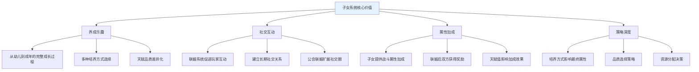

---

## 二、功能清单

### 2.1 子女获取功能

| 功能名称 | 功能描述 | 用户价值 | 解锁条件 |
|----------|----------|----------|----------|
| 随机获得子女 | 通过座位能量随机获得子女 | 获取初始子女 | 玩家等级10 |
| 座位能量添加 | 为座位添加能量提升获取概率 | 提高获得优质子女概率 | 道具/货币 |
| 多座位解锁 | 解锁不同类型座位 | 不同品质子女获取途径 | VIP/等级 |

### 2.2 子女培养功能

| 功能名称 | 功能描述 | 用户价值 | 消耗资源 |
|----------|----------|----------|----------|
| 设置子女名称 | 为子女设置个性化名称 | 个性化子女 | 免费 |
| 普通培养 | 基础培养方式 | 提升子女等级和天赋 | 银两 |
| 高级培养 | 高级培养方式 | 更高效率提升属性 | 钻石 |
| 精英培养 | 精英培养方式 | 最高效率提升属性 | 钻石/培养丹 |
| 子女毕业 | 子女成年后可毕业 | 转为成年子女参与联姻 | 免费 |

### 2.3 联姻功能

| 功能名称 | 功能描述 | 用户价值 | 条件限制 |
|----------|----------|----------|----------|
| 获取未婚成年列表 | 查看可联姻的成年子女 | 选择联姻对象 | 无 |
| 获取已婚成年列表 | 查看已联姻的成年子女 | 管理联姻关系 | 无 |
| 申请联姻 | 向其他玩家申请联姻 | 发起联姻请求 | 成年子女未婚 |
| 同意联姻 | 同意他人的联姻申请 | 确认联姻关系 | 有待处理申请 |
| 拒绝联姻 | 拒绝他人的联姻申请 | 拒绝联姻请求 | 有待处理申请 |
| 一键拒绝 | 一键拒绝所有联姻申请 | 快速处理申请 | 有待处理申请 |
| 设置拒绝联姻 | 设置是否接受联姻申请 | 控制联姻状态 | 无 |
| 公会联姻 | 向公会发起联姻申请 | 扩大联姻范围 | 加入公会 |

### 2.4 推荐系统功能

| 功能名称 | 功能描述 | 用户价值 |
|----------|----------|----------|
| 获取推荐玩家 | 系统推荐适合联姻的玩家 | 快速找到联姻对象 |
| 获取池中成年子女 | 查看公共池中的成年子女 | 选择联姻目标 |

---

## 三、业务流程详解

### 3.1 子女获取流程

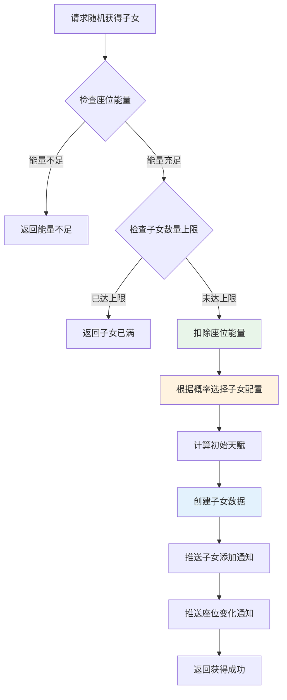

**详细步骤说明**：

| 步骤 | 操作 | 条件 | 失败处理 |
|------|------|------|----------|
| 1 | 检查座位是否存在 | 座位ID有效 | 返回座位不存在 |
| 2 | 检查座位是否解锁 | 座位已解锁 | 返回座位未解锁 |
| 3 | 检查能量是否足够 | 能量 >= 消耗值 | 返回能量不足 |
| 4 | 检查子女槽位 | 当前数量 < 槽位上限 | 返回槽位已满 |
| 5 | 扣除能量 | - | - |
| 6 | 随机选择配置 | 根据权重概率 | - |
| 7 | 计算初始天赋 | 品质加成 | - |
| 8 | 创建子女数据 | - | - |
| 9 | 推送通知 | - | - |

### 3.2 子女培养流程

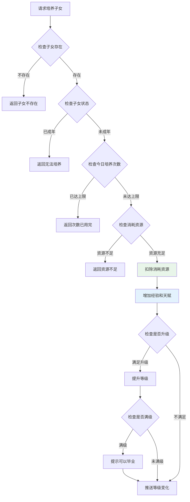

**培养类型对比**：

| 培养类型 | 消耗 | 经验增加 | 天赋增加 | 每日限制 | 适用场景 |
|----------|------|----------|----------|----------|----------|
| 普通培养 | 银两x1000 | +50 | +2 | 5次 | 日常培养 |
| 高级培养 | 钻石x50 | +100 | +5 | 3次 | 中R玩家 |
| 精英培养 | 钻石x200 | +200 | +10 | 2次 | 大R玩家 |
| 特殊培养 | 培养丹x1 | +500 | +20 | 1次 | 活动道具 |
| VIP培养 | 钻石x500 | +300 | +15 | 无限制 | VIP玩家 |

### 3.3 子女毕业流程

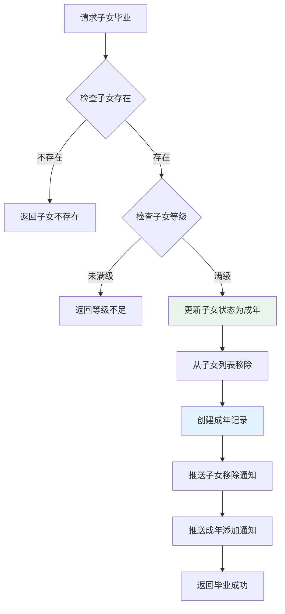

**毕业条件检查**：

| 检查项 | 条件 | 错误码 | 错误信息 |
|--------|------|--------|----------|
| 子女存在 | 子女ID有效 | 14001 | 子女不存在 |
| 子女归属 | 属于当前玩家 | 14001 | 子女不存在 |
| 等级要求 | 等级 = 最大等级 | 14005 | 子女等级不足 |

### 3.4 申请联姻流程

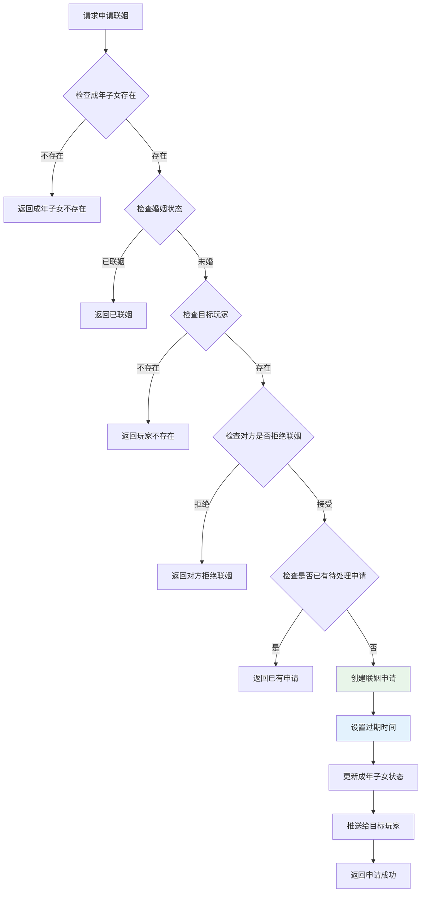

**申请限制条件**：

| 限制项 | 条件 | 说明 |
|--------|------|------|
| 成年子女状态 | 未婚 | 已联姻无法再次申请 |
| 目标玩家设置 | 接受联姻 | 对方设置拒绝时无法申请 |
| 重复申请检查 | 无待处理申请 | 避免重复申请 |
| 申请数量限制 | 无限制 | 可同时向多人申请 |

### 3.5 同意联姻流程

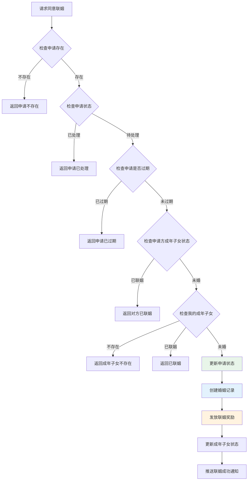

---

## 四、关键规则

### 4.1 子女状态规则

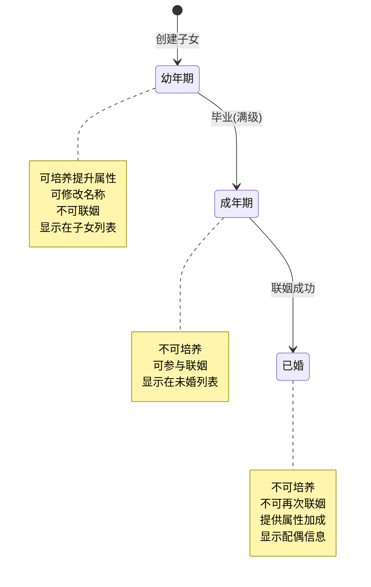

| 状态 | 状态值 | 说明 | 可执行操作 |
|------|--------|------|------------|
| 幼年期 | 1 | 初始状态，可培养 | 培养、改名、毕业 |
| 成年期 | 2 | 毕业后状态，可联姻 | 联姻、查看 |
| 已婚 | 3 | 联姻后状态 | 查看配偶信息 |

### 4.2 培养规则

#### 培养次数限制

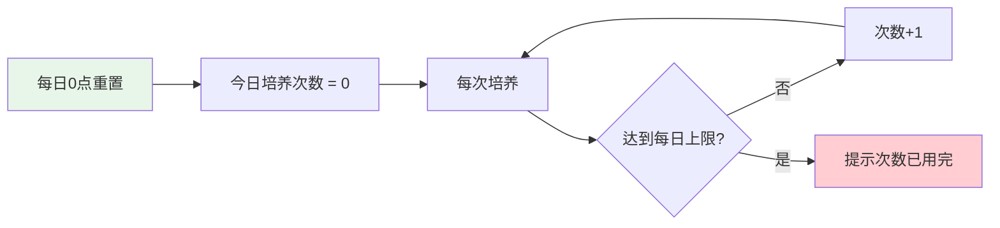

| 培养类型 | 每日限制 | 重置时间 |
|----------|----------|----------|
| 普通培养 | 5次 | 每日0点 |
| 高级培养 | 3次 | 每日0点 |
| 精英培养 | 2次 | 每日0点 |
| 特殊培养 | 1次 | 每日0点 |
| VIP培养 | 无限制 | - |

#### 等级提升规则

```
升级条件: 当前经验 >= 升级所需经验
升级操作: 等级+1, 经验 -= 升级所需经验
满级条件: 等级 = 最大等级
```

### 4.3 联姻规则

#### 申请有效期

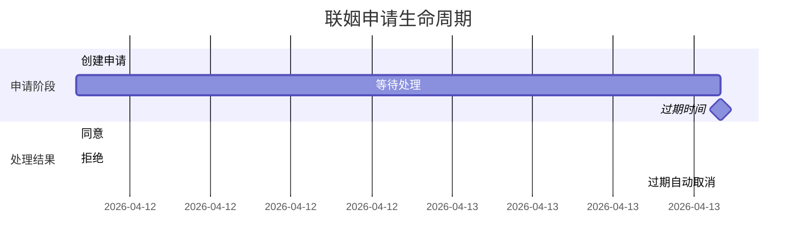

| 状态 | 状态值 | 说明 | 后续操作 |
|------|--------|------|----------|
| 待处理 | 0 | 等待对方处理 | 可同意/拒绝 |
| 已同意 | 1 | 双方确认联姻 | 创建婚姻记录 |
| 已拒绝 | 2 | 对方拒绝 | 恢复未婚状态 |
| 已过期 | 3 | 超时未处理 | 恢复未婚状态 |
| 已取消 | 4 | 申请方取消 | 恢复未婚状态 |

#### 联姻条件检查

| 检查项 | 条件 | 说明 |
|--------|------|------|
| 双方成年子女状态 | 未婚 | 已联姻无法再次联姻 |
| 天赋要求 | >= 配置要求 | 部分联姻类型有天赋限制 |
| VIP等级 | >= 配置要求 | 部分联姻类型有VIP限制 |

### 4.4 奖励发放规则

#### 联姻奖励计算

```
基础奖励 = 配置奖励
天赋加成奖励 = 基础奖励 × (天赋_男方 + 天赋_女方) × 天赋加成比例
最终奖励 = 基础奖励 + 天赋加成奖励
```

**计算示例**：

| 配置项 | 值 |
|--------|-----|
| 基础奖励 | 银两 x 1000 |
| 男方天赋 | 80 |
| 女方天赋 | 70 |
| 天赋加成比例 | 1% |

计算过程：
```
天赋加成奖励 = 1000 × (80 + 70) × 0.01 = 1500
最终奖励 = 1000 + 1500 = 2500 银两
```

---

## 五、用户故事

### 5.1 新手培养故事


> 作为一名新手玩家，我获得了一个初始子女。我每天都会培养她，看着她的等级和天赋逐渐提升。经过一段时间的培养，她终于达到了满级，我让她毕业成为成年子女。

### 5.2 联姻互动故事

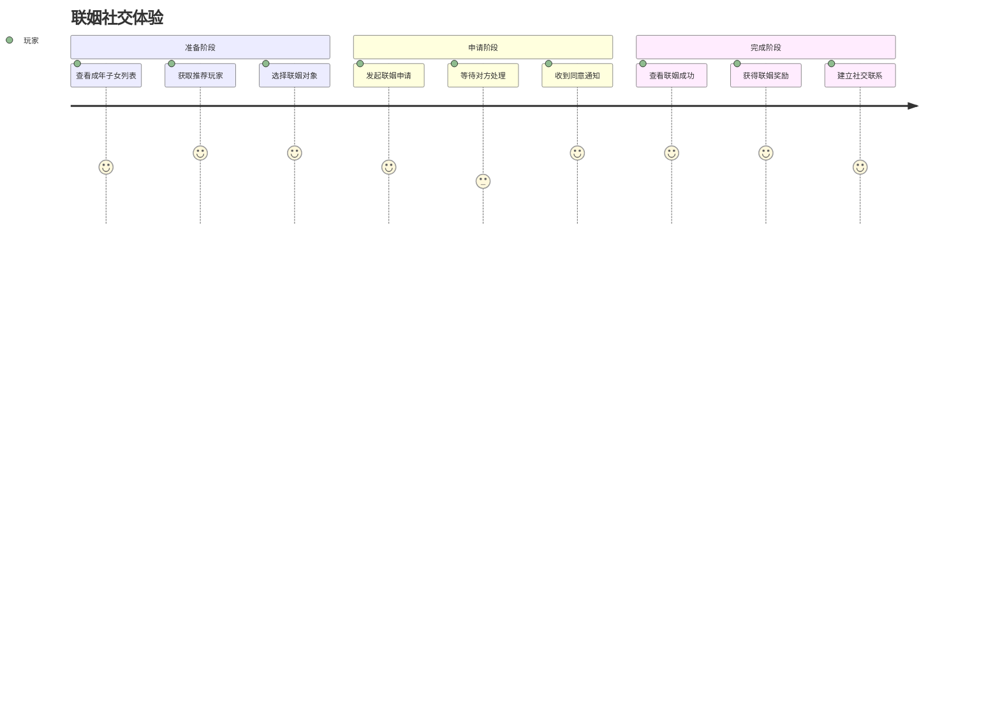

> 作为一名活跃玩家，我的成年子女在未婚列表中。系统推荐了几位适合的联姻对象，我选择了一位天赋较高的玩家发起联姻申请。对方同意后，我们双方都获得了丰厚的联姻奖励，并且建立了社交联系。

### 5.3 公会联姻故事

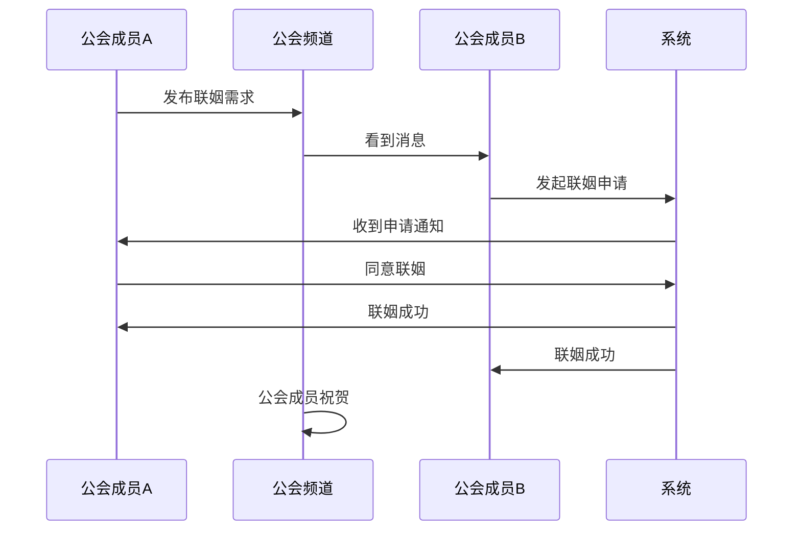

> 作为一名公会成员，我在公会频道看到有成员想要联姻。我查看了他的成年子女信息，觉得很合适，便同意了他的联姻申请。公会成员纷纷祝贺我们，增进了公会的凝聚力。

---

## 六、示例数据

### 6.1 子女创建示例

**输入数据**：
| 参数 | 值 |
|------|-----|
| 座位ID | 1 |
| 能量值 | 100 |

**创建结果**：
```
子女ID：30001
配置ID：10001
名称：聪慧男孩
性别：男
等级：1
经验：0
天赋：55 (基础50 + 品质加成)
状态：幼年期
创建时间：2026-04-12 10:00:00
```

### 6.2 子女培养示例

**初始状态**：
| 属性 | 值 |
|------|-----|
| 子女ID | 30001 |
| 等级 | 5 |
| 经验 | 450/500 |
| 天赋 | 55 |

**培养操作**：
| 参数 | 值 |
|------|-----|
| 培养类型 | 高级培养 |
| 消耗 | 钻石 x 50 |

**培养结果**：
| 属性 | 变化后 | 变化 |
|------|--------|------|
| 等级 | 6 | +1 |
| 经验 | 50/600 | 升级后剩余 |
| 天赋 | 60 | +5 |

### 6.3 子女毕业示例

**初始状态**：
| 属性 | 值 |
|------|-----|
| 子女ID | 30001 |
| 等级 | 10 (满级) |
| 经验 | 1000/1000 |
| 状态 | 幼年期 |

**毕业结果**：
| 属性 | 值 |
|------|-----|
| 成年ID | 40001 |
| 子女配置ID | 10001 |
| 名称 | 小雪 |
| 性别 | 男 |
| 天赋 | 80 |
| 婚姻状态 | 未婚 |

### 6.4 联姻申请示例

**输入数据**：
| 参数 | 值 |
|------|-----|
| 目标玩家ID | 20002 |
| 成年子女ID | 40001 |

**申请结果**：
| 属性 | 值 |
|------|-----|
| 申请ID | 50001 |
| 申请玩家ID | 20001 |
| 申请玩家名称 | 剑舞春秋 |
| 成年子女ID | 40001 |
| 目标玩家ID | 20002 |
| 状态 | 待处理 |
| 创建时间 | 2026-04-12 11:00:00 |
| 过期时间 | 2026-04-13 11:00:00 |

### 6.5 联姻成功示例

**双方信息**：
| 属性 | 玩家A | 玩家B |
|------|-------|-------|
| 玩家ID | 20001 | 20002 |
| 成年子女ID | 40001 | 40002 |
| 成年子女天赋 | 80 | 70 |

**奖励计算**：
| 奖励项 | 计算 | 结果 |
|--------|------|------|
| 基础奖励 | 银两 x 1000 | 1000 |
| 天赋加成 | 1000 × (80+70) × 1% | 1500 |
| 最终奖励 | 1000 + 1500 | 2500 银两 |

---

## 七、系统配置

### 7.1 可配置项

| 配置项 | 说明 | 默认值 | 配置位置 |
|--------|------|--------|----------|
| 子女最大数量 | 玩家可拥有的最大子女数 | 10 | RefGeneral |
| 申请有效期 | 联姻申请的有效时长 | 24小时 | 代码常量 |
| 座位能量恢复 | 每小时恢复的能量值 | 10 | ChildSeatRefObj |
| 培养次数上限 | 每日培养次数限制 | 培养类型相关 | ChildTrainRefObj |

### 7.2 参数调优建议

| 参数 | 调优方向 | 影响 |
|------|----------|------|
| 品质概率权重 | 调整各品质出现概率 | 影响稀有子女获取难度 |
| 天赋加成比例 | 调整天赋对奖励的影响 | 影响高天赋子女价值 |
| 培养经验值 | 调整培养效率 | 影响养成节奏 |
| 申请有效期 | 调整申请处理时间窗口 | 影响社交互动频率 |

---

## 八、数据统计

### 8.1 关键指标

| 指标名称 | 计算公式 | 用途 |
|----------|----------|------|
| 子女拥有率 | 拥有子女的玩家数 / 总玩家数 | 系统渗透率 |
| 平均子女数 | 所有子女总数 / 拥有子女的玩家数 | 用户参与度 |
| 毕业转化率 | 已毕业子女数 / 总子女数 | 养成完成度 |
| 联姻参与率 | 参与联姻的玩家数 / 拥有成年子女的玩家数 | 社交活跃度 |
| 平均天赋值 | 所有子女天赋总和 / 子女总数 | 培养质量 |

### 8.2 监控告警

| 告警项 | 触发条件 | 处理建议 |
|--------|----------|----------|
| 申请堆积 | 待处理申请数 > 阈值 | 检查推送是否正常 |
| 创建失败率 | 创建失败次数/总创建 > 5% | 检查数据库和ID生成器 |
| 联姻失败率 | 联姻失败次数/总联姻 > 5% | 检查业务逻辑和状态 |

---

*文档生成时间: 2026-04-12*
*文档版本: v2.1.0*
