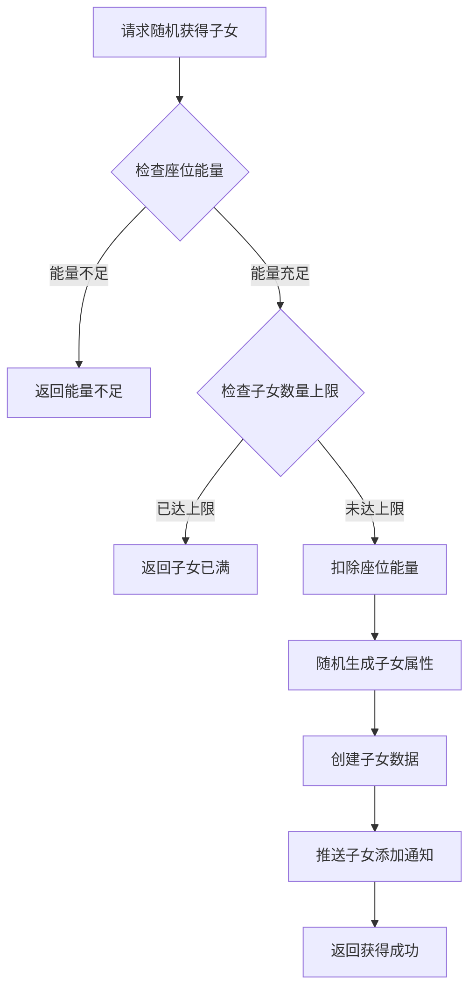
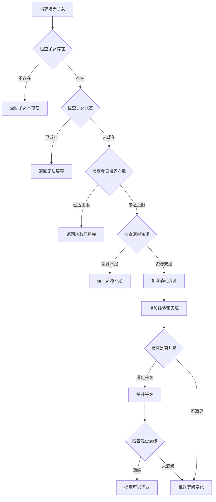
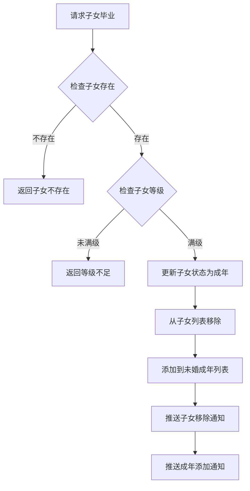
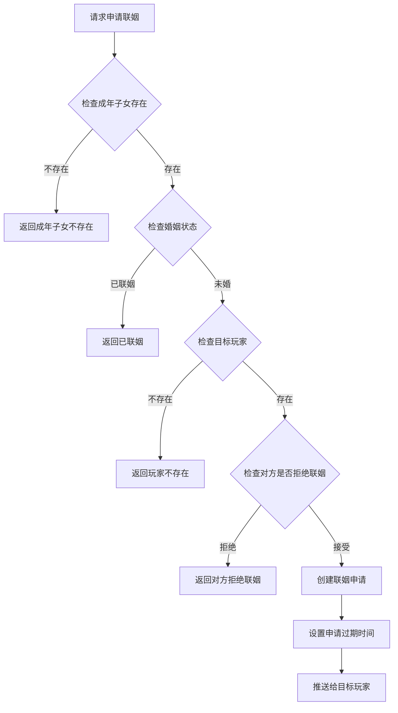
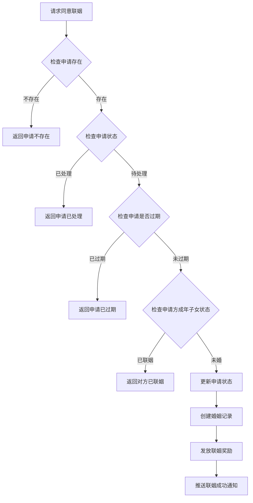

# 子女系统完整说明

## 一、模块概述

### 1.1 业务背景

子女系统是 K2C 游戏的核心养成玩法之一，玩家可以培养子女成长、成年后可与其他玩家的子女进行联姻。该系统融合了养成、社交、策略等多种元素，是玩家长期游玩的重要动力。

### 1.2 目标用户

- **养成玩家**：享受培养子女成长的过程
- **社交玩家**：通过联姻与其他玩家建立社交关系
- **策略玩家**：通过合理培养提升子女属性

### 1.3 核心价值

1. **养成乐趣**：从幼儿到成年的完整成长过程
2. **社交互动**：联姻系统促进玩家间互动
3. **属性加成**：子女可为玩家提供属性加成
4. **策略深度**：培养方式影响最终属性

---

## 二、功能清单

### 2.1 子女获取功能

| 功能名称 | 功能描述 | 用户价值 |
|---------|---------|---------|
| 随机获得子女 | 通过随机方式获得子女 | 获取初始子女 |
| 座位能量添加 | 为座位添加能量提升获取概率 | 提高获得优质子女概率 |

### 2.2 子女培养功能

| 功能名称 | 功能描述 | 用户价值 |
|---------|---------|---------|
| 设置子女名称 | 为子女设置个性化名称 | 个性化子女 |
| 培养子女 | 消耗资源培养子女属性 | 提升子女等级和天赋 |
| 子女毕业 | 子女成年后可毕业 | 转为成年子女参与联姻 |

### 2.3 联姻功能

| 功能名称 | 功能描述 | 用户价值 |
|---------|---------|---------|
| 获取未婚成年列表 | 查看可联姻的成年子女 | 选择联姻对象 |
| 获取已婚成年列表 | 查看已联姻的成年子女 | 管理联姻关系 |
| 申请联姻 | 向其他玩家申请联姻 | 发起联姻请求 |
| 同意联姻 | 同意他人的联姻申请 | 确认联姻关系 |
| 拒绝联姻 | 拒绝他人的联姻申请 | 拒绝联姻请求 |
| 一键拒绝 | 一键拒绝所有联姻申请 | 快速处理申请 |
| 设置拒绝联姻 | 设置是否接受联姻申请 | 控制联姻状态 |
| 公会联姻 | 向公会发起联姻申请 | 扩大联姻范围 |

### 2.4 推荐系统功能

| 功能名称 | 功能描述 | 用户价值 |
|---------|---------|---------|
| 获取推荐玩家 | 系统推荐适合联姻的玩家 | 快速找到联姻对象 |
| 获取池中成年子女 | 查看公共池中的成年子女 | 选择联姻目标 |

---

## 三、业务流程详解

### 3.1 子女获取流程



**详细步骤说明**：

1. **条件检查**
   - 检查座位能量是否足够
   - 检查子女数量是否达到上限

2. **属性生成**
   - 随机生成性别
   - 根据配置生成初始天赋
   - 初始化等级和经验

3. **数据创建**
   - 创建子女数据记录
   - 推送添加通知

### 3.2 子女培养流程



**详细步骤说明**：

1. **状态验证**
   - 验证子女存在且属于当前玩家
   - 验证子女为未成年状态

2. **次数检查**
   - 检查今日培养次数限制
   - 记录培养次数

3. **资源消耗**
   - 根据培养类型扣除资源
   - 增加经验和天赋值

4. **等级提升**
   - 检查是否满足升级条件
   - 满级后提示可毕业

### 3.3 子女毕业流程



**详细步骤说明**：

1. **等级验证**
   - 验证子女已达到满级
   - 满级才可毕业

2. **状态转换**
   - 更新子女状态为成年
   - 从子女列表移到成年列表

3. **通知推送**
   - 推送子女移除通知
   - 推送成年添加通知

### 3.4 申请联姻流程



**详细步骤说明**：

1. **子女验证**
   - 验证成年子女存在
   - 验证婚姻状态为未婚

2. **目标验证**
   - 验证目标玩家存在
   - 检查是否接受联姻申请

3. **申请创建**
   - 创建联姻申请记录
   - 设置24小时过期时间
   - 推送给目标玩家

### 3.5 同意联姻流程



**详细步骤说明**：

1. **申请验证**
   - 验证申请存在且属于当前玩家
   - 验证申请状态为待处理
   - 验证申请未过期

2. **状态检查**
   - 检查申请方成年子女状态
   - 确认双方都可联姻

3. **联姻处理**
   - 更新申请状态为已同意
   - 创建婚姻记录
   - 发放联姻奖励

---

## 四、关键规则

### 4.1 子女状态规则

| 状态 | 状态值 | 说明 |
|------|--------|------|
| 幼年期 | 1 | 可进行培养，不可联姻 |
| 成年期 | 2 | 可进行联姻 |
| 已婚 | 3 | 已完成联姻 |

### 4.2 培养规则

1. **培养次数**
   - 每个子女每日培养次数有限制
   - 不同培养类型消耗不同资源

2. **等级提升**
   - 经验达到一定值后升级
   - 等级上限由配置决定

3. **天赋增长**
   - 培养可增加天赋值
   - 天赋影响联姻匹配和奖励

### 4.3 联姻规则

1. **申请限制**
   - 申请有效期为24小时
   - 可同时存在多个申请
   - 可设置拒绝接受联姻申请

2. **联姻条件**
   - 双方成年子女都必须未婚
   - 需要双方确认才能完成联姻

3. **奖励发放**
   - 联姻成功后双方获得奖励
   - 奖励与子女天赋相关

---

## 五、用户故事

### 5.1 新手培养故事

> 作为一名新手玩家，我获得了一个初始子女。我每天都会培养她，看着她的等级和天赋逐渐提升。经过一段时间的培养，她终于达到了满级，我让她毕业成为成年子女。

### 5.2 联姻互动故事

> 作为一名活跃玩家，我的成年子女在未婚列表中。系统推荐了几位适合的联姻对象，我选择了一位天赋较高的玩家发起联姻申请。对方同意后，我们双方都获得了丰厚的联姻奖励，并且建立了社交联系。

### 5.3 公会联姻故事

> 作为一名公会成员，我在公会频道看到有成员想要联姻。我查看了他的成年子女信息，觉得很合适，便同意了他的联姻申请。公会成员纷纷祝贺我们，增进了公会的凝聚力。

---

## 六、示例

### 6.1 子女创建示例

**输入数据**：
- 座位ID：1
- 能量值：100

**创建结果**：
```
子女ID：30001
配置ID：10001
名称：未命名
性别：女
等级：1
经验：0
天赋：50
状态：幼年期
创建时间：2026-04-07 10:00:00
```

### 6.2 子女培养示例

**初始状态**：
```
子女ID：30001
等级：5
经验：450/500
天赋：55
```

**培养操作**：
- 培养类型：高级培养
- 消耗：钻石 x 50

**培养结果**：
```
等级：6（+1）
经验：50/600（剩余经验 + 新等级上限）
天赋：60（+5）
```

### 6.3 子女毕业示例

**初始状态**：
```
子女ID：30001
等级：10（满级）
经验：1000/1000
状态：幼年期
```

**毕业结果**：
```
成年ID：40001
子女配置ID：10001
名称：小雪
性别：女
天赋：80
婚姻状态：未婚
```

### 6.4 联姻申请示例

**输入数据**：
- 目标玩家ID：20002
- 成年子女ID：40001

**申请结果**：
```
申请ID：50001
申请玩家ID：20001
申请玩家名称：剑舞春秋
成年子女ID：40001
目标玩家ID：20002
状态：待处理
创建时间：2026-04-07 11:00:00
过期时间：2026-04-08 11:00:00
```

---

*文档生成时间: 2026-04-07*
