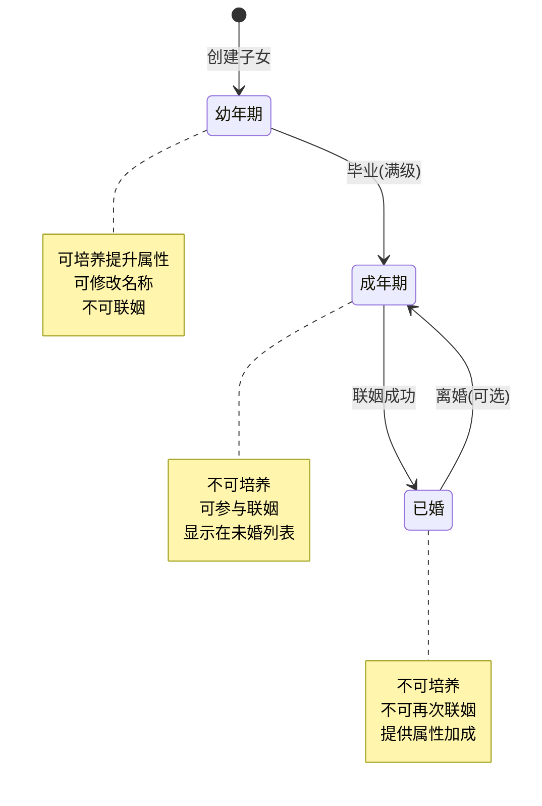
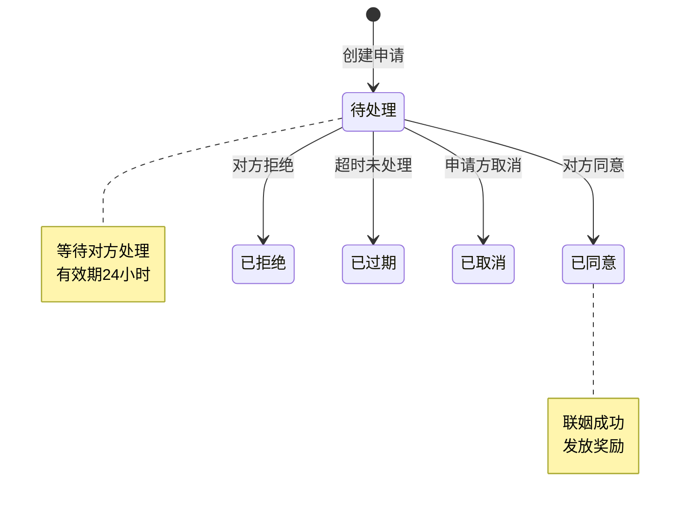
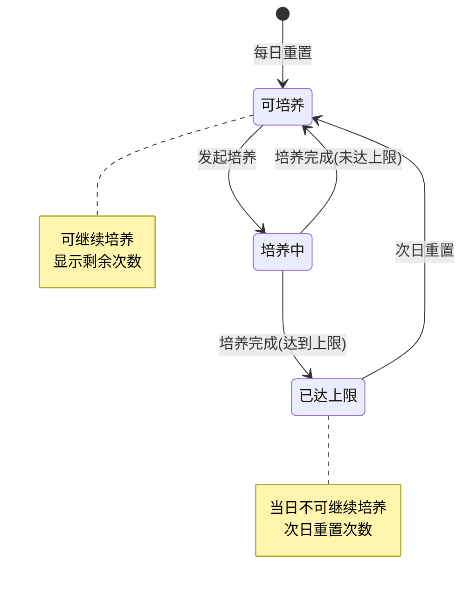
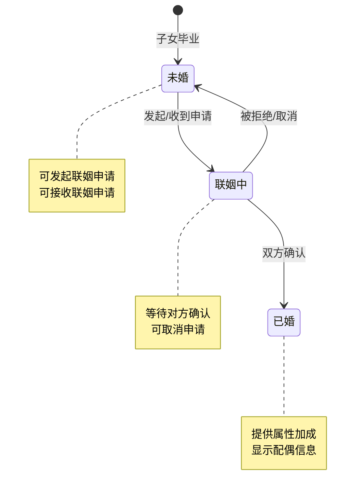
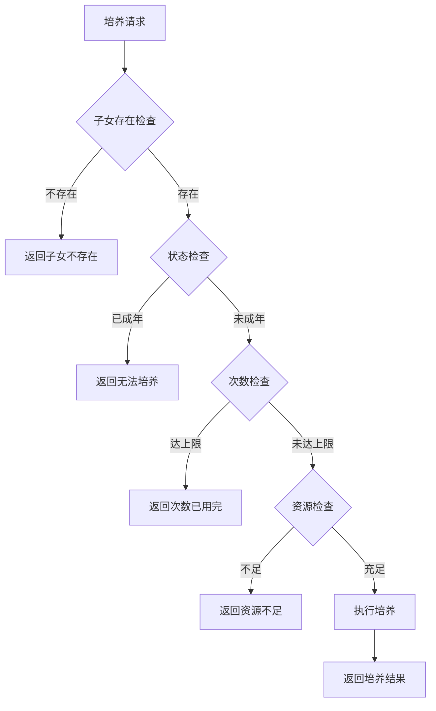
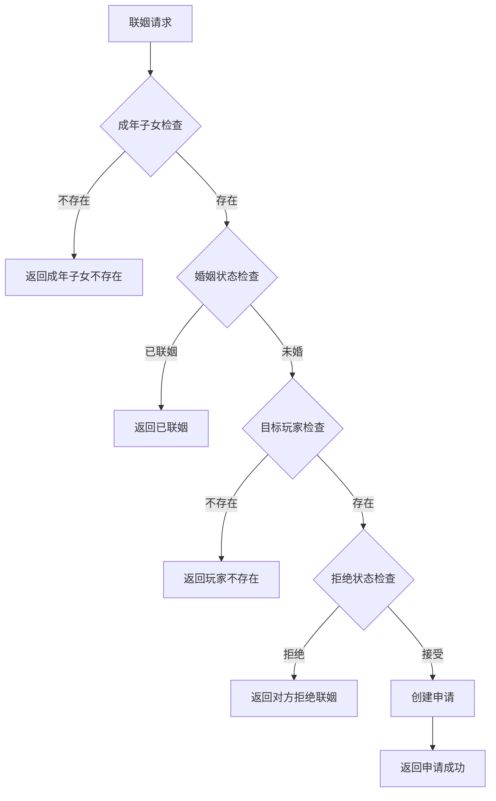

# 子女系统实现细节

## 一、计算公式

### 1.1 子女升级经验计算公式

```
升级所需经验 = base_exp × level × growth_rate
```

**参数说明**：
- `base_exp`：基础经验值（配置表）
- `level`：当前等级
- `growth_rate`：成长系数

**示例计算**：
```
base_exp = 50
growth_rate = 1.2

5级升6级需要经验：50 × 5 × 1.2 = 300
10级升11级需要经验：50 × 10 × 1.2 = 600
```

### 1.2 天赋增长计算公式

```
天赋增长 = base_talent_add × (1 + 培养加成)
实际增长 = floor(天赋增长)
```

**参数说明**：
- `base_talent_add`：基础天赋增加值
- `培养加成`：根据培养类型决定

**示例计算**：
```
普通培养：base_talent_add = 3, 培养加成 = 0
天赋增长 = 3 × (1 + 0) = 3

高级培养：base_talent_add = 5, 培养加成 = 0.2
天赋增长 = 5 × (1 + 0.2) = 6
```

### 1.3 联姻奖励计算公式

```
基础奖励 = 配置奖励
天赋加成奖励 = 基础奖励 × (天赋_男方 + 天赋_女方) × talent_ratio
最终奖励 = 基础奖励 + 天赋加成奖励
```

**参数说明**：
- `talent_ratio`：天赋加成系数

**示例计算**：
```
基础奖励：银两 × 1000
男方天赋：80
女方天赋：70
talent_ratio = 0.01

天赋加成奖励 = 1000 × (80 + 70) × 0.01 = 1500
最终奖励 = 1000 + 1500 = 2500 银两
```

### 1.4 子女随机属性计算

```
初始天赋 = floor(random(min_talent, max_talent))
性别 = random(1, 2) // 1男2女
```

---

## 二、状态机定义

### 2.1 子女状态机



### 2.2 联姻申请状态机



### 2.3 培养状态机



### 2.4 成年子女婚姻状态机



---

## 三、数据约束

### 3.1 子女数据约束

| 字段名 | 数据类型 | 取值范围 | 必填 | 唯一性 | 说明 |
|--------|----------|----------|------|--------|------|
| childId | long | > 0 | 是 | 是 | 子女唯一ID |
| playerId | long | > 0 | 是 | 否 | 所属玩家ID |
| cfgId | int | > 0 | 是 | 否 | 配置ID |
| name | string | 1-16字符 | 是 | 否 | 子女名称 |
| gender | int | 1-2 | 是 | 否 | 性别 |
| level | int | 1-100 | 是 | 否 | 等级 |
| exp | int | >= 0 | 是 | 否 | 当前经验 |
| talent | int | 1-100 | 是 | 否 | 天赋值 |
| state | int | 1-3 | 是 | 否 | 状态 |

### 3.2 成年子女数据约束

| 字段名 | 数据类型 | 取值范围 | 必填 | 说明 |
|--------|----------|----------|------|------|
| adultId | long | > 0 | 是 | 成年唯一ID |
| playerId | long | > 0 | 是 | 所属玩家ID |
| childCfgId | int | > 0 | 是 | 原子女配置ID |
| name | string | 1-16字符 | 是 | 名称 |
| gender | int | 1-2 | 是 | 性别 |
| talent | int | 1-100 | 是 | 天赋值 |
| marryState | int | 0-2 | 是 | 婚姻状态 |

### 3.3 联姻申请数据约束

| 字段名 | 数据类型 | 取值范围 | 必填 | 说明 |
|--------|----------|----------|------|------|
| requestId | long | > 0 | 是 | 申请唯一ID |
| fromPlayerId | long | > 0 | 是 | 申请玩家ID |
| fromAdultId | long | > 0 | 是 | 申请方成年ID |
| toPlayerId | long | > 0 | 是 | 目标玩家ID |
| toAdultId | long | >= 0 | 否 | 目标成年ID（可选） |
| status | int | 0-4 | 是 | 状态 |
| createTime | datetime | - | 是 | 创建时间 |
| expireTime | datetime | - | 是 | 过期时间 |

### 3.4 婚姻记录数据约束

| 字段名 | 数据类型 | 取值范围 | 必填 | 说明 |
|--------|----------|----------|------|------|
| recordId | long | > 0 | 是 | 记录唯一ID |
| playerId | long | > 0 | 是 | 玩家ID |
| adultId | long | > 0 | 是 | 成年ID |
| spousePlayerId | long | > 0 | 是 | 配偶玩家ID |
| spouseAdultId | long | > 0 | 是 | 配偶成年ID |
| marryTime | datetime | - | 是 | 结婚时间 |

---

## 四、错误处理策略

### 4.1 子女系统错误码

| 错误码 | 错误信息 | 处理策略 | 用户提示 |
|--------|----------|----------|----------|
| 14001 | 子女不存在 | 检查子女ID有效性 | "子女不存在" |
| 14002 | 子女已达上限 | 提示上限数量 | "子女数量已达上限" |
| 14003 | 子女已成年 | 检查子女状态 | "该子女已成年，无法培养" |
| 14004 | 今日培养次数已用完 | 提示明日重置 | "今日培养次数已用完，请明日再来" |
| 14005 | 子女等级不足 | 提示所需等级 | "子女等级不足，无法毕业" |
| 14006 | 成年子女不存在 | 检查成年ID有效性 | "成年子女不存在" |
| 14007 | 成年子女已联姻 | 提示已婚状态 | "该成年子女已联姻" |
| 14008 | 联姻申请不存在 | 检查申请ID有效性 | "联姻申请不存在" |
| 14009 | 联姻申请已处理 | 提示已处理状态 | "该申请已被处理" |
| 14010 | 联姻申请已过期 | 提示重新申请 | "该申请已过期" |
| 14011 | 对方拒绝联姻 | 提示对方设置 | "对方当前不接受联姻申请" |
| 14012 | 座位能量不足 | 提示获取途径 | "座位能量不足" |

### 4.2 培养错误处理流程



### 4.3 联姻错误处理流程



---

## 五、关键代码示例

### 5.1 培养子女伪代码

```csharp
public Result TrainChild(long playerId, long childId, int trainType)
{
    // 1. 获取子女信息
    PlayerChild child = childDao.selectById(childId);
    if (child == null || child.playerId != playerId)
    {
        return Result.Error(14001, "子女不存在");
    }

    // 2. 检查状态
    if (child.state != EChildState.CHILD)
    {
        return Result.Error(14003, "子女已成年，无法培养");
    }

    // 3. 获取培养配置
    ChildTrainConfig config = trainConfigDao.getById(trainType);
    if (config == null)
    {
        return Result.Error(0, "配置不存在");
    }

    // 4. 检查今日培养次数
    int todayCount = getChildTodayTrainCount(playerId, childId);
    if (todayCount >= config.dailyLimit)
    {
        return Result.Error(14004, "今日培养次数已用完");
    }

    // 5. 检查并扣除资源
    if (!resourceService.checkAndConsume(playerId, config.costList))
    {
        return Result.Error(0, "资源不足");
    }

    // 6. 增加经验和天赋
    child.exp += config.expAdd;
    child.talent += config.talentAdd;

    // 7. 检查升级
    ChildLevelRefObj levelRef = GetLevelRef(child.level);
    while (child.exp >= levelRef.needExp && child.level < levelRef.maxLevel)
    {
        child.exp -= levelRef.needExp;
        child.level++;
        levelRef = GetLevelRef(child.level);
    }

    // 8. 更新数据
    childDao.updateById(child);

    // 9. 更新今日培养次数
    updateTodayTrainCount(playerId, childId);

    // 10. 推送通知
    PushChildLvlChg(playerId, child);

    return Result.Success(new { level = child.level, exp = child.exp, talent = child.talent });
}
```

### 5.2 子女毕业伪代码

```csharp
public Result GraduateChild(long playerId, long childId)
{
    // 1. 获取子女信息
    PlayerChild child = childDao.selectById(childId);
    if (child == null || child.playerId != playerId)
    {
        return Result.Error(14001, "子女不存在");
    }

    // 2. 检查等级
    ChildConfig config = childConfigDao.getById(child.cfgId);
    if (child.level < config.maxLevel)
    {
        return Result.Error(14005, "子女等级不足，无法毕业");
    }

    // 3. 更新子女状态
    child.state = EChildState.ADULT;
    childDao.updateById(child);

    // 4. 创建成年记录
    PlayerAdult adult = new PlayerAdult
    {
        adultId = idGenerator.NextId(),
        playerId = playerId,
        childCfgId = child.cfgId,
        name = child.name,
        gender = child.gender,
        talent = child.talent,
        marryState = EMarriageState.UNMARRIED
    };
    adultDao.insert(adult);

    // 5. 推送通知
    PushChildRemove(playerId, childId);
    PushUnmarriedAdultAdd(playerId, adult);

    return Result.Success(adult);
}
```

### 5.3 申请联姻伪代码

```csharp
public Result ApplyMarriage(long playerId, long targetPlayerId, long myAdultId)
{
    // 1. 检查成年子女
    PlayerAdult myAdult = adultDao.selectById(myAdultId);
    if (myAdult == null || myAdult.playerId != playerId)
    {
        return Result.Error(14006, "成年子女不存在");
    }

    if (myAdult.marryState != EMarriageState.UNMARRIED)
    {
        return Result.Error(14007, "成年子女已联姻");
    }

    // 2. 检查目标玩家
    PlayerBase targetPlayer = playerDao.selectById(targetPlayerId);
    if (targetPlayer == null)
    {
        return Result.Error(0, "玩家不存在");
    }

    // 3. 检查是否拒绝联姻
    if (isRefuseMarriage(targetPlayerId))
    {
        return Result.Error(14011, "对方当前不接受联姻申请");
    }

    // 4. 检查是否已有待处理申请
    EngageRequest existing = engageRequestDao.selectPending(playerId, targetPlayerId);
    if (existing != null)
    {
        return Result.Error(0, "已有待处理的联姻申请");
    }

    // 5. 创建申请
    EngageRequest request = new EngageRequest
    {
        requestId = idGenerator.NextId(),
        fromPlayerId = playerId,
        fromAdultId = myAdultId,
        toPlayerId = targetPlayerId,
        status = ERequestStatus.PENDING,
        createTime = DateTime.Now,
        expireTime = DateTime.Now.AddHours(24)
    };
    engageRequestDao.insert(request);

    // 6. 推送通知给目标玩家
    PushToMeApplyAdd(targetPlayerId, request);

    return Result.Success(request);
}
```

### 5.4 同意联姻伪代码

```csharp
public Result AgreeMarriage(long playerId, long requestId)
{
    // 1. 获取申请
    EngageRequest request = engageRequestDao.selectById(requestId);
    if (request == null || request.toPlayerId != playerId)
    {
        return Result.Error(14008, "联姻申请不存在");
    }

    if (request.status != ERequestStatus.PENDING)
    {
        return Result.Error(14009, "联姻申请已被处理");
    }

    if (request.expireTime < DateTime.Now)
    {
        return Result.Error(14010, "联姻申请已过期");
    }

    // 2. 检查申请方成年子女状态
    PlayerAdult fromAdult = adultDao.selectById(request.fromAdultId);
    if (fromAdult.marryState != EMarriageState.UNMARRIED)
    {
        return Result.Error(14007, "对方已联姻");
    }

    // 3. 更新申请状态
    request.status = ERequestStatus.AGREED;
    engageRequestDao.updateById(request);

    // 4. 创建婚姻记录
    createMarriageRecord(request);

    // 5. 发放奖励
    giveMarriageReward(playerId, request.fromPlayerId);

    // 6. 更新成年子女状态
    fromAdult.marryState = EMarriageState.MARRIED;
    adultDao.updateById(fromAdult);

    // 7. 推送通知
    PushMarriageSuccess(request);

    return Result.Success();
}
```

### 5.5 清理过期申请伪代码

```csharp
public void CleanExpiredRequests()
{
    DateTime now = DateTime.Now;
    List<EngageRequest> expiredList = engageRequestDao.selectExpired(now);

    foreach (EngageRequest request in expiredList)
    {
        request.status = ERequestStatus.EXPIRED;
        engageRequestDao.updateById(request);

        // 通知双方
        PushRequestExpired(request);
    }
}
```

---

## 六、跨模块依赖

### 6.1 依赖模块

| 模块名称 | 依赖方式 | 依赖内容 |
|----------|----------|----------|
| Player | 强依赖 | 玩家基础信息、资源管理 |
| Item | 强依赖 | 道具消耗和发放 |
| Guild | 弱依赖 | 公会联姻功能 |
| Push | 强依赖 | 消息推送服务 |
| Mail | 弱依赖 | 联姻通知邮件 |

### 6.2 被依赖模块

| 模块名称 | 被依赖内容 |
|----------|------------|
| Consort | 成年子女可能与伴侣系统关联 |
| Achievement | 子女培养成就 |
| Task | 子女相关任务 |

### 6.3 接口定义

```csharp
// 资源服务接口
interface IResourceService
{
    bool CheckAndConsume(long playerId, List<CostInfo> costList);
    void GiveReward(long playerId, List<RewardInfo> rewardList);
}

// 推送服务接口
interface IPushService
{
    void PushToPlayer(long playerId, object message);
    void PushToPlayers(List<long> playerIds, object message);
}

// 公会服务接口
interface IGuildService
{
    List<long> GetGuildMemberIds(long guildId);
    bool IsPlayerInGuild(long playerId, long guildId);
}
```

---

## 七、性能优化建议

### 7.1 缓存策略

1. **子女数据缓存**
   - 玩家子女数据缓存到Redis
   - 修改后异步写入数据库

2. **培养次数缓存**
   - 每日培养次数使用Redis计数
   - 每日零点自动重置

### 7.2 数据库优化

1. **分表策略**
   - 子女数据按玩家ID取模分表
   - 联姻申请按时间分表

2. **索引设计**
   - playerId 主键索引
   - status + expireTime 复合索引

### 7.3 定时任务

1. **过期申请清理**
   - 每小时清理过期申请
   - 批量更新状态

2. **培养次数重置**
   - 每日零点重置培养次数
   - 使用Redis过期机制

---

*文档生成时间: 2026-04-07*
