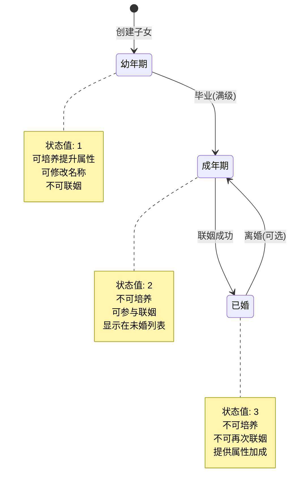
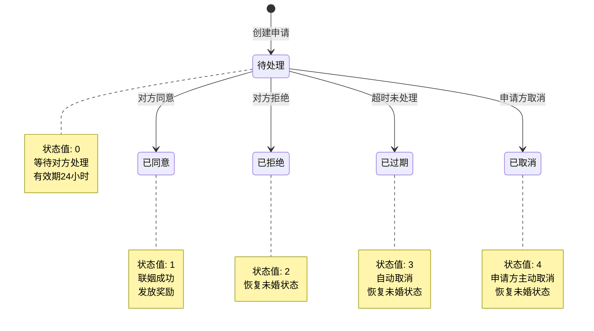
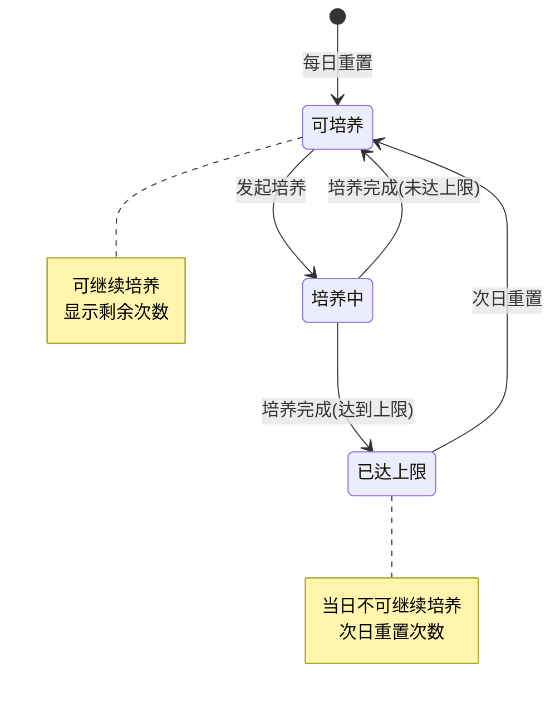
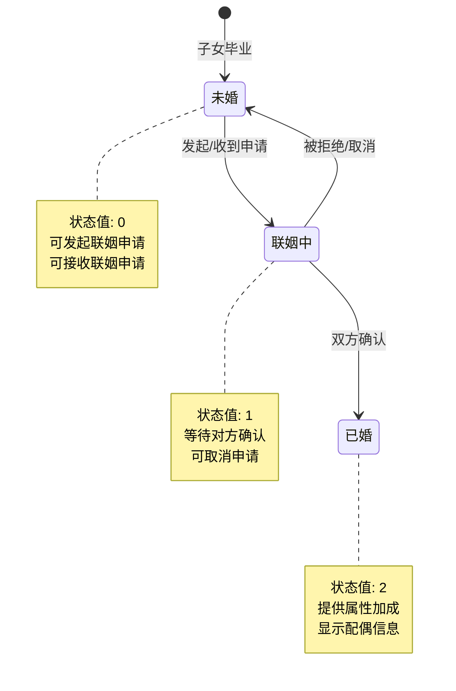
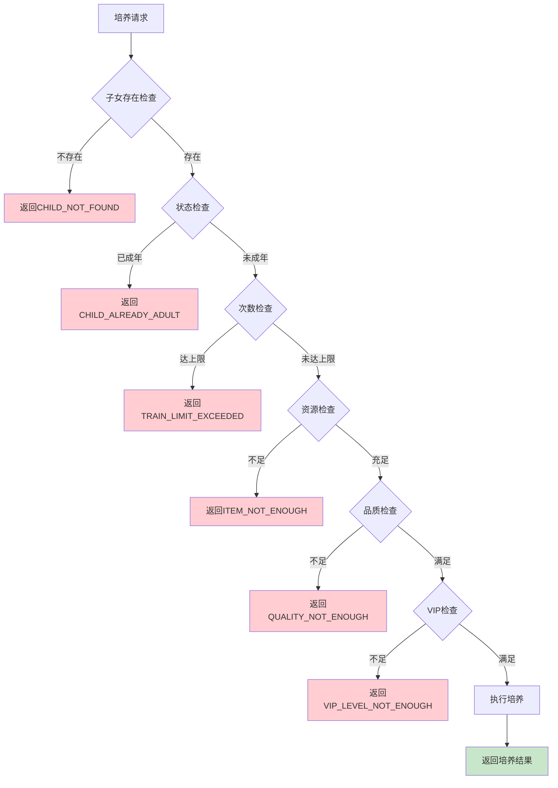
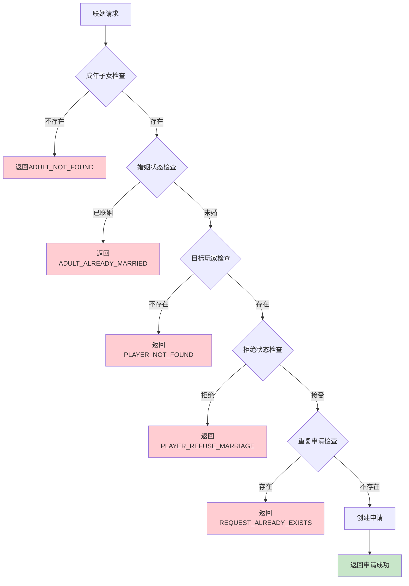
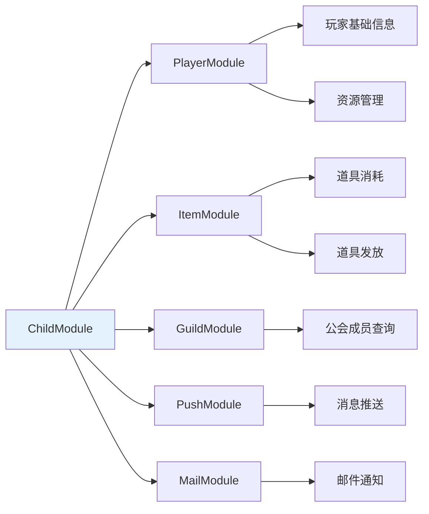
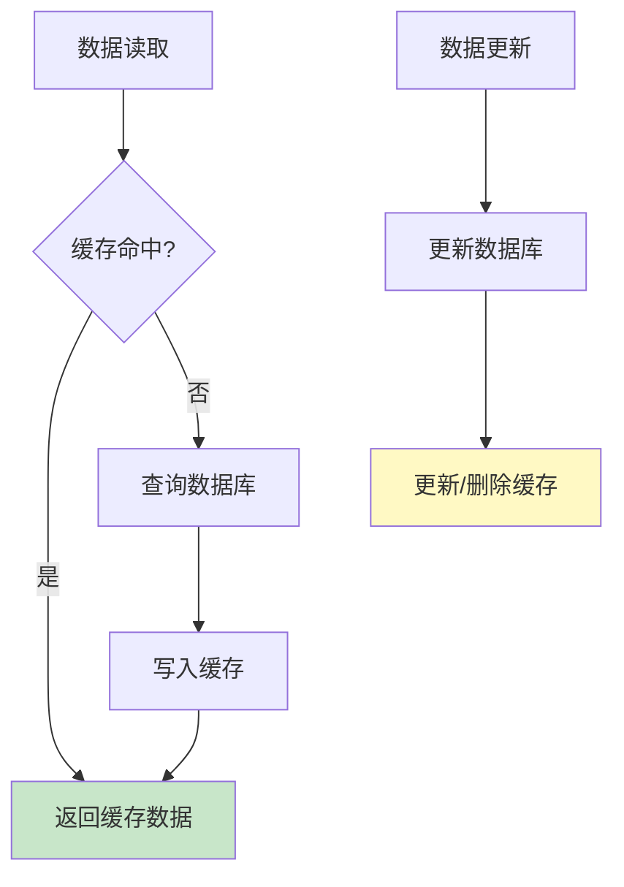
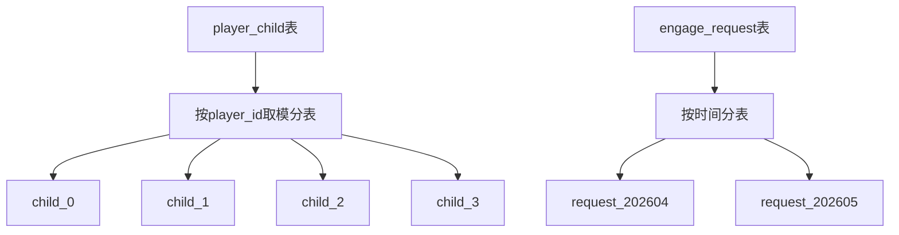

# 子女系统实现细节

## 一、计算公式

### 1.1 子女升级经验计算公式

```
升级所需经验 = base_exp × level × growth_rate
```

**参数说明**：
| 参数 | 类型 | 说明 | 取值范围 |
|------|------|------|----------|
| base_exp | int | 基础经验值（配置表） | 50-200 |
| level | int | 当前等级 | 1-100 |
| growth_rate | float | 成长系数 | 1.0-2.0 |

**示例计算**：
```
base_exp = 50
growth_rate = 1.2

5级升6级需要经验：50 × 5 × 1.2 = 300
10级升11级需要经验：50 × 10 × 1.2 = 600
```

### 1.2 天赋增长计算公式

```
天赋增长 = base_talent_add × (1 + 培养加成)
实际增长 = floor(天赋增长)
```

**参数说明**：
| 参数 | 类型 | 说明 |
|------|------|------|
| base_talent_add | int | 基础天赋增加值 |
| 培养加成 | float | 根据培养类型决定，范围 0-1.0 |

**示例计算**：
```
普通培养：base_talent_add = 3, 培养加成 = 0
天赋增长 = 3 × (1 + 0) = 3

高级培养：base_talent_add = 5, 培养加成 = 0.2
天赋增长 = 5 × (1 + 0.2) = 6

精英培养：base_talent_add = 10, 培养加成 = 0.5
天赋增长 = 10 × (1 + 0.5) = 15
```

### 1.3 联姻奖励计算公式

```
基础奖励 = 配置奖励
天赋加成奖励 = 基础奖励 × (天赋_男方 + 天赋_女方) × talent_ratio
最终奖励 = 基础奖励 + 天赋加成奖励
```

**参数说明**：
| 参数 | 类型 | 说明 | 取值范围 |
|------|------|------|----------|
| talent_ratio | float | 天赋加成系数 | 0.005-0.02 |

**示例计算**：
```
基础奖励：银两 × 1000
男方天赋：80
女方天赋：70
talent_ratio = 0.01

天赋加成奖励 = 1000 × (80 + 70) × 0.01 = 1500
最终奖励 = 1000 + 1500 = 2500 银两
```

### 1.4 子女随机属性计算

```
初始天赋 = floor(random(min_talent, max_talent))
性别 = random(1, 2) // 1男2女
品质 = weightedRandom(quality_weights)
```

**品质概率权重**：
| 品质 | 权重 | 概率 |
|------|------|------|
| 普通 | 60 | 60% |
| 优秀 | 25 | 25% |
| 稀有 | 10 | 10% |
| 史诗 | 4 | 4% |
| 传说 | 1 | 1% |

---

## 二、状态机定义

### 2.1 子女状态机



**状态转换条件**：
| 当前状态 | 目标状态 | 触发条件 | 操作 |
|----------|----------|----------|------|
| 无 | 幼年期 | 随机获得子女 | 创建子女数据 |
| 幼年期 | 成年期 | 毕业（满级） | 创建成年记录，移除子女 |
| 成年期 | 已婚 | 联姻成功 | 创建婚姻记录 |
| 已婚 | 成年期 | 离婚（可选） | 移除婚姻记录 |

### 2.2 联姻申请状态机



### 2.3 培养状态机



### 2.4 成年子女婚姻状态机



---

## 三、数据约束

### 3.1 子女数据约束

| 字段名 | 数据类型 | 取值范围 | 必填 | 唯一性 | 说明 |
|--------|----------|----------|------|--------|------|
| childId | long | > 0 | 是 | 是 | 子女唯一ID |
| playerId | long | > 0 | 是 | 否 | 所属玩家ID |
| cfgId | int | > 0 | 是 | 否 | 配置ID |
| name | string | 1-16字符 | 是 | 否 | 子女名称 |
| gender | int | 1-2 | 是 | 否 | 性别 |
| level | int | 1-100 | 是 | 否 | 等级 |
| exp | int | >= 0 | 是 | 否 | 当前经验 |
| talent | int | 1-100 | 是 | 否 | 天赋值 |
| state | int | 1-3 | 是 | 否 | 状态 |

### 3.2 成年子女数据约束

| 字段名 | 数据类型 | 取值范围 | 必填 | 说明 |
|--------|----------|----------|------|------|
| adultId | long | > 0 | 是 | 成年唯一ID |
| playerId | long | > 0 | 是 | 所属玩家ID |
| childCfgId | int | > 0 | 是 | 原子女配置ID |
| name | string | 1-16字符 | 是 | 名称 |
| gender | int | 1-2 | 是 | 性别 |
| talent | int | 1-100 | 是 | 天赋值 |
| marryState | int | 0-2 | 是 | 婚姻状态 |

### 3.3 联姻申请数据约束

| 字段名 | 数据类型 | 取值范围 | 必填 | 说明 |
|--------|----------|----------|------|------|
| requestId | long | > 0 | 是 | 申请唯一ID |
| fromPlayerId | long | > 0 | 是 | 申请玩家ID |
| fromAdultId | long | > 0 | 是 | 申请方成年ID |
| toPlayerId | long | > 0 | 是 | 目标玩家ID |
| toAdultId | long | >= 0 | 否 | 目标成年ID（可选） |
| status | int | 0-4 | 是 | 状态 |
| createTime | datetime | - | 是 | 创建时间 |
| expireTime | datetime | - | 是 | 过期时间 |

### 3.4 婚姻记录数据约束

| 字段名 | 数据类型 | 取值范围 | 必填 | 说明 |
|--------|----------|----------|------|------|
| recordId | long | > 0 | 是 | 记录唯一ID |
| playerId | long | > 0 | 是 | 玩家ID |
| adultId | long | > 0 | 是 | 成年ID |
| spousePlayerId | long | > 0 | 是 | 配偶玩家ID |
| spouseAdultId | long | > 0 | 是 | 配偶成年ID |
| marryTime | datetime | - | 是 | 结婚时间 |

---

## 四、错误处理策略

### 4.1 子女系统错误码

| 错误码 | 枚举名 | 错误信息 | 处理策略 | 用户提示 |
|--------|--------|----------|----------|----------|
| 14001 | CHILD_NOT_FOUND | 子女不存在 | 检查子女ID有效性 | "子女不存在" |
| 14002 | CHILD_LIMIT_EXCEEDED | 子女已达上限 | 提示上限数量 | "子女数量已达上限" |
| 14003 | CHILD_ALREADY_ADULT | 子女已成年 | 检查子女状态 | "该子女已成年，无法培养" |
| 14004 | TRAIN_LIMIT_EXCEEDED | 今日培养次数已用完 | 提示明日重置 | "今日培养次数已用完，请明日再来" |
| 14005 | CHILD_LEVEL_NOT_ENOUGH | 子女等级不足 | 提示所需等级 | "子女等级不足，无法毕业" |
| 14006 | ADULT_NOT_FOUND | 成年子女不存在 | 检查成年ID有效性 | "成年子女不存在" |
| 14007 | ADULT_ALREADY_MARRIED | 成年子女已联姻 | 提示已婚状态 | "该成年子女已联姻" |
| 14008 | REQUEST_NOT_FOUND | 联姻申请不存在 | 检查申请ID有效性 | "联姻申请不存在" |
| 14009 | REQUEST_ALREADY_HANDLED | 联姻申请已处理 | 提示已处理状态 | "该申请已被处理" |
| 14010 | REQUEST_EXPIRED | 联姻申请已过期 | 提示重新申请 | "该申请已过期" |
| 14011 | PLAYER_REFUSE_MARRIAGE | 对方拒绝联姻 | 提示对方设置 | "对方当前不接受联姻申请" |
| 14012 | ENERGY_NOT_ENOUGH | 座位能量不足 | 提示获取途径 | "座位能量不足" |
| 14013 | CHILD_SLOT_FULL | 子女槽位已满 | 提示扩展槽位 | "子女槽位已满" |
| 14014 | SEAT_NOT_UNLOCKED | 座位未解锁 | 提示解锁条件 | "座位未解锁" |
| 14015 | INVALID_NAME | 名称不合法 | 提示命名规则 | "名称包含敏感词或格式错误" |
| 14016 | REQUEST_ALREADY_EXISTS | 已有待处理申请 | 提示等待处理 | "已有待处理的联姻申请" |
| 14017 | VIP_LEVEL_NOT_ENOUGH | VIP等级不足 | 提示充值 | "VIP等级不足" |
| 14018 | QUALITY_NOT_ENOUGH | 品质不足 | 提示品质要求 | "子女品质不足" |

### 4.2 培养错误处理流程



### 4.3 联姻错误处理流程



---

## 五、关键代码示例

### 5.1 培养子女伪代码

```java
public Result TrainChild(long playerId, long childId, int trainType)
{
    // 1. 获取子女信息
    PlayerChild child = childDao.selectById(childId);
    if (child == null || child.playerId != playerId)
    {
        return Result.Error(14001, "子女不存在");
    }

    // 2. 检查状态
    if (child.state != EChildState.CHILD)
    {
        return Result.Error(14003, "子女已成年，无法培养");
    }

    // 3. 获取培养配置
    ChildTrainConfig config = trainConfigDao.getById(trainType);
    if (config == null)
    {
        return Result.Error(0, "配置不存在");
    }

    // 4. 检查今日培养次数
    int todayCount = getChildTodayTrainCount(playerId, childId);
    if (todayCount >= config.dailyLimit)
    {
        return Result.Error(14004, "今日培养次数已用完");
    }

    // 5. 检查并扣除资源
    if (!resourceService.checkAndConsume(playerId, config.costList))
    {
        return Result.Error(0, "资源不足");
    }

    // 6. 增加经验和天赋
    child.exp += config.expAdd;
    child.talent += config.talentAdd;

    // 7. 检查升级
    ChildLevelRefObj levelRef = GetLevelRef(child.level);
    while (child.exp >= levelRef.needExp && child.level < levelRef.maxLevel)
    {
        child.exp -= levelRef.needExp;
        child.level++;
        levelRef = GetLevelRef(child.level);
    }

    // 8. 更新数据
    childDao.updateById(child);

    // 9. 更新今日培养次数
    updateTodayTrainCount(playerId, childId);

    // 10. 推送通知
    PushChildLvlChg(playerId, child);

    return Result.Success(new { level = child.level, exp = child.exp, talent = child.talent });
}
```

### 5.2 子女毕业伪代码

```java
public Result GraduateChild(long playerId, long childId)
{
    // 1. 获取子女信息
    PlayerChild child = childDao.selectById(childId);
    if (child == null || child.playerId != playerId)
    {
        return Result.Error(14001, "子女不存在");
    }

    // 2. 检查等级
    ChildConfig config = childConfigDao.getById(child.cfgId);
    if (child.level < config.maxLevel)
    {
        return Result.Error(14005, "子女等级不足，无法毕业");
    }

    // 3. 更新子女状态
    child.state = EChildState.ADULT;
    childDao.updateById(child);

    // 4. 创建成年记录
    PlayerAdult adult = new PlayerAdult
    {
        adultId = idGenerator.NextId(),
        playerId = playerId,
        childCfgId = child.cfgId,
        name = child.name,
        gender = child.gender,
        talent = child.talent,
        marryState = EMarriageState.UNMARRIED
    };
    adultDao.insert(adult);

    // 5. 推送通知
    PushChildRemove(playerId, childId);
    PushUnmarriedAdultAdd(playerId, adult);

    return Result.Success(adult);
}
```

### 5.3 申请联姻伪代码

```java
public Result ApplyMarriage(long playerId, long targetPlayerId, long myAdultId)
{
    // 1. 检查成年子女
    PlayerAdult myAdult = adultDao.selectById(myAdultId);
    if (myAdult == null || myAdult.playerId != playerId)
    {
        return Result.Error(14006, "成年子女不存在");
    }

    if (myAdult.marryState != EMarriageState.UNMARRIED)
    {
        return Result.Error(14007, "成年子女已联姻");
    }

    // 2. 检查目标玩家
    PlayerBase targetPlayer = playerDao.selectById(targetPlayerId);
    if (targetPlayer == null)
    {
        return Result.Error(0, "玩家不存在");
    }

    // 3. 检查是否拒绝联姻
    if (isRefuseMarriage(targetPlayerId))
    {
        return Result.Error(14011, "对方当前不接受联姻申请");
    }

    // 4. 检查是否已有待处理申请
    EngageRequest existing = engageRequestDao.selectPending(playerId, targetPlayerId);
    if (existing != null)
    {
        return Result.Error(14016, "已有待处理的联姻申请");
    }

    // 5. 创建申请
    EngageRequest request = new EngageRequest
    {
        requestId = idGenerator.NextId(),
        fromPlayerId = playerId,
        fromAdultId = myAdultId,
        toPlayerId = targetPlayerId,
        status = ERequestStatus.PENDING,
        createTime = DateTime.Now,
        expireTime = DateTime.Now.AddHours(24)
    };
    engageRequestDao.insert(request);

    // 6. 更新成年子女状态
    myAdult.marryState = EMarriageState.IN_ENGAGE;
    adultDao.updateById(myAdult);

    // 7. 推送通知给目标玩家
    PushToMeApplyAdd(targetPlayerId, request);

    return Result.Success(request);
}
```

### 5.4 同意联姻伪代码

```java
public Result AgreeMarriage(long playerId, long requestId, long myAdultId)
{
    // 1. 获取申请
    EngageRequest request = engageRequestDao.selectById(requestId);
    if (request == null || request.toPlayerId != playerId)
    {
        return Result.Error(14008, "联姻申请不存在");
    }

    if (request.status != ERequestStatus.PENDING)
    {
        return Result.Error(14009, "联姻申请已被处理");
    }

    if (request.expireTime < DateTime.Now)
    {
        return Result.Error(14010, "联姻申请已过期");
    }

    // 2. 检查我的成年子女
    PlayerAdult myAdult = adultDao.selectById(myAdultId);
    if (myAdult == null || myAdult.playerId != playerId)
    {
        return Result.Error(14006, "成年子女不存在");
    }

    if (myAdult.marryState != EMarriageState.UNMARRIED)
    {
        return Result.Error(14007, "成年子女已联姻");
    }

    // 3. 检查申请方成年子女状态
    PlayerAdult fromAdult = adultDao.selectById(request.fromAdultId);
    if (fromAdult.marryState != EMarriageState.UNMARRIED)
    {
        return Result.Error(14007, "对方已联姻");
    }

    // 4. 更新申请状态
    request.status = ERequestStatus.AGREED;
    engageRequestDao.updateById(request);

    // 5. 创建婚姻记录
    createMarriageRecord(request, myAdult, fromAdult);

    // 6. 发放奖励
    giveMarriageReward(playerId, request.fromPlayerId, myAdult.talent, fromAdult.talent);

    // 7. 更新成年子女状态
    myAdult.marryState = EMarriageState.MARRIED;
    myAdult.spousePlayerId = request.fromPlayerId;
    myAdult.spouseAdultId = request.fromAdultId;
    myAdult.marryTime = DateTime.Now;
    adultDao.updateById(myAdult);

    fromAdult.marryState = EMarriageState.MARRIED;
    fromAdult.spousePlayerId = playerId;
    fromAdult.spouseAdultId = myAdultId;
    fromAdult.marryTime = DateTime.Now;
    adultDao.updateById(fromAdult);

    // 8. 推送通知
    PushMarriageSuccess(request, myAdult, fromAdult);
    PushToMeApplyDel(playerId, requestId);

    return Result.Success();
}
```

### 5.5 清理过期申请伪代码

```java
@Scheduled(cron = "0 0 */1 * * ?") // 每小时执行
public void CleanExpiredRequests()
{
    DateTime now = DateTime.Now;
    List<EngageRequest> expiredList = engageRequestDao.selectExpired(now);

    foreach (EngageRequest request in expiredList)
    {
        // 更新申请状态
        request.status = ERequestStatus.EXPIRED;
        engageRequestDao.updateById(request);

        // 恢复申请方成年子女状态
        PlayerAdult fromAdult = adultDao.selectById(request.fromAdultId);
        if (fromAdult != null)
        {
            fromAdult.marryState = EMarriageState.UNMARRIED;
            adultDao.updateById(fromAdult);
        }

        // 通知双方
        PushRequestExpired(request);
    }
}
```

---

## 六、跨模块依赖

### 6.1 依赖模块



| 模块名称 | 依赖方式 | 依赖内容 | 强弱依赖 |
|----------|----------|----------|----------|
| Player | 强依赖 | 玩家基础信息、资源管理 | 强 |
| Item | 强依赖 | 道具消耗和发放 | 强 |
| Guild | 弱依赖 | 公会联姻功能 | 弱 |
| Push | 强依赖 | 消息推送服务 | 强 |
| Mail | 弱依赖 | 联姻通知邮件 | 弱 |

### 6.2 被依赖模块

| 模块名称 | 被依赖内容 | 依赖方式 |
|----------|------------|----------|
| Consort | 成年子女可能与伴侣系统关联 | 弱依赖 |
| Achievement | 子女培养成就 | 弱依赖 |
| Task | 子女相关任务 | 弱依赖 |
| Activity | 子女相关活动 | 弱依赖 |

### 6.3 接口定义

```java
// 资源服务接口
interface IResourceService
{
    /// <summary>
    /// 检查并消耗资源
    /// </summary>
    boolean CheckAndConsume(long playerId, List<CostInfo> costList);

    /// <summary>
    /// 发放奖励
    /// </summary>
    void GiveReward(long playerId, List<RewardInfo> rewardList);

    /// <summary>
    /// 检查资源是否足够
    /// </summary>
    boolean CheckEnough(long playerId, List<CostInfo> costList);
}

// 推送服务接口
interface IPushService
{
    /// <summary>
    /// 推送给单个玩家
    /// </summary>
    void PushToPlayer(long playerId, object message);

    /// <summary>
    /// 推送给多个玩家
    /// </summary>
    void PushToPlayers(List<long> playerIds, object message);
}

// 公会服务接口
interface IGuildService
{
    /// <summary>
    /// 获取公会成员列表
    /// </summary>
    List<long> GetGuildMemberIds(long guildId);

    /// <summary>
    /// 检查玩家是否在公会中
    /// </summary>
    boolean IsPlayerInGuild(long playerId, long guildId);
}

// 玩家服务接口
interface IPlayerService
{
    /// <summary>
    /// 获取玩家基础信息
    /// </summary>
    PlayerBase GetPlayerBase(long playerId);

    /// <summary>
    /// 获取玩家VIP等级
    /// </summary>
    int GetVipLevel(long playerId);

    /// <summary>
    /// 获取玩家设置
    /// </summary>
    PlayerSetting GetPlayerSetting(long playerId);
}
```

---

## 七、性能优化建议

### 7.1 缓存策略



#### 缓存Key设计

| 数据类型 | 缓存Key | 过期时间 | 说明 |
|----------|---------|----------|------|
| 子女数据 | child:{childId} | 1小时 | 单个子女详情 |
| 玩家子女列表 | child:list:{playerId} | 30分钟 | 玩家所有子女 |
| 成年子女数据 | adult:{adultId} | 1小时 | 单个成年详情 |
| 联姻申请 | request:{requestId} | 30分钟 | 单个申请详情 |
| 今日培养次数 | train:count:{playerId}:{childId}:{date} | 当天 | Redis计数器 |

#### 缓存更新策略

```java
/**
 * 更新子女时清除缓存
 */
@CacheEvict(value = "child", key = "#child.childId")
public void updateChild(PlayerChild child)
{
    childDao.updateById(child);
}

/**
 * 读取子女时缓存
 */
@Cacheable(value = "child", key = "#childId")
public PlayerChild getChildById(long childId)
{
    return childDao.selectById(childId);
}
```

### 7.2 数据库优化

#### 分表策略



| 表名 | 分表策略 | 分表数量 | 说明 |
|------|----------|----------|------|
| player_child | player_id取模 | 16 | 按玩家分表 |
| player_adult | player_id取模 | 16 | 按玩家分表 |
| engage_request | 时间分表 | 按月 | 按时间分表 |
| married_record | player_id取模 | 16 | 按玩家分表 |

#### 索引设计

| 表名 | 索引名 | 字段 | 类型 | 说明 |
|------|--------|------|------|------|
| player_child | idx_player_id | player_id | 普通索引 | 按玩家查询 |
| player_child | idx_player_state | player_id, state | 复合索引 | 按玩家和状态查询 |
| engage_request | idx_to_status | to_player_id, status | 复合索引 | 查询待处理申请 |
| engage_request | idx_expire | expire_time | 普通索引 | 清理过期申请 |

### 7.3 定时任务

```mermaid
gantt
    title 定时任务时间表
    dateFormat HH:mm

    section 能量恢复
    每小时恢复座位能量 :a1, 00:00, 1h

    section 申请清理
    每小时清理过期申请 :a2, 00:00, 1h

    section 次数重置
    每日重置培养次数 :crit, 00:00, 24h
```



| 任务名称 | 执行频率 | 说明 | 注意事项 |
|----------|----------|------|----------|
| 清理过期申请 | 每小时 | 更新过期申请状态 | 批量处理，避免锁表 |
| 恢复座位能量 | 每小时 | 恢复座位能量值 | 分批处理，避免内存溢出 |
| 重置培养次数 | 每日0点 | 重置当日培养次数 | 使用Redis过期机制 |

---

## 八、监控与告警

### 8.1 监控指标

| 指标名称 | 计算方式 | 告警阈值 | 说明 |
|----------|----------|----------|------|
| 子女创建QPS | 每秒创建请求数 | > 1000 | 监控创建压力 |
| 培养请求延迟 | 平均响应时间 | > 500ms | 监控性能 |
| 申请堆积数量 | 待处理申请总数 | > 10000 | 监控处理效率 |
| 过期申请比例 | 过期申请/总申请 | > 10% | 监控申请质量 |

### 8.2 日志规范

```java
// 关键操作日志
log.info("子女创建成功: playerId={}, childId={}, cfgId={}", playerId, childId, cfgId);
log.info("子女培养成功: playerId={}, childId={}, trainType={}, level={}", playerId, childId, trainType, level);
log.info("联姻申请创建: fromPlayerId={}, toPlayerId={}, requestId={}", fromPlayerId, toPlayerId, requestId);
log.info("联姻成功: player1={}, player2={}, adult1={}, adult2={}", player1, player2, adult1, adult2);

// 错误日志
log.error("子女培养失败: playerId={}, childId={}, error={}", playerId, childId, e.getMessage(), e);
log.error("联姻申请失败: fromPlayerId={}, toPlayerId={}, error={}", fromPlayerId, toPlayerId, e.getMessage(), e);
```

---

*文档生成时间: 2026-04-12*
*文档版本: v2.1.0*
