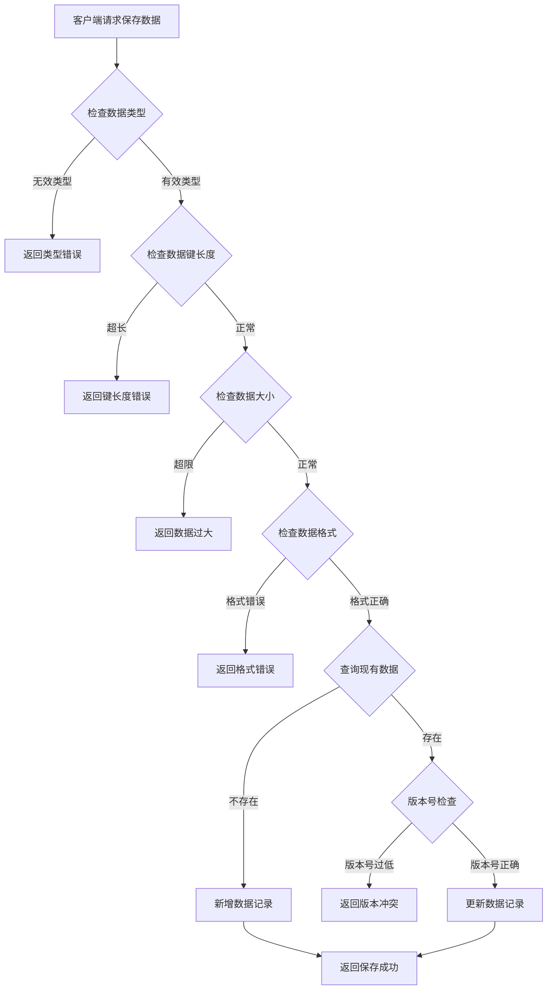
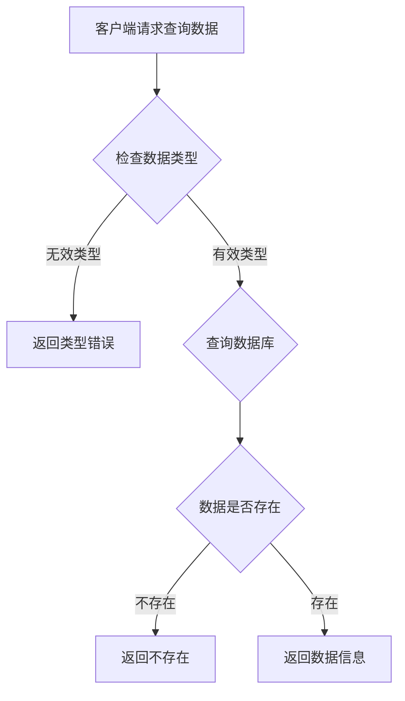
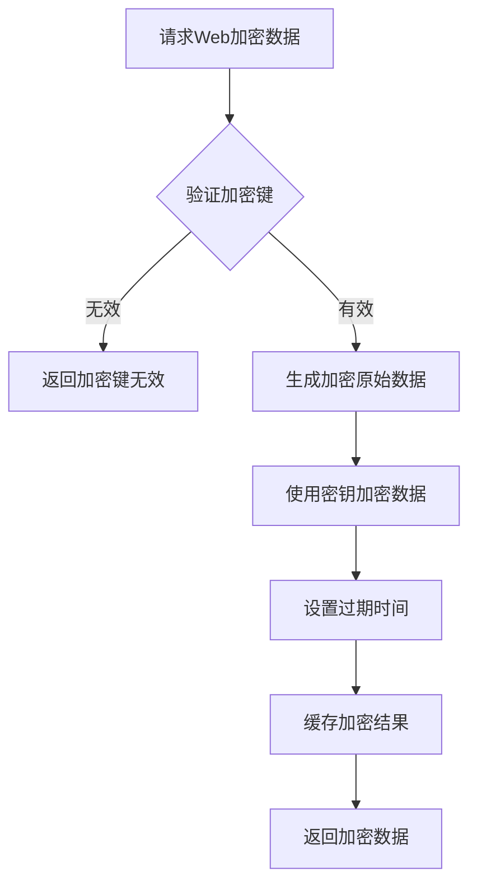
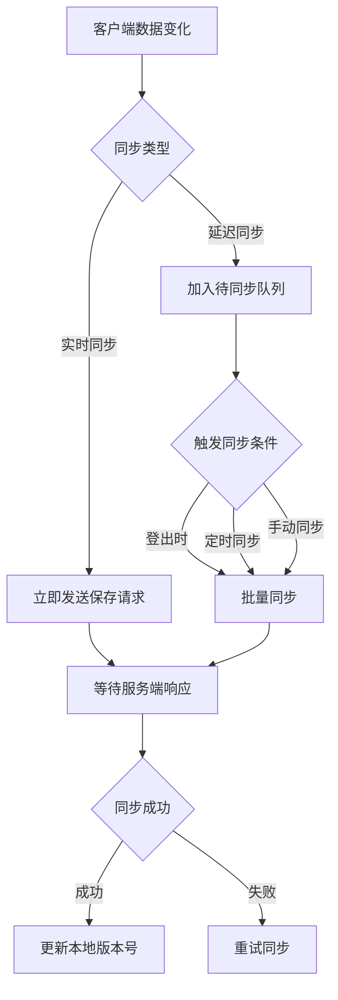

# 客户端数据模块完整说明

## 一、模块概述

### 1.1 业务背景

客户端数据模块是 K2C 游戏的基础设施模块，负责管理客户端本地数据的存储、同步和查询。该模块支持多种数据类型的存储，包括游戏设置、引导进度、红点状态等，确保玩家在不同设备间的数据一致性。

### 1.2 目标用户

- **游戏玩家**：通过该模块保存个人设置和游戏进度
- **开发团队**：利用该模块实现数据跨设备同步
- **运营人员**：通过Web加密数据接口进行数据验证

### 1.3 核心价值

1. **数据持久化**：客户端数据安全存储到服务端
2. **跨设备同步**：玩家更换设备后可恢复数据
3. **版本控制**：防止数据覆盖和冲突
4. **安全传输**：Web加密数据接口保障数据安全

---

## 二、功能清单

### 2.1 数据查询功能

| 功能名称 | 功能描述 | 用户价值 |
|---------|---------|---------|
| 查询客户端数据 | 根据类型和键查询数据 | 获取已保存的数据 |

### 2.2 数据保存功能

| 功能名称 | 功能描述 | 用户价值 |
|---------|---------|---------|
| 保存客户端数据 | 保存数据到服务端 | 持久化存储数据 |
| 批量同步数据 | 批量同步待同步数据 | 减少网络请求 |

### 2.3 Web加密功能

| 功能名称 | 功能描述 | 用户价值 |
|---------|---------|---------|
| 获取Web加密数据 | 生成加密数据供Web使用 | 安全传输数据 |

---

## 三、业务流程详解

### 3.1 客户端数据保存流程



**详细步骤说明**：

1. **数据校验**
   - 检查数据类型有效性
   - 检查数据键长度（最大128字符）
   - 检查数据大小（最大配置限制）

2. **格式验证**
   - 验证JSON格式正确性
   - 检查必填字段

3. **版本控制**
   - 新数据直接插入
   - 已有数据检查版本号
   - 版本号必须递增

4. **数据存储**
   - 保存到数据库
   - 更新缓存

### 3.2 客户端数据查询流程



**详细步骤说明**：

1. **参数验证**
   - 验证数据类型有效性
   - 验证数据键合法性

2. **数据查询**
   - 查询数据库记录
   - 返回数据值和版本号

### 3.3 Web加密数据流程



**详细步骤说明**：

1. **密钥验证**
   - 验证加密键有效性

2. **数据生成**
   - 生成需要加密的原始数据
   - 包含玩家ID、时间戳等信息

3. **加密处理**
   - 使用AES加密算法
   - 生成加密数据字符串

4. **过期设置**
   - 设置加密数据过期时间
   - 缓存到Redis

### 3.4 数据同步流程



---

## 四、关键规则

### 4.1 数据类型规则

| 类型ID | 类型名称 | 说明 |
|--------|----------|------|
| 1 | Settings | 客户端设置（音量、画面等） |
| 2 | Tutorial | 引导进度 |
| 3 | RedDot | 红点状态 |
| 4 | UIState | UI状态 |
| 5 | Cache | 缓存数据 |

### 4.2 同步类型规则

| 同步类型 | 类型值 | 说明 |
|----------|--------|------|
| 手动同步 | 0 | 手动触发同步 |
| 登录同步 | 1 | 登录时自动同步 |
| 登出同步 | 2 | 登出时自动同步 |
| 实时同步 | 3 | 数据变化立即同步 |

### 4.3 数据大小限制

1. **数据键**：最大128字符
2. **数据值**：最大64KB（可配置）
3. **单玩家总数据量**：最大1MB

### 4.4 版本号规则

1. **版本号生成**：使用时间戳或递增序列
2. **版本号验证**：新版本号必须大于现有版本号
3. **冲突处理**：版本冲突时拒绝更新

---

## 五、用户故事

### 5.1 设置同步故事

> 作为一名经常更换设备的玩家，我在手机上设置了游戏音量和画面质量。通过客户端数据同步功能，当我登录平板时，这些设置自动同步，无需重新配置，提供了无缝的游戏体验。

### 5.2 引导进度故事

> 作为一名新手玩家，我正在完成新手引导。中途我退出了游戏。下次登录时，引导进度自动恢复，我可以从上次的位置继续，不需要从头开始。

### 5.3 Web验证故事

> 作为一名运营人员，我需要验证玩家的某些数据。通过Web加密数据接口，我可以安全地获取玩家的加密信息，用于活动验证和客服处理。

---

## 六、示例

### 6.1 保存游戏设置示例

**输入数据**：
- 数据类型：1（Settings）
- 数据键：game_settings
- 数据值：
```json
{
    "bgmVolume": 0.8,
    "sfxVolume": 1.0,
    "isFullScreen": true,
    "language": "zh-CN"
}
```
- 版本号：1712505600000

**保存结果**：
```
数据类型：1
数据键：game_settings
状态：保存成功
新版本号：1712505600000
```

### 6.2 查询引导进度示例

**输入数据**：
- 数据类型：2（Tutorial）
- 数据键：tutorial_progress

**查询结果**：
```
数据类型：2
数据键：tutorial_progress
数据值：
{
    "currentStep": 15,
    "completedTutorials": [1, 2, 3, 4, 5],
    "lastUpdateTime": 1712505600000
}
版本号：1712505600000
存在：是
```

### 6.3 Web加密数据示例

**输入数据**：
- 加密键：activity_verify_001

**返回结果**：
```
加密键：activity_verify_001
加密数据：AES加密后的Base64字符串
过期时间：1712512800000（2小时后）
```

---

*文档生成时间: 2026-04-07*
