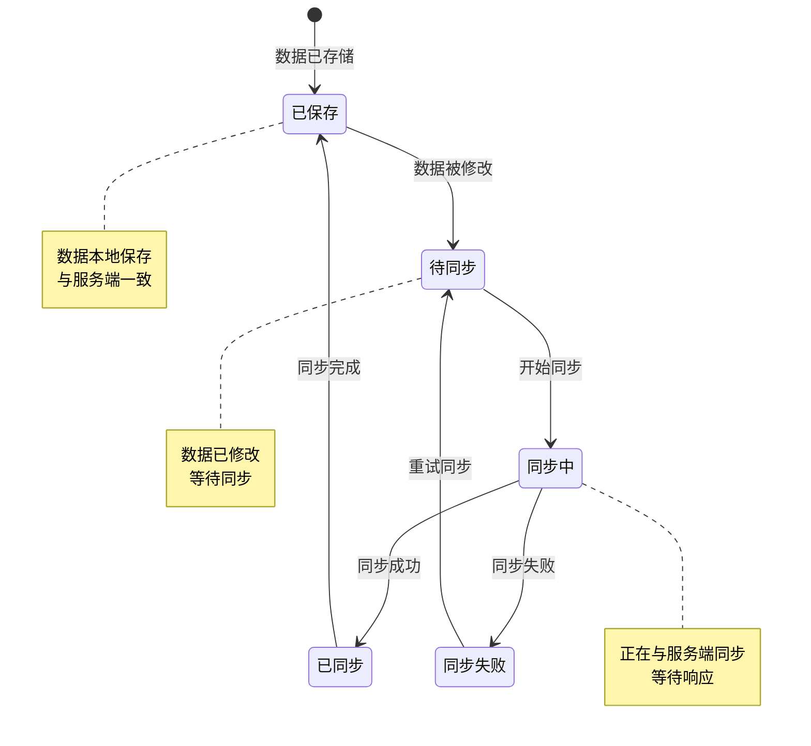
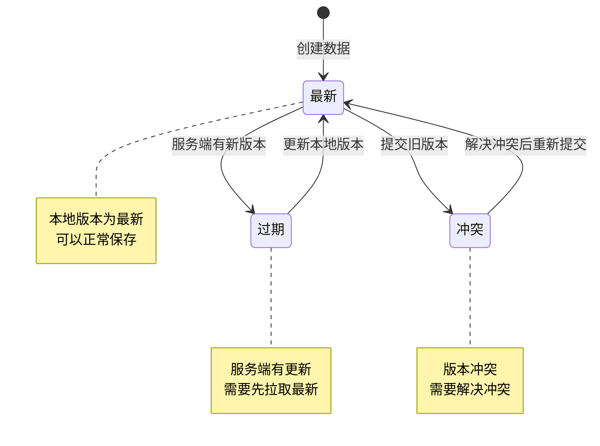
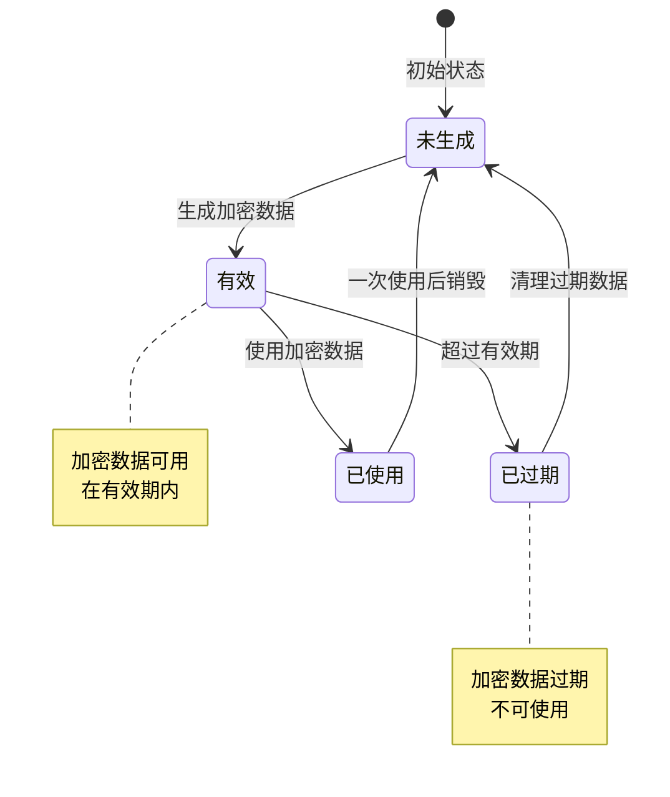
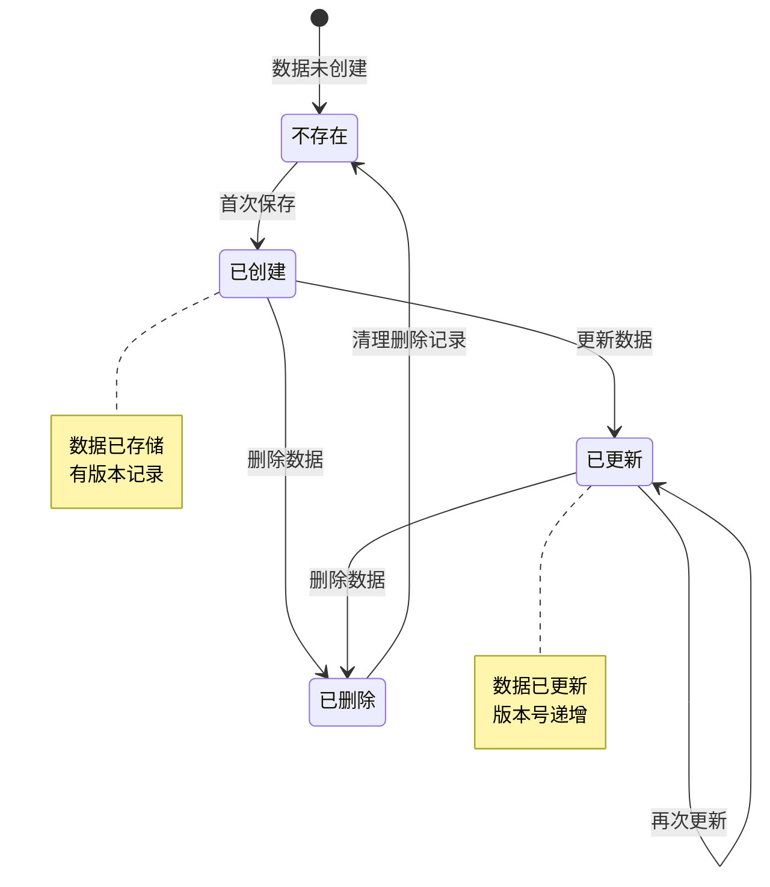
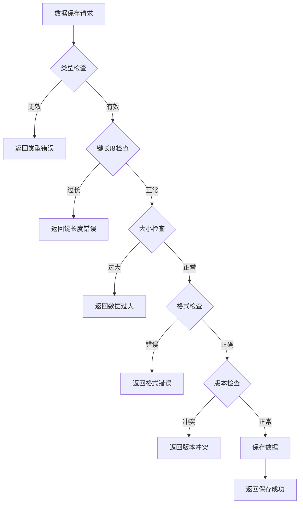

# 客户端数据模块实现细节

## 一、计算公式

### 1.1 版本号生成公式

```
版本号 = 当前时间戳(毫秒) × 1000 + 序列号
```

**参数说明**：
- `当前时间戳`：Unix时间戳（毫秒）
- `序列号`：同一毫秒内的递增序号（0-999）

**示例计算**：
```
当前时间：2026-04-07 10:00:00
时间戳：1712505600000
序列号：1

版本号 = 1712505600000 × 1000 + 1 = 1712505600000001
```

### 1.2 数据大小计算公式

```
数据大小 = UTF8编码后的字节数
```

**示例计算**：
```
JSON数据：{"bgmVolume": 0.8, "sfxVolume": 1.0}
UTF8字节数：42字节
```

### 1.3 加密数据过期时间计算

```
过期时间 = 当前时间 + 过期时长（默认2小时）
```

---

## 二、状态机定义

### 2.1 数据同步状态机



### 2.2 数据版本状态机



### 2.3 加密数据状态机



### 2.4 数据存储状态机



---

## 三、数据约束

### 3.1 客户端数据表约束

| 字段名 | 数据类型 | 取值范围 | 必填 | 唯一性 | 说明 |
|--------|----------|----------|------|--------|------|
| id | bigint | > 0 | 是 | 是 | 主键ID |
| player_id | bigint | > 0 | 是 | 否 | 玩家ID |
| data_type | int | 1-10 | 是 | 否 | 数据类型 |
| data_key | varchar(128) | 1-128字符 | 是 | 否 | 数据键 |
| data_value | text | 最大64KB | 是 | 否 | 数据值（JSON） |
| version | bigint | > 0 | 是 | 否 | 版本号 |
| update_time | datetime | - | 是 | 否 | 更新时间 |

### 3.2 复合唯一约束

```
UNIQUE(player_id, data_type, data_key)
```

### 3.3 索引约束

| 索引名 | 索引字段 | 索引类型 |
|--------|----------|----------|
| pk_id | id | 主键索引 |
| idx_player_type_key | player_id, data_type, data_key | 唯一索引 |
| idx_update_time | update_time | 普通索引 |

### 3.4 Web加密数据约束

| 字段名 | 数据类型 | 取值范围 | 必填 | 说明 |
|--------|----------|----------|------|------|
| encrypt_key | string | 1-64字符 | 是 | 加密键 |
| encrypt_data | string | - | 是 | 加密数据 |
| expire_time | long | > 0 | 是 | 过期时间戳 |

---

## 四、错误处理策略

### 4.1 客户端数据模块错误码

| 错误码 | 错误信息 | 处理策略 | 用户提示 |
|--------|----------|----------|----------|
| 11001 | 无效的数据类型 | 检查数据类型范围 | "数据类型无效" |
| 11002 | 数据键过长 | 检查键长度 | "数据键过长，最大128字符" |
| 11003 | 数据值过大 | 检查数据大小 | "数据过大，请减少内容" |
| 11004 | 数据格式错误 | 检查JSON格式 | "数据格式错误" |
| 11005 | 版本号冲突 | 提示刷新数据 | "数据已过期，请刷新后重试" |
| 11006 | 加密键无效 | 检查加密键 | "加密键无效" |
| 11007 | 加密数据已过期 | 重新获取加密数据 | "加密数据已过期" |

### 4.2 数据保存错误处理流程



### 4.3 版本冲突处理策略

| 冲突类型 | 处理策略 | 解决方案 |
|----------|----------|----------|
| 本地版本过低 | 拒绝保存 | 提示用户刷新数据 |
| 服务端版本更新 | 返回最新数据 | 客户端合并后重新提交 |
| 并发更新冲突 | 后提交者失败 | 提示用户重试 |

---

## 五、关键代码示例

### 5.1 保存客户端数据伪代码

```csharp
public Result SaveClientData(long playerId, int dataType, string dataKey, string dataValue, long version)
{
    // 1. 检查数据类型
    if (!IsValidDataType(dataType))
    {
        return Result.Error(11001, "无效的数据类型");
    }

    // 2. 检查数据键长度
    if (string.IsNullOrEmpty(dataKey) || dataKey.Length > 128)
    {
        return Result.Error(11002, "数据键过长");
    }

    // 3. 检查数据大小
    if (dataValue != null && Encoding.UTF8.GetByteCount(dataValue) > MAX_DATA_SIZE)
    {
        return Result.Error(11003, "数据过大");
    }

    // 4. 验证JSON格式
    try
    {
        if (!string.IsNullOrEmpty(dataValue))
        {
            JsonDocument.Parse(dataValue);
        }
    }
    catch
    {
        return Result.Error(11004, "数据格式错误");
    }

    // 5. 查询现有数据
    PlayerClientData existingData = clientDataDao.SelectByPlayerAndKey(playerId, dataType, dataKey);

    if (existingData == null)
    {
        // 6. 新增数据
        PlayerClientData newData = new PlayerClientData
        {
            Id = idGenerator.NextId(),
            PlayerId = playerId,
            DataType = dataType,
            DataKey = dataKey,
            DataValue = dataValue,
            Version = version,
            UpdateTime = DateTime.Now
        };
        clientDataDao.Insert(newData);
    }
    else
    {
        // 7. 版本检查
        if (version <= existingData.Version)
        {
            return Result.Error(11005, "版本号冲突");
        }

        // 8. 更新数据
        existingData.DataValue = dataValue;
        existingData.Version = version;
        existingData.UpdateTime = DateTime.Now;
        clientDataDao.UpdateById(existingData);
    }

    return Result.Success(new { dataType, dataKey, success = true, version });
}
```

### 5.2 查询客户端数据伪代码

```csharp
public Result QueryClientData(long playerId, int dataType, string dataKey)
{
    // 1. 检查数据类型
    if (!IsValidDataType(dataType))
    {
        return Result.Error(11001, "无效的数据类型");
    }

    // 2. 查询数据
    PlayerClientData data = clientDataDao.SelectByPlayerAndKey(playerId, dataType, dataKey);

    if (data == null)
    {
        // 3. 返回不存在
        return Result.Success(new
        {
            dataType,
            dataKey,
            dataValue = (string)null,
            version = 0L,
            exist = false
        });
    }

    // 4. 返回数据
    return Result.Success(new
    {
        dataType,
        dataKey,
        dataValue = data.DataValue,
        version = data.Version,
        exist = true
    });
}
```

### 5.3 Web加密数据伪代码

```csharp
public Result GetWebEncryptedData(long playerId, string encryptKey)
{
    // 1. 验证加密键
    if (string.IsNullOrEmpty(encryptKey))
    {
        return Result.Error(11006, "加密键无效");
    }

    // 2. 检查缓存是否存在
    string cacheKey = $"web_encrypt:{playerId}:{encryptKey}";
    string cachedData = redisCache.Get(cacheKey);

    if (!string.IsNullOrEmpty(cachedData))
    {
        // 3. 返回缓存的加密数据
        return Result.Success(new WebEncryptedData
        {
            EncryptKey = encryptKey,
            EncryptData = cachedData,
            ExpireTime = DateTime.Now.AddHours(2).Ticks
        });
    }

    // 4. 生成原始数据
    var rawData = new
    {
        playerId = playerId,
        timestamp = DateTime.Now.Ticks,
        nonce = Guid.NewGuid().ToString()
    };
    string rawJson = JsonSerializer.Serialize(rawData);

    // 5. 加密数据
    string encryptData = AESUtil.Encrypt(rawJson, GetEncryptSecret(encryptKey));

    // 6. 计算过期时间
    long expireTime = DateTime.Now.AddHours(2).Ticks;

    // 7. 缓存加密数据
    redisCache.Set(cacheKey, encryptData, TimeSpan.FromHours(2));

    // 8. 返回结果
    return Result.Success(new WebEncryptedData
    {
        EncryptKey = encryptKey,
        EncryptData = encryptData,
        ExpireTime = expireTime
    });
}
```

### 5.4 数据同步管理伪代码

```csharp
public class ClientDataSyncManager
{
    private Queue<ClientDataInfo> pendingSyncQueue = new Queue<ClientDataInfo>();
    private Dictionary<string, long> localVersions = new Dictionary<string, long>();

    public void SetData<T>(int dataType, string dataKey, T data, bool syncNow = false)
    {
        // 1. 生成版本号
        long version = GenerateVersion();

        // 2. 序列化数据
        string jsonValue = JsonSerializer.Serialize(data);

        // 3. 更新本地缓存
        string cacheKey = $"{dataType}_{dataKey}";
        localVersions[cacheKey] = version;

        // 4. 创建同步信息
        var syncInfo = new ClientDataInfo
        {
            DataType = dataType,
            DataKey = dataKey,
            DataValue = jsonValue,
            Version = version
        };

        if (syncNow)
        {
            // 5. 立即同步
            SyncData(syncInfo);
        }
        else
        {
            // 6. 加入待同步队列
            pendingSyncQueue.Enqueue(syncInfo);
        }
    }

    public void SyncPendingData()
    {
        while (pendingSyncQueue.Count > 0)
        {
            var syncInfo = pendingSyncQueue.Dequeue();
            SyncData(syncInfo);
        }
    }

    private void SyncData(ClientDataInfo syncInfo)
    {
        // 发送同步请求到服务端
        var response = SendSyncRequest(syncInfo);

        if (response.Success)
        {
            // 更新本地版本号
            string cacheKey = $"{syncInfo.DataType}_{syncInfo.DataKey}";
            localVersions[cacheKey] = response.Version;
        }
        else if (response.ErrorCode == 11005)
        {
            // 版本冲突，需要处理
            HandleVersionConflict(syncInfo, response);
        }
    }

    private long GenerateVersion()
    {
        return DateTimeOffset.UtcNow.ToUnixTimeMilliseconds() * 1000 +
               Interlocked.Increment(ref versionSequence) % 1000;
    }
}
```

### 5.5 数据清理伪代码

```csharp
public void CleanExpiredData()
{
    // 1. 计算过期日期（180天前）
    DateTime expireDate = DateTime.Now.AddDays(-180);

    // 2. 删除过期数据
    int deletedCount = clientDataDao.DeleteByUpdateTime(expireDate);

    // 3. 记录日志
    logger.Info($"Cleaned {deletedCount} expired client data records");

    // 4. 清理过期的Web加密数据缓存
    CleanExpiredEncryptCache();
}

private void CleanExpiredEncryptCache()
{
    // 批量删除过期的加密数据缓存
    var keys = redisCache.ScanKeys("web_encrypt:*");
    foreach (var key in keys)
    {
        var ttl = redisCache.GetTtl(key);
        if (ttl < 0)
        {
            redisCache.Delete(key);
        }
    }
}
```

---

## 六、跨模块依赖

### 6.1 依赖模块

| 模块名称 | 依赖方式 | 依赖内容 |
|----------|----------|----------|
| Player | 强依赖 | 玩家身份验证 |
| Cache | 强依赖 | Redis缓存服务 |
| Database | 强依赖 | 数据持久化存储 |

### 6.2 被依赖模块

| 模块名称 | 被依赖内容 |
|----------|------------|
| Tutorial | 引导进度存储 |
| Settings | 游戏设置存储 |
| UI | UI状态存储 |
| RedDot | 红点状态存储 |

### 6.3 接口定义

```csharp
// 数据存储接口
interface IClientDataStorage
{
    void Save(long playerId, int dataType, string dataKey, string dataValue, long version);
    ClientDataInfo Query(long playerId, int dataType, string dataKey);
    void Delete(long playerId, int dataType, string dataKey);
}

// 缓存接口
interface ICacheService
{
    void Set(string key, string value, TimeSpan? expiry = null);
    string Get(string key);
    void Delete(string key);
    TimeSpan GetTtl(string key);
}

// 加密接口
interface IEncryptService
{
    string Encrypt(string plainText, string key);
    string Decrypt(string cipherText, string key);
}
```

---

## 七、性能优化建议

### 7.1 缓存策略

1. **热点数据缓存**
   - 最近访问的数据缓存到Redis
   - 设置合理的过期时间

2. **加密数据缓存**
   - Web加密数据缓存到Redis
   - 避免重复加密计算

### 7.2 数据库优化

1. **索引优化**
   - player_id + data_type + data_key 复合唯一索引
   - update_time 索引用于清理过期数据

2. **分表策略**
   - 按玩家ID取模分表
   - 减少单表数据量

### 7.3 同步优化

1. **批量同步**
   - 合并多个数据变更为一次请求
   - 减少网络开销

2. **延迟同步**
   - 非关键数据延迟同步
   - 登出时统一同步

3. **压缩传输**
   - 大数据进行压缩后传输
   - 减少带宽占用

---

*文档生成时间: 2026-04-07*
