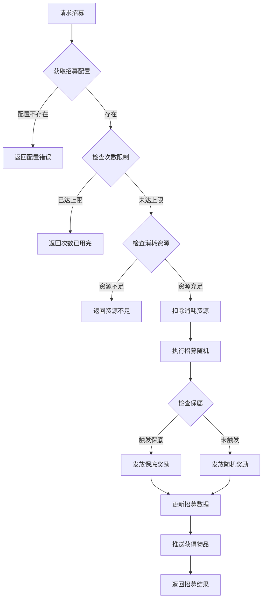
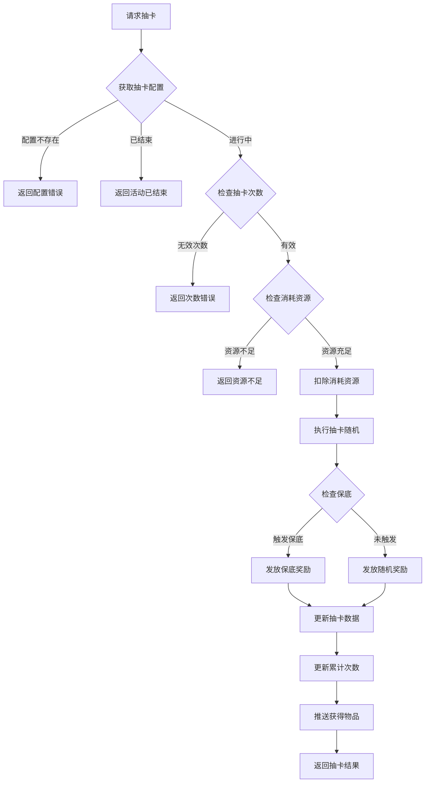
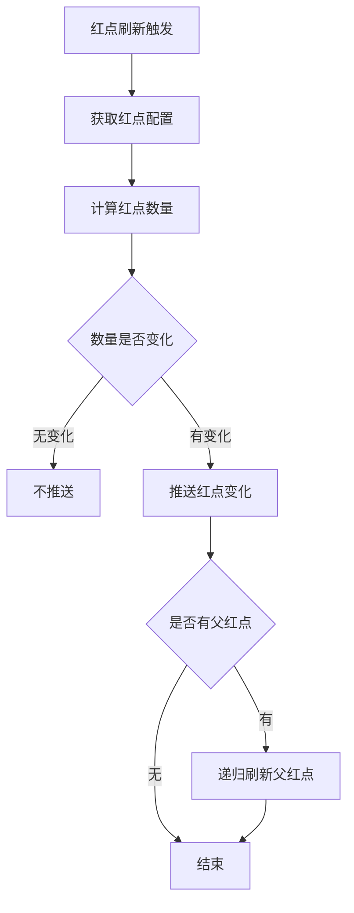
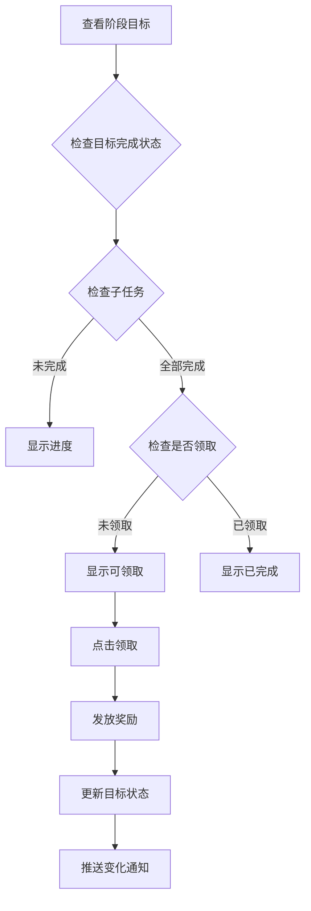
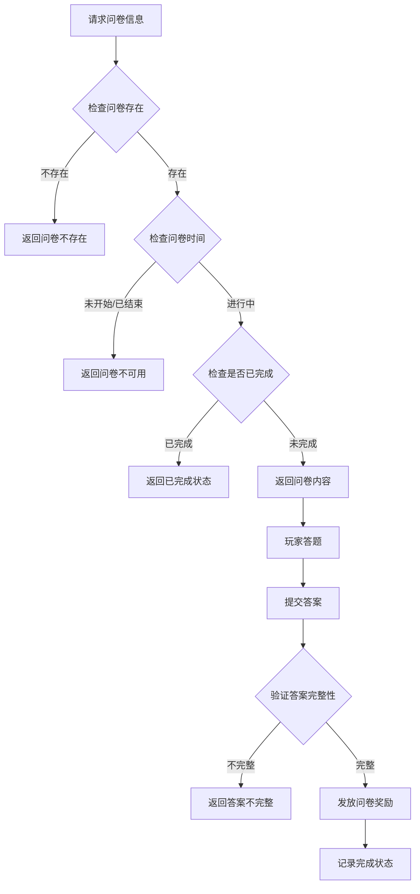

# 通用操作模块完整说明

## 一、模块概述

### 1.1 业务背景

通用操作模块是 K2C 游戏的核心功能模块，包含招募、抽卡、红点系统、阶段目标、问卷调查等多种通用功能。该模块集中管理游戏中的通用玩法，为其他模块提供基础支持。

### 1.2 目标用户

- **所有游戏玩家**：通过招募和抽卡获取角色和道具
- **运营人员**：通过问卷收集玩家反馈
- **系统管理员**：管理红点和阶段目标配置

### 1.3 核心价值

1. **资源获取**：招募和抽卡系统是玩家获取稀有资源的主要途径
2. **用户引导**：阶段目标引导玩家游戏进程
3. **信息提醒**：红点系统帮助玩家及时了解游戏动态
4. **用户调研**：问卷系统收集玩家反馈

---

## 二、功能清单

### 2.1 招募功能

| 功能名称 | 功能描述 | 用户价值 |
|---------|---------|---------|
| 普通招募 | 消耗基础货币招募 | 获取普通资源 |
| 英雄招募 | 消耗钻石招募英雄 | 获取英雄角色 |
| 伴侣招募 | 招募伴侣角色 | 获取伴侣 |
| 特殊招募 | 限时特殊招募 | 获取限定角色 |

### 2.2 抽卡功能

| 功能名称 | 功能描述 | 用户价值 |
|---------|---------|---------|
| 普通抽卡 | 基础抽卡池 | 获取基础道具 |
| 限定抽卡 | 限时UP池 | 获取限定角色 |
| 友情抽卡 | 消耗友情点抽卡 | 免费获取资源 |
| 抽卡记录 | 查看抽卡历史 | 了解抽卡结果 |
| 累计奖励 | 抽卡累计次数奖励 | 激励持续抽卡 |

### 2.3 红点系统功能

| 功能名称 | 功能描述 | 用户价值 |
|---------|---------|---------|
| 红点显示 | 显示未读/可领取提示 | 及时了解动态 |
| 红点清除 | 清除红点状态 | 清理已处理提示 |
| 红点检查 | 检查红点状态 | 获取当前状态 |
| 红点推送 | 服务端推送红点变化 | 实时更新状态 |

### 2.4 阶段目标功能

| 功能名称 | 功能描述 | 用户价值 |
|---------|---------|---------|
| 目标展示 | 展示当前阶段目标 | 了解游戏目标 |
| 首通奖励 | 首次达成目标奖励 | 激励达成目标 |
| 子任务奖励 | 完成子任务奖励 | 分步奖励 |
| 大阶段奖励 | 完成大阶段奖励 | 阶段性奖励 |

### 2.5 问卷功能

| 功能名称 | 功能描述 | 用户价值 |
|---------|---------|---------|
| 问卷展示 | 展示问卷内容 | 收集玩家反馈 |
| 答题提交 | 提交问卷答案 | 完成问卷 |
| 问卷奖励 | 完成问卷获得奖励 | 激励参与调研 |

### 2.6 分享功能

| 功能名称 | 功能描述 | 用户价值 |
|---------|---------|---------|
| 生成分享码 | 生成分享邀请码 | 邀请好友 |
| 获取分享数据 | 通过分享码获取数据 | 接受邀请 |

---

## 三、业务流程详解

### 3.1 招募流程



**详细步骤说明**：

1. **配置验证**
   - 获取招募配置信息
   - 验证招募池是否开放

2. **条件检查**
   - 检查每日次数限制
   - 检查资源是否充足

3. **执行招募**
   - 扣除消耗资源
   - 判断是否触发保底
   - 随机抽取奖励

4. **奖励发放**
   - 发放抽到的奖励
   - 更新招募统计

### 3.2 抽卡流程



**详细步骤说明**：

1. **配置验证**
   - 获取抽卡池配置
   - 验证抽卡池是否开放

2. **次数检查**
   - 抽卡次数只能为1或10
   - 检查十连是否有折扣

3. **保底处理**
   - 检查当前保底计数
   - 达到保底次数时触发保底

4. **累计奖励**
   - 更新累计抽卡次数
   - 检查是否达成累计奖励

### 3.3 红点刷新流程



**详细步骤说明**：

1. **触发刷新**
   - 模块状态变化触发
   - 定时刷新触发

2. **数量计算**
   - 根据配置计算红点数量
   - 如邮件未读数、任务可领取数等

3. **层级刷新**
   - 红点支持层级关系
   - 父红点数量为子红点之和

### 3.4 阶段目标流程



### 3.5 问卷流程



---

## 四、关键规则

### 4.1 招募类型规则

| 招募类型 | 类型ID | 说明 |
|----------|--------|------|
| 普通招募 | 1 | 基础货币招募 |
| 英雄招募 | 2 | 钻石招募英雄 |
| 伴侣招募 | 3 | 招募伴侣 |
| 特殊招募 | 4 | 限时招募 |

### 4.2 抽卡类型规则

| 抽卡类型 | 类型ID | 说明 |
|----------|--------|------|
| 普通抽卡 | 1 | 基础奖池 |
| 限定抽卡 | 2 | 限时UP池 |
| 友情抽卡 | 3 | 友情点抽卡 |

### 4.3 保底规则

1. **小保底**：累计一定次数必得SR以上
2. **大保底**：累计更多次数必得SSR
3. **保底继承**：同一池子的保底计数继承

### 4.4 红点层级规则

1. **父子关系**：红点可配置父子关系
2. **数量汇总**：父红点数量为所有子红点之和
3. **状态同步**：子红点清除时，父红点自动更新

---

## 五、用户故事

### 5.1 抽卡玩家故事

> 作为一名抽卡玩家，我在限定卡池看到了心仪的SSR角色。我攒够了钻石，决定十连抽。系统显示我当前保底计数为79，再抽一次就能触发大保底。十连抽后，我果然获得了UP的SSR角色，保底计数重置为0。

### 5.2 阶段目标故事

> 作为一名新手玩家，系统展示了当前阶段的成长目标。我按照目标指引完成了一个又一个任务，每次完成都能获得奖励。当我完成所有子任务后，领取了大阶段奖励，感受到了成长的成就感。

### 5.3 红点提醒故事

> 作为一名活跃玩家，我登录游戏后看到主界面有很多红点。点击红点后，发现是有新的邮件和可领取的任务奖励。红点系统帮助我快速了解需要处理的事项。

---

## 六、示例

### 6.1 招募示例

**输入数据**：
- 招募ID：1（英雄招募）
- 招募次数：10

**招募结果**：
```
招募ID：1
招募次数：10
获得列表：
  - 英雄ID: 10001, 数量: 1, 稀有度: SSR
  - 英雄碎片ID: 20001, 数量: 30, 稀有度: R
  - 钻石, 数量: 100, 稀有度: N
  - ...
保底计数：0（已触发大保底）
```

### 6.2 抽卡示例

**输入数据**：
- 抽卡ID：2（限定卡池）
- 抽卡次数：10

**抽卡结果**：
```
抽卡ID：2
抽卡次数：10
获得列表：
  - 角色ID: 30001, 数量: 1, 稀有度: SSR
  - 角色碎片ID: 30002, 数量: 50, 稀有度: SR
  - ...
当前保底计数：45
累计抽卡次数：145
```

### 6.3 红点示例

**红点状态**：
```
红点ID: 100（邮件）, 数量: 3
红点ID: 101（任务）, 数量: 5
红点ID: 102（活动）, 数量: 2
红点ID: 1（主界面）, 数量: 10（汇总）
```

### 6.4 阶段目标示例

**目标状态**：
```
目标ID: 1
阶段: 1
名称: 新手成长
子任务:
  - 任务ID: 101, 进度: 10/10, 状态: 可领取
  - 任务ID: 102, 进度: 5/5, 状态: 已领取
  - 任务ID: 103, 进度: 3/10, 状态: 进行中
整体进度: 2/3
```

---

*文档生成时间: 2026-04-07*
