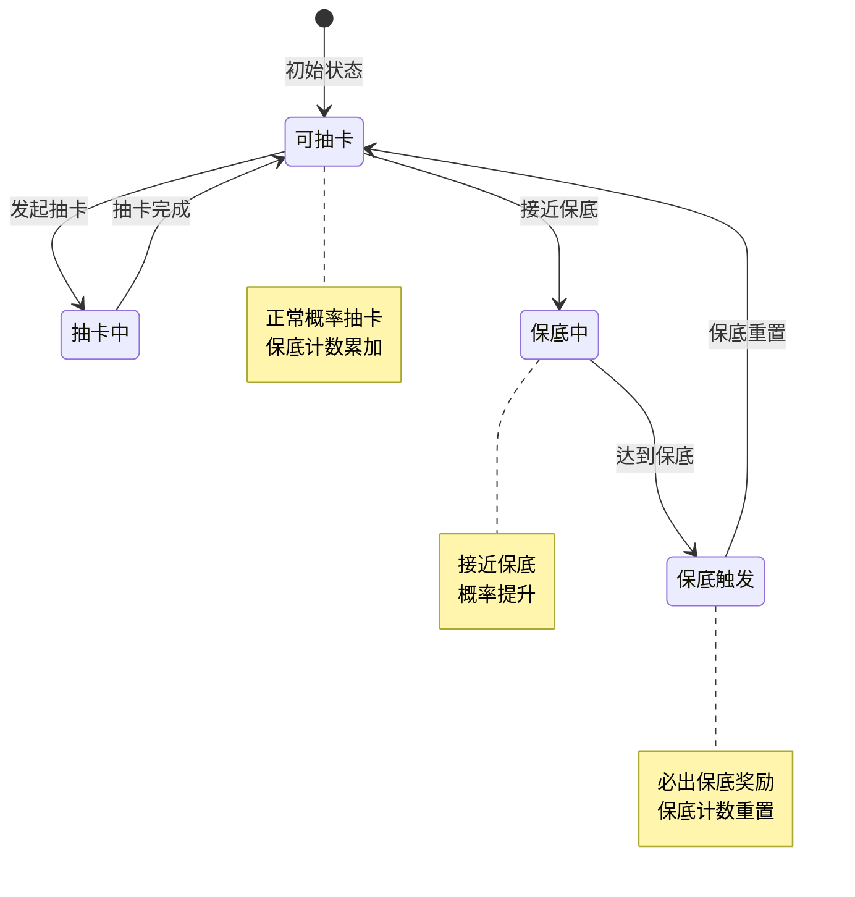
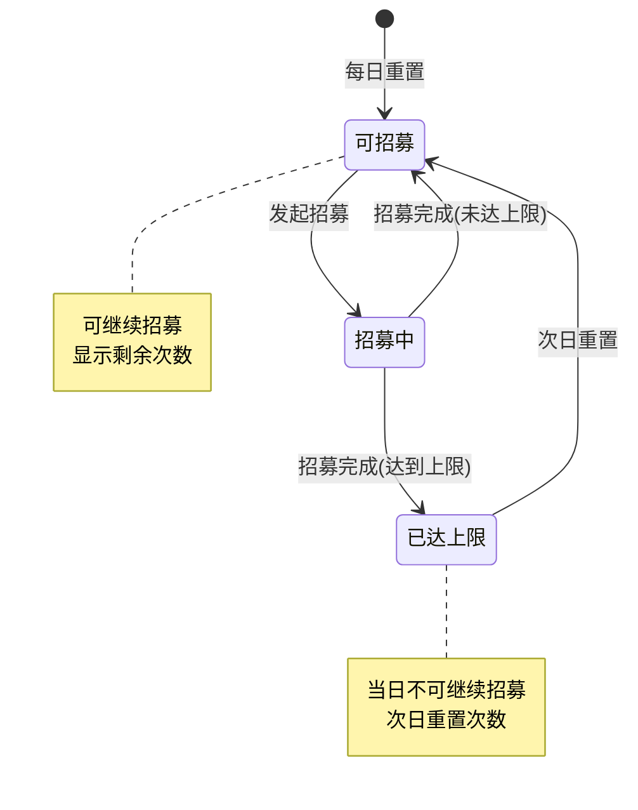
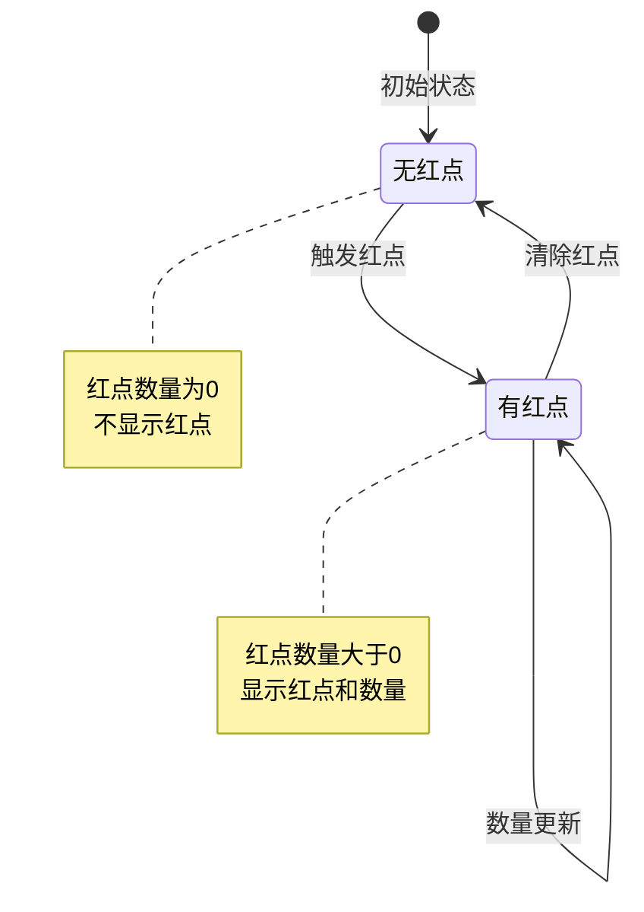
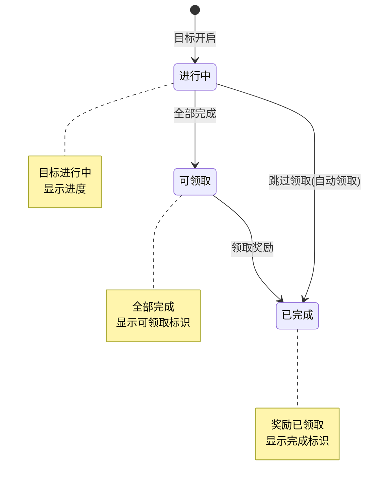
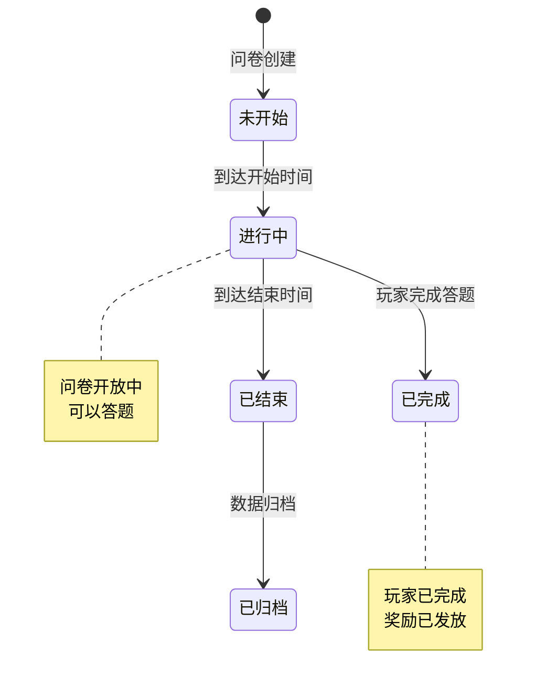
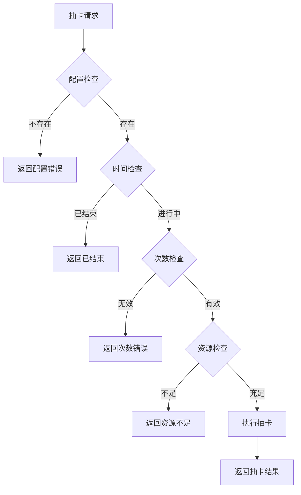

# 通用操作模块实现细节

## 一、计算公式

### 1.1 抽卡概率计算公式

```
实际概率 = 基础概率 × (1 + 保底概率加成)
```

**参数说明**：
- `基础概率`：配置表中的原始概率
- `保底概率加成`：接近保底时的概率提升

**示例计算**：
```
SSR基础概率: 1%
保底概率加成: 0（未接近保底）
实际概率 = 1% × (1 + 0) = 1%

接近保底时:
保底概率加成: 50%（保底前10抽）
实际概率 = 1% × (1 + 0.5) = 1.5%
```

### 1.2 保底计数计算公式

```
当前保底计数 = 上次保底后的抽数
触发保底阈值 = 配置的保底次数（如90）
保底进度 = 当前保底计数 / 触发保底阈值
```

**示例计算**：
```
当前保底计数: 45
触发保底阈值: 90
保底进度 = 45 / 90 = 50%
```

### 1.3 红点数量计算公式

```
父红点数量 = Σ(所有子红点数量)
```

**示例计算**：
```
子红点1数量: 3（邮件）
子红点2数量: 5（任务）
子红点3数量: 2（活动）

父红点数量 = 3 + 5 + 2 = 10
```

### 1.4 阶段目标进度计算

```
阶段进度 = 已完成子任务数 / 总子任务数 × 100%
```

---

## 二、状态机定义

### 2.1 抽卡状态机



### 2.2 招募状态机



### 2.3 红点状态机



### 2.4 阶段目标状态机



### 2.5 问卷状态机



---

## 三、数据约束

### 3.1 招募数据约束

| 字段名 | 数据类型 | 取值范围 | 必填 | 说明 |
|--------|----------|----------|------|------|
| player_id | bigint | > 0 | 是 | 玩家ID |
| recruit_id | int | > 0 | 是 | 招募ID |
| total_count | int | >= 0 | 是 | 总次数 |
| guarantee_count | int | >= 0 | 是 | 保底计数 |
| today_count | int | >= 0 | 是 | 今日次数 |
| last_recruit_time | datetime | - | 是 | 最后招募时间 |

### 3.2 抽卡数据约束

| 字段名 | 数据类型 | 取值范围 | 必填 | 说明 |
|--------|----------|----------|------|------|
| player_id | bigint | > 0 | 是 | 玩家ID |
| gacha_id | int | > 0 | 是 | 抽卡ID |
| total_count | int | >= 0 | 是 | 总次数 |
| guarantee_count | int | >= 0 | 是 | 保底计数 |
| cumulative_reward | json | - | 否 | 累计奖励领取状态 |

### 3.3 红点数据约束

| 字段名 | 数据类型 | 取值范围 | 必填 | 说明 |
|--------|----------|----------|------|------|
| red_dot_id | int | > 0 | 是 | 红点ID |
| player_id | bigint | > 0 | 是 | 玩家ID |
| count | int | >= 0 | 是 | 红点数量 |
| state | int | 0-1 | 是 | 状态 |
| update_time | datetime | - | 是 | 更新时间 |

### 3.4 阶段目标数据约束

| 字段名 | 数据类型 | 取值范围 | 必填 | 说明 |
|--------|----------|----------|------|------|
| player_id | bigint | > 0 | 是 | 玩家ID |
| goal_id | int | > 0 | 是 | 目标ID |
| stage | int | >= 1 | 是 | 阶段 |
| progress | int | >= 0 | 是 | 进度 |
| state | int | 0-2 | 是 | 状态 |
| reward_taken | json | - | 是 | 已领取奖励 |

### 3.5 问卷数据约束

| 字段名 | 数据类型 | 取值范围 | 必填 | 说明 |
|--------|----------|----------|------|------|
| player_id | bigint | > 0 | 是 | 玩家ID |
| questionnaire_id | int | > 0 | 是 | 问卷ID |
| answer_list | json | - | 是 | 答案列表 |
| complete_time | datetime | - | 否 | 完成时间 |
| reward_taken | bool | - | 是 | 是否已领取奖励 |

---

## 四、错误处理策略

### 4.1 通用操作模块错误码

| 错误码 | 错误信息 | 处理策略 | 用户提示 |
|--------|----------|----------|----------|
| 7001 | 招募配置不存在 | 检查招募ID | "招募活动不存在" |
| 7002 | 招募次数已达上限 | 提示剩余次数 | "今日招募次数已用完" |
| 7003 | 抽卡池不存在 | 检查抽卡ID | "抽卡池不存在" |
| 7004 | 抽卡池已结束 | 提示结束时间 | "该抽卡池已结束" |
| 7005 | 无效的抽卡次数 | 提示有效次数 | "抽卡次数只能为1或10" |
| 7006 | 阶段目标不存在 | 检查目标ID | "阶段目标不存在" |
| 7007 | 阶段目标未完成 | 显示进度 | "目标尚未完成" |
| 7008 | 奖励已领取 | 提示已领取 | "奖励已领取" |
| 7009 | 问卷不存在 | 检查问卷ID | "问卷不存在" |
| 7010 | 问卷已结束 | 提示结束时间 | "问卷已结束" |
| 7011 | 问卷已完成 | 显示完成状态 | "您已完成问卷" |

### 4.2 抽卡错误处理流程



### 4.3 红点刷新错误处理

| 错误场景 | 处理策略 |
|----------|----------|
| 红点配置缺失 | 跳过该红点，记录日志 |
| 模块数据获取失败 | 返回0数量 |
| 推送失败 | 重试3次，失败后记录日志 |

---

## 五、关键代码示例

### 5.1 招募逻辑伪代码

```csharp
public Result Recruit(long playerId, int recruitId, int count)
{
    // 1. 获取招募配置
    RecruitConfig config = recruitConfigDao.GetById(recruitId);
    if (config == null)
    {
        return Result.Error(7001, "招募配置不存在");
    }

    // 2. 检查每日次数限制
    PlayerRecruit playerRecruit = recruitDao.GetByPlayerAndId(playerId, recruitId);
    if (config.dailyLimit > 0 && playerRecruit.todayCount + count > config.dailyLimit)
    {
        return Result.Error(7002, "招募次数已达上限");
    }

    // 3. 计算消耗
    List<CostInfo> costList = CalculateRecruitCost(config, count);

    // 4. 检查并扣除资源
    if (!resourceService.CheckAndConsume(playerId, costList))
    {
        return Result.Error(0, "资源不足");
    }

    // 5. 执行招募
    List<RecruitResult> results = new List<RecruitResult>();
    for (int i = 0; i < count; i++)
    {
        RecruitResult result = DoSingleRecruit(playerId, config, playerRecruit);
        results.Add(result);
    }

    // 6. 更新招募数据
    playerRecruit.totalCount += count;
    playerRecruit.todayCount += count;
    recruitDao.UpdateById(playerRecruit);

    // 7. 推送获得物品
    PushGainItemList(playerId, results);

    return Result.Success(new { recruitId, resultList = results });
}

private RecruitResult DoSingleRecruit(long playerId, RecruitConfig config, PlayerRecruit playerRecruit)
{
    // 检查是否触发保底
    bool guarantee = false;
    if (config.guaranteeCount > 0 &&
        playerRecruit.guaranteeCount >= config.guaranteeCount - 1)
    {
        guarantee = true;
        playerRecruit.guaranteeCount = 0;
    }
    else
    {
        playerRecruit.guaranteeCount++;
    }

    // 随机抽取
    int itemId = RandomFromPool(config.rewardPool, guarantee);

    // 发放奖励
    itemService.GiveItem(playerId, itemId, 1);

    return new RecruitResult(itemId, 1, GetItemRarity(itemId));
}
```

### 5.2 抽卡逻辑伪代码

```csharp
public Result GachaRoll(long playerId, int gachaId, int count)
{
    // 1. 获取抽卡配置
    GachaConfig config = gachaConfigDao.GetById(gachaId);
    if (config == null)
    {
        return Result.Error(7003, "抽卡池不存在");
    }

    // 2. 检查时间
    if (config.endTime < DateTime.Now)
    {
        return Result.Error(7004, "抽卡池已结束");
    }

    // 3. 检查次数
    if (count != 1 && count != 10)
    {
        return Result.Error(7005, "无效的抽卡次数");
    }

    // 4. 计算消耗
    List<CostInfo> costList = CalculateGachaCost(config, count);

    // 5. 检查并扣除资源
    if (!resourceService.CheckAndConsume(playerId, costList))
    {
        return Result.Error(0, "资源不足");
    }

    // 6. 执行抽卡
    PlayerGacha playerGacha = gachaDao.GetByPlayerAndId(playerId, gachaId);
    List<GachaResult> results = new List<GachaResult>();

    for (int i = 0; i < count; i++)
    {
        GachaResult result = DoSingleGacha(playerId, config, playerGacha);
        results.Add(result);
    }

    // 7. 更新抽卡数据
    playerGacha.totalCount += count;
    gachaDao.UpdateById(playerGacha);

    // 8. 推送获得物品
    PushGainItemList(playerId, results);

    return Result.Success(new { gachaId, resultList = results, guaranteeCount = playerGacha.guaranteeCount });
}

private GachaResult DoSingleGacha(long playerId, GachaConfig config, PlayerGacha playerGacha)
{
    // 计算概率加成
    double rateBonus = CalculateRateBonus(playerGacha.guaranteeCount, config.guaranteeCount);

    // 检查保底
    bool guarantee = false;
    if (playerGacha.guaranteeCount >= config.guaranteeCount - 1)
    {
        guarantee = true;
        playerGacha.guaranteeCount = 0;
    }
    else
    {
        playerGacha.guaranteeCount++;
    }

    // 随机抽取
    int itemId = RandomFromPool(config.poolId, guarantee, rateBonus);

    // 发放奖励
    itemService.GiveItem(playerId, itemId, 1);

    return new GachaResult(itemId, 1, GetItemRarity(itemId));
}
```

### 5.3 红点刷新伪代码

```csharp
public void RefreshRedDot(long playerId, int redDotId)
{
    // 1. 获取红点配置
    RedDotConfig config = redDotConfigDao.GetById(redDotId);
    if (config == null)
    {
        return;
    }

    // 2. 计算红点数量
    int count = CalculateRedDotCount(playerId, config);

    // 3. 获取当前红点数量
    int currentCount = GetRedDotCount(playerId, redDotId);

    // 4. 检查是否变化
    if (count == currentCount)
    {
        return;
    }

    // 5. 更新红点
    UpdateRedDotCount(playerId, redDotId, count);

    // 6. 推送变化
    PushRedDotChg(playerId, redDotId, count);

    // 7. 递归刷新父红点
    if (config.parentId > 0)
    {
        RefreshRedDot(playerId, config.parentId);
    }
}

private int CalculateRedDotCount(long playerId, RedDotConfig config)
{
    switch (config.moduleType)
    {
        case ModuleType.MAIL:
            return mailService.GetUnreadCount(playerId);
        case ModuleType.QUEST:
            return questService.GetUnclaimedCount(playerId);
        case ModuleType.ACHIEVE:
            return achieveService.GetUnclaimedCount(playerId);
        default:
            return 0;
    }
}
```

### 5.4 阶段目标领取伪代码

```csharp
public Result TakeStageGoalReward(long playerId, int goalId, int stage)
{
    // 1. 获取目标配置
    StageGoalConfig config = stageGoalConfigDao.GetById(goalId);
    if (config == null || config.stage != stage)
    {
        return Result.Error(7006, "阶段目标不存在");
    }

    // 2. 检查完成状态
    PlayerStageGoal playerGoal = stageGoalDao.GetByPlayerAndId(playerId, goalId);
    if (!IsGoalCompleted(playerGoal, config))
    {
        return Result.Error(7007, "阶段目标未完成");
    }

    // 3. 检查是否已领取
    if (playerGoal.rewardTaken.Contains(stage))
    {
        return Result.Error(7008, "奖励已领取");
    }

    // 4. 发放奖励
    rewardService.GiveRewards(playerId, config.reward);

    // 5. 更新领取状态
    playerGoal.rewardTaken.Add(stage);
    stageGoalDao.UpdateById(playerGoal);

    // 6. 推送变化
    PushStageGoalChg(playerId, playerGoal);

    return Result.Success();
}
```

### 5.5 问卷提交伪代码

```csharp
public Result DrawQuestionnaireReward(long playerId, int questionnaireId, List<AnswerInfo> answerList)
{
    // 1. 获取问卷配置
    QuestionnaireConfig config = questionnaireConfigDao.GetById(questionnaireId);
    if (config == null)
    {
        return Result.Error(7009, "问卷不存在");
    }

    // 2. 检查时间
    if (config.endTime < DateTime.Now)
    {
        return Result.Error(7010, "问卷已结束");
    }

    // 3. 检查是否已完成
    PlayerQuestionnaire playerQ = questionnaireDao.GetByPlayerAndId(playerId, questionnaireId);
    if (playerQ != null && playerQ.completeTime != null)
    {
        return Result.Error(7011, "问卷已完成");
    }

    // 4. 验证答案完整性
    if (answerList.Count != config.questionList.Count)
    {
        return Result.Error(0, "答案不完整");
    }

    // 5. 保存答案
    playerQ = new PlayerQuestionnaire
    {
        playerId = playerId,
        questionnaireId = questionnaireId,
        answerList = answerList,
        completeTime = DateTime.Now,
        rewardTaken = true
    };
    questionnaireDao.Insert(playerQ);

    // 6. 发放奖励
    rewardService.GiveRewards(playerId, config.reward);

    return Result.Success();
}
```

---

## 六、跨模块依赖

### 6.1 依赖模块

| 模块名称 | 依赖方式 | 依赖内容 |
|----------|----------|----------|
| Player | 强依赖 | 玩家身份、资源管理 |
| Item | 强依赖 | 道具发放 |
| Mail | 弱依赖 | 红点计数 |
| Quest | 弱依赖 | 红点计数 |
| Achieve | 弱依赖 | 红点计数 |
| Push | 强依赖 | 消息推送 |

### 6.2 被依赖模块

| 模块名称 | 被依赖内容 |
|----------|------------|
| UI | 红点显示 |
| 主界面 | 红点汇总 |

### 6.3 接口定义

```csharp
// 资源服务接口
interface IResourceService
{
    bool CheckAndConsume(long playerId, List<CostInfo> costList);
}

// 奖励服务接口
interface IRewardService
{
    void GiveRewards(long playerId, List<RewardInfo> rewardList);
}

// 推送服务接口
interface IPushService
{
    void PushToPlayer(long playerId, object message);
}
```

---

## 七、性能优化建议

### 7.1 缓存策略

1. **抽卡池缓存**
   - 热门抽卡池配置缓存
   - 保底计数Redis缓存

2. **红点数据缓存**
   - 红点数量缓存到Redis
   - 按需刷新

### 7.2 数据库优化

1. **索引设计**
   - player_id + gacha_id 复合索引
   - player_id + red_dot_id 复合索引

2. **分表策略**
   - 抽卡记录按时间分表

### 7.3 定时任务

1. **每日重置**
   - 每日零点重置招募次数
   - 每日零点刷新红点

2. **过期清理**
   - 清理过期问卷数据
   - 清理过期抽卡记录

---

*文档生成时间: 2026-04-07*
