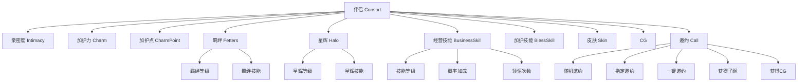
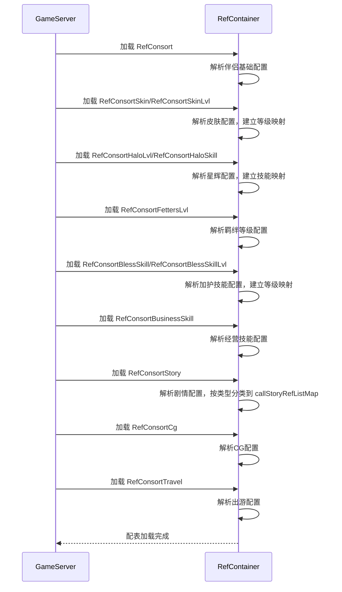

# 伴侣系统 - 数据配表

## 概述

伴侣系统 (ConsortOp, p015) 是游戏中的核心社交养成玩法，玩家可以培养伴侣的好感度、亲密度，解锁皮肤和光环，通过邀约获得子嗣和CG。

## 核心概念



---

## 配表文件列表

| 配表名称 | 文件路径 | 说明 |
|---------|---------|------|
| RefConsort | GameRes/Refs/Consort/RefConsort.java | 伴侣基础配置 |
| RefConsortSkin | GameRes/Refs/Consort/RefConsortSkin.java | 伴侣皮肤配置 |
| RefConsortSkinLvl | GameRes/Refs/Consort/RefConsortSkinLvl.java | 皮肤等级配置 |
| RefConsortHaloLvl | GameRes/Refs/Consort/RefConsortHaloLvl.java | 星辉等级配置 |
| RefConsortHaloSkill | GameRes/Refs/Consort/RefConsortHaloSkill.java | 星辉技能配置 |
| RefConsortFettersLvl | GameRes/Refs/Consort/RefConsortFettersLvl.java | 羁绊等级配置 |
| RefConsortFettersSkill | GameRes/Refs/Consort/RefConsortFettersSkill.java | 羁绊技能配置 |
| RefConsortBlessSkill | GameRes/Refs/Consort/RefConsortBlessSkill.java | 加护技能配置 |
| RefConsortBlessSkillLvl | GameRes/Refs/Consort/RefConsortBlessSkillLvl.java | 加护技能等级配置 |
| RefConsortBusinessSkill | GameRes/Refs/Consort/RefConsortBusinessSkill.java | 经营技能配置 |
| RefConsortStory | GameRes/Refs/Consort/RefConsortStory.java | 伴侣剧情配置 |
| RefConsortCg | GameRes/Refs/Consort/RefConsortCg.java | 伴侣CG配置 |
| RefConsortTravel | GameRes/Refs/Consort/RefConsortTravel.java | 伴侣出游配置 |

---

## 1. 伴侣基础配置 (RefConsort)

**配表名**: `consort`

### 完整字段列表

| 字段名 | 类型 | 必填 | 默认值 | 说明 |
|-------|------|------|--------|------|
| id | long | 是 | - | 伴侣ID（主键） |
| name | String | 是 | - | 伴侣名称 |
| quality | EQuality | 是 | - | 品质（WHITE/GREEN/BLUE/PURPLE/GOLD/RED） |
| relation_hero_id_list | ArrayList&lt;Long&gt; | 否 | [] | 关联大臣ID列表 |
| unlock_gain_item_list | ArrayList&lt;NPCommonCostItem&gt; | 否 | [] | 解锁同时获得的道具列表 |
| init_intimacy | int | 是 | 0 | 初始亲密度 |
| init_charm | int | 是 | 0 | 初始加护力 |
| init_fetters_lvl | int | 是 | 1 | 初始羁绊等级 |
| default_skin_id | long | 是 | - | 默认皮肤ID |
| consort_halo_id | long | 是 | - | 家人星辉ID |
| consort_fetters_skill_id | long | 是 | - | 家人羁绊技能ID |
| bless_skill_id_list | ArrayList&lt;Long&gt; | 否 | [] | 加护技能ID列表 |

### 字段约束

| 字段名 | 约束条件 |
|-------|---------|
| id | > 0，全局唯一 |
| init_intimacy | >= 0 |
| init_charm | >= 0 |
| init_fetters_lvl | >= 1 |
| default_skin_id | 必须存在于 RefConsortSkin |
| consort_halo_id | 必须存在于 RefConsortHaloLvl |
| bless_skill_id_list | 每个ID必须存在于 RefConsortBlessSkill |

### 代码示例

```java
// 获取伴侣配置
RefConsort ref = RefConsort.getMgr().get(consortId);
if (ref == null) {
    USLog.error("伴侣配置不存在: {}", consortId);
    return;
}

// 获取伴侣名称和品质
String name = ref.name;
EQuality quality = ref.quality;

// 获取关联大臣列表
ArrayList<Long> heroIds = ref.relation_hero_id_list;
for (Long heroId : heroIds) {
    // 处理关联大臣
}

// 获取初始属性
int initIntimacy = ref.init_intimacy;
int initCharm = ref.init_charm;
int initFettersLvl = ref.init_fetters_lvl;

// 获取默认皮肤
long defaultSkinId = ref.default_skin_id;

// 获取加护技能列表
ArrayList<RefConsortBlessSkill> blessSkillList = ref.blessSkillList;

// 随机获取邀约事件
Set<Long> triggeredIds = new HashSet<>();
RefConsortStory story = ref.rndCallStory(unlockRefList, triggeredIds);
```

---

## 2. 伴侣皮肤配置 (RefConsortSkin)

**配表名**: `consort_skin`

### 完整字段列表

| 字段名 | 类型 | 必填 | 默认值 | 说明 |
|-------|------|------|--------|------|
| id | long | 是 | - | 皮肤ID（主键） |
| consort_id | long | 是 | - | 所属伴侣ID |
| unlock_cost_item | NPCommonCostItem | 否 | null | 解锁消耗道具 |
| unlock_gain_item_list | ArrayList&lt;NPCommonCostItem&gt; | 否 | [] | 解锁时获得的道具列表 |

### 字段约束

| 字段名 | 约束条件 |
|-------|---------|
| id | > 0，全局唯一 |
| consort_id | 必须存在于 RefConsort.id |

### 皮肤等级配置 (RefConsortSkinLvl)

**配表名**: `consort_skin_lvl`

| 字段名 | 类型 | 必填 | 默认值 | 说明 |
|-------|------|------|--------|------|
| id | long | 是 | - | 配置ID（主键） |
| skin_id | long | 是 | - | 皮肤ID |
| lvl | int | 是 | - | 皮肤等级 |
| cost_item_list | ArrayList&lt;NPCommonCostItem&gt; | 否 | [] | 升级消耗 |
| effect_list | ArrayList | 否 | [] | 等级效果 |

### 代码示例

```java
// 获取皮肤配置
RefConsortSkin skinRef = RefConsortSkin.getMgr().get(skinId);
if (skinRef == null) {
    return Result.error("皮肤配置不存在");
}

// 检查皮肤归属
if (skinRef.consort_id != consortId) {
    return Result.error("皮肤不属于该伴侣");
}

// 获取解锁消耗
NPCommonCostItem cost = skinRef.unlock_cost_item;
if (cost != null && cost.item_id > 0) {
    // 检查并消耗资源
}

// 获取皮肤等级配置
_TLevelMapMgr<RefConsortSkinLvl> levelMgr = skinRef.getLevelMapMgr();
RefConsortSkinLvl levelRef = levelMgr.getRefByLevel(currentLevel);
```

---

## 3. 星辉配置 (RefConsortHaloLvl / RefConsortHaloSkill)

### 星辉等级 (RefConsortHaloLvl)

**配表名**: `consort_halo_lvl`

| 字段名 | 类型 | 必填 | 默认值 | 说明 |
|-------|------|------|--------|------|
| id | long | 是 | - | 配置ID（主键） |
| halo_id | long | 是 | - | 星辉ID |
| level | int | 是 | - | 星辉等级 |
| cost_item | NPCommonCostItem | 否 | null | 升级消耗 |
| add_intimacy | int | 否 | 0 | 增加的亲密度 |
| add_charm | int | 否 | 0 | 增加的加护力 |
| reward_item_list | ArrayList&lt;NPCommonCostItem&gt; | 否 | [] | 星辉等级奖励 |
| halo_skill_list | ArrayList&lt;ConsortHaloSkillParseObj&gt; | 否 | [] | 星辉技能列表 |

### 字段约束

| 字段名 | 约束条件 |
|-------|---------|
| level | >= 1 |
| add_intimacy | >= 0 |
| add_charm | >= 0 |

### 代码示例

```java
// 获取星辉等级配置
RefConsortHaloLvl haloLvlRef = RefConsortHaloLvl.getMgr().get(id);
if (haloLvlRef == null) {
    return null;
}

// 获取升级消耗
NPCommonCostItem cost = haloLvlRef.cost_item;

// 获取技能列表
ArrayList<ConsortHaloSkillObj> skills = haloLvlRef.haloSkillList;
for (ConsortHaloSkillObj skill : skills) {
    RefConsortHaloSkill skillRef = skill.getSkilllRef();
    // 处理技能
}

// 查找特定技能
ConsortHaloSkillObj skillObj = haloLvlRef.lookupSkill(skillId);
```

---

## 4. 羁绊配置 (RefConsortFettersLvl)

**配表名**: `consort_fetters_lvl`

### 完整字段列表

| 字段名 | 类型 | 必填 | 默认值 | 说明 |
|-------|------|------|--------|------|
| lvl | int | 是 | - | 羁绊等级（主键） |
| consort_fetters_skill_lvl | int | 是 | - | 对应的羁绊技能等级 |
| need_consort_intimacy | int | 是 | 0 | 升级所需家人亲密度 |
| need_consort_charm | int | 是 | 0 | 升级所需家人加护力 |
| need_consort_num | int | 是 | 0 | 升级所需家人数量 |
| adopt_child_quality_id | long | 否 | 0 | 可收养学生资质ID |
| graduate_get_item_num | int | 否 | 0 | 获得的道具数量 |
| income_bonus | long | 否 | 0 | 收益天资加成（万分比） |
| study_bonus | int | 否 | 0 | 教学经验加成（万分比） |
| caretaker_bonus_calculate_coefficient | int | 否 | 0 | 监护者加成计算系数（万分比） |

### 字段约束

| 字段名 | 约束条件 |
|-------|---------|
| lvl | >= 1，全局唯一 |
| need_consort_intimacy | >= 0 |
| need_consort_charm | >= 0 |
| need_consort_num | >= 0 |
| income_bonus | 0 ~ 10000 |
| study_bonus | 0 ~ 10000 |

### 代码示例

```java
// 获取羁绊等级配置
RefConsortFettersLvl fettersRef = RefConsortFettersLvl.getMgr().get(nextLevel);
if (fettersRef == null) {
    return Result.error("羁绊等级配置不存在");
}

// 检查升级条件
if (consort.getIntimacy() < fettersRef.need_consort_intimacy) {
    return Result.error("亲密度不足");
}

if (consort.getCharm() < fettersRef.need_consort_charm) {
    return Result.error("加护力不足");
}

// 获取羁绊技能等级
int skillLvl = fettersRef.consort_fetters_skill_lvl;
```

---

## 5. 加护技能配置 (RefConsortBlessSkill / RefConsortBlessSkillLvl)

### 加护技能 (RefConsortBlessSkill)

**配表名**: `consort_bless_skill`

| 字段名 | 类型 | 必填 | 默认值 | 说明 |
|-------|------|------|--------|------|
| bless_skill_id | long | 是 | - | 技能ID（主键） |

### 加护技能等级 (RefConsortBlessSkillLvl)

**配表名**: `consort_bless_skill_lvl`

| 字段名 | 类型 | 必填 | 默认值 | 说明 |
|-------|------|------|--------|------|
| id | long | 是 | - | 配置ID（主键） |
| bless_skill_id | long | 是 | - | 技能ID |
| lvl | int | 是 | - | 技能等级 |
| cost_item_list | ArrayList&lt;NPCommonCostItem&gt; | 否 | [] | 升级消耗 |
| effect_list | ArrayList | 否 | [] | 效果列表 |

### 代码示例

```java
// 获取加护技能配置
RefConsortBlessSkill blessRef = RefConsortBlessSkill.getMgr().get(skillId);
if (blessRef == null) {
    return null;
}

// 获取技能等级配置
_TLevelMapMgr<RefConsortBlessSkillLvl> levelMgr = blessRef.getLevelMapMgr();
RefConsortBlessSkillLvl nextLvlRef = levelMgr.getRefByLevel(currentLevel + 1);

if (nextLvlRef != null) {
    // 检查升级消耗
    ArrayList<NPCommonCostItem> costList = nextLvlRef.cost_item_list;
}
```

---

## 6. 经营技能配置 (RefConsortBusinessSkill)

**配表名**: `consort_business_skill`

### 完整字段列表

| 字段名 | 类型 | 必填 | 默认值 | 说明 |
|-------|------|------|--------|------|
| id | long | 是 | - | 技能ID（主键） |
| property | ESpecAttrType | 是 | NONE | 相性类型（智力/政治/魅力等） |
| unlock_need_intimacy | int | 是 | 0 | 解锁所需亲密度 |
| normal_cost_group_id | int | 否 | 0 | 普通领悟消耗组ID |
| advance_cost_group_id | int | 否 | 0 | 高级领悟消耗组ID |
| normal_add_pro_group_id | int | 否 | 0 | 普通领悟加成概率组ID |
| advance_add_pro_group_id | int | 否 | 0 | 高级领悟加成概率组ID |

### 字段约束

| 字段名 | 约束条件 |
|-------|---------|
| unlock_need_intimacy | >= 0 |

### 代码示例

```java
// 获取经营技能配置
RefConsortBusinessSkill businessRef = RefConsortBusinessSkill.getMgr().get(skillId);
if (businessRef == null) {
    return null;
}

// 检查解锁条件
if (consort.getIntimacy() < businessRef.unlock_need_intimacy) {
    return Result.error("亲密度不足，无法领悟该技能");
}

// 获取相性类型
ESpecAttrType property = businessRef.property;

// 获取领悟消耗
int costGroupId = isAdvanced ? businessRef.advance_cost_group_id : businessRef.normal_cost_group_id;
int addProGroupId = isAdvanced ? businessRef.advance_add_pro_group_id : businessRef.normal_add_pro_group_id;
```

---

## 7. 剧情配置 (RefConsortStory)

**配表名**: `consort_story`

### 完整字段列表

| 字段名 | 类型 | 必填 | 默认值 | 说明 |
|-------|------|------|--------|------|
| id | long | 是 | - | 剧情ID（主键） |
| consort_id | long | 是 | - | 伴侣ID |
| dialog_type | EConsortStoryType | 是 | NONE | 剧情类型 |
| unlock_cg | long | 否 | 0 | 解锁的CG ID |
| unlock_condition | NPPlayerConditionGroupObj | 否 | null | 解锁条件 |

### 字段约束

| 字段名 | 约束条件 |
|-------|---------|
| consort_id | 必须存在于 RefConsort.id |
| unlock_cg | 若 > 0，必须存在于 RefConsortCg |

### 代码示例

```java
// 获取剧情配置
RefConsortStory storyRef = RefConsortStory.getMgr().get(storyId);
if (storyRef == null) {
    return null;
}

// 检查剧情类型
EConsortStoryType type = storyRef.dialog_type;
switch (type) {
    case CALL:
        // 邀约剧情
        break;
    case MARRY:
        // 成为家人剧情
        break;
    case PLAY:
        // 游玩剧情
        break;
}

// 检查解锁条件
NPPlayerConditionGroupObj condition = storyRef.unlock_condition;
if (condition != null && !NPPlayerConditionDealerMgr.IsEnable(condition, userData, null)) {
    return Result.error("解锁条件不满足");
}

// 获取解锁的CG
long unlockCgId = storyRef.unlock_cg;
if (unlockCgId > 0) {
    // 解锁CG
}
```

---

## 8. CG配置 (RefConsortCg)

**配表名**: `consort_cg`

### 完整字段列表

| 字段名 | 类型 | 必填 | 默认值 | 说明 |
|-------|------|------|--------|------|
| cg_id | long | 是 | - | CG ID（主键） |
| consort_id | long | 是 | - | 伴侣ID |
| add | int | 否 | 0 | 加护点加成（万分比） |
| cg_unlock_item_list | ArrayList&lt;NPCommonCostItem&gt; | 否 | [] | CG解锁奖励列表 |

### 字段约束

| 字段名 | 约束条件 |
|-------|---------|
| cg_id | > 0，全局唯一 |
| consort_id | 必须存在于 RefConsort.id |
| add | 0 ~ 10000 |

### 代码示例

```java
// 获取CG配置
RefConsortCg cgRef = RefConsortCg.getMgr().get(cgId);
if (cgRef == null) {
    return null;
}

// 获取加护点加成
int addPercent = cgRef.add; // 万分比

// 获取解锁奖励
ArrayList<NPCommonCostItem> rewards = cgRef.cg_unlock_item_list;
for (NPCommonCostItem item : rewards) {
    // 发放奖励
}
```

---

## 9. 出游配置 (RefConsortTravel)

**配表名**: `consort_travel`

### 完整字段列表

| 字段名 | 类型 | 必填 | 默认值 | 说明 |
|-------|------|------|--------|------|
| id | long | 是 | - | 出游ID（主键） |
| add_bless | int | 否 | 0 | 增加的祝福值 |
| bless_point_multiple | int | 否 | 1 | 加护点翻倍倍数 |
| travel_cost_item | NPCommonCostItem | 否 | null | 旅行消耗（已废弃） |
| time_price_id | int | 否 | 0 | 旅行消耗的time_price |
| giftde_probability | int | 否 | 0 | 出现卷王的概率（万分比） |

### 字段约束

| 字段名 | 约束条件 |
|-------|---------|
| bless_point_multiple | >= 1 |
| giftde_probability | 0 ~ 10000 |

### 代码示例

```java
// 获取出游配置
RefConsortTravel travelRef = RefConsortTravel.getMgr().get(travelId);
if (travelRef == null) {
    return null;
}

// 获取加护点倍数
int multiple = travelRef.bless_point_multiple;

// 检查是否可以获得卷王子嗣
if (travelRef.isGiftde()) {
    // 获得卷王子嗣
}
```

---

## 数据库表结构

### player_consort（伴侣主表）

| 字段名 | 类型 | 必填 | 说明 |
|-------|------|------|------|
| id | long (自增) | 是 | 主键 |
| cid | long | 是 | 玩家CID |
| consortId | long | 是 | 伴侣ID |
| fettersLvl | int | 是 | 羁绊等级 |
| isHaloUnlock | bool | 是 | 星辉是否解锁 |
| haloLvl | int | 是 | 星辉等级 |
| intimacy | long | 是 | 亲密度 |
| initIntimacy | long | 是 | 初始亲密度 |
| charm | long | 是 | 加护力 |
| initCharm | long | 是 | 初始加护力 |
| charmPoint | long | 是 | 加护点数 |
| charmPointRecord | long | 是 | 加护点数历史记录 |
| curSkinId | long | 是 | 当前皮肤ID |
| triggeredCallStoryIdList | bytes | 否 | 已触发的邀约事件ID列表 |
| has_add_chat_friend | bool | 是 | 是否已添加聊天好友 |

**索引**: cid

### player_consort_skin（伴侣皮肤表）

| 字段名 | 类型 | 必填 | 说明 |
|-------|------|------|------|
| id | long | 是 | 主键 |
| cid | long | 是 | 玩家CID |
| consortId | long | 是 | 伴侣ID |
| skinId | long | 是 | 皮肤ID |
| skinLvl | int | 是 | 皮肤等级 |

**索引**: cid

### player_consort_bless_skill（加护技能表）

| 字段名 | 类型 | 必填 | 说明 |
|-------|------|------|------|
| id | long | 是 | 主键 |
| cid | long | 是 | 玩家CID |
| consortId | long | 是 | 伴侣ID |
| skillId | long | 是 | 技能ID |
| skillLvl | int | 是 | 技能等级 |

**索引**: cid

### player_consort_business_skill（经营技能表）

| 字段名 | 类型 | 必填 | 说明 |
|-------|------|------|------|
| id | long | 是 | 主键 |
| cid | long | 是 | 玩家CID |
| consortId | long | 是 | 伴侣ID |
| skillId | long | 是 | 技能ID |
| proAdd | int | 是 | 概率加成 |
| normalOpCount | int | 是 | 普通领悟次数 |
| advanceOpCount | int | 是 | 高级领悟次数 |

**索引**: cid

### player_consort_cg（CG表）

| 字段名 | 类型 | 必填 | 说明 |
|-------|------|------|------|
| id | long | 是 | 主键 |
| cid | long | 是 | 玩家CID |
| cgId | long | 是 | CG ID |
| rewarded | bool | 是 | 是否已领取奖励 |

**索引**: cid

### player_consort_other（其他数据表）

| 字段名 | 类型 | 必填 | 说明 |
|-------|------|------|------|
| id | long | 是 | 主键 |
| cid | long | 是 | 玩家CID |
| randCallConsortIds | bytes | 否 | 随机邀约指定伴侣ID列表 |

**索引**: cid

---

## 枚举定义

### EConsortSourceType（获取途径）

```java
public enum EConsortSourceType {
    NONE,       // 0 - 无
    TRAVEL,     // 1 - 游历获得
    CHAPTER     // 2 - 关卡获得
}
```

### EConsortStoryType（剧情类型）

```java
public enum EConsortStoryType {
    NONE,       // 0 - 无
    PLAY,       // 1 - 游玩
    CALL,       // 2 - 邀约
    MARRY,      // 3 - 成为家人
    FIRST_CALL, // 4 - 首次邀约
    SECOND_CALL // 5 - 二次邀约
}
```

### EBagItemUse_ConsortDrawShowType（伴侣资源类型）

```csharp
public enum EBagItemUse_ConsortDrawShowType {
    CHARM,          // 加护力
    INTIMACY,       // 亲密度
    CHARM_POINT     // 加护点
}
```

---

## 配表加载流程



---

## 配表路径

- 服务端配置：`game_server/GameRes/src/NPGameRes/Refs/Consort/`
- 数据库定义：`game_server/DBTool/source_db/UserServer/player_consort*.py`

---

*文档生成时间: 2026-04-12*
