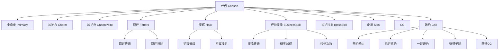
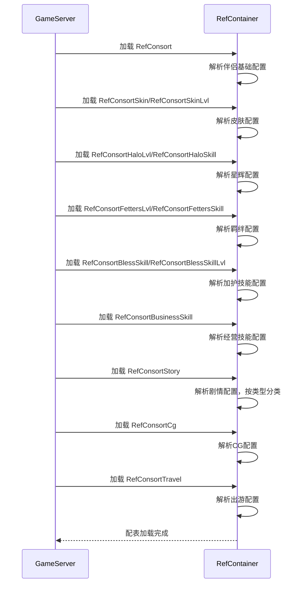

# 伴侣系统 - 数据配表

## 概述

伴侣系统 (ConsortOp, p015) 是游戏中的核心社交养成玩法，玩家可以培养伴侣的好感度、亲密度，解锁皮肤和光环，通过邀约获得子嗣和CG。

## 核心概念



## 配表文件列表

| 配表名称 | 文件路径 | 说明 |
|---------|---------|------|
| RefConsort | GameRes/Refs/Consort/RefConsort.java | 伴侣基础配置 |
| RefConsortSkin | GameRes/Refs/Consort/RefConsortSkin.java | 伴侣皮肤配置 |
| RefConsortSkinLvl | GameRes/Refs/Consort/RefConsortSkinLvl.java | 皮肤等级配置 |
| RefConsortHaloLvl | GameRes/Refs/Consort/RefConsortHaloLvl.java | 星辉等级配置 |
| RefConsortHaloSkill | GameRes/Refs/Consort/RefConsortHaloSkill.java | 星辉技能配置 |
| RefConsortFettersLvl | GameRes/Refs/Consort/RefConsortFettersLvl.java | 羁绊等级配置 |
| RefConsortFettersSkill | GameRes/Refs/Consort/RefConsortFettersSkill.java | 羁绊技能配置 |
| RefConsortBlessSkill | GameRes/Refs/Consort/RefConsortBlessSkill.java | 加护技能配置 |
| RefConsortBlessSkillLvl | GameRes/Refs/Consort/RefConsortBlessSkillLvl.java | 加护技能等级配置 |
| RefConsortBusinessSkill | GameRes/Refs/Consort/RefConsortBusinessSkill.java | 经营技能配置 |
| RefConsortStory | GameRes/Refs/Consort/RefConsortStory.java | 伴侣剧情配置 |
| RefConsortCg | GameRes/Refs/Consort/RefConsortCg.java | 伴侣CG配置 |
| RefConsortTravel | GameRes/Refs/Consort/RefConsortTravel.java | 伴侣出游配置 |

---

## 1. 伴侣基础配置 (RefConsort)

**配表名**: `consort`

### 完整字段列表

| 字段名 | 类型 | 说明 |
|-------|------|------|
| id | long | 伴侣ID |
| name | String | 伴侣名称 |
| quality | EQuality | 品质（WHITE/GREEN/BLUE/PURPLE/GOLD/RED） |
| relation_hero_id_list | ArrayList&lt;Long&gt; | 关联大臣ID列表 |
| unlock_gain_item_list | ArrayList&lt;NPCommonCostItem&gt; | 解锁同时获得的道具列表 |
| init_intimacy | int | 初始亲密度 |
| init_charm | int | 初始加护力 |
| init_fetters_lvl | int | 初始羁绊等级 |
| default_skin_id | long | 默认皮肤ID |
| consort_halo_id | long | 家人星辉ID |
| consort_fetters_skill_id | long | 家人羁绊技能ID |
| bless_skill_id_list | ArrayList&lt;Long&gt; | 加护技能ID列表 |

### 代码示例

```java
// 获取伴侣配置
RefConsort ref = RefConsort.getMgr().get(consortId);

// 获取伴侣名称
String name = ref.name;

// 获取品质
EQuality quality = ref.quality;

// 获取关联大臣列表
ArrayList<Long> heroIds = ref.relation_hero_id_list;

// 获取初始属性
int initIntimacy = ref.init_intimacy;
int initCharm = ref.init_charm;
int initFettersLvl = ref.init_fetters_lvl;

// 获取默认皮肤
long defaultSkinId = ref.default_skin_id;
```

---

## 2. 伴侣皮肤配置 (RefConsortSkin)

### 完整字段列表

| 字段名 | 类型 | 说明 |
|-------|------|------|
| skinId | long | 皮肤ID |
| consort_id | long | 伴侣ID |
| name | String | 皮肤名称 |
| unlock_condition | JSON | 解锁条件 |
| unlock_cost_item | NPCommonCostItem | 解锁消耗道具 |
| effect_list | ArrayList | 特效列表 |

### 皮肤等级配置 (RefConsortSkinLvl)

| 字段名 | 类型 | 说明 |
|-------|------|------|
| skinId | long | 皮肤ID |
| lvl | int | 皮肤等级 |
| upgrade_cost | ArrayList | 升级消耗 |
| effect | JSON | 等级效果 |

---

## 3. 星辉配置 (RefConsortHaloLvl / RefConsortHaloSkill)

### 星辉等级 (RefConsortHaloLvl)

| 字段名 | 类型 | 说明 |
|-------|------|------|
| haloId | long | 星辉ID |
| lvl | int | 星辉等级 |
| upgrade_cost | ArrayList&lt;NPCommonCostItem&gt; | 升级消耗 |
| skill_list | ArrayList&lt;Long&gt; | 该等级解锁的技能列表 |

### 星辉技能 (RefConsortHaloSkill)

| 字段名 | 类型 | 说明 |
|-------|------|------|
| skillId | long | 技能ID |
| name | String | 技能名称 |
| effect_type | int | 效果类型 |
| effect_value | long | 效果值 |
| target_type | int | 目标类型 |

---

## 4. 羁绊配置 (RefConsortFettersLvl / RefConsortFettersSkill)

### 羁绊等级 (RefConsortFettersLvl)

| 字段名 | 类型 | 说明 |
|-------|------|------|
| fettersSkillId | long | 羁绊技能ID |
| lvl | int | 羁绊等级 |
| need_intimacy | long | 所需亲密度 |
| upgrade_cost | ArrayList | 升级消耗 |

### 羁绊技能 (RefConsortFettersSkill)

| 字段名 | 类型 | 说明 |
|-------|------|------|
| skillId | long | 技能ID |
| name | String | 技能名称 |
| effect_type | int | 效果类型 |
| effect_value | long | 效果值 |

---

## 5. 加护技能配置 (RefConsortBlessSkill / RefConsortBlessSkillLvl)

### 加护技能 (RefConsortBlessSkill)

| 字段名 | 类型 | 说明 |
|-------|------|------|
| skillId | long | 技能ID |
| consortId | long | 伴侣ID |
| name | String | 技能名称 |
| max_level | int | 最大等级 |
| unlock_condition | JSON | 解锁条件 |

### 加护技能等级 (RefConsortBlessSkillLvl)

| 字段名 | 类型 | 说明 |
|-------|------|------|
| skillId | long | 技能ID |
| lvl | int | 技能等级 |
| upgrade_cost | ArrayList&lt;NPCommonCostItem&gt; | 升级消耗 |
| effect_list | ArrayList | 效果列表 |

---

## 6. 经营技能配置 (RefConsortBusinessSkill)

### 完整字段列表

| 字段名 | 类型 | 说明 |
|-------|------|------|
| skillId | long | 技能ID |
| name | String | 技能名称 |
| property | ESpecAttrType | 相性类型（智力/政治/魅力等） |
| unlock_intimacy | long | 解锁所需亲密度 |
| max_op_count | int | 最大领悟次数 |
| normal_cost | NPCommonCostItem | 普通领悟消耗 |
| advanced_cost | NPCommonCostItem | 高级领悟消耗 |
| weight | int | 权重 |

---

## 7. 剧情配置 (RefConsortStory)

### 完整字段列表

| 字段名 | 类型 | 说明 |
|-------|------|------|
| id | long | 剧情ID |
| consortId | long | 伴侣ID |
| story_type | EConsortStoryType | 剧情类型（MARRY/CALL等） |
| unlock_condition | JSON | 解锁条件 |
| content | String | 剧情内容 |
| unlock_cg | long | 解锁的CG ID |
| reward_list | ArrayList | 剧情奖励 |

---

## 8. CG配置 (RefConsortCg)

### 完整字段列表

| 字段名 | 类型 | 说明 |
|-------|------|------|
| cgId | long | CG ID |
| consortId | long | 伴侣ID |
| name | String | CG名称 |
| unlock_condition | JSON | 解锁条件 |
| reward_list | ArrayList&lt;NPCommonCostItem&gt; | CG奖励 |

---

## 9. 出游配置 (RefConsortTravel)

### 完整字段列表

| 字段名 | 类型 | 说明 |
|-------|------|------|
| travelId | long | 出游ID |
| consortId | long | 伴侣ID |
| name | String | 出游名称 |
| cost_item | NPCommonCostItem | 出游消耗 |
| event_list | ArrayList | 出游事件列表 |

---

## 数据库表结构

### player_consort（伴侣主表）

| 字段名 | 类型 | 说明 |
|-------|------|------|
| id | long (自增) | 主键 |
| cid | long | 玩家CID |
| consortId | long | 伴侣ID |
| fettersLvl | int | 羁绊等级 |
| isHaloUnlock | bool | 星辉是否解锁 |
| haloLvl | int | 星辉等级 |
| intimacy | long | 亲密度 |
| initIntimacy | long | 初始亲密度 |
| charm | long | 加护力 |
| initCharm | long | 初始加护力 |
| charmPoint | long | 加护点数 |
| charmPointRecord | long | 加护点数历史记录 |
| curSkinId | long | 当前皮肤ID |
| triggeredCallStoryIdList | bytes | 已触发的邀约事件ID列表 |
| has_add_chat_friend | bool | 是否已添加聊天好友 |

### player_consort_skin（伴侣皮肤表）

| 字段名 | 类型 | 说明 |
|-------|------|------|
| id | long | 主键 |
| cid | long | 玩家CID |
| consortId | long | 伴侣ID |
| skinId | long | 皮肤ID |
| lvl | int | 皮肤等级 |

### player_consort_bless_skill（加护技能表）

| 字段名 | 类型 | 说明 |
|-------|------|------|
| id | long | 主键 |
| cid | long | 玩家CID |
| consortId | long | 伴侣ID |
| skillId | long | 技能ID |
| lvl | int | 技能等级 |

### player_consort_business_skill（经营技能表）

| 字段名 | 类型 | 说明 |
|-------|------|------|
| id | long | 主键 |
| cid | long | 玩家CID |
| consortId | long | 伴侣ID |
| skillId | long | 技能ID |
| proAdd | long | 概率加成 |
| normalOpCount | int | 普通领悟次数 |
| advanceOpCount | int | 高级领悟次数 |

### player_consort_cg（CG表）

| 字段名 | 类型 | 说明 |
|-------|------|------|
| id | long | 主键 |
| cid | long | 玩家CID |
| cgId | long | CG ID |
| rewarded | bool | 是否已领取奖励 |

### player_consort_other（其他数据表）

| 字段名 | 类型 | 说明 |
|-------|------|------|
| id | long | 主键 |
| cid | long | 玩家CID |
| randCallConsortIds | bytes | 随机邀约指定伴侣ID列表 |

---

## 枚举定义

### EConsortSourceType（获取途径）

```java
public enum EConsortSourceType {
    NONE,       // 无
    TRAVEL,     // 游历获得
    CHAPTER,    // 关卡获得
    RECRUIT     // 招募获得
}
```

### EConsortStoryType（剧情类型）

```java
public enum EConsortStoryType {
    MARRY,      // 结婚剧情
    CALL,       // 邀约剧情
    DIALOGUE    // 对话剧情
}
```

### EBagItemUse_ConsortDrawShowType（伴侣资源类型）

```csharp
public enum EBagItemUse_ConsortDrawShowType {
    CHARM,          // 加护力
    INTIMACY,       // 亲密度
    CHARM_POINT     // 加护点
}
```

---

## 配表加载流程



---

## 配表路径

- 服务端配置：`game_server/GameRes/src/NPGameRes/Refs/Consort/`
- 数据库定义：`game_server/DBTool/source_db/UserServer/player_consort.py`