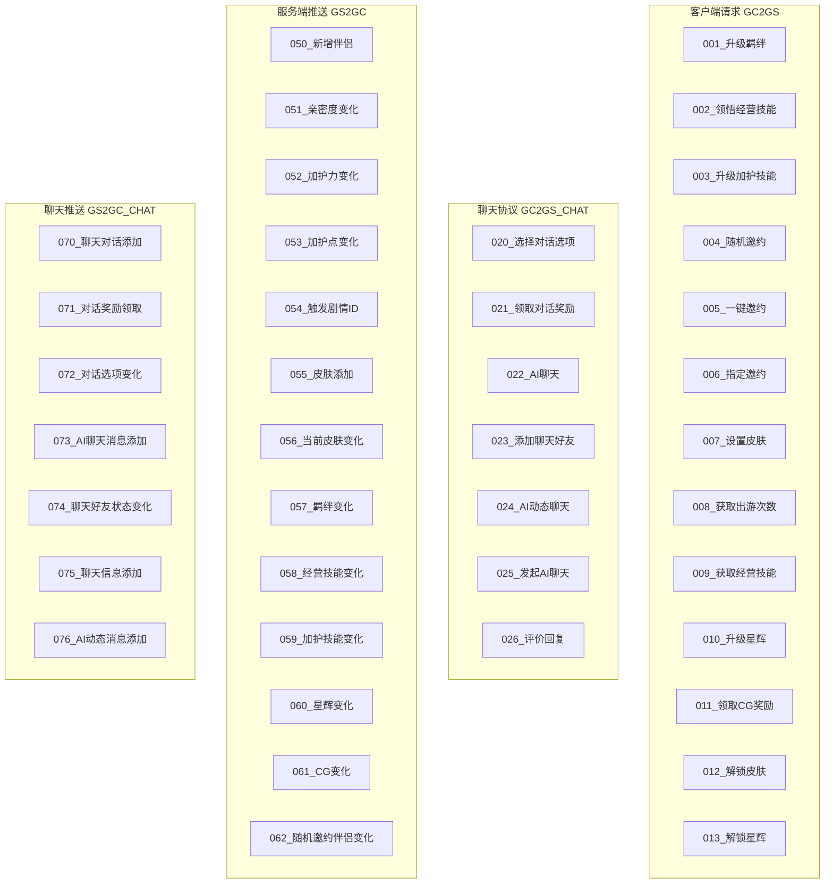
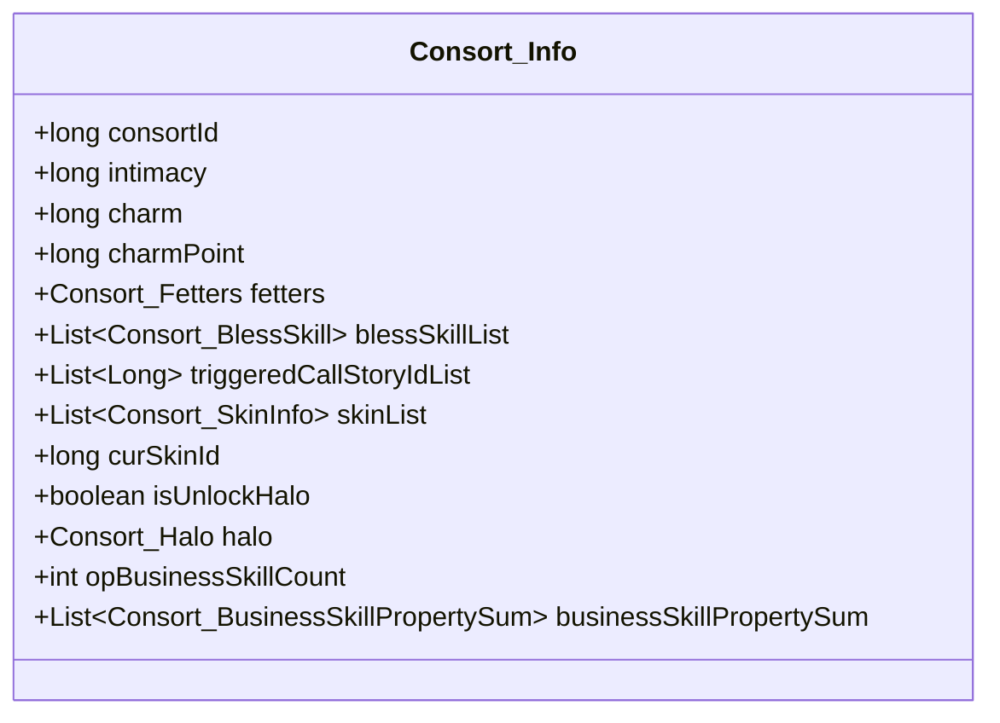
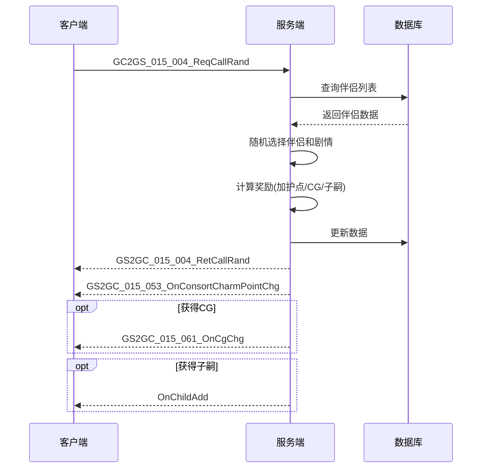
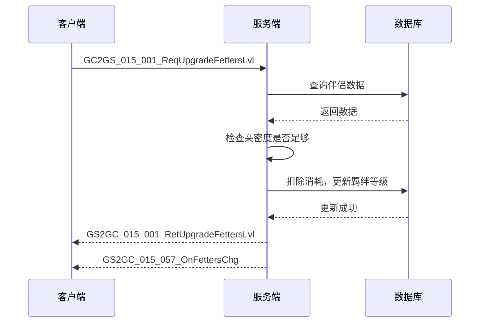
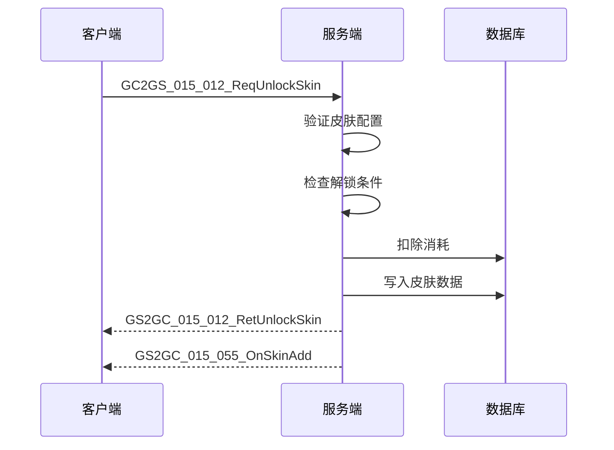

# 伴侣系统 - 协议文档

## 协议编号

模块编号：p015 (ConsortOp)

---

## 协议结构图

---

## 客户端请求协议 (GC2GS)

### GC2GS_015_001_ReqUpgradeFettersLvl

**说明**：请求升级羁绊等级

**协议路径**：`GC2GS/p015_ConsortOp/GC2GS_015_001_ReqUpgradeFettersLvl.java`

**请求参数**：

| 字段名 | 类型 | 必填 | 说明 |
|-------|------|------|------|
| consortId | long | 是 | 伴侣ID |

**返回**：GS2GC_015_001_RetUpgradeFettersLvl

**返回参数**：

| 字段名 | 类型 | 说明 |
|-------|------|------|
| consortId | long | 伴侣ID |
| fetters | Consort_Fetters | 羁绊数据 |

**错误码**：

| 错误码 | 说明 |
|-------|------|
| 15001 | 伴侣不存在 |
| 15003 | 羁绊已达最高等级 |
| 15004 | 亲密度不足 |

---

### GC2GS_015_002_ReqUnderstandBusinessSkill

**说明**：请求领悟经营技能

**协议路径**：`GC2GS/p015_ConsortOp/GC2GS_015_002_ReqUnderstandBusinessSkill.java`

**请求参数**：

| 字段名 | 类型 | 必填 | 说明 |
|-------|------|------|------|
| consortId | long | 是 | 伴侣ID |
| skillId | long | 是 | 技能ID |
| isAdvanced | boolean | 是 | 是否高级领悟 |

**返回**：GS2GC_015_002_RetUnderstandBusinessSkill

**返回参数**：

| 字段名 | 类型 | 说明 |
|-------|------|------|
| consortId | long | 伴侣ID |
| skill | Consort_BusinessSkill | 技能信息 |

---

### GC2GS_015_003_ReqUpgradeBlessSkill

**说明**：请求升级祝福技能

**协议路径**：`GC2GS/p015_ConsortOp/GC2GS_015_003_ReqUpgradeBlessSkill.java`

**请求参数**：

| 字段名 | 类型 | 必填 | 说明 |
|-------|------|------|------|
| consortId | long | 是 | 伴侣ID |
| skillId | long | 是 | 技能ID |

**返回**：GS2GC_015_003_RetUpgradeBlessSkill

**返回参数**：

| 字段名 | 类型 | 说明 |
|-------|------|------|
| consortId | long | 伴侣ID |
| skill | Consort_BlessSkill | 技能信息 |

---

### GC2GS_015_004_ReqCallRand

**说明**：请求随机召唤伴侣

**协议路径**：`GC2GS/p015_ConsortOp/GC2GS_015_004_ReqCallRand.java`

**请求参数**：无

**返回**：GS2GC_015_004_RetCallRand

**返回参数**：

| 字段名 | 类型 | 说明 |
|-------|------|------|
| callRes | Consort_CallRes | 邀约结果 |

---

### GC2GS_015_005_ReqCallAkey

**说明**：请求一键邀约（邀约所有伴侣）

**协议路径**：`GC2GS/p015_ConsortOp/GC2GS_015_005_ReqCallAkey.java`

**请求参数**：无

**返回**：GS2GC_015_005_RetCallAkey

**返回参数**：

| 字段名 | 类型 | 说明 |
|-------|------|------|
| callResList | ArrayList&lt;Consort_CallRes&gt; | 邀约结果列表 |

---

### GC2GS_015_006_ReqCallAppoint

**说明**：请求指定邀约

**协议路径**：`GC2GS/p015_ConsortOp/GC2GS_015_006_ReqCallAppoint.java`

**请求参数**：

| 字段名 | 类型 | 必填 | 说明 |
|-------|------|------|------|
| consortId | long | 是 | 伴侣ID |
| consortTravelId | long | 是 | 出游ID |

**返回**：GS2GC_015_006_RetCallAppoint

**返回参数**：

| 字段名 | 类型 | 说明 |
|-------|------|------|
| callRes | Consort_CallRes | 邀约结果 |

---

### GC2GS_015_007_ReqSetCurSkin

**说明**：请求设置当前皮肤

**协议路径**：`GC2GS/p015_ConsortOp/GC2GS_015_007_ReqSetCurSkin.java`

**请求参数**：

| 字段名 | 类型 | 必填 | 说明 |
|-------|------|------|------|
| consortId | long | 是 | 伴侣ID |
| skinId | long | 是 | 皮肤ID |

**返回**：GS2GC_015_007_RetSetCurSkin

**返回参数**：

| 字段名 | 类型 | 说明 |
|-------|------|------|
| consortId | long | 伴侣ID |
| curSkinId | long | 当前皮肤ID |

---

### GC2GS_015_008_ReqGetRoundTravelCount

**说明**：请求获取游历轮次计数

**协议路径**：`GC2GS/p015_ConsortOp/GC2GS_015_008_ReqGetRoundTravelCount.java`

**请求参数**：

| 字段名 | 类型 | 必填 | 说明 |
|-------|------|------|------|
| travelId | long | 是 | 出游ID |

**返回**：GS2GC_015_008_RetGetRoundTravelCount

**返回参数**：

| 字段名 | 类型 | 说明 |
|-------|------|------|
| travelId | long | 出游ID |
| count | int | 轮次计数 |

---

### GC2GS_015_009_ReqGetAllBusinessSkill

**说明**：请求获取所有经营技能领悟次数

**协议路径**：`GC2GS/p015_ConsortOp/GC2GS_015_009_ReqGetAllBusinessSkill.java`

**请求参数**：

| 字段名 | 类型 | 必填 | 说明 |
|-------|------|------|------|
| consortId | long | 是 | 伴侣ID |

**返回**：GS2GC_015_009_RetGetAllBusinessSkill

**返回参数**：

| 字段名 | 类型 | 说明 |
|-------|------|------|
| consortId | long | 伴侣ID |
| skillList | ArrayList&lt;Consort_BusinessSkill&gt; | 经营技能列表 |

---

### GC2GS_015_010_ReqUpgradeHaloLvl

**说明**：请求升级光环等级

**协议路径**：`GC2GS/p015_ConsortOp/GC2GS_015_010_ReqUpgradeHaloLvl.java`

**请求参数**：

| 字段名 | 类型 | 必填 | 说明 |
|-------|------|------|------|
| consortId | long | 是 | 伴侣ID |

**返回**：GS2GC_015_010_RetUpgradeHaloLvl

**返回参数**：

| 字段名 | 类型 | 说明 |
|-------|------|------|
| consortId | long | 伴侣ID |
| halo | Consort_Halo | 星辉数据 |

**错误码**：

| 错误码 | 说明 |
|-------|------|
| 15009 | 光环已达最高等级 |

---

### GC2GS_015_011_ReqGetCgUnlockReward

**说明**：请求领取CG解锁奖励

**协议路径**：`GC2GS/p015_ConsortOp/GC2GS_015_011_ReqGetCgUnlockReward.java`

**请求参数**：

| 字段名 | 类型 | 必填 | 说明 |
|-------|------|------|------|
| cgId | long | 是 | CG ID |

**返回**：GS2GC_015_011_RetGetCgUnlockReward

**返回参数**：

| 字段名 | 类型 | 说明 |
|-------|------|------|
| cg | Consort_CGInfo | CG信息 |

**错误码**：

| 错误码 | 说明 |
|-------|------|
| 15010 | CG未解锁 |
| 15011 | CG奖励已领取 |

---

### GC2GS_015_012_ReqUnlockSkin

**说明**：请求解锁皮肤

**协议路径**：`GC2GS/p015_ConsortOp/GC2GS_015_012_ReqUnlockSkin.java`

**请求参数**：

| 字段名 | 类型 | 必填 | 说明 |
|-------|------|------|------|
| skinId | long | 是 | 皮肤ID |

**返回**：GS2GC_015_012_RetUnlockSkin

**返回参数**：

| 字段名 | 类型 | 说明 |
|-------|------|------|
| consortId | long | 伴侣ID |
| skin | Consort_SkinInfo | 皮肤信息 |

**错误码**：

| 错误码 | 说明 |
|-------|------|
| 15005 | 皮肤不存在 |
| 15006 | 皮肤已解锁 |
| 15007 | 解锁条件不满足 |

---

### GC2GS_015_013_ReqUnlockHalo

**说明**：请求解锁星辉

**协议路径**：`GC2GS/p015_ConsortOp/GC2GS_015_013_ReqUnlockHalo.java`

**请求参数**：

| 字段名 | 类型 | 必填 | 说明 |
|-------|------|------|------|
| consortId | long | 是 | 伴侣ID |

**返回**：GS2GC_015_013_RetUnlockHalo

**返回参数**：

| 字段名 | 类型 | 说明 |
|-------|------|------|
| consortId | long | 伴侣ID |
| isUnlockHalo | boolean | 星辉是否解锁 |

---

### GC2GS_015_020_ReqConsortChooseDialogueOption

**说明**：请求选择对话选项

**协议路径**：`GC2GS/p015_ConsortOp/GC2GS_015_020_ReqConsortChooseDialogueOption.java`

**请求参数**：

| 字段名 | 类型 | 必填 | 说明 |
|-------|------|------|------|
| consortId | long | 是 | 伴侣ID |
| dialogueId | long | 是 | 对话ID |
| optionIndex | int | 是 | 选项索引 |

**返回**：GS2GC_015_020_RetConsortChooseDialogueOption

**返回参数**：

| 字段名 | 类型 | 说明 |
|-------|------|------|
| consortId | long | 伴侣ID |
| dialogueId | long | 对话ID |
| optionList | ArrayList&lt;Consort_DialogueOption&gt; | 选项列表 |

---

### GC2GS_015_021_ReqConsortDrawDialogueReward

**说明**：请求领取对话奖励

**协议路径**：`GC2GS/p015_ConsortOp/GC2GS_015_021_ReqConsortDrawDialogueReward.java`

**请求参数**：

| 字段名 | 类型 | 必填 | 说明 |
|-------|------|------|------|
| consortId | long | 是 | 伴侣ID |
| dialogueId | long | 是 | 对话ID |

**返回**：GS2GC_015_021_RetConsortDrawDialogueReward

**返回参数**：

| 字段名 | 类型 | 说明 |
|-------|------|------|
| consortId | long | 伴侣ID |
| dialogueId | long | 对话ID |

---

### GC2GS_015_022_ReqConsortAiChat

**说明**：请求伴侣AI聊天

**协议路径**：`GC2GS/p015_ConsortOp/GC2GS_015_022_ReqConsortAiChat.java`

**请求参数**：

| 字段名 | 类型 | 必填 | 说明 |
|-------|------|------|------|
| consortId | long | 是 | 伴侣ID |
| msg | String | 是 | 消息内容 |

**返回**：GS2GC_015_022_RetConsortAiChat

**返回参数**：

| 字段名 | 类型 | 说明 |
|-------|------|------|
| consortId | long | 伴侣ID |
| replyMsg | String | 回复消息 |

---

### GC2GS_015_023_ReqConsortAddChatFriend

**说明**：请求添加伴侣聊天好友

**协议路径**：`GC2GS/p015_ConsortOp/GC2GS_015_023_ReqConsortAddChatFriend.java`

**请求参数**：

| 字段名 | 类型 | 必填 | 说明 |
|-------|------|------|------|
| consortId | long | 是 | 伴侣ID |

**返回**：GS2GC_015_023_RetConsortAddChatFriend

**返回参数**：

| 字段名 | 类型 | 说明 |
|-------|------|------|
| consortId | long | 伴侣ID |
| hasAdd | boolean | 是否已添加 |

---

### GC2GS_015_024_ReqConsortAiChatMoment

**说明**：请求伴侣AI动态聊天

**协议路径**：`GC2GS/p015_ConsortOp/GC2GS_015_024_ReqConsortAiChatMoment.java`

**请求参数**：

| 字段名 | 类型 | 必填 | 说明 |
|-------|------|------|------|
| consortId | long | 是 | 伴侣ID |
| msg | String | 是 | 消息内容 |

**返回**：GS2GC_015_024_RetConsortAiChatMoment

**返回参数**：

| 字段名 | 类型 | 说明 |
|-------|------|------|
| consortId | long | 伴侣ID |
| msgList | ArrayList&lt;String&gt; | 消息列表 |

---

### GC2GS_015_025_ReqConsortInitiateAiChat

**说明**：请求发起AI聊天（伴侣主动发起）

**协议路径**：`GC2GS/p015_ConsortOp/GC2GS_015_025_ReqConsortInitiateAiChat.java`

**请求参数**：

| 字段名 | 类型 | 必填 | 说明 |
|-------|------|------|------|
| consortId | long | 是 | 伴侣ID |

**返回**：GS2GC_015_025_RetConsortInitiateAiChat

**返回参数**：

| 字段名 | 类型 | 说明 |
|-------|------|------|
| consortId | long | 伴侣ID |
| msgList | ArrayList&lt;String&gt; | 消息列表 |

---

### GC2GS_015_026_ReqConsortEvaluateReply

**说明**：请求伴侣评价回复

**协议路径**：`GC2GS/p015_ConsortOp/GC2GS_015_026_ReqConsortEvaluateReply.java`

**请求参数**：

| 字段名 | 类型 | 必填 | 说明 |
|-------|------|------|------|
| consortId | long | 是 | 伴侣ID |
| evaluateId | long | 是 | 评价ID |

**返回**：GS2GC_015_026_RetConsortEvaluateReply

**返回参数**：

| 字段名 | 类型 | 说明 |
|-------|------|------|
| consortId | long | 伴侣ID |
| replyMsg | String | 回复消息 |

---

## 服务端推送协议 (GS2GC)

### GS2GC_015_050_OnConsortAdd

**说明**：通知新增伴侣

**协议路径**：`GS2GC/p015_ConsortOp/GS2GC_015_050_OnConsortAdd.java`

**参数**：

| 字段名 | 类型 | 说明 |
|-------|------|------|
| consort | Consort_Info | 伴侣信息 |
| sourceType | EConsortSourceType | 获取途径（TRAVEL/CHAPTER） |

**触发时机**：玩家通过游历、关卡等方式获得新伴侣时

---

### GS2GC_015_051_OnConsortIntimacyChg

**说明**：通知亲密度变化

**协议路径**：`GS2GC/p015_ConsortOp/GS2GC_015_051_OnConsortIntimacyChg.java`

**参数**：

| 字段名 | 类型 | 说明 |
|-------|------|------|
| consortId | long | 伴侣ID |
| intimacy | long | 新的亲密度 |

**触发时机**：伴侣亲密度发生变化时

---

### GS2GC_015_052_OnConsortCharmChg

**说明**：通知加护力变化

**协议路径**：`GS2GC/p015_ConsortOp/GS2GC_015_052_OnConsortCharmChg.java`

**参数**：

| 字段名 | 类型 | 说明 |
|-------|------|------|
| consortId | long | 伴侣ID |
| charm | long | 新的加护力 |

**触发时机**：伴侣加护力发生变化时

---

### GS2GC_015_053_OnConsortCharmPointChg

**说明**：通知加护点变化

**协议路径**：`GS2GC/p015_ConsortOp/GS2GC_015_053_OnConsortCharmPointChg.java`

**参数**：

| 字段名 | 类型 | 说明 |
|-------|------|------|
| consortId | long | 伴侣ID |
| charmPoint | long | 新的加护点 |

**触发时机**：伴侣加护点发生变化时（邀约获得加护点）

---

### GS2GC_015_054_OnTriggeredCallDlgIdAdd

**说明**：通知触发召唤对话ID添加

**协议路径**：`GS2GC/p015_ConsortOp/GS2GC_015_054_OnTriggeredCallDlgIdAdd.java`

**参数**：

| 字段名 | 类型 | 说明 |
|-------|------|------|
| consortId | long | 伴侣ID |
| triggeredCallStroryId | long | 触发的剧情ID |

**触发时机**：邀约触发剧情事件时

---

### GS2GC_015_055_OnSkinAdd

**说明**：通知皮肤添加

**协议路径**：`GS2GC/p015_ConsortOp/GS2GC_015_055_OnSkinAdd.java`

**参数**：

| 字段名 | 类型 | 说明 |
|-------|------|------|
| consortId | long | 伴侣ID |
| skin | Consort_SkinInfo | 皮肤信息 |

**触发时机**：解锁新皮肤时

---

### GS2GC_015_056_OnCurSkinChg

**说明**：通知当前皮肤变化

**协议路径**：`GS2GC/p015_ConsortOp/GS2GC_015_056_OnCurSkinChg.java`

**参数**：

| 字段名 | 类型 | 说明 |
|-------|------|------|
| consortId | long | 伴侣ID |
| curSkinId | long | 当前皮肤ID |

**触发时机**：更换当前穿戴皮肤时

---

### GS2GC_015_057_OnFettersChg

**说明**：通知羁绊变化

**协议路径**：`GS2GC/p015_ConsortOp/GS2GC_015_057_OnFettersChg.java`

**参数**：

| 字段名 | 类型 | 说明 |
|-------|------|------|
| consortId | long | 伴侣ID |
| fetters | Consort_Fetters | 羁绊数据 |

**触发时机**：羁绊等级升级时

---

### GS2GC_015_058_OnBusinessSkillChg

**说明**：通知经营技能变化

**协议路径**：`GS2GC/p015_ConsortOp/GS2GC_015_058_OnBusinessSkillChg.java`

**参数**：

| 字段名 | 类型 | 说明 |
|-------|------|------|
| consortId | long | 伴侣ID |
| skill | Consort_BusinessSkill | 技能信息 |

**触发时机**：领悟经营技能时

---

### GS2GC_015_059_OnBlessSkillChg

**说明**：通知加护技能变化

**协议路径**：`GS2GC/p015_ConsortOp/GS2GC_015_059_OnBlessSkillChg.java`

**参数**：

| 字段名 | 类型 | 说明 |
|-------|------|------|
| consortId | long | 伴侣ID |
| skill | Consort_BlessSkill | 技能信息 |

**触发时机**：升级加护技能时

---

### GS2GC_015_060_OnHaloChg

**说明**：通知星辉变化

**协议路径**：`GS2GC/p015_ConsortOp/GS2GC_015_060_OnHaloChg.java`

**参数**：

| 字段名 | 类型 | 说明 |
|-------|------|------|
| consortId | long | 伴侣ID |
| halo | Consort_Halo | 星辉数据 |

**触发时机**：星辉等级升级时

---

### GS2GC_015_061_OnCgChg

**说明**：通知CG变化

**协议路径**：`GS2GC/p015_ConsortOp/GS2GC_015_061_OnCgChg.java`

**参数**：

| 字段名 | 类型 | 说明 |
|-------|------|------|
| cg | Consort_CGInfo | CG信息 |

**触发时机**：解锁新CG或领取CG奖励时

---

### GS2GC_015_062_OnRandCallConsortChg

**说明**：通知随机召唤伴侣变化

**协议路径**：`GS2GC/p015_ConsortOp/GS2GC_015_062_OnRandCallConsortChg.java`

**参数**：

| 字段名 | 类型 | 说明 |
|-------|------|------|
| consortIdList | ArrayList&lt;Long&gt; | 指定邀约伴侣ID列表 |

**触发时机**：随机邀约指定伴侣列表变化时

---

### GS2GC_015_070_OnConsortChatDialogueAdd

**说明**：通知伴侣聊天对话添加

**协议路径**：`GS2GC/p015_ConsortOp/GS2GC_015_070_OnConsortChatDialogueAdd.java`

**参数**：

| 字段名 | 类型 | 说明 |
|-------|------|------|
| consortId | long | 伴侣ID |
| dialogue | Consort_ChatDialogue | 对话信息 |

**触发时机**：新增对话时

---

### GS2GC_015_071_OnConsortChatDialogueRewardDraw

**说明**：通知伴侣聊天对话奖励领取

**协议路径**：`GS2GC/p015_ConsortOp/GS2GC_015_071_OnConsortChatDialogueRewardDraw.java`

**参数**：

| 字段名 | 类型 | 说明 |
|-------|------|------|
| consortId | long | 伴侣ID |
| dialogueId | long | 对话ID |

**触发时机**：领取对话奖励时

---

### GS2GC_015_072_OnConsortChatDialogueOptionChg

**说明**：通知伴侣聊天对话选项变化

**协议路径**：`GS2GC/p015_ConsortOp/GS2GC_015_072_OnConsortChatDialogueOptionChg.java`

**参数**：

| 字段名 | 类型 | 说明 |
|-------|------|------|
| consortId | long | 伴侣ID |
| dialogueId | long | 对话ID |
| optionList | ArrayList&lt;Consort_DialogueOption&gt; | 选项列表 |

**触发时机**：选择对话选项时

---

### GS2GC_015_073_OnConsortAiChatMsgAdd

**说明**：通知伴侣AI聊天消息添加

**协议路径**：`GS2GC/p015_ConsortOp/GS2GC_015_073_OnConsortAiChatMsgAdd.java`

**参数**：

| 字段名 | 类型 | 说明 |
|-------|------|------|
| consortId | long | 伴侣ID |
| msgList | ArrayList&lt;String&gt; | 消息列表 |

**触发时机**：AI聊天产生新消息时

---

### GS2GC_015_074_OnConsortChatHasAddChg

**说明**：通知伴侣聊天添加好友状态变化

**协议路径**：`GS2GC/p015_ConsortOp/GS2GC_015_074_OnConsortChatHasAddChg.java`

**参数**：

| 字段名 | 类型 | 说明 |
|-------|------|------|
| consortId | long | 伴侣ID |
| hasAdd | boolean | 是否已添加 |

**触发时机**：添加聊天好友时

---

### GS2GC_015_075_OnConsortChatInfoAdd

**说明**：通知伴侣聊天信息添加

**协议路径**：`GS2GC/p015_ConsortOp/GS2GC_015_075_OnConsortChatInfoAdd.java`

**参数**：

| 字段名 | 类型 | 说明 |
|-------|------|------|
| chatInfo | Consort_ChatInfo | 聊天信息 |

**触发时机**：初始化聊天信息时

---

### GS2GC_015_076_OnConsortAiChatMomentMsgAdd

**说明**：通知伴侣AI动态消息添加

**协议路径**：`GS2GC/p015_ConsortOp/GS2GC_015_076_OnConsortAiChatMomentMsgAdd.java`

**参数**：

| 字段名 | 类型 | 说明 |
|-------|------|------|
| consortId | long | 伴侣ID |
| msgList | ArrayList&lt;String&gt; | 消息列表 |

**触发时机**：AI动态聊天产生新消息时

---

## 数据结构定义

### Consort_Info（伴侣信息）

| 字段名 | 类型 | 说明 |
|-------|------|------|
| consortId | long | 伴侣ID |
| intimacy | long | 亲密度 |
| charm | long | 加护力 |
| charmPoint | long | 加护点 |
| fetters | Consort_Fetters | 羁绊数据 |
| blessSkillList | ArrayList&lt;Consort_BlessSkill&gt; | 加护技能列表 |
| triggeredCallStoryIdList | ArrayList&lt;Long&gt; | 已触发的邀约剧情ID列表 |
| skinList | ArrayList&lt;Consort_SkinInfo&gt; | 皮肤列表 |
| curSkinId | long | 当前穿戴皮肤ID |
| isUnlockHalo | boolean | 星辉是否解锁 |
| halo | Consort_Halo | 星辉数据 |
| opBusinessSkillCount | int | 已操作经营技能数量 |
| businessSkillPropertySum | ArrayList&lt;Consort_BusinessSkillPropertySum&gt; | 经营技能属性汇总 |

---

### Consort_Fetters（羁绊数据）

| 字段名 | 类型 | 说明 |
|-------|------|------|
| lvl | int | 羁绊等级 |

---

### Consort_Halo（星辉数据）

| 字段名 | 类型 | 说明 |
|-------|------|------|
| lvl | int | 星辉等级 |

---

### Consort_BlessSkill（加护技能）

| 字段名 | 类型 | 说明 |
|-------|------|------|
| skillId | long | 技能ID |
| lvl | int | 技能等级 |

---

### Consort_BusinessSkill（经营技能）

| 字段名 | 类型 | 说明 |
|-------|------|------|
| skillId | long | 技能ID |
| proAdd | long | 概率加成 |
| normalOpCount | int | 普通领悟次数 |
| advanceOpCount | int | 高级领悟次数 |

---

### Consort_BusinessSkillPropertySum（经营技能属性汇总）

| 字段名 | 类型 | 说明 |
|-------|------|------|
| attr | ESpecAttrType | 相性类型 |
| proAddSum | long | 概率加成总和 |

---

### Consort_SkinInfo（皮肤信息）

| 字段名 | 类型 | 说明 |
|-------|------|------|
| skinId | long | 皮肤ID |
| lvl | int | 皮肤等级 |

---

### Consort_CGInfo（CG信息）

| 字段名 | 类型 | 说明 |
|-------|------|------|
| cgId | long | CG ID |
| rewarded | boolean | 是否已领取奖励 |

---

### Consort_CallRes（邀约结果）

| 字段名 | 类型 | 说明 |
|-------|------|------|
| consortId | long | 伴侣ID |
| consortStoryId | long | 剧情ID |
| addCharmPoint | long | 增加的加护点数 |
| isGainCg | boolean | 是否获得CG |
| childId | long | 获得子嗣的实例ID（0表示未获得） |

---

### Consort_ChatInfo（聊天信息）

| 字段名 | 类型 | 说明 |
|-------|------|------|
| consortId | long | 伴侣ID |
| dialogueList | ArrayList&lt;Consort_ChatDialogue&gt; | 对话列表 |
| hasAdd | boolean | 是否已添加好友 |

---

### Consort_ChatDialogue（聊天对话）

| 字段名 | 类型 | 说明 |
|-------|------|------|
| dialogueId | long | 对话ID |
| triggerTimeMs | long | 触发时间戳 |
| optionList | ArrayList&lt;Consort_DialogueOption&gt; | 选项列表 |
| hadDraw | boolean | 是否已领奖 |
| drawRewardTimeMs | long | 领奖时间 |

---

### Consort_DialogueOption（对话选项）

| 字段名 | 类型 | 说明 |
|-------|------|------|
| optionId | long | 选项ID |
| content | String | 选项内容 |
| isSelected | boolean | 是否已选择 |

---

## 协议交互流程

### 邀约流程

### 升级羁绊流程

### 解锁皮肤流程

---

## 协议路径

- 服务端协议：`game_server/ServerProtocol/src/GC2GS/p015_ConsortOp/`（请求）、`game_server/ServerProtocol/src/GS2GC/p015_ConsortOp/`（响应）
- 客户端协议：`game_client/Assets/Scripts/ClientProtocol/GC2GS/p015_ConsortOp/`、`game_client/Assets/Scripts/ClientProtocol/GS2GC/p015_ConsortOp/`
- 公共对象：`game_server/ServerProtocol/src/Common/ConsortObj/`

---

*文档生成时间: 2026-04-12*
