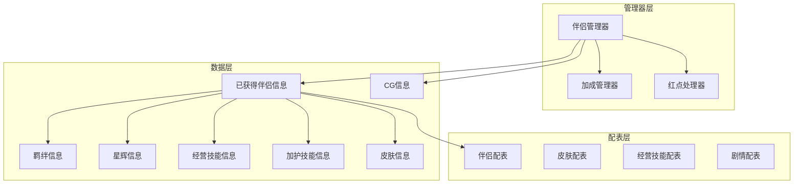

# 伴侣系统 - 客户端开发

## 组件架构



---

## 目录结构

```
GameComponent/Consort/
├── GConsortComponent.cs           # 伴侣管理器（主入口）
├── GGottenConsortInfo.cs          # 已获得伴侣信息
├── ConsortInfo/
│   ├── ConsortInfo.cs             # 伴侣基础信息
│   ├── ConsortRefShowInfo.cs      # 伴侣显示信息
│   ├── GConsortSkinRefShowInfo.cs # 皮肤显示信息
│   ├── _IConsortShowInfo.cs       # 显示信息接口
│   └── _IConsortSkinShowInfo.cs   # 皮肤显示信息接口
├── ConsortFetterInfo.cs           # 羁绊信息
├── ConsortHaloInfo.cs             # 星辉信息
├── ConsortBusinessSkillInfo.cs    # 经营技能信息
├── ConsortBlessSkillInfo.cs       # 加护技能信息
├── ConsortCgInfo.cs               # CG信息
├── GConsortSkinInfo.cs            # 皮肤信息
├── GConsortRemarkInfo.cs          # 备注信息
├── ConsortUtil.cs                 # 工具类
└── BonusMgr.cs                    # 加成管理器
```

---

## GConsortComponent（伴侣管理器）

### 核心属性

```csharp
public partial class GConsortComponent : _ANPBasicPlayerComponent
{
    // 拥有的伴侣列表
    private List<GGottenConsortInfo> _m_consortList;

    // 妃子CG数据字典
    private List<ConsortCgInfo> _m_lConsortCGInfoList;

    // 随机邀约的妃子ID列表
    private List<long> _m_lRandCallConsortIdList;

    // 总亲密度
    private long _m_allIntimacyNum;

    // 总魅力值
    private long _m_allCharmNum;

    // 备注信息
    private GConsortRemarkInfo _m_remarkInfo;

    // 红点处理器
    private RedTipDealer _m_redTip;

    // 加成管理器
    private BonusMgr _m_bonusMgr;
}
```

### 公开属性

```csharp
/// <summary>
/// 拥有的妃子列表
/// </summary>
public List<GGottenConsortInfo> consortList { get; }

/// <summary>
/// 妃子CG信息
/// </summary>
public List<ConsortCgInfo> consortCgInfoList { get; }

/// <summary>
/// 总亲密度
/// </summary>
public long allIntimacyNum { get; }

/// <summary>
/// 总魅力值
/// </summary>
public long allCharmNum { get; }

/// <summary>
/// 随机邀约伴侣ID列表
/// </summary>
public List<long> randCallConsortIdList { get; }
```

### 初始化配置

```csharp
// 支持提前初始化
public override bool canPreInit { get { return true; } }
```

### 核心方法

#### 获取伴侣信息

```csharp
/// <summary>
/// 获取妃子信息
/// </summary>
/// <param name="_consortId">伴侣ID</param>
/// <returns>伴侣信息，不存在返回null</returns>
public GGottenConsortInfo getConsortInfo(long _consortId)
{
    GGottenConsortInfo gottenConsortInfo = null;
    for (int i = 0; i < _m_consortList.Count; i++)
    {
        gottenConsortInfo = _m_consortList[i];
        if (gottenConsortInfo.consortId == _consortId)
            return gottenConsortInfo;
    }
    return null;
}
```

#### 添加伴侣信息

```csharp
/// <summary>
/// 获取妃子信息
/// </summary>
/// <param name="_consortInfo">伴侣协议数据</param>
public void addConsortInfo(Consort_Info _consortInfo)
{
    if(_consortInfo == null)
        return;

    GGottenConsortInfo gottenConsortInfo = getConsortInfo(_consortInfo.getConsortId());
    if (null != gottenConsortInfo)
    {
        // 更新已有伴侣
        _m_allIntimacyNum -= gottenConsortInfo.intimacy;
        _m_allCharmNum -= gottenConsortInfo.charm;
        gottenConsortInfo.updateConsortInfo(_consortInfo);
        _m_allIntimacyNum += gottenConsortInfo.intimacy;
        _m_allCharmNum += gottenConsortInfo.charm;
        return;
    }

    // 新增伴侣
    gottenConsortInfo = new GGottenConsortInfo(_consortInfo);
    _m_consortList.Add(gottenConsortInfo);
    _m_allIntimacyNum += gottenConsortInfo.intimacy;
    _m_allCharmNum += gottenConsortInfo.charm;

    _m_bonusMgr?.initConsort(gottenConsortInfo);

    // 抛出新增情人消息
    WinMsg.SendMsg(WinMsgType.ON_CONSORT_ADD, gottenConsortInfo.consortId);
}
```

#### 检查伴侣是否存在

```csharp
/// <summary>
/// 检查是否拥有指定伴侣
/// </summary>
/// <param name="_consortId">伴侣ID</param>
/// <returns>是否拥有</returns>
public bool hasConsort(long _consortId)
{
    return getConsortInfo(_consortId) != null;
}
```

---

## 请求协议方法

### 升级羁绊

```csharp
/// <summary>
/// 请求升级羁绊等级
/// </summary>
/// <param name="_consortInfo">伴侣信息</param>
/// <param name="_dealDone">成功回调</param>
/// <param name="_dealFail">失败回调</param>
public void reqUpgradeFettersLvl(GGottenConsortInfo _consortInfo,
    Action<GS2GC_015_001_RetUpgradeFettersLvl> _dealDone,
    Action _dealFail)
{
    if (_consortInfo == null || _consortInfo.fetterInfo == null)
    {
        _dealFail?.Invoke();
        return;
    }

    if (!ConsortFetterInfo.checkCanLevelUp(_consortInfo, _consortInfo.fetterInfo, true))
    {
        _dealFail?.Invoke();
        return;
    }

    NPGSClientListener.sendRequestByLog(
        GSWriter_015_ConsortOp.make_001_ReqUpgradeFettersLvl(_consortInfo.consortId),
        new CommonRequestCallbackProtocolDealer<GS2GC_015_001_RetUpgradeFettersLvl>((_info) =>
        {
            _dealDone?.Invoke(_info);
        }, (_error) =>
        {
            NPGUIAddSceneCenterTip.instance.showErrorInfo(_error);
            _dealFail?.Invoke();
        }));
}
```

### 领悟经营技能

```csharp
/// <summary>
/// 请求领悟经营技能
/// </summary>
/// <param name="_consortId">伴侣ID</param>
/// <param name="_skillId">技能ID</param>
/// <param name="_isAdvanced">是否高级领悟</param>
/// <param name="_dealDone">成功回调</param>
/// <param name="_dealFail">失败回调</param>
public void reqUnderstandBusinessSkill(long _consortId, long _skillId, bool _isAdvanced,
    Action<GS2GC_015_002_RetUnderstandBusinessSkill> _dealDone,
    Action _dealFail)
{
    NPGSClientListener.sendRequestByLog(
        GSWriter_015_ConsortOp.make_002_ReqUnderstandBusinessSkill(_consortId, _skillId, _isAdvanced),
        new CommonRequestCallbackProtocolDealer<GS2GC_015_002_RetUnderstandBusinessSkill>((_info) =>
        {
            _dealDone?.Invoke(_info);
        }, (_error) =>
        {
            NPGUIAddSceneCenterTip.instance.showErrorInfo(_error);
            _dealFail?.Invoke();
        }));
}
```

### 升级加护技能

```csharp
/// <summary>
/// 请求升级加护技能等级
/// </summary>
/// <param name="_consortId">伴侣ID</param>
/// <param name="_skillId">技能ID</param>
/// <param name="_dealDone">成功回调</param>
/// <param name="_dealFail">失败回调</param>
public void reqUpgradeBlessSkill(long _consortId, long _skillId,
    Action<GS2GC_015_003_RetUpgradeBlessSkill> _dealDone,
    Action _dealFail)
{
    NPGSClientListener.sendRequestByLog(
        GSWriter_015_ConsortOp.make_003_ReqUpgradeBlessSkill(_consortId, _skillId),
        new CommonRequestCallbackProtocolDealer<GS2GC_015_003_RetUpgradeBlessSkill>((_info) =>
        {
            _dealDone?.Invoke(_info);
        }, (_error) =>
        {
            NPGUIAddSceneCenterTip.instance.showErrorInfo(_error);
            _dealFail?.Invoke();
        }));
}
```

### 随机邀约

```csharp
/// <summary>
/// 请求随机邀约
/// </summary>
/// <param name="_dealDone">成功回调</param>
/// <param name="_dealFail">失败回调</param>
public void reqCallRand(Action<GS2GC_015_004_RetCallRand> _dealDone, Action _dealFail)
{
    NPGSClientListener.sendRequestByLog(
        GSWriter_015_ConsortOp.make_004_ReqCallRand(),
        new CommonRequestCallbackProtocolDealer<GS2GC_015_004_RetCallRand>((_info) =>
        {
            _dealDone?.Invoke(_info);
        }, (_error) =>
        {
            NPGUIAddSceneCenterTip.instance.showErrorInfo(_error);
            _dealFail?.Invoke();
        }));
}
```

### 一键邀约

```csharp
/// <summary>
/// 请求一键邀约
/// </summary>
/// <param name="_dealDone">成功回调</param>
/// <param name="_dealFail">失败回调</param>
public void reqCallAkey(Action<GS2GC_015_005_RetCallAkey> _dealDone, Action _dealFail)
{
    NPGSClientListener.sendRequestByLog(
        GSWriter_015_ConsortOp.make_005_ReqCallAkey(),
        new CommonRequestCallbackProtocolDealer<GS2GC_015_005_RetCallAkey>((_info) =>
        {
            _dealDone?.Invoke(_info);
        }, (_error) =>
        {
            NPGUIAddSceneCenterTip.instance.showErrorInfo(_error);
            _dealFail?.Invoke();
        }));
}
```

### 指定邀约

```csharp
/// <summary>
/// 请求指定邀约
/// </summary>
/// <param name="_consortId">伴侣ID</param>
/// <param name="_consortTravelId">出游ID</param>
/// <param name="_dealDone">成功回调</param>
/// <param name="_dealFail">失败回调</param>
public void reqCallAppoint(long _consortId, long _consortTravelId,
    Action<GS2GC_015_006_RetCallAppoint> _dealDone,
    Action _dealFail)
{
    NPGSClientListener.sendRequestByLog(
        GSWriter_015_ConsortOp.make_006_ReqCallAppoint(_consortId, _consortTravelId),
        new CommonRequestCallbackProtocolDealer<GS2GC_015_006_RetCallAppoint>((_info) =>
        {
            _dealDone?.Invoke(_info);
        }, (_error) =>
        {
            NPGUIAddSceneCenterTip.instance.showErrorInfo(_error);
            _dealFail?.Invoke();
        }));
}
```

### 设置皮肤

```csharp
/// <summary>
/// 请求设置皮肤
/// </summary>
/// <param name="_consortId">伴侣ID</param>
/// <param name="_skinId">皮肤ID</param>
/// <param name="_dealDone">成功回调</param>
/// <param name="_dealFail">失败回调</param>
public void reqSetCurSkin(long _consortId, long _skinId,
    Action<GS2GC_015_007_RetSetCurSkin> _dealDone,
    Action _dealFail)
{
    NPGSClientListener.sendRequestByLog(
        GSWriter_015_ConsortOp.make_007_ReqSetCurSkin(_consortId, _skinId),
        new CommonRequestCallbackProtocolDealer<GS2GC_015_007_RetSetCurSkin>((_info) =>
        {
            _dealDone?.Invoke(_info);
        }, (_error) =>
        {
            NPGUIAddSceneCenterTip.instance.showErrorInfo(_error);
            _dealFail?.Invoke();
        }));
}
```

### 解锁星辉

```csharp
/// <summary>
/// 请求解锁星辉
/// </summary>
/// <param name="_consortId">伴侣ID</param>
/// <param name="_dealDone">成功回调</param>
/// <param name="_dealFail">失败回调</param>
public void reqUnlockHalo(long _consortId,
    Action<GS2GC_015_013_RetUnlockHalo> _dealDone,
    Action _dealFail)
{
    NPGSClientListener.sendRequestByLog(
        GSWriter_015_ConsortOp.make_013_ReqUnlockHalo(_consortId),
        new CommonRequestCallbackProtocolDealer<GS2GC_015_013_RetUnlockHalo>((_info) =>
        {
            if (_info != null)
            {
                GGottenConsortInfo gottenConsortInfo = getConsortInfo(_consortId);
                if (null == gottenConsortInfo)
                    return;

                gottenConsortInfo.updateHaloUnlockState(true);
                WinMsg.SendMsg(WinMsgType.ON_CONSORT_HALO_UNLOCK_CHG, true);
            }
            _dealDone?.Invoke(_info);
        }, (_error) =>
        {
            NPGUIAddSceneCenterTip.instance.showErrorInfo(_error);
            _dealFail?.Invoke();
        }));
}
```

---

## 消息处理方法

### 新增伴侣

```csharp
/// <summary>
/// 新增情人
/// </summary>
/// <param name="_info">协议数据</param>
public void onConsortAdd(GS2GC_015_050_OnConsortAdd _info)
{
    if (null == _info || _info.getConsort() == null)
        return;

    if (!isInited)
        return;

    addConsortInfo(_info.getConsort());
}
```

### 亲密度变化

```csharp
/// <summary>
/// 亲密度变化
/// </summary>
/// <param name="_info">协议数据</param>
public void onConsortIntimacyChg(GS2GC_015_051_OnConsortIntimacyChg _info)
{
    if (null == _info || !isInited)
        return;

    GGottenConsortInfo gottenConsortInfo = getConsortInfo(_info.getConsortId());
    if (null == gottenConsortInfo)
        return;

    long oldIntimacy = gottenConsortInfo.intimacy;
    List<ConsortStoryRefObj> oldUnlockStoryRefObjList = gottenConsortInfo.getUnlockStoryRefList();

    _m_allIntimacyNum -= oldIntimacy;
    gottenConsortInfo.updateConsortIntimacy(_info.getIntimacy());
    _m_allIntimacyNum += gottenConsortInfo.intimacy;

    // 亲密度变化消息
    WinMsg.SendMsg(WinMsgType.ON_CONSORT_INTIMACY_CHG, gottenConsortInfo.consortId);

    // 展示经营技能解锁弹窗
    showBusinessSkillUnlockPopWnd(oldIntimacy, gottenConsortInfo.intimacy, gottenConsortInfo);
    // 展示剧情解锁弹窗
    showStoryUnlockPopWnd(oldUnlockStoryRefObjList, gottenConsortInfo.getUnlockStoryRefList());
}
```

### 加护力变化

```csharp
/// <summary>
/// 魅力值变化
/// </summary>
/// <param name="_info">协议数据</param>
public void onConsortCharmChg(GS2GC_015_052_OnConsortCharmChg _info)
{
    if (null == _info || !isInited)
        return;

    GGottenConsortInfo gottenConsortInfo = getConsortInfo(_info.getConsortId());
    if (null == gottenConsortInfo)
        return;

    _m_allCharmNum -= gottenConsortInfo.charm;
    gottenConsortInfo.updateConsortCharm(_info.getCharm());
    _m_allCharmNum += gottenConsortInfo.charm;

    WinMsg.SendMsg(WinMsgType.ON_CONSORT_CHARM_CHG, gottenConsortInfo.consortId);
}
```

### 加护点变化

```csharp
/// <summary>
/// 当妃子加护点变化
/// </summary>
/// <param name="_msg">协议数据</param>
public void onConsortCharmPointChg(GS2GC_015_053_OnConsortCharmPointChg _msg)
{
    if (null == _msg || !isInited)
        return;

    GGottenConsortInfo gottenConsortInfo = getConsortInfo(_msg.getConsortId());
    if (null == gottenConsortInfo)
        return;

    long oldValue = gottenConsortInfo.charmPoint;
    gottenConsortInfo.updateConsortCharmPoint(_msg.getCharmPoint());
    WinMsg.SendMsg(WinMsgType.ON_CONSORT_CHARM_POINT_CHG,
        gottenConsortInfo.consortId, oldValue, gottenConsortInfo.charmPoint);
}
```

### 羁绊变化

```csharp
/// <summary>
/// 当家人羁绊数据变化
/// </summary>
/// <param name="_msg">协议数据</param>
public void onFettersChg(GS2GC_015_057_OnFettersChg _msg)
{
    if (null == _msg || !isInited)
        return;

    GGottenConsortInfo gottenConsortInfo = getConsortInfo(_msg.getConsortId());
    if (null == gottenConsortInfo)
        return;

    // 将旧属性加成移除
    _m_bonusMgr?.removeFetterBonus(gottenConsortInfo.fetterInfo);

    // 更新数据
    gottenConsortInfo.updateFetterInfo(_msg.getFetters());

    // 添加新的属性加成
    _m_bonusMgr?.addFetterBonus(gottenConsortInfo.fetterInfo);

    WinMsg.SendMsg(WinMsgType.ON_CONSORT_FETTER_LEVEL_CHG, gottenConsortInfo.consortId);
}
```

### 星辉变化

```csharp
/// <summary>
/// 星辉数据变化
/// </summary>
/// <param name="_msg">协议数据</param>
public void onHaloChg(GS2GC_015_060_OnHaloChg _msg)
{
    if (null == _msg || !isInited)
        return;

    GGottenConsortInfo gottenConsortInfo = getConsortInfo(_msg.getConsortId());
    if (null == gottenConsortInfo)
        return;

    // 将旧属性加成移除
    _m_bonusMgr?.removeHaloBonus(gottenConsortInfo.consortRefObj, gottenConsortInfo.haloInfo);
    gottenConsortInfo.updateHaloInfo(_msg.getHalo());
    // 添加新的属性加成
    _m_bonusMgr?.addHaloBonus(gottenConsortInfo.consortRefObj, gottenConsortInfo.haloInfo);

    WinMsg.SendMsg(WinMsgType.ON_CONSORT_HALO_INFO_CHG, gottenConsortInfo.consortId);
}
```

---

## 工具方法

### 皮肤解锁状态

```csharp
/// <summary>
/// 皮肤解锁状态
/// </summary>
/// <param name="_consortId">伴侣ID</param>
/// <param name="_skinId">皮肤ID</param>
/// <returns>皮肤状态</returns>
public EConsortSkinStateType getConsortSkinUnlockType(long _consortId, long _skinId)
{
    GGottenConsortInfo gottenConsortInfo = getConsortInfo(_consortId);
    EConsortSkinStateType stat = EConsortSkinStateType.CANNOT_UNLOCK;
    if (null != gottenConsortInfo)
    {
        stat = gottenConsortInfo.getSkinUnlockType(_skinId);
    }
    return stat;
}
```

### 检查皮肤是否可解锁

```csharp
/// <summary>
/// 检查皮肤是否可以解锁
/// </summary>
/// <param name="_consortSkinRefObj">皮肤配表</param>
/// <param name="_showTip">是否显示提示</param>
/// <returns>是否可解锁</returns>
public bool checkSkinCanUnlock(GConsortSkinRefObj _consortSkinRefObj, bool _showTip)
{
    if (_consortSkinRefObj == null)
        return false;

    GGottenConsortInfo gottenConsortInfo = getConsortInfo(_consortSkinRefObj.consort_id);
    if (gottenConsortInfo == null)
    {
        if (_showTip)
        {
            NPGUIAddSceneCenterTip.instance.showTextInfo(
                TextTranslate.instance.getLanguage(
                    TransKeyConst.consort_skin_onUnlockSkinConsortNotGotTip_str,
                    GCommon.getItemName(ENPItemType.CONSORT, _consortSkinRefObj.consort_id)));
        }
        return false;
    }

    EConsortSkinStateType skinState = gottenConsortInfo.getSkinUnlockType(_consortSkinRefObj.skinId);
    switch (skinState)
    {
        case EConsortSkinStateType.CAN_UNLOCK:
            return true;
        case EConsortSkinStateType.UNLOCK_NOT_WEARING:
        case EConsortSkinStateType.UNLOCK_WEARING:
            if (_showTip)
            {
                NPGUIAddSceneCenterTip.instance.showTextInfo(
                    TextTranslate.instance.getLanguage(
                        TransKeyConst.consort_skin_onUnlockSkinAlreadyGotTip_none,
                        GCommon.getItemName(ENPItemType.CONSORT, _consortSkinRefObj.consort_id)));
            }
            return false;
        default:
            return false;
    }
}
```

### 是否有未领取的CG奖励

```csharp
/// <summary>
/// 是否有未领取的CG奖励
/// </summary>
/// <returns>是否存在未领取奖励</returns>
public bool hasUnclaimedCgReward()
{
    bool hasUnclaimedCgReward = false;
    if (_m_lConsortCGInfoList != null)
    {
        foreach (ConsortCgInfo cgInfo in _m_lConsortCGInfoList)
        {
            if (cgInfo != null && !cgInfo.rewarded)
            {
                hasUnclaimedCgReward = true;
                break;
            }
        }
    }
    return hasUnclaimedCgReward;
}
```

---

## WinMsg 消息类型

| 消息类型 | 说明 | 参数 |
|---------|------|------|
| ON_CONSORT_ADD | 新增伴侣 | consortId |
| ON_CONSORT_INTIMACY_CHG | 亲密度变化 | consortId |
| ON_CONSORT_CHARM_CHG | 魅力值变化 | consortId |
| ON_CONSORT_CHARM_POINT_CHG | 加护点变化 | consortId, oldValue, newValue |
| ON_CONSORT_SKIN_INFO_ADD | 皮肤添加 | consortId, skinId |
| ON_CONSORT_CUR_SKIN_INFO_CHG | 当前皮肤变化 | consortId |
| ON_CONSORT_FETTER_LEVEL_CHG | 羁绊等级变化 | consortId |
| ON_CONSORT_BUSINESS_SKILL_INFO_CHG | 经营技能变化 | consortId, skillId |
| ON_CONSORT_BLESS_SKILL_INFO_CHG | 加护技能变化 | consortId, skillId |
| ON_CONSORT_HALO_INFO_CHG | 星辉变化 | consortId |
| ON_CONSORT_HALO_UNLOCK_CHG | 星辉解锁状态变化 | isUnlock |
| ON_CONSORT_ADD_CG | 新增CG | cgId |
| ON_CONSORT_CG_CHG | CG变化 | cgId |
| ON_ASSIGN_INVITE_CONSORT_CHG | 指定邀约伴侣变化 | - |
| ON_CONSORT_TRAVEL_COUNT_CHG | 出游次数变化 | travelId |

---

## 皮肤状态枚举

```csharp
public enum EConsortSkinStateType
{
    /// <summary>
    /// 不能解锁
    /// </summary>
    CANNOT_UNLOCK,

    /// <summary>
    /// 可以解锁
    /// </summary>
    CAN_UNLOCK,

    /// <summary>
    /// 已解锁未穿戴
    /// </summary>
    UNLOCK_NOT_WEARING,

    /// <summary>
    /// 已解锁已穿戴
    /// </summary>
    UNLOCK_WEARING
}
```

---

## 注意事项

1. **亲密度上限**：伴侣亲密度有上限，达到上限需要突破
2. **皮肤解锁条件**：皮肤解锁需要满足条件（如拥有对应伴侣、消耗道具等）
3. **AI聊天**：AI聊天需要接入外部AI服务
4. **光环升级**：星辉升级需要消耗资源
5. **属性加成**：羁绊、星辉、经营技能都会影响大臣属性加成
6. **初始化顺序**：伴侣管理器支持提前初始化（canPreInit = true）
7. **消息监听**：通过 WinMsg 机制监听伴侣数据变化
8. **红点处理**：红点状态由 RedTipDealer 管理

---

## 使用示例

### 监听伴侣变化

```csharp
// 注册消息监听
WinMsg.RegisterMsg(WinMsgType.ON_CONSORT_ADD, onConsortAddMsg);
WinMsg.RegisterMsg(WinMsgType.ON_CONSORT_INTIMACY_CHG, onConsortIntimacyChgMsg);

// 处理消息
private void onConsortAddMsg(object _param)
{
    long consortId = (long)_param;
    // 处理新增伴侣
}

private void onConsortIntimacyChgMsg(object _param)
{
    long consortId = (long)_param;
    GGottenConsortInfo info = GConsortComponent.instance.getConsortInfo(consortId);
    // 更新UI显示
}
```

### 获取伴侣属性

```csharp
// 获取伴侣信息
GGottenConsortInfo info = GConsortComponent.instance.getConsortInfo(consortId);
if (info != null)
{
    long intimacy = info.intimacy;
    long charm = info.charm;
    int fetterLvl = info.fetterInfo?.lvl ?? 1;
    int haloLvl = info.haloInfo?.lvl ?? 0;
}
```

---

*文档生成时间: 2026-04-12*
