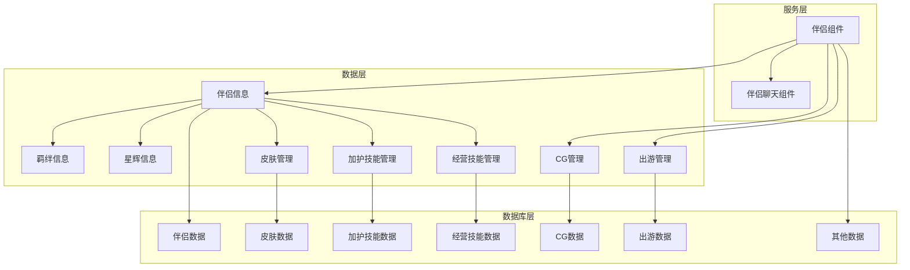
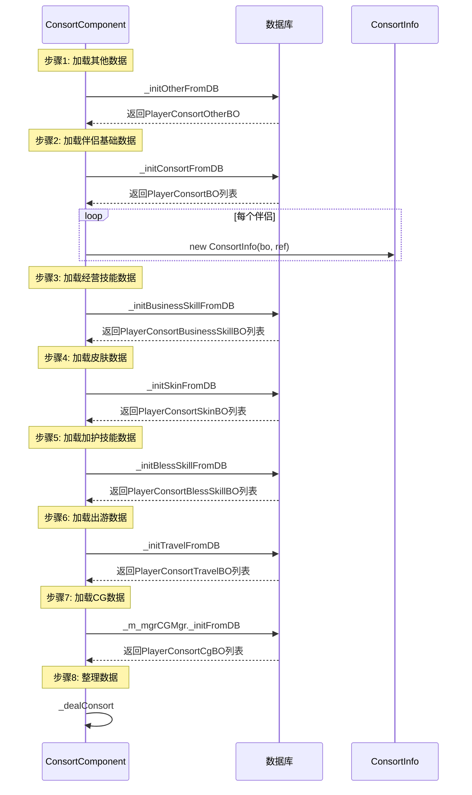

# 伴侣系统 - 服务端开发

## 模块架构



---

## 目录结构

```
UserServer/src/NPUSServer/NPUSUserMgr/UserComp/ConsortComp/
├── ConsortComponent.java           # 伴侣组件（主入口）
├── ConsortInfo.java               # 伴侣信息
├── ConsortCalculator.java         # 属性计算器
├── ConsortFetters/
│   ├── ConsortFettersInfo.java    # 羁绊信息
│   └── ConsortFettersSkillInfo.java # 羁绊技能信息
├── ConsortHalo/
│   ├── ConsortHaloInfo.java       # 星辉信息
│   └── ConsortHaloSkillInfo.java  # 星辉技能信息
├── ConsortBusiness/
│   ├── ConsortBusinessSkillInfo.java   # 经营技能信息
│   └── ConsortBusinessSkillMgr.java    # 经营技能管理器
├── ConsortBless/
│   ├── ConsortBlessSkillInfo.java      # 加护技能信息
│   └── ConsortBlessSkillMgr.java       # 加护技能管理器
├── ConsortSkin/
│   ├── ConsortSkinInfo.java        # 皮肤信息
│   └── ConsortSkinMgr.java         # 皮肤管理器
├── ConsortCGMgr/
│   ├── ConsortCGInfo.java          # CG信息
│   └── ConsortCGMgr.java           # CG管理器
├── ConsortTravel/
│   ├── ConsortTravelInfo.java      # 出游信息
│   └── ConsortTravelMgr.java       # 出游管理器
├── ConsortTriggeredCallStory/
│   ├── ConsortTriggeredCallStoryInfo.java # 已触发邀约事件
│   └── ConsortTriggerStoryResult.java     # 触发结果
├── LazyDealer/
│   ├── ConsortRecalCharmTask.java  # 加护力重算任务
│   └── ConsortRecalIntimacyTask.java # 亲密度重算任务
└── ...

ConsortChatComp/
├── ConsortChatComponent.java       # 聊天组件
├── ConsortChatInfo.java            # 聊天信息
├── ConsortChatDialogueInfo.java    # 对话信息
└── ConsortChatNotUnlockDialogue.java # 未解锁对话
```

---

## ConsortComponent（伴侣组件）

### 核心属性

```java
public class ConsortComponent extends _ANPUserComponent implements _IUserItemBasicDealer
{
    // 数据实例ID
    private long _m_lId;

    // 随机邀约的指定妃子ID列表
    private ArrayList<Long> _m_alRandCallConsortIdList;

    // 家人列表
    private ArrayList<ConsortInfo> _m_alConsortList;

    // 家人已解锁CG数据管理
    private ConsortCGMgr _m_mgrCGMgr;

    // 家人出游数据管理
    private ConsortTravelMgr _m_mgrTravelMgr;

    // 玩家属性加成
    private NPPlayerPropertyContainer _m_pcPlayerPropertyContainer;

    // 玩家所有妃子的亲密度数值
    private long _m_lIntimacySum;

    // 玩家所有加护值数值
    private long _m_lCharmSum;

    // 玩家所有妃子的初始亲密度数值
    private long _m_lInitIntimacySum;

    // 玩家所有初始加护值数值
    private long _m_lInitCharmSum;
}
```

### 初始化流程



### 初始化代码

```java
@Override
protected void _init()
{
    final ALProcess process = ALProcess.CreateProcess("consort_comp_init");

    // 步骤1: 家人基础数据加载
    process.addResDelegateProcess(_doneAction ->
        _initOtherFromDB(_isSucc -> { _doneAction.dealAction(_isSucc); }),
        "consort_other_init",
        () -> { USLog.error(getUSServer(), "player:{} load consort other fail.", getUserData().getCid()); },
        false);

    // 步骤2: 家人数据加载
    process.addResDelegateProcess(_doneAction ->
        _initConsortFromDB(_isSucc -> { _doneAction.dealAction(_isSucc); }),
        "consort_init",
        () -> { USLog.error(getUSServer(), "player:{} load consort fail.", getUserData().getCid()); },
        false);

    // ... 其他步骤

    // 开启执行
    process.dealProcess(new _IEZProcessMonitorNoTimeOut()
    {
        @Override
        public void onRootProecssStop()
        {
            getUserData().setDataLoadFail();
        }

        @Override
        public void onRootProecssSuc()
        {
            setInited();
        }
    });
}
```

---

## ConsortInfo（伴侣信息）

### 核心属性

```java
public class ConsortInfo implements _IHandlerHolder
{
    // 玩家数据
    private ConsortComponent _m_comp;

    // 家人数据Bo
    private PlayerConsortBO _m_boConsort;

    // 家人配表对象
    private RefConsort _m_refConsort;

    // 属性数值
    private long _m_lIntimacy;  // 亲密度
    private long _m_lCharm;     // 加护力

    // 家人羁绊数据
    private ConsortFettersInfo _m_fiFettersInfo;

    // 家人经营技能管理
    private ConsortBusinessSkillMgr _m_mgrBusinessSkillMgr;

    // 家人加护技能管理
    private ConsortBlessSkillMgr _m_mgrBlessSkillInfoMgr;

    // 家人皮肤数据管理
    private ConsortSkinMgr _m_mgrSkinMgr;

    // 家人星辉数据管理
    private ConsortHaloInfo _m_hiHaloInfo;

    // 家人已触发邀约事件数据
    private ConsortTriggeredCallStoryInfo _m_siTriggeredCallStoryInfo;

    // 对大臣属性加成数据容器
    private PlayerAttrPropertyContainer _m_attrPropertyContainer;

    // LazyDealer
    private LazyTaskDealer _m_lazyIntimacyDealer;  // 亲密度重算
    private LazyTaskDealer _m_lazyCharmDealer;     // 加护力重算
}
```

### 构造函数

```java
public ConsortInfo(ConsortComponent _comp, PlayerConsortBO _bo, RefConsort _ref)
{
    _m_comp = _comp;
    _m_boConsort = _bo;
    _m_refConsort = _ref;

    _m_attrPropertyContainer = new PlayerAttrPropertyContainer();

    // 300毫秒间隔执行
    _m_lazyIntimacyDealer = new LazyTaskDealer(new ConsortRecalIntimacyTask(this), 100);
    _m_lazyCharmDealer = new LazyTaskDealer(new ConsortRecalCharmTask(this), 100);

    // 管理对象
    _m_fiFettersInfo = new ConsortFettersInfo(this);
    _m_mgrBusinessSkillMgr = new ConsortBusinessSkillMgr(this);
    _m_mgrBlessSkillInfoMgr = new ConsortBlessSkillMgr(this);
    _m_mgrSkinMgr = new ConsortSkinMgr(this);
    _m_hiHaloInfo = new ConsortHaloInfo(this);
    _m_siTriggeredCallStoryInfo = new ConsortTriggeredCallStoryInfo(this);
}
```

### 协议生成

```java
/**********
 * 家人协议
 */
public Consort_Info toProto()
{
    Consort_Info proto = new Consort_Info();
    proto.setConsortId(getConsortId());
    proto.setIntimacy(getIntimacy());
    proto.setCharm(getCharm());
    proto.setCharmPoint(getCharmPoint());
    proto.setCurSkinId(getCurSkinId());

    // 羁绊数据
    proto.setFetters(getFettersInfo().toProto());

    // 加护技能
    getBlessSkillInfoMgr().makeProto(proto.getBlessSkillList());

    // 皮肤数据
    getSkinMgr().makeProto(proto.getSkinList());

    // 已触发事件数据
    getTriggeredCallStoryInfo().makeProto(proto.getTriggeredCallStoryIdList());

    // 星辉数据
    proto.setIsUnlockHalo(getHaloInfo().isUnlock());
    proto.setHalo(getHaloInfo().toProto());

    // 经营技能
    proto.setOpBusinessSkillCount(getBusinessSkillMgr().calOpSkillCount());
    getBusinessSkillMgr().makePropertySumProto(proto.getBusinessSkillPropertySum());

    return proto;
}
```

---

## 核心业务逻辑

### 修改亲密度

```java
/**********
 * 修改亲密度
 */
public void updateIntimacy(long _intimacy, NPPlayerContext _context)
{
    getUserData().lockUser();

    try
    {
        // 记录变更前的值
        int oriIntimacy = (int)_m_boConsort.getIntimacy();

        // 更新数据
        BM bmObj = getUSServer().getBM();
        _m_boConsort.saveIntimacy(bmObj, _intimacy);

        // 重新计算总亲密度
        recalIntimacy();

        // 记录MJ日志
        if (oriIntimacy != (int)_intimacy)
        {
            MJEventLog.logConsortAttribute(
                getUserData(),
                getConsortId(),
                1, // 培养类型：1=亲密度
                _context.getContextId(),
                oriIntimacy,
                (int)_intimacy
            );
        }
    }
    finally
    {
        getUserData().unlockUser();
    }
}
```

### 增加亲密度

```java
/***************
 * 增加自身亲密度数据
 */
public void incrIntimacy(long _intimacy, NPPlayerContext _context)
{
    getUserData().lockUser();

    try
    {
        long curlIntimacy = getBo().getIntimacy() + _intimacy;
        updateIntimacy(curlIntimacy, _context);
    }
    finally
    {
        getUserData().unlockUser();
    }
}
```

### 修改加护力

```java
/**********
 * 修改自身加护力数据
 */
public void updateCharm(long _charm, NPPlayerContext _context)
{
    getUserData().lockUser();

    try
    {
        // 记录变更前的值
        int oriCharm = (int)_m_boConsort.getCharm();

        // 更新数据
        BM bmObj = getUSServer().getBM();
        _m_boConsort.saveCharm(bmObj, _charm);

        // 重新计算总加护力
        recalCharm();

        // 记录MJ日志
        if (oriCharm != (int)_charm)
        {
            MJEventLog.logConsortAttribute(
                getUserData(),
                getConsortId(),
                3, // 培养类型：3=加护力
                _context.getContextId(),
                oriCharm,
                (int)_charm
            );
        }
    }
    finally
    {
        getUserData().unlockUser();
    }
}
```

### 修改加护点

```java
/**********
 * 修改加护点
 */
public void updateCharmPoint(long _charmPoint, NPPlayerContext _context)
{
    getUserData().lockUser();

    try
    {
        long preValue = getCharmPoint();

        // 更新加护点历史记录
        long newcharmPointRecord = getCharmPointRecord();
        if(_charmPoint > newcharmPointRecord)
        {
            newcharmPointRecord = _charmPoint;
        }

        // 更新数据
        BM bmObj = getUSServer().getBM();
        _m_boConsort.setCharmPoint(bmObj, _charmPoint);
        _m_boConsort.setCharmPointRecord(bmObj, newcharmPointRecord);
        _m_boConsort.saveAllMarked(bmObj);

        // 推送数据
        getUserData().sendMsgToGC(US2GCWriter_015_ConsortOp.make_053_OnConsortCharmPointChg(this));

        // 日志
        ConsortInfo.logResChg(this, ELogConsortResEnum.CHARM_POINT, preValue, _charmPoint);
    }
    finally
    {
        getUserData().unlockUser();
    }
}
```

### 增加资源

```java
/**
 * 增加家人资源类型获取
 */
public void incrConsortRes(EBagItemUse_ConsortDrawShowType _type, long _value, NPPlayerContext _context)
{
    if(EBagItemUse_ConsortDrawShowType.CHARM == _type)
    {
        incrCharm(_value, _context);
    }
    else if(EBagItemUse_ConsortDrawShowType.INTIMACY == _type)
    {
        incrIntimacy(_value, _context);
    }
    else if(EBagItemUse_ConsortDrawShowType.CHARM_POINT == _type)
    {
        incrCharmPoint(_value, _context);
    }
    else
    {
        USLog.error(getUSServer(), "player:{} incr consort:{} res:{} value:{} fail.",
            getUserData().getCid(), getConsortId(), _type, _value);
    }
}
```

---

## 获取伴侣

```java
/**
 * 获取家人
 */
protected ConsortInfo _gainConsort(long _consortId, NPPlayerContext _context)
{
    getUserData().lockUser();

    try
    {
        // 通过事件类型来定义获取途径
        EConsortSourceType sourceType = EConsortSourceType.NONE;
        if (_context.getContextId() == ENPGameEvent.TRAVEL_GAIN_CONSORT.ordinal())
        {
            sourceType = EConsortSourceType.TRAVEL;
        }
        else if (_context.getContextId() == ENPGameEvent.CHAPTER_GAIN_CONSORT.ordinal())
        {
            sourceType = EConsortSourceType.CHAPTER;
        }

        // 已经获得家人
        if(hasConsort(_consortId))
            return null;

        // 获取家人配表
        RefConsort ref = RefConsort.getMgr().get(_consortId);
        if(null == ref)
        {
            USLog.error(getUSServer(), "player:{} gain consort:{} fail, not find ref.",
                getUserData().getCid(), _consortId);
            return null;
        }

        // 构造家人数据
        BM bmObj = getUSServer().getBM();

        PlayerConsortBO bo = new PlayerConsortBO();
        bo.setCid(bmObj, getUserData().getCid());
        bo.setConsortId(bmObj, _consortId);
        bo.setFettersLvl(bmObj, ref.init_fetters_lvl);
        bo.setIntimacy(bmObj, ref.init_intimacy);
        bo.setCharm(bmObj, ref.init_charm);
        bo.insert(bmObj);

        ConsortInfo consort = new ConsortInfo(this, bo, ref);
        _m_alConsortList.add(consort);

        // 穿戴默认皮肤
        consort.setCurSkin(ref.default_skin_id, _context);

        // 计算属性
        consort._initCalConsort();
        // 检查初始化家人的经营技能
        consort.getBusinessSkillMgr().checkUnlockSkill(true);
        // 挂载属性变更处理对象
        consort._initPropertyChgDealer();

        // 更新初始数据
        consort._saveInitValue();
        addInitIntimacy(consort.getInitIntimacy());
        addInitCharm(consort.getInitCharm());

        calIntimacySum();
        calCharmSum();

        // 获取额外奖励
        NPPlayerContext newContext = NPPlayerContext.createNew(_context);
        getUserData().gainItemList(ref.unlock_gain_item_list, newContext);

        // 获取宴会凭证
        getUserData().getDinnerComponent().addPermit(EDinnerPermitType.FAMILY, _consortId, _context);

        // 推送协议
        getUserData().sendMsgToGC(US2GCWriter_015_ConsortOp.make_050_OnConsortAdd(consort, sourceType));

        // 关联大臣的战力重新计算
        consort.relationHeroReCal();

        // 触发事件
        Event_P_GAIN_CONSORT event = new Event_P_GAIN_CONSORT(_context, _consortId);
        getUserData().onLogicEvent(event);

        return consort;
    }
    finally
    {
        getUserData().unlockUser();
    }
}
```

---

## 随机邀约中检查获得子嗣

```java
/**
 * 检查在随机邀约中是否获得子嗣
 */
public ChildInfo checkRandCallBirthChild(boolean _hasCg, NPPlayerContext _context)
{
    // 检查前置条件
    if(!NPPlayerConditionDealerMgr.IsEnable(RefGeneral.Ref().consort_call_gain_child_simple_unlock_id, getUserData(), null))
        return null;

    // 检查是否存在未使用的子嗣位
    boolean hasUnusingSeat = getUserData().getChildComponent().getChildMgr().hasUnusingSeat();
    if(!hasUnusingSeat)
        return null;

    int curRecordCount = (int) getUserData().getRecordComponent().getRecordCount(ENPPlayerRecordParam.CONSORT_RND_CALL_TIMES);

    if (curRecordCount == 0) // 首次邀约
    {
        return null;
    }
    else if(curRecordCount == 1) // 第二次邀约，指定普通子嗣
    {
        return ChildSystem.createChild(this, false, null, _context);
    }
    else // 其他情况
    {
        // 先检查是否必定卷王子嗣
        int giftedCount = (int) getUserData().getParam(ENPPlayerParam.BIRTH_GIFTDE_COUM);
        if (giftedCount > 0)
        {
            giftedCount--;
            getUserData().setParam(ENPPlayerParam.BIRTH_GIFTDE_COUM, giftedCount);
            return ChildSystem.createChild(this, true, null, _context);
        }
        else if(!_hasCg)
        {
            EChildBirthRes birthType = RefGeneral.Ref().consortCallRandPerWeight.random();
            if(birthType != EChildBirthRes.NO_CHILD)
            {
                return ChildSystem.createChild(this, EChildBirthRes.GIFTDE_CHILD == birthType, null, _context);
            }
        }
    }

    return null;
}
```

---

## 数据库表操作

### player_consort（伴侣主表）

```python
# game_server/DBTool/source_db/UserServer/player_consort.py

tableComment = "玩家家人数据"
field = [
    ["long", "cid", "玩家CID"],
    ["long", "consortId", "家人ID"],
    ["int", "fettersLvl", "羁绊等级"],
    ["bool", "isHaloUnlock", "星辉是否解锁"],
    ["int", "haloLvl", "星辉等级"],
    ["long", "intimacy", "亲密度"],
    ["long", "initIntimacy", "初始亲密度"],
    ["long", "charm", "加护力"],
    ["long", "initCharm", "初始加护力"],
    ["long", "charmPoint", "加护力点数"],
    ["long", "curSkinId", "当前皮肤ID"],
    ["bytes", "triggeredCallStoryIdList", "已触发的邀约事件ID列表"],
    ["long", "charmPointRecord", "加护力点数记录"],
    ["bool", "has_add_chat_friend", "是否已添加聊天好友"],
]
key = ["cid"]
```

---

## 日志表

### log_consort_add（获得伴侣日志）

| 字段名 | 类型 | 说明 |
|-------|------|------|
| cid | long | 玩家CID |
| consortId | long | 伴侣ID |
| sourceType | int | 获取途径 |
| allIntimacy | long | 总亲密度 |
| allCharm | long | 总加护力 |
| allCharmPointPer | long | 总加护点加成 |

### log_consort_res_chg（资源变化日志）

| 字段名 | 类型 | 说明 |
|-------|------|------|
| cid | long | 玩家CID |
| consortId | long | 伴侣ID |
| resType | int | 资源类型（1=亲密度, 2=加护点, 3=加护力） |
| preValue | long | 变更前值 |
| newValue | long | 变更后值 |

### log_section_consort_v2（截面日志）

| 字段名 | 类型 | 说明 |
|-------|------|------|
| sectionType | int | 截面日志类型 |
| cid | long | 玩家CID |
| consortId | long | 伴侣ID |
| consortIntimacy | long | 亲密度 |
| consortCharm | long | 加护力 |
| consortSkillPointGain | long | 加护点历史记录 |
| consortFettersLvl | int | 羁绊等级 |
| consortBusinessSkillLvl | int | 经营技能等级 |
| consortBlessSkillLvl | int | 加护技能等级 |

---

## 协议处理

### 协议处理器位置

```
UserServer/src/NPUSServer/NPUserMsgDispather/p015_ConsortOp/
├── MsgDealer_GC2GS_015_001_ReqUpgradeFettersLvl.java
├── MsgDealer_GC2GS_015_002_ReqUnderstandBusinessSkill.java
├── MsgDealer_GC2GS_015_003_ReqUpgradeBlessSkill.java
├── MsgDealer_GC2GS_015_004_ReqCallRand.java
├── MsgDealer_GC2GS_015_005_ReqCallAkey.java
├── MsgDealer_GC2GS_015_006_ReqCallAppoint.java
├── MsgDealer_GC2GS_015_007_ReqSetCurSkin.java
├── MsgDealer_GC2GS_015_010_ReqUpgradeHaloLvl.java
├── MsgDealer_GC2GS_015_011_ReqGainCgReward.java
├── MsgDealer_GC2GS_015_012_ReqUnlockSkin.java
├── MsgDealer_GC2GS_015_013_ReqUnlockHalo.java
├── MsgDealer_GC2GS_015_020_ReqConsortChooseDialogueOption.java
├── MsgDealer_GC2GS_015_021_ReqConsortDrawDialogueReward.java
├── MsgDealer_GC2GS_015_022_ReqConsortAiChat.java
├── MsgDealer_GC2GS_015_023_ReqConsortAddChatFriend.java
├── MsgDealer_GC2GS_015_024_ReqConsortAiChatMoment.java
├── MsgDealer_GC2GS_015_025_ReqConsortInitiateAiChat.java
└── MsgDealer_GC2GS_015_026_ReqConsortEvaluateReply.java
```

### 协议推送Writer

```java
// UserServer/src/NPUSServer/NPUserMsgDispather/Write/US2GCWriter_015_ConsortOp.java

public class US2GCWriter_015_ConsortOp
{
    public static ByteBuffer make_050_OnConsortAdd(ConsortInfo _consort, EConsortSourceType _sourceType);
    public static ByteBuffer make_051_OnConsortIntimacyChg(ConsortInfo _consort);
    public static ByteBuffer make_052_OnConsortCharmChg(ConsortInfo _consort);
    public static ByteBuffer make_053_OnConsortCharmPointChg(ConsortInfo _consort);
    public static ByteBuffer make_055_OnSkinAdd(ConsortInfo _consort, ConsortSkinInfo _skin);
    public static ByteBuffer make_056_OnCurSkinChg(ConsortInfo _consort);
    public static ByteBuffer make_057_OnFettersChg(ConsortInfo _consort);
    public static ByteBuffer make_058_OnBusinessSkillChg(ConsortInfo _consort, ConsortBusinessSkillInfo _skill);
    public static ByteBuffer make_059_OnBlessSkillChg(ConsortInfo _consort, ConsortBlessSkillInfo _skill);
    public static ByteBuffer make_060_OnHaloChg(ConsortInfo _consort);
    public static ByteBuffer make_061_OnCgChg(ConsortCGInfo _cg);
    public static ByteBuffer make_062_OnRandCallConsortChg(NPUSUserData _userData);
}
```

---

## GM命令

```java
// UserServer/src/NPUSServer/GMCommand/Cmds/CmdConsort.java

/**
 * 删除指定家人及其所有数据库数据（GM命令）
 */
public String cmdDelConsort(long _consortId)
{
    getUserData().lockUser();
    try
    {
        // 从内存列表中查找并移除
        ConsortInfo info = null;
        for (int i = 0; i < _m_alConsortList.size(); i++)
        {
            ConsortInfo item = _m_alConsortList.get(i);
            if (item != null && item.getConsortId() == _consortId)
            {
                info = item;
                _m_alConsortList.remove(i);
                break;
            }
        }
        if (null == info)
            return "fail, not find consort.";

        // 清理全局属性加成
        info.cmdDiscard();

        // 更新初始基线
        _m_lInitIntimacySum -= info.getInitIntimacy();
        _m_lInitCharmSum -= info.getInitCharm();

        // 重新计算总亲密度和总加护值
        calIntimacySum();
        calCharmSum();

        BM bm = getUSServer().getBM();
        // 删除主表记录
        info.getBo().del(bm);

        // 批量删除所有关联子表记录
        HashMap<String, Object> conditions = new HashMap<>();
        conditions.put("cid", getUserData().getCid());
        conditions.put("consortId", _consortId);
        bm.getBM(PlayerConsortBlessSkillBO.class).delAll(conditions);
        bm.getBM(PlayerConsortBusinessSkillBO.class).delAll(conditions);
        bm.getBM(PlayerConsortSkinBO.class).delAll(conditions);

        return "ok";
    }
    finally
    {
        getUserData().unlockUser();
    }
}
```

---

## 注意事项

1. **线程安全**：所有修改操作需要获取用户锁（getUserData().lockUser()）
2. **AI聊天**：需要接入外部AI服务
3. **皮肤解锁**：需要验证解锁条件
4. **召唤权重**：影响伴侣出现概率
5. **聊天记录**：需要定期清理
6. **属性计算**：使用LazyTaskDealer延迟计算，避免频繁计算
7. **关联大臣**：伴侣变化会影响关联大臣的属性
8. **截面日志**：记录玩家伴侣系统关键数据快照